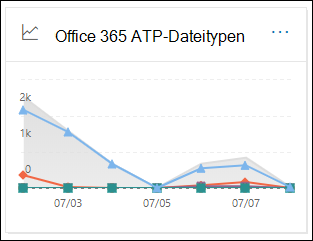
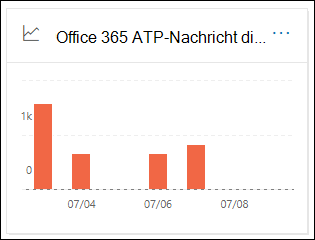
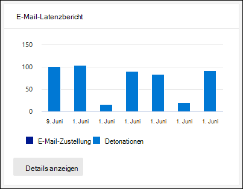
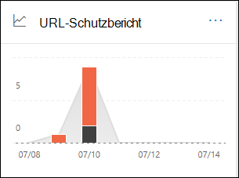

# Anzeigen von Defender Office 365 Berichten im Dashboard "Berichte" im Security & Compliance CenterView Defender for Office 365 reports in the Reports dashboard in the Security & Compliance Center

[!INCLUDE [Microsoft 365 Defender rebranding](../includes/microsoft-defender-for-office.md)]

**Gilt für****Applies to**
- [Microsoft Defender für Office 365 Plan 1 und Plan 2Microsoft Defender for Office 365 plan 1 and plan 2](defender-for-office-365.md)
- [Microsoft 365 DefenderMicrosoft 365 Defender](../defender/microsoft-365-defender.md)

Microsoft Defender für Office 365-Organisationen (z. B. Microsoft 365 E5-Abonnements oder Microsoft Defender für Office 365 Plan 1 oder Microsoft Defender für Office 365 Plan 2-Add-Ons) enthalten eine Vielzahl von sicherheitsbezogenen Berichten.Microsoft Defender for Office 365 organizations (for example, Microsoft 365 E5 subscriptions or Microsoft Defender for Office 365 Plan 1 or Microsoft Defender for Office 365 Plan 2 add-ons) contain a variety of security-related reports. Wenn Sie über die [erforderlichen Berechtigungen verfügen,](#what-permissions-are-needed-to-view-the-defender-for-office-365-reports)können Sie diese Berichte im Security & Compliance Center anzeigen, indem Sie zu **Reports** \> **Dashboard gehen.**If you have the [necessary permissions](#what-permissions-are-needed-to-view-the-defender-for-office-365-reports), you can view these reports in the Security & Compliance Center by going to **Reports** \> **Dashboard**. Öffnen Sie , um direkt zum Dashboard Berichte zu <https://protection.office.com/insightdashboard> wechseln.To go directly to the Reports dashboard, open <https://protection.office.com/insightdashboard>.

## Defender für Office 365-Bericht zu DateitypenDefender for Office 365 file types report

Der **Bericht "Defender für Office 365 Dateitypen"** zeigt den Dateityp an, der von sicheren Anlagen als schädlich [erkannt wurde.](safe-attachments.md)The **Defender for Office 365 file types report** report shows you the type of files detected as malicious by [Safe Attachments](safe-attachments.md).

 Die aggregierte Ansicht des Berichts ermöglicht eine Filterung von 90 Tagen, während die Detailansicht nur 10 Tage Filterung zulässt.The aggregate view of the report allows for 90 days of filtering, while the detail view only allows for 10 days of filtering.

Öffnen Sie zum Anzeigen des Berichts das [Security & Compliance Center,](https://protection.office.com)wechseln Sie zu Berichtsdashboard, und wählen Sie Defender für Office 365  \>  **Dateitypen aus.**To view the report, open the [Security & Compliance Center](https://protection.office.com), go to **Reports** \> **Dashboard** and select **Defender for Office 365 file types**. Öffnen Sie , um direkt zum Bericht zu <https://protection.office.com/reportv2?id=ATPFileReport> wechseln.To go directly to the report, open <https://protection.office.com/reportv2?id=ATPFileReport>.

> [!NOTE]
> Die Informationen in diesem Bericht sind auch im [Bericht "Defender for Office 365" verfügbar.](#defender-for-office-365-message-disposition-report)The information in this report is also available in the [Defender for Office 365 message disposition report](#defender-for-office-365-message-disposition-report).

### Berichtsansicht für den Bericht "Defender for Office 365"-DateitypenReport view for the Defender for Office 365 file types report

Die folgenden Ansichten sind verfügbar:The following views are available:

- **Daten anzeigen nach: Datei**: Das Diagramm enthält die folgenden Informationen:**View data by: File**: The chart contains the following information:

  - **Bösartige Excel Anlagen****Malicious Excel attachments**
  - **Bösartige Flash-Anlagen****Malicious Flash attachments**
  - **Schädliche PDF-Anlagen****Malicious PDF attachments**
  - **Bösartige PowerPoint Anlagen****Malicious PowerPoint attachments**
  - **Bösartige URLs****Malicious URLs**
  - **Schädliche Word-Anlagen****Malicious Word attachments**
  - **Schädliche ausführbare Anlagen****Malicious executable attachments**
  - **Sonstige****Others**

  Wenn Sie den Mauszeiger auf einen bestimmten Tag (Datenpunkt) zeigen, können Sie die Aufschlüsselung der Typen von schädlichen Dateien sehen, die von sicheren [Anlagen](safe-attachments.md) und Schutz vor Schadsoftware [in EOP erkannt wurden.](anti-malware-protection.md)When you hover over a particular day (data point), you can see the breakdown of types of malicious files that were detected by [Safe Attachments](safe-attachments.md) and [anti-malware protection in EOP](anti-malware-protection.md).

  

  Wenn Sie auf **Filter** klicken, können Sie den Bericht mit den folgenden Filtern ändern:If you click **Filters**, you can modify the report with the following filters:

  - **Startdatum** und **Enddatum****Start date** and **End date**
  - Dieselben Dateitypwerte, die im Diagramm angezeigt werden.The same file type values that are visible in the chart.

- **Daten anzeigen nach: Nachricht**: Das Diagramm enthält die folgenden Informationen:**View data by: Message**: The chart contains the following information:

  - **Zugriff blockieren****Block access**
  - **Ersetzte Nachrichten****Messages replaced**
  - **Überwachte Nachrichten****Messages monitored**
  - **Durch dynamische E-Mail-Zustellung** ersetzt: Weitere Informationen finden Sie unter [Dynamic Delivery in Safe Attachments policies](safe-attachments.md#dynamic-delivery-in-safe-attachments-policies).**Replaced by Dynamic Email Delivery**: For more information, see [Dynamic Delivery in Safe Attachments policies](safe-attachments.md#dynamic-delivery-in-safe-attachments-policies).

  

  Wenn Sie auf **Filter** klicken, können Sie den Bericht mit den folgenden Filtern ändern:If you click **Filters**, you can modify the report with the following filters:

  - **Startdatum** und **Enddatum****Start date** and **End date**
  - Die gleichen Nachrichtendispositionswerte, die im Diagramm verfügbar sind, und die **zusätzlichen Nachrichten übergebenen** Wert.The same message disposition values that are available in the chart, and the additional **Messages passed** value.

### Detailtabelle für den Bericht "Defender for Office 365"-DateitypenDetails table view for the Defender for Office 365 file types report

Wenn Sie auf **Detailtabelle anzeigen** klicken, bietet der Bericht eine Nahezu-Echtzeitansicht aller Klicks, die in der Organisation für die letzten 10 Tage vorkommen.If you click **View details table**, the report provides a near-real-time view of all clicks that happen within the organization for the last 10 days. Die angezeigten Informationen hängen von dem Diagramm ab, das Sie betrachtet haben:The information that's shown depends on the chart you were looking at:

- **Daten anzeigen nach: Datei**:**View data by: File**:

  - **Date****Date**
  - **Empfängeradresse****Recipient address**
  - **Absenderadresse****Sender address**
  - **Nachrichten-ID**: Im **Kopfzeilenfeld Message-ID** im Nachrichtenkopf verfügbar und sollte eindeutig sein.**Message ID**: Available in the **Message-ID** header field in the message header and should be unique. Ein Beispielwert ist `<08f1e0f6806a47b4ac103961109ae6ef@server.domain>` (beachten Sie die eckigen Klammern).An example value is `<08f1e0f6806a47b4ac103961109ae6ef@server.domain>` (note the angle brackets).
  - **Datei****File**

  Wenn Sie auf **Filter** klicken, können Sie den Bericht mit den folgenden Filtern ändern:If you click **Filters**, you can modify the report with the following filters:

  - **Startdatum** und **Enddatum****Start date** and **End date**
  - Dieselben Dateitypwerte, die im Diagramm angezeigt werden.The same file type values that are visible in the chart.

- **Daten anzeigen nach: Message**:**View data by: Message**:

  - **Date****Date**
  - **Empfängeradresse****Recipient address**
  - **Absenderadresse****Sender address**
  - **Nachrichten-ID****Message ID**
  - **Datei****File**
  - **Betreff****Subject**

  Wenn Sie auf **Filter** klicken, können Sie die Ergebnisse mit den folgenden Filtern ändern:If you click **Filters**, you can modify the results with the following filters:

  - **Startdatum** und **Enddatum****Start date** and **End date**
  - Die gleichen Nachrichtendispositionswerte, die im Diagramm verfügbar sind, und die **zusätzlichen Nachrichten übergebenen** Wert.The same message disposition values that are available in the chart, and the additional **Messages passed** value.

Klicken Sie auf Bericht anzeigen, um zur Berichtsansicht **zurück zu kommen.**To get back to the reports view, click **View report**.

## Defender für Office 365-Bericht zum NachrichtenstatusDefender for Office 365 message disposition report

Der Bericht zur Disposition **von ATP-Nachrichten** zeigt die Aktionen an, die für E-Mail-Nachrichten ergriffen wurden, die als schädliche Inhalte erkannt wurden.The **ATP Message Disposition** report shows you the actions that were taken for email messages that were detected as having malicious content.

Öffnen Sie zum Anzeigen des Berichts das [Security & Compliance Center,](https://protection.office.com)wechseln Sie zu Berichtsdashboard, und wählen Sie Defender aus, um Office 365 zu  \>  **erhalten.**To view the report, open the [Security & Compliance Center](https://protection.office.com), go to **Reports** \> **Dashboard** and select **Defender for Office 365 message disposition**. Öffnen Sie , um direkt zum Bericht zu <https://protection.office.com/reportv2?id=ATPMessageReport> wechseln.To go directly to the report, open <https://protection.office.com/reportv2?id=ATPMessageReport>.

> [!NOTE]
> Die Informationen in diesem Bericht sind auch im [Bericht "Defender for Office 365" verfügbar.](#defender-for-office-365-file-types-report)The information in this report is also available in the [Defender for Office 365 file types report](#defender-for-office-365-file-types-report).

### Berichtsansicht für den Bericht "Defender for Office 365"Report view for the Defender for Office 365 message disposition report

Die folgenden Ansichten sind verfügbar:The following views are available:

- **Daten anzeigen nach: Nachricht**: Das Diagramm enthält die folgenden Informationen:**View data by: Message**: The chart contains the following information:

  - **Zugriff blockieren****Block access**
  - **Ersetzte Nachrichten****Messages replaced**
  - **Überwachte Nachrichten****Messages monitored**
  - **Durch dynamische E-Mail-Zustellung** ersetzt: Weitere Informationen finden Sie unter [Dynamic Delivery in Safe Attachments policies](safe-attachments.md#dynamic-delivery-in-safe-attachments-policies).**Replaced by Dynamic Email Delivery**: For more information, see [Dynamic Delivery in Safe Attachments policies](safe-attachments.md#dynamic-delivery-in-safe-attachments-policies).

  

  Wenn Sie auf **Filter** klicken, können Sie den Bericht mit den folgenden Filtern ändern:If you click **Filters**, you can modify the report with the following filters:

  - **Startdatum** und **Enddatum****Start date** and **End date**
  - Die gleichen Nachrichtendispositionswerte, die im Diagramm verfügbar sind, und die **zusätzlichen Nachrichten übergebenen** Wert.The same message disposition values that are available in the chart, and the additional **Messages passed** value.

- **Daten anzeigen nach: Datei**: Das Diagramm enthält die folgenden Informationen:**View data by: File**: The chart contains the following information:

  - **Bösartige Excel Anlagen****Malicious Excel attachments**
  - **Bösartige Flash-Anlagen****Malicious Flash attachments**
  - **Schädliche PDF-Anlagen****Malicious PDF attachments**
  - **Bösartige PowerPoint Anlagen****Malicious PowerPoint attachments**
  - **Bösartige URLs****Malicious URLs**
  - **Schädliche Word-Anlagen****Malicious Word attachments**
  - **Schädliche ausführbare Anlagen****Malicious executable attachments**
  - **Sonstige****Others**

  Wenn Sie den Mauszeiger auf einen bestimmten Tag (Datenpunkt) zeigen, können Sie die Aufschlüsselung der Typen von schädlichen Dateien sehen, die von sicheren [Anlagen](safe-attachments.md) und Schutz vor Schadsoftware [in EOP erkannt wurden.](anti-malware-protection.md)When you hover over a particular day (data point), you can see the breakdown of types of malicious files that were detected by [Safe Attachments](safe-attachments.md) and [anti-malware protection in EOP](anti-malware-protection.md).

  

  Wenn Sie auf **Filter** klicken, können Sie den Bericht mit den folgenden Filtern ändern:If you click **Filters**, you can modify the report with the following filters:

  - **Startdatum** und **Enddatum****Start date** and **End date**
  - Dieselben Dateitypwerte, die im Diagramm angezeigt werden.The same file type values that are visible in the chart.

### Detailtabelle für den Bericht "Defender for Office 365 Message Disposition"Details table view for the Defender for Office 365 message disposition report

Wenn Sie auf **Detailtabelle anzeigen** klicken, bietet der Bericht eine Nahezu-Echtzeitansicht aller Klicks, die in der Organisation für die letzten 10 Tage vorkommen.If you click **View details table**, the report provides a near-real-time view of all clicks that happen within the organization for the last 10 days. Die angezeigten Informationen hängen von dem Diagramm ab, das Sie betrachtet haben:The information that's shown depends on the chart you were looking at:

- **Daten anzeigen nach: Message**:**View data by: Message**:

  - **Date****Date**
  - **Empfängeradresse****Recipient address**
  - **Absenderadresse****Sender address**
  - **Nachrichten-ID****Message ID**
  - **Datei****File**
  - **Betreff****Subject**

  Wenn Sie auf **Filter** klicken, können Sie die Ergebnisse mit den folgenden Filtern ändern:If you click **Filters**, you can modify the results with the following filters:

  - **Startdatum** und **Enddatum****Start date** and **End date**
  - Die gleichen Nachrichtendispositionswerte, die im Diagramm verfügbar sind, und die **zusätzlichen Nachrichten übergebenen** Wert.The same message disposition values that are available in the chart, and the additional **Messages passed** value.

- **Daten anzeigen nach: Datei**:**View data by: File**:

  - **Date****Date**
  - **Empfängeradresse****Recipient address**
  - **Absenderadresse****Sender address**
  - **Nachrichten-ID****Message ID**
  - **Datei****File**

  Wenn Sie auf **Filter** klicken, können Sie den Bericht mit den folgenden Filtern ändern:If you click **Filters**, you can modify the report with the following filters:

  - **Startdatum** und **Enddatum****Start date** and **End date**
  - Dieselben Dateitypwerte, die im Diagramm angezeigt werden.The same file type values that are visible in the chart.

Klicken Sie auf Bericht anzeigen, um zur Berichtsansicht **zurück zu kommen.**To get back to the reports view, click **View report**.

## Bericht über die E-Mail-LatenzMail latency report

Der **Bericht über die E-Mail-Latenz** zeigt eine aggregierte Ansicht der E-Mail-Zustellung und detonationslatenz in Ihrer Organisation.The **Mail latency report** shows you an aggregate view of the mail delivery and detonation latency experienced within your organization. Die E-Mail-Zustellungszeiten im Dienst werden von einer Reihe von Faktoren beeinflusst, und die absolute Zustellungszeit in Sekunden ist häufig kein guter Indikator für erfolg oder ein Problem.Mail delivery times in the service are affected by a number of factors, and the absolute delivery time in seconds is often not a good indicator of success or a problem. Eine langsame Zustellungszeit an einem Tag kann als durchschnittliche Lieferzeit an einem anderen Tag betrachtet werden oder umgekehrt.A slow delivery time on one day might be considered an average delivery time on another day, or vice-versa. Der **Bericht über die E-Mail-Latenz** versucht, die Nachrichtenzustellung basierend auf statistischen Daten zu den beobachteten Zustellungszeiten anderer Nachrichten zu qualifizieren:The **Mail latency report** tries to qualify message delivery based on statistical data about the observed delivery times of other messages:

- **50. Perzentil:** Dies ist die Mitte für Nachrichtenzustellungszeiten.**50th percentile**: This is the middle for message delivery times. Sie können diesen Wert als durchschnittliche Lieferzeit betrachten.You can consider this value as an average delivery time.
- **90. Perzentil**: Dies gibt eine hohe Latenz für die Nachrichtenzustellung an.**90th percentile**: This indicates a high latency for message delivery. Nur 10 % der Nachrichten dauerten länger als dieser Wert, um zu liefern.Only 10% of messages took longer than this value to deliver.
- **99. Perzentil**: Dies gibt die höchste Wartezeit für die Nachrichtenzustellung an.**99th percentile**: This indicates the highest latency for message delivery.

Clientseitige und Netzwerklatenz sind nicht enthalten.Client side and network latency are not included.

Öffnen Sie zum Anzeigen des Berichts das [Security & Compliance Center,](https://protection.office.com)wechseln Sie **zu** Berichtsdashboard, und wählen Sie \>  **E-Mail-Latenzbericht aus.**To view the report, open the [Security & Compliance Center](https://protection.office.com), go to **Reports** \> **Dashboard** and select **Mail latency report**. Öffnen Sie , um direkt zum Bericht zu <https://protection.office.com/mailLatencyReport?viewid=P50> wechseln.To go directly to the report, open <https://protection.office.com/mailLatencyReport?viewid=P50>.

### Berichtsansicht für den E-Mail-LatenzberichtReport view for the Mail latency report

Wenn Sie den Bericht öffnen, ist standardmäßig die **Registerkarte 50.** Perzentile ausgewählt.When you open the report, the **50th percentiles** tab is selected by default.

Standardmäßig enthält diese Ansicht ein Diagramm, das mit den folgenden Filtern konfiguriert ist:By default, this view contains a chart that's configured with the following filters:

- **Datum**: Die letzten 7 Tage**Date**: The last 7 days
- **Nachrichtenansicht**:**Message View**:
  - Detonierte NachrichtenDetonated messages

Dieses Diagramm zeigt Nachrichten, die in die folgenden Kategorien unterteilt sind:This chart shows messages organized into the following categories:

- **Wartezeit bei der E-Mail-Zustellung****Mail delivery latency**
- **Verzögerung der Detonation****Detonation latency**

Wenn Sie den Mauszeiger auf eine Kategorie im Diagramm zeigen, wird eine Aufschlüsselung der Wartezeit in den einzelnen Kategorien angezeigt.When you hover over a category in the chart, you can see a breakdown of the latency in each category.

Wenn Sie in **der** Berichtsansicht auf Filter klicken, können Sie die Ergebnisse mit den folgenden Filtern ändern:If you click **Filter** in the report view, you can modify the results with the following filters:

- Alle NachrichtenAll messages
- Nachrichten, die Anlagen oder URLs enthaltenMessages that contain attachments or URLs

Wenn Sie auf die **Registerkarte 90.** Perzentile oder **die Registerkarte 99.** Perzentile klicken, werden dieselben Standardfilter aus der **50.** Perzentilansicht verwendet.If you click the **90th percentiles** tab or the **99th percentiles** tab, the same default filters from the **50th percentiles** view are used.

### Detailtabelle für den Bericht "E-Mail-Latenz"Details table view for the Mail latency report

Die folgenden Informationen werden in der Detailtabelle angezeigt:The following information is shown in the details table view:

- **Date****Date**
- **Perzentile****Percentiles**
- **Anzahl der Nachrichten****Message count**
- **Gesamtlatenz****Overall latency**

Die obigen Informationen zeigen, dass die durchschnittliche Wartezeit am 14. November für alle übermittelten und detonierten **Nachrichten 108,033 Sekunden beträgt.**The above shows that on November 14 the average latency experienced for all messages delivered and detonated was **108.033** seconds.

Die Detailtabelle enthält die gleichen Informationen auf jeder Registerkarte.The details table contains the same information on each tab.

## Threat Protection-StatusberichtThreat protection status report

Der **Statusbericht** zum Bedrohungsschutz ist eine einzelne Ansicht, die Informationen zu schädlichen Inhalten und schädlichen E-Mails enthält, die von [Exchange Online Protection](exchange-online-protection-overview.md) (EOP) und Microsoft Defender für Office 365.The **Threat protection status** report is a single view that brings together information about malicious content and malicious email detected and blocked by [Exchange Online Protection](exchange-online-protection-overview.md) (EOP) and Microsoft Defender for Office 365. Weitere Informationen finden Sie unter [Statusbericht zum Bedrohungsschutz](view-email-security-reports.md#threat-protection-status-report).For more information, see [Threat protection status report](view-email-security-reports.md#threat-protection-status-report).

## BERICHT zum Schutz vor URL-BedrohungenURL threat protection report

Der **Bericht zum Schutz vor URL-Bedrohungen** enthält Zusammenfassungs- und Trendansichten für erkannte Bedrohungen und Aktionen für URL-Klicks im Rahmen von Sicheren [Links](safe-links.md).The **URL threat protection report** provides summary and trend views for threats detected and actions taken on URL clicks as part of [Safe Links](safe-links.md). In diesem Bericht werden keine Klickdaten von Benutzern angezeigt, für die die angewendete Richtlinie für sichere Links die Option **Benutzerklicks** nicht nachverfolgen aktiviert hat.This report will not have click data from users where the Safe Links policy applied has the **Do not track user clicks** option selected.

Öffnen Sie zum Anzeigen des Berichts das [Security & Compliance Center,](https://protection.office.com)wechseln Sie **zu** Berichtsdashboard, und wählen \>  Sie **URL-Schutzbericht aus.**To view the report, open the [Security & Compliance Center](https://protection.office.com), go to **Reports** \> **Dashboard** and select **URL protection report**. Öffnen Sie , um direkt zum Bericht zu <https://protection.office.com/reportv2?id=URLProtectionActionReport> wechseln.To go directly to the report, open <https://protection.office.com/reportv2?id=URLProtectionActionReport>.

> [!NOTE]
> Dies ist ein *Schutztrendbericht,* d. h. Daten stellen Trends in einem größeren Dataset dar.This is a *protection trend report*, meaning data represents trends in a larger dataset. Daher sind die Daten in der aggregierten Ansicht hier nicht in Echtzeit verfügbar, die Daten in der Detailtabelle sind jedoch so, dass möglicherweise eine geringfügige Diskrepanz zwischen den beiden Ansichten angezeigt wird.As a result, the data in the aggregate view is not available in real time here, but the data in the details table view is, so you may see a slight discrepancy between the two views.

### Berichtsansicht für den BERICHT zum Schutz vor URL-BedrohungenReport view for the URL threat protection report

Der **Bericht zum Schutz** vor URL-Bedrohungen verfügt über zwei aggregierte Ansichten, die alle vier Stunden aktualisiert werden und Daten für die letzten 90 Tage enthalten:The **URL threat protection** report has two aggregated views that are refreshed once every four hours that shows data for the last 90 days:

- **URL-Klickschutzaktion**: Zeigt die Anzahl der URL-Klicks von Benutzern in der Organisation und die Ergebnisse des Klicks an:**URL click protection action**: Shows the number of URL clicks by users in the organization and the results of the click:

  - **Blockiert** (der Benutzer wurde an der Navigation zur URL blockiert)**Blocked** (the user was blocked from navigating to the URL)
  - **Blockiert und durchklickt** (der Benutzer hat sich entschieden, weiterhin zur URL zu navigieren)**Blocked and clicked through** (the user has chosen to continue navigating to the URL)
  - **Während der Überprüfung durchklickt** (der Benutzer hat auf den Link geklickt, bevor die Überprüfung abgeschlossen wurde)**Clicked through during scan** (the user has clicked on the link before the scan was complete)

  Ein Klick gibt an, dass der Benutzer über die Sperrseite zur schädlichen Website geklickt hat (Administratoren können das Klicken unter Richtlinien für sichere Links deaktivieren).A click indicates that the user has clicked through the block page to the malicious website (admins can disable click through in Safe Links policies).

  Wenn Sie auf **Filter** klicken, können Sie den Bericht mit den folgenden Filtern ändern:If you click **Filters**, you can modify the report with the following filters:

  - **Startdatum** und **Enddatum****Start date** and **End date**
  - Die verfügbaren Klickschutzaktionen sowie der Wert **Allowed** (der Benutzer konnte zur URL navigieren).The available click protection actions, plus the value **Allowed** (the user was allowed to navigate to the URL).

  

- **URL-Klick nach Anwendung**: Zeigt die Anzahl der URL-Klicks von Anwendungen an, die sichere Links unterstützen:**URL click by application**: Shows the number of URL clicks by applications that support Safe Links:

  - **E-Mail-Client****Email client**
  - **PowerPoint****PowerPoint**
  - **Word****Word**
  - **Excel****Excel**
  - **OneNote****OneNote**
  - **Visio****Visio**
  - **Teams****Teams**
  - **Other****Other**

  Wenn Sie auf **Filter** klicken, können Sie den Bericht mit den folgenden Filtern ändern:If you click **Filters**, you can modify the report with the following filters:

  - **Startdatum** und **Enddatum****Start date** and **End date**
  - Die verfügbaren Anwendungen.The available applications.

### Detailtabelle für den Bericht zum Schutz vor URL-BedrohungenDetails table view for the URL threat protection report

Wenn Sie auf **Detailtabelle anzeigen** klicken, bietet der Bericht eine Fast-Echtzeit-Ansicht aller Klicks, die in der Organisation für die letzten 7 Tage passiert sind, mit den folgenden Details:If you click **View details table**, the report provides a near-real-time view of all clicks that happen within the organization for the last 7 days with the following details:

- **Klickzeit****Click time**
- **Benutzer****User**
- **URL****URL**
- **Action****Action**
- **App****App**

Wenn Sie **in** der Detailtabelle auf Filter klicken, können Sie nach denselben  Kriterien  wie in der Berichtsansicht und auch nach Domänen oder Empfängern filtern, die durch Kommas getrennt sind.If you click **Filters** in the details table view, you can filter by the same criteria as in the report view, and also by **Domains** or **Recipients** separated by commas.

> [!NOTE]
> Der **Filter Domänen** verweist auf die in den Berichtsergebnissen aufgeführte URL-Domäne.The **Domains** filter refers to the URL domain listed in the report results. 

Klicken Sie auf Bericht anzeigen, um zur Berichtsansicht **zurück zu kommen.**To get back to the reports view, click **View report**.

## Weitere zu sehende BerichteAdditional reports to view

Zusätzlich zu den in diesem Artikel beschriebenen Berichten sind weitere Berichte verfügbar, wie in der folgenden Tabelle beschrieben:In addition to the reports described in this article, several other reports are available, as described in the following table:

****

|BerichtReport|ThemaTopic|
|---|---|
|**Explorer** (Microsoft Defender für Office 365 Plan 2) oder **Echtzeiterkennungen** (Microsoft Defender für Office 365 Plan 1)**Explorer** (Microsoft Defender for Office 365 Plan 2) or **real-time detections** (Microsoft Defender for Office 365 Plan 1)|[Sicherheitsrisiken-Explorer (und Echtzeit-Erkennung)Threat Explorer (and real-time detections)](threat-explorer.md)|
|**E-Mail-Sicherheitsberichte,** z. B. der Bericht "Die besten Absender und Empfänger", der Bericht "Spoof-E-Mail" und der Bericht "Spamerkennungen".**Email security reports**, such as the Top senders and recipients report, the Spoof mail report, and the Spam detections report.|[Anzeigen von E-Mail-Sicherheitsberichten im Security & Compliance CenterView email security reports in the Security & Compliance Center](view-email-security-reports.md)|
|**Nachrichtenflussberichte,** z. B. der Weiterleitungsbericht, der Statusbericht "E-Mailflow" und der Bericht "Absender und Empfänger am oberen Rand".**Mail flow reports**, such as the Forwarding report, the Mailflow status report, and the Top senders and recipients report.|[Anzeigen von Nachrichtenflussberichten im Security & Compliance CenterView mail flow reports in the Security & Compliance Center](view-mail-flow-reports.md)|
|**URL-Ablaufverfolgung für sichere Links** (nur PowerShell).**URL trace for Safe Links** (PowerShell only). In der Ausgabe dieses Cmdlets werden die Ergebnisse der Aktionen für sichere Links in den letzten sieben Tagen angezeigt.The output of this cmdlet shows you the results of Safe Links actions over the past seven days.|[Get-UrlTraceGet-UrlTrace](/powershell/module/exchange/get-urltrace)|
|**Ergebnisse des E-Mail-Datenverkehrs für EOP und Microsoft Defender für Office 365** (nur PowerShell).**Mail traffic results for EOP and Microsoft Defender for Office 365** (PowerShell only). Die Ausgabe dieses Cmdlets enthält Informationen zu Domäne, Datum, Ereignistyp, Richtung, Aktion und Nachrichtenanzahl.The output of this cmdlet contains information about Domain, Date, Event Type, Direction, Action, and Message Count.|[Get-MailTrafficATPReportGet-MailTrafficATPReport](/powershell/module/exchange/get-mailtrafficatpreport)|
|**E-Mail-Detailberichte für EOP und Defender für Office 365** (nur PowerShell).**Mail detail reports for EOP and Defender for Office 365 detections** (PowerShell only). Die Ausgabe dieses Cmdlets enthält Details zu schädlichen Dateien oder URLs, Phishingversuchen, Identitätswechseln und anderen potenziellen Bedrohungen in E-Mails oder Dateien.The output of this cmdlet contains details about malicious files or URLs, phishing attempts, impersonation, and other potential threats in email or files.|[Get-MailDetailATPReportGet-MailDetailATPReport](/powershell/module/exchange/get-maildetailatpreport)|
|

## Welche Berechtigungen sind erforderlich, um defender for Office 365 anzeigen?What permissions are needed to view the Defender for Office 365 reports?

Um die in diesem Artikel beschriebenen Berichte anzeigen und verwenden zu können, müssen Sie Mitglied einer der folgenden Rollengruppen im Security & Compliance Center sein:In order to view and use the reports described in this article, you need to be a member of one of the following role groups in the Security & Compliance Center:

- **Organisationsverwaltung****Organization Management**
- **Sicherheitsadministrator****Security Administrator**
- **Security Reader****Security Reader**
- **Globaler Leser****Global Reader**

Weitere Informationen finden Sie unter [Berechtigungen im Security & Compliance Center](permissions-in-the-security-and-compliance-center.md).For more information, see [Permissions in the Security & Compliance Center](permissions-in-the-security-and-compliance-center.md).

**Hinweis**: Das Hinzufügen von Benutzern zur entsprechenden Azure Active Directory-Rolle im Microsoft 365 Admin Center bietet Benutzern die erforderlichen Berechtigungen im Security & Compliance _Center_ und Berechtigungen für andere Features in Microsoft 365.**Note**: Adding users to the corresponding Azure Active Directory role in the Microsoft 365 admin center gives users the required permissions in the Security & Compliance Center _and_ permissions for other features in Microsoft 365. Weitere Informationen finden Sie unter [Informationen zu Administratorrollen](../../admin/add-users/about-admin-roles.md).For more information, see [About admin roles](../../admin/add-users/about-admin-roles.md).

## Was passiert, wenn in den Berichten keine Daten angezeigt werden?What if the reports aren't showing data?

Wenn in Ihrem Defender for Office 365 keine Daten angezeigt werden, überprüfen Sie, ob Ihre Richtlinien ordnungsgemäß eingerichtet sind.If you are not seeing data in your Defender for Office 365 reports, double-check that your policies are set up correctly. In Ihrer Organisation müssen  [Richtlinien](set-up-safe-links-policies.md) für sichere Links und Richtlinien für sichere Anlagen definiert sein, damit Defender Office 365 schutz ist.Your organization must have [Safe Links policies](set-up-safe-links-policies.md) and [Safe Attachments policies](set-up-safe-attachments-policies.md) defined in order for Defender for Office 365 protection to be in place. Weitere Informationen finden [Sie unter Antispam- und Schutz vor Schadsoftware.](anti-spam-and-anti-malware-protection.md)Also see [Anti-spam and anti-malware protection](anti-spam-and-anti-malware-protection.md).

## Verwandte ThemenRelated topics

[Intelligente Berichte und Einblicke im Security & Compliance CenterSmart reports and insights in the Security & Compliance Center](reports-and-insights-in-security-and-compliance.md)

[Rollenberechtigungen (Azure Active DirectoryRole permissions (Azure Active Directory](/azure/active-directory/users-groups-roles/directory-assign-admin-roles#role-permissions)
