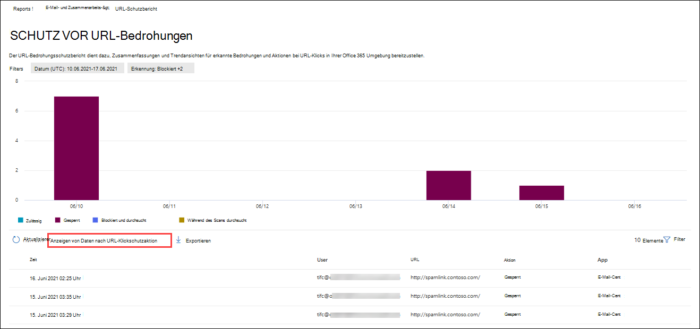

# Anzeigen von Defender für Office 365 Berichte im Dashboard "Berichte" im Microsoft 365 Defender-Portal

[!INCLUDE [Microsoft 365 Defender rebranding](../includes/microsoft-defender-for-office.md)]

**Gilt für**
- [Microsoft Defender für Office 365 Plan 1 und Plan 2](defender-for-office-365.md)
- [Microsoft 365 Defender](../defender/microsoft-365-defender.md)

Microsoft Defender für Office 365 Organisationen (z. B. Microsoft 365 E5-Abonnements oder Microsoft Defender für Office 365 Plan 1 oder Microsoft Defender für Office 365 Plan 2-Add-Ons) enthalten eine Vielzahl von sicherheitsrelevanten Berichten. Wenn Sie über die [erforderlichen Berechtigungen](#what-permissions-are-needed-to-view-the-defender-for-office-365-reports)verfügen, können Sie diese Berichte im Microsoft 365 Defender-Portal anzeigen, indem Sie berichte  \> **E-Mail-Zusammenarbeitsberichte** für \> **E-Mail-Zusammenarbeit melden.** Um direkt zum Berichtsdashboard zu wechseln, öffnen Sie <https://security.microsoft.com/emailandcollabreport> .

## Defender für Office 365-Bericht zu Dateitypen

Der **Bericht "Defender für Office 365-Dateitypen"** zeigt Ihnen den Typ der Dateien an, die von sicheren Anlagen als [bösartig](safe-attachments.md)erkannt wurden.

 Die Aggregatansicht des Berichts ermöglicht das Filtern von 90 Tagen, während die Detailansicht nur 10 Tage Filterung zulässt.

Um den Bericht anzuzeigen, öffnen Sie das [Microsoft 365 Defender-Portal,](https://security.microsoft.com)wechseln Sie zum **Berichtsdashboard,** \>  und wählen Sie Defender für **Office 365 Dateitypen aus.** Um direkt zum Bericht zu wechseln, öffnen Sie <https://protection.office.com/reportv2?id=ATPFileReport> .

> [!NOTE]
> Die Informationen in diesem Bericht sind auch im [Defender for Office 365 Message Disposition Report](#defender-for-office-365-message-disposition-report)verfügbar.

### Berichtsansicht für den Bericht "Defender für Office 365"-Dateitypen

Die folgenden Ansichten sind verfügbar:

- **Anzeigen von Daten nach: Datei:** Das Diagramm enthält die folgenden Informationen:

  - **Bösartige Excel Anlagen**
  - **Bösartige Flash-Anlagen**
  - **Schädliche PDF-Anlagen**
  - **Schädliche PowerPoint Anlagen**
  - **Bösartige URLs**
  - **Bösartige Word-Anlagen**
  - **Schädliche ausführbare Anlagen**
  - **Sonstige**

  Wenn Sie mit dem Mauszeiger über einen bestimmten Tag (Datenpunkt) zeigen, sehen Sie die Aufschlüsselung der Arten von schädlichen Dateien, die von [sicheren Anlagen](safe-attachments.md) und [dem Schutz vor Schadsoftware in EOP](anti-malware-protection.md)erkannt wurden.

  

  Wenn Sie auf **"Filter"** klicken, können Sie den Bericht mit den folgenden Filtern ändern:

  - **Startdatum** und **Enddatum**
  - Die gleichen Dateitypwerte, die im Diagramm sichtbar sind.

- **Anzeigen von Daten nach: Meldung:** Das Diagramm enthält die folgenden Informationen:

  - **Zugriff blockieren**
  - **Ersetzte Nachrichten**
  - **Überwachte Nachrichten**
  - **Ersetzt durch dynamische E-Mail-Zustellung:** Weitere Informationen finden Sie unter ["Dynamische Zustellung in Richtlinien für sichere Anlagen".](safe-attachments.md#dynamic-delivery-in-safe-attachments-policies)

  

  Wenn Sie auf **"Filter"** klicken, können Sie den Bericht mit den folgenden Filtern ändern:

  - **Startdatum** und **Enddatum**
  - Die gleichen Nachrichtendispositionswerte, die im Diagramm verfügbar sind, und der zusätzliche **übergebene** Nachrichtenwert.

### Detailtabellenansicht für den Bericht "Defender für Office 365"-Dateitypen

Wenn Sie auf **"Detailtabelle anzeigen"** klicken, bietet der Bericht eine Nahezu-Echtzeitansicht aller Klicks, die innerhalb der Organisation während der letzten 10 Tage stattfinden. Die angezeigten Informationen hängen von dem Diagramm ab, das Sie sich ansehen:

- **Anzeigen von Daten nach: Datei:**

  - **Date**
  - **Empfängeradresse**
  - **Absenderadresse**
  - **Nachrichten-ID:** Verfügbar im **Nachrichten-ID-Kopfzeilenfeld** im Nachrichtenkopf und sollte eindeutig sein. Ein Beispielwert ist `<08f1e0f6806a47b4ac103961109ae6ef@server.domain>` (beachten Sie die spitzen Klammern).
  - **Datei**

  Wenn Sie auf **"Filter"** klicken, können Sie den Bericht mit den folgenden Filtern ändern:

  - **Startdatum** und **Enddatum**
  - Die gleichen Dateitypwerte, die im Diagramm sichtbar sind.

- **Anzeigen von Daten nach: Nachricht:**

  - **Date**
  - **Empfängeradresse**
  - **Absenderadresse**
  - **Nachrichten-ID**
  - **Datei**
  - **Betreff**

  Wenn Sie auf **"Filter"** klicken, können Sie die Ergebnisse mit den folgenden Filtern ändern:

  - **Startdatum** und **Enddatum**
  - Die gleichen Nachrichtendispositionswerte, die im Diagramm verfügbar sind, und der zusätzliche **übergebene** Nachrichtenwert.

Klicken Sie auf Bericht **anzeigen,** um zur Berichtsansicht zurückzukehren.

## Defender für Office 365-Bericht zum Nachrichtenstatus

Der **ATP-Nachrichtendispositionsbericht** zeigt Ihnen die Aktionen, die für E-Mail-Nachrichten ausgeführt wurden, die als schädliche Inhalte erkannt wurden.

Um den Bericht anzuzeigen, öffnen Sie das [Microsoft 365 Defender-Portal,](https://security.microsoft.com)wechseln Sie zu **"E-Mail-Berichte** \> **& Zusammenarbeit** \> **E-Mail & Zusammenarbeitsberichte",** und wählen Sie Defender für Office 365 **Nachrichtendisposition** aus. Um direkt zum Bericht zu wechseln, öffnen Sie <https://protection.office.com/reportv2?id=ATPMessageReport> .

> [!NOTE]
> Die Informationen in diesem Bericht sind auch im [Defender for Office 365-Dateitypenbericht](#defender-for-office-365-file-types-report)verfügbar.

### Berichtsansicht für den Bericht "Defender für Office 365 Nachrichtendisposition"

Die folgenden Ansichten sind verfügbar:

- **Anzeigen von Daten nach: Meldung:** Das Diagramm enthält die folgenden Informationen:

  - **Zugriff blockieren**
  - **Ersetzte Nachrichten**
  - **Überwachte Nachrichten**
  - **Ersetzt durch dynamische E-Mail-Zustellung:** Weitere Informationen finden Sie unter ["Dynamische Zustellung in Richtlinien für sichere Anlagen".](safe-attachments.md#dynamic-delivery-in-safe-attachments-policies)

  

  Wenn Sie auf **"Filter"** klicken, können Sie den Bericht mit den folgenden Filtern ändern:

  - **Startdatum** und **Enddatum**
  - Die gleichen Nachrichtendispositionswerte, die im Diagramm verfügbar sind, und der zusätzliche **übergebene** Nachrichtenwert.

- **Anzeigen von Daten nach: Datei:** Das Diagramm enthält die folgenden Informationen:

  - **Bösartige Excel Anlagen**
  - **Bösartige Flash-Anlagen**
  - **Schädliche PDF-Anlagen**
  - **Schädliche PowerPoint Anlagen**
  - **Bösartige URLs**
  - **Bösartige Word-Anlagen**
  - **Schädliche ausführbare Anlagen**
  - **Sonstige**

  Wenn Sie mit dem Mauszeiger über einen bestimmten Tag (Datenpunkt) zeigen, sehen Sie die Aufschlüsselung der Arten von schädlichen Dateien, die von [sicheren Anlagen](safe-attachments.md) und [dem Schutz vor Schadsoftware in EOP](anti-malware-protection.md)erkannt wurden.

  

  Wenn Sie auf **"Filter"** klicken, können Sie den Bericht mit den folgenden Filtern ändern:

  - **Startdatum** und **Enddatum**
  - Die gleichen Dateitypwerte, die im Diagramm sichtbar sind.

### Detailtabellenansicht für den Bericht "Defender für Office 365 Nachrichtendisposition"

Wenn Sie auf **"Detailtabelle anzeigen"** klicken, bietet der Bericht eine Nahezu-Echtzeitansicht aller Klicks, die innerhalb der Organisation während der letzten 10 Tage stattfinden. Die angezeigten Informationen hängen von dem Diagramm ab, das Sie sich ansehen:

- **Anzeigen von Daten nach: Nachricht:**

  - **Date**
  - **Empfängeradresse**
  - **Absenderadresse**
  - **Nachrichten-ID**
  - **Datei**
  - **Betreff**

  Wenn Sie auf **"Filter"** klicken, können Sie die Ergebnisse mit den folgenden Filtern ändern:

  - **Startdatum** und **Enddatum**
  - Die gleichen Nachrichtendispositionswerte, die im Diagramm verfügbar sind, und der zusätzliche **übergebene** Nachrichtenwert.

- **Anzeigen von Daten nach: Datei:**

  - **Date**
  - **Empfängeradresse**
  - **Absenderadresse**
  - **Nachrichten-ID**
  - **Datei**

  Wenn Sie auf **"Filter"** klicken, können Sie den Bericht mit den folgenden Filtern ändern:

  - **Startdatum** und **Enddatum**
  - Die gleichen Dateitypwerte, die im Diagramm sichtbar sind.

Klicken Sie auf Bericht **anzeigen,** um zur Berichtsansicht zurückzukehren.

## E-Mail-Latenzbericht

Der **E-Mail-Latenzbericht** zeigt Ihnen eine aggregierte Ansicht der E-Mail-Zustellungs- und Detonationslatenz in Ihrer Organisation. Die E-Mail-Zustellungszeiten im Dienst werden von einer Reihe von Faktoren beeinflusst, und die absolute Zustellzeit in Sekunden ist häufig kein guter Indikator für Erfolg oder Problem. Eine langsame Zustellungszeit an einem Tag kann als durchschnittliche Zustellzeit an einem anderen Tag betrachtet werden oder umgekehrt. Der **E-Mail-Latenzbericht** versucht, die Nachrichtenübermittlung basierend auf statistischen Daten über die beobachteten Zustellzeiten anderer Nachrichten zu qualifizieren:

- **50. Quantil:** Dies ist die Mitte für die Nachrichtenübermittlungszeiten. Sie können diesen Wert als durchschnittliche Lieferzeit betrachten.
- **90. Perzentil:** Dies weist auf eine hohe Latenz für die Nachrichtenübermittlung hin. Nur 10 % der Nachrichten dauerten länger als dieser Wert für die Übermittlung.
- **99. Perzentil:** Gibt die höchste Latenz für die Nachrichtenübermittlung an.

Clientseitige und Netzwerklatenz sind nicht enthalten.

Um den Bericht anzuzeigen, öffnen Sie das [Microsoft 365 Defender-Portal,](https://security.microsoft.com)wechseln Sie zu **E-Mail-Berichte** \> **& Zusammenarbeit** \> **E-Mail & Zusammenarbeitsberichte,** und klicken Sie unter **E-Mail-Latenzbericht** auf **Details anzeigen.** Um direkt zum Bericht zu wechseln, öffnen Sie <https://security.microsoft.com/mailLatencyReport> .

### Berichtsansicht für den E-Mail-Latenzbericht

Wenn Sie den Bericht öffnen, ist standardmäßig die **50. Quantilsregisterkarte** ausgewählt.

Standardmäßig enthält diese Ansicht ein Diagramm, das mit den folgenden Filtern konfiguriert ist:

- **Datum:** Die letzten 7 Tage
- **Nachrichtenansicht:**
  - Detonierte Nachrichten

Dieses Diagramm zeigt Nachrichten, die in die folgenden Kategorien unterteilt sind:

- **E-Mail-Zustellungslatenz**
- **Detonationslatenz**

Wenn Sie mit dem Mauszeiger auf eine Kategorie im Diagramm zeigen, sehen Sie eine Aufschlüsselung der Latenz in jeder Kategorie.

Wenn Sie in der Berichtsansicht auf **"Filtern"** klicken, können Sie die Ergebnisse mit den folgenden Filtern ändern:

- Alle Nachrichten
- Nachrichten, die Anlagen oder URLs enthalten

Wenn Sie auf die Registerkarte **"90. Quantils"** oder **"99. Quantilen"** klicken, werden die gleichen Standardfilter aus der **50. Perzentilansicht** verwendet.

### Detailtabellenansicht für den E-Mail-Latenzbericht

Die folgenden Informationen werden in der Detailtabellenansicht angezeigt:

- **Date**
- **Perzentile**
- **Nachrichtenanzahl**
- **Gesamtlatenz**

Oben sehen Sie, dass am 14. November die durchschnittliche Latenz für alle zugestellten und detonierten Nachrichten **108,033** Sekunden betrug.

Die Detailtabelle enthält die gleichen Informationen auf jeder Registerkarte.

## Threat Protection-Statusbericht

Der **Bedrohungsschutz-Statusbericht** ist eine einzelne Ansicht, die Informationen zu schädlichen Inhalten und schädlichen E-Mails zusammenführt, die von [Exchange Online Protection](exchange-online-protection-overview.md) (EOP) und Microsoft Defender für Office 365 erkannt und blockiert wurden. Weitere Informationen finden Sie unter [Bedrohungsschutzstatusbericht.](view-email-security-reports.md#threat-protection-status-report)

## URL-Bedrohungsschutzbericht

Der **Bericht zum URL-Bedrohungsschutz** enthält Zusammenfassungen und Trendansichten für erkannte Bedrohungen und Aktionen, die bei URL-Klicks als Teil [von sicheren Links](safe-links.md)ausgeführt werden. In diesem Bericht werden keine Klickdaten von Benutzern angezeigt, bei denen die Richtlinie für sichere Links die Option **"Benutzerklicks nicht nachverfolgen"** ausgewählt hat.

Um den Bericht anzuzeigen, öffnen Sie das [Microsoft 365 Defender-Portal,](https://security.microsoft.com)wechseln Sie zu **E-Mail-Berichte** \> **& Zusammenarbeit** \> **E-Mail & Zusammenarbeitsberichte,** und klicken Sie auf Details unter **URL-Schutzbericht** **anzeigen.** Um direkt zum Bericht zu wechseln, öffnen Sie <https://security.microsoft.com/reports/URLProtectionActionReport> .

> [!NOTE]
> Dies ist ein *Schutztrendbericht,* d. h. Daten stellen Trends in einem größeren Dataset dar. Daher sind die Daten in der Aggregatansicht hier nicht in Echtzeit verfügbar, die Daten in der Detailtabellenansicht sind jedoch so, dass eine geringfügige Abweichung zwischen den beiden Ansichten angezeigt wird.

### Berichtsansicht für den URL-Bedrohungsschutzbericht

Der **URL-Bedrohungsschutzbericht** enthält zwei aggregierte Ansichten, die alle vier Stunden aktualisiert werden und Daten für die letzten 90 Tage anzeigen:

- Aktion zum Schutz von **URL-Klicks:** Zeigt die Anzahl der URL-Klicks von Benutzern in der Organisation und die Ergebnisse des Klicks an:

  - **Blockiert** (der Benutzer konnte nicht zur URL navigieren)
  - **Blockiert und durchgeklickt** (der Benutzer hat sich entschieden, weiter zur URL zu navigieren)
  - **Während des Scans durchgeklickt** (der Benutzer hat auf den Link geklickt, bevor der Scan abgeschlossen wurde)

  Ein Klick gibt an, dass der Benutzer über die Blockierungsseite zur schädlichen Website geklickt hat (Administratoren können das Durchklicken in Richtlinien für sichere Links deaktivieren).

  Wenn Sie auf **"Filter"** klicken, können Sie den Bericht mit den folgenden Filtern ändern:

  - **Startdatum** und **Enddatum**
  - Die verfügbaren Klickschutzaktionen sowie der Wert **"Zulässig"** (der Benutzer konnte zur URL navigieren).

  

- **URL-Klick nach Anwendung:** Zeigt die Anzahl der URL-Klicks von Anwendungen an, die sichere Links unterstützen:

  - **E-Mail-Client**
  - **PowerPoint**
  - **Word**
  - **Excel**
  - **OneNote**
  - **Visio**
  - **Teams**
  - **Other**

  Wenn Sie auf **"Filter"** klicken, können Sie den Bericht mit den folgenden Filtern ändern:

  - **Startdatum** und **Enddatum**
  - Die verfügbaren Anwendungen.

### Detailtabellenansicht für den URL-Bedrohungsschutzbericht

Wenn Sie auf **"Detailtabelle anzeigen"** klicken, bietet der Bericht eine Nahezu-Echtzeitansicht aller Klicks, die innerhalb der Organisation während der letzten 7 Tage stattfinden, mit den folgenden Details:

- **Klickzeit**
- **Benutzer**
- **URL**
- **Action**
- **App**

Wenn Sie in der Detailtabellenansicht auf **Filter** klicken, können Sie nach denselben Kriterien wie in der Berichtsansicht filtern und auch nach **Domänen** oder **Empfängern,** die durch Kommas getrennt sind.

> [!NOTE]
> Der **Domänenfilter** verweist auf die URL-Domäne, die in den Berichtergebnissen aufgeführt ist. 

Klicken Sie auf Bericht **anzeigen,** um zur Berichtsansicht zurückzukehren.

## Weitere anzuzeigende Berichte

Zusätzlich zu den in diesem Artikel beschriebenen Berichten stehen weitere Berichte zur Verfügung, wie in der folgenden Tabelle beschrieben:

****

|Bericht|Thema|
|---|---|
|**Explorer** (Microsoft Defender für Office 365 Plan 2) oder **Echtzeiterkennungen** (Microsoft Defender für Office 365 Plan 1)|[Sicherheitsrisiken-Explorer (und Echtzeit-Erkennung)](threat-explorer.md)|
|**E-Mail-Sicherheitsberichte,** z. B. der Bericht "Häufigste Absender und Empfänger", der Spoof-E-Mail-Bericht und der Spamerkennungsbericht.|[Anzeigen von E-Mail-Sicherheitsberichten im Microsoft 365 Defender-Portal](view-email-security-reports.md)|
|**Nachrichtenflussberichte,** z. B. der Weiterleitungsbericht, der E-Mailflow-Statusbericht und der Bericht "Häufigste Absender und Empfänger".|[Anzeigen von Nachrichtenflussberichten im Microsoft 365 Defender-Portal](view-mail-flow-reports.md)|
|**URL-Ablaufverfolgung für sichere Links** (nur PowerShell). Die Ausgabe dieses Cmdlets zeigt ihnen die Ergebnisse der Aktionen für sichere Links in den letzten sieben Tagen.|[Get-UrlTrace](/powershell/module/exchange/get-urltrace)|
|**E-Mail-Datenverkehrsergebnisse für EOP und Microsoft Defender für Office 365** (nur PowerShell). Die Ausgabe dieses Cmdlets enthält Informationen zu Domäne, Datum, Ereignistyp, Richtung, Aktion und Nachrichtenanzahl.|[Get-MailTrafficATPReport](/powershell/module/exchange/get-mailtrafficatpreport)|
|**E-Mail-Detailberichte für EOP und Defender für Office 365 Erkennungen** (nur PowerShell). Die Ausgabe dieses Cmdlets enthält Details zu schädlichen Dateien oder URLs, Phishingversuchen, Identitätswechsel und anderen potenziellen Bedrohungen in E-Mails oder Dateien.|[Get-MailDetailATPReport](/powershell/module/exchange/get-maildetailatpreport)|
|

## Welche Berechtigungen sind erforderlich, um den Defender für Office 365 Berichte anzuzeigen?

Um die in diesem Artikel beschriebenen Berichte anzuzeigen und zu verwenden, müssen Sie Mitglied einer der folgenden Rollengruppen im Microsoft 365 Defender-Portal sein:

- **Organisationsverwaltung**
- **Sicherheitsadministrator**
- **Sicherheitsleseberechtigter**
- **Globaler Leser**

Weitere Informationen finden Sie unter [Berechtigungen im Microsoft 365 Defender-Portal.](permissions-in-the-security-and-compliance-center.md)

**Hinweis:** Wenn Sie Benutzer zur entsprechenden Azure Active Directory Rolle im Microsoft 365 Admin Center hinzufügen, erhalten Benutzer die erforderlichen Berechtigungen im Microsoft 365 Defender-Portal _und_ Berechtigungen für andere Features in Microsoft 365. Weitere Informationen finden Sie unter [Informationen zu Administratorrollen](../../admin/add-users/about-admin-roles.md).

## Was geschieht, wenn in den Berichten keine Daten angezeigt werden?

Wenn in Ihrem Defender keine Daten für Office 365-Berichte angezeigt werden, überprüfen Sie, ob Ihre Richtlinien ordnungsgemäß eingerichtet sind. In Ihrer Organisation müssen Richtlinien für [sichere Links](set-up-safe-links-policies.md) und Richtlinien für [sichere Anlagen](set-up-safe-attachments-policies.md) definiert sein, damit Defender für Office 365 Schutz vorhanden ist. Siehe auch [Antispam- und Antischadsoftwareschutz.](anti-spam-and-anti-malware-protection.md)

## Verwandte Themen

[Intelligente Berichte und Einblicke im Microsoft 365 Defender-Portal](reports-and-insights-in-security-and-compliance.md)

[Rollenberechtigungen (Azure Active Directory](/azure/active-directory/users-groups-roles/directory-assign-admin-roles#role-permissions)
