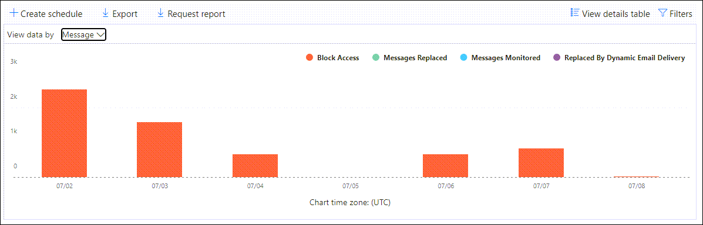

# Anzeigen von Defender für Office 365 Berichte im Dashboard "Berichte" im Microsoft 365 Defender-PortalView Defender for Office 365 reports in the Reports dashboard in the Microsoft 365 Defender portal

[!INCLUDE [Microsoft 365 Defender rebranding](../includes/microsoft-defender-for-office.md)]

**Gilt für****Applies to**
- [Microsoft Defender für Office 365 Plan 1 und Plan 2Microsoft Defender for Office 365 plan 1 and plan 2](defender-for-office-365.md)
- [Microsoft 365 DefenderMicrosoft 365 Defender](../defender/microsoft-365-defender.md)

Microsoft Defender für Office 365 Organisationen (z. B. Microsoft 365 E5-Abonnements oder Microsoft Defender für Office 365 Plan 1 oder Microsoft Defender für Office 365 Plan 2-Add-Ons) enthalten eine Vielzahl von sicherheitsrelevanten Berichten.Microsoft Defender for Office 365 organizations (for example, Microsoft 365 E5 subscriptions or Microsoft Defender for Office 365 Plan 1 or Microsoft Defender for Office 365 Plan 2 add-ons) contain a variety of security-related reports. Wenn Sie über die [erforderlichen Berechtigungen](#what-permissions-are-needed-to-view-the-defender-for-office-365-reports)verfügen, können Sie diese Berichte im Microsoft 365 Defender-Portal anzeigen, indem Sie berichte  \> **E-Mail-Zusammenarbeitsberichte** für \> **E-Mail-Zusammenarbeit melden.**If you have the [necessary permissions](#what-permissions-are-needed-to-view-the-defender-for-office-365-reports), you can view these reports in the Microsoft 365 Defender portal by going to **Reports** \> **Email collaboration** \> **Email collaboration reports**. Um direkt zum Berichtsdashboard zu wechseln, öffnen Sie <https://security.microsoft.com/emailandcollabreport> .To go directly to the Reports dashboard, open <https://security.microsoft.com/emailandcollabreport>.

## Defender für Office 365-Bericht zu DateitypenDefender for Office 365 file types report

Der **Bericht "Defender für Office 365-Dateitypen"** zeigt Ihnen den Typ der Dateien an, die von sicheren Anlagen als [bösartig](safe-attachments.md)erkannt wurden.The **Defender for Office 365 file types report** report shows you the type of files detected as malicious by [Safe Attachments](safe-attachments.md).

 Die Aggregatansicht des Berichts ermöglicht das Filtern von 90 Tagen, während die Detailansicht nur 10 Tage Filterung zulässt.The aggregate view of the report allows for 90 days of filtering, while the detail view only allows for 10 days of filtering.

Um den Bericht anzuzeigen, öffnen Sie das [Microsoft 365 Defender-Portal,](https://security.microsoft.com)wechseln Sie zum **Berichtsdashboard,** \>  und wählen Sie Defender für **Office 365 Dateitypen aus.**To view the report, open the [Microsoft 365 Defender portal](https://security.microsoft.com), go to **Reports** \> **Dashboard** and select **Defender for Office 365 file types**. Um direkt zum Bericht zu wechseln, öffnen Sie <https://protection.office.com/reportv2?id=ATPFileReport> .To go directly to the report, open <https://protection.office.com/reportv2?id=ATPFileReport>.

> [!NOTE]
> Die Informationen in diesem Bericht sind auch im [Defender for Office 365 Message Disposition Report](#defender-for-office-365-message-disposition-report)verfügbar.The information in this report is also available in the [Defender for Office 365 message disposition report](#defender-for-office-365-message-disposition-report).

### Berichtsansicht für den Bericht "Defender für Office 365"-DateitypenReport view for the Defender for Office 365 file types report

Die folgenden Ansichten sind verfügbar:The following views are available:

- **Anzeigen von Daten nach: Datei:** Das Diagramm enthält die folgenden Informationen:**View data by: File**: The chart contains the following information:

  - **Bösartige Excel Anlagen****Malicious Excel attachments**
  - **Bösartige Flash-Anlagen****Malicious Flash attachments**
  - **Schädliche PDF-Anlagen****Malicious PDF attachments**
  - **Schädliche PowerPoint Anlagen****Malicious PowerPoint attachments**
  - **Bösartige URLs****Malicious URLs**
  - **Bösartige Word-Anlagen****Malicious Word attachments**
  - **Schädliche ausführbare Anlagen****Malicious executable attachments**
  - **Sonstige****Others**

  Wenn Sie mit dem Mauszeiger über einen bestimmten Tag (Datenpunkt) zeigen, sehen Sie die Aufschlüsselung der Arten von schädlichen Dateien, die von [sicheren Anlagen](safe-attachments.md) und [dem Schutz vor Schadsoftware in EOP](anti-malware-protection.md)erkannt wurden.When you hover over a particular day (data point), you can see the breakdown of types of malicious files that were detected by [Safe Attachments](safe-attachments.md) and [anti-malware protection in EOP](anti-malware-protection.md).

  

  Wenn Sie auf **"Filter"** klicken, können Sie den Bericht mit den folgenden Filtern ändern:If you click **Filters**, you can modify the report with the following filters:

  - **Startdatum** und **Enddatum****Start date** and **End date**
  - Die gleichen Dateitypwerte, die im Diagramm sichtbar sind.The same file type values that are visible in the chart.

- **Anzeigen von Daten nach: Meldung:** Das Diagramm enthält die folgenden Informationen:**View data by: Message**: The chart contains the following information:

  - **Zugriff blockieren****Block access**
  - **Ersetzte Nachrichten****Messages replaced**
  - **Überwachte Nachrichten****Messages monitored**
  - **Ersetzt durch dynamische E-Mail-Zustellung:** Weitere Informationen finden Sie unter ["Dynamische Zustellung in Richtlinien für sichere Anlagen".](safe-attachments.md#dynamic-delivery-in-safe-attachments-policies)**Replaced by Dynamic Email Delivery**: For more information, see [Dynamic Delivery in Safe Attachments policies](safe-attachments.md#dynamic-delivery-in-safe-attachments-policies).

  

  Wenn Sie auf **"Filter"** klicken, können Sie den Bericht mit den folgenden Filtern ändern:If you click **Filters**, you can modify the report with the following filters:

  - **Startdatum** und **Enddatum****Start date** and **End date**
  - Die gleichen Nachrichtendispositionswerte, die im Diagramm verfügbar sind, und der zusätzliche **übergebene** Nachrichtenwert.The same message disposition values that are available in the chart, and the additional **Messages passed** value.

### Detailtabellenansicht für den Bericht "Defender für Office 365"-DateitypenDetails table view for the Defender for Office 365 file types report

Wenn Sie auf **"Detailtabelle anzeigen"** klicken, bietet der Bericht eine Nahezu-Echtzeitansicht aller Klicks, die innerhalb der Organisation während der letzten 10 Tage stattfinden.If you click **View details table**, the report provides a near-real-time view of all clicks that happen within the organization for the last 10 days. Die angezeigten Informationen hängen von dem Diagramm ab, das Sie sich ansehen:The information that's shown depends on the chart you were looking at:

- **Anzeigen von Daten nach: Datei:****View data by: File**:

  - **Date****Date**
  - **Empfängeradresse****Recipient address**
  - **Absenderadresse****Sender address**
  - **Nachrichten-ID:** Verfügbar im **Nachrichten-ID-Kopfzeilenfeld** im Nachrichtenkopf und sollte eindeutig sein.**Message ID**: Available in the **Message-ID** header field in the message header and should be unique. Ein Beispielwert ist `<08f1e0f6806a47b4ac103961109ae6ef@server.domain>` (beachten Sie die spitzen Klammern).An example value is `<08f1e0f6806a47b4ac103961109ae6ef@server.domain>` (note the angle brackets).
  - **Datei****File**

  Wenn Sie auf **"Filter"** klicken, können Sie den Bericht mit den folgenden Filtern ändern:If you click **Filters**, you can modify the report with the following filters:

  - **Startdatum** und **Enddatum****Start date** and **End date**
  - Die gleichen Dateitypwerte, die im Diagramm sichtbar sind.The same file type values that are visible in the chart.

- **Anzeigen von Daten nach: Nachricht:****View data by: Message**:

  - **Date****Date**
  - **Empfängeradresse****Recipient address**
  - **Absenderadresse****Sender address**
  - **Nachrichten-ID****Message ID**
  - **Datei****File**
  - **Betreff****Subject**

  Wenn Sie auf **"Filter"** klicken, können Sie die Ergebnisse mit den folgenden Filtern ändern:If you click **Filters**, you can modify the results with the following filters:

  - **Startdatum** und **Enddatum****Start date** and **End date**
  - Die gleichen Nachrichtendispositionswerte, die im Diagramm verfügbar sind, und der zusätzliche **übergebene** Nachrichtenwert.The same message disposition values that are available in the chart, and the additional **Messages passed** value.

Klicken Sie auf Bericht **anzeigen,** um zur Berichtsansicht zurückzukehren.To get back to the reports view, click **View report**.

## Defender für Office 365-Bericht zum NachrichtenstatusDefender for Office 365 message disposition report

Der **ATP-Nachrichtendispositionsbericht** zeigt Ihnen die Aktionen, die für E-Mail-Nachrichten ausgeführt wurden, die als schädliche Inhalte erkannt wurden.The **ATP Message Disposition** report shows you the actions that were taken for email messages that were detected as having malicious content.

Um den Bericht anzuzeigen, öffnen Sie das [Microsoft 365 Defender-Portal,](https://security.microsoft.com)wechseln Sie zu **"E-Mail-Berichte** \> **& Zusammenarbeit** \> **E-Mail & Zusammenarbeitsberichte",** und wählen Sie Defender für Office 365 **Nachrichtendisposition** aus.To view the report, open the [Microsoft 365 Defender portal](https://security.microsoft.com), go to **Reports** \> **Email & collaboration** \> **Email & collaboration reports** and select **Defender for Office 365 message disposition**. Um direkt zum Bericht zu wechseln, öffnen Sie <https://protection.office.com/reportv2?id=ATPMessageReport> .To go directly to the report, open <https://protection.office.com/reportv2?id=ATPMessageReport>.

> [!NOTE]
> Die Informationen in diesem Bericht sind auch im [Defender for Office 365-Dateitypenbericht](#defender-for-office-365-file-types-report)verfügbar.The information in this report is also available in the [Defender for Office 365 file types report](#defender-for-office-365-file-types-report).

### Berichtsansicht für den Bericht "Defender für Office 365 Nachrichtendisposition"Report view for the Defender for Office 365 message disposition report

Die folgenden Ansichten sind verfügbar:The following views are available:

- **Anzeigen von Daten nach: Meldung:** Das Diagramm enthält die folgenden Informationen:**View data by: Message**: The chart contains the following information:

  - **Zugriff blockieren****Block access**
  - **Ersetzte Nachrichten****Messages replaced**
  - **Überwachte Nachrichten****Messages monitored**
  - **Ersetzt durch dynamische E-Mail-Zustellung:** Weitere Informationen finden Sie unter ["Dynamische Zustellung in Richtlinien für sichere Anlagen".](safe-attachments.md#dynamic-delivery-in-safe-attachments-policies)**Replaced by Dynamic Email Delivery**: For more information, see [Dynamic Delivery in Safe Attachments policies](safe-attachments.md#dynamic-delivery-in-safe-attachments-policies).

  

  Wenn Sie auf **"Filter"** klicken, können Sie den Bericht mit den folgenden Filtern ändern:If you click **Filters**, you can modify the report with the following filters:

  - **Startdatum** und **Enddatum****Start date** and **End date**
  - Die gleichen Nachrichtendispositionswerte, die im Diagramm verfügbar sind, und der zusätzliche **übergebene** Nachrichtenwert.The same message disposition values that are available in the chart, and the additional **Messages passed** value.

- **Anzeigen von Daten nach: Datei:** Das Diagramm enthält die folgenden Informationen:**View data by: File**: The chart contains the following information:

  - **Bösartige Excel Anlagen****Malicious Excel attachments**
  - **Bösartige Flash-Anlagen****Malicious Flash attachments**
  - **Schädliche PDF-Anlagen****Malicious PDF attachments**
  - **Schädliche PowerPoint Anlagen****Malicious PowerPoint attachments**
  - **Bösartige URLs****Malicious URLs**
  - **Bösartige Word-Anlagen****Malicious Word attachments**
  - **Schädliche ausführbare Anlagen****Malicious executable attachments**
  - **Sonstige****Others**

  Wenn Sie mit dem Mauszeiger über einen bestimmten Tag (Datenpunkt) zeigen, sehen Sie die Aufschlüsselung der Arten von schädlichen Dateien, die von [sicheren Anlagen](safe-attachments.md) und [dem Schutz vor Schadsoftware in EOP](anti-malware-protection.md)erkannt wurden.When you hover over a particular day (data point), you can see the breakdown of types of malicious files that were detected by [Safe Attachments](safe-attachments.md) and [anti-malware protection in EOP](anti-malware-protection.md).

  

  Wenn Sie auf **"Filter"** klicken, können Sie den Bericht mit den folgenden Filtern ändern:If you click **Filters**, you can modify the report with the following filters:

  - **Startdatum** und **Enddatum****Start date** and **End date**
  - Die gleichen Dateitypwerte, die im Diagramm sichtbar sind.The same file type values that are visible in the chart.

### Detailtabellenansicht für den Bericht "Defender für Office 365 Nachrichtendisposition"Details table view for the Defender for Office 365 message disposition report

Wenn Sie auf **"Detailtabelle anzeigen"** klicken, bietet der Bericht eine Nahezu-Echtzeitansicht aller Klicks, die innerhalb der Organisation während der letzten 10 Tage stattfinden.If you click **View details table**, the report provides a near-real-time view of all clicks that happen within the organization for the last 10 days. Die angezeigten Informationen hängen von dem Diagramm ab, das Sie sich ansehen:The information that's shown depends on the chart you were looking at:

- **Anzeigen von Daten nach: Nachricht:****View data by: Message**:

  - **Date****Date**
  - **Empfängeradresse****Recipient address**
  - **Absenderadresse****Sender address**
  - **Nachrichten-ID****Message ID**
  - **Datei****File**
  - **Betreff****Subject**

  Wenn Sie auf **"Filter"** klicken, können Sie die Ergebnisse mit den folgenden Filtern ändern:If you click **Filters**, you can modify the results with the following filters:

  - **Startdatum** und **Enddatum****Start date** and **End date**
  - Die gleichen Nachrichtendispositionswerte, die im Diagramm verfügbar sind, und der zusätzliche **übergebene** Nachrichtenwert.The same message disposition values that are available in the chart, and the additional **Messages passed** value.

- **Anzeigen von Daten nach: Datei:****View data by: File**:

  - **Date****Date**
  - **Empfängeradresse****Recipient address**
  - **Absenderadresse****Sender address**
  - **Nachrichten-ID****Message ID**
  - **Datei****File**

  Wenn Sie auf **"Filter"** klicken, können Sie den Bericht mit den folgenden Filtern ändern:If you click **Filters**, you can modify the report with the following filters:

  - **Startdatum** und **Enddatum****Start date** and **End date**
  - Die gleichen Dateitypwerte, die im Diagramm sichtbar sind.The same file type values that are visible in the chart.

Klicken Sie auf Bericht **anzeigen,** um zur Berichtsansicht zurückzukehren.To get back to the reports view, click **View report**.

## E-Mail-LatenzberichtMail latency report

Der **E-Mail-Latenzbericht** zeigt Ihnen eine aggregierte Ansicht der E-Mail-Zustellungs- und Detonationslatenz in Ihrer Organisation.The **Mail latency report** shows you an aggregate view of the mail delivery and detonation latency experienced within your organization. Die E-Mail-Zustellungszeiten im Dienst werden von einer Reihe von Faktoren beeinflusst, und die absolute Zustellzeit in Sekunden ist häufig kein guter Indikator für Erfolg oder Problem.Mail delivery times in the service are affected by a number of factors, and the absolute delivery time in seconds is often not a good indicator of success or a problem. Eine langsame Zustellungszeit an einem Tag kann als durchschnittliche Zustellzeit an einem anderen Tag betrachtet werden oder umgekehrt.A slow delivery time on one day might be considered an average delivery time on another day, or vice-versa. Der **E-Mail-Latenzbericht** versucht, die Nachrichtenübermittlung basierend auf statistischen Daten über die beobachteten Zustellzeiten anderer Nachrichten zu qualifizieren:The **Mail latency report** tries to qualify message delivery based on statistical data about the observed delivery times of other messages:

- **50. Quantil:** Dies ist die Mitte für die Nachrichtenübermittlungszeiten.**50th percentile**: This is the middle for message delivery times. Sie können diesen Wert als durchschnittliche Lieferzeit betrachten.You can consider this value as an average delivery time.
- **90. Perzentil:** Dies weist auf eine hohe Latenz für die Nachrichtenübermittlung hin.**90th percentile**: This indicates a high latency for message delivery. Nur 10 % der Nachrichten dauerten länger als dieser Wert für die Übermittlung.Only 10% of messages took longer than this value to deliver.
- **99. Perzentil:** Gibt die höchste Latenz für die Nachrichtenübermittlung an.**99th percentile**: This indicates the highest latency for message delivery.

Clientseitige und Netzwerklatenz sind nicht enthalten.Client side and network latency are not included.

Um den Bericht anzuzeigen, öffnen Sie das [Microsoft 365 Defender-Portal,](https://security.microsoft.com)wechseln Sie zu **E-Mail-Berichte** \> **& Zusammenarbeit** \> **E-Mail & Zusammenarbeitsberichte,** und klicken Sie unter **E-Mail-Latenzbericht** auf **Details anzeigen.**To view the report, open the [Microsoft 365 Defender portal](https://security.microsoft.com), go to **Reports** \> **Email & collaboration** \> **Email & collaboration reports** and click **View details** under **Mail latency report**. Um direkt zum Bericht zu wechseln, öffnen Sie <https://security.microsoft.com/mailLatencyReport> .To go directly to the report, open <https://security.microsoft.com/mailLatencyReport>.

### Berichtsansicht für den E-Mail-LatenzberichtReport view for the Mail latency report

Wenn Sie den Bericht öffnen, ist standardmäßig die **50. Quantilsregisterkarte** ausgewählt.When you open the report, the **50th percentiles** tab is selected by default.

Standardmäßig enthält diese Ansicht ein Diagramm, das mit den folgenden Filtern konfiguriert ist:By default, this view contains a chart that's configured with the following filters:

- **Datum:** Die letzten 7 Tage**Date**: The last 7 days
- **Nachrichtenansicht:****Message View**:
  - Detonierte NachrichtenDetonated messages

Dieses Diagramm zeigt Nachrichten, die in die folgenden Kategorien unterteilt sind:This chart shows messages organized into the following categories:

- **E-Mail-Zustellungslatenz****Mail delivery latency**
- **Detonationslatenz****Detonation latency**

Wenn Sie mit dem Mauszeiger auf eine Kategorie im Diagramm zeigen, sehen Sie eine Aufschlüsselung der Latenz in jeder Kategorie.When you hover over a category in the chart, you can see a breakdown of the latency in each category.

Wenn Sie in der Berichtsansicht auf **"Filtern"** klicken, können Sie die Ergebnisse mit den folgenden Filtern ändern:If you click **Filter** in the report view, you can modify the results with the following filters:

- Alle NachrichtenAll messages
- Nachrichten, die Anlagen oder URLs enthaltenMessages that contain attachments or URLs

Wenn Sie auf die Registerkarte **"90. Quantils"** oder **"99. Quantilen"** klicken, werden die gleichen Standardfilter aus der **50. Perzentilansicht** verwendet.If you click the **90th percentiles** tab or the **99th percentiles** tab, the same default filters from the **50th percentiles** view are used.

### Detailtabellenansicht für den E-Mail-LatenzberichtDetails table view for the Mail latency report

Die folgenden Informationen werden in der Detailtabellenansicht angezeigt:The following information is shown in the details table view:

- **Date****Date**
- **Perzentile****Percentiles**
- **Nachrichtenanzahl****Message count**
- **Gesamtlatenz****Overall latency**

Oben sehen Sie, dass am 14. November die durchschnittliche Latenz für alle zugestellten und detonierten Nachrichten **108,033** Sekunden betrug.The above shows that on November 14 the average latency experienced for all messages delivered and detonated was **108.033** seconds.

Die Detailtabelle enthält die gleichen Informationen auf jeder Registerkarte.The details table contains the same information on each tab.

## Threat Protection-StatusberichtThreat protection status report

Der **Bedrohungsschutz-Statusbericht** ist eine einzelne Ansicht, die Informationen zu schädlichen Inhalten und schädlichen E-Mails zusammenführt, die von [Exchange Online Protection](exchange-online-protection-overview.md) (EOP) und Microsoft Defender für Office 365 erkannt und blockiert wurden.The **Threat protection status** report is a single view that brings together information about malicious content and malicious email detected and blocked by [Exchange Online Protection](exchange-online-protection-overview.md) (EOP) and Microsoft Defender for Office 365. Weitere Informationen finden Sie unter [Bedrohungsschutzstatusbericht.](view-email-security-reports.md#threat-protection-status-report)For more information, see [Threat protection status report](view-email-security-reports.md#threat-protection-status-report).

## URL-BedrohungsschutzberichtURL threat protection report

Der **Bericht zum URL-Bedrohungsschutz** enthält Zusammenfassungen und Trendansichten für erkannte Bedrohungen und Aktionen, die bei URL-Klicks als Teil [von sicheren Links](safe-links.md)ausgeführt werden.The **URL threat protection report** provides summary and trend views for threats detected and actions taken on URL clicks as part of [Safe Links](safe-links.md). In diesem Bericht werden keine Klickdaten von Benutzern angezeigt, bei denen die Richtlinie für sichere Links die Option **"Benutzerklicks nicht nachverfolgen"** ausgewählt hat.This report will not have click data from users where the Safe Links policy applied has the **Do not track user clicks** option selected.

Um den Bericht anzuzeigen, öffnen Sie das [Microsoft 365 Defender-Portal,](https://security.microsoft.com)wechseln Sie zu **E-Mail-Berichte** \> **& Zusammenarbeit** \> **E-Mail & Zusammenarbeitsberichte,** und klicken Sie auf Details unter **URL-Schutzbericht** **anzeigen.**To view the report, open the [Microsoft 365 Defender portal](https://security.microsoft.com), go to **Reports** \> **Email & collaboration** \> **Email & collaboration reports** and click **View details** under **URL protection report**. Um direkt zum Bericht zu wechseln, öffnen Sie <https://security.microsoft.com/reports/URLProtectionActionReport> .To go directly to the report, open <https://security.microsoft.com/reports/URLProtectionActionReport>.

> [!NOTE]
> Dies ist ein *Schutztrendbericht,* d. h. Daten stellen Trends in einem größeren Dataset dar.This is a *protection trend report*, meaning data represents trends in a larger dataset. Daher sind die Daten in der Aggregatansicht hier nicht in Echtzeit verfügbar, die Daten in der Detailtabellenansicht sind jedoch so, dass eine geringfügige Abweichung zwischen den beiden Ansichten angezeigt wird.As a result, the data in the aggregate view is not available in real time here, but the data in the details table view is, so you may see a slight discrepancy between the two views.

### Berichtsansicht für den URL-BedrohungsschutzberichtReport view for the URL threat protection report

Der **URL-Bedrohungsschutzbericht** enthält zwei aggregierte Ansichten, die alle vier Stunden aktualisiert werden und Daten für die letzten 90 Tage anzeigen:The **URL threat protection** report has two aggregated views that are refreshed once every four hours that shows data for the last 90 days:

- Aktion zum Schutz von **URL-Klicks:** Zeigt die Anzahl der URL-Klicks von Benutzern in der Organisation und die Ergebnisse des Klicks an:**URL click protection action**: Shows the number of URL clicks by users in the organization and the results of the click:

  - **Blockiert** (der Benutzer konnte nicht zur URL navigieren)**Blocked** (the user was blocked from navigating to the URL)
  - **Blockiert und durchgeklickt** (der Benutzer hat sich entschieden, weiter zur URL zu navigieren)**Blocked and clicked through** (the user has chosen to continue navigating to the URL)
  - **Während des Scans durchgeklickt** (der Benutzer hat auf den Link geklickt, bevor der Scan abgeschlossen wurde)**Clicked through during scan** (the user has clicked on the link before the scan was complete)

  Ein Klick gibt an, dass der Benutzer über die Blockierungsseite zur schädlichen Website geklickt hat (Administratoren können das Durchklicken in Richtlinien für sichere Links deaktivieren).A click indicates that the user has clicked through the block page to the malicious website (admins can disable click through in Safe Links policies).

  Wenn Sie auf **"Filter"** klicken, können Sie den Bericht mit den folgenden Filtern ändern:If you click **Filters**, you can modify the report with the following filters:

  - **Startdatum** und **Enddatum****Start date** and **End date**
  - Die verfügbaren Klickschutzaktionen sowie der Wert **"Zulässig"** (der Benutzer konnte zur URL navigieren).The available click protection actions, plus the value **Allowed** (the user was allowed to navigate to the URL).

  

- **URL-Klick nach Anwendung:** Zeigt die Anzahl der URL-Klicks von Anwendungen an, die sichere Links unterstützen:**URL click by application**: Shows the number of URL clicks by applications that support Safe Links:

  - **E-Mail-Client****Email client**
  - **PowerPoint****PowerPoint**
  - **Word****Word**
  - **Excel****Excel**
  - **OneNote****OneNote**
  - **Visio****Visio**
  - **Teams****Teams**
  - **Other****Other**

  Wenn Sie auf **"Filter"** klicken, können Sie den Bericht mit den folgenden Filtern ändern:If you click **Filters**, you can modify the report with the following filters:

  - **Startdatum** und **Enddatum****Start date** and **End date**
  - Die verfügbaren Anwendungen.The available applications.

### Detailtabellenansicht für den URL-BedrohungsschutzberichtDetails table view for the URL threat protection report

Wenn Sie auf **"Detailtabelle anzeigen"** klicken, bietet der Bericht eine Nahezu-Echtzeitansicht aller Klicks, die innerhalb der Organisation während der letzten 7 Tage stattfinden, mit den folgenden Details:If you click **View details table**, the report provides a near-real-time view of all clicks that happen within the organization for the last 7 days with the following details:

- **Klickzeit****Click time**
- **Benutzer****User**
- **URL****URL**
- **Action****Action**
- **App****App**

Wenn Sie in der Detailtabellenansicht auf **Filter** klicken, können Sie nach denselben Kriterien wie in der Berichtsansicht filtern und auch nach **Domänen** oder **Empfängern,** die durch Kommas getrennt sind.If you click **Filters** in the details table view, you can filter by the same criteria as in the report view, and also by **Domains** or **Recipients** separated by commas.

> [!NOTE]
> Der **Domänenfilter** verweist auf die URL-Domäne, die in den Berichtergebnissen aufgeführt ist.The **Domains** filter refers to the URL domain listed in the report results. 

Klicken Sie auf Bericht **anzeigen,** um zur Berichtsansicht zurückzukehren.To get back to the reports view, click **View report**.

## Weitere anzuzeigende BerichteAdditional reports to view

Zusätzlich zu den in diesem Artikel beschriebenen Berichten stehen weitere Berichte zur Verfügung, wie in der folgenden Tabelle beschrieben:In addition to the reports described in this article, several other reports are available, as described in the following table:

****

|BerichtReport|ThemaTopic|
|---|---|
|**Explorer** (Microsoft Defender für Office 365 Plan 2) oder **Echtzeiterkennungen** (Microsoft Defender für Office 365 Plan 1)**Explorer** (Microsoft Defender for Office 365 Plan 2) or **real-time detections** (Microsoft Defender for Office 365 Plan 1)|[Sicherheitsrisiken-Explorer (und Echtzeit-Erkennung)Threat Explorer (and real-time detections)](threat-explorer.md)|
|**E-Mail-Sicherheitsberichte,** z. B. der Bericht "Häufigste Absender und Empfänger", der Spoof-E-Mail-Bericht und der Spamerkennungsbericht.**Email security reports**, such as the Top senders and recipients report, the Spoof mail report, and the Spam detections report.|[Anzeigen von E-Mail-Sicherheitsberichten im Microsoft 365 Defender-PortalView email security reports in the Microsoft 365 Defender portal](view-email-security-reports.md)|
|**Nachrichtenflussberichte,** z. B. der Weiterleitungsbericht, der E-Mailflow-Statusbericht und der Bericht "Häufigste Absender und Empfänger".**Mail flow reports**, such as the Forwarding report, the Mailflow status report, and the Top senders and recipients report.|[Anzeigen von Nachrichtenflussberichten im Microsoft 365 Defender-PortalView mail flow reports in the Microsoft 365 Defender portal](view-mail-flow-reports.md)|
|**URL-Ablaufverfolgung für sichere Links** (nur PowerShell).**URL trace for Safe Links** (PowerShell only). Die Ausgabe dieses Cmdlets zeigt ihnen die Ergebnisse der Aktionen für sichere Links in den letzten sieben Tagen.The output of this cmdlet shows you the results of Safe Links actions over the past seven days.|[Get-UrlTraceGet-UrlTrace](/powershell/module/exchange/get-urltrace)|
|**E-Mail-Datenverkehrsergebnisse für EOP und Microsoft Defender für Office 365** (nur PowerShell).**Mail traffic results for EOP and Microsoft Defender for Office 365** (PowerShell only). Die Ausgabe dieses Cmdlets enthält Informationen zu Domäne, Datum, Ereignistyp, Richtung, Aktion und Nachrichtenanzahl.The output of this cmdlet contains information about Domain, Date, Event Type, Direction, Action, and Message Count.|[Get-MailTrafficATPReportGet-MailTrafficATPReport](/powershell/module/exchange/get-mailtrafficatpreport)|
|**E-Mail-Detailberichte für EOP und Defender für Office 365 Erkennungen** (nur PowerShell).**Mail detail reports for EOP and Defender for Office 365 detections** (PowerShell only). Die Ausgabe dieses Cmdlets enthält Details zu schädlichen Dateien oder URLs, Phishingversuchen, Identitätswechsel und anderen potenziellen Bedrohungen in E-Mails oder Dateien.The output of this cmdlet contains details about malicious files or URLs, phishing attempts, impersonation, and other potential threats in email or files.|[Get-MailDetailATPReportGet-MailDetailATPReport](/powershell/module/exchange/get-maildetailatpreport)|
|

## Welche Berechtigungen sind erforderlich, um den Defender für Office 365 Berichte anzuzeigen?What permissions are needed to view the Defender for Office 365 reports?

Um die in diesem Artikel beschriebenen Berichte anzuzeigen und zu verwenden, müssen Sie Mitglied einer der folgenden Rollengruppen im Microsoft 365 Defender-Portal sein:In order to view and use the reports described in this article, you need to be a member of one of the following role groups in the Microsoft 365 Defender portal:

- **Organisationsverwaltung****Organization Management**
- **Sicherheitsadministrator****Security Administrator**
- **Sicherheitsleseberechtigter****Security Reader**
- **Globaler Leser****Global Reader**

Weitere Informationen finden Sie unter [Berechtigungen im Microsoft 365 Defender-Portal.](permissions-in-the-security-and-compliance-center.md)For more information, see [Permissions in the Microsoft 365 Defender portal](permissions-in-the-security-and-compliance-center.md).

**Hinweis:** Wenn Sie Benutzer zur entsprechenden Azure Active Directory Rolle im Microsoft 365 Admin Center hinzufügen, erhalten Benutzer die erforderlichen Berechtigungen im Microsoft 365 Defender-Portal _und_ Berechtigungen für andere Features in Microsoft 365.**Note**: Adding users to the corresponding Azure Active Directory role in the Microsoft 365 admin center gives users the required permissions in the Microsoft 365 Defender portal _and_ permissions for other features in Microsoft 365. Weitere Informationen finden Sie unter [Informationen zu Administratorrollen](../../admin/add-users/about-admin-roles.md).For more information, see [About admin roles](../../admin/add-users/about-admin-roles.md).

## Was geschieht, wenn in den Berichten keine Daten angezeigt werden?What if the reports aren't showing data?

Wenn in Ihrem Defender keine Daten für Office 365-Berichte angezeigt werden, überprüfen Sie, ob Ihre Richtlinien ordnungsgemäß eingerichtet sind.If you are not seeing data in your Defender for Office 365 reports, double-check that your policies are set up correctly. In Ihrer Organisation müssen Richtlinien für [sichere Links](set-up-safe-links-policies.md) und Richtlinien für [sichere Anlagen](set-up-safe-attachments-policies.md) definiert sein, damit Defender für Office 365 Schutz vorhanden ist.Your organization must have [Safe Links policies](set-up-safe-links-policies.md) and [Safe Attachments policies](set-up-safe-attachments-policies.md) defined in order for Defender for Office 365 protection to be in place. Siehe auch [Antispam- und Antischadsoftwareschutz.](anti-spam-and-anti-malware-protection.md)Also see [Anti-spam and anti-malware protection](anti-spam-and-anti-malware-protection.md).

## Verwandte ThemenRelated topics

[Intelligente Berichte und Einblicke im Microsoft 365 Defender-PortalSmart reports and insights in the Microsoft 365 Defender portal](reports-and-insights-in-security-and-compliance.md)

[Rollenberechtigungen (Azure Active DirectoryRole permissions (Azure Active Directory](/azure/active-directory/users-groups-roles/directory-assign-admin-roles#role-permissions)
