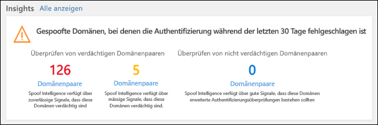
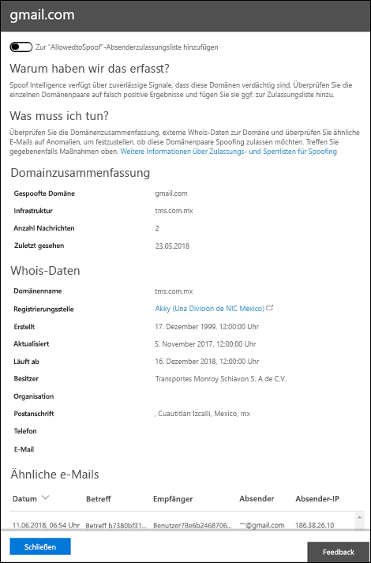

# Exemplarische Vorgehensweise – Spoof Intelligence Insight in Microsoft Defender für Office 365Walkthrough - Spoof intelligence insight in Microsoft Defender for Office 365

[!INCLUDE [Microsoft 365 Defender rebranding](../includes/microsoft-defender-for-office.md)]

In Microsoft 365-Organisationen mit Defender for Office 365 können Sie die Spoof Intelligence-Einblicke verwenden, um schnell zu ermitteln, welche Absender legitimerweise nicht authentifizierte e-Mails senden (Nachrichten von Domänen, die keine SPF-, DKIM-oder DMARC-Überprüfungen durchführen).In Microsoft 365 organizations with Defender for Office 365, you can use the Spoof intelligence insight to quickly determine which senders are legitimately sending you unauthenticated email (messages from domains that don't pass SPF, DKIM, or DMARC checks).

Wenn Sie zulassen, dass bekannte Absender gefälschte Nachrichten von bekannten Speicherorten senden, können Sie falsch positive Ergebnisse reduzieren (gute e-Mail-Nachrichten sind als ungültig markiert).By allowing known senders to send spoofed messages from known locations, you can reduce false positives (good email marked as bad). Durch Überwachen der zulässigen gefälschten Absender stellen Sie eine zusätzliche Sicherheitsebene bereit, um zu verhindern, dass unsichere Nachrichten in Ihrer Organisation eingehen.By monitoring the allowed spoofed senders, you provide an additional layer of security to prevent unsafe messages from arriving in your organization.

Weitere Informationen zu Berichten und Einblicken finden Sie unter [Reports and Insights in the Security & Compliance Center](reports-and-insights-in-security-and-compliance.md).For more information about reports and insights, see [Reports and insights in the Security & Compliance Center](reports-and-insights-in-security-and-compliance.md).

Diese exemplarische Vorgehensweise ist eine von mehreren für das Security & Compliance Center.This walkthrough is one of several for the Security & Compliance Center. Informationen zum Navigieren in Berichten und Einblicken finden Sie unter Exemplarische Vorgehensweisen im Abschnitt " [Verwandte Themen](#related-topics) ".To about navigating reports and insights, see the walkthroughs in the [Related topics](#related-topics) section.

## Was sollten Sie wissen, bevor Sie beginnen?What do you need to know before you begin?

- Sie öffnen das Security & Compliance Center unter <https://protection.office.com/>.You open the Security & Compliance Center at <https://protection.office.com/>. Um direkt zur Seite **Security Dashboard** zu wechseln, verwenden Sie <https://protection.office.com/searchandinvestigation/dashboard> .To go directly to the **Security dashboard** page, use <https://protection.office.com/searchandinvestigation/dashboard>.

  Sie können die Einblicke in Spoof Intelligence aus mehreren Dashboards im Security & Compliance Center anzeigen.You can view the Spoof intelligence insight from more than one dashboard in the Security & Compliance Center. Unabhängig davon, für welches Dashboard Sie sich interessieren, bietet die Insight dieselben Details und ermöglicht Ihnen, schnell dieselben Aufgaben auszuführen.Regardless of which dashboard you're looking at, the insight provides the same details and allows you to quickly perform the same tasks.

- Sie müssen Berechtigungen zugewiesen haben, bevor Sie die Verfahren in diesem Thema ausführen können.You need to be assigned permissions before you can do the procedures in this topic. Um die Spoof Intelligence-Einblicke verwenden zu können, müssen Sie Mitglied einer der folgenden Rollengruppen sein:To use the spoof intelligence insight, you need to be a member of one of the following role groups:

  - **Organisationsverwaltung** oder **Sicherheitsadministrator** im [Security & Compliance Center](permissions-in-the-security-and-compliance-center.md).**Organization Management** or **Security Administrator** in the [Security & Compliance Center](permissions-in-the-security-and-compliance-center.md).
  - **Organisationsverwaltung** oder **Nachrichtenschutz** in [Exchange Online](https://docs.microsoft.com/Exchange/permissions-exo/permissions-exo#role-groups).**Organization Management** or **Hygiene Management** in [Exchange Online](https://docs.microsoft.com/Exchange/permissions-exo/permissions-exo#role-groups).
  - **Security Reader** im [Security & Compliance Center](permissions-in-the-security-and-compliance-center.md).**Security Reader** in the [Security & Compliance Center](permissions-in-the-security-and-compliance-center.md).
  - **Schreibgeschützte Organisationsverwaltung** in [Exchange Online](https://docs.microsoft.com/Exchange/permissions-exo/permissions-exo#role-groups).**View-Only Organization Management** in [Exchange Online](https://docs.microsoft.com/Exchange/permissions-exo/permissions-exo#role-groups).

- Sie aktivieren und deaktivieren Spoof Intelligence in Anti-Phishing-Richtlinien in Microsoft Defender für Office 365.You enable and disable spoof intelligence in anti-phishing policies in Microsoft Defender for Office 365. Weitere Informationen finden Sie unter [configure Anti-Phishing Policies in Microsoft Defender for Office 365](configure-atp-anti-phishing-policies.md).For more information, see [Configure anti-phishing policies in Microsoft Defender for Office 365](configure-atp-anti-phishing-policies.md).

- Informationen zum Verwenden von Spoof Intelligence zum Überwachen und Verwalten von Absendern, die nicht authentifizierte Nachrichten senden, finden Sie unter [configure Spoof Intelligence in Microsoft 365](learn-about-spoof-intelligence.md).To use spoof intelligence to monitor and manage senders who are sending you unauthenticated messages, see [Configure spoof intelligence in Microsoft 365](learn-about-spoof-intelligence.md).

## Öffnen Sie die Spoof Intelligence-Einblicke im Security & Compliance Center.Open the spoof intelligence insight in the Security & Compliance Center

1. Wechseln Sie im Security & Compliance Center zu **Threat Management** \> **Dashboard.**In the Security & Compliance Center, go to **Threat Management** \> **Dashboard.**

2. Suchen Sie in der Zeile **Insights** nach einem der folgenden Elemente:In the **Insights** row, look for one of the following items:

   - **Spoof Intelligence ist aktiviert** : die Einblicke werden als **gefälschte Domänen bezeichnet, bei denen die Authentifizierung der letzten 30 Tage nicht erfolgreich** war.**Spoof intelligence is enabled** : The insight is named **Spoofed domains that failed authentication of the past 30 days**. Dies ist die Standardeinstellung.This is the default.
   - **Spoof Intelligence ist deaktiviert** : die Einblicke in benannten **aktivieren Spoof Protection** , und klicken Sie auf Sie können Sie Spoof Intelligence aktivieren.**Spoof intelligence is disabled** : The insight in named **Enable Spoof Protection** , and clicking on it allows you to enable spoof intelligence.

3. Die Einblicke in das Dashboard zeigt Ihnen Informationen wie die folgende:The insight on the dashboard shows you information like this:

   

   Diese Einblicke umfasst zwei Modi:This insight has two modes:

   - **Insight-Modus** : Wenn Spoof Intelligence aktiviert ist, zeigt Ihnen die Einblicke, wie viele Nachrichten in den letzten 30 Tagen durch unsere Spoof Intelligence-Funktionen beeinflusst wurden.**Insight mode** : If spoof intelligence is enabled, the insight shows you how many messages were impacted by our spoof intelligence capabilities over the past 30 days.

   - **Was** ist, wenn-Modus: Wenn Spoof Intelligence deaktiviert ist, dann zeigt Ihnen die Einsicht, wie viele Nachrichten in den letzten 30 Tagen von unseren Spoof Intelligence-Funktionen betroffen *wären* .**What if mode** : If spoof intelligence is disabled, then the insight shows you how many messages *would* have been impacted by our spoof intelligence capabilities over the past 30 days.

   In beiden Fällen werden die in der Insight angezeigten gefälschten Domänen in zwei Kategorien unterteilt: **verdächtige Domänen Paare** und **nicht verdächtige Domänen Paare**.Either way, the spoofed domains displayed in the insight are separated into two categories: **Suspicious domain pairs** and **Non-suspicious domain pairs**. Diese Kategorien werden weiter in drei verschiedene Buckets unterteilt, die Sie überprüfen können.These categories are further subdivided into three different buckets for you to review.

   Ein **Domänenpaar** ist eine Kombination aus der von-Adresse und der sendenden Infrastruktur:A **domain pair** is a combination of the From address and the sending infrastructure:

   - Die Absenderadresse ist die e-Mail-Adresse des Absenders, die im Feld von in e-Mail-Clients angezeigt wird.The From address is the sender's email address that's displayed in the From box in email clients. Diese Adresse wird auch als Adresse bezeichnet `5322.From` .This address is also known as the `5322.From` address.

   - Die sendende Infrastruktur oder der Absender ist die Organisationsdomäne des Reverse-DNS-Lookups (PTR-Eintrags) der sendenden IP-Adresse.The sending infrastructure, or sender, is the organizational domain of the reverse DNS lookup (PTR record) of the sending IP address. Wenn die sendende IP-Adresse keinen PTR-Eintrag hat, wird der Absender von der sendenden IP mit der Subnetzmaske 255.255.255.0 in der CIDR-Notation (/24) identifiziert.If the sending IP address has no PTR record, then the sender is identified by the sending IP with the 255.255.255.0 subnet mask in CIDR notation (/24). Wenn die IP-Adresse beispielsweise 192.168.100.100 lautet, lautet die vollständige IP-Adresse des Absenders 192.168.100.100/24.For example, if the IP address is 192.168.100.100 then the complete IP address of the sender is 192.168.100.100/24.

   Zu den **verdächtigen Domänen Paaren** gehören:**Suspicious domain pairs** include:

   - **Spoofing mit hoher Vertrauens** Würdigkeit: basierend auf den Verlaufs Sende Mustern und dem Reputations Ergebnis der Domänen sind wir sehr zuversichtlich, dass die Domänen Spoofing sind und Nachrichten aus diesen Domänen eher bösartig sind.**High-confidence spoof** : Based on the historical sending patterns and the reputation score of the domains, we're highly confident that the domains are spoofing, and messages from these domains are more likely to be malicious.

   - **Gemäßigte Vertrauens Parodie** : basierend auf Verlaufs Sende Mustern und dem Reputationswert der Domänen sind wir mit mittlerer Zuversicht überzeugt, dass die Domänen Spoofing sind und dass von diesen Domänen gesendete Nachrichten legitim sind.**Moderate confidence spoof** : Based on historical sending patterns and the reputation score of the domains, we're moderately confident that the domains are spoofing, and that messages sent from these domains are legitimate. Falsch positive Ergebnisse sind in dieser Kategorie eher als hochgradig vertrauenswürdige Spoofing.False positives are more likely in this category than high-confidence spoof.

   - **Nicht verdächtige Domänen Paare** (einschließlich **geretteter Spoofing** ): die Domänen-fehlgeschlagene explizite e-Mail-Authentifizierung überprüft [SPF](how-office-365-uses-spf-to-prevent-spoofing.md), [DKIM](use-dkim-to-validate-outbound-email.md)und [DMARC](use-dmarc-to-validate-email.md)).**Non-suspicious domain pairs** (includes **rescued spoof** ): The domain failed explicit email authentication checks [SPF](how-office-365-uses-spf-to-prevent-spoofing.md), [DKIM](use-dkim-to-validate-outbound-email.md), and [DMARC](use-dmarc-to-validate-email.md)). Die Domäne bestanden jedoch unsere impliziten e-Mail-Authentifizierungsprüfungen ([kombinierte Authentifizierung](email-validation-and-authentication.md#composite-authentication)).However, the domain passed our implicit email authentication checks ([composite authentication](email-validation-and-authentication.md#composite-authentication)). Dies hat zur Folge, dass keine Anti-Spoofing-Aktion für die Nachricht durchgeführt wurde.As a result, no anti-spoofing action was taken on the message.

### Anzeigen detaillierter Informationen zu verdächtigen Domänen Paaren aus dem Spoof Intelligence-InsightView detailed information about suspicious domain pairs from the spoof intelligence insight

1. Klicken Sie auf der Spoof Intelligence-Einblicke auf eines der Domänen Paare (hoch, moderat oder gerettet).On the Spoof intelligence insight, click any of the domain pairs (high, moderate, or rescued).

   Die Seite **Spoof Intelligence Insight** wird angezeigt.The **Spoof Intelligence insight** page appears. Auf der Seite wird eine Liste mit Absendern angezeigt, die nicht authentifizierte e-Mails an Ihre Organisation senden.The page shows you a list of senders who are sending unauthenticated email into your organization.

   Anhand dieser Informationen können Sie bestimmen, ob gefälschte Nachrichten autorisiert sind oder ob Sie weitere Aktionen ausführen müssen.This information helps you determine whether spoofed messages are authorized, or if you need to take further action.

   Sie können die Informationen nach Nachrichtenanzahl, dem Datum, an dem die Spoof zuletzt erkannt wurde, und vieles mehr sortieren.You can sort the information by message count, the date the spoof was last detected, and more.

2. Wählen Sie ein Element in der Tabelle aus, um einen Detailbereich mit umfangreichen Informationen zum Domänenpaar zu öffnen.Select an item in the table to open a details pane that contains rich information about the domain pair. Die Informationen umfassen Folgendes:The information includes:
   - Warum wir dies erwischt haben.Why we caught this.
   - Was Sie tun müssen.What you need to do.
   - Eine Domänen Zusammenfassung.A domain summary.
   - Whois-Daten über den Absender.WhoIs data about the sender.
   - Ähnliche Nachrichten, die wir in Ihrem Mandanten vom gleichen Absender gesehen haben.Similar messages we have seen in your tenant from the same sender.

   Von hier aus können Sie auch das Domänenpaar aus der Liste sicherer Absender von **AllowedToSpoof** hinzufügen oder entfernen.From here, you can also choose to add or remove the domain pair from the **AllowedToSpoof** safe sender list.

   

### Hinzufügen oder Entfernen einer Domäne aus der AllowedToSpoof-ListeAdd or remove a domain from the AllowedToSpoof list

Sie fügen oder entfernen eine Domäne aus der Liste AllowedToSpoof (Safe Sender) im Detailbereich des Spoof Intelligence Insight für das Domänenpaar.You add or remove a domain from the AllowedToSpoof (safe sender) list in the details pane of the spoof intelligence insight for the domain pair. Legen Sie die Umschaltfläche einfach entsprechend fest.Simply set the toggle accordingly.

Wenn ein Domänenpaar nur zugelassen wird, ist die Kombination aus der gefälschten Domäne *und* der sendenden Infrastruktur möglich.Allowing a domain pair only allows the combination of the spoofed domain *and* the sending infrastructure. Es werden keine e-Mails von der gefälschten Domäne aus einer beliebigen Quelle zugelassen, und es werden keine e-Mails von der sendenden Infrastruktur für eine beliebige Domäne zugelassen.It does not allow email from the spoofed domain from any source, nor does it allow email from the sending infrastructure for any domain.

Beispielsweise können Sie dem folgenden Domänenpaar Spoofing-Nachrichten an Ihre Organisation senden:For example, you allow the following domain pair to send spoofed messages into your organization:

- *Spoofing-Domäne* : gmail.com "*Spoofed Domain* : gmail.com"
- *Sendende Infrastruktur* `tms.mx.com` :*Sending Infrastructure* `tms.mx.com`:

Nur e-Mails von diesem Domänenpaar dürfen Spoofing durchgehen.Only email from that domain pair will be allowed to spoof. Andere Absender, die versuchen, gmail.com zu spoofen, sind nicht zulässig.Other senders attempting to spoof gmail.com aren't allowed. Nachrichten in anderen Domänen von TMS.MX.com werden durch Spoof Intelligence überprüft.Messages in other domains from tms.mx.com are checked by spoof intelligence.

## Verwandte ThemenRelated topics

[Schutz gegen Spoofing in Microsoft 365Anti-spoofing protection in Microsoft 365](anti-spoofing-protection.md)
