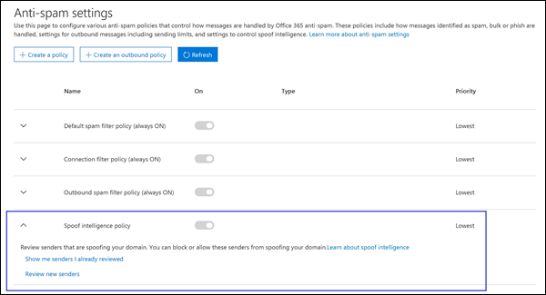

# <a name="manage-spoofed-senders-using-the-spoof-intelligence-policy-and-spoof-intelligence-insight-in-eop"></a>Verwalten von gefälschten Absendern mithilfe der Spoofintelligenz-Richtlinie und des Einblicks in die Spoofintelligenz in EOP

[!INCLUDE [Microsoft 365 Defender rebranding](../includes/microsoft-defender-for-office.md)]

**Gilt für**
- [Microsoft Defender für Office 365 Plan 1 und Plan 2](defender-for-office-365.md)
- [Microsoft 365 Defender](../defender/microsoft-365-defender.md)

> [!NOTE]
> In diesem Artikel wird die ältere Spoofing-Absenderverwaltung beschrieben, die ersetzt wird. Weitere Informationen zur neuen Oberfläche finden Sie unter [Spoof Intelligence Insight in EOP](learn-about-spoof-intelligence.md)

In Microsoft 365 Organisationen mit Postfächern in Exchange Online oder eigenständigen Exchange Online Protection (EOP)-Organisationen ohne Exchange Online Postfächer werden eingehende E-Mail-Nachrichten ab Oktober 2018 automatisch vor Spoofing durch EOP geschützt. EOP verwendet **Spoofintelligenz** als Teil des allgemeinen Schutzes Ihrer Organisation gegen Phishing. Weitere Informationen finden Sie unter [Antispoofingschutz in EOP.](anti-spoofing-protection.md)

Die standardmäßige (und nur) **Spoofintelligenz-Richtlinie** trägt dazu bei, sicherzustellen, dass die von legitimen Absendern gesendeten gefälschten E-Mails nicht in EOP-Spamfilter eingefangen werden, während Ihre Benutzer vor Spam- oder Phishingangriffen geschützt werden. Sie können auch den Einblick in die **Spoofintelligenz** verwenden, um schnell zu ermitteln, welche externen Absender Sie legitimerweise nicht authentifizierte E-Mails senden (Nachrichten von Domänen, die keine SPF-, DKIM- oder DMARC-Prüfungen bestehen).

Sie können Spoofintelligenz im Security & Compliance Center oder in PowerShell (Exchange Online PowerShell für Microsoft 365 Organisationen mit Postfächern in Exchange Online, eigenständiger EOP PowerShell für Organisationen ohne Exchange Online Postfächer) verwalten.

## <a name="what-do-you-need-to-know-before-you-begin"></a>Was sollten Sie wissen, bevor Sie beginnen?

- Sie öffnen das Security & Compliance Center unter <https://protection.office.com/>.
  - Um direkt zur Seite mit den **Antispameinstellungen** für die Spoof intelligence-Richtlinie zu wechseln, verwenden Sie <https://protection.office.com/antispam> .
  - Verwenden Sie die Informationen zur Spoofintelligenz, um direkt zur Seite **"Sicherheitsdashboard"** zu <https://protection.office.com/searchandinvestigation/dashboard> wechseln.

- Wie Sie eine Verbindung mit Exchange Online PowerShell herstellen, finden Sie unter [Herstellen einer Verbindung mit Exchange Online PowerShell](/powershell/exchange/connect-to-exchange-online-powershell). Informationen zum Herstellen einer Verbindung mit dem eigenständigen Exchange Online Protection PowerShell finden Sie unter [Verbinden mit PowerShell in Exchange Online Protection](/powershell/exchange/connect-to-exchange-online-protection-powershell).

- Sie müssen in **Exchange Online** Berechtigungen erhalten, bevor Sie die in diesem Artikel beschriebenen Schritte ausführen können:
  - Um die Spoofintelligenz-Richtlinie zu ändern oder Spoofintelligenz zu aktivieren oder zu deaktivieren, müssen Sie Mitglied der Rollengruppen **"Organisationsverwaltung"** oder **"Sicherheitsadministrator"** sein.
  - Für den schreibgeschützten Zugriff auf die Spoof Intelligence-Richtlinie müssen Sie Mitglied der Rollengruppe **"Globaler Leser"** oder **"Sicherheitsleseberechtigter"** sein.

  Weitere Informationen finden Sie unter [Berechtigungen in Exchange Online](/exchange/permissions-exo/permissions-exo).

  **Hinweise**:

  - Durch Hinzufügen von Benutzern zur entsprechenden Azure Active Directory-Rolle im Microsoft 365 Admin Center erhalten Benutzer die erforderlichen Berechtigungen _und_ Berechtigungen für andere Features in Microsoft 365. Weitere Informationen finden Sie unter [Informationen zu Administratorrollen](../../admin/add-users/about-admin-roles.md).
  - Die Rollengruppe **Organisationsverwaltung mit Leserechten** in [Exchange Online](/Exchange/permissions-exo/permissions-exo#role-groups) ermöglicht auch einen schreibgeschützten Zugriff auf das Feature.

- Die Optionen für Spoofintelligenz werden in [den Spoofingeinstellungen in Antiphishingrichtlinien](set-up-anti-phishing-policies.md#spoof-settings)beschrieben.

- Sie können die Spoofintelligenz-Einstellungen in Antiphishingrichtlinien aktivieren, deaktivieren und konfigurieren. Anweisungen basierend auf Ihrem Abonnement finden Sie in einem der folgenden Themen:

  - [Konfigurieren von Antiphishingrichtlinien in EOP.](configure-anti-phishing-policies-eop.md)
  - [Konfigurieren Von Antiphishingrichtlinien in Microsoft Defender für Office 365](configure-mdo-anti-phishing-policies.md).

- Unsere empfohlenen Einstellungen für Spoofintelligenz finden Sie unter [EOP Antiphishing-Richtlinieneinstellungen.](recommended-settings-for-eop-and-office365.md#eop-anti-phishing-policy-settings)

## <a name="manage-spoofed-senders"></a>Verwalten von gefälschten Absendern

Es gibt zwei Möglichkeiten, gefälschte Absender zuzulassen und zu blockieren:

- [Verwenden der Spoofintelligenz-Richtlinie](#manage-spoofed-senders-in-the-spoof-intelligence-policy)
- [Verwenden des Einblicks in die Spoofintelligenz](#manage-spoofed-senders-in-the-spoof-intelligence-insight)

### <a name="manage-spoofed-senders-in-the-spoof-intelligence-policy"></a>Verwalten von gefälschten Absendern in der Spoof intelligence-Richtlinie

1. Navigieren Sie im Security & Compliance Center zu **Bedrohungsmanagement** \> **Richtlinie** \> **Antispam**.

2. Klicken Sie auf der Seite **"Antispameinstellungen"** auf  um die **Spoof intelligence-Richtlinie** zu erweitern.

   

3. Treffen Sie eine der folgenden Auswahlen:

   - **Überprüfen neuer Absender**
   - **Anzeigen von Absendern, die ich bereits überprüft habe**

4. Wählen Sie in der Option "Entscheiden,ob diese Absender ihr angezeigtes Benutzer-Flyout **spoofen dürfen"** eine der folgenden Registerkarten aus:

   - **Ihre Domänen:** Absender spoofing Benutzer in Ihren internen Domänen.
   - **Externe Domänen:** Absender spoofing Benutzer in externen Domänen.

5. Klicken Sie  in der Spalte **"Spoofing zulassen&quot; auf** das Symbol &quot;Erweitern&quot;. Wählen Sie **&quot;Ja&quot;** aus, um den gefälschten Absender zuzulassen, oder wählen Sie **&quot;Nein&quot;** aus, um die Nachricht als Spoofing zu markieren. Die Aktion wird durch die Standard-Antiphishingrichtlinie oder benutzerdefinierte Antiphishingrichtlinien gesteuert (der Standardwert ist **&quot;Nachricht in Junk-E-Mail-Ordner verschieben").** Weitere Informationen finden Sie unter [Spoofeinstellungen in Antiphishingrichtlinien](set-up-anti-phishing-policies.md#spoof-settings).

   

   Die angezeigten Spalten und Werte werden in der folgenden Liste erläutert:

   - **Gefälschter Benutzer:** Das Benutzerkonto, das gefälscht wird. Dies ist der Absender der Nachricht in der Absenderadresse (auch bekannt als die `5322.From` Adresse), die in E-Mail-Clients angezeigt wird. Die Gültigkeit dieser Adresse wird von SPF nicht überprüft.
     - Auf der Registerkarte **"Ihre Domänen"** enthält der Wert eine einzelne E-Mail-Adresse, oder wenn der Quell-E-Mail-Server mehrere Benutzerkonten spooft, enthält er **mehrere.**
     - Auf der Registerkarte **"Externe Domänen"** enthält der Wert die Domäne des gefälschten Benutzers, nicht die vollständige E-Mail-Adresse.

   - **Sendende Infrastruktur:** Die Domäne in einer reversen DNS-Suche (PTR-Eintrag) der IP-Adresse des Quell-E-Mail-Servers. Wenn die Quell-IP-Adresse keinen PTR-Eintrag aufweist, wird die sendende Infrastruktur als \<source IP\> /24 identifiziert (z. B. 192.168.100.100/24).

     Weitere Informationen zu Nachrichtenquellen und Nachrichtensendern finden Sie unter [Eine Übersicht über E-Mail-Nachrichtenstandards.](how-office-365-validates-the-from-address.md#an-overview-of-email-message-standards)

   - **# der Nachrichten:** Die Anzahl der Nachrichten aus der sendenden Infrastruktur an Ihre Organisation, die den angegebenen gefälschten Absender oder Absender innerhalb der letzten 30 Tage enthalten.

   - **# der Benutzerbeschwerden:** Beschwerden, die ihre Benutzer innerhalb der letzten 30 Tage gegen diesen Absender eingereicht haben. Beschwerden erfolgen in der Regel in Form von Junk-Übermittlungen an Microsoft.

   - **Authentifizierungsergebnis:** Einer der folgenden Werte:
      - **Übergeben:** Der Absender hat die E-Mail-Authentifizierungsprüfungen des Absenders bestanden (SPF oder DKIM).
      - **Fehlgeschlagen:** Der Absender hat die EOP-Absenderauthentifizierungsprüfungen nicht bestanden.
      - **Unbekannt:** Das Ergebnis dieser Überprüfungen ist nicht bekannt.

   - **Entscheidung festgelegt durch:** Zeigt an, wer festgestellt hat, ob die sendende Infrastruktur den Benutzer spoofen darf:
       - **Spoofintelligenz-Richtlinie** (automatisch)
       - **Administrator** (manuell)

   - **Zuletzt angezeigt:** Das letzte Datum, an dem eine Nachricht von der sendenden Infrastruktur empfangen wurde, die den gefälschten Benutzer enthält.

   - **Spoofing zulässig?**: Die hier angezeigten Werte sind:
     - **Ja:** Nachrichten aus der Kombination aus gefälschtem Benutzer und sendender Infrastruktur sind zulässig und werden nicht als gefälschte E-Mails behandelt.
     - **Nein:** Nachrichten aus der Kombination aus gefälschtem Benutzer und sendender Infrastruktur werden als Spoofing gekennzeichnet. Die Aktion wird durch die Standard-Antiphishingrichtlinie oder benutzerdefinierte Antiphishingrichtlinien gesteuert (der Standardwert ist **"Nachricht in Junk-E-Mail-Ordner verschieben").** Weitere Informationen finden Sie im nächsten Abschnitt.

     - **Einige Benutzer** ( nur Die Registerkarte **"Domänen"):** Eine sendende Infrastruktur spooft mehrere Benutzer, wobei einige spoofierte Benutzer zugelassen sind und andere nicht. Verwenden Sie die Registerkarte **Detail ,** um die spezifischen Adressen anzuzeigen.

6. Klicken Sie unten auf der Seite auf **Speichern**.

#### <a name="use-powershell-to-manage-spoofed-senders"></a>Verwenden von PowerShell zum Verwalten von gefälschten Absendern

Verwenden Sie die folgende Syntax, um zulässige und blockierte Absender in Spoofintelligenz anzuzeigen:

```powershell
Get-PhishFilterPolicy [-AllowedToSpoof <Yes | No | Partial>] [-ConfidenceLevel <Low | High>] [-DecisionBy <Admin | SpoofProtection>] [-Detailed] [-SpoofType <Internal | External>]
```

In diesem Beispiel werden detaillierte Informationen zu allen Absendern zurückgegeben, die Benutzer in Ihren Domänen spoofen dürfen.

```powershell
Get-PhishFilterPolicy -AllowedToSpoof Yes -Detailed -SpoofType Internal
```

Ausführliche Informationen zu Syntax und Parametern finden Sie unter ["Get-PhishFilterPolicy".](/powershell/module/exchange/get-phishfilterpolicy)

Führen Sie die folgenden Schritte aus, um zulässige und blockierte Absender in Spoofintelligenz zu konfigurieren:

1. Erfassen Sie die aktuelle Liste der erkannten gefälschten Absender, indem Sie die Ausgabe des Cmdlets **"Get-PhishFilterPolicy"** in eine CSV-Datei schreiben, indem Sie den folgenden Befehl ausführen:

   ```powershell
   Get-PhishFilterPolicy -Detailed | Export-CSV "C:\My Documents\Spoofed Senders.csv"
   ```

2. Bearbeiten Sie die CSV-Datei, um die folgenden Werte hinzuzufügen oder zu ändern:
   - **Absender** (Domäne im PTR-Eintrag des Quellservers oder IP/24-Adresse)
   - **SpoofedUser:** Einer der folgenden Werte:
     - Die E-Mail-Adresse des internen Benutzers.
     - Die E-Mail-Domäne des externen Benutzers.
     - Ein leerer Wert, der angibt, dass Sie alle gefälschten Nachrichten des angegebenen **Absenders** blockieren oder zulassen möchten, unabhängig von der gefälschten E-Mail-Adresse.
   - **AllowedToSpoof** (Ja oder Nein)
   - **SpoofType** (intern oder extern)

   Speichern Sie die Datei, lesen Sie die Datei, und speichern Sie den Inhalt als Variable, die mit dem folgenden Befehl benannt `$UpdateSpoofedSenders` wird:

   ```powershell
   $UpdateSpoofedSenders = Get-Content -Raw "C:\My Documents\Spoofed Senders.csv"
   ```

3. Verwenden Sie die `$UpdateSpoofedSenders` Variable, um die Spoofintelligenz-Richtlinie zu konfigurieren, indem Sie den folgenden Befehl ausführen:

   ```powershell
   Set-PhishFilterPolicy -Identity Default -SpoofAllowBlockList $UpdateSpoofedSenders
   ```

Ausführliche Informationen zu Syntax und Parametern finden Sie unter ["Set-PhishFilterPolicy".](/powershell/module/exchange/set-phishfilterpolicy)

### <a name="manage-spoofed-senders-in-the-spoof-intelligence-insight"></a>Verwalten von gefälschten Absendern in der Spoofintelligenz

1. Wechseln Sie im Security & Compliance Center zum **Dashboard für die Bedrohungsverwaltung.** \> 

2. Suchen Sie in der **zeile Insights** nach einem der folgenden Elemente:

   - **Wahrscheinlich gefälschte Domänen in den letzten sieben Tagen:** Diese Erkenntnisse deuten darauf hin, dass die Spoofintelligenz aktiviert ist (sie ist standardmäßig aktiviert).
   - **Spoofschutz aktivieren:** Dieser Einblick gibt an, dass die Spoofintelligenz deaktiviert ist, und wenn Sie auf den Einblick klicken, können Sie die Spoofintelligenz aktivieren.

3. Der Einblick im Dashboard zeigt Ihnen Informationen wie folgt:

   

   Dieser Einblick hat zwei Modi:

   - **Insight-Modus:** Wenn Spoofintelligenz aktiviert ist, zeigt ihnen der Einblick, wie viele Nachrichten in den letzten sieben Tagen von unseren Funktionen zur Spoofintelligenz betroffen waren.
   - **Was wäre im Modus:** Wenn die Spoofintelligenz deaktiviert ist, zeigt ihnen der Einblick, wie viele Nachrichten in den letzten sieben Tagen von unseren Funktionen zur Spoofintelligenz betroffen *wären.*

   In beiden Fällen werden die in dem Einblick angezeigten gefälschten Domänen in zwei Kategorien unterteilt: **verdächtige Domänen** und **nicht verdächtige Domänen.**

   - **Verdächtige Domänen:**
     - **Spoofing** mit hoher Zuverlässigkeit: Basierend auf den historischen Sendemustern und der Zuverlässigkeitsbewertung der Domänen sind wir sehr sicher, dass es sich bei den Domänen um Spoofing handelt und Dass Nachrichten von diesen Domänen mit größerer Wahrscheinlichkeit bösartig sind.
     - **Mäßiger Vertrauensspoof:** Basierend auf historischen Sendemustern und der Zuverlässigkeitsbewertung der Domänen sind wir moderat sicher, dass es sich bei den Domänen um Spoofing handelt und dass von diesen Domänen gesendete Nachrichten legitim sind. Falsch positive Ergebnisse sind in dieser Kategorie wahrscheinlicher als Spoofing mit hoher Zuverlässigkeit.
   - **Nicht verdächtige Domänen:** Die domäne fehlgeschlagene explizite E-Mail-Authentifizierung überprüft [SPF,](how-office-365-uses-spf-to-prevent-spoofing.md) [DKIM](use-dkim-to-validate-outbound-email.md)und [DMARC](use-dmarc-to-validate-email.md)). Die Domäne hat jedoch unsere impliziten E-Mail-Authentifizierungsprüfungen[(zusammengesetzte Authentifizierung)](email-validation-and-authentication.md#composite-authentication)bestanden. Daher wurde keine Antispoofingaktion für die Nachricht ausgeführt.

#### <a name="view-detailed-information-about-suspicious-and-nonsuspicious-domains"></a>Anzeigen detaillierter Informationen zu verdächtigen und nicht fälligen Domänen

1. Klicken Sie im Einblick in die Spoofintelligenz auf **"Verdächtige Domänen"** oder **"Nicht verdächtige Domänen",** um zur Einblicksseite für **Spoofintelligenz** zu gelangen. Die **Einblicksseite "Spoof Intelligence"** enthält die folgenden Informationen:

   - **Gefälschte Domäne:** Die Domäne des gefälschten Benutzers, die im Feld **"Von"** in E-Mail-Clients angezeigt wird. Diese Adresse wird auch als `5322.From` Adresse bezeichnet.
   - **Infrastruktur**: Wird auch als _sendende Infrastruktur_ bezeichnet. Die Domäne in einer reversen DNS-Suche (PTR-Eintrag) der IP-Adresse des Quell-E-Mail-Servers. Wenn die Quell-IP-Adresse keinen PTR-Eintrag aufweist, wird die sendende Infrastruktur als \<source IP\> /24 identifiziert (z. B. 192.168.100.100/24).
   - **Nachrichtenanzahl:** Die Anzahl der Nachrichten aus der sendenden Infrastruktur an Ihre Organisation, die die angegebene gefälschte Domäne innerhalb der letzten 7 Tage enthalten.
   - **Zuletzt angezeigt:** Das letzte Datum, an dem eine Nachricht von der sendenden Infrastruktur empfangen wurde, die die gefälschte Domäne enthält.
   - **Spoofingtyp:** Dieser Wert ist **extern.**
   - **Spoofing zulässig?**: Die hier angezeigten Werte sind:
     - **Ja:** Nachrichten aus der Kombination aus der Domäne eines gefälschten Benutzers und der sendenden Infrastruktur sind zulässig und werden nicht als gefälschte E-Mails behandelt.
     - **Nein:** Nachrichten aus der Kombination aus der Domäne eines gefälschten Benutzers und der sendenden Infrastruktur werden als Spoofing gekennzeichnet. Die Aktion wird durch die Standard-Antiphishingrichtlinie oder benutzerdefinierte Antiphishingrichtlinien gesteuert (der Standardwert ist **"Nachricht in Junk-E-Mail-Ordner verschieben").**

2. Wählen Sie ein Element in der Liste aus, um Details zum Domänen-/Sendeinfrastrukturpaar in einem Flyout anzuzeigen. Die Informationen umfassen:
   - Warum wir dies abgefangen haben.
   - Was Sie tun müssen.
   - Eine Domänenzusammenfassung.
   - WhoIs-Daten über den Absender.
   - Ähnliche Nachrichten, die wir in Ihrem Mandanten vom gleichen Absender gesehen haben.

   Von hier aus können Sie auch das Domänen-/Senden-Infrastrukturpaar aus der Zulassungsliste zugelassener Absender zum **Spoofing** hinzufügen oder entfernen. Legen Sie einfach die Umschaltfläche entsprechend fest.

   

## <a name="how-do-you-know-these-procedures-worked"></a>Wie können Sie feststellen, dass diese Verfahren erfolgreich waren?

Führen Sie einen der folgenden Schritte aus, um zu überprüfen, ob Sie die Spoofintelligenz mit Absendern konfiguriert haben, die Spoofing zulassen und nicht zulassen:

- Wechseln Sie im Security & Compliance Center zu "Antispam-Richtlinie für die **Bedrohungsmanagementrichtlinie** \>  \>  \> erweitern **Spoofintelligenzrichtlinie"** und wählen Sie "Absender anzeigen" aus, die \> ich bereits überprüft **habe,** wählen Sie die Registerkarte \> **"Ihre Domänen"** oder **"Externe Domänen"** aus, und überprüfen Sie den Wert **"Spoofing zulassen"** für den Absender.

- Führen Sie in PowerShell die folgenden Befehle aus, um die Absender anzuzeigen, die spoofen dürfen und nicht:

  ```powershell
  Get-PhishFilterPolicy -AllowedToSpoof Yes -SpoofType Internal
  Get-PhishFilterPolicy -AllowedToSpoof No -SpoofType Internal
  Get-PhishFilterPolicy -AllowedToSpoof Yes -SpoofType External
  Get-PhishFilterPolicy -AllowedToSpoof No -SpoofType External
  ```

- Führen Sie in PowerShell den folgenden Befehl aus, um die Liste aller gefälschten Absender in eine CSV-Datei zu exportieren:

   ```powershell
   Get-PhishFilterPolicy -Detailed | Export-CSV "C:\My Documents\Spoofed Senders.csv"
   ```
