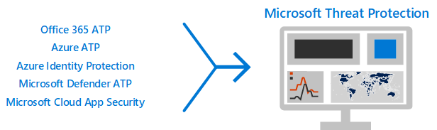

# Die 12 wichtigsten Aufgaben für Sicherheitsteams zur Unterstützung der Arbeit von zu Hause aus

Wenn Sie wie [Microsoft](https://www.microsoft.com/microsoft-365/blog/2020/03/10/staying-productive-while-working-remotely-with-microsoft-teams/) sind und plötzlich selbst eine hauptsächlich Heim basierte Belegschaft unterstützen, möchten wir Ihnen dabei helfen, sicherzustellen, dass Ihre Organisation so sicher wie möglich arbeitet. In diesem Artikel werden Aufgaben priorisiert, mit denen Sicherheitsteams die wichtigsten Sicherheitsfunktionen so schnell wie möglich implementieren können. 

Wenn Sie eine kleine oder mittelgroße Organisation mit einem der Geschäftspläne von Microsoft sind, lesen Sie diese Ressourcen stattdessen:
- [Die 10 wichtigsten Möglichkeiten zum Sichern von Office 365 und Microsoft 365 for Business-Plänen](../admin/security-and-compliance/secure-your-business-data.md) 
- [Microsoft 365 für Kampagnen](https://docs.microsoft.com/microsoft-365/campaigns/?view=o365-worldwide) (enthält eine empfohlene Sicherheitskonfiguration für Microsoft 365 Business)

  
Für Kunden, die unsere Unternehmenspläne verwenden, empfiehlt Microsoft, die in der folgenden Tabelle aufgeführten Aufgaben abzuschließen, die für Ihren Service Plan gelten. Wenn Sie, anstatt einen Microsoft 365 Enterprise-Plan zu kaufen, Abonnements kombinieren, beachten Sie Folgendes:
- Microsoft 365 E3 umfasst Enterprise Mobility + Security (EMS) E3 und Azure AD P1
- Microsoft 365 E5 enthält EMS E5 und Azure AD P2
  
||**Aufgabe**| Alle Office 365 Enterprise Pläne|**Microsoft 365 E3** |**Microsoft 365 E5**|
|:-----|:-----|:-----|:-----|:-----|
|1      |[Aktivieren von mehrstufiger Azure-Authentifizierung (MFA)](#1-enable-azure-multi-factor-authentication-mfa)   |     |   |       | 
|2     | [Schutz vor Bedrohungen](#2-protect-against-threats) | |         |        | 
|3      |  [Konfigurieren Office 365 Advanced Threat Protection](#3-configure-office-365-advanced-threat-protection)  |   |      |       | 
|4       | [Konfigurieren von Azure Advanced Threat Protection (ATP)](#4-configure-azure-advanced-threat-protection)   |   |      |       | 
|5      |   [Aktivieren von Microsoft Advanced Threat Protection](#5-turn-on-microsoft-advanced-threat-protection)  |  |      |       | 
|6       | [Konfigurieren von InTune-Mobile App Schutz für Telefone und Tablets](#6-configure-intune-mobile-app-protection-for-phones-and-tablets) |    |         |         | 
|7      | [Konfigurieren des MFA-und bedingten Zugriffs für Gäste, einschließlich InTune-App-Schutz](#7-configure-mfa-and-conditional-access-for-guests-including-intune-mobile-app-protection)  |    |       |       | 
|8       |  [Registrieren von PCs für die Geräteverwaltung und erfordern von kompatiblen PCs](#8-enroll-pcs-into-device-management-and-require-compliant-pcs)   |  |         |         | 
|9       | [Optimieren Ihres Netzwerks für Cloud-Konnektivität](#9-optimize-your-network-for-cloud-connectivity)  |   |      |        | 
|10     | [Schulen von Benutzern](#10-train-users) |     |      |      | 
|11  |[Erste Schritte mit Microsoft Cloud App Security](#11-get-started-with-microsoft-cloud-app-security) |  |  |   |
|12  |[Überwachen auf Bedrohungen und ergreifen von Aktionen](#12-monitor-for-threats-and-take-action) |   |  |  |
| | | |

   
Bevor Sie beginnen, überprüfen Sie Ihre [Microsoft 365 Secure Score](https://docs.microsoft.com/microsoft-365/security/mtp/microsoft-secure-score) im Microsoft 365 Security Center. Über ein zentralisiertes Dashboard können Sie die Sicherheit für Ihre Microsoft 365-Identitäten,-Daten,-apps,-Geräte und-Infrastruktur überwachen und verbessern. Sie erhalten Punkte zum Konfigurieren empfohlener Sicherheitsfeatures, zum Ausführen sicherheitsbezogener Aufgaben (beispielsweise zum Anzeigen von Berichten) oder zur Adressierung von Empfehlungen mit Anwendungen oder Software eines Drittanbieters. In den empfohlenen Aufgaben in diesem Artikel wird die Punktzahl erhöht.
  

  
## 1: Aktivieren der Azure Multi-Factor Authentication (MFA)
Das einzige beste, was Sie tun können, um die Sicherheit für Mitarbeiter zu verbessern, die von zu Hause aus arbeiten, ist das Aktivieren von MFA. Wenn Sie noch nicht über Prozesse verfügen, behandeln Sie dies als Notfall Pilot, und stellen Sie sicher, dass Sie Unterstützung für Mitarbeiter bereit haben, die den Benutzern helfen, die nicht mehr hängen. Da Sie möglicherweise keine Hardware Sicherheitsgeräte verteilen können, verwenden Sie die Windows Hello Biometrie-und Smartphone-Authentifizierungs-apps wie Microsoft Authenticator.

Normalerweise empfiehlt Microsoft, Benutzern 14 Tage zur Registrierung Ihres Geräts für mehrstufige Authentifizierung zur Verfügung zu stehen, bevor Sie MFA benötigen. Wenn Ihre Mitarbeiter jedoch plötzlich von zu Hause aus arbeiten, müssen Sie die MFA als Sicherheitspriorität verwenden und bereit sein, Benutzern zu helfen, die Sie benötigen. 

Die Anwendung dieser Richtlinien dauert nur ein paar Minuten, aber Sie können Ihre Benutzer in den nächsten Tagen unterstützen.  

|Plan  |Empfehlung  |
|---------|---------|
|Microsoft 365 Pläne (ohne Azure AD P1 oder P2)     |[Aktivieren Sie die Sicherheitsstandards in Azure AD](https://docs.microsoft.com/azure/active-directory/fundamentals/concept-fundamentals-security-defaults). Zu den Sicherheitsstandards in Azure AD gehört MFA für Nutzer und Administratoren.   |
|Microsoft 365 E3 (mit Azure AD P1)     | Verwenden Sie [Allgemeine Richtlinien für den bedingten Zugriff](https://docs.microsoft.com/azure/active-directory/conditional-access/concept-conditional-access-policy-common), um die folgenden Richtlinien zu konfigurieren:  - [MFA für Administratoren erforderlich](https://docs.microsoft.com/azure/active-directory/conditional-access/howto-conditional-access-policy-admin-mfa)  - [MFA für alle Nutzer erforderlich](https://docs.microsoft.com/azure/active-directory/conditional-access/howto-conditional-access-policy-all-users-mfa)   - [Blockieren von Legacy-Authentifizierung](https://docs.microsoft.com/azure/active-directory/conditional-access/howto-conditional-access-policy-block-legacy)       |
|Microsoft 365 E5 (mit Azure AD P2)     | Nutzen Sie den Azure AD-Identity Protection, beginnen Sie mit der Implementierung des von Microsoft [empfohlenen Satzes von bedingtem Zugriff und zugehörigen Richtlinien](../enterprise/identity-access-policies.md), indem Sie die folgenden 2 Richtlinien nutzen:  - [MFA erforderlich, wenn das Anmelderisiko mittel oder hoch ist](../enterprise/identity-access-policies.md#require-mfa-based-on-sign-in-risk)  - [Blockieren von Clients, die die moderne Authentifizierung nicht unterstützen](../enterprise/identity-access-policies.md#block-clients-that-dont-support-modern-authentication) - [Nutzer mit hohem Risiko müssen das Kennwort ändern](../enterprise/identity-access-policies.md#high-risk-users-must-change-password)       |
| | |

  
## 2: Schutz vor Bedrohungen

Alle Microsoft 365-Pläne umfassen eine Vielzahl von Features zum Schutz vor Bedrohungen. Das Aufstoßen von Schutz für diese Features dauert nur ein paar Minuten.
- Schutz vor Schadsoftware
- Schutz vor bösartigen URLs und Dateien
- Antiphishingschutz
- Antispamschutz

Unter [Protect Against Threats in Office 365](office-365-security/protect-against-threats.md) finden Sie Anleitungen, die Sie als Ausgangspunkt verwenden können.
    

## 3: Konfigurieren Office 365 Advanced Threat Protection

Office 365 Advanced Threat Protection (ATP), das in Microsoft 365 E5 und Office 365 E5 enthalten ist, schützt Ihre Organisation vor böswilligen Bedrohungen durch e-Mail-Nachrichten, Links (URLs) und Tools für die Zusammenarbeit. Die Konfiguration kann mehrere Stunden dauern.

Office 365 ATP:
- Schützt Ihre Organisation vor unbekannten e-Mail-Bedrohungen in Echtzeit mithilfe intelligenter Systeme, die Anlagen und Links auf böswillige Inhalte überprüfen. Zu diesen automatisierten Systemen gehören eine robuste detonations Plattform, Heuristiken und Lernmodelle für Computer. 
- Schützt Ihre Organisation, wenn Benutzer zusammenarbeiten und Dateien freigeben, indem Sie bösartige Dateien in Teamwebsites und Dokumentbibliotheken erkennen und blockieren. 
- Wendet Computer Lernmodelle und erweiterte Erkennungsalgorithmen für Identitätswechsel an, um Phishing-Angriffe zu verhindern. 

Eine Übersicht, einschließlich einer Zusammenfassung der Pläne, finden Sie unter [Office 365 Advanced Threat Protection](office-365-security/office-365-atp.md).

Ihr globaler Administrator kann diese Schutzmaßnahmen konfigurieren:
- [Einrichten von ATP-Safe-Links](office-365-security/set-up-atp-safe-links-policies.md)
- [Einrichten von Richtlinien zu sicheren Anlagen in ATP](office-365-security/set-up-atp-safe-attachments-policies.md)
- [Einrichten einer benutzerdefinierten Liste für URLs, die nicht neu geschrieben werden sollen](office-365-security/set-up-a-custom-do-not-rewrite-urls-list-with-atp.md)
- [Einrichten einer benutzerdefinierten Liste für blockierte URLs](office-365-security/set-up-a-custom-blocked-urls-list-atp.md)

Sie müssen mit Ihrem Exchange Online Administrator und SharePoint Online Administrator zusammenarbeiten, um ATP für diese Arbeitslasten zu konfigurieren:
- [Aktivieren von ATP für SharePoint, OneDrive und Microsoft Teams](office-365-security/turn-on-atp-for-spo-odb-and-teams.md)

## 4: Konfigurieren von Azure Advanced Threat Protection

[Azure Advanced Threat Protection](https://docs.microsoft.com/azure-advanced-threat-protection/what-is-atp) (Azure ATP) ist eine Cloud-basierte Sicherheitslösung, die ihre lokalen Active Directory Signale nutzt, um erweiterte Bedrohungen, kompromittierte Identitäten und böswillige Insider Aktionen zu identifizieren, zu erkennen und zu untersuchen, die an Ihre Organisation gerichtet sind. Konzentrieren Sie sich auf das nächste, da es Ihre on-Prem-und Cloud-Infrastruktur schützt, keine Abhängigkeiten oder Voraussetzungen hat und unmittelbare Vorteile bieten kann.

- Siehe [Azure ATP-Schnellstarts](https://docs.microsoft.com/azure-advanced-threat-protection/install-atp-step1) , um Setup schnell zu erhalten 
- [Video ansehen: Einführung in Azure ATP](https://www.youtube.com/watch?reload=9&v=EGY2m8yU_KE)
- Überprüfen der [drei Phasen der Azure ATP-Bereitstellung](https://docs.microsoft.com/azure-advanced-threat-protection/what-is-atp#whats-next)

## 5: Aktivieren von Microsoft Advanced Threat Protection

Nachdem Sie nun Office 365 ATP und Azure ATP konfiguriert haben, können Sie die kombinierten Signale aus diesen Funktionen in einem Dashboard anzeigen. [Microsoft Threat Protection](https://docs.microsoft.com/microsoft-365/security/mtp/microsoft-threat-protection) (MTP) vereint Warnungen, Vorfälle, automatische Untersuchung und Reaktion sowie erweitertes jagen über Arbeitslasten hinweg (Azure ATP, Office 365 ATP, Microsoft Defender ATP und Microsoft Cloud App Security) in einem einzelnen Bereich unter [Security.Microsoft.com](https://security.microsoft.com). 
 

  
Nachdem Sie einen oder mehrere ihrer Advanced Threat Protection-Dienste konfiguriert haben, aktivieren Sie MTP. Neue Features werden kontinuierlich zu MTP hinzugefügt; Sie können sich für das erhalten von Vorschau Features entscheiden.

- [Weitere Informationen zu MTP](https://docs.microsoft.com/microsoft-365/security/mtp/microsoft-threat-protection?view=o365-worldwide)
- [Aktivieren von MTP](https://docs.microsoft.com/microsoft-365/security/mtp/mtp-enable?view=o365-worldwide)
- [Opt-in für Vorschau-Features](https://docs.microsoft.com/microsoft-365/security/mtp/preview?view=o365-worldwide)

## 6: Konfigurieren von InTune-Mobile App Schutz für Telefone und Tablets

Mit der mobilen Anwendungsverwaltung von Microsoft InTune (MAM) können Sie die Daten Ihrer Organisation auf Telefonen und Tablets verwalten und schützen, ohne diese Geräte zu verwalten. So funktioniert es:
- Sie erstellen eine APP-Schutzrichtlinie (app), die bestimmt, welche apps auf einem Gerät verwaltet werden und welche Verhaltensweisen zulässig sind (beispielsweise verhindern, dass Daten aus einer verwalteten app in eine nicht verwaltete App kopiert werden). Sie erstellen eine Richtlinie für jede Plattform (Ios, Android).
- Nach dem Erstellen der APP-Schutzrichtlinien erzwingen Sie diese, indem Sie eine Regel für bedingten Zugriff in Azure AD erstellen, um genehmigte apps und App-Datenschutz zu erfordern.

App Protection-Richtlinien umfassen viele Einstellungen. Glücklicherweise müssen Sie nicht mehr über jede Einstellung erfahren und die Optionen abwägen. Microsoft erleichtert das Anwenden einer Konfiguration von Einstellungen durch Empfehlung von Startpunkten. Das [Datenschutz Framework, das App-Schutzrichtlinien verwendet](https://docs.microsoft.com/mem/intune/apps/app-protection-framework) , umfasst drei Ebenen, aus denen Sie auswählen können. 

Sogar besser: Microsoft koordiniert dieses app-Schutz Framework mit einer Reihe von bedingten Zugriffen und verwandten Richtlinien, die wir allen Organisationen als Ausgangspunkt empfehlen. Wenn Sie MFA mithilfe der Anleitungen in diesem Artikel implementiert haben, sind Sie auf halbem Weg da!

Um Mobile App Schutz zu konfigurieren, verwenden Sie die Anleitungen in [allgemeinen Richtlinien für Identitäts-und Geräte Zugriff](../enterprise/identity-access-policies.md):
 1. Verwenden Sie die Richt [Linien zum Anwenden von App-Datenschutzrichtlinien](../enterprise/identity-access-policies.md#apply-app-data-protection-policies) , um Richtlinien für IOS und Android zu erstellen. Stufe 2 (erweiterter Datenschutz) wird für den grundlegenden Schutz empfohlen. 
 2. Erstellen Sie eine Regel für bedingten Zugriff, um [genehmigte apps und App-Schutz zu erfordern](../enterprise/identity-access-policies.md#require-approved-apps-and-app-protection). 

## 7: Konfigurieren Sie den MFA-und bedingten Zugriff für Gäste, einschließlich InTune-Mobile App Schutz

Lassen Sie uns als nächstes sicherstellen, dass Sie weiterhin zusammenarbeiten und mit Gästen zusammenarbeiten können. Wenn Sie den Microsoft 365 E3-Plan verwenden und MFA für alle Benutzer implementiert haben, sind Sie festgelegt. 

Wenn Sie den Microsoft 365 E5-Plan verwenden und den Azure Identity Protection für die risikobasierte MFA nutzen, müssen Sie einige Anpassungen vornehmen (da sich Azure AD Identitätsschutz nicht auf Gäste erstreckt):
- Erstellen Sie eine neue Regel für bedingten Zugriff, sodass MFA immer für Gäste und externe Benutzer erforderlich ist.
- Aktualisieren Sie die risikobasierte MFA-bedingte Zugriffsregel, um Gäste und externe Benutzer auszuschließen.

Verwenden Sie die Anleitungen [zum Aktualisieren der allgemeinen Richtlinien zum zulassen und schützen von Gast und externem Zugriff](../enterprise/identity-access-policies-guest-access.md) , um zu verstehen, wie der Gastzugriff mit Azure AD funktioniert, und um die betroffenen Richtlinien zu aktualisieren. 

Die von Ihnen erstellten Schutzrichtlinien für InTune Mobile App zusammen mit der Regel für bedingten Zugriff, um genehmigte apps und App-Schutz zu erfordern, gelten für Gästekonten und tragen zum Schutz Ihrer Organisationsdaten bei. 

> [!NOTE]
> Wenn Sie PCs bereits in der Geräteverwaltung registriert haben, um kompatible PCs zu benötigen, müssen Sie auch Gastkonten aus der Regel für bedingten Zugriff ausschließen, die die Geräte Konformität erzwingt. 

## 8: Registrieren von PCs in der Geräteverwaltung und erfordern von kompatiblen PCs

Es gibt verschiedene Methoden, um die Geräte ihrer Mitarbeiter zu registrieren. Jede Methode hängt von der Art des Besitzes des Geräts (privat oder geschäftlich), vom Gerätetyp (iOS, Windows, Android) und von Verwaltungsanforderungen (Zurücksetzungen, Affinität, Sperrung) ab. Dies kann eine gewisse Zeit in Anspruch nehmen. Siehe: [Registrieren von Geräten in Microsoft InTune](https://docs.microsoft.com/mem/intune/enrollment/). 

Am schnellsten erhalten Sie die Möglichkeit, die [automatische Registrierung für Windows 10-Geräte einzurichten](https://docs.microsoft.com/mem/intune/enrollment/quickstart-setup-auto-enrollment). 

Sie können auch die Vorteile dieser Lernprogramme nutzen:
- [Verwenden von Autopilot zum Registrieren von Windows-Geräten in InTune](https://docs.microsoft.com/mem/intune/enrollment/tutorial-use-autopilot-enroll-devices)
- [Verwenden Sie Apples Features für die unternehmensweite Geräteregistrierung in Apple Business Manager (ABM), um IOS/iPads-Geräte in InTune zu registrieren.](https://docs.microsoft.com/mem/intune/enrollment/tutorial-use-device-enrollment-program-enroll-ios)

Verwenden Sie nach dem Registrieren von Geräten die Anleitungen unter [Allgemeine Identitäts-und Gerätezugriffs Richtlinien](../enterprise/identity-access-policies.md) , um diese Richtlinien zu erstellen:
- [Definieren von Richtlinien für Geräte Konformität](../enterprise/identity-access-policies.md#define-device-compliance-policies) – die empfohlenen Einstellungen für Windows 10 umfassen den Schutz vor Viren. Wenn Sie über Microsoft 365 E5 verfügen, verwenden Sie Microsoft Defender Advanced Threat Protection, um die Integrität von mitarbeitergeräten zu überwachen. Achten Sie darauf, dass Compliance-Richtlinien für andere Betriebssysteme Antivirenschutz und End-Punkt-Schutz Software umfassen. 
- [Kompatible PCs erfordern](../enterprise/identity-access-policies.md#require-compliant-pcs-but-not-compliant-phones-and-tablets) – Dies ist die Regel für bedingten Zugriff in Azure AD, die die Geräte Konformitätsrichtlinien erzwingt.

Nur eine Organisation kann ein Gerät verwalten, daher müssen Sie die Gastkonten aus der Regel für bedingten Zugriff in Azure AD ausschließen. Wenn Sie Gast-und externe Benutzer nicht von Richtlinien ausschließen, die die Gerätekompatibilität erfordern, werden diese Benutzer durch diese Richtlinien blockiert. Weitere Informationen finden Sie unter [Aktualisieren der allgemeinen Richtlinien zum zulassen und schützen von Gast und externem Zugriff](../enterprise/identity-access-policies-guest-access.md).

## 9: Optimieren Ihres Netzwerks für Cloud-Konnektivität

Wenn Sie schnell den Großteil ihrer Mitarbeiter von zu Hause aus arbeiten lassen, kann dieser plötzliche Wechsel von Verbindungs Mustern erhebliche Auswirkungen auf die Unternehmensnetzwerk Infrastruktur haben. Viele Netzwerke wurden skaliert und entworfen, bevor Cloud-Dienste angenommen wurden. In vielen Fällen sind Netzwerke für Remote Arbeitsthreads tolerant, aber nicht für die gleichzeitige Verwendung von Remote-Benutzern ausgelegt.

Netzwerkelemente wie VPN-Konzentratoren, zentrale Ausstiegs Geräte (beispielsweise Proxies und Verhinderung von Datenverlust), zentrale Internet Bandbreite, Backhaul MPLS-Schaltungen, NAT-Funktionen und so weiter werden aufgrund der Auslastung des gesamten Unternehmens mit ihnen plötzlich unter enorme Belastung gesetzt. Das Endergebnis ist eine schlechte Leistung und Produktivität gepaart mit einer schlechten Benutzerfreundlichkeit für Benutzer, die sich an die Arbeit von zu Hause anpassen.

Einige der Schutzmechanismen, die traditionell vom Routing Datenverkehr über ein Unternehmensnetzwerk bereitgestellt wurden, werden von den Cloud-apps bereitgestellt, auf die Ihre Benutzer zugreifen. Wenn Sie diesen Schritt in diesem Artikel erreicht haben, haben Sie eine Reihe von ausgefeilten Cloud-Sicherheitssteuerelementen für Microsoft 365-Dienste und-Daten implementiert. Wenn diese Steuerelemente vorhanden sind, können Sie den Datenverkehr von Remotebenutzern direkt an Office 365 weiterleiten. Wenn Sie weiterhin einen VPN-Link für den Zugriff auf andere Anwendungen benötigen, können Sie Ihre Leistung und Benutzerfreundlichkeit erheblich verbessern, indem Sie den geteilten Tunneling implementieren. Sobald Sie eine Vereinbarung in Ihrer Organisation erzielt haben, kann dies innerhalb eines Tages durch ein gut koordiniertes Netzwerkteam erfolgen.

Weitere Informationen finden Sie in den folgenden Ressourcen zu Dokumenten:
- [Übersicht: Optimieren der Konnektivität für Remotebenutzer mithilfe von VPN-Split-Tunneling](https://docs.microsoft.com/Office365/Enterprise/office-365-vpn-split-tunnel)
- [Implementieren eines geteilten VPN-Tunnels für Office 365](https://docs.microsoft.com/Office365/Enterprise/office-365-vpn-implement-split-tunnel)

Aktuelle Blog Artikel zu diesem Thema:
- [Gewusst wie schnelles Optimieren des Datenverkehrs für Remotemitarbeiter & verringern der Auslastung Ihrer Infrastruktur](https://techcommunity.microsoft.com/t5/office-365-blog/how-to-quickly-optimize-office-365-traffic-for-remote-staff-amp/ba-p/1214571#)
- [Alternative Methoden für Sicherheitsexperten und IT, um moderne Sicherheitssteuerelemente in den eindeutigen Remote-arbeitsszenarien von heute zu erreichen](https://www.microsoft.com/security/blog/2020/03/26/alternative-security-professionals-it-achieve-modern-security-controls-todays-unique-remote-work-scenarios/)

## 10: Schulen von Benutzern

Schulung Benutzer können Ihre Benutzer und Sicherheits Betriebsteams viel Zeit und Frustration speichern. Versierte Benutzer sind weniger wahrscheinlich, Anlagen zu öffnen oder auf Links in fragwürdigen e-Mail-Nachrichten klicken, und Sie sind eher zu verdächtigen Websites zu vermeiden. 

Das Harvard Kennedy School [Cyber Campaign Handbook](https://go.microsoft.com/fwlink/?linkid=2015598&amp;clcid=0x409) bietet eine hervorragende Anleitung zum Einrichten einer starken Kultur des Sicherheitsbewusstseins in Ihrer Organisation, einschließlich der Schulung von Benutzern zur Identifizierung von Phishing-Angriffen. 

Microsoft 365 stellt die folgenden Ressourcen zur Verfügung, um Benutzer in Ihrer Organisation zu informieren:

|Konzept  |Ressourcen  |
|---------|---------|
|Microsoft 365     |[Anpassbare Lern Pfade](https://docs.microsoft.com/office365/customlearning/) 
Diese Ressourcen können Ihnen helfen, Schulungen für Endbenutzer in Ihrer Organisation zusammenzustellen.        |
|Microsoft 365 Security Center |[Lern Modul: Sichern Ihrer Organisation mit integrierter intelligenter Sicherheit von Microsoft 365](https://docs.microsoft.com/learn/modules/security-with-microsoft-365) 
In diesem Modul können Sie beschreiben, wie Microsoft 365-Sicherheitsfeatures zusammenarbeiten und die Vorteile dieser Sicherheitsfeatures artikulieren. |
|Mehrstufige Authentifizierung     | [Überprüfung in zwei Schritten: Was ist die zusätzliche Überprüfungsseite?](https://docs.microsoft.com/azure/active-directory/user-help/multi-factor-authentication-end-user-first-time) 
Dieser Artikel hilft Endbenutzern, die mehrstufige Authentifizierung zu verstehen, und warum Sie in Ihrer Organisation verwendet wird.    |
| | |

Zusätzlich zu diesen Anleitungen empfiehlt Microsoft, dass Ihre Benutzer die in diesem Artikel beschriebenen Aktionen ausführen: [schützen Sie Ihr Konto und Ihre Geräte vor Hackern und Schadsoftware](https://support.office.com/article/066d6216-a56b-4f90-9af3-b3a1e9a327d6.aspx). Diese setzen sich wie folgt zusammen:
  
- Verwenden sicherer Kennwörter
    
- Schützen von Geräten 
    
- Aktivieren von Sicherheitsfunktionen auf Windows 10-und Mac-PCs (für nicht verwaltete Geräte)
    
Microsoft empfiehlt auch, dass Benutzer Ihre persönlichen e-Mail-Konten schützen, indem Sie die in den folgenden Artikeln empfohlenen Aktionen ausführen:
  
- [Schützen Ihres Outlook.com-e-Mail-Kontos](https://support.office.com/article/a4f20fc5-4307-4ece-8231-6d4d4bd8a9ba.aspx)
    
- [Schützen Ihres gmail-Kontos mit zweistufiger Überprüfung](https://go.microsoft.com/fwlink/?linkid=2015688&amp;clcid=0x409)

## 11: Erste Schritte mit der Microsoft Cloud-App-Sicherheit

[Microsoft Cloud App Security](https://docs.microsoft.com/cloud-app-security) bietet umfangreiche Sichtbarkeit, Kontrolle über Daten Reisen und ausgefeilte Analysen zur Erkennung und Bekämpfung von Bedrohungen in allen Cloud-Diensten. Sobald Sie mit der Cloud-App-Sicherheit begonnen haben, werden Anomalie-Erkennungsrichtlinien automatisch aktiviert, aber die Cloud-App-Sicherheit hat eine anfängliche Lernphase von sieben Tagen, während der nicht alle Warnungen zur Anomalie-Erkennung ausgelöst werden.

Jetzt erste Schritte mit Cloud App Security. Später können Sie komplexere Überwachung und Steuerungen einrichten.

- [Schnellstart: Erste Schritte mit der Cloud-App-Sicherheit](https://docs.microsoft.com/cloud-app-security/getting-started-with-cloud-app-security)
- [Abrufen von sofort Verhaltensanalysen und Anomalie-Erkennung](https://docs.microsoft.com/cloud-app-security/anomaly-detection-policy)
- [Weitere Informationen zur Microsoft Cloud-App-Sicherheit](https://docs.microsoft.com/cloud-app-security/what-is-cloud-app-security)
- [Überprüfen neuer Features und Funktionen](https://docs.microsoft.com/cloud-app-security/release-notes)
- [Siehe grundlegende Setupanweisungen](https://docs.microsoft.com/cloud-app-security/general-setup)

## 12: Überwachen von Bedrohungen und ergreifen von Aktionen

Microsoft 365 umfasst mehrere Möglichkeiten zum Überwachen des Status und ergreifen geeigneter Aktionen. Ihr bester Ausgangspunkt ist das Microsoft 365 Security Center ([https://security.microsoft.com](https://security.microsoft.com)), in dem Sie die [Microsoft Secure-Bewertung](https://docs.microsoft.com/microsoft-365/security/mtp/microsoft-secure-score?view=o365-worldwide)Ihrer Organisation sowie alle Warnungen oder Entitäten anzeigen können, die Ihre Aufmerksamkeit erfordern.

- [Erste Schritte mit dem Microsoft 365 Security Center](https://docs.microsoft.com/microsoft-365/security/mtp/overview-security-center?view=o365-worldwide)
- [Überwachen und Anzeigen von Berichten](https://docs.microsoft.com/microsoft-365/security/mtp/monitoring-and-reporting?view=o365-worldwide)
- [Siehe Sicherheits Portale in Microsoft 365](https://docs.microsoft.com/microsoft-365/security/mtp/portals)

## Nächste Schritte

Herzlichen Glückwunsch! Sie haben schnell einige der wichtigsten Sicherheitsschutz Funktionen implementiert, und Ihre Organisation ist wesentlich sicherer. Jetzt sind Sie bereit, mit den Funktionen zum Schutz vor Bedrohungen (einschließlich des Advanced Threat Protection von Microsoft Defender), der Funktionen zur Datenklassifizierung und des Schutzes sowie der Sicherung von Administratorkonten noch weiter zu gehen. Eine ausführlichere, methodische Reihe von Sicherheitsempfehlungen für Microsoft 365 finden Sie unter [Microsoft 365 Security for Business decision makers (BDMs)](Microsoft-365-security-for-bdm.md). 

Besuchen Sie auch das neue Sicherheitscenter von Microsoft auf [docs.Microsoft.com/Security](https://docs.microsoft.com/security). 
