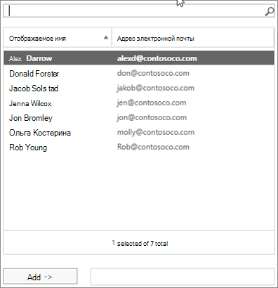

# Zulassen, dass Mitglieder im Namen einer Gruppe senden oder sendenAllow members to send as or send on behalf of a group

Ein Mitglied einer Microsoft 365-Gruppe, dem  die Berechtigungen **Senden** als oder Senden im Auftrag erteilt wurden, kann E-Mails als Gruppe oder im Namen der Gruppe senden.A member of a Microsoft 365 group who has been granted **Send as** or **Send on behalf** permissions can send email as the group, or on behalf of the group. (Gästen in der Gruppe können diese Berechtigungen nicht erteilt werden.)(Guests in the group cannot be granted these permissions.)

In diesem Artikel wird erläutert, wie ein globaler Oder Exchange-Administrator diese Berechtigungen festlegen kann.This article explains how a global or Exchange administrator can set these permissions.
  
Wenn Megan Bowen z. B. Teil der Microsoft 365-Schulungsgruppe ist und über Berechtigungen für die Gruppe "Senden als" verfügt, sieht es so aus, als ob die Schulungsgruppe die E-Mail gesendet hat, wenn sie eine E-Mail als Gruppe sendet.   For example, if Megan Bowen is part of the **Training** Microsoft 365 group, and has **Send as** permissions on the group, if she sends an email as the group, it will look like the **Training** group sent the email. 
  
Mit der Berechtigung Senden **im Auftrag** kann ein Benutzer E-Mails im Auftrag einer Microsoft 365-Gruppe senden.The **Send on Behalf** permission lets a user send email on behalf of a Microsoft 365 group. Wenn Alex Wilber z. B. Teil der Microsoft 365-Marketinggruppe ist und über Berechtigungen zum Senden im Auftrag von Microsoft 365 verfügt und eine E-Mail als Gruppe sendet, sieht die E-Mail so aus, als ob sie von **Alex Wilber** im Auftrag von Marketing gesendet wurde.  For example, if Alex Wilber is a part of the **Marketing** Microsoft 365 group, and has **Send on Behalf** permissions and sends an email as the group, the email looks like it was sent by **Alex Wilber on behalf of Marketing**.

> [!IMPORTANT]
> Sie können **Senden als** oder Senden im Auftrag **eines** bestimmten Benutzers konfigurieren, aber nicht beides.You can configure **Send as** or **Send on behalf** for a given user, but not both. Wenn Sie beides konfigurieren, wird standardmäßig **Senden als verwendet.**If you configure both, it will default to **Send as**.

> [!TIP]
> Informationen zur Verwendung von Outlook und Outlook im Web zum Senden von E-Mails von einer Gruppe finden Sie unter Senden von E-Mails von oder im Auftrag einer [Microsoft 365-Gruppe.](https://support.microsoft.com/office/0f4964af-aec6-484b-a65c-0434df8cdb6b)See [Send email from or on behalf of a Microsoft 365 group](https://support.microsoft.com/office/0f4964af-aec6-484b-a65c-0434df8cdb6b) to learn how to use Outlook and Outlook on the Web to send email from a group.
    
## Zulassen, dass Mitglieder E-Mails als Gruppe sendenAllow members to send email as a group

In diesem Abschnitt wird erläutert, wie Benutzern das Senden von E-Mails als Gruppe im [Exchange Admin Center](https://go.microsoft.com/fwlink/p/?linkid=2059104) (EAC) in Exchange Online ermöglicht wird.This section explains how to allow users to send email as a group in the [Exchange admin center](https://go.microsoft.com/fwlink/p/?linkid=2059104) (EAC) in Exchange Online.
  
1. Wechseln Sie <a href="https://go.microsoft.com/fwlink/p/?linkid=2059104" target="_blank">im Exchange Admin Center</a>zu  \> **Empfängergruppen**.In the <a href="https://go.microsoft.com/fwlink/p/?linkid=2059104" target="_blank">Exchange admin center</a>, go to **Recipients** \> **Groups**.
    
2. Wählen **Sie Gruppensymbol** bearbeiten in der Gruppe aus, die Benutzer  möchten.  Select **Edit**   on the group that you want to allow users to send as. 
    
3. Wählen Sie **Gruppendelegierung** aus.Select **group delegation**.
    
4. Wählen Sie **im Abschnitt** Senden als das Zeichen aus, um die Benutzer hinzuzufügen, die Sie als Gruppe **+** senden möchten.In the **Send As** section, select the **+** sign to add the users that you want to send as the Group. 
    
    
  
5. Geben Sie einen Namen ein, um einen Benutzer zu suchen, oder wählen Sie ihn aus der Liste aus.Type to search or pick a user from the list. Wählen Sie **OK** und **Speichern aus.**Select **OK** and **Save**.
    
    
  
## Zulassen, dass Mitglieder E-Mails im Namen einer Gruppe sendenAllow members to send email on behalf of a group

In diesem Abschnitt wird erläutert, wie Benutzern das Senden von E-Mails im Namen einer Gruppe im Exchange Admin Center (EAC) in Exchange Online ermöglicht wird.This section explains how to allow users to send email on behalf of a group in the Exchange admin center (EAC) in Exchange Online.
  
1. Wechseln Sie <a href="https://go.microsoft.com/fwlink/p/?linkid=2059104" target="_blank">im Exchange Admin Center</a>zu  \> **Empfängergruppen**.In the <a href="https://go.microsoft.com/fwlink/p/?linkid=2059104" target="_blank">Exchange admin center</a>, go to **Recipients** \> **Groups**.
    
2. Wählen **Sie Gruppensymbol** bearbeiten in der Gruppe aus, die Benutzer  möchten.Select **Edit**  on the group that you want to allow users to send as. 
    
3. Wählen Sie **Gruppendelegierung** aus.Select **group delegation**.
    
4. Wählen Sie im Abschnitt Senden im Auftrag das Zeichen aus, um die Benutzer hinzuzufügen, die Sie **+** als Gruppe senden möchten.In the Send on Behalf section, select the **+** sign to add the users that you want to send as the Group. 
    
    
  
5. Geben Sie einen Namen ein, um einen Benutzer zu suchen, oder wählen Sie ihn aus der Liste aus.Type to search or pick a user from the list. Wählen Sie **OK** und **Speichern aus.**Select **OK** and **Save**.
    
    

## Verwandte ArtikelRelated articles

[Schritt-für-Schritt-Planung für die ZusammenarbeitsgovernanceCollaboration governance planning step-by-step](collaboration-governance-overview.md#collaboration-governance-planning-step-by-step)

[Erstellen eines Plans für die ZusammenarbeitsgovernanceCreate your collaboration governance plan](collaboration-governance-first.md)

[Weitere Informationen zu Microsoft 365-GruppenLearn more about Microsoft 365 groups](https://support.microsoft.com/office/b565caa1-5c40-40ef-9915-60fdb2d97fa2)

[Add-RecipientPermissionAdd-RecipientPermission](/powershell/module/exchange/add-recipientpermission)

[Set-UnifiedGroupSet-UnifiedGroup](/powershell/module/exchange/set-unifiedgroup)