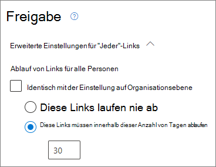
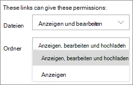
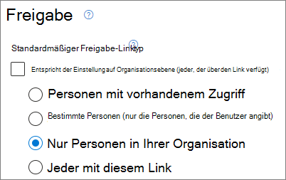
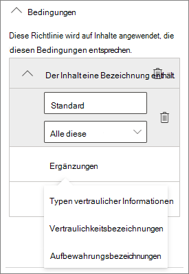
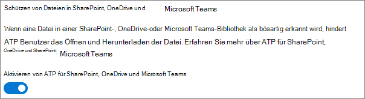

# Bewährte Methoden zum Freigeben von Dateien und Ordnern für nicht authentifizierte Benutzer

Die Freigabe ohne Authentifizierung (über *Jeder*-Links) kann zweckmäßig sein und eignet sich in verschiedenen Szenarien. *Jeder*-Links sind die einfachste Möglichkeit zur Freigabe: Personen können den Link ohne Authentifizierung öffnen und ihn an andere Personen weiterleiten.

Normalerweise eignen sich nicht alle Inhalte in an einer Organisation für die nicht authentifizierte Freigabe. In diesem Artikel werden die Möglichkeiten beschrieben, die Ihnen beim Erstellen einer Umgebung helfen, in der Ihre Benutzer die Freigabe von Dateien und Ordner ohne Authentifizierung verwenden können, in der aber Sicherheitsvorkehrungen vorhanden sind, um den Inhalt Ihrer Organisation zu schützen.

> [!NOTE]
> Damit die Freigabe ohne Authentifizierung funktioniert, müssen Sie sie für Ihre Organisation und für die jeweilige Website oder das betreffende Team aktivieren, das die anonyme Freigabe verwenden soll. Das Szenario, das Sie aktivieren möchten, finden Sie unter [Zusammenarbeit mit Personen außerhalb Ihres Unternehmens](collaborate-with-people-outside-your-organization.md).

## Festlegen eines Ablaufdatums für Jeder-Links

Dateien werden häufig über einen längeren Zeitraum in Websites, Gruppen und Teams gespeichert. Es gibt gelegentlich Datenaufbewahrungsrichtlinien, bei denen die Aufbewahrung von Dateien über Jahre erforderlich ist. Wenn derartige Dateien für nicht authentifizierte Personen freigegeben werden, kann dies zu einem unerwarteten Zugriff und zu Änderungen an Dateien in der Zukunft führen. Um dies zu verhindern, können Sie eine Ablaufzeit für *Jeder*-Links konfigurieren.

Sobald ein *Jeder*-Link abläuft, kann er nicht mehr für den Zugriff auf den Inhalt verwendet werden.

So legen Sie ein Ablaufdatum für „Jeder“-Links im gesamten Unternehmen fest

1. Öffnen Sie das [SharePoint Online Admin Center](https://admin.microsoft.com/sharepoint).
2. Klicken Sie in der linken Navigationsleiste auf **Freigabe**.
3. Aktivieren Sie unter **Wählen Sie Berechtigungen und Ablaufoptionen für Jeder-Links aus** das Kontrollkästchen **Diese Links müssen innerhalb dieser Anzahl von Tagen ablaufen**. 
   
4. Geben Sie im Feld eine Anzahl von Tagen ein, und klicken Sie dann auf **Speichern**.

So legen Sie ein Ablaufdatum für „Jeder“-Links auf einer bestimmten Seite fest

1. Öffnen Sie das [SharePoint Online Admin Center](https://admin.microsoft.com/sharepoint).
2. Erweitern Sie im linken Navigationsbereich die Option **Seiten**, und klicken Sie dann auf **Aktive Seiten**.
3. Wählen Sie die Seite, die Sie ändern möchten, und klicken Sie dann auf **Teilen**.
4. Deaktivieren Sie unter **Erweiterte Einstellungen für „Jeder“-Links** und **Ablauf für „Jeder“-Links** das Kontrollkästchen **Gleiche Einstellung wie auf Organisationsebene**. 
   
5. Wählen Sie die Option **Diese Links müssen innerhalb dieser Anzahl Tage ablaufen** und geben Sie die Anzahl der Tage in das Feld ein.
6. Klicken Sie auf **Speichern**.

Beachten Sie, dass die Datei oder der Ordner nach Ablauf eines *„Jeder“*-Links wieder mit einem *„Jeder“*-Link freigegeben werden kann.

Sie können den Ablauf für einen *„Jeder“*-Link für ein bestimmtes OneDrive über [Set-SPOSite](/powershell/module/sharepoint-online/set-sposite) festlegen.

## Festlegen von Berechtigungen für den Link

Standardmäßig ermöglichen *Jeder*-Links für eine Datei das Bearbeiten der Datei und *Jeder*-Links für einen Ordner das Bearbeiten und Anzeigen von Dateien sowie das Hochladen neuer Dateien in den Ordner. Sie können die Berechtigungen für Dateien und für Ordner unabhängig in "Nur anzeigen" ändern.

Wenn Sie die Freigabe ohne Authentifizierung zulassen möchten, aber besorgt sind, dass nicht authentifizierte Personen die Inhalte Ihrer Organisation ändern könnten, sollten Sie die Datei- und Ordnerberechtigungen auf **Anzeigen** festlegen.

So legen Sie Berechtigungen für „Jeder“-Links im gesamten Unternehmen fest

1. Öffnen Sie das [SharePoint Online Admin Center](https://admin.microsoft.com/sharepoint).
2. Klicken Sie in der linken Navigationsleiste auf **Freigabe**.
3. Wählen Sie unter **Erweiterte Einstellungen für Jeder-Links** die Datei- und Ordnerberechtigungen aus, die Sie verwenden möchten. 
   

Wenn *Jeder*-Links auf **Anzeigen** festgelegt sind, können Benutzer Dateien und Ordner weiterhin mit *Bestimmte Personen*-Links für Gäste freigeben und diesen Berechtigungen zum Bearbeiten gewähren. Diese Links setzen voraus, dass sich Personen von außerhalb der Organisation als Gäste authentifizieren, und Sie können Gastaktivitäten für Dateien und Ordner, die mit diesen Links geteilt wurden, nachverfolgen und überwachen.

## Standardlinktyp so festlegen, dass er nur für Personen in Ihrer Organisation funktioniert

Wenn die *Jeder*-Freigabe für Ihre Organisation aktiviert ist, ist der Standardfreigabelink in der Regel auf **Jeder** festgelegt. Dies kann für Benutzer zwar praktisch sein, das Risiko einer versehentlichen Freigabe ohne Authentifizierung jedoch erhöhen. Wenn ein Benutzer beim Freigeben eines vertraulichen Dokuments vergisst, den Linktyp zu ändern, kann er versehentlich einen Freigabelink erstellen, für den keine Authentifizierung erforderlich ist.

Sie können dieses Risiko verringern, indem Sie die Standardlinkeinstellung auf einen Link ändern, der nur für Personen innerhalb Ihrer Organisation funktioniert. Benutzer, die Inhalte für nicht authentifizierte Personen freigeben möchten, müssten die entsprechende Option explizit auswählen.

So legen Sie den Standardfreigabelink für Dateien und Ordner für das Unternehmen fest
1. Öffnen Sie das [SharePoint Online Admin Center](https://admin.microsoft.com/sharepoint).
2. Klicken Sie in der linken Navigationsleiste auf **Freigabe**.
3. Wählen Sie unter **Datei- und Ordnerlinks** die Option **Nur Personen in Ihrer Organisation** aus.

   

4. Klicken Sie auf **Speichern**

So legen Sie den Standardfreigabelink für Dateien und Ordner für eine bestimmte Seite fest
1. Öffnen Sie das [SharePoint Online Admin Center](https://admin.microsoft.com/sharepoint).
2. Erweitern Sie im linken Navigationsbereich die Option **Seiten**, und klicken Sie dann auf **Aktive Seiten**.
3. Wählen Sie die Seite, die Sie ändern möchten, und klicken Sie dann auf **Teilen**.
4. Deaktivieren Sie unter **Standardfreigabelink-Typ** das Kontrollkästchen **Gleiche Einstellung wie auf Organisationsebene**.

   

5. Wählen Sie die Option **Nur Personen in Ihrer Organisation** und klicken sie auf **Speichern**.

## So verhindern Sie die nicht authentifizierte Freigabe von vertraulichen Inhalten

Sie können Informationen über das [Verhindern von Datenverlust (Data Loss Prevention – DLP)](../compliance/dlp-learn-about-dlp.md) verwenden, um die nicht authentifizierte Freigabe von vertraulichen Inhalten zu verhindern. Maßnahmen zur Verhinderung von Datenverlust können auf Basis der Bezeichnungen für Sensitivität oder Aufbewahrung einer Datei oder den vertraulichen Informationen in der Datei selbst ergriffen werden.

So erstellen Sie eine DLP-Regel
1. Wechseln Sie im Microsoft 365 Compliance Admin Center zur Seite[Verhinderung von Datenverlust](https://compliance.microsoft.com/datalossprevention).
2. Klicken Sie auf **Richtlinie erstellen**.
3. Wählen Sie **Benutzerdefiniert** aus, und klicken Sie auf **Weiter**.
4. Geben Sie einen Namen für die Richtlinie ein, und klicken Sie auf **Weiter**.
5. Deaktivieren Sie auf der Seite **Speicherorte, an denen die Richtlinie angewendet werden soll** alle Einstellungen außer **SharePoint-Websites** und **OneDrive-Konten**, und klicken Sie dann auf **Weiter**.
6. Klicken Sie auf der Seite **Richtlinieneinstellungen definieren** auf **Weiter**.
7. Klicken Sie auf der Seite **Erweiterte DLP-Regeln anpassen** auf **Regel erstellen**, und geben Sie einen Namen für die Regel ein.
8. Klicken Sie unter **Bedingungen** auf **Bedingung hinzufügen**, und wählen Sie **Inhalt enthält** aus.
9. Klicken Sie auf **Hinzufügen**, und wählen Sie die Art der Informationen aus, für die Sie die nicht authentifizierte Freigabe verhindern möchten.

   

10. Klicken Sie unter **Aktionen** auf **Aktion hinzufügen**, und wählen Sie **Zugriff auf Inhalte in Microsoft 365-Speicherorten einschränken oder diese verschlüsseln**.
11. Aktivieren Sie das Kontrollkästchen **Einschränken des Zugriffs oder Verschlüsseln des Inhalts in Microsoft 365 Speicherorte**, und wählen Sie dann die Option **Nur Personen, denen der Zugriff auf den Inhalt über die Option „Jeder mit dem Link“ gewährt wurde**.

      

12. Klicken Sie auf **Speichern** und dann auf **Weiter**.
13. Wählen Sie die gewünschten Testoptionen aus, und klicken Sie auf **Weiter**.
14. Klicken Sie auf **Absenden** und anschließend auf **Fertig**.

## Schutz vor böswilligen Dateien

Wenn Sie anonymen Benutzern das Hochladen von Dateien gestatten, erhöht dies das Risiko, dass jemand eine infizierte Datei hochlädt. In Microsoft 365 können Sie mit dem Feature *Sichere Anlagen* in Defender für Office 365 alle hochgeladenen Dateien automatisch scannen und Dateien, die als unsicher eingestuft werden, unter Quarantäne stellen.

Aktivieren von "Sichere Anlagen"
1. Öffnen Sie die Seite [ATP Sichere Anlagen](https://protection.office.com/safeattachmentv2) im Security und Compliance Admin Center.
2. Klicken Sie auf **Globale Einstellungen**.
3. Aktivieren Sie ATP für SharePoint, OneDrive und Microsoft Teams.

   

4. Aktivieren Sie optional auch „Sichere Dokumente“, und klicken Sie dann auf **Speichern**

Weitere Anweisungen finden Sie unter [ATP für SharePoint, OneDrive und Microsoft Teams](../security/office-365-security/mdo-for-spo-odb-and-teams.md) und [ATP für SharePoint, OneDrive und Microsoft Teams aktivieren](../security/office-365-security/turn-on-mdo-for-spo-odb-and-teams.md).

## Hinzufügen von Copyright-Informationen zu Ihren Dateien

Wenn Sie im Microsoft 365 Compliance Admin Center Vertraulichkeitsbezeichnungen verwenden, können Sie Ihre Bezeichnungen so konfigurieren, dass den Office-Dokumenten Sie Ihrer Organisation automatisch ein Wasserzeichen oder eine Kopf- und Fußzeile hinzugefügt wird. Auf diese Weise können Sie sicherstellen, dass freigegebene Dateien Copyright- oder sonstige Informationen zu Eigentum und Urheberrecht enthalten.

So fügen Sie eine Fußzeile zu einer mit einer Bezeichnung versehenen Datei hinzu

1. Öffnen Sie das [Microsoft 365 Compliance Admin Center](https://compliance.microsoft.com).
2. Klicken Sie in der linken Navigationsleiste unter **Lösungen** auf **Informationsschutz**.
3. Klicken Sie auf die Bezeichnung, für die Sie eine Fußzeile hinzufügen möchten, und klicken Sie dann auf **Bezeichnung bearbeiten**.
4. Klicken Sie auf **Weiter**, um die Registerkarte **Inhaltskennzeichnung** zu erreichen, und **Aktivieren** Sie dann die Inhaltskennzeichnung.
5. Aktivieren Sie das Kontrollkästchen für die Art von Text, die Sie einfügen möchten, und klicken Sie auf **Text anpassen**.
6. Geben Sie den Text ein, der Ihren Dokumenten hinzugefügt werden soll, wählen Sie die gewünschten Textoptionen aus, und klicken Sie dann auf **Speichern**. 
   
7. Klicken Sie auf **Weiter**, um zum Ende des Assistenten zu gelangen, und klicken Sie dann auf **Bezeichnung speichern**.

Wenn die Inhaltskennzeichnung für die Bezeichnung aktiviert ist, wird der von Ihnen angegebene Text zu Office-Dokumenten hinzugefügt, sobald ein Benutzer diese Bezeichnung anwendet.

## Siehe auch

[Übersicht über Vertraulichkeitsbezeichnungen](/Office365/SecurityCompliance/sensitivity-labels)

[Einschränken des Risikos der versehentlichen Exposition von Dateien bei der Freigabe für Gäste](share-limit-accidental-exposure.md)

[Erstellen einer sicheren Gastfreigabeumgebung](create-secure-guest-sharing-environment.md)