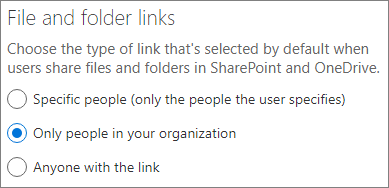

# Bewährte Methoden zum Freigeben von Dateien und Ordnern für nicht authentifizierte Benutzer

Die Freigabe ohne Authentifizierung (über *Jeder*-Links) kann zweckmäßig sein und eignet sich in verschiedenen Szenarien. *Jeder*-Links sind die einfachste Möglichkeit zur Freigabe: Personen können den Link ohne Authentifizierung öffnen und ihn an andere Personen weiterleiten.

In der Regel eignet sich nicht der gesamte Inhalt einer Organisation für die Freigabe ohne Authentifizierung. In diesem Artikel werden die Möglichkeiten beschrieben, die Ihnen beim Erstellen einer Umgebung helfen, in der Ihre Benutzer die Freigabe von Dateien und Ordner ohne Authentifizierung verwenden können, in der aber Sicherheitsvorkehrungen vorhanden sind, um den Inhalt Ihrer Organisation zu schützen.

> [!NOTE]
> Damit die Freigabe ohne Authentifizierung funktioniert, müssen Sie sie für Ihre Organisation und für die jeweilige Website oder das betreffende Team aktivieren, das die anonyme Freigabe verwenden soll. Das Szenario, das Sie aktivieren möchten, finden Sie unter [Zusammenarbeit mit Personen außerhalb Ihres Unternehmens](collaborate-with-people-outside-your-organization.md).

## Festlegen eines Ablaufdatums für Jeder-Links

Dateien werden häufig über einen längeren Zeitraum in Websites, Gruppen und Teams gespeichert. Es gibt gelegentlich Datenaufbewahrungsrichtlinien, bei denen die Aufbewahrung von Dateien über Jahre erforderlich ist. Wenn derartige Dateien für nicht authentifizierte Personen freigegeben werden, kann dies zu einem unerwarteten Zugriff und zu Änderungen an Dateien in der Zukunft führen. Um dies zu verhindern, können Sie eine Ablaufzeit für *Jeder*-Links konfigurieren.

Sobald ein *Jeder*-Link abläuft, kann er nicht mehr für den Zugriff auf den Inhalt verwendet werden.

So legen Sie ein Ablaufdatum für Jeder-Links fest
1. Öffnen Sie das SharePoint Online Admin Center.
2. Klicken Sie in der linken Navigationsleiste auf **Freigabe**.
3. Aktivieren Sie unter **Wählen Sie Berechtigungen und Ablaufoptionen für Jeder-Links aus** das Kontrollkästchen **Diese Links müssen innerhalb dieser Anzahl von Tagen ablaufen**. 
   
4. Geben Sie im Feld eine Anzahl von Tagen ein, und klicken Sie dann auf **Speichern**.

Beachten Sie, dass die Datei oder der Ordner nach Ablauf eines *Jeder*-Links wieder mit einem *Jeder*-Link freigegeben werden kann.

## Festlegen von Berechtigungen für den Link

Standardmäßig ermöglichen *Jeder*-Links für eine Datei das Bearbeiten der Datei und *Jeder*-Links für einen Ordner das Bearbeiten und Anzeigen von Dateien sowie das Hochladen neuer Dateien in den Ordner. Sie können die Berechtigungen für Dateien und für Ordner unabhängig in "Nur anzeigen" ändern.

Wenn Sie die Freigabe ohne Authentifizierung zulassen möchten, aber besorgt sind, dass nicht authentifizierte Personen die Inhalte Ihrer Organisation ändern könnten, sollten Sie die Datei- und Ordnerberechtigungen auf **Anzeigen** festlegen.

So legen Sie Berechtigungen für "Jeder"-Links fest
1. Öffnen Sie das SharePoint Online Admin Center.
2. Klicken Sie in der linken Navigationsleiste auf **Freigabe**.
3. Wählen Sie unter **Erweiterte Einstellungen für Jeder-Links** die Datei- und Ordnerberechtigungen aus, die Sie verwenden möchten. 
   

Wenn *Jeder*-Links auf **Anzeigen** festgelegt sind, können Benutzer Dateien und Ordner weiterhin mit *Bestimmte Personen*-Links für Gäste freigeben und diesen Berechtigungen zum Bearbeiten gewähren. Diese Links setzen voraus, dass sich Personen von außerhalb der Organisation als Gäste authentifizieren, und Sie können Gastaktivitäten für Dateien und Ordner, die mit diesen Links geteilt wurden, nachverfolgen und überwachen.

## Standardlinktyp so festlegen, dass er nur für Personen in Ihrer Organisation funktioniert

Wenn die *Jeder*-Freigabe für Ihre Organisation aktiviert ist, ist der Standardfreigabelink in der Regel auf **Jeder** festgelegt. Dies kann für Benutzer zwar praktisch sein, das Risiko einer versehentlichen Freigabe ohne Authentifizierung jedoch erhöhen. Wenn ein Benutzer beim Freigeben eines vertraulichen Dokuments vergisst, den Linktyp zu ändern, kann er versehentlich einen Freigabelink erstellen, für den keine Authentifizierung erforderlich ist.

Sie können dieses Risiko verringern, indem Sie die Standardlinkeinstellung auf einen Link ändern, der nur für Personen innerhalb Ihrer Organisation funktioniert. Benutzer, die Inhalte für nicht authentifizierte Personen freigeben möchten, müssten die entsprechende Option explizit auswählen.

So legen Sie den Standardfreigabelink für Dateien und Ordner fest
1. Klicken Sie im SharePoint Admin Center links in der Navigation auf **Freigabe**.
2. Wählen Sie unter **Datei- und Ordnerlinks** die Option **Nur Personen in Ihrer Organisation** aus. 
   
3. Klicken Sie auf **Speichern**.

## Schutz vor böswilligen Dateien

Wenn Sie anonymen Benutzern das Hochladen von Dateien gestatten, erhöht dies das Risiko, dass jemand eine infizierte Datei hochlädt. In Microsoft 365 können Sie mit dem Feature *Sichere Anlagen* in Advanced Threat Protection hochgeladene Dateien automatisch scannen und Dateien, die als unsicher eingestuft werden, unter Quarantäne stellen.

Aktivieren von "Sichere Anlagen"
1. Öffnen Sie das [Microsoft 365 Security](https://security.microsoft.com) Admin Center.
2. Klicken Sie in der linken Navigationsleiste auf **Richtlinien**.
3. Klicken Sie unter **Bedrohungsschutz** auf **Sichere Anlagen in ATP (Office 365)**.
4. Aktivieren Sie das Kontrollkästchen **ATP für SharePoint, OneDrive und Microsoft Teams aktivieren** aus, und klicken Sie auf **Speichern**. 
   

## Hinzufügen von Copyright-Informationen zu Ihren Dateien

Wenn Sie im Microsoft 365 Compliance Admin Center Vertraulichkeitsbezeichnungen verwenden, können Sie Ihre Bezeichnungen so konfigurieren, dass den Office-Dokumenten Sie Ihrer Organisation automatisch ein Wasserzeichen oder eine Kopf- und Fußzeile hinzugefügt wird. Auf diese Weise können Sie sicherstellen, dass freigegebene Dateien Copyright- oder sonstige Informationen zu Eigentum und Urheberrecht enthalten.

So fügen Sie eine Fußzeile zu einer mit einer Bezeichnung versehenen Datei hinzu
1. Öffnen Sie das [Microsoft 365 Compliance Admin Center](https://compliance.microsoft.com).
2. Klicken Sie im linken Navigationsbereich unter **Klassifizierung** auf **Vertraulichkeitsbezeichnungen**.
3. Klicken Sie auf die Bezeichnung, für die Sie eine Fußzeile hinzufügen möchten, und klicken Sie dann auf **Bezeichnung bearbeiten**.
4. Klicken Sie auf die Registerkarte **Inhaltskennzeichnung**, und aktivieren Sie dann die Inhaltskennzeichnung.
5. Aktivieren Sie das Kontrollkästchen für die Art von Text, die Sie einfügen möchten, und klicken Sie auf **Text anpassen**.
6. Geben Sie den Text ein, der Ihren Dokumenten hinzugefügt werden soll, wählen Sie die gewünschten Textoptionen aus, und klicken Sie dann auf **Speichern**. 
   
7. Klicken Sie auf **Speichern** und dann auf **Schließen**.

Wenn die Inhaltskennzeichnung für die Bezeichnung aktiviert ist, wird der von Ihnen angegebene Text zu Office-Dokumenten hinzugefügt, sobald ein Benutzer diese Bezeichnung anwendet.

## Siehe auch

[Übersicht über Vertraulichkeitsbezeichnungen](https://docs.microsoft.com/Office365/SecurityCompliance/sensitivity-labels)

[Einschränken des Risikos der versehentlichen Exposition von Dateien bei der Freigabe für Gäste](share-limit-accidental-exposure.md)

[Erstellen einer sicheren Gastfreigabeumgebung](create-secure-guest-sharing-environment.md)