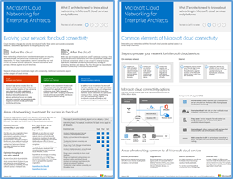

# Illustrationen zu Microsoft Cloud für Enterprise-Architekten

In diesen Postern zur Cloudarchitektur finden Sie Informationen zu Microsoft-Cloud-Diensten und -Plattformen wie Office 365, Azure Active Directory, Microsoft Intune, Microsoft Dynamics CRM Online sowie hybride lokale und Cloud-Lösungen. IT-Entscheidungsträger und Architekten können diese Ressourcen verwenden, um die optimalen Lösungen für ihre Arbeitsauslastungen zu bestimmen und Entscheidungen zu Kerninfrastrukturkomponenten wie Identität und Sicherheit zu treffen.

   

### Microsoft-Cloudnetzwerke für Enterprise-Architekten

Was IT-Architekten über Netzwerke für Microsoft-Cloud-Dienste und -Plattformen wissen müssen.
  
|**Element**|**Beschreibung**|
|:-----|:-----|
|   [PDF](https://github.com/MicrosoftDocs/microsoft-365-docs/raw/public/microsoft-365/downloads/MSFT_cloud_architecture_networking.pdf)  \| [Visio](https://github.com/MicrosoftDocs/OfficeDocs-Enterprise/raw/live/Enterprise/media/Network-Poster/MSFT_cloud_architecture_networking.vsdx)  Aktualisiert am 2019| Dieses Modell enthält: <ul><li> Weiterentwicklung Ihres Netzwerks für Cloudkonnektivität </li><li> Allgemeine Elemente der Microsoft-Cloudkonnektivität </li><li> ExpressRoute für Microsoft-Cloudkonnektivität </li><li> Entwerfen von Netzwerken für Microsoft SaaS, Azure PaaS und Azure IaaS </li></ul>    |

### Microsoft Hybrid Cloud für Enterprise-Architekten

Was IT-Architekten über Hybrid Cloud für Microsoft-Dienste und -Plattformen wissen müssen.
  
|**Element**|**Beschreibung**|
|:-----|:-----|
|   [PDF](https://github.com/MicrosoftDocs/microsoft-365-docs/raw/public/microsoft-365/downloads/MSFT_cloud_architecture_hybrid.pdf)  \| [Visio](https://github.com/MicrosoftDocs/OfficeDocs-Enterprise/raw/live/Enterprise/media/Hybrid-Poster/MSFT_cloud_architecture_hybrid.vsdx)  Aktualisiert am 2019 | Dieses Modell enthält Folgendes: <ul><li> Cloudangebote von Microsoft (SaaS, Azure PaaS und Azure IaaS) und deren gemeinsame Elemente </li><li> Hybrid Cloud-Architektur für Cloudangebote von Microsoft </li><li> Hybrid Cloud-Szenarien für Microsoft SaaS (Office 365), Azure PaaS und Azure IaaS </li></ul> |
   

### Architekturansätze für Microsoft-Cloudmigrationen von Mandant zu Mandant 
Diese Themenreihe illustriert mehrere Architekturansätze für Fusionen, Übernahmen, Veräußerungen und andere Szenarien, die möglicherweise eine Migration zu einem neuen Cloudmandanten notwendig machen. Diese Themen dienen als Ausgangspunkt mit Leitlinien für die Planung. 

|**Item**|**Beschreibung**|
|:-----|:-----|
|   [PDF](https://github.com/MicrosoftDocs/microsoft-365-docs/raw/public/microsoft-365/downloads/Microsoft-365-tenant-to-tenant-migration.pdf) \| [Visio](https://github.com/MicrosoftDocs/OfficeDocs-Enterprise/raw/live/Enterprise/downloads/Microsoft-365-tenant-to-tenant-migration.vsdx)  Aktualisiert am 2019    |Dieses Modell enthält Folgendes: <ul><li>Eine Zuordnung von Geschäftsszenarien zu Architekturansätzen</li><li>Überlegungen zum Entwurf</li><li>Ablauf einer Einzelereignismigration</li><li>Ablauf einer stufenweisen Migration</li><li>Ablauf einer Mandantenverschiebung oder -aufteilung</li></ul>|

### Microsoft-Cloud-Sicherheit für Enterprise-Architekten

Was IT-Architekten über die Sicherheit in Microsoft-Cloud-Diensten und -Plattformen wissen müssen.
  
|**Element**|**Beschreibung**|
|:-----|:-----|
|[          ](https://www.microsoft.com/download/details.aspx?id=48121)   [PDF](https://go.microsoft.com/fwlink/p/?linkid=842070)  \| [Visio](https://go.microsoft.com/fwlink/p/?LinkId=842071)  \| [Weitere Sprachen](https://www.microsoft.com/download/details.aspx?id=48121)  Aktualisiert am 2018 | Dieses Modell enthält Folgendes: <ul><li>Die Rolle von Microsoft bei der Bereitstellung sicherer Dienste und Plattformen</li><li>Die Verantwortung des Kunden, Sicherheitsrisiken zu minimieren</li><li>Zertifizierungen der höchsten Sicherheit </li><li>Sicherheitsangebote, die von Microsoft Consulting Services bereitgestellt werden </ul> |

### Häufige Angriffe und Microsoft-Funktionen zum Schutz Ihrer Organisation
Erfahren Sie mehr über die häufigsten Cyberangriffe und wie Microsoft Ihrer Organisation in jeder Phase des Angriffs helfen kann. 

|**Element**|**Beschreibung**|
|:-----|:-----|
|   [PDF](https://download.microsoft.com/download/F/A/C/FACFC1E9-FA35-4DF1-943C-8D4237B4275B/MSFT_Cloud_architecture_security_commonattacks.pdf) \| [Visio](https://download.microsoft.com/download/F/A/C/FACFC1E9-FA35-4DF1-943C-8D4237B4275B/MSFT_Cloud_architecture_security_commonattacks.vsdx)   Aktualisiert am 2017 | Dieses Poster veranschaulicht den Weg häufiger Angriffe und beschreibt, welche Funktionen dabei helfen können, Angreifer in jeder Phase des Angriffs zu stoppen.  |

### Microsoft-Cloud-Identität für Enterprise-Architekten

Was IT-Architekten über das Entwerfen der Identität für Organisationen wissen müssen, die Microsoft-Cloud-Dienste und -Plattformen verwenden.
  
|**Element**|**Beschreibung**|
|:-----|:-----|
|[          ](https://www.microsoft.com/download/details.aspx?id=54431)   [PDF](https://go.microsoft.com/fwlink/p/?LinkId=524586)  \| [Visio](https://download.microsoft.com/download/2/3/8/238228E6-9017-4F6C-BD3C-5559E6708F82/MSFT_cloud_architecture_identity.vsd)           \| [Weitere Sprachen](https://www.microsoft.com/download/details.aspx?id=54431)  Aktualisiert am 2016 | Dieses Modell enthält Folgendes: <ul><li>Einführung in die Identität mit der Cloud von Microsoft </li><li>Azure AD-IDaaS-Funktionen </li><li>Integrieren von lokalen Active Directory-Domain Services-Konten in Microsoft Azure Active Directory </li><li>Einfügen von Verzeichniskomponenten in Azure </li><li>Domänendienstoptionen für Arbeitslasten in Azure IaaS </li></ul> |
   