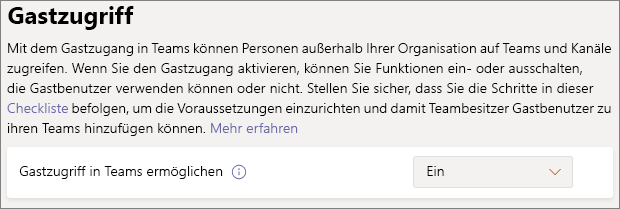

# Zusammenarbeit mit Gästen in einem Team

Wenn Sie mit Gästen in Dokumenten, Aufgaben und Unterhaltungen zusammenarbeiten müssen, empfehlen wir die Verwendung von Microsoft Teams. Microsoft Teams bietet alle in Office und SharePoint verfügbaren Features für die Zusammenarbeit mit beständigem Chat sowie eine anpassbare und erweiterbare Gruppe von Tools für die Zusammenarbeit in einer einheitlichen Benutzeroberfläche.

In diesem Artikel werden die Microsoft 365-Konfigurationsschritte durchlaufen, die erforderlich sind, um ein Team für die Zusammenarbeit mit Gästen einzurichten.

## Videodemonstration

Dieses Video zeigt die in diesem Dokument beschriebenen Konfigurationsschritte. 

> [!VIDEO https://www.microsoft.com/videoplayer/embed/RE44NTr?autoplay=false]

## Azure Organizational Relationships-Einstellungen

Die Freigabe in Microsoft 365 wird auf der höchsten Ebene durch die [Einstellungen für organisatorische Beziehungen in Azure Active Directory](https://docs.microsoft.com/azure/active-directory/external-identities/delegate-invitations)gesteuert. Wenn die Gast Freigabe in Azure AD deaktiviert oder eingeschränkt ist, werden alle Freigabeeinstellungen, die Sie in Microsoft 365 konfigurieren, außer Kraft gesetzt.

Überprüfen Sie die Einstellungen für Organisationsbeziehungen, um sicherzustellen, dass die Freigabe für Gäste nicht blockiert wird.

So legen Sie Einstellungen für die Organisationsbeziehung fest

1. Melden Sie sich bei Microsoft Azure an an [https://portal.azure.com](https://portal.azure.com) .
2. Klicken Sie im linken Navigationsbereich auf **Azure Active Directory**.
3. Klicken Sie im Bereich **Übersicht** auf **Externe Identitäten**.
4. Klicken Sie im Bereich **Organisations Identitäten** auf **Einstellungen für externe Zusammenarbeit**.
5. Stellen Sie sicher, dass **Administratoren und Benutzer in der Rolle "Gast einladender" eingeladen** werden und **Mitglieder einladen können** , beide auf " **Ja**" festgelegt sind.
6. Wenn Sie Änderungen vorgenommen haben, klicken Sie auf **Speichern**.

Beachten Sie die Einstellungen im Abschnitt Einschränkungen für die **Zusammenarbeit** . Stellen Sie sicher, dass die Domänen der Gäste, mit denen Sie zusammenarbeiten möchten, nicht blockiert werden.

Wenn Sie mit Gästen aus mehreren Organisationen zusammenarbeiten, möchten Sie möglicherweise die Möglichkeit zum Zugriff auf Verzeichnisdaten einschränken. Dadurch wird verhindert, dass Sie sehen, wer sonst ein Gast im Verzeichnis ist. Wählen Sie dazu unter **Benutzerzugriffs Einschränkungen**für Gast die Option **Gastbenutzer haben begrenzten Zugriff auf Eigenschaften und Mitgliedschaft in Verzeichnisobjekt Einstellungen** oder **Gastbenutzer Zugriff ist auf Eigenschaften und Mitgliedschaften ihrer eigenen Verzeichnisobjekte beschränkt**.

## Einstellungen für den Gastzugriff in Microsoft Teams

Teams verfügt über einen Master ein/aus-Schalter für Gastzugriff und eine Vielzahl von Einstellungen zur Verfügung, um zu steuern, was Gäste in einem Team tun können. Der Hauptschalter, der den **Gastzugriff in Microsoft Teams zulässt** , muss für den Gastzugriff für die Arbeit in Microsoft Teams **eingeschaltet** sein.

Stellen Sie sicher, dass der Gastzugriff in Microsoft Teams aktiviert ist, und nehmen Sie entsprechend Ihren geschäftlichen Anforderungen eine Anpassung an die Gast Einstellungen vor. Beachten Sie, dass sich diese Einstellungen auf alle Teams auswirken.

So legen Sie die Gastzugriffseinstellungen für Teams fest

1. Melden Sie sich beim Microsoft 365 Admin Center an auf [https://admin.microsoft.com](https://admin.microsoft.com).
2. Klicken Sie in der linken Navigationsleiste auf **Alle anzeigen**.
3. Klicken Sie unter **Admin Centers** auf **Teams**.
4. Erweitern Sie im Teams Admin Center **Organisationsweite Einstellungen** in der linken Navigationsleiste und klicken Sie auf **Gastzugriff**.
5. Stellen Sie sicher, dass **Gastzugriff in Teams zulassen** auf **Ein** ist.
6. Nehmen Sie alle gewünschten Änderungen an den zusätzlichen Gasteinstellungen vor, und klicken Sie dann auf **Speichern**.

> [!NOTE]
> Es könnte bis zu vierundzwanzig Stunden dauern, bis die Gasteinstellung für Teams aktiv wird, nachdem sie eingeschaltet wurde.

## Microsoft 365 Gruppen-Gast Einstellungen

Microsoft Teams verwendet Microsoft 365-Gruppen für die Teammitgliedschaft. Die Gast Einstellungen für Microsoft 365-Gruppen müssen aktiviert sein, damit Gastzugriff in Teams funktioniert.

So legen Sie die Gast Einstellungen für Microsoft 365-Gruppen fest

1. Erweitern Sie im Microsoft 365 Admin Center in der linken Navigationsleiste **Einstellungen**.
2. Klicken Sie auf **org-Einstellungen**.
3. Klicken Sie in der Liste auf **Microsoft 365-Gruppen**.
4. Stellen Sie sicher, dass die Gruppen **Mitglieder außerhalb Ihrer Organisation Zugriff auf Gruppeninhalte** haben und Gruppen **Besitzer Personen außerhalb Ihrer Organisation hinzufügen zulassen** Kontrollkästchen aktiviert sind.
5. Wenn Sie Änderungen vorgenommen haben, klicken Sie auf **Änderungen speichern**.

## SharePoint-Freigabeeinstellungen auf Organisationsebene

Microsoft Teams-Inhalte wie Dateien, Ordner und Listen werden in SharePoint gespeichert. Damit Gäste auf diese Elemente in Microsoft Teams zugreifen können, müssen die SharePoint-Freigabeeinstellungen auf Organisationsebene für die Freigabe für Gäste zulässig sein.

Mit den Einstellungen auf Organisationsebene wird festgelegt, welche Einstellungen für einzelne Websites verfügbar sind, einschließlich der Websites, die Microsoft Teams zugeordnet sind. Websiteeinstellungen dürfen nicht so restriktiv wie die Einstellungen auf Organisationsebene sein.

Wenn Sie die Datei-und Ordnerfreigabe für nicht authentifizierte Personen zulassen möchten, wählen Sie **jeden**aus. Wenn Sie sicherstellen möchten, dass sich alle Gäste authentifizieren müssen, wählen Sie **neue und vorhandene Gäste**aus. Wählen Sie die frei zügigste Einstellung aus, die von einer beliebigen Website in Ihrer Organisation benötigt wird.

So legen Sie Freigabeeinstellungen für SharePoint-Organisationsebene fest

1. Klicken Sie im Microsoft 365 Admin Center in der linken Navigationsleiste unter **Admin Centers**auf **SharePoint**.
2. Erweitern Sie im SharePoint Admin Center in der linken Navigationsleiste den Knoten **Richtlinien** , und klicken Sie dann auf **Freigabe**.
3. Stellen Sie sicher, dass die externe Freigabe für SharePoint auf " **jeder** " oder " **neue und vorhandene Gäste**" festgelegt ist.
4. Wenn Sie Änderungen vorgenommen haben, klicken Sie auf **Speichern**.

## Standard Link Einstellungen für SharePoint-Organisationsebene

Die Standardeinstellungen für Datei-und Ordnerverknüpfung legen fest, welche Link Option dem Benutzer standardmäßig angezeigt wird, wenn er eine Datei oder einen Ordner freigegeben hat. Benutzer können den Verknüpfungstyp vor der Freigabe bei Bedarf in eine der anderen Optionen ändern.

Beachten Sie, dass sich diese Einstellung auf alle Teams und SharePoint-Websites in Ihrer Organisation auswirkt.

Wählen Sie den Linktyp aus, der standardmäßig ausgewählt ist, wenn Benutzer Dateien und Ordner freigeben:

- **Jeder, der über den Link verfügt** – wählen Sie diese Option aus, wenn Sie eine Vielzahl von nicht authentifizierten Freigaben von Dateien und Ordnern erwarten. Wenn Sie *alle* Links zulassen möchten, jedoch über versehentliche nicht authentifizierte Freigaben besorgt sind, sollten Sie eine der anderen Optionen als Standard verwenden. Dieser Linktyp ist nur verfügbar, wenn Sie die Freigabe von **Benutzern** aktiviert haben.
- **Nur Personen in Ihrer Organisation** – wählen Sie diese Option aus, wenn Sie davon ausgehen, dass die meisten Datei-und Ordner Freigaben für Personen in Ihrer Organisation gelten.
- **Bestimmte Personen** – diese Option wird empfohlen, wenn Sie eine Vielzahl von Datei-und Ordner Freigaben für Gäste erwarten. Diese Art von Link funktioniert mit Gästen und erfordert die Authentifizierung.
 

So legen Sie die Standard Link Einstellungen für die SharePoint-Organisationsebene fest

1. Navigieren Sie im SharePoint Admin Center zur Seite Freigabe.
2. Wählen Sie unter **Datei-und Ordner Links**den standardmäßigen Freigabe Link aus, den Sie verwenden möchten.
3. Wenn Sie Änderungen vorgenommen haben, klicken Sie auf **Speichern**.

## Team erstellen

Der nächste Schritt besteht darin, das Team zu erstellen, das Sie für die Zusammenarbeit mit Gästen verwenden möchten.

So erstellen Sie ein Team
1. Klicken Sie in Microsoft Teams auf der Registerkarte **Teams** unten im linken Bereich auf **beitreten oder ein Team erstellen** .
2. Klicken Sie auf **Team erstellen**.
3. Klicken Sie auf **ein Team von Grund auf neu erstellen**.
4. Wählen Sie **private** oder **Public**aus.
5. Geben Sie einen Namen und eine Beschreibung für das Team ein, und klicken Sie dann auf **Erstellen**.
6. Klicken Sie auf **überspringen**.

Wir laden Benutzer später ein. Als nächstes ist es wichtig, die Freigabeeinstellungen auf Websiteebene für die SharePoint-Website zu überprüfen, die dem Team zugeordnet ist.

## Freigabeeinstellungen für SharePoint-Websiteebene

Überprüfen Sie die Freigabeeinstellungen auf Standortebene, um sicherzustellen, dass die gewünschten Zugriffstypen für dieses Team zulässig sind. Wenn Sie beispielsweise die Einstellungen auf Organisationsebene auf " **jeder**" festlegen, aber alle Gäste sich für dieses Team authentifizieren möchten, stellen Sie sicher, dass die Freigabeeinstellungen auf Standortebene auf " **neu" und "vorhandene Gäste**" festgelegt sind.

So legen Sie Freigabeeinstellungen auf Websiteebene fest
1. Erweitern Sie im SharePoint Admin Center links in der Navigation **Sites** und klicken Sie auf **Aktive Sites**.
2. Wählen Sie die Site des soeben erstellten Teams aus.
3. Klicken Sie im Menüband auf **Freigabe**. 
4. Stellen Sie sicher, dass die Freigabe auf " **jeder** " oder " **neue und vorhandene Gäste**" festgelegt ist.
5. Wenn Sie Änderungen vorgenommen haben, klicken Sie auf **Speichern**.

## Benutzer einladen

Die Einstellungen für die Gast Freigabe sind nun konfiguriert, sodass Sie mit dem Hinzufügen interner Benutzer und Gäste zu Ihrem Team beginnen können. 

So laden Sie interne Benutzer zu einem Team ein
1. Klicken Sie im Team auf **Weitere Optionen** ( **\*\*\*** ), und klicken Sie dann auf **Mitglied hinzufügen**.
2. Geben Sie den Namen der Person ein, die Sie einladen möchten.
3. Klicken Sie auf **Hinzufügen** und dann auf **Schließen**.

So laden Sie Gäste zu einem Team ein
1. Klicken Sie im Team auf **Weitere Optionen** ( **\*\*\*** ), und klicken Sie dann auf **Mitglied hinzufügen**.
2. Geben Sie die e-Mail-Adresse des Gasts ein, den Sie einladen möchten.
3. Klicken Sie auf **Gäste Informationen bearbeiten**.
4. Geben Sie den vollständigen Namen des Gasts ein, und klicken Sie auf das Häkchen.
5. Klicken Sie auf **Hinzufügen** und dann auf **Schließen**.

## Siehe auch

[Bewährte Methoden zum Freigeben von Dateien und Ordnern für nicht authentifizierte Benutzer](best-practices-anonymous-sharing.md)

[Einschränken des Risikos der versehentlichen Gefährdung von Dateien bei der Freigabe für Gäste](share-limit-accidental-exposure.md)

[Erstellen einer sicheren Gastfreigabeumgebung](create-secure-guest-sharing-environment.md)

[Erstellen eines B2B-Extranets mit verwalteten Gästen](b2b-extranet.md)
