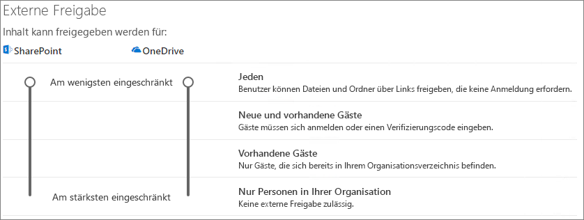

# Zusammenarbeit mit Gästen in einem Team

Wenn Sie mit Gästen über Dokumente, Aufgaben und Unterhaltungen hinweg zusammenarbeiten müssen, empfehlen wir die Verwendung von Microsoft Teams. Teams bietet alle in Office und SharePoint verfügbaren Features für die Zusammenarbeit mit dauerhaftem Chat und einem anpassbaren und erweiterbaren Satz von Tools für die Zusammenarbeit in einer einheitlichen Benutzeroberfläche.

In diesem Artikel werden die schritte zur Microsoft 365-Konfiguration erläutert, die zum Einrichten eines Teams für die Zusammenarbeit mit Gästen erforderlich sind. Nachdem Sie den Gastzugriff konfiguriert haben, können Sie Gäste zu Teams einladen, indem Sie die Schritte in "Hinzufügen von Gästen zu [einem Team in Teams" ausführen.](https://support.microsoft.com/office/fccb4fa6-f864-4508-bdde-256e7384a14f)

## Videodemonstration

In diesem Video werden die in diesem Dokument beschriebenen Konfigurationsschritte gezeigt. 

> [!VIDEO https://www.microsoft.com/videoplayer/embed/RE44NTr?autoplay=false]

## Einstellungen für die externe Zusammenarbeit in Azure

Die Freigabe in Microsoft 365 wird auf der höchsten Ebene durch die Einstellungen für die externe Zusammenarbeit in [Azure Active Directory bestimmt.](https://docs.microsoft.com/azure/active-directory/external-identities/delegate-invitations) Wenn die Gastfreigabe in Azure AD deaktiviert oder eingeschränkt ist, setzt diese Einstellung alle Freigabeeinstellungen außer Kraft, die Sie in Microsoft 365 konfigurieren.

Überprüfen Sie die Einstellungen für die externe B2B-Zusammenarbeit, um sicherzustellen, dass die Freigabe für Gäste nicht blockiert wird.

So legen Sie Einstellungen für die externe Zusammenarbeit

1. Melden Sie sich bei Azure Active Directory unter [https://aad.portal.azure.com](https://aad.portal.azure.com) an.
2. Klicken Sie im linken Navigationsbereich auf **Azure Active Directory**.
3. Klicken **Sie auf "Externe Identitäten".**
4. Klicken Sie **auf dem Bildschirm "Erste** Schritte" im linken Navigationsbereich auf Einstellungen für **die externe Zusammenarbeit.**
5. Stellen Sie **sicher, dass** Administratoren und Benutzer in der Rolle "Gast-Inviter" einladen können und dass Mitglieder, die einladen **können,** beide auf **"Ja" festgelegt sind.**
6. Wenn Sie Änderungen vorgenommen haben, klicken Sie auf **Speichern**.

Beachten Sie die Einstellungen im Abschnitt **"Einschränkungen für die Zusammenarbeit".** Stellen Sie sicher, dass die Domänen der Gäste, mit der Sie zusammenarbeiten möchten, nicht blockiert werden.

Wenn Sie mit Gästen aus mehreren Organisationen arbeiten, sollten Sie deren Zugriff auf Verzeichnisdaten einschränken. Dadurch wird verhindert, dass sie sehen, wer sonst ein Gast im Verzeichnis ist. Wählen Sie dazu unter "Gastbenutzerzugriffseinschränkungen" die Option "Gastbenutzer haben eingeschränkten Zugriff auf Eigenschaften und Mitgliedschaft in Verzeichnisobjekteinstellungen" aus, oder der Gastbenutzerzugriff ist auf Eigenschaften und Mitgliedschaften ihrer eigenen **Verzeichnisobjekte beschränkt.** 

## Gastzugriffseinstellungen für Teams

Teams verfügt über einen Master-Ein-/Aus-Schalter für den Gastzugriff und eine Vielzahl von Einstellungen, die steuern, was Gäste in einem Team tun können. Der Master-Switch" **"Gastzugriff in Teams** zulassen" muss **"On"** sein, damit der Gastzugriff in Teams funktioniert.

Stellen Sie sicher, dass der Gastzugriff in Teams aktiviert ist, und nehmen Sie eine Anpassung der Gasteinstellungen basierend auf Ihren Geschäftsanforderungen vor. Beachten Sie, dass sich diese Einstellungen auf alle Teams auswirken.

So legen Sie die Gastzugriffseinstellungen für Teams fest

1. Melden Sie sich beim Microsoft 365 Admin Center an auf [https://admin.microsoft.com](https://admin.microsoft.com).
2. Klicken Sie im linken Navigationsbereich auf **"Alle anzeigen".**
3. Klicken Sie unter **Admin Centers** auf **Teams**.
4. Erweitern Sie im Teams Admin Center im linken Navigationsbereich **organisationsweite** Einstellungen, und klicken Sie auf **Gastzugriff.**
5. Stellen Sie sicher, dass **Gastzugriff in Teams zulassen** auf **Ein** ist.
6. Nehmen Sie alle gewünschten Änderungen an den zusätzlichen Gasteinstellungen vor, und klicken Sie dann auf **Speichern**.

Sobald der Gastzugriff für Teams aktiviert ist, können Sie optional den Gastzugriff auf einzelne Teams und die zugehörigen SharePoint-Websites mithilfe von Vertraulichkeitsbezeichnungen steuern. Weitere Informationen finden Sie unter [Verwenden von Vertraulichkeitsbezeichnungen zum Schutz von Inhalten in Microsoft Teams, Microsoft 365-Gruppen und SharePoint-Websites](https://docs.microsoft.com/microsoft-365/compliance/sensitivity-labels-teams-groups-sites).

> [!NOTE]
> Es kann bis zu 24 Stunden dauern, bis die Gasteinstellungen von Teams aktiviert werden, nachdem Sie sie aktiviert haben.

## Gasteinstellungen für Microsoft 365-Gruppen

Teams verwendet Microsoft 365-Gruppen für die Teammitgliedschaft. Die Gasteinstellungen für Microsoft 365-Gruppen müssen aktiviert sein, damit der Gastzugriff in Teams funktioniert.

So legen Sie Die Gasteinstellungen für Microsoft 365-Gruppen

1. Erweitern Sie im Microsoft 365 Admin Center im linken Navigationsbereich die **Einstellungen.**
2. Klicken Sie **auf Organisationseinstellungen.**
3. Klicken Sie in der Liste auf **Microsoft 365-Gruppen.**
4. Stellen Sie sicher, dass die Kontrollkästchen "Gruppenbesitzern das Hinzufügen von Personen außerhalb Ihrer Organisation zu **Microsoft 365-Gruppen** als Gäste gestatten" und "Gastgruppenmitglieder zugriff auf Gruppeninhalte gestatten" aktiviert sind. 
5. Wenn Sie Änderungen vorgenommen haben, klicken Sie auf **"Änderungen speichern".**

## Freigabeeinstellungen auf SharePoint-Organisationsebene

Teams-Inhalte wie Dateien, Ordner und Listen werden alle in SharePoint gespeichert. Damit Gäste Zugriff auf diese Elemente in Teams haben, müssen die Freigabeeinstellungen auf Der Organisationsebene von SharePoint die Freigabe für Gäste zulassen.

Die Einstellungen auf Organisationsebene bestimmen, welche Einstellungen für einzelne Websites verfügbar sind, einschließlich websites, die Teams zugeordnet sind. Websiteeinstellungen können nicht weniger als die Einstellungen auf Organisationsebene sein.

Wenn Sie die Datei- und Ordnerfreigabe für nicht authentifizierte Personen zulassen möchten, wählen Sie **"Jeder" aus.** Wenn Sie sicherstellen möchten, dass alle Gäste authentifiziert werden müssen, wählen **Sie "Neu" und "Vorhandene Gäste" aus.** Wählen Sie die einstellung mit den meisten Anforderungen aus, die von jeder Website in Ihrer Organisation benötigt werden.

So legen Sie Freigabeeinstellungen auf Organisationsebene für SharePoint

1. Klicken Sie im Microsoft 365 Admin Center im linken Navigationsbereich unter **Admin Center** auf **SharePoint**.
2. Erweitern Sie im SharePoint Admin Center im  linken Navigationsbereich "Richtlinien", und klicken Sie dann auf **"Freigabe".**
3. Stellen Sie sicher, dass die externe Freigabe für SharePoint auf **"Jeder"** **oder "Neu" und "Vorhandene Gäste" festgelegt ist.**
4. Wenn Sie Änderungen vorgenommen haben, klicken Sie auf **Speichern**.

## Standardlinkeinstellungen auf Organisationsebene in SharePoint

Die Standardeinstellungen für Datei- und Ordnerverknüpfungen bestimmen die Linkoption, die Benutzern standardmäßig angezeigt wird, wenn sie eine Datei oder einen Ordner freigeben. Benutzer können den Linktyp bei Bedarf vor der Freigabe in eine der anderen Optionen ändern.

Beachten Sie, dass sich diese Einstellung auf alle Teams und SharePoint-Websites in Ihrer Organisation auswirkt.

Wählen Sie einen der folgenden Linktypen aus, der standardmäßig ausgewählt wird, wenn Benutzer Dateien und Ordner freigeben:

- **Jeder mit dem Link** – Wählen Sie diese Option aus, wenn Sie erwarten, dass eine große Menge nicht authentifizierter Freigaben von Dateien und Ordnern möglich ist. Wenn Sie "Jeder"-Links  zulassen möchten, aber bedenken, dass die Freigabe versehentlich nicht authentifiziert wird, sollten Sie eine der anderen Optionen als Standard verwenden. Dieser Linktyp ist nur verfügbar, wenn Sie die Freigabe für **"Jeder"** aktiviert haben.
- **Nur Personen in Ihrer Organisation** – Wählen Sie diese Option aus, wenn Sie erwarten, dass die meisten Datei- und Ordnerfreigaben für Personen innerhalb Ihrer Organisation verwendet werden.
- **Bestimmte Personen** – Erwägen Sie diese Option, wenn Sie eine große Menge datei- und Ordnerfreigaben für Gäste erwarten. Diese Art von Link funktioniert mit Gästen und erfordert, dass sie sich authentifizieren.
 

So legen Sie die Standardlinkeinstellungen auf Organisationsebene für SharePoint

1. Navigieren Sie im SharePoint Admin Center zur Seite "Freigabe".
2. Wählen **Sie unter Datei- und Ordnerlinks** den Standardfreigabelink aus, den Sie verwenden möchten.
3. Wenn Sie Änderungen vorgenommen haben, klicken Sie auf **Speichern**.

## Ein Team erstellen

Der nächste Schritt besteht im Erstellen des Teams, das Sie für die Zusammenarbeit mit Gästen verwenden möchten.

So erstellen Sie ein Team
1. Klicken Sie in Teams auf  der Registerkarte **"Teams"** unten im linken Bereich auf "Teilnehmen", oder erstellen Sie ein Team.
2. Klicken **Sie auf "Team erstellen".**
3. Klicken **Sie auf "Team von Grund auf neu erstellen".**
4. Wählen **Sie "Privat"** oder **"Öffentlich" aus.**
5. Geben Sie einen Namen und eine Beschreibung für das Team ein, und klicken Sie dann auf **"Erstellen".**
6. Klicken Sie **auf "Überspringen".**

Wir laden die Benutzer später ein. Als Nächstes ist es wichtig, die Freigabeeinstellungen auf Websiteebene für die dem Team zugeordnete SharePoint-Website zu überprüfen.

## Freigabeeinstellungen auf Websiteebene in SharePoint

Überprüfen Sie die Freigabeeinstellungen auf Websiteebene, um sicherzustellen, dass sie die Art des Zugriffs zulassen, den Sie für dieses Team wünschen. Wenn Sie beispielsweise die Einstellungen auf Organisationsebene auf **"Jeder"** festlegen, aber alle Gäste für dieses Team authentifizieren sollen, stellen Sie sicher, dass die Freigabeeinstellungen auf Websiteebene auf **"Neu"** und "Vorhandene Gäste" festgelegt sind.

So legen Sie Freigabeeinstellungen auf Websiteebene
1. Erweitern Sie im SharePoint Admin Center im linken Navigationsbereich **"Websites",** und klicken Sie auf **"Aktive Websites".**
2. Wählen Sie die Site des soeben erstellten Teams aus.
3. Klicken Sie auf ... und wählen Sie **"Freigabe"** aus.
4. Stellen Sie sicher, dass die Freigabe auf **"Jeder"** oder **"Neu" und "Vorhandene Gäste" festgelegt ist.**
5. Wenn Sie Änderungen vorgenommen haben, klicken Sie auf **Speichern**.

## Benutzer einladen

Die Einstellungen für die Gastfreigabe sind jetzt konfiguriert, sodass Sie mit dem Hinzufügen interner Benutzer und Gäste zu Ihrem Team beginnen können. 

So laden Sie interne Benutzer zu einem Team ein
1. Klicken Sie im Team auf **"Weitere Optionen"** ( ), und klicken Sie dann auf **\*\*\*** **"Mitglied hinzufügen".**
2. Geben Sie den Namen der Person ein, die Sie einladen möchten.
3. Klicken Sie auf **Hinzufügen** und dann auf **Schließen**.

So laden Sie Gäste zu einem Team ein
1. Klicken Sie im Team auf **"Weitere Optionen"** ( ), und klicken Sie dann auf **\*\*\*** **"Mitglied hinzufügen".**
2. Geben Sie die E-Mail-Adresse des Gasts ein, den Sie einladen möchten.
3. Klicken **Sie auf Gastinformationen bearbeiten.**
4. Geben Sie den vollständigen Namen des Gasts ein, und klicken Sie auf das Kontrollkästchen.
5. Klicken Sie auf **Hinzufügen** und dann auf **Schließen**.

## Siehe auch

[Bewährte Methoden zum Freigeben von Dateien und Ordnern für nicht authentifizierte Benutzer](best-practices-anonymous-sharing.md)

[Einschränken des Risikos der versehentlichen Gefährdung von Dateien bei der Freigabe für Gäste](share-limit-accidental-exposure.md)

[Erstellen einer sicheren Gastfreigabeumgebung](create-secure-guest-sharing-environment.md)

[Erstellen eines B2B-Extranets mit verwalteten Gästen](b2b-extranet.md)

[SharePoint- und OneDrive-Integration in Azure AD B2B](https://docs.microsoft.com/sharepoint/sharepoint-azureb2b-integration-preview)

[Freigabeoptionen sind bei der Freigabe aus SharePoint oder OneDrive ausgegraut](https://docs.microsoft.com/sharepoint/troubleshoot/administration/sharing-options-grayed-out-when-sharing-from-sharepoint-online-or-onedrive)
