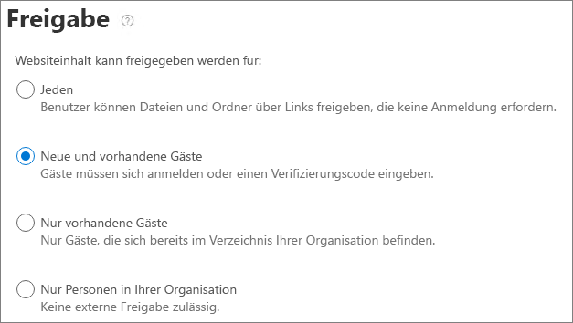

# Zusammenarbeit mit Gästen in einer WebsiteCollaborate with guests in a site

Wenn Sie mit Gästen in Dokumenten, Daten und Listen zusammenarbeiten müssen, können Sie eine SharePoint-Website verwenden.If you need to collaborate with guests across documents, data, and lists, you can use a SharePoint site. Moderne SharePoint-Websites sind mit Microsoft 365-Gruppen verbunden und können die Website Mitgliedschaft verwalten und zusätzliche Tools für die Zusammenarbeit bereitstellen, beispielsweise ein freigegebenes Postfach und einen Kalender.Modern SharePoint sites are connected to Microsoft 365 Groups and can manage the site membership and provide additional collaboration tools such as a shared mailbox and a calendar.

In diesem Artikel werden die Microsoft 365-Konfigurationsschritte durchlaufen, die erforderlich sind, um eine SharePoint-Website für die Zusammenarbeit mit Gästen einzurichten.In this article, we'll walk through the Microsoft 365 configuration steps necessary to set up a SharePoint site for collaboration with guests.

## VideodemonstrationVideo demonstration

Dieses Video zeigt die in diesem Dokument beschriebenen Konfigurationsschritte.This video shows the configuration steps described in this document. 

> [!VIDEO https://www.microsoft.com/videoplayer/embed/RE44Llg?autoplay=false]

## Einstellungen für Azure-externe ZusammenarbeitAzure external collaboration settings

Die Freigabe in Microsoft 365 wird auf der höchsten Ebene durch die [Einstellungen für organisatorische Beziehungen in Azure Active Directory](https://docs.microsoft.com/azure/active-directory/external-identities/delegate-invitations)gesteuert.Sharing in Microsoft 365 is governed at its highest level by the [organizational relationships settings in Azure Active Directory](https://docs.microsoft.com/azure/active-directory/external-identities/delegate-invitations). Wenn die Gast Freigabe in Azure AD deaktiviert oder eingeschränkt ist, überschreibt diese Einstellung alle Freigabeeinstellungen, die Sie in Microsoft 365 konfigurieren.If guest sharing is disabled or restricted in Azure AD, this setting overrides any sharing settings that you configure in Microsoft 365.

Überprüfen Sie die Einstellungen für die externe Zusammenarbeit, um sicherzustellen, dass die Freigabe für Gäste nicht blockiert wird.Check the external collaboration settings to ensure that sharing with guests is not blocked.

So legen Sie Einstellungen für die externe Zusammenarbeit festTo set external collaboration settings

1. Melden Sie sich bei Azure Active Directory unter an [https://aad.portal.azure.com](https://aad.portal.azure.com) .Log in to Azure Active Directory at [https://aad.portal.azure.com](https://aad.portal.azure.com).
2. Klicken Sie im linken Navigationsbereich auf **Azure Active Directory**.In the left navigation pane, click **Azure Active Directory**.
3. Klicken Sie auf **externe Identitäten**.Click **External identities**.
4. Klicken Sie auf dem Bildschirm **Erste Schritte** im linken Navigationsbereich auf **Einstellungen für externe Zusammenarbeit**.On the **Get started** screen, in the left navigation pane, click **External collaboration settings**.
5. Stellen Sie sicher, dass **Administratoren und Benutzer in der Rolle "Gast einladender" eingeladen** werden und **Mitglieder einladen können** , beide auf " **Ja**" festgelegt sind.Ensure that **Admins and users in the guest inviter role can invite** and **Members can invite** are both set to **Yes**.
6. Wenn Sie Änderungen vorgenommen haben, klicken Sie auf **Speichern**.If you made changes, click **Save**.

Beachten Sie die Einstellungen im Abschnitt Einschränkungen für die **Zusammenarbeit** .Note the settings in the **Collaboration restrictions** section. Stellen Sie sicher, dass die Domänen der Gäste, mit denen Sie zusammenarbeiten möchten, nicht blockiert werden.Make sure that the domains of the guests that you want to collaborate with aren't blocked.

Wenn Sie mit Gästen aus mehreren Organisationen zusammenarbeiten, möchten Sie möglicherweise die Möglichkeit zum Zugriff auf Verzeichnisdaten einschränken.If you work with guests from multiple organizations, you may want to restrict their ability to access directory data. Dadurch wird verhindert, dass Sie sehen, wer sonst ein Gast im Verzeichnis ist.This will prevent them from seeing who else is a guest in the directory. Wählen Sie dazu unter **Benutzerzugriffs Einschränkungen**für Gast die Option **Gastbenutzer haben begrenzten Zugriff auf Eigenschaften und Mitgliedschaft in Verzeichnisobjekt Einstellungen** oder **Gastbenutzer Zugriff ist auf Eigenschaften und Mitgliedschaften ihrer eigenen Verzeichnisobjekte beschränkt**.To do this, under **Guest user access restrictions**, select **Guest users have limited access to properties and membership of directory objects settings** or **Guest user access is restricted to properties and memberships of their own directory objects**.

## Microsoft 365 Gruppen-Gast EinstellungenMicrosoft 365 Groups guest settings

Moderne SharePoint-Websites verwenden Microsoft 365-Gruppen, um den Website Zugriff zu steuern.Modern SharePoint sites use Microsoft 365 Groups to control site access. Die Gast Einstellungen für Microsoft 365-Gruppen müssen aktiviert sein, damit der Gastzugriff auf SharePoint-Websites funktioniert.The Microsoft 365 Groups guest settings must be turned on in order for guest access in SharePoint sites to work.

So legen Sie die Gast Einstellungen für Microsoft 365-Gruppen festTo set Microsoft 365 Groups guest settings

1. Erweitern Sie im Microsoft 365 Admin Center im linken Navigationsbereich die Option **Einstellungen**.In the Microsoft 365 admin center, in the left navigation pane, expand **Settings**.
2. Klicken Sie auf **org-Einstellungen**.Click **Org settings**.
3. Klicken Sie in der Liste auf **Microsoft 365-Gruppen**.In the list, click **Microsoft 365 Groups**.
4. Stellen Sie sicher, dass die **Gruppenbesitzer zulassen Personen außerhalb Ihrer Organisation zu Microsoft 365-Gruppen hinzufügen** und die Kontrollkästchen Benutzer **Gruppenmitglieder können Zugriff auf Gruppeninhalte zulassen** aktiviert haben.Ensure that the **Let group owners add people outside your organization to Microsoft 365 Groups as guests** and **Let guest group members access group content** check boxes are both checked.
5. Wenn Sie Änderungen vorgenommen haben, klicken Sie auf **Änderungen speichern**.If you made changes, click **Save changes**.

## SharePoint-Freigabeeinstellungen auf OrganisationsebeneSharePoint organization-level sharing settings

Damit Gästezugriff auf SharePoint-Websites haben, müssen die SharePoint-Freigabeeinstellungen auf Organisationsebene für die Freigabe für Gäste zulässig sein.In order for guests to have access to SharePoint sites, the SharePoint organization-level sharing settings must allow for sharing with guests.

Die Einstellungen auf Organisationsebene bestimmen die Einstellungen, die für einzelne Websites verfügbar sind.The organization-level settings determine the settings that will be available for individual sites. Websiteeinstellungen dürfen nicht so restriktiv wie die Einstellungen auf Organisationsebene sein.Site settings cannot be more permissive than the organization-level settings.

Wenn Sie die Freigabe nicht authentifizierter Dateien und Ordner zulassen möchten, wählen Sie **jeden**aus.If you want to allow unauthenticated file and folder sharing, choose **Anyone**. Wenn Sie sicherstellen möchten, dass sich alle Personen außerhalb Ihrer Organisation authentifizieren müssen, wählen Sie **neue und vorhandene Gäste**aus.If you want to ensure that all people outside your organization have to authenticate, choose **New and existing guests**. Wählen Sie die frei zügigste Einstellung aus, die von einer beliebigen Website in Ihrer Organisation benötigt wird.Choose the most permissive setting that will be needed by any site in your organization.

So legen Sie Freigabeeinstellungen für SharePoint auf Organisationsebene festTo set SharePoint organization-level sharing settings

1. Klicken Sie im Microsoft 365 Admin Center im linken Navigationsbereich unter **Admin Centers**auf **SharePoint**.In the Microsoft 365 admin center, in the left navigation pane, under **Admin centers**, click **SharePoint**.
2. Klicken Sie im SharePoint Admin Center im linken Navigationsbereich unter **Richtlinien**auf **Freigabe**.In the SharePoint admin center, in the left navigation pane, under **Policies**, click **Sharing**.
3. Stellen Sie sicher, dass die externe Freigabe für SharePoint auf " **jeder** " oder " **neue und vorhandene Gäste**" festgelegt ist.Ensure that external sharing for SharePoint is set to **Anyone** or **New and existing guests**.
4. Wenn Sie Änderungen vorgenommen haben, klicken Sie auf **Speichern**.If you made changes, click **Save**.

## Erstellen einer WebsiteCreate a site

Im nächsten Schritt erstellen Sie die Website, die Sie für die Zusammenarbeit mit Gästen verwenden möchten.The next step is to create the site that you plan to use for collaborating with guests.

So erstellen Sie eine WebsiteTo create a site
1. Klicken Sie im SharePoint Admin Center unter **Websites** auf **Aktive Websites**.In the SharePoint admin center, under **Sites**, click **Active sites**.
2. Klicken Sie auf **Erstellen**.Click **Create**.
3. Klicken Sie auf **Team Website**.Click **Team site**.
4. Geben Sie einen Websitenamen ein, und geben Sie einen Namen für den Gruppenbesitzer (Websitebesitzer) ein.Type a site name and enter a name for the Group owner (site owner).
5. Wählen Sie unter **Erweiterte Einstellungen**aus, ob diese Website öffentlich oder privat sein soll.Under **Advanced settings**, choose if you want this site to be a public or private one.
6. Klicken Sie auf **Weiter**.Click **Next**.
7. Klicken Sie auf **Fertig stellen**.Click **Finish**.

Wir laden Benutzer später ein.We'll invite users later. Als nächstes ist es wichtig, die Freigabeeinstellungen auf Standortebene für diese Website zu überprüfen.Next, it's important to check the site-level sharing settings for this site.

## SharePoint-Freigabeeinstellungen auf WebsiteebeneSharePoint site-level sharing settings

Überprüfen Sie die Freigabeeinstellungen auf Standortebene, um sicherzustellen, dass die gewünschten Zugriffstypen für diese Website zulässig sind.Check the site-level sharing settings to make sure that they allow the type of access that you want for this site. Wenn Sie beispielsweise die Einstellungen auf Organisationsebene auf " **jeder**" festlegen, aber alle Gäste für diese Website authentifizieren möchten, stellen Sie sicher, dass die Freigabeeinstellungen auf Standortebene auf " **neu" und "vorhandene Gäste**" festgelegt sind.For example, if you set the organization-level settings to **Anyone**, but you want all guests to authenticate for this site, then make sure the site-level sharing settings are set to **New and existing guests**.

Beachten Sie, dass die Website nicht für nicht authentifizierte Personen freigegeben werden kann (**jede** Einstellung), sondern einzelne Dateien und Ordner können.Note that the site cannot be shared with unauthenticated people (**Anyone** setting), but individual files and folders can.

So legen Sie Freigabeeinstellungen auf Websiteebene festTo set site-level sharing settings
1. Erweitern Sie im SharePoint Admin Center links in der Navigation **Sites** und klicken Sie auf **Aktive Sites**.In the SharePoint admin center, in the left navigation, expand **Sites** and click **Active sites**.
2. Wählen Sie die Website aus, die Sie freigeben möchten.Select the site that you want to share.
3. Klicken Sie auf..., und klicken Sie auf **Freigabe**.Click ..., and click **Sharing**.
4. Stellen Sie sicher, dass die Freigabe auf " **jeder** " oder " **neue und vorhandene Gäste**" festgelegt ist.Ensure that sharing is set to **Anyone** or **New and existing guests**.
5. Wenn Sie Änderungen vorgenommen haben, klicken Sie auf **Speichern**.If you made changes, click **Save**.

## Benutzer einladenInvite users

Die Einstellungen für die Gast Freigabe sind nun konfiguriert, sodass Sie mit dem Hinzufügen interner Benutzer und Gäste zu Ihrer Website beginnen können.Guest sharing settings are now configured, so you can start adding internal users and guests to your site. Der Website Zugriff wird über die zugehörige Microsoft 365-Gruppe gesteuert, sodass Benutzer dort hinzugefügt werden.Site access is controlled through the associated Microsoft 365 Group, so we'll be adding users there.

So laden Sie interne Benutzer zu einer Gruppe einTo invite internal users to a group
1. Navigieren Sie zu der Website, auf der Sie Benutzer hinzufügen möchten.Navigate to the site where you want to add users.
2. Klicken Sie in der oberen rechten Ecke auf **Mitglieder** -Link, der die Mitgliederanzahl kennzeichnet.Click **Members** link in the upper right which denotes the member count.
3. Klicken Sie auf **Mitglieder hinzufügen**.Click **Add members**.
4. Geben Sie die Namen oder e-Mail-Adressen der Benutzer ein, die Sie zur Website einladen möchten, und klicken Sie dann auf **Speichern**.Type the names or email addresses of the users that you want to invite to the site, and then click **Save**.

Gastbenutzer können nicht von der Website hinzugefügt werden.Guest users can't be added from the site. Sie müssen Sie mit Outlook im Internet hinzufügen.You need to add them using Outlook on the web. Klicken Sie daher als Voraussetzung für das Hinzufügen und einladen von Gästen zu einer Gruppe auf die URL der Website in der Spalte **URL**  , um zur Website spezifischen Seite zu navigieren.Therefore, as a prerequisite to add and invite guests to a group, click the URL of the site in the **URL**  column to navigate to the site-specific page. Klicken Sie auf dieser Seite auf das **App-Startprogramm** Symbol, und wählen Sie **Outlook**aus.From this page, click the **App launcher** icon and select **Outlook**. Auf diesem Bildschirm können Sie Gäste in eine Gruppe einladen, die nachfolgend beschrieben wird.This is the screen from which you can invite guests into a group, for which procedure is described below.

So laden Sie Gäste zu einer Gruppe einTo invite guests to a group
1. Klicken Sie unter **Gruppen**auf die Gruppe, für die Sie Gäste einladen möchten.Under **Groups**, click the group to which you want to invite guests.
2. Öffnen Sie die Gruppe Visitenkarte, klicken Sie auf **Mitglieder** Link in der oberen rechten Ecke (der Link, der die Mitgliederanzahl kennzeichnet).Open the group contact card, click **Members** link in the upper right (the link which denotes the member count).
3. Klicken Sie auf **Mitglieder hinzufügen**.click **Add members**.
4. Geben Sie die e-Mail-Adressen der Gäste ein, die Sie einladen möchten, und klicken Sie dann auf **Hinzufügen**.Type the email addresses of the guests that you want to invite, and then click **Add**.
5. Klicken Sie auf **Schließen**.Click **Close**.
Beachten Sie, dass Sie nur auf **Schließen** klicken müssen, wenn Sie nicht der Besitzer der Gruppe sind und daher nicht berechtigt sind, den Gast der Gruppe hinzuzufügen.Note that you need to click **Close** only if you are not the owner of the group and as a result, you are not allowed to add the guest into the group. In diesen Fällen wird die Anforderung zum Hinzufügen des Gasts in der Gruppe zur Genehmigung an den Gruppenbesitzer übergeben.In such cases, the request to add the guest into the group is transferred to the group owner for approval.

## Siehe auchSee also

[Bewährte Methoden zum Freigeben von Dateien und Ordnern für nicht authentifizierte BenutzerBest practices for sharing files and folders with unauthenticated users](best-practices-anonymous-sharing.md)

[Einschränken des Risikos der versehentlichen Gefährdung von Dateien bei der Freigabe für GästeLimit accidental exposure to files when sharing with guests](share-limit-accidental-exposure.md)

[Erstellen einer sicheren GastfreigabeumgebungCreate a secure guest sharing environment](create-secure-guest-sharing-environment.md)

[Erstellen eines B2B-Extranets mit verwalteten GästenCreate a B2B extranet with managed guests](b2b-extranet.md)

[SharePoint-und OneDrive-Integration mit Azure AD B2BSharePoint and OneDrive integration with Azure AD B2B](https://docs.microsoft.com/sharepoint/sharepoint-azureb2b-integration-preview)
