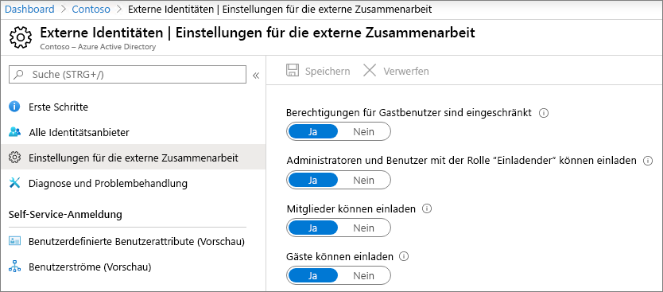
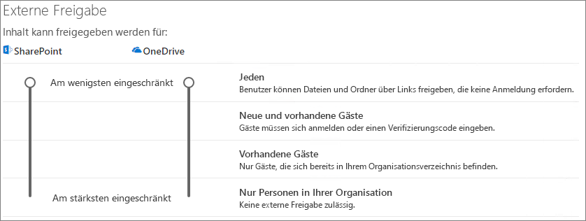

# Zusammenarbeit mit Gästen an einem DokumentCollaborate with guests on a document

Wenn Sie mit Personen außerhalb Ihrer Organisation in Dokumenten in SharePoint oder OneDrive zusammenarbeiten müssen, können Sie Ihnen einen Freigabe Link an das Dokument senden.If you need to collaborate with people outside your organization on documents in SharePoint or OneDrive, you can send them a sharing-link to the document. In diesem Artikel werden die Microsoft 365-Konfigurationsschritte durchlaufen, die erforderlich sind, um Freigabe-Links für SharePoint und OneDrive für die Anforderungen Ihrer Organisation einzurichten.In this article, we'll walk through the Microsoft 365 configuration steps necessary to set up sharing-links for SharePoint and OneDrive for the needs of your organization.

## VideodemonstrationVideo demonstration

Dieses Video zeigt die in diesem Dokument beschriebenen Konfigurationsschritte.This video shows the configuration steps described in this document. 

> [!VIDEO https://www.microsoft.com/videoplayer/embed/RE450Vt?autoplay=false]

## Azure Organizational Relationships-EinstellungenAzure organizational relationships settings

Die Freigabe in Microsoft 365 wird auf der höchsten Ebene durch die [Einstellungen für organisatorische Beziehungen in Azure Active Directory](https://docs.microsoft.com/azure/active-directory/external-identities/delegate-invitations)gesteuert.Sharing in Microsoft 365 is governed at its highest level by the [organizational relationships settings in Azure Active Directory](https://docs.microsoft.com/azure/active-directory/external-identities/delegate-invitations). Wenn die Gast Freigabe in Azure AD deaktiviert oder eingeschränkt ist, überschreibt diese Einstellung alle Freigabeeinstellungen, die Sie in Microsoft 365 konfigurieren.If guest-sharing is disabled or restricted in Azure AD, this setting overrides any sharing settings that you configure in Microsoft 365.

Überprüfen Sie die Einstellungen für Organisationsbeziehungen, um sicherzustellen, dass die Freigabe für Gäste nicht blockiert wird.Check the organizational relationships settings to ensure that sharing with guests is not blocked.

So legen Sie Einstellungen für die Organisationsbeziehung festTo set organizational relationship settings

So legen Sie Einstellungen für die externe Zusammenarbeit festTo set external collaboration settings

1. Melden Sie sich bei Azure Active Directory unter an [https://aad.portal.azure.com](https://aad.portal.azure.com) .Log in to Azure Active Directory at [https://aad.portal.azure.com](https://aad.portal.azure.com).
2. Klicken Sie im linken Navigationsbereich auf **Azure Active Directory**.In the left navigation pane, click **Azure Active Directory**.
3. Klicken Sie auf **externe Identitäten**.Click **External identities**.
4. Klicken Sie auf dem Bildschirm **Erste Schritte** im linken Navigationsbereich auf **Einstellungen für externe Zusammenarbeit**.On the **Get started** screen, in the left navigation pane, click **External collaboration settings**.
5. Stellen Sie sicher, dass **Administratoren und Benutzer in der Rolle "Gast einladender" eingeladen** werden und **Mitglieder einladen können** , beide auf " **Ja**" festgelegt sind.Ensure that **Admins and users in the guest inviter role can invite** and **Members can invite** are both set to **Yes**.
6. Wenn Sie Änderungen vorgenommen haben, klicken Sie auf **Speichern**.If you made changes, click **Save**.

Beachten Sie die Einstellungen im Abschnitt Einschränkungen für die **Zusammenarbeit** .Note the settings in the **Collaboration restrictions** section. Stellen Sie sicher, dass die Domänen der Gäste, mit denen Sie zusammenarbeiten möchten, nicht blockiert werden.Make sure that the domains of the guests that you want to collaborate with aren't blocked.

Wenn Sie mit Gästen aus mehreren Organisationen zusammenarbeiten, möchten Sie möglicherweise die Möglichkeit zum Zugriff auf Verzeichnisdaten einschränken.If you work with guests from multiple organizations, you may want to restrict their ability to access directory data. Dadurch wird verhindert, dass Sie sehen, wer sonst ein Gast im Verzeichnis ist.This will prevent them from seeing who else is a guest in the directory. Wählen Sie dazu unter **Benutzerzugriffs Einschränkungen** für Gast die Option **Gastbenutzer haben begrenzten Zugriff auf Eigenschaften und Mitgliedschaft in Verzeichnisobjekt Einstellungen** oder **Gastbenutzer Zugriff ist auf Eigenschaften und Mitgliedschaften ihrer eigenen Verzeichnisobjekte beschränkt**.To do this, under **Guest user access restrictions**, select **Guest users have limited access to properties and membership of directory objects settings** or **Guest user access is restricted to properties and memberships of their own directory objects**.

## SharePoint-Freigabeeinstellungen auf OrganisationsebeneSharePoint organization-level sharing settings

Damit Personen außerhalb Ihrer Organisation Zugriff auf ein Dokument in SharePoint oder OneDrive haben, müssen die Freigabeeinstellungen für SharePoint und OneDrive auf Organisationsebene die Freigabe für Personen außerhalb Ihrer Organisation zulassen.In order for people outside your organization to have access to a document in SharePoint or OneDrive, the SharePoint and OneDrive organization-level sharing settings must allow for sharing with people outside your organization.

Die Einstellungen auf Organisationsebene für SharePoint bestimmen die Einstellungen, die für einzelne SharePoint-Websites verfügbar sind.The organization-level settings for SharePoint determine the settings that will be available for individual SharePoint sites. Websiteeinstellungen dürfen nicht so restriktiv wie die Einstellungen auf Organisationsebene sein.Site settings cannot be more permissive than the organization-level settings. Die Einstellung auf Organisationsebene für OneDrive bestimmt die Freigabeebene, die in den OneDrive-Bibliotheken der Benutzer verfügbar sein wird.The organization-level setting for OneDrive determines the level of sharing that will be available in users' OneDrive libraries.

Wenn Sie für SharePoint und OneDrive die nicht authentifizierte Datei-und Ordnerfreigabe zulassen möchten, wählen Sie **jeden** aus.For SharePoint and OneDrive, if you want to allow unauthenticated file and folder sharing, choose **Anyone**. Wenn Sie sicherstellen möchten, dass sich Personen außerhalb Ihrer Organisation authentifizieren müssen, wählen Sie **neue und vorhandene Gäste** aus.If you want to ensure that people outside your organization have to authenticate, choose **New and existing guests**. *Jeder* Links ist die einfachste Möglichkeit zur Freigabe: Personen außerhalb Ihrer Organisation können die Verknüpfung ohne Authentifizierung öffnen und können Sie an andere weitergeben.*Anyone* links is the easiest way to share: people outside your organization can open the link without authentication and are free to pass it on to others.

Wählen Sie für SharePoint die frei zügigste Einstellung aus, die von einer beliebigen Website in Ihrer Organisation benötigt wird.For SharePoint, choose the most permissive setting that will be needed by any site in your organization.

So legen Sie Freigabeeinstellungen für SharePoint auf Organisationsebene festTo set SharePoint organization-level sharing settings

1. Klicken Sie im Microsoft 365 Admin Center im linken Navigationsbereich unter **Admin Centers** auf **SharePoint**.In the Microsoft 365 admin center, in the left navigation pane, under **Admin centers**, click **SharePoint**.
2. Klicken Sie im SharePoint Admin Center im linken Navigationsbereich unter **Richtlinien** auf **Freigabe**.In the SharePoint admin center, in the left navigation pane, under **Policies**, click **Sharing**.
3. Stellen Sie sicher, dass die externe Freigabe für SharePoint oder OneDrive auf " **jeder** " oder " **neue und vorhandene Gäste**" festgelegt ist.Ensure that external sharing for SharePoint or OneDrive is set to **Anyone** or **New and existing guests**. (Beachten Sie, dass die OneDrive-Einstellung nicht restriktiver als die SharePoint-Einstellung sein kann.)(Note that the OneDrive setting cannot be more permissive than the SharePoint setting.)
4. Wenn Sie Änderungen vorgenommen haben, klicken Sie auf **Speichern**.If you made changes, click **Save**.

## Standard Link Einstellungen für SharePoint auf OrganisationsebeneSharePoint organization-level default link settings

Die Standardeinstellungen für Datei-und Ordnerverknüpfung bestimmen die Verknüpfungsoption, die Benutzern standardmäßig angezeigt wird, wenn Sie eine Datei oder einen Ordner freigeben.The default file and folder link settings determine the link option that will be shown to users by default when they share a file or folder. Benutzer können den Verknüpfungstyp in eine der anderen Optionen vor der Freigabe ändern, falls gewünscht.Users can change the link type to one of the other options before sharing, if desired.

Beachten Sie, dass sich diese Einstellung auf SharePoint-Websites in Ihrer Organisation sowie auf OneDrive auswirkt.Keep in mind that this setting affects SharePoint sites in your organization, as well as OneDrive.

Wählen Sie einen Link von einem der folgenden Typen aus, der dann standardmäßig ausgewählt wird, wenn Benutzer Dateien und Ordner freigeben:Choose a link from any of the following types which is then selected by default when users share files and folders:

- **Jeder, der über den Link verfügt** – wählen Sie diese Option aus, wenn Sie eine Vielzahl von nicht authentifizierten Datei-und Ordner Freigaben erwarten.**Anyone with the link** - Choose this option if you expect to do a lot of unauthenticated file and folder sharing. Wenn Sie *alle* Links zulassen möchten, jedoch über versehentliche nicht authentifizierte Freigaben besorgt sind, sollten Sie eine der anderen Optionen als Standard verwenden.If you want to allow *Anyone* links but are concerned about accidental unauthenticated sharing, consider one of the other options as the default. Dieser Linktyp ist nur verfügbar, wenn Sie die Freigabe von **Benutzern** aktiviert haben.This link type is only available if you've enabled **Anyone** sharing.
- **Nur Personen in Ihrer Organisation** – wählen Sie diese Option aus, wenn Sie davon ausgehen, dass die meisten Datei-und Ordner Freigaben für Personen in Ihrer Organisation gelten.**Only people in your organization** - Choose this option if you expect most file and folder sharing to be with people inside your organization.
- **Bestimmte Personen** – diese Option wird empfohlen, wenn Sie eine Vielzahl von Datei-und Ordner Freigaben für Gäste erwarten.**Specific people** - Consider this option if you expect to do a lot of file and folder sharing with guests. Diese Art von Link funktioniert mit Gästen und erfordert die Authentifizierung.This type of link works with guests and requires them to authenticate.
 

So legen Sie die Standard Link Einstellungen für SharePoint und OneDrive auf Organisationsebene festTo set the SharePoint and OneDrive organization-level default link settings

1. Navigieren Sie im SharePoint Admin Center zur Seite Freigabe.Navigate to the Sharing page in the SharePoint admin center.
2. Wählen Sie unter **Datei-und Ordner Links** den standardmäßigen Freigabe Link aus, den Sie verwenden möchten.Under **File and folder links**, select the default sharing link that you want to use.
3. Wenn Sie Änderungen vorgenommen haben, klicken Sie auf **Speichern**.If you made changes, click **Save**.

Klicken Sie zum Festlegen der Berechtigung für den Freigabe Link unter **Wählen Sie die Berechtigung aus, die standardmäßig für Freigabelinks ausgewählt ist.**To set the permission for the sharing link, under **Choose the permission that's selected by default for sharing links.**

1. Wählen Sie **Ansicht** aus, wenn Sie nicht möchten, dass nicht authentifizierte Benutzer Änderungen an den Dateien und Ordnern vornehmen.Select **View** if you do not want unauthenticated users to make changes to the files and folders.
2. Wählen Sie **Bearbeiten** aus, wenn Sie zulassen möchten, dass nicht authentifizierte Benutzer Änderungen an den Dateien und Ordnern vornehmen.Select **Edit** if you want to allow unauthenticated users to make changes to the files and folders.

Beachten Sie, dass die beiden obigen premission-Optionen nicht nur für Gäste/externe Benutzer, sondern auch für interne Benutzer angewendet werden können.Note that the above two premission-options can be applied not only for guests/external users but also for internal users. Die von Ihnen gewählte Berechtigungsoption wird durch selbst Diskretion bestimmt.The permission-option you choose is determined by self-discretion.

So legen Sie Berechtigungen für Links fest, die die Freigabe für beliebige Personen zulassenTo set permissions for links that allow sharing with anyone

1. Unter den **folgenden Links können diese Berechtigungen erteilt werden:** Unterbereich,Under the **These links can give these permissions:** sub-pane, 
    1. In der Dropdownliste **Dateien**From the **Files** drop-down list, 
        1. Wählen Sie **anzeigen und bearbeiten** aus, wenn Sie zulassen möchten, dass nicht authentifizierte Benutzer Änderungen an den Dateien vornehmen können.Select **View and edit** if you want to allow unauthenticated users to make changes to the files.
        2. Wählen Sie **Ansicht** aus, wenn Sie nicht möchten, dass nicht authentifizierte Benutzer Änderungen an den Dateien vornehmen.Select **View** if you do not want unauthenticated users to make changes to the files.
    2. In der Dropdownliste **Ordner**From the **Folders** drop-down list,
        1. Wählen Sie **anzeigen, bearbeiten und hochladen** aus, wenn Sie zulassen möchten, dass nicht authentifizierte Benutzer Änderungen an den Ordnern vornehmen können.Select **View, edit, and upload** if you want to allow unauthenticated users to make changes to the folders.
        2. Wählen Sie **Ansicht** aus, wenn Sie nicht möchten, dass nicht authentifizierte Benutzer Änderungen an den Ordnern vornehmen.Select **View** if you do not want unauthenticated users to make changes to the folders.

## SharePoint-Freigabeeinstellungen auf WebsiteebeneSharePoint site-level sharing settings

Wenn Sie Dateien und Ordner in einer SharePoint-Website freigeben, müssen Sie auch die Freigabeeinstellungen auf Websiteebene für diese Website überprüfen.If you're sharing files and folders that are in a SharePoint site, you also need to check the site-level sharing settings for that site.

So legen Sie Freigabeeinstellungen auf Websiteebene festTo set site-level sharing settings

1. Erweitern Sie im SharePoint Admin Center im linken Navigationsbereich den Knoten **Websites** , und klicken Sie dann auf **aktive Standorte**.In the SharePoint admin center, in the left navigation pane, expand **Sites** and click **Active sites**.
2. Wählen Sie die Website aus, für die Sie Dateien und Ordner für Gäste freigeben möchten.Select the site on which you want to share files and folders with guests.
3. Scrollen Sie nach rechts in der Zeile (in der die ausgewählte Website vorhanden ist), und klicken Sie auf eine beliebige Stelle in der Spalte **externe Freigabe** .Scroll right across the row (in which the selected site is present) and click anywhere in the **External sharing** column.
4. Klicken Sie auf der Seite, die sich öffnet, auf Registerkarte **Richtlinien** .From the page that pops up, click **Policies** tab.
5. Klicken Sie im Bereich **externe Freigabe** auf **Bearbeiten**.Under the **External sharing** pane, click **Edit**.
6. Stellen Sie sicher, dass die Freigabe auf " **jeder** " oder " **neue und vorhandene Gäste**" festgelegt ist.Ensure that sharing is set to **Anyone** or **New and existing guests**.
7. Wenn Sie Änderungen vorgenommen haben, klicken Sie auf **Speichern**.If you made changes, click **Save**.

## Benutzer einladenInvite users

Einstellungen für die Gast Freigabe sind jetzt konfiguriert; Damit können Benutzer nun Dateien und Ordner für Personen außerhalb Ihrer Organisation freigeben.Guest-sharing settings are now configured; so users can now share files and folders with people outside your organization. Weitere Informationen finden Sie unter [Freigeben von OneDrive-Dateien und-Ordnern](https://support.office.com/article/9fcc2f7d-de0c-4cec-93b0-a82024800c07) und Freigeben von [SharePoint-Dateien oder-Ordnern](https://support.office.com/article/1fe37332-0f9a-4719-970e-d2578da4941c) .See [Share OneDrive files and folders](https://support.office.com/article/9fcc2f7d-de0c-4cec-93b0-a82024800c07) and [Share SharePoint files or folders](https://support.office.com/article/1fe37332-0f9a-4719-970e-d2578da4941c) for more information.

## Siehe auchSee also

[Bewährte Methoden zum Freigeben von Dateien und Ordnern für nicht authentifizierte BenutzerBest practices for sharing files and folders with unauthenticated users](best-practices-anonymous-sharing.md)

[Einschränken des Risikos der versehentlichen Gefährdung von Dateien bei der Freigabe für GästeLimit accidental exposure to files when sharing with guests](share-limit-accidental-exposure.md)

[SharePoint-und OneDrive-Integration mit Azure AD B2BSharePoint and OneDrive integration with Azure AD B2B](https://docs.microsoft.com/sharepoint/sharepoint-azureb2b-integration-preview)
