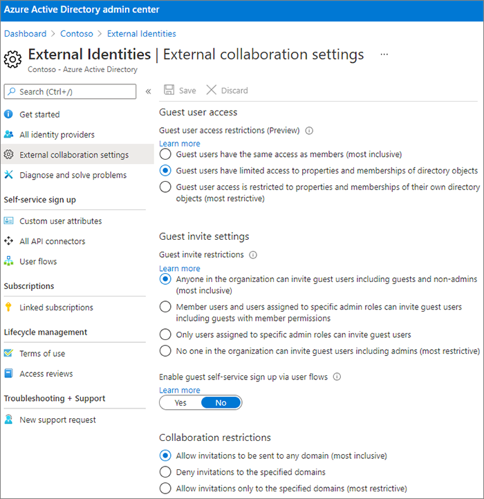

# Zusammenarbeit mit Gästen an einem Dokument

Wenn Sie mit Personen außerhalb Ihrer Organisation an Dokumenten in SharePoint oder OneDrive zusammenarbeiten müssen, können Sie ihnen einen Freigabelink zum Dokument senden. In diesem Artikel werden die Microsoft 365-Konfigurationsschritte erläutert, die zum Einrichten von Freigabelinks für SharePoint und OneDrive für die Anforderungen Ihrer Organisation erforderlich sind.

## Videodemonstration

Dieses Video zeigt die in diesem Dokument beschriebenen Konfigurationsschritte. 

> [!VIDEO https://www.microsoft.com/videoplayer/embed/RE450Vt?autoplay=false]

## Einstellungen für die externe Zusammenarbeit in Azure

Die Freigabe in Microsoft 365 wird auf der höchsten Ebene von den [Einstellungen für B2B externe Zusammenarbeit in Azure Active Directory](/azure/active-directory/external-identities/delegate-invitations) geregelt. Wenn die Gastfreigabe in Azure AD deaktiviert oder eingeschränkt ist, überschreibt diese Einstellung alle Freigabeeinstellungen, die Sie in Microsoft 365 konfigurieren.

Überprüfen Sie die B2B-Einstellungen für die externe Zusammenarbeit, um sicherzustellen, dass die Freigabe für Gäste nicht blockiert wird.

Festlegen der Einstellungen für die Azure Externe Zusammenarbeit

1. Bei Azure Active Directory an [https://aad.portal.azure.com](https://aad.portal.azure.com) anmelden.
2. Klicken Sie im linken Navigationsbereich auf **Azure Active Directory**.
3. Klicken Sie auf **Externe Identitäten**.
4. Klicken Sie auf dem Bildschirm **Erste Schritte** im linken Navigationsbereich auf **Einstellungen für die externe Zusammenarbeit**.
5. Stellen Sie sicher, dass sowie **Administratoren und Benutzer mit der Rolle "Einladender" können einladen** als auch **Mitglieder können einladen** beide auf **Ja** festgelegt sind.
6. Wenn Sie Änderungen vorgenommen haben, klicken Sie auf **Speichern**.

Beachten Sie die Einstellungen im Bereich **Einschränkungen für die Zusammenarbeit**. Stellen Sie sicher, dass die Domänen der Gäste, mit denen Sie zusammenarbeiten möchten, nicht blockiert sind.

Wenn Sie mit Gästen aus mehreren Organisationen arbeiten, könnten Sie möglicherweise Interesse daran haben, ihren Zugriff auf Verzeichnisdaten einzuschränken. Dies wird es ihnen verhindern zu sehen, wer sonst noch Gast im Verzeichnis ist. Wählen Sie dazu unter **Einschränkungen des Gastzugriffs** die Einstellung **Gastbenutzer haben eingeschränkten Zugriff auf Eigenschaften und die Mitgliedschaft bei den Einstellungen der Verzeichnisobjekte** oder **Zugriff der Gastbenutzer ist auf Eigenschaften und die Mitgliedschaft bei ihren eigenen Verzeichnisobjekten eingeschränkt**.

## Freigabeeinstellungen auf SharePoint-Organisationsebene

Damit Personen außerhalb Ihrer Organisation Zugriff auf ein Dokument in SharePoint oder OneDrive haben, müssen die SharePoint- und OneDrive-Freigabeeinstellungen auf Organisationsebene die Freigabe für Personen außerhalb Ihrer Organisation zulassen.

Die Einstellungen auf Organisationsebene für SharePoint bestimmen die Einstellungen, die für einzelne SharePoint-Websites verfügbar sein werden. Websiteeinstellungen können nicht passiver sein als die Einstellungen auf Organisationsebene. Die Einstellung auf Organisationsebene für OneDrive bestimmt die Freigabestufe, die in den #A0 der Benutzer verfügbar sein wird.

Wenn Sie für SharePoint und OneDrive die nicht authentifizierte Datei- und Ordnerfreigabe zulassen möchten, wählen Sie **Jeder aus.** Wenn Sie sicherstellen möchten, dass Personen außerhalb Ihrer Organisation authentifiziert werden müssen, wählen Sie **Neu und vorhandene Gäste aus.** *Jeder* Links ist die einfachste Möglichkeit zum Teilen: Personen außerhalb Ihrer Organisation können den Link ohne Authentifizierung öffnen und können ihn an andere personen übergeben.

Wählen Sie für SharePoint die lässigste Einstellung aus, die von jeder Website in Ihrer Organisation benötigt wird.

So legt man SharePoint-Freigabeeinstellungen auf Organisationsebene fest

1. Klicken Sie im Microsoft 365 Admin Center im linken Navigationsbereich unter **Admin Center** auf **SharePoint**.
2. Klicken Sie im SharePoint Admin Center im linken Navigationsbereich unter **Richtlinien** auf **Freigeben.**
3. Stellen Sie sicher, dass die externe Freigabe für SharePoint oder OneDrive auf **Jeder** oder **Neue und vorhandene Gäste festgelegt ist.** (Beachten Sie, dass die OneDrive-Einstellung nicht zulässiger als die #A0 sein darf.)
4. Wenn Sie Änderungen vorgenommen haben, klicken Sie auf **Speichern**.

## SharePoint-Standardlinkeinstellungen auf Organisationsebene

Die Standardeinstellungen für die Datei- und -ordnerverknüpfung bestimmen die Verknüpfungsoption, die Benutzern standardmäßig angezeigt wird, wenn sie eine Datei oder einen Ordner freigeben. Benutzer können, wenn sie so möchten, die Verknüpfungsart vor der Freigabe in eine der anderen Optionen ändern.

Beachten Sie, dass sich diese Einstellung sowohl auf #A0 in Ihrer Organisation als auch auf OneDrive auswirkt.

Wählen Sie einen Link aus einem der folgenden Typen aus, der dann standardmäßig ausgewählt wird, wenn Benutzer Dateien und Ordner freigeben:

- **Jeder mit dem Link** – Wählen Sie diese Option aus, wenn Sie mit einer großen Anzahl nicht authentifizierter Dateien und Ordnerfreigaben rechnen. Wenn Sie *Jeder*-Links erlauben wollen, aber zufällige nicht authentifizierte Freigaben befürchten, erwägen Sie eine der anderen Optionen als Standard. Diese Verknüpfungsart ist nur verfügbar, wenn Sie die Freigabe auf **Jeder** aktiviert haben.
- **Nur Personen in Ihrer Organisation** – Wählen Sie diese Option, wenn Sie erwarten, dass die meisten Freigaben von Dateien und Ordnern zwischen Personen innerhalb Ihrer Organisation stattfinden werden.
- **Bestimmte Personen** – erwägen Sie diese Option, wenn Sie erwarten, dass Sie viele Dateien und Ordner an Gäste freigeben werden. Dieser Typ von Link arbeitet mit Gästen und erfordert deren Authentifizierung.
 

So legen Sie die Standardlinkeinstellungen für SharePoint und OneDrive auf Organisationsebene

1. Navigieren Sie zur Seite „Freigabe“ im SharePoint Admin Center.
2. Wählen Sie unter **Datei- und Ordnerlinks** den Link zur Standardfreigabe, den Sie verwenden möchten.
3. Wenn Sie Änderungen vorgenommen haben, klicken Sie auf **Speichern**.

Wenn Sie die Berechtigung für den Freigabelink festlegen möchten, wählen Sie unter Wählen Sie die Berechtigung aus, die standardmäßig für **Freigabelinks ausgewählt ist.**

1. Wählen **Sie Ansicht** aus, wenn nicht authentifizierte Benutzer keine Änderungen an den Dateien und Ordnern vornehmen möchten.
2. Wählen **Sie Bearbeiten** aus, wenn nicht authentifizierte Benutzer Änderungen an den Dateien und Ordnern vornehmen möchten.

Beachten Sie, dass die oben genannten beiden Voraboptionen nicht nur für Gäste/externe Benutzer, sondern auch für interne Benutzer angewendet werden können. Die von Ihnen festgelegte Berechtigungsoption wird durch Selbstverwaltung bestimmt.

So legen Sie Berechtigungen für Links fest, die die Freigabe für alle Personen zulassen

1. Geben Sie **unter Diese Links die folgenden Berechtigungen ein:** Unterbereich, 
    1. In der **Dropdownliste** Dateien 
        - Wählen **Sie Ansicht und Bearbeiten** aus, wenn nicht authentifizierte Benutzer Änderungen an den Dateien vornehmen möchten.
        - Wählen **Sie Ansicht** aus, wenn nicht authentifizierte Benutzer keine Änderungen an den Dateien vornehmen möchten.
    2. In **der Dropdownliste** Ordner
        - Wählen **Sie Anzeigen, Bearbeiten und Hochladen aus,** wenn Nicht authentifizierte Benutzer Änderungen an den Ordnern vornehmen möchten.
        - Wählen **Sie Ansicht** aus, wenn nicht authentifizierte Benutzer keine Änderungen an den Ordnern vornehmen möchten.

## SharePoint-Freigabeeinstellungen auf Websiteebene

Wenn Sie Dateien und Ordner in einer SharePoint-Website freigeben, müssen Sie auch die Freigabeeinstellungen auf Websiteebene für diese Website überprüfen.

So legt man Freigabeeinstellungen auf Websiteebene fest

1. Erweitern Sie im SharePoint Admin Center links im Navigationsbereich **Websites** und klicken Sie auf **Aktive Websites**.
2. Wählen Sie die Website aus, auf der Sie Dateien und Ordner für Gäste freigeben möchten.
3. Scrollen Sie rechts über die Zeile (in der die ausgewählte Website vorhanden ist), und klicken Sie in der Spalte Externe **Freigabe auf eine beliebige** Stelle.
4. Klicken Sie auf der angezeigten Seite auf **die Registerkarte** Richtlinien.
5. Klicken Sie **im Bereich Externe** Freigabe auf **Bearbeiten**.
6. Vergewissern Sie sich, dass die Freigabe auf **Jeder** oder **Neue und vorhandene Gäste** festgelegt ist.
7. Wenn Sie Änderungen vorgenommen haben, klicken Sie auf **Speichern**.

## Benutzer einladen

Die Einstellungen für die Gastfreigabe sind jetzt konfiguriert. Benutzer können nun Dateien und Ordner für Personen außerhalb Ihrer Organisation freigeben. Weitere Informationen finden Sie unter Freigeben von [#A0 und](https://support.office.com/article/9fcc2f7d-de0c-4cec-93b0-a82024800c07) -Ordnern und Share [SharePoint-Dateien](https://support.office.com/article/1fe37332-0f9a-4719-970e-d2578da4941c) oder -Ordnern.

## Siehe auch

[Bewährte Methoden zum Freigeben von Dateien und Ordnern für nicht authentifizierte Benutzer](best-practices-anonymous-sharing.md)

[Einschränken des Risikos der versehentlichen Gefährdung von Dateien bei der Freigabe für Gäste](share-limit-accidental-exposure.md)

[SharePoint- und OneDrive-Integration in Azure AD B2B](/sharepoint/sharepoint-azureb2b-integration-preview)