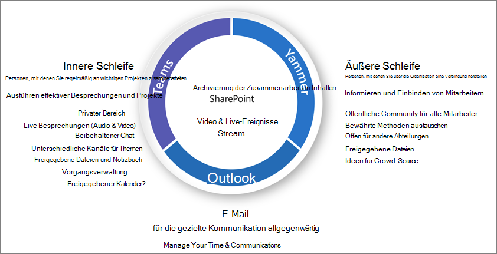

# Übersicht über die Collaboration-Steuerung in Microsoft 365

Microsoft 365 verfügt über eine Vielzahl von Tools, mit denen Sie alle Steuerungsfunktionen implementieren können, die Ihre Organisation möglicherweise benötigt. Dieser Artikel leitet IT-Experten an, die richtigen Fragen zu stellen, um ihre Anforderungen an die Governance zu ermitteln und zu bestimmen, wie sie diese auf der Grundlage ihres organisatorischen Profils erfüllen können.

## Was sind Microsoft 365-Gruppen?

Wir wissen, dass Organisationen heute unterschiedliche Tools verwenden. Es gibt das Entwicklerteam, das Team Chats verwendet, die Führungskräfte, die e-Mails senden, und die gesamte Organisation, die über Enterprise Social eine Verbindung herstellt. Es werden mehrere Tools für die Zusammenarbeit verwendet, da jede Gruppe eindeutig ist und über ihre eigenen funktionalen Anforderungen und ihren eigenen Arbeitsstil verfügt. Einige werden nur E-Mail verwenden, während andere hauptsächlich im Chat leben. 

Wenn Benutzer das Gefühl haben, dass die von der IT angebotenen Tools nicht ihren Bedürfnissen entsprechen, werden sie wahrscheinlich ihre bevorzugte Verbraucheranwendung herunterladen, die ihre Szenarien unterstützt. Obwohl dieser Prozess den Benutzern einen schnellen Einstieg ermöglicht, führt er zu einer frustrierenden Benutzererfahrung in der gesamten Organisation mit mehreren Anmeldungen, gemeinsamer Nutzung von Schwierigkeiten und keinem einzigen Ort zum Anzeigen von Inhalten. Dieses Konzept wird als "Schatten-IT" bezeichnet und stellt ein erhebliches Risiko für Organisationen dar. Es reduziert die Möglichkeit, den Benutzerzugriff einheitlich zu verwalten, die Sicherheit zu gewährleisten und die Anforderungen an die Einhaltung von Diensten zu erfüllen.

Dienste wie Microsoft 365-Gruppen, Teams und jammern ermöglichen Benutzern und verringern das Risiko von Shadow IT, indem Sie die erforderlichen Tools für die Zusammenarbeit bereitstellen. In Microsoft 365-Gruppen können Sie eine Gruppe von Personen auswählen, mit denen Sie zusammenarbeiten möchten, und einfach eine Sammlung von Ressourcen einrichten, die von diesen Personen gemeinsam genutzt werden können. Das Hinzufügen von Mitgliedern zur Gruppe erteilt automatisch die erforderlichen Berechtigungen für alle von der Gruppe bereitgestellten Objekte. Beide Teams und jammern verwenden Microsoft 365-Gruppen, um Ihre Mitgliedschaft zu verwalten.

Microsoft 365-Gruppen beinhalten eine Vielzahl von Steuerungs Steuerelementen, einschließlich einer Ablaufrichtlinie, Benennungskonventionen und einer Richtlinie für blockierte Wörter, die Sie beim Verwalten von Gruppen in Ihrer Organisation unterstützen. Weitere Informationen finden Sie unter [Plan Organization and Lifecycle Governance for Microsoft 365 Groups and Microsoft Teams](plan-organization-lifecycle-governance.md) .

## Technische Architektur

Microsoft 365 unterstützt drei Haupt Kommunikationsmethoden:

- Outlook: Zusammenarbeit per E-Mail mit einem freigegebenen Gruppenposteingang und Kalender
- Microsoft Teams: ein beständiger Chat-basierter Arbeitsbereich, in dem Sie informelle, echt zeitbezogene Unterhaltungen zu einer Vielzahl von Themen haben können, die von bestimmten Untergruppen organisiert werden.
- Yammer: unternehmerische soziale Netzwerke für die Zusammenarbeit

> [!NOTE]
> Durch das Erstellen einer neuen Gruppe über andere Teamarbeits Anwendungen wie SharePoint, Planner oder Stream wird eine Gruppe mit einem Outlook-Posteingang erstellt und die Möglichkeit zum Herstellen einer Verbindung mit Microsoft Teams hergestellt.

Je nachdem, wo eine Gruppe erstellt wird, werden bestimmte Ressourcen automatisch bereitgestellt, beispielsweise:
- [Posteingang](https://support.office.com/article/have-a-group-conversation-in-outlook-a0482e24-a769-4e39-a5ba-a7c56e828b22) -für e-Mail-Unterhaltungen zwischen Gruppenmitgliedern. Dieser Posteingang hat eine E-Mail-Adresse und kann für das Annehmen von Nachrichten von Personen außerhalb der Gruppe und sogar außerhalb Ihrer Organisation konfiguriert werden, ähnlich wie eine herkömmliche Verteilerliste.
 - [Kalender](https://support.office.com/article/schedule-a-meeting-on-a-group-calendar-in-outlook-0cf1ad68-1034-4306-b367-d75e9818376a) – Für die Planung von Ereignissen im Zusammenhang mit der Gruppe
- [SharePoint-Teamwebsite](https://support.office.com/article/what-is-a-sharepoint-team-site-75545757-36c3-46a7-beed-0aaa74f0401e) – ein zentrales Repository für Informationen, Links und Inhalte im Zusammenhang mit Ihrer Gruppe
- [OneNote-Notizbuch](https://support.office.com/article/get-started-with-onenote-e768fafa-8f9b-4eac-8600-65aa10b2fe97) – zum Sammeln von Ideen, Recherchen und Informationen
- [Planner](https://support.office.com/article/microsoft-planner-help-4a9a13c6-3adf-4a60-a6fc-15c0b15e16fc) – Für das Zuweisen und Verwalten von Projektaufgaben für die Mitglieder Ihrer Gruppe
- [Gruppe "jammern"](https://support.office.com/article/Learn-about-Office-365-groups-b565caa1-5c40-40ef-9915-60fdb2d97fa2) – ein allgemeiner Ort für Unterhaltungen und Freigabe Informationen
- Teams – ein Chat basierter Arbeitsbereich in Microsoft 365
- Stream-ein Video-Streaming-Dienst

> [!NOTE]
> Wenn eine neue Office 365-Gruppe über Yammer oder Teams erstellt wird, ist die Gruppe weder in Outlook noch im Adressbuch sichtbar, da die primäre Kommunikation zwischen diesen Benutzern in ihren jeweiligen Clients stattfindet. Jammern von Gruppen kann nicht mit Microsoft Teams verbunden werden.

## Optionen für die Zusammenarbeit

Es gibt mehrere Orte für die Zusammenarbeit und Unterhaltungen in Microsoft 365. Wenn Sie wissen, wo eine Unterhaltung beginnen soll, können Sie eine Kommunikationsstrategie definieren.

- Teams: Chat-basierter Arbeitsbereich (Zusammenarbeit mit hoher Geschwindigkeit) – innere Schleife
  - Entwickelt für die Zusammenarbeit mit den Personen, mit denen Sie täglich arbeiten
  - Stellt den Benutzern Informationen in einer einzigen Benutzeroberfläche zur Verfügung
  - Hinzufügen von Registerkarten, Connectors und Bots
  - Live Chat, Audio/Videokonferenzen, aufgezeichnete Besprechungen

- Yammer: Verbindung über die Organisation ( Unternehmenssoziales) – äußere Schleife
  - Communities of Practice – funktionsübergreifende Gruppen von Personen, die ein gemeinsames Interesse oder Fachwissen teilen, aber nicht unbedingt täglich zusammenarbeiten
  - Verbindung mit dem Führungsteam, Lerngemeinschaften, rollenbasierte Gemeinschaften

- Postfach und Kalender (e-Mail-basierte Zusammenarbeit)
  - Verwendung für eine gezielte Kommunikation mit einer Gruppe von Personen
  - Freigegebener Kalender für Besprechungen mit anderen Gruppenmitgliedern
 
Jede Gruppe Ruft eine verbundene SharePoint-Teamwebsite ab, auf der Benutzer Inhalte freigeben, angepasste Seiten erstellen und Neuigkeiten autorisieren können. Sie können auch [vorhandene SharePoint-Teamwebsites mit neuen Microsoft 365-Gruppen verbinden](https://docs.microsoft.com/sharepoint/dev/features/groupify/groupify-overview).

## Illustrationen

### Microsoft Teams und verwandte Produktivitätsdienste in Microsoft 365 für IT-Architekten
Die logische Architektur von Produktivitätsdiensten in Microsoft 365, beginnend mit Microsoft Teams.

|**Item**|**Beschreibung**|
|:-----|:-----|
|   [PDF](https://github.com/MicrosoftDocs/microsoft-365-docs/raw/public/microsoft-365/downloads/msft-m365-teams-logical-architecture.pdf) \| [Visio](https://github.com/MicrosoftDocs/OfficeDocs-Enterprise/raw/live/Enterprise/downloads/msft-m365-teams-logical-architecture.vsdx)   Aktualisiert: April 2019   |Microsoft bietet eine Reihe von Produktivitätsdiensten für die Zusammenarbeit in den Bereichen Datengovernance, Sicherheit und Compliancefunktionen.    Diese Illustrationen geben einen Einblick in die logische Architektur der Produktivitätsdienste für Enterprise Architekten, beginnend mit Microsoft Teams.|

### Gruppen in Microsoft 365 für IT-Architekten
Was IT-Architekten über Gruppen in Microsoft 365 wissen müssen

|**Item**|**Beschreibung**|
|:-----|:-----|
|   [PDF](https://github.com/MicrosoftDocs/microsoft-365-docs/raw/public/microsoft-365/downloads/msft-m365-groups.pdf) \| [Visio](https://github.com/MicrosoftDocs/OfficeDocs-Enterprise/raw/live/Enterprise/downloads/msft-m365-groups.vsdx)   Aktualisiert: Juni 2019|Diese Illustrationen erläutern die unterschiedlichen Arten von Gruppen, erklären, wie diese erstellt und verwaltet werden, und bieten einige Vorschläge für Governance.|

## Konferenzsitzungen

Sehen Sie sich diese Konferenzsitzungen an, um weitere Informationen zur Steuerung für Microsoft 365-Gruppen und-Teams zu erhalten.

**Grundlagen**

Erfahren Sie mehr über die Grundlagen und neuen Innovationen in Microsoft 365-Gruppen, einschließlich Verwaltung und Steuerung im Maßstab, bewährte Methoden für die Nutzung und Einführung sowie Self-Service.

- [Umarmen von Microsoft 365-Gruppen](https://myignite.techcommunity.microsoft.com/sessions/81553)

**Governance**

Hier erfahren Sie, wie Sie den Ablauf Zyklus von Gruppen einrichten, Benennungsrichtlinien, Klassifikations Bezeichnungen, Zusammenarbeit mit externen Gästen und Berechtigungen zur Gruppenerstellung verwalten.

- [Transformieren der Zusammenarbeit und bekämpfen von Shadow IT mit Office 365 Gruppen](https://myignite.techcommunity.microsoft.com/sessions/81554)

**Kundenbeispiel**

Sehen Sie sich ein Beispiel hinter den Kulissen an, wie Microsoft 365-Gruppen, SharePoint, Teams und jammern zusammenarbeiten, um eine globale Plattform für die Zusammenarbeit bereitzustellen.

- [Suchen nach ihrer Zusammenarbeit Sweet Spot mit Office 365 Gruppen, SharePoint, Teams und jammern](https://myignite.techcommunity.microsoft.com/sessions/84289)