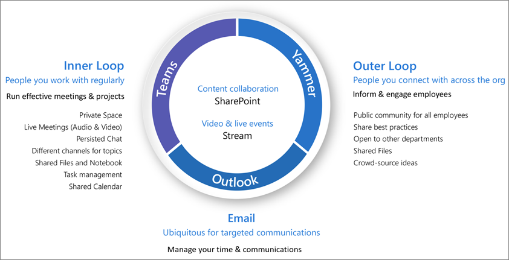

# Was ist Collaboration Governance?

Collaboration Governance ist die Art und Weise, wie Sie den Zugriff von Benutzern auf Ressourcen, die Einhaltung ihrer Geschäftsstandards und die Sicherheit Ihrer Daten verwalten.

Unternehmen verwenden heute ein vielfältiges Toolset. Es gibt das Entwicklerteam, das Team Chats verwendet, die Führungskräfte, die e-Mails senden, und die gesamte Organisation, die über Enterprise Social eine Verbindung herstellt. Es werden mehrere Tools für die Zusammenarbeit verwendet, da jede Gruppe eindeutig ist und über ihre eigenen funktionalen Anforderungen und ihren eigenen Arbeitsstil verfügt. Einige werden nur E-Mail verwenden, während andere hauptsächlich im Chat leben. 

Wenn Benutzer das Gefühl haben, dass die von der IT angebotenen Tools nicht ihren Bedürfnissen entsprechen, werden sie wahrscheinlich ihre bevorzugte Verbraucheranwendung herunterladen, die ihre Szenarien unterstützt. Obwohl dieser Prozess den Benutzern einen schnellen Einstieg ermöglicht, führt er zu einer frustrierenden Benutzererfahrung in der gesamten Organisation mit mehreren Anmeldungen, gemeinsamer Nutzung von Schwierigkeiten und keinem einzigen Ort zum Anzeigen von Inhalten. Dieses Konzept wird als "Schatten-IT" bezeichnet und stellt ein erhebliches Risiko für Organisationen dar. Es reduziert die Möglichkeit, den Benutzerzugriff einheitlich zu verwalten, die Sicherheit zu gewährleisten und die Anforderungen an die Einhaltung von Diensten zu erfüllen.

Dienste wie Microsoft 365-Gruppen, Teams und jammern ermöglichen Benutzern und verringern das Risiko von Shadow IT, indem Sie die erforderlichen Tools für die Zusammenarbeit bereitstellen. Microsoft 365 verfügt über eine Vielzahl von Tools, mit denen Sie alle Steuerungsfunktionen implementieren können, die Ihre Organisation möglicherweise benötigt. 

Diese Artikelreihe hilft Ihnen, zu verstehen, wie Gruppen, Teams und SharePoint-Einstellungen interagieren, welche Steuerungsfunktionen verfügbar sind und wie Sie einen Steuerungsplan für die Zusammenarbeitsfeatures in Microsoft 365 erstellen und implementieren.

## Was sind Microsoft 365-Gruppen?

In Microsoft 365-Gruppen können Sie eine Gruppe von Personen auswählen, mit denen Sie zusammenarbeiten möchten, und einfach eine Sammlung von Ressourcen einrichten, die von diesen Personen gemeinsam genutzt werden können. Das Hinzufügen von Mitgliedern zur Gruppe erteilt automatisch die erforderlichen Berechtigungen für alle von der Gruppe bereitgestellten Objekte. Beide Teams und jammern verwenden Microsoft 365-Gruppen, um Ihre Mitgliedschaft zu verwalten.

Microsoft 365-Gruppen enthalten eine Suite verknüpfter Ressourcen, die Benutzer zur Kommunikation und Zusammenarbeit verwenden können. Gruppen umfassen immer eine SharePoint-Website, einen Planer, einen Power BI-Arbeitsbereich, ein Postfach und einen Kalender sowie Datenstrom. Je nachdem, wie Sie die Gruppe erstellen, können Sie optional weitere Dienste wie Teams, jammern und Projekt hinzufügen.

|Ressource|Beschreibung|
|:------|:----------|
|[Calendar](https://support.office.com/article/schedule-a-meeting-on-a-group-calendar-in-outlook-0cf1ad68-1034-4306-b367-d75e9818376a)|Für die Planung von Ereignissen im Zusammenhang mit der Gruppe|
|[Posteingang](https://support.office.com/article/have-a-group-conversation-in-outlook-a0482e24-a769-4e39-a5ba-a7c56e828b22)|Für e-Mail-Unterhaltungen zwischen Gruppenmitgliedern. Dieser Posteingang hat eine E-Mail-Adresse und kann für das Annehmen von Nachrichten von Personen außerhalb der Gruppe und sogar außerhalb Ihrer Organisation konfiguriert werden, ähnlich wie eine herkömmliche Verteilerliste.|
|[OneNote-Notizbuch](https://support.office.com/article/get-started-with-onenote-e768fafa-8f9b-4eac-8600-65aa10b2fe97)|Sammeln von Ideen, Recherchen und Informationen|
|[Planner](https://support.office.com/article/microsoft-planner-help-4a9a13c6-3adf-4a60-a6fc-15c0b15e16fc)|Für das zuweisen und Verwalten von Projektaufgaben unter den Gruppenmitgliedern|
|[Power BI-Arbeitsbereich](https://docs.microsoft.com/power-bi/collaborate-share/service-new-workspaces)|Ein Daten Zusammenarbeits Bereich mit Dashboards und Berichten|
|[Projekt und Roadmap](https://support.microsoft.com/project)|Webbasierte Projektverwaltungstools|
|[SharePoint-Teamwebsite](https://support.office.com/article/what-is-a-sharepoint-team-site-75545757-36c3-46a7-beed-0aaa74f0401e)|Ein zentrales Repository für Informationen, Links und Inhalte im Zusammenhang mit Ihrer Gruppe|
|[Stream](https://support.microsoft.com/microsoft-stream)|Ein Video-Streaming-Dienst|
|[Teams](https://support.microsoft.com/teams)|Ein Chat basierter Arbeitsbereich in Microsoft 365|
|[Gruppe "jammern"](https://support.office.com/article/Learn-about-Office-365-groups-b565caa1-5c40-40ef-9915-60fdb2d97fa2)|Ein allgemeiner Ort für Unterhaltungen und Freigabe Informationen|

Microsoft 365-Gruppen beinhalten eine Vielzahl von Steuerungs Steuerelementen, einschließlich einer Ablaufrichtlinie, Benennungskonventionen und einer Richtlinie für blockierte Wörter, die Sie beim Verwalten von Gruppen in Ihrer Organisation unterstützen. Da Gruppen die Mitgliedschaft und den Zugriff auf diese Sammlung von Ressourcen steuern, ist das Verwalten von Gruppen ein wichtiger Bestandteil der Steuerung der Zusammenarbeit in Microsoft 365.

## Definieren einer Strategie für die Zusammenarbeit für Ihre Organisation

Es gibt mehrere Orte für die Zusammenarbeit und Unterhaltungen in Microsoft 365. Wenn Sie wissen, wo Benutzer Unterhaltungen beginnen können, können Sie eine Kommunikationsstrategie definieren.

Microsoft 365 unterstützt drei Haupt Kommunikationsmethoden:

- Outlook: Zusammenarbeit per E-Mail mit einem freigegebenen Gruppenposteingang und Kalender
- Microsoft Teams: ein beständiger Chat-basierter Arbeitsbereich, in dem Sie informelle, echt zeitbezogene Unterhaltungen zu einer Vielzahl von Themen haben können, die von bestimmten Untergruppen organisiert werden.
- Yammer: unternehmerische soziale Netzwerke für die Zusammenarbeit

- Teams: Chat-basierter Arbeitsbereich (Zusammenarbeit mit hoher Geschwindigkeit) – innere Schleife
  - Erstellt für die Zusammenarbeit mit den Personen, mit denen Ihre Benutzer täglich arbeiten
  - Stellt den Benutzern Informationen in einer einzigen Benutzeroberfläche zur Verfügung
  - Hinzufügen von Registerkarten, Connectors und Bots
  - Live Chat, Audio/Videokonferenzen, aufgezeichnete Besprechungen

- Yammer: Verbindung über die Organisation ( Unternehmenssoziales) – äußere Schleife
  - Communities of Practice – funktionsübergreifende Gruppen von Personen, die ein gemeinsames Interesse oder Fachwissen teilen, aber nicht unbedingt täglich zusammenarbeiten
  - Verbindung mit dem Führungsteam, Lerngemeinschaften, rollenbasierte Gemeinschaften

- Postfach und Kalender (e-Mail-basierte Zusammenarbeit)
  - Wird für eine gezielte Kommunikation mit einer Gruppe von Personen verwendet
  - Freigegebener Kalender für Besprechungen mit anderen Gruppenmitgliedern
 
Wenn Sie feststellen möchten, wie die Zusammenarbeitsfeatures in Microsoft 365 verwendet werden sollen, sollten Sie diese Methoden der Kommunikation und die Benutzer wahrscheinlich in unterschiedlichen Szenarien verwenden.

> [!NOTE]
> Wenn eine neue Office 365-Gruppe über Yammer oder Teams erstellt wird, ist die Gruppe weder in Outlook noch im Adressbuch sichtbar, da die primäre Kommunikation zwischen diesen Benutzern in ihren jeweiligen Clients stattfindet. Jammern von Gruppen kann nicht mit Microsoft Teams verbunden werden.

## Bewährte Methoden

Beachten Sie beim Starten des Planungsprozesses für die Steuerung diese bewährten Methoden:

- **Sprechen Sie mit ihren Benutzern** – identifizieren Sie die größten Benutzer von Features für die Zusammenarbeit, und treffen Sie sich mit diesen, um die wichtigsten geschäftlichen Anforderungen und Anwendungsfall Szenarien zu verstehen.

- **Risiken und Vorteile** absichern: Überprüfen Sie Ihre geschäftlichen, regulatorischen, rechtlichen und Compliance-Anforderungen, und planen Sie eine Lösung, die für alle Ergebnisse optimiert.

- **Passen Sie sich an unterschiedliche Organisationen und unterschiedliche Arten von Inhalten und Szenarien an** – achten Sie auf die unterschiedlichen Anforderungen für verschiedene Gruppen oder Abteilungen sowie auf unterschiedliche Inhaltstypen wie Intranet-Inhalte im Vergleich zu OneDrive-Inhalten eines Benutzers.

- **Ausrichten an Unternehmensprioritäten** – geschäftliche Ziele helfen Ihnen zu definieren, wie viel Zeit und Energie Sie für Investitionen in die Steuerung benötigen.

- **Integrieren von Steuerungs Entscheidungen direkt in die von Ihnen erstellten Lösungen** – viele Steuerungs Entscheidungen können implementiert werden, indem Sie Features in Microsoft 365 aktivieren oder deaktivieren.

- **Verstärken Sie mit Schulungen** – passen Sie Lösungen wie [Microsoft 365-Lern Pfade](https://docs.microsoft.com/office365/customlearning) an, um sicherzustellen, dass ihre unternehmensspezifischen Erwartungen durch von Microsoft bereitgestellte Schulungen verstärkt werden.

- **Haben Sie eine Strategie für die Kommunikation von Steuerungsrichtlinien und Richtlinien in Ihrer Organisation** – erstellen Sie ein Microsoft 365-Adoptions Center in einer SharePoint-Kommunikationswebsite, um Richtlinien und Verfahren zu kommunizieren.

- **Definieren von Rollen und Zuständigkeiten** – bestimmen Sie Ihr Führungsteam und arbeiten Sie mit wichtigen Entscheidungen zur Entscheidungsfindung bei der proformierung und Benennung und dem externen Zugriff zuerst, und arbeiten Sie dann mit den restlichen Entscheidungen.

- Wiederholen **Sie Ihre Entscheidungen als geschäftliche und technologische Änderungen** – treffen Sie sich regelmäßig, um neue Funktionen und neue geschäftliche Erwartungen zu überprüfen.

Eine genauere Betrachtung dieser Methoden finden Sie unter [Create your Collaboration Governance Plan](collaboration-governance-first.md).

## Auswirkungen und Änderungsverwaltung durch Endbenutzer

Da Gruppen und Teams auf verschiedene Weise erstellt werden können, empfehlen wir, Ihre Benutzer so zu Schulen, dass Sie die für Ihre Organisation geeignete Methode am besten nutzen:

- Wenn Ihre Organisation den Großteil der Kommunikation per e-Mail ausführt, weisen Sie die Benutzer an, Gruppen in Outlook zu erstellen.
- Wenn Ihre Organisation SharePoint stark nutzt oder von SharePoint lokal migriert, weisen Sie die Benutzer an, SharePoint-Teamwebsites für die Zusammenarbeit zu erstellen.
- Wenn Ihre Organisation Teams bereitgestellt hat, weisen Sie die Benutzer an, ein Team zu erstellen, wenn Sie einen Bereich für die Zusammenarbeit benötigen.

Dadurch wird Verwirrung vermieden, wenn Benutzer nicht mit der Beziehung von Gruppen zu ihren verwandten Diensten vertraut sind. Weitere Informationen zum sprechen mit ihren Benutzern zu Gruppen finden Sie unter [Explaining Microsoft 365 groups to your users](../admin/create-groups/explain-groups-knowledge-worker.md).

## Wichtige Steuerungsfunktionen und Lizenzierungsanforderungen

Die Steuerungsfunktionen für die Zusammenarbeit in Microsoft 365 umfassen Features in Microsoft 365, Teams, SharePoint und Azure Active Directory.

| Funktion oder Feature | Beschreibung | Lizenzierung |
|:----------------------|:------------|:----------|
|Team-und Website Freigabe|Steuern, ob Teams, Gruppen und Websites für Personen außerhalb Ihrer Organisation freigegeben werden können.|Microsoft 365 E5 oder E3|
|Domäne zulassen/blockieren|Beschränken Sie die Freigabe für Personen außerhalb Ihrer Organisation auf Personen aus bestimmten Domänen.|Microsoft 365 E5 oder E3|
|Self-Service Site Creation|Zulassen oder verhindern, dass Benutzer ihre eigenen SharePoint-Websites erstellen.|Microsoft 365 E5 oder E3|
|Eingeschränkte Website-und Dateifreigabe|Schränken Sie die Website-, Datei-und Ordnerfreigabe auf Mitglieder einer bestimmten Sicherheitsgruppe ein.|Microsoft 365 E5 oder E3|
|Erstellen von eingeschränkten Gruppen|Schränken Sie die Team-und Gruppenerstellung auf Mitglieder einer bestimmten Sicherheitsgruppe ein.|Microsoft 365 E5 oder E3 mit Azure AD Premium-oder Azure AD Basic edu-Lizenzen|
|Gruppenbenennungsrichtlinie|Erzwingen Sie Präfixe oder Suffixe für Gruppen-und Team Namen.|Microsoft 365 E5 oder E3 mit Azure AD Premium-oder Azure AD Basic edu-Lizenzen|
|Gruppenablaufrichtlinie|Festlegen, dass inaktive Gruppen und Teams ablaufen und nach einem bestimmten Zeitraum gelöscht werden.|Microsoft 365 E5 oder E3 mit Azure AD Premium-Lizenzen|
|Gastzugriff pro Gruppe|Zulassen oder verhindern, dass Team-und Gruppenfreigabe für Personen außerhalb Ihrer Organisation pro Gruppe erfolgen kann.|Microsoft 365 E5 oder E3|

## Erstellen eines Steuerungsplans

Befolgen Sie die folgenden grundlegenden Schritte zum Erstellen Ihres Steuerungsplans:

1. Berücksichtigen Sie die wichtigsten Unternehmensziele und-Prozesse – [Erstellen Sie Ihren Steuerungsplan](collaboration-governance-first.md) , um die Anforderungen Ihres Unternehmens zu erfüllen.
2. Grundlegendes zu Einstellungen in Diensten – [Einstellungen in Gruppen und SharePoint](groups-sharepoint-governance.md) interagieren miteinander, ebenso wie [Einstellungen in Gruppen, SharePoint und Microsoft Teams](groups-sharepoint-teams-governance.md) und [anderen Diensten](groups-services-interactions.md). Achten Sie darauf, diese Interaktionen bei der Planung Ihrer Steuerungsstrategie zu verstehen.
3. Planen der Verwaltung des Benutzerzugriffs – planen [der Zugriffsebene, die Benutzern in Gruppen, SharePoint und Microsoft Teams erteilt werden soll](groups-teams-access-governance.md).
4. Planen der Verwaltung von Kompatibilitätseinstellungen – überprüfen Sie die verfügbaren [Kompatibilitätsoptionen für Microsoft 365-Gruppen,-Teams und die SharePoint-Zusammenarbeit](groups-teams-compliance-governance.md).
5. Planen der Verwaltung der Kommunikation – überprüfen Sie die verfügbaren [Optionen für die Kommunikationssteuerung für Zusammenarbeitsszenarien](groups-teams-communication-governance.md).
6. Plan for Organization and Lifecycle Governance – wählen [Sie die Richtlinien aus, die Sie für die Erstellung, Benennung, Ablauf und Archivierung von Gruppen und Teams verwenden möchten](plan-organization-lifecycle-governance.md). Außerdem sollten Sie sich [mit den Optionen für das Ende des Lebenszyklus für Gruppen, Teams und jammern](end-life-cycle-groups-teams-sites-yammer.md) vertraut machen.

## Schulung für Administratoren

Mithilfe dieser Schulungsmodule von Microsoft Learn können Sie die Features für die Zusammenarbeit in Microsoft Teams und SharePoint kennenlernen.

#### Teams

|Schulungen|Verwalten der Zusammenarbeit im Team mit Microsoft Teams|
|:---|:---|
||Verwalten der Zusammenarbeit im Team mit Microsoft Teams bietet eine Einführung in die Features und Funktionen von Microsoft Teams, dem zentralen Hub für die Zusammenarbeit im Team in Microsoft 365. Hier erfahren Sie, wie Sie mithilfe von Teams Teamarbeit und Kommunikation innerhalb Ihrer Organisation – sowohl lokal als auch mobil – auf einer breiten Palette von Geräten – von Desktops bis Tablets und Smartphones – vereinfachen und gleichzeitig die vielfältigen Funktionen von Office 365-Anwendungen nutzen können. Sie lernen, wie Teams eine umfassende und flexible Umgebung für die Zusammenarbeit über Anwendungen und Geräte hinweg bereitstellt. Dieser Lernpfad kann Ihnen bei der Vorbereitung für die Microsoft 365-Zertifizierung: Teams Administrator Associate helfen.  2 Std. 17 min-Learning Path-5 Module|

> [!div class="nextstepaction"]
> [>starten ](https://docs.microsoft.com/learn/modules/m365-teams-collab-prepare-deployment/introduction/)

#### SharePoint

|Schulungen|Zusammenarbeit mithilfe von SharePoint in Microsoft 365|
|:---|:---|
||Verwalten freigegebener Inhalte mit Microsoft SharePoint bietet eine Einführung in die Features und Funktionen von SharePoint und dessen Funktionsweise mit Microsoft 365. Hier erfahren Sie mehr über die verschiedenen Typen von SharePoint-Websites, einschließlich Hubwebsites, sowie über den Schutz von Informationen, die Berichterstellung und die Überwachung. Sie erfahren außerdem, wie Sie die SharePoint-Datei- und Ordnerfreigabe verwenden, um die Zusammenarbeit zu optimieren, wie Sie Dateien extern freigeben und wie Sie SharePoint-Websites im SharePoint Admin-Center verwalten. Dieser Lernpfad kann Ihnen bei der Vorbereitung für die Microsoft 365 Certified: Teamwork Administrator Associate-Zertifizierung helfen.  1 Std. 14 min-Learning Path-4 Module|

> [!div class="nextstepaction"]
> [>starten ](https://docs.microsoft.com/learn/modules/m365-teams-sharepoint-plan-sharepoint/introduction/)

## Schulungen für Endbenutzer

Diese Schulungsmodule können Ihren Benutzern bei der Verwendung von Teams, Gruppen und SharePoint für die Zusammenarbeit in Microsoft 365 helfen.

|Teams|SharePoint|
|:---|:---|
| **[Einrichten und Anpassen Ihres Teams](https://support.microsoft.com/office/702a2977-e662-4038-bef5-bdf8ee47b17b)**| **[Freigeben und synchronisieren](https://support.microsoft.com/office/98cb2ff2-c27e-42ea-b055-c2d895f8a5de)**|
| **[Dateien hochladen und suchen](https://support.microsoft.com/office/57b669db-678e-424e-b0a0-15d19215cb12)**||
| **[Zusammenarbeit in Teams und Kanälen](https://support.microsoft.com/office/c3d63c10-77d5-4204-a566-53ddcf723b46)**|||

## Illustrationen

Diese Illustrationen helfen Ihnen zu verstehen, wie Gruppen und Teams mit anderen Diensten in Microsoft 365 interagieren und welche Steuerungs-und Kompatibilitätsfeatures Ihnen bei der Verwaltung dieser Dienste in Ihrer Organisation zur Verfügung stehen.

### Gruppen in Microsoft 365 für IT-Architekten
Was IT-Architekten über Gruppen in Microsoft 365 wissen müssen

|**Item**|**Beschreibung**|
|:-----|:-----|
|   [PDF](https://github.com/MicrosoftDocs/microsoft-365-docs/raw/public/microsoft-365/downloads/msft-m365-groups.pdf) \| [Visio](https://github.com/MicrosoftDocs/OfficeDocs-Enterprise/raw/live/Enterprise/downloads/msft-m365-groups.vsdx)   Aktualisiert: Juni 2019|Diese Illustrationen erläutern die unterschiedlichen Arten von Gruppen, erklären, wie diese erstellt und verwaltet werden, und bieten einige Vorschläge für Governance.|

### Microsoft Teams und verwandte Produktivitätsdienste in Microsoft 365 für IT-Architekten
Die logische Architektur von Produktivitätsdiensten in Microsoft 365, beginnend mit Microsoft Teams.

|**Item**|**Beschreibung**|
|:-----|:-----|
|   [PDF](https://github.com/MicrosoftDocs/microsoft-365-docs/raw/public/microsoft-365/downloads/msft-m365-teams-logical-architecture.pdf) \| [Visio](https://github.com/MicrosoftDocs/OfficeDocs-Enterprise/raw/live/Enterprise/downloads/msft-m365-teams-logical-architecture.vsdx)   Aktualisiert: April 2019   |Microsoft bietet eine Reihe von Produktivitätsdiensten für die Zusammenarbeit in den Bereichen Datengovernance, Sicherheit und Compliancefunktionen.    Diese Illustrationen geben einen Einblick in die logische Architektur der Produktivitätsdienste für Enterprise Architekten, beginnend mit Microsoft Teams.|

### Microsoft 365-Funktionen für Informationsschutz und Compliance

Microsoft 365 umfasst eine umfassende Reihe von Funktionen zum Schutz und zur Einhaltung von Informationen. Zusammen mit den Microsoft-Produktivitätstools werden diese Funktionen entwickelt, um Organisationen bei der Zusammenarbeit in Echtzeit unter Einhaltung strenger regulatorischer Compliance-Frameworks zu helfen. 

Dieser Sammlung von Illustrationen wird eine der am stärksten regulierten Branchen, Finanzdienstleistungen, verwendet, um zu veranschaulichen, wie diese Funktionen angewendet werden können, um allgemeine regulatorische Anforderungen zu erfüllen. Fühlen Sie sich frei, diese Illustrationen für Ihren eigenen Gebrauch anzupassen. 

| Element | Beschreibung |
|:-----|:-----|
|   Deutsch: [herunterladen als PDF](https://download.microsoft.com/download/3/a/6/3a6ab1a3-feb0-4ee2-8e77-62415a772e53/m365-compliance-illustrations.pdf) - \| [Download als Visio](https://download.microsoft.com/download/3/a/6/3a6ab1a3-feb0-4ee2-8e77-62415a772e53/m365-compliance-illustrations.vsdx)     Japanisch: [herunterladen als PDF](https://download.microsoft.com/download/6/f/1/6f1a7d0e-dd8e-442e-b073-8e94327ae4f8/m365-compliance-illustrations.pdf) - \| [Download als Visio](https://download.microsoft.com/download/6/f/1/6f1a7d0e-dd8e-442e-b073-8e94327ae4f8/m365-compliance-illustrations.vsdx)     Aktualisiert am 2020|Enthält <ul><li>  Microsoft Information Protection und Verhinderung von Datenverlust</li><li>Aufbewahrungsrichtlinien und Aufbewahrungsbezeichnungen </li><li>Informationsbarrieren</li><li>Kommunikationscompliance</li><li>Insider Risiko</li><li>Daten Einnahme von Drittanbietern</li>|

## Konferenzsitzungen

Sehen Sie sich diese Konferenzsitzungen an, um weitere Informationen zur Steuerung für Microsoft 365-Gruppen und-Teams zu erhalten.

**Grundlagen**

Erfahren Sie mehr über die Grundlagen und neuen Innovationen in Microsoft 365-Gruppen, einschließlich Verwaltung und Steuerung im Maßstab, bewährte Methoden für die Nutzung und Einführung sowie Self-Service.

- [Umarmen von Microsoft 365-Gruppen](https://www.youtube.com/watch?v=dAamBF1gb7M)

**Governance**

Hier erfahren Sie, wie Sie den Ablauf Zyklus von Gruppen einrichten, Benennungsrichtlinien, Klassifikations Bezeichnungen, Zusammenarbeit mit externen Gästen und Berechtigungen zur Gruppenerstellung verwalten.

- [Transformieren der Zusammenarbeit und bekämpfen von Shadow IT mit Office 365 Gruppen](https://www.youtube.com/watch?v=Bhf_bKx3lAg)

**Kundenbeispiel**

Sehen Sie sich ein Beispiel hinter den Kulissen an, wie Microsoft 365-Gruppen, SharePoint, Teams und jammern zusammenarbeiten, um eine globale Plattform für die Zusammenarbeit bereitzustellen.

- [Suchen nach ihrer Zusammenarbeit Sweet Spot mit Office 365 Gruppen, SharePoint, Teams und jammern](https://www.youtube.com/watch?v=Rx9eVwqXeQk)
