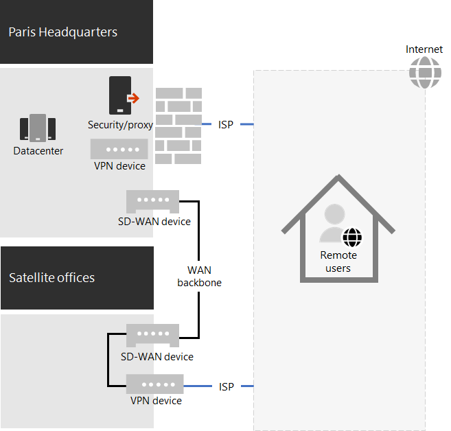

# Contosos COVID-19-Antwort und Unterstützung für eine hybride Belegschaft

Contoso hat seine Remotemitarbeiter stets unterstützt, die über einen zentralen VPN-Server in der Pariser zentrale auf lokale Ressourcen zugegriffen haben. Contoso hat allen Remotemitarbeitern einen verwalteten Laptop ausgestellt. Lokale Arbeitskräfte hatten eine Mischung aus Desktopcomputern und Laptops.

## Contosos Antwort auf COVID-19

Mit dem Ausbruch der COVID-19-Pandemie waren plötzlich alle außer wesentlichen Arbeitskräfte Remote Arbeiter. Contoso reagierte mit der Verlagerung seiner Arbeitskräfte auf die Arbeit von zu Hause aus und durchführen seiner primären Aktivitäten über den Remotezugriff auf lokale Ressourcen und Online mithilfe von Microsoft 365 Cloud Services.

Contoso hatte Remotezugriffs-VPN-Server in der Zentrale von Paris, um die 25% seiner bereits Remote-Mitarbeiter zu unterstützen, aber schnell verschoben, um seine RAS-Kapazität zu skalieren, um 90% seiner Mitarbeiter zu unterstützen. Contoso hat Remotezugriffs-VPN-Server in jeder Satelliten Niederlassung bereitgestellt, sodass Remotemitarbeiter einen regionalen close-Einstiegspfad für den Zugriff auf das Contoso-Intranet verwenden würden.

Contoso hat auch die Konfiguration von VPN-Clients, die auf Laptops, Tablets und Smartphones installiert sind, für den geteilten Tunnel aktualisiert, sodass der Datenverkehr für die Optimierungs Gruppe von Office 365 Endpunkten die VPN-Verbindung überbrückt und direkt über das Internet gesendet wurde. Weitere Informationen finden Sie unter [optimieren Office 365 Konnektivität für Remotebenutzer mithilfe von VPN-Split-Tunneling](../enterprise/microsoft-365-vpn-split-tunnel.md).

Hier ist die resultierende Konfiguration mit VPN-Geräten, die in der Pariser zentrale und in jedem der Niederlassungen installiert sind. 

Ein Remotemitarbeiter mit dem installierten VPN-Client verwendet DNS, um das Regional nächstgelegene Büro zu finden und eine Verbindung mit dem dort installierten VPN-Gerät herstellen. Bei Split-Tunneling wird der Datenverkehr zu Microsoft 365 Optimize Endpoint direkt an den Regional nächstgelegenen Microsoft 365-Netzwerkspeicherort gesendet. Der gesamte andere Datenverkehr wird über die VPN-Verbindung an das VPN-Gerät gesendet.

## Contosos Unterstützung für dynamische Hybrid Mitarbeiter

Nachdem die ersten Änderungen vorgenommen wurden, um hauptsächlich Remote Arbeitskräfte während regionaler Sperrungen zu unterstützen, hat Contoso Infrastrukturänderungen vorgenommen, um eine hybride Belegschaft zu unterstützen, in der eine Arbeitskraft sein könnte:

- Immer Remote.
- Immer lokal.
- Eine Kombination aus Remote und lokal.

Die Funktionen von Microsoft 365 Identity, Security und Compliance sind auf Null-Vertrauen ausgelegt und funktionieren unabhängig vom Standort des Benutzers und des Geräts. Weitere Informationen finden Sie unter [zero Trust](https://www.microsoft.com/security/business/zero-trust).

Das Verwalten neuer Installationen und Softwareupdates hängt jedoch vom Speicherort des Geräts ab, da die zu installierende Software von einer lokalen oder einer Internetquelle stammen kann. Contoso IT Architects hat die Infrastruktur für neue Installationen und Updates basierend auf dem Standort des Geräts und nicht der Arbeitskraft entwickelt.

Sie haben zwei Gerätetypen festgelegt: dediziertes lokales und Roaming.

### Dedizierte lokale

Ein dediziertes lokales Gerät ist ein Desktop-oder Server Computer, der das Contoso-Intranet niemals verlässt und kein VPN-Client installiert ist. Diese lokalen Geräte verwenden weiterhin den Microsoft Endpoint Configuration Manager und die zugehörigen Verteilungspunkte für Installationen und Updates von Windows 10, Microsoft 365 Apps für Unternehmen und den Edge-Browser.

### Roamingeinstellungen

Ein Roaming-Gerät kann das Contoso-Intranet verlassen und umfasst Laptops, die für viele Office-Mitarbeiter und alle Remote-Mitarbeiter und andere Geräte in der Organisation wie Smartphones und Tablets mit dem Contoso-VPN-Client installiert wurden. 

Da diese Geräte zu einem bestimmten Zeitpunkt mit dem Internet verbunden werden können, verwenden Sie InTune oder andere Cloud-basierte Dienste für Installationen und Updates von Windows 10, Microsoft 365 apps for Enterprise und Edge. Sie verwenden nicht die vorhandenen lokalen Configuration Manager-Verteilungspunkte.

Dies bedeutet, dass einige der Installationen und Updates für das Roaming-Gerät über das Internet ausgeführt werden, während Sie lokal und mit dem Intranet verbunden sind. Die IT-Architekten von Contoso haben jedoch entschieden, dass die Einfachheit der Konfiguration wichtiger ist als die Optimierung der Intranet-Bandbreite im Internet, vor allem dann, wenn die meisten Remote Arbeitskräfte selten mit dem Intranet verbunden sind.

Hier ist die resultierende Infrastruktur.

Das Installations-und Aktualisierungsverhalten wird bestimmt, indem die Computerkonten von Geräten als Mitglied einer dieser Gruppen festgelegt werden:

- OnPremDevices

  Der Configuration Manager-Client auf dem Gerät verwendet Verteilungspunkte für Installationen und Updates.

- RoamingDevices

  InTune und andere Einstellungen auf dem Gerät geben die Verwendung des Microsoft 365-Netzwerks für Installationen und Updates an.

## Neuer Onboarding-Prozess

Für ein neues dediziertes lokales Gerät, das für eine neue Arbeitskraft oder für einen neuen Server in einem Datencenter ausgestellt wird, lädt der Configuration Manager-Client, der auf der Mitgliedschaft des Geräts in der OnPremDevices-Gruppe basiert, die neuesten Updates für Windows 10, Microsoft 365 apps for Enterprise und Edge von lokalen Configuration Manager-Verteilungspunkten herunter und installiert diese. Wenn dieser Vorgang abgeschlossen ist, ist das dedizierte lokale Gerät für die Verwendung bereit und verwendet diese Verteilungspunkte für laufende Updates.

Für ein neues Remotegerät, das an eine neue Arbeitskraft ausgestellt wird, wenn sich die Arbeitskraft anmeldet, kontaktiert das Gerät, basierend auf seiner Mitgliedschaft in der Gruppe "RoamingDevices", den InTune-clouddienst und andere Dienste und lädt die neuesten Updates für Windows 10, Microsoft 365 apps for Enterprise und Edge herunter und installiert diese. Wenn dieser Vorgang abgeschlossen ist, ist das Remotegerät betriebsbereit und verwendet den installierten VPN-Client für den Zugriff auf lokale Ressourcen und das Microsoft 365-Netzwerk, um laufende Aktualisierungen durchführen zu können.

## Nächster Schritt

[Bevollmächtigen Sie die Remotemitarbeiter](empower-people-to-work-remotely.md) in Ihrer Organisation.
