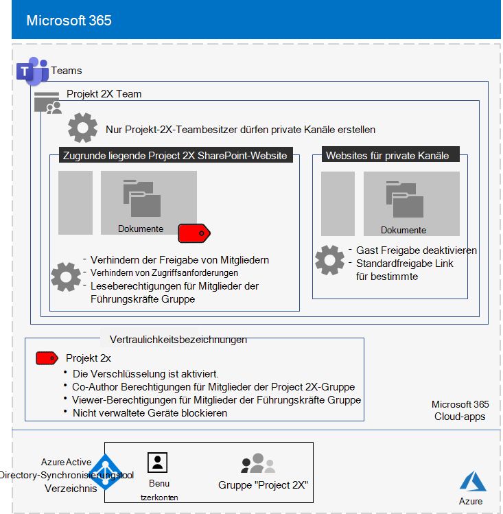
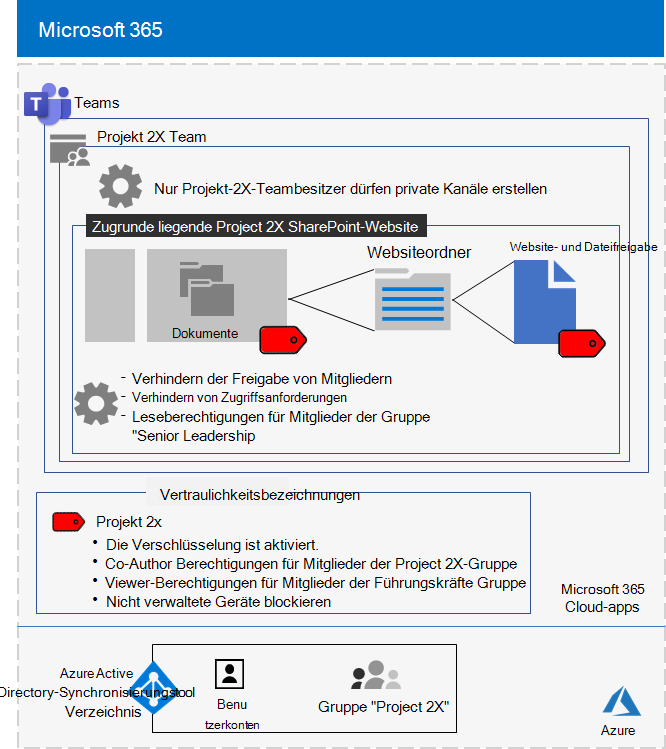

# Isoliertes Team für ein geheimes Projekt der Contoso CorporationIsolated team for a top-secret project of the Contoso Corporation

Nach einer offsite der Geschäftsleitung hat der CEO von Contoso die Entwicklung einer neuen Suite von Produkten und Diensten bestellt, die den Gewinn von Contoso in den nächsten fünf Jahren verdoppeln könnte.After an executive offsite, Contoso’s CEO ordered the development of a new suite of products and services that could double Contoso’s profits in the next five years. Das geheime Projekt zur Entwicklung des Geschäfts-, Engineering- und Marktplans wurde **Project 2X** genannt, und wichtige Mitarbeiter im gesamten Unternehmen wurden eingestellt.The top-secret project to develop the business, engineering, and market plan was named **Project 2X** and key staff across the company were recruited. 

Die Zeitachsen für Forschung und Entwicklung waren eng, was bedeutete, dass die Zusammenarbeit effizient sein und für sichere Besprechungen, laufende Unterhaltungen und Dateispeicherung sorgen musste.The timelines for research and development were tight, which meant that collaboration had to be efficient and provide for secure meetings, ongoing conversations, and file storage.

Die resultierenden Ergebnisse für Project 2X waren Geschäftspläne, Produkt- und technische Spezifikationen sowie Marketingmaterialien und Zeitpläne in Form von Word-, Excel- und PowerPoint-Dateien.The resulting deliverables for Project 2X were business plans, product and engineering specifications, and marketing materials and schedules in the form of Word, Excel, and PowerPoint files. 

Aufgrund ihrer vertraulichen Art war der Zugriff auf diese Dateien wie die folgenden:Due to their sensitive nature, access to these files were:

- Beschränkt auf Project 2X-Teammitglieder und leitende Führungskräfte.Restricted to Project 2X team members and senior leadership.
- Verschlüsselt und mit Berechtigungen geschützt, um zugriff nur auf Project 2X-Teammitglieder und leitende Führungskräfte zu ermöglichen, auch wenn die Dateien außerhalb ihrer gesicherten Ordner verteilt wurden.Encrypted and protected with permissions to allow access only to Project 2X team members and senior leadership, even if the files were distributed outside of their secured folders.

Contoso-IT-Mitarbeiter verwendeten ein Team mit [Sicherheitsisolation](secure-teams-security-isolation.md) für Project 2X und diese Schritte.Contoso IT staff used a [team with security isolation](secure-teams-security-isolation.md) for Project 2X and these steps.

## Schritt 1: Erstellen eines privaten TeamsStep 1: Created a private team

Um zunächst den Zugriff auf die zugrunde liegende SharePoint für das Team zu schützen, haben Contoso-IT-Administratoren die empfohlenen [Zugriffsrichtlinien SharePoint konfiguriert.](../security/office-365-security/sharepoint-file-access-policies.md)First, to protect access to the underlying SharePoint site for the team, Contoso IT administrators configured the [recommended SharePoint access policies](../security/office-365-security/sharepoint-file-access-policies.md).

Als Nächstes hat ein Contoso-IT-Administrator ein neues privates Team mit dem Namen Project 2X erstellt und die Benutzerkonten von Project 2X-Mitarbeitern als Mitglieder hinzugefügt.Next, a Contoso IT administrator created a new private team named Project 2X and added the user accounts of Project 2X staff as members. Sie haben das Team auch so konfiguriert, dass nur Project 2X-Teambesitzer private Kanäle erstellen können.They also configured the team so that only Project 2X team owners can create private channels.

Die Konfigurationsdetails finden Sie unter [Create a private team](secure-teams-security-isolation.md#create-a-private-team).For the configuration details, see [Create a private team](secure-teams-security-isolation.md#create-a-private-team).

## Schritt 2: Erstellen einer Vertraulichkeitsbezeichnung für das Project 2X-TeamStep 2: Created a sensitivity label for the Project 2X team

Contoso-Administratoren haben eine neue Vertraulichkeitsbezeichnung namens **Project 2X erstellt,** die:Contoso admins created a new sensitivity label named **Project 2X** that:

- Aktivierte Verschlüsselung.Enabled encryption.
- Zulässige Co-Author für die Project 2X-Microsoft 365 Gruppe.Allowed Co-Author permissions for the Project 2X Microsoft 365 group.
- Zulässige Viewer-Berechtigungen für die Gruppe "Senior Leadership".Allowed Viewer permissions for the Senior Leadership group.
- Blockierter Zugriff auf nicht verwaltete Geräte.Blocked access to unmanaged devices.

Dateien im Abschnitt **Dokumente** der zugrunde liegenden Project 2X-SharePoint wurden durch:Files in the **Documents** section of the underlying Project 2X SharePoint site were protected by:

- Die Websiteberechtigungen, die nur vollständige Berechtigungen für Mitglieder der gruppe Project 2X Microsoft 365 und Leseberechtigungen für die Gruppe "Senior Leadership" zulassen.The site permissions, which only allow full permissions to members of the Project 2X Microsoft 365 group and read permissions to the Senior Leadership group.
- Die Project 2X-Vertraulichkeitsbezeichnung mit Verschlüsselung und Berechtigungen, die mit der Datei reisen, wenn sie von der Website verschoben oder kopiert wird.The Project 2X sensitivity label, with encryption and permissions that travel with the file if it is moved or copied from the site.

Die Konfigurationsdetails finden Sie unter [Create a sensitivity label](secure-teams-security-isolation.md#create-a-sensitivity-label).For the configuration details, see [Create a sensitivity label](secure-teams-security-isolation.md#create-a-sensitivity-label).

## Schritt 3: Konfigurieren der zugrunde liegenden SharePoint WebsiteStep 3: Configured the underlying SharePoint site

Um zunächst den Zugriff auf die zugrunde liegende SharePoint für das Team zu schützen, haben Contoso-IT-Administratoren die empfohlenen [Zugriffsrichtlinien SharePoint konfiguriert.](../security/office-365-security/sharepoint-file-access-policies.md)First, to protect access to the underlying SharePoint site for the team, Contoso IT administrators configured the [recommended SharePoint access policies](../security/office-365-security/sharepoint-file-access-policies.md).

Als Nächstes konfigurierten sie zusätzliche Berechtigungseinstellungen für die Website:Next, they configured additional permission settings for the site:

- Um zu Project, dass 2X-Gruppenmitglieder den Zugriff auf die Website freigeben.To prevent Project 2X group members from sharing access to the site. Die Konfigurationsdetails finden Sie [unter SharePoint einstellungen für ein Team mit Sicherheitsisolation](secure-teams-security-isolation.md#sharepoint-settings).For the configuration details, see [SharePoint settings for a team with security isolation](secure-teams-security-isolation.md#sharepoint-settings).
- For Read permissions for the Senior Leadership group.For Read permissions for the Senior Leadership group.

Als Nächstes konfigurierten sie zusätzliche Berechtigungseinstellungen für die Website, um zu verhindern, dass Project 2X-Gruppenmitglieder den Zugriff auf die Website freigeben.Next, they configured additional permission settings for the site to prevent Project 2X group members from sharing access to the site. 

Als private Kanäle für die Project 2X erstellt wurden, deaktivierte der Gruppenbesitzer die Gastfreigabe, und der Standardfreigabelink wurde auf den Wert **Spezifische Personen** festgelegt.As private channels for the Project 2X were created, the group owner disabled guest sharing and set the default sharing link to the **Specific people** value.

Hier sehen Sie die resultierende Konfiguration des Project 2X-Teams mit Sicherheitsisolation.Here is the resulting configuration of the Project 2X team with security isolation.

 ## Schritt 4: Geschulte Project 2X-TeammitgliederStep 4: Trained Project 2X team members

Contoso-Sicherheitsmitarbeiter haben die Project 2X-Teammitglieder in einem obligatorischen Kurs geschult, der sie durch schritt:Contoso security staff trained the Project 2X team members in a mandatory course that stepped them through:

- So greifen Sie auf das neue Project 2X-Team zu, verwenden Sie Besprechungen und Chats und wie Sie an Teamdateien zusammenarbeiten.How to access the new Project 2X team, use meetings and chats, and how to collaborate on team files.
- Hier erfahren Sie, wie Sie neue Dateien im Team erstellen und neue lokal erstellte Dateien hochladen.How to create new files in the team and upload new files created locally.
- So beschriften Sie Dateien mit Project 2X-Vertraulichkeitsbezeichnung.How to label files with the Project 2X sensitivity label.
- Eine Demonstration, wie Project 2X-Bezeichnung eine Datei schützt, auch wenn sie das Team verlässt.A demonstration of how the Project 2X  label protects a file even when it leaves the team.

Das Endergebnis war eine sichere Umgebung, in der Project 2X Teammitglieder in einer sicheren Umgebung für Chats, Besprechungen und Dateien zusammenarbeiten.The end result was a secure environment in which Project 2X team members collaborated in a secure environment for chats, meetings, and files.

Hier ist ein Beispiel für eine Datei, die auf der zugrunde liegenden Project 2X-Website gespeichert ist, der die Project 2X-Vertraulichkeitsbezeichnung zugewiesen ist.Here is an example of a file stored in the underlying Project 2X site with the Project 2X sensitivity label assigned.

In einigen Fällen haben Project 2X-Teammitglieder Dateien heruntergeladen, die durch die Project 2X-Bezeichnung geschützt sind, auf ein lokales Laufwerk für die Offlinearbeit.In a couple of instances, Project 2X team members downloaded files protected by the Project 2X label to a local drive for offline work. 

Nachdem sie jedoch beim Öffnen zur Eingabe von Anmeldeinformationen aufgefordert wurden, erkannten sie ihren Fehler und löschten sie.However, after being prompted for credentials when opening them, they realized their mistake and deleted them.

Aufgrund der Umgebung für die Zusammenarbeit von Teams und der Sicherheitsfeatures von Microsoft 365 wurden die Details von Project 2X für die Dauer des Projekts geheim gehalten.Because of the collaboration environment of Teams and the security features of Microsoft 365, the details of Project 2X were kept secret for the duration of the project. Contoso hat seine Pläne angekündigt und ist dabei, die neuen Produkte und Dienstleistungen zur Freude seiner Kunden und Investoren und zum Unförmlich der Konkurrenten zu entwickeln.Contoso announced its plans and is in the process of rolling out the new products and services to the delight of its customers and investors and the chagrin of its competitors.

## Nächster SchrittNext step

[Bereitstellen eines Teams mit Sicherheitsisolation](secure-teams-security-isolation.md) in Ihrer Organisation.[Deploy a team with security isolation](secure-teams-security-isolation.md) in your organization.

