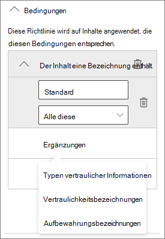

# Erstellen einer sicheren Gastfreigabeumgebung

In diesem Artikel werden verschiedene Optionen zum Erstellen einer sicheren Gastfreigabeumgebung in Microsoft 365 erläutert. Dies sind Beispiele zur Veranschaulichung der verfügbaren Optionen. Sie können verschiedene Kombinationen dieser Verfahren verwenden, um die Sicherheits- und Compliance-Anforderungen Ihrer Organisation zu erfüllen.

In diesem Artikel finden Sie z. B. Folgendes:

- Einrichten der mehrstufigen Authentifizierung für Gäste.
- Erstellen von Nutzungsbedingungen für Gäste.
- Einrichten vierteljährlicher Gastzugriff-Überprüfungen, um in regelmäßigen Abständen zu prüfen, ob Gäste weiterhin Berechtigungen für Teams und Websites benötigen.
- Beschränken des Gastzugriffs auf reinen Webzugriff für nicht verwaltete Geräte.
- Konfigurieren einer Richtlinie für Sitzungstimeouts, um sicherzustellen, dass Gäste sich täglich authentifizieren.
- Erstellen eines vertraulichen Informationstyps für ein streng vertrauliches Projekt
- Dokumenten eine Vertraulichkeitsbezeichnung zuweisen, die einen vertraulichen Informationstyp enthalten
- Automatisches Entfernen des Gastzugriffs von Dateien mit einer Vertraulichkeitsbezeichnung

Einige der in diesem Artikel beschriebenen Optionen setzen voraus, dass Gäste über ein Konto in Azure Active Directory verfügen. Verwenden Sie die [SharePoint- und OneDrive-Integration in Azure AD B2B (Vorschau)](/sharepoint/sharepoint-azureb2b-integration-preview), um sicherzustellen, dass Gäste in das Verzeichnis einbezogen werden, wenn Sie Dateien und Ordner für sie freigeben.

Bitte beachten Sie, dass in diesem Artikel die Aktivierung von Gastfreigabeeinstellungen nicht behandelt wird. Details zum Aktivieren der Gastfreigabe für unterschiedliche Szenarien finden Sie unter [Zusammenarbeit mit Personen außerhalb Ihrer Organisation](collaborate-with-people-outside-your-organization.md).

## Einrichten der mehrstufigen Authentifizierung für Gäste

Die mehrstufige Authentifizierung verringert die Wahrscheinlichkeit, dass ein Konto kompromittiert wird, erheblich. Da Gäste möglicherweise private E-Mail-Konten verwenden, die keiner Governancerichtlinie oder bewährten Methoden entsprechen, ist es besonders wichtig, dass für Gäste die mehrstufige Authentifizierung vorgesehen ist. Sollten der Benutzername und das Kennwort eines Gastes gestohlen werden, verringert ein zweiter Authentifizierungsschritt die Wahrscheinlichkeit, dass unbekannte Parteien Zugriff auf Ihre Websites und Dateien erhalten, erheblich.

In diesem Beispiel wird die mehrstufige Authentifizierung für Gäste mithilfe einer Richtlinie für bedingten Zugriff in Azure Active Directory eingerichtet.

So richten Sie die mehrstufige Authentifizierung für Gäste ein

1. Wechseln Sie zu [Azure-Richtlinien für den bedingten Zugriff](https://portal.azure.com/#blade/Microsoft_AAD_IAM/ConditionalAccessBlade).
2. Klicken Sie auf dem Blatt **Bedingter Zugriff  |  Richtlinien** auf **Neue Richtlinie**.
3. Geben Sie im Feld **Name** einen Namen ein.
4. Klicken Sie unter **Zuweisungen** auf **Benutzer und Gruppen**.
5. Wählen Sie auf dem Blatt **Benutzer und Gruppen** die Option **Benutzer und Gruppen auswählen** aus, aktivieren Sie das Kontrollkästchen **Alle Gäste und externen Benutzer**.
6. Klicken Sie unter **Zuweisungen** auf **Cloud-Apps oder -Aktionen**.
7. Wählen Sie auf dem Blatt **Cloud-Apps oder -Aktionen** auf der Registerkarte **Einschließen** die Option **Alle Cloud-Apps** aus.
8. Klicken Sie unter **Zugriffssteuerung** auf **Gewähren**.
9. Aktivieren Sie auf dem Blatt **Gewähren** das Kontrollkästchen **Mehrstufige Authentifizierung erforderlich**, und klicken Sie dann auf **Auswählen**.
10. Klicken Sie auf dem Blatt **Neu** unter **Richtlinie aktivieren** auf **Ein**, und klicken Sie dann auf **Erstellen**.

Nun müssen sich Gäste über die mehrstufige Authentifizierung anmelden, bevor sie auf freigegebene Inhalte, Websites oder Teams zugreifen können.

### Weitere Informationen

[Planen einer Bereitstellung von Azure AD Multi-Factor Authentication](/azure/active-directory/authentication/howto-mfa-getstarted)

## Erstellen von Nutzungsbedingungen für Gäste

In einigen Situationen könnten Gäste keine Geheimhaltungsvereinbarung oder andere rechtliche Vereinbarungen mit Ihrer Organisation unterzeichnet haben. Sie können festlegen, dass Gäste Ihren Nutzungsbedingungen zustimmen müssen, bevor sie auf für sie freigegebene Dateien zugreifen können. Diese Nutzungsbedingungen können angezeigt werden, wenn ein Gast zum ersten Mal versucht, auf eine freigegebene Datei oder Website zuzugreifen.

Wenn Sie Nutzungsbedingungen erstellen möchten, müssen Sie das entsprechende Dokument zuerst in Word oder einem anderen Dokumenterstellungsprogramm erstellen, und es dann als PDF-Datei speichern. Diese Datei kann dann nach Azure AD hochgeladen werden.

So richten Sie Azure AD-Nutzungsbedingungen ein

1. Melden Sie sich bei Azure als globaler Administrator, Sicherheitsadministrator oder Administrator für bedingten Zugriff an.
2. Navigieren Sie zu [Nutzungsbedingungen](https://aka.ms/catou).
3. Klicken Sie auf **Neue Bedingungen**.

   

4. Geben Sie einen **Namen** und einen **Anzeigenamen** ein.
6. Navigieren Sie für das **Dokument mit Nutzungsbedingungen** zu der PDF-Datei, die Sie zuvor erstellt haben, und wählen Sie sie aus.
7. Wählen Sie die Sprache für Ihr Dokument mit Nutzungsbedingungen aus.
8. Wählen Sie für **Benutzer müssen die Nutzungsbedingungen erweitern** die Option **Ein** aus.
9. Wählen Sie unter **Bedingter Zugriff** in der Liste **Mit Richtlinienvorlage für bedingten Zugriff erzwingen** die Option **Richtlinie für bedingten Zugriff später erstellen** aus.
10. Klicken Sie auf **Erstellen**.

Nachdem Sie die Nutzungsbedingungen erstellt haben, besteht der nächste Schritt darin, eine Richtlinie für den bedingten Zugriff zu erstellen, welche Gäste diese Nutzungsbedingungen anzeigt.

So erstellen Sie eine Richtlinie für bedingten Zugriff

1. Wechseln Sie zu [Azure-Richtlinien für den bedingten Zugriff](https://portal.azure.com/#blade/Microsoft_AAD_IAM/ConditionalAccessBlade).
2. Klicken Sie auf dem Blatt **Bedingter Zugriff | Richtlinien** auf **Neue Richtlinie**.
3. Geben Sie im Feld **Name** einen Namen ein.
4. Klicken Sie unter **Zuweisungen** auf **Benutzer und Gruppen**.
5. Wählen Sie auf dem Blatt **Benutzer und Gruppen** die Option **Benutzer und Gruppen auswählen** aus, aktivieren Sie das Kontrollkästchen **Alle Gäste und externen Benutzer**.
6. Klicken Sie unter **Zuweisungen** auf **Cloud-Apps oder -Aktionen**.
7. Wählen Sie auf der Registerkarte **Einschließen** die Option **Apps auswählen** aus, und klicken Sie dann auf **Auswählen**.
8. Wählen Sie auf dem Blatt **Auswählen** die Optionen **Microsoft Teams**, **Office 365 SharePoint Online** sowie **Outlook-Gruppen** aus, und klicken Sie dann auf **Auswählen**.
9. Klicken Sie unter **Zugriffssteuerung** auf **Gewähren**.
10. Wählen Sie auf dem Blatt **Gewähren** die Option **Gast-Nutzungsbedingungen** aus, und klicken Sie dann auf **Auswählen**.
11. Klicken Sie auf dem Blatt **Neu** unter **Richtlinie aktivieren** auf **Ein**, und klicken Sie dann auf **Erstellen**.

Wenn Gäste nun das erste Mal versuchen, auf Inhalte, ein Team oder eine Website in Ihrer Organisation zuzugreifen, müssen sie zunächst den Nutzungsbedingungen zustimmen.

> [!NOTE]
> Die Verwendung des bedingten Zugriffs erfordert eine Azure AD Premium P1-Lizenz. Weitere Informationen finden Sie unter [Was bedeutet bedingter Zugriff](/azure/active-directory/conditional-access/overview).

### Weitere Informationen

[Azure Active Directory Nutzungsbedingungen](/azure/active-directory/conditional-access/terms-of-use)

## Einrichten von Gastzugriff-Überprüfungen

Mithilfe der Zugriffsüberprüfung in Azure AD können Sie eine regelmäßige Überprüfung des Benutzerzugriffs auf verschiedene Teams und Gruppen automatisieren. Durch das Festlegen einer Zugriffsüberprüfung speziell für Gäste können Sie sicherstellen, dass Gäste nicht länger als erforderlich auf vertrauliche Informationen Ihrer Organisation zugreifen können.

So richten Sie eine Gastzugriffüberprüfung ein

1. Klicken Sie auf der Seite [Identity Governance](https://portal.azure.com/#blade/Microsoft_AAD_ERM/DashboardBlade) im linken Menü auf **Zugriffsüberprüfungen**.
2. Klicken Sie auf **Neue Zugriffsüberprüfung**.
3. Wählen Sie die Option **Teams + Gruppen** aus.
4. Wählen Sie die Option **Alle Microsoft 365-Gruppen mit Gastbenutzern** aus. Klicken Sie auf **Auszuschließende Gruppe(n) auswählen**, wenn Sie bestimmte Gruppen ausschließen möchten.
5. Wählen Sie die Option **Nur Gastbenutzer** aus, und klicken Sie dann auf **Weiter: Überprüfungen**.
6. Wählen Sie unter **Prüfer auswählen** die Option **Gruppenbesitzer** aus.
7. Klicken Sie auf **Fallbackprüfer auswählen**, wählen Sie die Fallbackprüfer aus, und klicken Sie dann auf **Auswählen**.
8. Wählen Sie unter **Wiederholung der Überprüfung festlegen** die Option **Vierteljährlich** aus.
9. Wählen Sie ein Startdatum und die Dauer aus.
10. Wählen Sie für **Ende** die Option **Nie** aus, und klicken Sie dann auf **Weiter: Einstellungen**.

    

11. Überprüfen Sie auf der Registerkarte **Einstellungen** die Einstellungen auf Übereinstimmung mit Ihren Geschäftsregeln.

    

12. Klicken Sie auf **Weiter: Überprüfen + erstellen**.
13. Geben Sie einen **Überprüfungsnamen** ein, und überprüfen Sie die Einstellungen.
14. Klicken Sie auf **Erstellen**.

Es ist wichtig zu beachten, dass Gäste Zugang zu Teams, Gruppen oder einzelnen Dateien und Ordnern gewährt werden kann. Wenn sie Zugriff auf Dateien und Ordner erhalten, müssen Gäste keiner bestimmten Gruppe hinzugefügt werden. Wenn Sie Zugriffsüberprüfungen für Gäste durchführen möchten, die weder einem Team noch einer Gruppe angehören, können Sie in Azure AD eine dynamische Gruppe erstellen, die alle Gäste umfasst, und anschließend eine Zugriffsüberprüfung für diese Gruppe erstellen. Websitebesitzer können auch den [Gastablauf für die Website verwalten](https://support.microsoft.com/office/25bee24f-42ad-4ee8-8402-4186eed74dea).

### Weitere Informationen

[Verwalten des Gastzugriffs mit Azure AD-Zugriffsüberprüfungen](/azure/active-directory/governance/manage-guest-access-with-access-reviews)

[Erstellen einer Zugriffsüberprüfung von Gruppen oder Anwendungen in Azure AD-Zugriffsüberprüfungen](/azure/active-directory/governance/create-access-review)

## Einrichten des rein webbasierten Zugriffs für Gäste

Sie können potenzielle Angriffsflächen verringern und die Verwaltung vereinfachen, indem Sie festlegen, dass Gäste nur über einen Webbrowser auf Ihre Teams, Websites und Dateien zugreifen können.

Für Microsoft 365-Gruppen und Microsoft Teams erfolgt dies über eine Azure AD-Richtlinie für bedingten Zugriff. Für SharePoint wird dies im SharePoint Admin Center konfiguriert. (Sie können auch [Vertraulichkeitsbezeichnungen verwenden, um den Gastzugriff auf reinen Webzugriff zu beschränken](../compliance/sensitivity-labels-teams-groups-sites.md).)

So beschränken Sie den Gastzugriff auf reinen Webzugriff für Gruppen und Teams:

1. Wechseln Sie zu [Azure-Richtlinien für den bedingten Zugriff](https://portal.azure.com/#blade/Microsoft_AAD_IAM/ConditionalAccessBlade).
2. Klicken Sie auf dem Blatt **Bedingter Zugriff – Richtlinien** auf **Neue Richtlinie**.
3. Geben Sie im Feld **Name** einen Namen ein.
4. Klicken Sie unter **Zuweisungen** auf **Benutzer und Gruppen**.
5. Wählen Sie auf dem Blatt **Benutzer und Gruppen** die Option **Benutzer und Gruppen auswählen** aus, aktivieren Sie das Kontrollkästchen **Alle Gäste und externen Benutzer**.
6. Klicken Sie unter **Zuweisungen** auf **Cloud-Apps oder -Aktionen**.
7. Wählen Sie auf der Registerkarte **Einschließen** die Option **Apps auswählen** aus, und klicken Sie dann auf **Auswählen**.
8. Wählen Sie auf dem Blatt **Auswählen** die Optionen **Microsoft Teams** und **Outlook Groups**, und klicken Sie dann auf **Auswählen**.
9. Klicken Sie unter **Zuweisungen** auf **Bedingungen**.
10. Klicken Sie auf dem Blatt **Bedingungen** auf **Client-Apps**.
11. Klicken Sie auf dem Blatt **Client-Apps** auf **Ja** bei **Konfigurieren**, und wählen Sie dann die Einstellungen **Mobile Apps und Desktopclients**, **Exchange ActiveSync-Clients** und **Andere Clients** aus. Deaktivieren Sie das Kontrollkästchen **Browser**.

    

12. Klicken Sie auf **Fertig**.
13. Klicken Sie unter **Zugriffssteuerung** auf **Gewähren**.
14. Wählen Sie auf dem Blatt **Gewähren** die Optionen **Markierung des Geräts als konform erforderlich** und **In Azure AD Hybrid eingebundenes Gerät erforderlich**.
15. Wählen Sie unter **Für mehrere Steuerelemente** die Option **Eines der ausgewählten Steuerelemente erforderlich**, und klicken Sie dann auf **Auswählen**.
16. Klicken Sie auf dem Blatt **Neu** unter **Richtlinie aktivieren** auf **Ein**, und klicken Sie dann auf **Erstellen**.

So beschränken Sie den Gastzugriff auf reinen Webzugriff für SharePoint

1. Erweitern Sie im [SharePoint Admin Center](https://admin.microsoft.com/sharepoint) die Option **Richtlinien**, und klicken Sie dann auf **Zugriffssteuerung**.
2. Klicken Sie auf **Nicht verwaltete Geräte**.
3. Wählen Sie die Option **Eingeschränkten, reinen Webzugriff zulassen** aus, und klicken Sie dann auf **Speichern**.

Beachten Sie, dass durch diese Einstellung im SharePoint Admin Center eine unterstützende Richtlinie für bedingten Zugriff in Azure AD erstellt wird.

## Konfigurieren Sie eine Richtlinie für Sitzungstimeout für Gäste.

Die Bedingung der regelmäßigen Authentifizierung von Gästen kann die Wahrscheinlichkeit verringern, dass unbekannte Benutzer auf die Inhalte Ihrer Organisation zugreifen können, wenn das Gerät eines Gasts nicht sicher verwahrt wird oder geschützt ist. Sie können eine Richtlinie für bedingten Zugriff und Sitzungstimeouts für Gäste in Azure AD konfigurieren.

So konfigurieren Sie eine Sitzungstimeout-Richtlinie für Gäste

1. Wechseln Sie zu [Azure-Richtlinien für den bedingten Zugriff](https://portal.azure.com/#blade/Microsoft_AAD_IAM/ConditionalAccessBlade).
2. Klicken Sie auf dem Blatt **Bedingter Zugriff – Richtlinien** auf **Neue Richtlinie**.
3. Geben Sie im Feld **Name** die Bezeichnung *Gast-Sitzungstimeout* ein.
4. Klicken Sie unter **Zuweisungen** auf **Benutzer und Gruppen**.
5. Wählen Sie auf dem Blatt **Benutzer und Gruppen** die Option **Benutzer und Gruppen auswählen** aus, aktivieren Sie das Kontrollkästchen **Alle Gäste und externen Benutzer**.
6. Klicken Sie unter **Zuweisungen** auf **Cloud-Apps oder -Aktionen**.
7. Wählen Sie auf der Registerkarte **Einschließen** die Option **Apps auswählen** aus, und klicken Sie dann auf **Auswählen**.
8. Wählen Sie auf dem Blatt **Auswählen** die Optionen **Microsoft Teams**, **Office 365 SharePoint Online** sowie **Outlook-Gruppen** aus, und klicken Sie dann auf **Auswählen**.
9. Klicken Sie unter **Zugriffssteuerung** auf **Sitzung**.
10. Wählen Sie auf dem Blatt **Sitzung** die Option **Anmeldehäufigkeit** aus.
11. Wählen Sie **1** und **Tage** für den Zeitraum aus, und klicken Sie dann auf **Auswählen**.
12. Klicken Sie auf dem Blatt **Neu** unter **Richtlinie aktivieren** auf **Ein**, und klicken Sie dann auf **Erstellen**.

## Erstellen Sie einen Typ sensibler Informationen für ein streng vertrauliches Projekt

Vertrauliche Informationstypen sind vordefinierte Zeichenfolgen, die in Richtlinienworkflows verwendet werden können, um Compliance-Anforderungen durchzusetzen. Das Microsoft 365 Compliance Center bietet über 100 vertrauliche Informationstypen, darunter Führerscheinnummern, Kreditkartennummern, Bankkontonummern usw.

Sie können benutzerdefinierte vertrauliche Informationstypen erstellen, um für Ihre Organisation spezifische Inhalte zu verwalten. Im folgenden Beispiel erstellen wir einen vertraulichen Informationstyp für ein streng vertrauliches Projekt. Diesen vertraulichen Informationstyp können wir dann verwenden, um automatisch eine Vertraulichkeitsbezeichnung anzuwenden.

So erstellen Sie einen vertraulichen Informationstyp

1. Erweitern Sie im [Microsoft 365 Compliance Center](https://compliance.microsoft.com) im linken Navigationsbereich den Eintrag **Klassifizierung**, und klicken Sie dann auf **Vertrauliche Informationstypen**.
2. Klicken Sie auf **Erstellen**.
3. Geben Sie unter **Name** und **Beschreibung** den Projektnamen **Projekt Saturn** ein, und klicken Sie auf **Weiter**.
4. Klicken Sie auf **Element hinzufügen**.
5. Wählen Sie in der Liste **Inhalt erkennen, der Folgendes enthält** die Option **Schlüsselwörter** aus, und geben Sie in das Schlüsselwortfeld *Projekt Saturn* ein.
6. Klicken Sie auf **Weiter**, und klicken Sie dann auf **Fertig stellen**.
7. Klicken Sie bei der Frage, ob Sie den vertraulichen Informationstyp testen möchten, auf **Nein**.

### Weitere Informationen

[Benutzerdefinierte vertrauliche Informationstypen](/Office365/SecurityCompliance/custom-sensitive-info-types)

## Erstellen einer Richtlinie für die automatische Bezeichnung zum Zuweisen einer Vertraulichkeitsbezeichnung auf der Grundlage eines vertraulichen Informationstyps

Wenn Sie in Ihrer Organisation Vertraulichkeitsbezeichnungen verwenden, können Sie festlegen, dass Dateien, die definierte vertrauliche Informationstypen enthalten, automatisch mit einer Bezeichnung versehen werden. 

So erstellen Sie eine neue Richtlinie für die automatische Bezeichnung

1. Öffnen Sie das [Microsoft 365 Compliance Admin Center](https://compliance.microsoft.com).
2. Klicken Sie im linken Navigationsbereich auf **Schutz von Daten**.
3. Klicken Sie auf der Registerkarte **Automatische Bezeichnung** auf **Richtlinie für die automatischen Bezeichnung erstellen**.
4. Wählen Sie auf der Seite **Wählen Sie Informationen aus, auf die diese Bezeichnung angewendet werden soll** die Option **Benutzerdefiniert** aus, und klicken Sie auf **Weiter**.
5. Geben Sie einen Namen und eine Beschreibung für die Richtlinie ein, und klicken Sie auf **Weiter**.
6. Aktivieren Sie auf der Seite **Speicherorte auswählen, auf die Sie die Bezeichnung angewendet werden soll**, aktivieren Sie **SharePoint-Websites**, und klicken Sie auf **Websites auswählen**.
7. Fügen Sie die URLs der Websites hinzu, für die die automatische Bezeichnung aktiviert werden soll, und klicken Sie dann auf **Fertig**.
8. Klicken Sie auf **Weiter**.
9. Wählen Sie auf der Seite **Allgemeine oder erweiterte Regeln einrichten** die Option **Allgemeine Regeln** aus, und klicken Sie auf **Weiter**.
10. Klicken Sie auf der Seite **Regeln für Inhalte in allen Speicherorten definieren** die Option **Neue Regel**.
11. Weisen Sie auf der Seite **Neue Regel** der Regel einen Namen zu, klicken Sie auf **Bedingung hinzufügen** und dann auf **Inhalt enthält vertrauliche Informationstypen**.
12. Klicken Sie auf **Hinzufügen**, klicken Sie auf **Typen vertraulicher Informationen**, wählen Sie die zu verwendenden vertraulichen Informationstypen aus, klicken Sie auf **Hinzufügen** und dann auf **Speichern**.
13. Klicken Sie auf **Weiter**.
14. Klicken Sie auf **Bezeichnung auswählen**, wählen Sie die zu verwendende Bezeichnung aus, und klicken Sie dann auf **Hinzufügen**.
15. Klicken Sie auf **Weiter**.
16. Belassen Sie die Richtlinie im Simulationsmodus, und klicken Sie auf **Weiter**.
17. Klicken Sie auf **Richtlinie erstellen** und dann auf **Fertig**.

Wenn ein Benutzer bei aktivierter Richtlinie "Projekt Saturn" in ein Dokument eingibt, wird die Richtlinie beim Überprüfen dieser Datei automatisch die angegebene Bezeichnung darauf anwenden.

### Weitere Informationen

[Automatisches Anwenden einer Vertraulichkeitsbezeichnung auf Inhalte](../compliance/apply-sensitivity-label-automatically.md)

## Erstellen einer DLP-Richtlinie zum Entfernen des Gastzugriffs auf streng vertrauliche Dateien

Sie können über die [Verhinderung von Datenverlust (Data Loss Prevention – DLP)](../compliance/dlp-learn-about-dlp.md) die unerwünschte Freigabe von vertraulichen Inhalten für Gäste verhindern. Eine DLP-Richtlinie kann basierend auf der Vertraulichkeitsbezeichnung einer Datei Maßnahmen ergreifen und den Gastzugriff entfernen.

So erstellen Sie eine DLP-Regel

1. Wechseln Sie im Microsoft 365 Compliance Admin Center zur Seite[Verhinderung von Datenverlust](https://compliance.microsoft.com/datalossprevention).
2. Klicken Sie auf **Richtlinie erstellen**.
3. Wählen Sie **Benutzerdefiniert** aus, und klicken Sie auf **Weiter**.
4. Geben Sie einen Namen für die Richtlinie ein, und klicken Sie auf **Weiter**.
5. Deaktivieren Sie auf der Seite **Speicherorte, an denen die Richtlinie angewendet werden soll** alle Einstellungen außer **SharePoint-Websites** und **OneDrive-Konten**, und klicken Sie dann auf **Weiter**.
6. Klicken Sie auf der Seite **Richtlinieneinstellungen definieren** auf **Weiter**.
7. Klicken Sie auf der Seite **Erweiterte DLP-Regeln anpassen** auf **Regel erstellen**, und geben Sie einen Namen für die Regel ein.
8. Klicken Sie unter **Bedingungen** auf **Bedingung hinzufügen**, und wählen Sie **Inhalt enthält** aus.
9. Klicken Sie auf **Hinzufügen**, wählen Sie **Vertraulichkeitsbezeichnungen** und dann die zu verwendenden Bezeichnungen aus, und klicken Sie anschließend auf **Hinzufügen**.

   

10. Klicken Sie unter **Aktionen** auf **Aktion hinzufügen**, und wählen Sie **Zugriff auf Inhalte in Microsoft 365-Speicherorten einschränken oder diese verschlüsseln**.
11. Aktivieren Sie das Kontrollkästchen **Zugriff auf Inhalte in Microsoft 365-Speicherorten einschränken oder diese verschlüsseln**, und wählen Sie dann die Option **Nur Personen außerhalb Ihrer Organisation** aus.

      

12. Klicken Sie auf **Speichern** und dann auf **Weiter**.
13. Wählen Sie die gewünschten Testoptionen aus, und klicken Sie auf **Weiter**.
14. Klicken Sie auf **Absenden** und anschließend auf **Fertig**.

Wichtig: Diese Richtlinie entfernt nicht den Zugriff für Gäste, die Mitglieder der Website oder des Teams als Ganzes sind. Wenn Sie vorhaben, auf einer Website oder in einem Team mit Gastmitgliedern streng vertrauliche Dokumente freizugeben, erwägen Sie die Verwendung [privater Kanäle in Microsoft Teams](https://support.microsoft.com/office/de3e20b0-7494-439c-b7e5-75899ebe6a0e) und den Zugriff auf diese Kanäle nur Mitgliedern Ihrer Organisation zu gestatten.

## Weitere Optionen

Es gibt einige zusätzliche Optionen in Microsoft 365 und Azure Active Directory, mit denen Sie Ihre Gastfreigabeumgebung sicherer machen können.

- Sie können eine Liste der zulässigen bzw. blockierten Freigabedomänen erstellen, um zu begrenzen, an wen Benutzer Inhalte freigeben können. Weitere Informationen hierzu finden Sie unter [Einschränken der Freigabe von SharePoint- und OneDrive-Inhalten nach Domänen](/sharepoint/restricted-domains-sharing) und [Zulassen oder Blockieren von Einladungen an B2B-Benutzer aus bestimmten Organisationen](/azure/active-directory/b2b/allow-deny-list).
- Sie können einschränken, mit welchen anderen Azure Active Directory-Mandanten sich Ihre Benutzer verbinden können. Weitere Informationen finden Sie unter [Verwenden von Mandanteneinschränkungen zur Verwaltung des Zugriffs auf SaaS-Anwendungen](/azure/active-directory/manage-apps/tenant-restrictions).
- Sie können eine verwaltete Umgebung erstellen, in der Partner beim Verwalten von Gastkonten helfen können. Informationen hierzu finden Sie unter [Erstellen eines B2B-Extranets mit verwalteten Gästen](/Office365/Enterprise/b2b-extranet).

## Siehe auch

[Einschränken des Risikos der versehentlichen Gefährdung von Dateien bei der Freigabe für Gäste](share-limit-accidental-exposure.md)

[Bewährte Methoden zum Freigeben von Dateien und Ordnern für nicht authentifizierte Benutzer](best-practices-anonymous-sharing.md)

[Erstellen eines B2B-Extranets mit verwalteten Gästen](b2b-extranet.md)