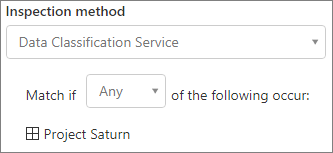

# Erstellen einer sicheren GastfreigabeumgebungCreate a secure guest sharing environment

In diesem Artikel werden verschiedene Optionen zum Erstellen einer sicheren Gastfreigabeumgebung in Microsoft 365 erläutert.In this article, we'll walk through a variety of options for creating a secure guest sharing environment in Microsoft 365. Dies ist ein Beispielszenario zur Veranschaulichung der verfügbaren Optionen.This is an example scenario to give you an idea of the options available. Sie können verschiedene Kombinationen dieser Verfahren verwenden, um die Sicherheits- und Compliance-Anforderungen Ihrer Organisation zu erfüllen.You can use these procedures in different combinations to meet the security and compliance needs of your organization. Am Ende des Artikels werden Sie durch einen Testfall geführt, um zu sehen, wie einige dieser Optionen interagieren.At the end of the article, we'll walk through a test case to see how some of these options work together.

Dieses Szenario umfasst:This scenario includes:

- Einrichten der mehrstufigen Authentifizierung für Gäste.Setting up multi-factor authentication for guests.
- Erstellen von Nutzungsbedingungen für Gäste.Setting up a terms of use for guests.
- Einrichten vierteljährlicher Gastzugriff-Überprüfungen, um in regelmäßigen Abständen zu prüfen, ob Gäste weiterhin Berechtigungen für Teams und Websites benötigen.Setting up quarterly guest access reviews to periodically validate whether guests continue to need permissions to teams and sites.
- Beschränken des Gastzugriffs auf reinen Webzugriff für nicht verwaltete Geräte.Restricting guests to web-only access for unmanaged devices.
- Konfigurieren einer Richtlinie für Sitzungstimeouts, um sicherzustellen, dass Gäste sich täglich authentifizieren.Configuring a session timeout policy to ensure guests authenticate daily.
- Erstellen und Veröffentlichen von Vertraulichkeitsbezeichnungen zum Klassifizieren von Inhalten.Creating and publishing sensitivity labels to classify content.
- Erstellen eines sensiblen Informationstyps für ein streng vertrauliches Projekt.Creating a sensitive information type for a highly sensitive project.
- Automatische Zuweisung eines *streng vertraulich*en Etiketts an Dokumente, die den Typ sensibler Informationen enthalten.Automatically assigning a *highly sensitive* label to documents that contain the sensitive information type.
- Automatisches Entfernen des Gastzugriffs von Dateien, die als *streng vertraulich* gekennzeichnet sind.Automatically removing guest access from files labeled as *highly sensitive*.

Einige der in diesem Artikel beschriebenen Optionen setzen voraus, dass Gäste über ein Konto in Azure Active Directory verfügen.Some of the options discussed in this article require guests to have an account in Azure Active Directory. Verwenden Sie die [SharePoint- und OneDrive-Integration in Azure AD B2B (Vorschau)](https://docs.microsoft.com/sharepoint/sharepoint-azureb2b-integration-preview), um sicherzustellen, dass Gäste in das Verzeichnis einbezogen werden, wenn Sie Dateien und Ordner für sie freigeben.To ensure that guests are included in the directory when you share files and folders with them, use the [SharePoint and OneDrive integration with Azure AD B2B Preview](https://docs.microsoft.com/sharepoint/sharepoint-azureb2b-integration-preview).

Bitte beachten Sie, dass in diesem Artikel die Aktivierung von Gastfreigabeeinstellungen nicht behandelt wird.Note that we won't discuss enabling guest sharing settings in this article. Details zum Aktivieren der Gastfreigabe für unterschiedliche Szenarien finden Sie unter [Zusammenarbeit mit Personen außerhalb Ihrer Organisation](collaborate-with-people-outside-your-organization.md).See [Collaborating with people outside your organization](collaborate-with-people-outside-your-organization.md) for details about enabling guest sharing for different scenarios.

## Einrichten der mehrstufigen Authentifizierung für GästeSet up multi-factor authentication for guests

Die mehrstufige Authentifizierung verringert die Wahrscheinlichkeit, dass ein Konto kompromittiert wird, erheblich.Multi-factor authentication greatly reduces the chances of an account being compromised. Da Gastbenutzer möglicherweise private E-Mail-Konten verwenden, die keiner Governance-Richtlinie oder bewährten Methoden entsprechen, ist es besonders wichtig, dass für Gäste die mehrstufige Authentifizierung vorgesehen ist.Since guest users may be using personal email accounts that don't adhere to any governance policies or best practices, it's especially important to require multi-factor authentication for guests. Sollten der Benutzername und das Kennwort eines Gastbenutzers gestohlen werden, verringert ein zweiter Authentifizierungsschritt die Wahrscheinlichkeit, dass unbekannte Parteien Zugriff auf Ihre Websites und Dateien erhalten, erheblich.If a guest user's username and password is stolen, requiring a second factor of authentication greatly reduces the chances of unknown parties gaining access to your sites and files.

In diesem Beispiel wird die mehrstufige Authentifizierung für Gäste mithilfe einer Richtlinie für bedingten Zugriff in Azure Active Directory eingerichtet.In this example, we'll set up multi-factor authentication for guests by using a conditional access policy in Azure Active Directory.

So richten Sie die mehrstufige Authentifizierung für Gäste einTo set up multi-factor authentication for guests
1. Suchen Sie in Microsoft Azure nach *Bedingter Zugriff*.In Microsoft Azure, search for *Conditional access*.
2. Klicken Sie auf dem Blatt **Bedingter Zugriff – Richtlinien** auf **Neue Richtlinie**.On the **Conditional Access - Policies** blade, click **New policy**.
3. Geben Sie im Feld **Name** den Namen *Gast-MFA* ein.In the **Name** field, type *Guest MFA*.
4. Klicken Sie unter **Zuweisungen** auf **Benutzer und Gruppen**.Under **Assignments**, click **Users and groups**.
5. Wählen Sie auf dem Blatt **Benutzer und Gruppen** die Option **Benutzer und Gruppen auswählen** aus, aktivieren Sie das Kontrollkästchen **Alle Gäste und externen Benutzer**.On the **Users and groups** blade, select **Select users and groups**, select the **All guests and external users** check box.
6. Klicken Sie unter **Zuweisungen** auf **Cloud-Apps oder -Aktionen**.Under **Assignments**, click **Cloud apps or actions**.
7. Wählen Sie auf dem Blatt **Cloud-Apps oder -Aktionen** auf der Registerkarte **Einschließen** die Option **Alle Cloud-Apps** aus.On the **Cloud apps or actions** blade, select **All cloud apps** on the **Include** tab.
8. Klicken Sie unter **Zugriffssteuerung** auf **Gewähren**.Under **Access controls**, click **Grant**.
9. Aktivieren Sie auf dem Blatt **Gewähren** das Kontrollkästchen **Mehrstufige Authentifizierung erforderlich**, und klicken Sie dann auf **Auswählen**.On the **Grant** blade, select the **Require multi-factor authentication** check box, and then click **Select**.
10. Klicken Sie auf dem Blatt **Neu** unter **Richtlinie aktivieren** auf **Ein**, und klicken Sie dann auf **Erstellen**.On the **New** blade, under **Enable policy**, click **On**, and then click **Create**.

Nun müssen sich Gäste über die mehrstufige Authentifizierung anmelden, bevor sie auf freigegebene Inhalte, Websites oder Teams zugreifen können.Now, guest will be required to enroll in multi-factor authentication before they can access shared content, sites, or teams.

### Weitere InformationenMore information

[Planen einer cloudbasierten Bereitstellung der mehrstufigen Azure-Authentifizierung](https://docs.microsoft.com/azure/active-directory/authentication/howto-mfa-getstarted).[Planning a cloud-based Azure Multi-Factor Authentication deployment](https://docs.microsoft.com/azure/active-directory/authentication/howto-mfa-getstarted)

## Erstellen von Nutzungsbedingungen für GästeSet up a terms of use for guests

In vielen Fällen könnten Gastbenutzer keine Geheimhaltungsvereinbarung oder andere rechtliche Vereinbarungen mit Ihrer Organisation unterzeichnet haben.Often times guest users may not have signed non-disclosure agreements or other legal agreements with your organization. Sie können festlegen, dass Gäste Ihren Nutzungsbedingungen zustimmen müssen, bevor sie auf für sie freigegebene Dateien zugreifen können.You can require guests to agree to a terms of use before accessing files that are shared with them. Diese Nutzungsbedingungen können angezeigt werden, wenn ein Gast zum ersten Mal versucht, auf eine freigegebene Datei oder Website zuzugreifen.The terms of use can be displayed the first time they attempt to access a shared file or site.

Wenn Sie Nutzungsbedingungen erstellen möchten, müssen Sie das entsprechende Dokument zuerst in Word oder einem anderen Dokumenterstellungsprogramm erstellen, und es dann als PDF-Datei speichern.To create a terms of use, you first need to create the document in Word or another authoring program, and then save it as a .pdf file. Diese Datei kann dann in Azure AD hochgeladen werden.This file can then be uploaded to Azure AD.

So richten Sie Azure AD-Nutzungsbedingungen einTo create an Azure AD terms of use
1. Melden Sie sich bei Azure als globaler Administrator, Sicherheitsadministrator oder Administrator für bedingten Zugriff an.Sign in to Azure as a Global Administrator, Security Administrator, or Conditional Access Administrator.
2. Navigieren Sie zu [Nutzungsbedingungen](https://aka.ms/catou).Navigate to [Terms of use](https://aka.ms/catou).
3. Klicken Sie auf **Neue Bedingungen**.Click **New terms**. 
   
4. Geben Sie in die Felder **Name** und **Anzeigenname** die Bezeichnung *Gast-Nutzungsbedingungen* ein.In the **Name** and **Display name** boxes, type *Guest terms of use*.
6. Navigieren Sie für das **Dokument mit Nutzungsbedingungen** zu der PDF-Datei, die Sie zuvor erstellt haben, und wählen Sie sie aus.For **Terms of use document**, browse to the pdf file that you created and select it.
7. Wählen Sie die Sprache für Ihr Dokument mit Nutzungsbedingungen aus.Select the language for your terms of use document.
8. Wählen Sie für **Benutzer müssen die Nutzungsbedingungen erweitern** die Option **Ein** aus.Set **Require users to expand the terms of use** to **On**.
9. Wählen Sie unter **Bedingter Zugriff** in der Liste **Mit Richtlinienvorlage für bedingten Zugriff erzwingen** die Option **Richtlinie für bedingten Zugriff später erstellen** aus.Under **Conditional Access**, in the **Enforce with Conditional Access policy template** list choose **Create conditional access policy later**.
10. Klicken Sie auf **Erstellen**.Click **Create**.

Nachdem Sie die Nutzungsbedingungen erstellt haben, besteht der nächste Schritt darin, eine Richtlinie für den bedingten Zugriff zu erstellen, welche Gastbenutzern diese Nutzungsbedingungen anzeigt.Once you've created the terms of use, the next step is to create a conditional access policy that displays the terms of use to guest users.

So erstellen Sie eine Richtlinie für bedingten ZugriffTo create a conditional access policy
1. Suchen Sie in Microsoft Azure nach *Bedingter Zugriff*.In Microsoft Azure, search for *Conditional access*.
2. Klicken Sie auf dem Blatt **Bedingter Zugriff – Richtlinien** auf **Neue Richtlinie**.On the **Conditional Access - Policies** blade, click **New policy**.
3. Geben Sie im Feld **Name** die Bezeichnung *Richtlinie für Gastbenutzer-Nutzungsbedingungen* ein.In the **Name** box, type *Guest user terms of use policy*.
4. Klicken Sie unter **Zuweisungen** auf **Benutzer und Gruppen**.Under **Assignments**, click **Users and groups**.
5. Wählen Sie auf dem Blatt **Benutzer und Gruppen** die Option **Benutzer und Gruppen auswählen** aus, aktivieren Sie das Kontrollkästchen **Alle Gäste und externen Benutzer**, und klicken Sie dann auf **Fertig**.On the **Users and groups** blade, select **Select users and groups**, select the **All guests and external users** check box, and then click **Done**.
6. Klicken Sie unter **Zuweisungen** auf **Cloud-Apps oder -Aktionen**.Under **Assignments**, click **Cloud apps or actions**.
7. Wählen Sie auf der Registerkarte **Einschließen** die Option **Apps auswählen** aus, und klicken Sie dann auf **Auswählen**.On the **Include** tab, select **Select apps**, and then click **Select**.
8. Wählen Sie auf dem Blatt **Auswählen** die Optionen **Microsoft Teams**, **Office 365 SharePoint Online** sowie **Outlook-Gruppen** aus, und klicken Sie dann auf **Auswählen**.On the **Select** blade, select **Microsoft Teams**, **Office 365 SharePoint Online**, and **Outlook Groups**, and then click **Select**.
9. Klicken Sie auf dem Blatt **Cloud-Apps oder -Aktionen** auf **Fertig**.On the **Cloud apps or actions** blade, click **Done**.
10. Klicken Sie unter **Zugriffssteuerung** auf **Gewähren**.Under **Access controls**, click **Grant**.
11. Wählen Sie auf dem Blatt **Gewähren** die Option **Gast-Nutzungsbedingungen** aus, und klicken Sie dann auf **Auswählen**.On the **Grant** blade, select **Guest terms of use**, and then click **Select**.
12. Klicken Sie auf dem Blatt **Neu** unter **Richtlinie aktivieren** auf **Ein**, und klicken Sie dann auf **Erstellen**.On the **New** blade, under **Enable policy**, click **On**, and then click **Create**.

Wenn Gastbenutzer nun das erste Mal versuchen, auf Inhalte, ein Team oder eine Website in Ihrer Organisation zuzugreifen, müssen sie zunächst den Nutzungsbedingungen zustimmen.Now, the first time a guest user attempts to access content or a team or site in your organization, they will be required to accept the terms of use.

> [!NOTE]
> Die Verwendung des bedingten Zugriffs erfordert eine Azure AD Premium P1-Lizenz.Using Conditional Access requires an Azure AD Premium P1 license. Weitere Informationen finden Sie unter [Was bedeutet bedingter Zugriff](https://docs.microsoft.com/azure/active-directory/conditional-access/overview).For more information, see [What is Conditional Access](https://docs.microsoft.com/azure/active-directory/conditional-access/overview).

### Weitere InformationenMore information
[Azure Active Directory NutzungsbedingungenAzure Active Directory terms of use](https://docs.microsoft.com/azure/active-directory/conditional-access/terms-of-use)

## Einrichten von Gastzugriff-ÜberprüfungenSet up guest access reviews

Mithilfe der Zugriffsüberprüfung in Azure AD können Sie eine regelmäßige Überprüfung des Benutzerzugriffs auf verschiedene Teams und Gruppen automatisieren.With access reviews in Azure AD, you can automate a periodic review of user access to various teams and groups. Durch das Festlegen einer Zugriffsüberprüfung speziell für Gäste können Sie sicherstellen, dass Gastbenutzer nicht länger als erforderlich auf vertrauliche Informationen Ihrer Organisation zugreifen können.By requiring an access review for guests specifically, you can help ensure guest users do not retain access to your organization's sensitive information for longer than is necessary.

Zugriffsüberprüfungen lassen sich in Programmen organisieren.Access reviews can be organized into programs. Ein Programm besteht aus einer Gruppe ähnlicher Zugriffsüberprüfungen und kann verwendet werden, um Zugriffsüberprüfungen für Berichts- und Überwachungszwecke zu organisieren.A program is a grouping of similar access reviews that can be used to organize access reviews for reporting and auditing purposes.

In diesem Beispiel wird ein Programm für Gastzugriff-Überprüfungen erstellt.In this example, we'll create a program for guest access reviews.

So erstellen Sie ein ProgrammTo create a program
1. Melden Sie sich beim Azure-Portal an, und öffnen Sie die Seite [Identity Governance](https://portal.azure.com/#blade/Microsoft_AAD_ERM/DashboardBlade).Sign in to the Azure portal and open the [Identity Governance page](https://portal.azure.com/#blade/Microsoft_AAD_ERM/DashboardBlade).
2. Klicken Sie im linken Menü auf **Programme**.In the left menu, click **Programs**
3. Klicken Sie auf **Neues Programm**.Click **New program**.
4. Geben Sie im Feld **Name** die Bezeichnung *Gastzugriff-Überprüfungsprogramm* ein.In the **Name** box, type *Guest access review program*.
5. Geben Sie im Feld **Beschreibung** folgenden Text ein: *Programm für Gastzugriff-Überprüfungen*.In the **Description** box, type *Program for guest access reviews*.
6. Klicken Sie auf **Erstellen**.Click **Create**.

Nach der Erstellung des Programms können wir eine Gastzugriff-Überprüfung erstellen und diese dem Programm zuordnen.Once the program has been created, we can create a guest access review and associate it with the program.

So richten Sie eine Gastzugriff-Überprüfung einTo set up a guest user access review
1. Klicken Sie auf der Seite [Identity Governance](https://portal.azure.com/#blade/Microsoft_AAD_ERM/DashboardBlade) im linken Menü auf **Zugriffsüberprüfungen**.On the [Identity Governance page](https://portal.azure.com/#blade/Microsoft_AAD_ERM/DashboardBlade), in the left menu, click **Access reviews**.
2. Klicken Sie auf **Neue Zugriffsüberprüfung**.Click **New access review**. 
   
3. Geben Sie im Feld **Name** die Bezeichnung *Vierteljährliche Gastzugriff-Überprüfung* ein.In the **Name** box, type *Quarterly guest access review*.
4. Wählen Sie bei **Häufigkeit** die Option **Vierteljährlich** aus.For **Frequency**, choose **Quarterly**.
5. Wählen Sie bei **Ende** die Option **Nie** aus.For **End**, choose **Never**.
6. Wählen Sie bei **Umfang** die Option **Nur Gastbenutzer**.For **Scope**, choose **Guest users only**.
7. Klicken Sie auf **Gruppe**, wählen Sie die Gruppen aus, die Sie in die Zugriffsüberprüfung einbeziehen möchten, und klicken Sie dann auf **Auswählen**.Click **Group**, select the groups that you want to include in the access review, and then click **Select**.
8. Klicken Sie unter **Programme** auf **Mit Programm verknüpfen**.Under **Programs**, click **Link to program**.
9. Wählen Sie auf dem Blatt **Programm auswählen** die Option **Gastzugriff-Überprüfungsprogramm aus**.On the **Select a program** blade, choose **Guest access review program**
10. Klicken Sie auf **Start**.Click **Start**.

Für jede von Ihnen festgelegte Gruppe wird eine separate Zugriffsüberprüfung erstellt.A separate access review is created for each group that you specify. Die Gruppenbesitzer der einzelnen Gruppen erhalten vierteljährlich eine E-Mail, um den Gastzugriff auf Ihre Gruppe zu genehmigen oder zu verweigern.Group owners of each groups will be emailed quarterly to approve or deny guest access to their groups.

Es ist wichtig zu beachten, dass Gäste Zugang zu Teams, Gruppen oder einzelnen Dateien und Ordnern gewährt werden kann.It's important to note that guests can be given access to teams or groups, or to individual files and folders. Wenn sie Zugriff auf Dateien und Ordner erhalten, müssen Gäste keiner bestimmten Gruppe hinzugefügt werden.When given access to files and folders, guests may not be added to any particular group. Wenn Sie Zugriffsüberprüfungen für Gastbenutzer durchführen möchten, die weder einem Team noch einer Gruppe angehören, können Sie in Azure AD eine dynamische Gruppe erstellen, die alle Gäste umfasst, und anschließend eine Zugriffsüberprüfung für diese Gruppe erstellen.If you want to do access reviews on guest users who don't belong to a team or group, you can create a dynamic group in Azure AD to contain all guests and then create an access review for that group.

### Weitere InformationenMore information
[Verwalten des Gastzugriffs mit Azure AD-ZugriffsüberprüfungenManage guest access with Azure AD access reviews](https://docs.microsoft.com/azure/active-directory/governance/manage-guest-access-with-access-reviews)

[Erstellen einer Zugriffsüberprüfung von Gruppen oder Anwendungen in Azure AD-ZugriffsüberprüfungenCreate an access review of groups or applications in Azure AD access reviews](https://docs.microsoft.com/azure/active-directory/governance/create-access-review)

## Einrichten des rein webbasierten Zugriffs für GastbenutzerSet up web-only access for guest users

Sie können potenzielle Angriffsflächen verringern und die Verwaltung vereinfachen, indem Sie festlegen, dass Gastbenutzer nur über einen Webbrowser auf Ihre Teams, Websites und Dateien zugreifen können.You can reduce your attack surface and ease administration by requiring guest users to access your teams, sites, and files by using a web browser only. Dies geschieht über eine Azure AD-Richtlinie für bedingten Zugriff.This is done with an Azure AD conditional access policy.

So beschränken Sie den Gastzugriff auf reinen WebzugriffTo restrict guests to web-ony access
1. Suchen Sie in Microsoft Azure nach *Bedingter Zugriff*.In Microsoft Azure, search for *Conditional access*.
2. Klicken Sie auf dem Blatt **Bedingter Zugriff – Richtlinien** auf **Neue Richtlinie**.On the **Conditional Access - Policies** blade, click **New policy**.
3. Geben Sie im Feld **Name** die Bezeichnung *Gastbenutzer-Browserzugriff* ein.In the **Name** box, type *Guest user browser access*.
4. Klicken Sie unter **Zuweisungen** auf **Benutzer und Gruppen**.Under **Assignments**, click **Users and groups**.
5. Wählen Sie auf dem Blatt **Benutzer und Gruppen** die Option **Benutzer und Gruppen auswählen** aus, aktivieren Sie das Kontrollkästchen **Alle Gäste und externen Benutzer**, und klicken Sie dann auf **Fertig**.On the **Users and groups** blade, select **Select users and groups**, select the **All guests and external users** check box, and then click **Done**.
6. Klicken Sie unter **Zuweisungen** auf **Cloud-Apps oder -Aktionen**.Under **Assignments**, click **Cloud apps or actions**.
7. Wählen Sie auf der Registerkarte **Einschließen** die Option **Apps auswählen** aus, und klicken Sie dann auf **Auswählen**.On the **Include** tab, select **Select apps**, and then click **Select**.
8. Wählen Sie auf dem Blatt **Auswählen** die Optionen **Microsoft Teams**, **Office 365 SharePoint Online** sowie **Outlook-Gruppen** aus, und klicken Sie dann auf **Auswählen**.On the **Select** blade, select **Microsoft Teams**, **Office 365 SharePoint Online**, and **Outlook Groups**, and then click **Select**.
9. Klicken Sie auf dem Blatt **Cloud-Apps oder -Aktionen** auf **Fertig**.On the **Cloud apps or actions** blade, click **Done**.
10. Klicken Sie unter **Zuweisungen** auf **Bedingungen**.Under **Assignments**, click **Conditions**.
11. Klicken Sie auf dem Blatt **Bedingungen** auf **Client-Apps**.On the **Conditions** blade, click **Client apps**.
12. Klicken Sie auf dem Blatt **Client-Apps** auf **Ja** bei **Konfigurieren**, und wählen Sie dann die Einstellung **Mobile Apps und Desktopclients** aus.On the **Client apps** blade, click **Yes** for **Configure**, and then select the **Mobile apps and desktop clients** setting. 
    
13. Klicken Sie auf **Fertig** und anschließend auf dem Blatt **Bedingungen** erneut auf **Fertig**.Click **Done**, and then on the **Conditions** blade, click **Done** again.
14. Klicken Sie unter **Zugriffssteuerung** auf **Gewähren**.Under **Access controls**, click **Grant**.
15. Wählen Sie auf dem Blatt **Gewähren** die Optionen **Markierung des Geräts als konform erforderlich** und **In Azure AD Hybrid eingebundenes Gerät erforderlich**.On the **Grant** blade, select **Require device to be marked as compliant** and **Require Hybrid Azure AD joined device**.
16. Wählen Sie unter **Für mehrere Steuerelemente** die Option **Eines der ausgewählten Steuerelemente erforderlich**, und klicken Sie dann auf **Auswählen**.Under **For multiple controls**, select **Require one of the selected controls**, and then click **Select**.
17. Klicken Sie auf dem Blatt **Neu** unter **Richtlinie aktivieren** auf **Ein**, und klicken Sie dann auf **Erstellen**.On the **New** blade, under **Enable policy**, click **On**, and then click **Create**.

## Konfigurieren eines Sitzungstimeouts für GastbenutzerConfigure a session timeout for guest users

Die Bedingung der regelmäßigen Authentifizierung von Gästen kann die Wahrscheinlichkeit verringern, dass unbekannte Benutzer auf die Inhalte Ihrer Organisation zugreifen können, wenn das Gerät eines Gastbenutzers nicht sicher verwahrt wird oder geschützt ist.Requiring guests to authenticate on a regular basis can reduce the possibility of unknown users accessing your organization's content if a guest user's device isn't kept secure. Sie können eine Richtlinie für bedingten Zugriff und Sitzungstimeouts für Gastbenutzer in Azure AD konfigurieren.You can configure a session timeout conditional access policy for guest users in Azure AD.

So konfigurieren Sie eine Sitzungstimeout-Richtlinie für GästeTo configure a guest session timeout policy
1. Suchen Sie in Microsoft Azure nach *Bedingter Zugriff*.In Microsoft Azure, search for *Conditional access*.
2. Klicken Sie auf dem Blatt **Bedingter Zugriff – Richtlinien** auf **Neue Richtlinie**.On the **Conditional Access - Policies** blade, click **New policy**.
3. Geben Sie im Feld **Name** die Bezeichnung *Gast-Sitzungstimeout* ein.In the **Name** box, type *Guest session timeout*.
4. Klicken Sie unter **Zuweisungen** auf **Benutzer und Gruppen**.Under **Assignments**, click **Users and groups**.
5. Wählen Sie auf dem Blatt **Benutzer und Gruppen** die Option **Benutzer und Gruppen auswählen** aus, aktivieren Sie das Kontrollkästchen **Alle Gäste und externen Benutzer**, und klicken Sie dann auf **Fertig**.On the **Users and groups** blade, select **Select users and groups**, select the **All guests and external users** check box, and then click **Done**.
6. Klicken Sie unter **Zuweisungen** auf **Cloud-Apps oder -Aktionen**.Under **Assignments**, click **Cloud apps or actions**.
7. Wählen Sie auf der Registerkarte **Einschließen** die Option **Apps auswählen** aus, und klicken Sie dann auf **Auswählen**.On the **Include** tab, select **Select apps**, and then click **Select**.
8. Wählen Sie auf dem Blatt **Auswählen** die Optionen **Microsoft Teams**, **Office 365 SharePoint Online** sowie **Outlook-Gruppen** aus, und klicken Sie dann auf **Auswählen**.On the **Select** blade, select **Microsoft Teams**, **Office 365 SharePoint Online**, and **Outlook Groups**, and then click **Select**.
9. Klicken Sie auf dem Blatt **Cloud-Apps oder -Aktionen** auf **Fertig**.On the **Cloud apps or actions** blade, click **Done**.
10. Klicken Sie unter **Zugriffssteuerung** auf **Sitzung**.Under **Access controls**, click **Session**.
11. Wählen Sie auf dem Blatt **Sitzung** die Option **Anmeldehäufigkeit** aus.On the **Session** blade, select **Sign-in frequency**.
12. Wählen Sie **1** und **Tage** für den Zeitraum aus, und klicken Sie dann auf **Auswählen**.Select **1** and **Days** for the time period, and then click **Select**.
13. Klicken Sie auf dem Blatt **Neu** unter **Richtlinie aktivieren** auf **Ein**, und klicken Sie dann auf **Erstellen**.On the **New** blade, under **Enable policy**, click **On**, and then click **Create**.

## Erstellen von VertraulichkeitsbezeichnungenCreate sensitivity labels

Vertraulichkeitsbezeichnungen können auf verschiedene Arten verwendet werden, um die Informationen Ihrer Organisation zu klassifizieren und zu schützen.Sensitivity labels can be used in a variety of ways to classify and protect your organization's information. In diesem Beispiel sehen wir uns an, wie Bezeichnungen dabei helfen können, den Gastzugriff auf freigegebene Dateien und Ordner zu verwalten.In this example, we'll look at how labels can be used to help you manage guest access to shared files and folders.

Zunächst erstellen wir drei Vertraulichkeitsbezeichnungen im Microsoft 365 Compliance Center:First, we'll create three sensitivity labels in the Microsoft 365 Compliance Center:

- AllgemeinGeneral
- vertraulichsensitive
- Streng vertraulichHighly sensitive

Verwenden Sie das folgende Verfahren zum Erstellen der *Allgemeinen* und *sensiblen* Etiketten.Use the following procedure to create the *General* and *sensitive* labels.

So erstellen Sie ein Klassifizierungsetikett (allgemein und sensibel)To create a classification label (General and sensitive)
1. Erweitern Sie im [Microsoft 365 Compliance Center](https://compliance.microsoft.com) im linken Navigationsbereich den Eintrag **Klassifizierung**, und klicken Sie dann auf **Vertraulichkeitsbezeichnungen**.In the [Microsoft 365 Compliance Center](https://compliance.microsoft.com), in the left navigation, expand **Classification**, and then click **Sensitivity labels**.
2. Klicken Sie auf **Bezeichnung erstellen**.Click **Create a label**.
3. Geben Sie unter **Name des Etiketts**, *Allgemein* oder *vertraulich* ein.In **Label name**, type *General* or *sensitive*.
4. Geben Sie in **QuickInfo** *allgemeine Informationen ein, die für Mitarbeiter, Gäste und Partner freigegeben werden können,* oder *vertrauliche Informationen. Geben Sie die Informationen nur für Mitarbeiter und autorisierte Gäste frei*, und klicken Sie dann auf **Weiter**.In **Tooltip**, type *General information that can be shared with employees, guests, and partners* or *sensitive information. Share only with employees and authorized guests*, and then click **Next**.
5. Lassen Sie die Verschlüsselung auf **Aus** festgelegt und klicken Sie auf **Weiter**.Leave encryption **Off** and click **Next**.
6. Lassen Sie die Inhaltskennzeichnung auf **Aus** festgelegt und klicken Sie auf **Weiter**.Leave content marking **Off** and click **Next**.
7. Lassen Sie "Verhinderung von Datenverlust am Endpunkt" auf **Aus** festgelegt und klicken Sie auf **Weiter**.Leave endpoint data loss prevention **Off** and click **Next**.
8. Lassen Sie die automatische Bezeichnung auf **Aus** festgelegt und klicken Sie auf **Weiter**.Leave auto labeling **Off** and click **Next**.
9. Klicken Sie auf **Erstellen**.Click **Create**.

Bei dem Etikett *Streng vertraulich* versehen wir die Dokumente automatisch mit einem Wasserzeichen.With the *Highly sensitive* label, we'll add automatic watermarking of documents with the label.

So erstellen Sie ein Klassifizierungsetikett („Streng vertraulich“)To create a classification label (Highly sensitive)
1. Klicken Sie auf **Bezeichnung erstellen**.Click **Create a label**.
2. Geben Sie in **Etikettenname** *Streng vertraulich* ein.In **Label name**, type *Highly sensitive*.
3. Geben Sie in **QuickInfo** *Streng vertrauliche Informationen ein. Geben Sie sie nicht für Gäste frei*, und klicken Sie anschließend auf **Weiter**.In **Tooltip**, type *Highly sensitive information. Do not share with guests*, and then click **Next**.
4. Lassen Sie die Verschlüsselung auf **Aus** festgelegt und klicken Sie auf **Weiter**.Leave encryption **Off** and click **Next**.
5. Setzen Sie die Inhaltskennzeichnung auf **Ein**, aktivieren Sie das Kontrollkästchen **Kopfzeile hinzufügen**, und klicken Sie dann auf **Text anpassen**.Turn content marking **On**, select the **Add a header** check box, and then click **Customize text**.
6. Geben Sie als Kopfzeilentext *Streng vertraulich* ein, und klicken Sie dann auf **Speichern**.Type *Highly sensitive* for the header text and click **Save**.
7. Setzen Sie auf der Seite **Inhaltskennzeichnung** die entsprechende Option auf **Ein**.On the **Content marking** page, turn content marking **On**.
8. Aktivieren Sie das Kontrollkästchen **Wasserzeichen hinzufügen**, und klicken Sie dann auf **Text anpassen**.Select the **Add a watermark** check box, and then click **Customize text**.
9. Geben Sie als **Wasserzeichentext** *Streng vertraulich* ein.For **Watermark text**, type *Highly sensitive*.
10. Geben Sie *24* als **Schriftgrad** ein, und klicken Sie dann auf **Speichern**.Type *24* for **Font size**, and then click **Save**.
11. Klicken Sie auf der Seite **Inhaltskennzeichnung** auf **Weiter**.On the **Content marking** page, click **Next**.
12. Lassen Sie "Verhinderung von Datenverlust am Endpunkt" auf **Aus** festgelegt und klicken Sie auf **Weiter**.Leave endpoint data loss prevention **Off** and click **Next**.
13. Lassen Sie die automatische Bezeichnung auf **Aus** festgelegt und klicken Sie auf **Weiter**.Leave auto labeling **Off** and click **Next**.
14. Klicken Sie auf **Erstellen**.Click **Create**.

Wenn die Bezeichnungen erstellt sind, besteht der nächste Schritt darin, diese zu veröffentlichen.Once you've created the labels, the next step is to publish them. 

So veröffentlichen Sie BezeichnungenTo publish labels
1. Klicken Sie auf der Seite **Vertraulichkeitsbezeichnungen** auf **Bezeichnungen veröffentlichen**.On the **Sensitivity labels** page, click **Publish labels**.
2. Klicken Sie auf **Zu veröffentlichende Bezeichnungen wählen**.Click **Choose labels to publish**.
3. Klicken Sie auf **Hinzufügen**, wählen Sie die von Ihnen erstellten Bezeichnungen aus, und klicken Sie dann auf **Hinzufügen**.Click **Add**, select the labels that you created, and then click **Add**.
4. Klicken Sie auf **Fertig**.Click **Done**.
5. Klicken Sie auf **Weiter**.Click **Next**.
6. Lassen Sie die Benutzer und Gruppen auf **Alle** festgelegt, und klicken Sie auf **Weiter**.Leave the users and groups set to **All** and click **Next**.
7. Wählen Sie in der Liste **Diese Bezeichnung standardmäßig auf Dokumente und E-Mails anwenden** die Option **Allgemein**, und klicken Sie dann auf **Weiter**.In the **Apply this label by default to documents and email** list, choose **General**, and then click **Next**.
8. Geben Sie auf der Seite **Richtlinieneinstellungen** als Namen *Vertraulichkeitsgrad von Dokumenten* ein, und klicken Sie dann auf **Weiter**.On the **Policy settings** page, type *Document sensitivity* for the name, and then click **Next**.
9. Klicken Sie auf **Veröffentlichen**.Click **Publish**.

Sobald sie veröffentlicht sind, stehen die Bezeichnungen Benutzern von Office Desktop-Apps zur Verfügung.With the labels published, they're available to users of Office desktop apps. Wenn Benutzer die Bezeichnung **Streng vertraulich** anwenden, wird dem entsprechenden Dokument automatisch ein Wasserzeichen hinzugefügt.When users apply the **Highly sensitive** label, a watermark is automatically added to the document.

### Weitere InformationenMore information
[Übersicht über VertraulichkeitsbezeichnungenOverview of sensitivity labels](https://docs.microsoft.com/Office365/SecurityCompliance/sensitivity-labels)

## Erstellen Sie einen Typ sensibler Informationen für ein streng vertrauliches ProjektCreate a sensitive information type for a highly sensitive project

Vertrauliche Informationstypen sind vordefinierte Zeichenfolgen, die in Richtlinienworkflows verwendet werden können, um Compliance-Anforderungen durchzusetzen.Sensitive information types are predefined strings that can be used in policy workflows to enforce compliance requirements. Das Microsoft 365 Compliance Center bietet über 100 vertrauliche Informationstypen, darunter Führerscheinnummern, Kreditkartennummern, Bankkontonummern usw.The Microsoft 365 Compliance Center comes with over one hundred sensitive information types, including driver's license numbers, credit card numbers, bank account numbers, etc.

Sie können benutzerdefinierte vertrauliche Informationstypen erstellen, um für Ihre Organisation spezifische Inhalte zu verwalten.You can create custom sensitive information types to help manage content specific to your organization. Im folgenden Beispiel erstellen wir einen vertraulichen Informationstyp für ein streng vertrauliches Projekt.In this example, we'll create a custom sensitive information type for a highly sensitive project. Diesen vertraulichen Informationstyp können wir dann verwenden, um automatisch eine Klassifizierungsbezeichnung anzuwenden.We can then use this sensitive information type to automatically apply a classification label.

So erstellen Sie einen vertraulichen InformationstypTo create a sensitive information type
1. Erweitern Sie im [Microsoft 365 Compliance Center](https://compliance.microsoft.com) im linken Navigationsbereich den Eintrag **Klassifizierung**, und klicken Sie dann auf **Vertrauliche Informationstypen**.In the [Microsoft 365 Compliance Center](https://compliance.microsoft.com), in the left navigation, expand **Classification**, and then click **Sensitive info types**.
2. Klicken Sie auf **Erstellen**.Click **Create**.
3. Geben Sie unter **Name** und **Beschreibung** den Projektnamen **Projekt Saturn** ein, und klicken Sie auf**Weiter**.For **Name** and **Description**, type **Project Saturn**, and then click **Next**.
4. Klicken Sie auf **Element hinzufügen**.Click **Add an element**.
5. Wählen Sie in der Liste **Inhalt erkennen, der Folgendes enthält** die Option **Schlüsselwörter** aus, und geben Sie in das Schlüsselwortfeld *Projekt Saturn* ein.On the **Detect content containing** list, select **Keywords**, and then type *Project Saturn* in the keyword box.
6. Klicken Sie auf **Weiter**, und klicken Sie dann auf **Fertig stellen**.Click **Next**, and then click **Finish**.
7. Klicken Sie bei der Frage, ob Sie den vertraulichen Informationstyp testen möchten, auf **Nein**.If asked if you would like to test the sensitive information type, click **No**.

### Weitere InformationenMore information
[Benutzerdefinierte vertrauliche InformationstypenCustom sensitive information types](https://docs.microsoft.com/Office365/SecurityCompliance/custom-sensitive-info-types)

## Erstellen einer Richtlinie zum Zuweisen einer Bezeichnung auf der Grundlage eines vertraulichen InformationstypsCreate a policy to assign a label based on a sensitive information type

Sobald der vertrauliche Informationstyp erstellt ist, können wir in Microsoft Cloud App Security eine Dateirichtlinie erstellen, um Dokumente, welche die *Projekt Saturn*-Zeichenfolge enthalten, automatisch mit dem Etikett *Streng vertraulich* zu versehen.Once the sensitive information type is created, we can create a file policy in Microsoft Cloud App Security to apply the *Highly sensitive* label to documents that contain the *Project Saturn* string automatically.

> [!NOTE]
> Dank eines Replikationsvorgangs sind Vertraulichkeitsbezeichnungen in Cloud App Security verfügbar.There is a replication process that makes sensitivity labels available in Cloud App Security. Die gewünschte Bezeichnung für eine Richtlinie wird möglicherweise nicht sofort angezeigt.You may not see the label available for a policy right away.

So erstellen Sie eine Dateirichtlinie auf der Grundlage eines vertraulichen InformationstypsTo create a sensitive information type-based file policy
1. Öffnen Sie [Microsoft Cloud App Security](https://portal.cloudappsecurity.com).Open [Microsoft Cloud App Security](https://portal.cloudappsecurity.com).
2. Erweitern Sie im linken Navigationsbereich die Option **Steuerung**, und klicken Sie dann auf **Richtlinien**.In the left navigation, expand **Control**, and then click **Policies**.
3. Klicken Sie auf **Richtlinie erstellen**, und wählen Sie dann **Dateirichtlinie** aus.Click **Create policy**, and then choose **File policy**.
4. Geben Sie unter **Richtlinienname** den Namen *Projekt Saturn-Bezeichnung* ein.For **Policy name**, type *Project Saturn labeling*.
5. Klicken Sie unter **Filter erstellen für Dateien, auf die diese Richtlinie angewendet wird** zweimal auf "X", um die Standardfilter zu löschen.Under **Create a filter for the files this policy will act on**, click X twice to delete the default filters.
7. Wählen Sie in der Liste **Filter auswählen** die Option **App** aus, und wählen Sie dann **Microsoft SharePoint Online** in der Liste **Apps auswählen...**.In the **Select a filter** list, choose **App**, and then select **Microsoft SharePoint Online** from the **Select apps...** list.
8. Wählen Sie unter **Untersuchungsmethode** die Option **Datenklassifizierungsdienst** aus.Under **Inspection method**, choose **Data classification service**.
9. Wählen Sie aus der Liste **Untersuchungstyp auswählen** die Option **Vertraulicher Informationstyp**.On the **Choose inspection type** list, choose **Sensitive information type**.
10. Suchen Sie nach der Vertraulichkeitsbezeichnung *Projekt Saturn*, wählen Sie sie aus, und klicken Sie dann auf **Fertig**.Search for and select the *Project Saturn* sensitivity label, and then click **Done**. 
   
11. Erweitern Sie unter **Governance** den Eintrag **Microsoft SharePoint Online**.Under **Governance**, expand **Microsoft SharePoint Online**.
12. Aktivieren Sie das Kontrollkästchen **Klassifizierungsbezeichnung anwenden**, und wählen Sie die Bezeichnung **Streng vertraulich** aus.Select the **Apply classification label** check box and select the **Highly sensitive** label.
13. Klicken Sie auf **Erstellen**.Click **Create**.

Wenn ein Benutzer bei aktivierter Richtlinie "Projekt Saturn" in ein Dokument eingibt, wird Cloud App Security beim Überprüfen dieser Datei automatisch die Bezeichnung *Streng vertraulich* darauf anwenden.With the policy in place, when a user types "Project Saturn" into a document, Cloud App Security will automatically apply the *Highly sensitive* label when it scans the file.

### Weitere InformationenMore information
[DateirichtlinienFile policies](https://docs.microsoft.com/cloud-app-security/data-protection-policies)

## Erstellen einer Richtlinie zum Entfernen des Gastzugriffs auf streng vertrauliche DateienCreate a policy to remove guest access to highly sensitive files

In dem Beispiel in diesem Artikel dürfen Dateien mit der Bezeichnung *Streng vertraulich* nicht für Gäste freigegeben werden.In the example in this article, files with the *Highly sensitive* label shouldn't be shared with guests. Sie können eine Dateirichtlinie in Cloud App Security erstellen, die den Gastzugriff auf Dateien mit dieser Bezeichnung automatisch entfernt.We can create a file policy in Cloud App Security that automatically removes guest access from files with that label.

Beachten Sie, dass dadurch nicht verhindert wird, dass Benutzer diese Dateien mit anderen teilen oder erneut freigeben.Note that this doesn't prevent users from sharing or re-sharing these files. Es kommt nach wie vor darauf an, dass Ihre Benutzer Ihre Governance-Richtlinien für Dateien einhalten, die an Orten mit der Möglichkeit der Gastfreigaben gespeichert sind.You're still reliant on your users to follow your governance policies for files that are stored in sites that allow guest sharing. Allerdings kann dies ein hilfreiches Instrument zum Entfernen des Gastzugriffs auf Dateien darstellen, denen vertrauliche Informationen hinzugefügt wurden, nachdem sie für Gäste freigegeben wurden.However, this can be a useful tool for removing guest access from files that had sensitive information added to them after they were shared with guests.

So erstellen Sie eine Dateirichtlinie auf der Grundlage einer BezeichnungTo create a label-based file policy
1. Öffnen Sie [Microsoft Cloud App Security](https://portal.cloudappsecurity.com).Open [Microsoft Cloud App Security](https://portal.cloudappsecurity.com).
2. Erweitern Sie im linken Navigationsbereich die Option **Steuerung**, und klicken Sie dann auf **Richtlinien**.In the left navigation, expand **Control**, and then click **Policies**.
3. Klicken Sie auf **Richtlinie erstellen**, und wählen Sie dann **Dateirichtlinie** aus.Click **Create policy**, and then choose **File policy**.
4. Geben Sie unter **Richtlinienname** den Namen *Projekt Saturn – Gastzugriff entfernen* ein.For **Policy name**, type *Project Saturn - remove guest access*.
5. Klicken Sie unter **Filter erstellen für Dateien, auf die diese Richtlinie angewendet wird** zweimal auf "X", um die Standardfilter zu löschen.Under **Create a filter for the files this policy will act on**, click X twice to delete the default filters.
6. Wählen Sie in der Liste **Filter auswählen** die Option **App** aus, und wählen Sie dann **Microsoft SharePoint Online** in der Liste **Apps auswählen...**.In the **Select a filter** list, choose **App**, and then select **Microsoft SharePoint Online** from the **Select apps...** list.
7. Klicken Sie auf **Filter hinzufügen**.Click **Add a filter**.
8. Wählen Sie in der Liste **Filter auswählen** die Option **Klassifizierungsbezeichnung** aus, und wählen Sie dann **Azure Information Protection** aus der Liste **Filter auswählen...**.In the **Select a filter** list, choose **Classification label**, and then select **Azure Information Protection** from the **Select filter...** list.
9. Wählen Sie in der Liste **Klassifizierungsbezeichnung auswählen** die Option **Streng vertraulich** aus.In the **Select classification label** list, select **Highly sensitive**. 
   
10. Erweitern Sie unter **Governance** den Eintrag **Microsoft SharePoint Online**.Under **Governance**, expand **Microsoft SharePoint Online**.
11. Aktivieren Sie die Kontrollkästchen **Übersicht der Richtlinienübereinstimmungen an Dateibesitzer senden** und **Externe Benutzer entfernen**.Select the **Send policy-match digest to file owner** and **Remove external users** check boxes.
12. Geben Sie als benutzerdefinierte Benachrichtigung folgenden Text ein: *Diese Datei ist streng vertraulich. Die Unternehmensrichtlinien untersagen deren Freigabe für Gäste.*For the custom notification message, type *This file is highly sensitive. Company policy prohibits sharing it with guests*.
13. Klicken Sie auf **Erstellen**.Click **Create**.

Beachten Sie, dass mit dieser Richtlinie der Zugriff für Dateien entfernt wird, die über einen *Link für bestimmte Personen* freigegeben wurden.It's important to note, that this policy removes access for files shared using a *Specific people* link. Der Zugriff über Links ohne Authentifizierung (*Jeder*-Links) wird nicht entfernt.It doesn't remove access from unauthenticated (*Anyone*) links. Ebenfalls nicht entfernt wird der Zugriff für Gäste, die Mitglieder der Website oder des Teams als Ganzes sind.It also doesn't remove access if the guest is a member of the site or team as a whole. Wenn Sie vorhaben, auf einer Website oder in einem Team mit Gastmitgliedern streng vertrauliche Dokumente freizugeben, erwägen Sie die Verwendung [privater Kanäle in Microsoft Teams](https://support.office.com/article/60ef929a-4d68-418b-bf4f-5784db184ec9) und den Zugriff auf diese Kanäle nur Mitgliedern Ihrer Organisation zu gestatten.If you plan to have highly sensitive documents in a site or team with guest members, consider using [private channels in Teams](https://support.office.com/article/60ef929a-4d68-418b-bf4f-5784db184ec9) and only allowing members of your organization in the private channels.

## Testen der LösungTest the solution

Wenn Sie die in diesem Artikel beschriebene Lösung testen möchten, erstellen Sie ein Word-Dokument und speichern Sie es in einer Dokumentbibliothek.To test the solution described in this article, create a Word document and save it to a document library. Geben Sie die Datei für einen Gastbenutzer frei.Share the file with a guest user. Wenn der Gast versucht, auf das Dokument zuzugreifen, sollte er sich zuerst über die mehrstufige Authentifizierung anmelden und die Nutzungsbedingungen akzeptieren müssen.When the guest attempts to access the document, they should be required to enroll in multi-factor authentication, and then accept the terms of use.

Sobald der Gast Zugriff auf das Dokument hat, geben Sie *Projekt Saturn* in das Dokument ein und speichern Sie es.Once the guest has access to the document, type *Project Saturn* in the document and save it. Sobald Cloud App Security das Dokument überprüft hat, sollte die Bezeichnung *Streng vertraulich* angewendet werden und der Gastbenutzer nicht mehr darauf zugreifen können.Once Cloud App Security scans the document, the *Highly sensitive* label should be applied and the guest user should no longer have access to it.

Sie können die in diesem Artikel beschriebenen Tools in verschiedenen Kombinationen verwenden, um eine produktive und zugleich sichere Gastfreigabeumgebung für Ihre Organisation zu schaffen.You can use the tools described in this article in various combinations to help create a productive but safe guest sharing environment for your organization.

## Weitere OptionenAdditional options

Es gibt einige zusätzliche Optionen in Microsoft 365 und Azure Active Directory, mit denen Sie Ihre Gastfreigabeumgebung sicherer machen können.There are some additional options in Microsoft 365 and Azure Active Directory that can help secure your guest sharing environment.

- Sie können eine Liste der zulässigen bzw. blockierten Freigabedomänen erstellen, um zu begrenzen, an wen Benutzer Inhalte freigeben können.You can create a list of allowed or denied sharing domains to limit who users can share with. Weitere Informationen hierzu finden Sie unter [Einschränken der Freigabe von SharePoint- und OneDrive-Inhalten nach Domänen](https://docs.microsoft.com/sharepoint/restricted-domains-sharing) und [Zulassen oder Blockieren von Einladungen an B2B-Benutzer aus bestimmten Organisationen](https://docs.microsoft.com/azure/active-directory/b2b/allow-deny-list).See [Restrict sharing of SharePoint and OneDrive content by domain](https://docs.microsoft.com/sharepoint/restricted-domains-sharing) and [Allow or block invitations to B2B users from specific organizations](https://docs.microsoft.com/azure/active-directory/b2b/allow-deny-list) for more information.
- Sie können einschränken, mit welchen anderen Azure Active Directory-Mandanten sich Ihre Benutzer verbinden können.You can limit which other Azure Active Directory tenants your users can connect to. Weitere Informationen finden Sie unter [Verwenden von Mandanteneinschränkungen zur Verwaltung des Zugriffs auf SaaS-Anwendungen](https://docs.microsoft.com/azure/active-directory/manage-apps/tenant-restrictions).See [Use tenant restrictions to manage access to SaaS cloud applications](https://docs.microsoft.com/azure/active-directory/manage-apps/tenant-restrictions) for information.
- Sie können eine verwaltete Umgebung erstellen, in der Partner beim Verwalten von Gastkonten helfen können.You can create a managed environment where partners can help manage guest accounts. Informationen hierzu finden Sie unter [Erstellen eines B2B-Extranets mit verwalteten Gästen](https://docs.microsoft.com/Office365/Enterprise/b2b-extranet).See [Create a B2B extranet with managed guests](https://docs.microsoft.com/Office365/Enterprise/b2b-extranet) for information.

## Siehe auchSee Also

[Einschränken des Risikos der versehentlichen Gefährdung von Dateien bei der Freigabe für GästeLimit accidental exposure to files when sharing with guests](share-limit-accidental-exposure.md)

[Bewährte Methoden zum Freigeben von Dateien und Ordnern für nicht authentifizierte BenutzerBest practices for sharing files and folders with unauthenticated users](best-practices-anonymous-sharing.md)

[Erstellen eines B2B-Extranets mit verwalteten GästenCreate a B2B extranet with managed guests](b2b-extranet.md)
