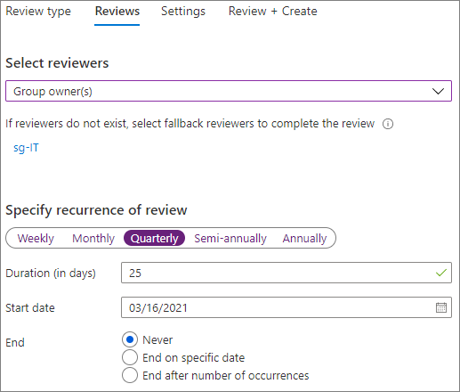

# Erstellen einer sicheren Gastfreigabeumgebung

In diesem Artikel werden verschiedene Optionen zum Erstellen einer sicheren Gastfreigabeumgebung in Microsoft 365 erläutert. Dies ist ein Beispielszenario zur Veranschaulichung der verfügbaren Optionen. Sie können verschiedene Kombinationen dieser Verfahren verwenden, um die Sicherheits- und Compliance-Anforderungen Ihrer Organisation zu erfüllen. Am Ende des Artikels werden Sie durch einen Testfall geführt, um zu sehen, wie einige dieser Optionen interagieren.

Dieses Szenario umfasst:

- Einrichten der mehrstufigen Authentifizierung für Gäste.
- Erstellen von Nutzungsbedingungen für Gäste.
- Einrichten vierteljährlicher Gastzugriff-Überprüfungen, um in regelmäßigen Abständen zu prüfen, ob Gäste weiterhin Berechtigungen für Teams und Websites benötigen.
- Beschränken des Gastzugriffs auf reinen Webzugriff für nicht verwaltete Geräte.
- Konfigurieren einer Richtlinie für Sitzungstimeouts, um sicherzustellen, dass Gäste sich täglich authentifizieren.
- Erstellen und Veröffentlichen von Vertraulichkeitsbezeichnungen zum Klassifizieren von Inhalten.
- Erstellen eines sensiblen Informationstyps für ein streng vertrauliches Projekt.
- Automatische Zuweisung eines *streng vertraulich*en Etiketts an Dokumente, die den Typ sensibler Informationen enthalten.
- Automatisches Entfernen des Gastzugriffs von Dateien, die als *streng vertraulich* gekennzeichnet sind.

Einige der in diesem Artikel beschriebenen Optionen setzen voraus, dass Gäste über ein Konto in Azure Active Directory verfügen. Verwenden Sie die [SharePoint- und OneDrive-Integration in Azure AD B2B (Vorschau)](https://docs.microsoft.com/sharepoint/sharepoint-azureb2b-integration-preview), um sicherzustellen, dass Gäste in das Verzeichnis einbezogen werden, wenn Sie Dateien und Ordner für sie freigeben.

Bitte beachten Sie, dass in diesem Artikel die Aktivierung von Gastfreigabeeinstellungen nicht behandelt wird. Details zum Aktivieren der Gastfreigabe für unterschiedliche Szenarien finden Sie unter [Zusammenarbeit mit Personen außerhalb Ihrer Organisation](https://docs.microsoft.com/Office365/Enterprise/collaborate-with-people-outside-your-organization).

## Einrichten der mehrstufigen Authentifizierung für Gäste

Die mehrstufige Authentifizierung verringert die Wahrscheinlichkeit, dass ein Konto kompromittiert wird, erheblich. Da Gastbenutzer möglicherweise private E-Mail-Konten verwenden, die keiner Governance-Richtlinie oder bewährten Methoden entsprechen, ist es besonders wichtig, dass für Gäste die mehrstufige Authentifizierung vorgesehen ist. Sollten der Benutzername und das Kennwort eines Gastbenutzers gestohlen werden, verringert ein zweiter Authentifizierungsschritt die Wahrscheinlichkeit, dass unbekannte Parteien Zugriff auf Ihre Websites und Dateien erhalten, erheblich.

In diesem Beispiel wird die mehrstufige Authentifizierung für Gäste mithilfe einer Richtlinie für bedingten Zugriff in Azure Active Directory eingerichtet.

So richten Sie die mehrstufige Authentifizierung für Gäste ein
1. Suchen Sie in Microsoft Azure nach *Bedingter Zugriff*.
2. Klicken Sie auf dem Blatt **Bedingter Zugriff – Richtlinien** auf **Neue Richtlinie**.
3. Geben Sie im Feld **Name** den Namen *Gast-MFA* ein.
4. Klicken Sie unter **Zuweisungen** auf **Benutzer und Gruppen**.
5. Wählen Sie auf dem Blatt **Benutzer und Gruppen** die Option **Benutzer und Gruppen auswählen** aus, aktivieren Sie das Kontrollkästchen **Alle Gäste und externen Benutzer**, und klicken Sie dann auf **Fertig**.
4. Klicken Sie unter **Zugriffssteuerung** auf **Gewähren**.
5. Aktivieren Sie auf dem Blatt **Gewähren** das Kontrollkästchen **Mehrstufige Authentifizierung erforderlich**, und klicken Sie dann auf **Auswählen**.
6. Klicken Sie auf dem Blatt **Neu** unter **Richtlinie aktivieren** auf **Ein**, und klicken Sie dann auf **Erstellen**.

Nun müssen sich Gäste über die mehrstufige Authentifizierung anmelden, bevor sie auf freigegebene Inhalte, Websites oder Teams zugreifen können.

### Weitere Informationen

[Planen einer cloudbasierten Bereitstellung der mehrstufigen Azure-Authentifizierung](https://docs.microsoft.com/azure/active-directory/authentication/howto-mfa-getstarted).

## Erstellen von Nutzungsbedingungen für Gäste

In vielen Fällen könnten Gastbenutzer keine Geheimhaltungsvereinbarung oder andere rechtliche Vereinbarungen mit Ihrer Organisation unterzeichnet haben. Sie können festlegen, dass Gäste Ihren Nutzungsbedingungen zustimmen müssen, bevor sie auf für sie freigegebene Dateien zugreifen können. Diese Nutzungsbedingungen können angezeigt werden, wenn ein Gast zum ersten Mal versucht, auf eine freigegebene Datei oder Website zuzugreifen.

Wenn Sie Nutzungsbedingungen erstellen möchten, müssen Sie das entsprechende Dokument zuerst in Word oder einem anderen Dokumenterstellungsprogramm erstellen, und es dann als PDF-Datei speichern. Diese Datei kann dann in Azure AD hochgeladen werden.

So richten Sie Azure AD-Nutzungsbedingungen ein
1. Melden Sie sich bei Azure als globaler Administrator, Sicherheitsadministrator oder Administrator für bedingten Zugriff an.
2. Navigieren Sie zu [Nutzungsbedingungen](https://aka.ms/catou).
3. Klicken Sie auf **Neue Bedingungen**. 
   
4. Geben Sie in die Felder **Name** und **Anzeigenname** die Bezeichnung *Gast-Nutzungsbedingungen* ein.
6. Navigieren Sie für das **Dokument mit Nutzungsbedingungen** zu der PDF-Datei, die Sie zuvor erstellt haben, und wählen Sie sie aus.
7. Wählen Sie die Sprache für Ihr Dokument mit Nutzungsbedingungen aus.
8. Wählen Sie für **Benutzer müssen die Nutzungsbedingungen erweitern** die Option **Ein** aus.
9. Wählen Sie unter **Bedingter Zugriff** in der Liste **Mit Richtlinienvorlage für bedingten Zugriff erzwingen** die Option **Richtlinie für bedingten Zugriff später erstellen** aus.
10. Klicken Sie auf **Erstellen**.

Nachdem Sie die Nutzungsbedingungen erstellt haben, besteht der nächste Schritt darin, eine Richtlinie für den bedingten Zugriff zu erstellen, welche Gastbenutzern diese Nutzungsbedingungen anzeigt.

So erstellen Sie eine Richtlinie für bedingten Zugriff
1. Suchen Sie in Microsoft Azure nach *Bedingter Zugriff*.
2. Klicken Sie auf dem Blatt **Bedingter Zugriff – Richtlinien** auf **Neue Richtlinie**.
3. Geben Sie im Feld **Name** die Bezeichnung *Richtlinie für Gastbenutzer-Nutzungsbedingungen* ein.
4. Klicken Sie unter **Zuweisungen** auf **Benutzer und Gruppen**.
5. Wählen Sie auf dem Blatt **Benutzer und Gruppen** die Option **Benutzer und Gruppen auswählen** aus, aktivieren Sie das Kontrollkästchen **Alle Gäste und externen Benutzer**, und klicken Sie dann auf **Fertig**.
6. Klicken Sie unter **Zuweisungen** auf **Cloud-Apps oder -Aktionen**.
7. Wählen Sie auf der Registerkarte **Einschließen** die Option **Apps auswählen** aus, und klicken Sie dann auf **Auswählen**.
8. Wählen Sie auf dem Blatt **Auswählen** die Optionen **Microsoft Teams**, **Office 365 SharePoint Online** sowie **Outlook-Gruppen** aus, und klicken Sie dann auf **Auswählen**.
9. Klicken Sie auf dem Blatt **Cloud-Apps oder -Aktionen** auf **Fertig**.
10. Klicken Sie unter **Zugriffssteuerung** auf **Gewähren**.
11. Wählen Sie auf dem Blatt **Gewähren** die Option **Gast-Nutzungsbedingungen** aus, und klicken Sie dann auf **Auswählen**.
12. Klicken Sie auf dem Blatt **Neu** unter **Richtlinie aktivieren** auf **Ein**, und klicken Sie dann auf **Erstellen**.

Wenn Gastbenutzer nun das erste Mal versuchen, auf Inhalte, ein Team oder eine Website in Ihrer Organisation zuzugreifen, müssen sie zunächst den Nutzungsbedingungen zustimmen.

### Weitere Informationen
[Azure Active Directory Nutzungsbedingungen](https://docs.microsoft.com/azure/active-directory/conditional-access/terms-of-use)

## Einrichten von Gastzugriff-Überprüfungen

Mithilfe der Zugriffsüberprüfung in Azure AD können Sie eine regelmäßige Überprüfung des Benutzerzugriffs auf verschiedene Teams und Gruppen automatisieren. Durch das Festlegen einer Zugriffsüberprüfung speziell für Gäste können Sie sicherstellen, dass Gastbenutzer nicht länger als erforderlich auf vertrauliche Informationen Ihrer Organisation zugreifen können.

Zugriffsüberprüfungen lassen sich in Programmen organisieren. Ein Programm besteht aus einer Gruppe ähnlicher Zugriffsüberprüfungen und kann verwendet werden, um Zugriffsüberprüfungen für Berichts- und Überwachungszwecke zu organisieren.

In diesem Beispiel wird ein Programm für Gastzugriff-Überprüfungen erstellt.

So erstellen Sie ein Programm
1. Melden Sie sich beim Azure-Portal an, und öffnen Sie die Seite [Identity Governance](https://portal.azure.com/#blade/Microsoft_AAD_ERM/DashboardBlade).
2. Klicken Sie im linken Menü auf **Programme**.
3. Klicken Sie auf **Neues Programm**.
4. Geben Sie im Feld **Name** die Bezeichnung *Gastzugriff-Überprüfungsprogramm* ein.
5. Geben Sie im Feld **Beschreibung** folgenden Text ein: *Programm für Gastzugriff-Überprüfungen*.
6. Klicken Sie auf **Erstellen**.

Nach der Erstellung des Programms können wir eine Gastzugriff-Überprüfung erstellen und diese dem Programm zuordnen.

So richten Sie eine Gastzugriff-Überprüfung ein
1. Klicken Sie auf der Seite [Identity Governance](https://portal.azure.com/#blade/Microsoft_AAD_ERM/DashboardBlade) im linken Menü auf **Zugriffsüberprüfungen**.
2. Klicken Sie auf **Neue Zugriffsüberprüfung**. 
   
3. Geben Sie im Feld **Name** die Bezeichnung *Vierteljährliche Gastzugriff-Überprüfung* ein.
4. Wählen Sie bei **Häufigkeit** die Option **Vierteljährlich** aus.
5. Wählen Sie bei **Ende** die Option **Nie** aus.
6. Wählen Sie bei **Umfang** die Option **Nur Gastbenutzer**.
7. Klicken Sie auf **Gruppe**, wählen Sie die Gruppen aus, die Sie in die Zugriffsüberprüfung einbeziehen möchten, und klicken Sie dann auf **Auswählen**.
8. Klicken Sie unter **Programme** auf **Mit Programm verknüpfen**.
9. Wählen Sie auf dem Blatt **Programm auswählen** die Option **Gastzugriff-Überprüfungsprogramm aus**.
10. Klicken Sie auf **Start**.

Für jede von Ihnen festgelegte Gruppe wird eine separate Zugriffsüberprüfung erstellt. Die Gruppenbesitzer der einzelnen Gruppen erhalten vierteljährlich eine E-Mail, um den Gastzugriff auf Ihre Gruppe zu genehmigen oder zu verweigern.

Es ist wichtig zu beachten, dass Gäste Zugang zu Teams, Gruppen oder einzelnen Dateien und Ordnern gewährt werden kann. Wenn sie Zugriff auf Dateien und Ordner erhalten, müssen Gäste keiner bestimmten Gruppe hinzugefügt werden. Wenn Sie Zugriffsüberprüfungen für Gastbenutzer durchführen möchten, die weder einem Team noch einer Gruppe angehören, können Sie in Azure AD eine dynamische Gruppe erstellen, die alle Gäste umfasst, und anschließend eine Zugriffsüberprüfung für diese Gruppe erstellen.

### Weitere Informationen
[Verwalten des Gastzugriffs mit Azure AD-Zugriffsüberprüfungen](https://docs.microsoft.com/azure/active-directory/governance/manage-guest-access-with-access-reviews)

[Erstellen einer Zugriffsüberprüfung von Gruppen oder Anwendungen in Azure AD-Zugriffsüberprüfungen](https://docs.microsoft.com/azure/active-directory/governance/create-access-review)

## Einrichten des rein webbasierten Zugriffs für Gastbenutzer

Sie können potenzielle Angriffsflächen verringern und die Verwaltung vereinfachen, indem Sie festlegen, dass Gastbenutzer nur über einen Webbrowser auf Ihre Teams, Websites und Dateien zugreifen können. Dies geschieht über eine Azure AD-Richtlinie für bedingten Zugriff.

So beschränken Sie den Gastzugriff auf reinen Webzugriff
1. Suchen Sie in Microsoft Azure nach *Bedingter Zugriff*.
2. Klicken Sie auf dem Blatt **Bedingter Zugriff – Richtlinien** auf **Neue Richtlinie**.
3. Geben Sie im Feld **Name** die Bezeichnung *Gastbenutzer-Browserzugriff* ein.
4. Klicken Sie unter **Zuweisungen** auf **Benutzer und Gruppen**.
5. Wählen Sie auf dem Blatt **Benutzer und Gruppen** die Option **Benutzer und Gruppen auswählen** aus, aktivieren Sie das Kontrollkästchen **Alle Gäste und externen Benutzer**, und klicken Sie dann auf **Fertig**.
6. Klicken Sie unter **Zuweisungen** auf **Cloud-Apps oder -Aktionen**.
7. Wählen Sie auf der Registerkarte **Einschließen** die Option **Apps auswählen** aus, und klicken Sie dann auf **Auswählen**.
8. Wählen Sie auf dem Blatt **Auswählen** die Optionen **Microsoft Teams**, **Office 365 SharePoint Online** sowie **Outlook-Gruppen** aus, und klicken Sie dann auf **Auswählen**.
9. Klicken Sie auf dem Blatt **Cloud-Apps oder -Aktionen** auf **Fertig**.
10. Klicken Sie unter **Zuweisungen** auf **Bedingungen**.
11. Klicken Sie auf dem Blatt **Bedingungen** auf **Client-Apps**.
12. Klicken Sie auf dem Blatt **Client-Apps** auf **Ja** bei **Konfigurieren**, und wählen Sie dann die Einstellungen **Mobile Apps und Desktopclients** und **Moderne Authentifizierungsclients** aus. 
    
13. Klicken Sie auf **Fertig** und anschließend auf dem Blatt **Bedingungen** erneut auf **Fertig**.
14. Klicken Sie unter **Zugriffssteuerung** auf **Gewähren**.
15. Wählen Sie auf dem Blatt **Gewähren** die Optionen **Markierung des Geräts als konform erforderlich** und **In Azure AD Hybrid eingebundenes Gerät erforderlich**.
16. Wählen Sie unter **Für mehrere Steuerelemente** die Option **Eines der ausgewählten Steuerelemente erforderlich**, und klicken Sie dann auf **Auswählen**.
17. Klicken Sie auf dem Blatt **Neu** unter **Richtlinie aktivieren** auf **Ein**, und klicken Sie dann auf **Erstellen**.

## Konfigurieren eines Sitzungstimeouts für Gastbenutzer

Die Bedingung der regelmäßigen Authentifizierung von Gästen kann die Wahrscheinlichkeit verringern, dass unbekannte Benutzer auf die Inhalte Ihrer Organisation zugreifen können, wenn das Gerät eines Gastbenutzers nicht sicher verwahrt wird oder geschützt ist. Sie können eine Richtlinie für bedingten Zugriff und Sitzungstimeouts für Gastbenutzer in Azure AD konfigurieren.

So konfigurieren Sie eine Sitzungstimeout-Richtlinie für Gäste
1. Suchen Sie in Microsoft Azure nach *Bedingter Zugriff*.
2. Klicken Sie auf dem Blatt **Bedingter Zugriff – Richtlinien** auf **Neue Richtlinie**.
3. Geben Sie im Feld **Name** die Bezeichnung *Gast-Sitzungstimeout* ein.
4. Klicken Sie unter **Zuweisungen** auf **Benutzer und Gruppen**.
5. Wählen Sie auf dem Blatt **Benutzer und Gruppen** die Option **Benutzer und Gruppen auswählen** aus, aktivieren Sie das Kontrollkästchen **Alle Gäste und externen Benutzer**, und klicken Sie dann auf **Fertig**.
6. Klicken Sie unter **Zuweisungen** auf **Cloud-Apps oder -Aktionen**.
7. Wählen Sie auf der Registerkarte **Einschließen** die Option **Apps auswählen** aus, und klicken Sie dann auf **Auswählen**.
8. Wählen Sie auf dem Blatt **Auswählen** die Optionen **Microsoft Teams**, **Office 365 SharePoint Online** sowie **Outlook-Gruppen** aus, und klicken Sie dann auf **Auswählen**.
9. Klicken Sie auf dem Blatt **Cloud-Apps oder -Aktionen** auf **Fertig**.
10. Klicken Sie unter **Zugriffssteuerung** auf **Sitzung**.
11. Wählen Sie auf dem Blatt **Sitzung** die Option **Anmeldehäufigkeit** aus.
12. Wählen Sie **1** und **Tage** für den Zeitraum aus, und klicken Sie dann auf **Auswählen**.
13. Klicken Sie auf dem Blatt **Neu** unter **Richtlinie aktivieren** auf **Ein**, und klicken Sie dann auf **Erstellen**.

## Erstellen von Vertraulichkeitsbezeichnungen

Vertraulichkeitsbezeichnungen können auf verschiedene Arten verwendet werden, um die Informationen Ihrer Organisation zu klassifizieren und zu schützen. In diesem Beispiel sehen wir uns an, wie Bezeichnungen dabei helfen können, den Gastzugriff auf freigegebene Dateien und Ordner zu verwalten.

Zunächst erstellen wir drei Vertraulichkeitsbezeichnungen im Microsoft 365 Compliance Center:

- Allgemein
- vertraulich
- Streng vertraulich

Verwenden Sie das folgende Verfahren zum Erstellen der *Allgemeinen* und *sensiblen* Etiketten.

So erstellen Sie ein Klassifizierungsetikett (allgemein und sensibel)
1. Erweitern Sie im [Microsoft 365 Compliance Center](https://compliance.microsoft.com) im linken Navigationsbereich den Eintrag **Klassifizierung**, und klicken Sie dann auf **Vertraulichkeitsbezeichnungen**.
2. Klicken Sie auf **Bezeichnung erstellen**.
3. Geben Sie unter **Name des Etiketts**, *Allgemein* oder *vertraulich* ein.
4. Geben Sie in **QuickInfo** *allgemeine Informationen ein, die für Mitarbeiter, Gäste und Partner freigegeben werden können,* oder *vertrauliche Informationen. Geben Sie die Informationen nur für Mitarbeiter und autorisierte Gäste frei*, und klicken Sie dann auf **Weiter**.
5. Lassen Sie die Verschlüsselung auf **Aus** festgelegt und klicken Sie auf **Weiter**.
6. Lassen Sie die Inhaltskennzeichnung auf **Aus** festgelegt und klicken Sie auf **Weiter**.
7. Lassen Sie "Verhinderung von Datenverlust am Endpunkt" auf **Aus** festgelegt und klicken Sie auf **Weiter**.
8. Lassen Sie die automatische Bezeichnung auf **Aus** festgelegt und klicken Sie auf **Weiter**.
9. Klicken Sie auf **Erstellen**.

Bei dem Etikett *Streng vertraulich* versehen wir die Dokumente automatisch mit einem Wasserzeichen.

So erstellen Sie ein Klassifizierungsetikett („Streng vertraulich“)
1. Klicken Sie auf **Bezeichnung erstellen**.
2. Geben Sie in **Etikettenname** *Streng vertraulich* ein.
3. Geben Sie in **QuickInfo** *Streng vertrauliche Informationen ein. Geben Sie sie nicht für Gäste frei*, und klicken Sie anschließend auf **Weiter**.
4. Lassen Sie die Verschlüsselung auf **Aus** festgelegt und klicken Sie auf **Weiter**.
5. Setzen Sie die Inhaltskennzeichnung auf **Ein**, aktivieren Sie das Kontrollkästchen **Kopfzeile hinzufügen**, und klicken Sie dann auf **Text anpassen**.
6. Geben Sie als Kopfzeilentext *Streng vertraulich* ein, und klicken Sie dann auf **Speichern**.
7. Setzen Sie auf der Seite **Inhaltskennzeichnung** die entsprechende Option auf **Ein**.
8. Aktivieren Sie das Kontrollkästchen **Wasserzeichen hinzufügen**, und klicken Sie dann auf **Text anpassen**.
9. Geben Sie als **Wasserzeichentext** *Streng vertraulich* ein.
10. Geben Sie *24* als **Schriftgrad** ein, und klicken Sie dann auf **Speichern**.
11. Klicken Sie auf der Seite **Inhaltskennzeichnung** auf **Weiter**.
12. Lassen Sie "Verhinderung von Datenverlust am Endpunkt" auf **Aus** festgelegt und klicken Sie auf **Weiter**.
13. Lassen Sie die automatische Bezeichnung auf **Aus** festgelegt und klicken Sie auf **Weiter**.
14. Klicken Sie auf **Erstellen**.

Wenn die Bezeichnungen erstellt sind, besteht der nächste Schritt darin, diese zu veröffentlichen. 

So veröffentlichen Sie Bezeichnungen
1. Klicken Sie auf der Seite **Vertraulichkeitsbezeichnungen** auf **Bezeichnungen veröffentlichen**.
2. Klicken Sie auf **Zu veröffentlichende Bezeichnungen wählen**.
3. Klicken Sie auf **Hinzufügen**, wählen Sie die von Ihnen erstellten Bezeichnungen aus, und klicken Sie dann auf **Hinzufügen**.
4. Klicken Sie auf **Fertig**.
5. Klicken Sie auf **Weiter**.
6. Lassen Sie die Benutzer und Gruppen auf **Alle** festgelegt, und klicken Sie auf **Weiter**.
7. Wählen Sie in der Liste **Diese Bezeichnung standardmäßig auf Dokumente und E-Mails anwenden** die Option **Allgemein**, und klicken Sie dann auf **Weiter**.
8. Geben Sie auf der Seite **Richtlinieneinstellungen** als Namen *Vertraulichkeitsgrad von Dokumenten* ein, und klicken Sie dann auf **Weiter**.
9. Klicken Sie auf **Veröffentlichen**.

Sobald sie veröffentlicht sind, stehen die Bezeichnungen Benutzern von Office Desktop-Apps zur Verfügung. Wenn Benutzer die Bezeichnung **Streng vertraulich** anwenden, wird dem entsprechenden Dokument automatisch ein Wasserzeichen hinzugefügt.

### Weitere Informationen
[Übersicht über Vertraulichkeitsbezeichnungen](https://docs.microsoft.com/Office365/SecurityCompliance/sensitivity-labels)

## Erstellen Sie einen Typ sensibler Informationen für ein streng vertrauliches Projekt

Vertrauliche Informationstypen sind vordefinierte Zeichenfolgen, die in Richtlinienworkflows verwendet werden können, um Compliance-Anforderungen durchzusetzen. Das Microsoft 365 Compliance Center bietet über 100 vertrauliche Informationstypen, darunter Führerscheinnummern, Kreditkartennummern, Bankkontonummern usw.

Sie können benutzerdefinierte vertrauliche Informationstypen erstellen, um für Ihre Organisation spezifische Inhalte zu verwalten. Im folgenden Beispiel erstellen wir einen vertraulichen Informationstyp für ein streng vertrauliches Projekt. Diesen vertraulichen Informationstyp können wir dann verwenden, um automatisch eine Klassifizierungsbezeichnung anzuwenden.

So erstellen Sie einen vertraulichen Informationstyp
1. Erweitern Sie im [Microsoft 365 Compliance Center](https://compliance.microsoft.com) im linken Navigationsbereich den Eintrag **Klassifizierung**, und klicken Sie dann auf **Vertrauliche Informationstypen**.
2. Klicken Sie auf **Erstellen**.
3. Geben Sie unter **Name** und **Beschreibung** den Projektnamen **Projekt Saturn** ein, und klicken Sie auf**Weiter**.
4. Klicken Sie auf **Element hinzufügen**.
5. Wählen Sie in der Liste **Inhalt erkennen, der Folgendes enthält** die Option **Schlüsselwörter** aus, und geben Sie in das Schlüsselwortfeld *Projekt Saturn* ein.
6. Klicken Sie auf **Weiter**, und klicken Sie dann auf **Fertig stellen**.
7. Klicken Sie bei der Frage, ob Sie den vertraulichen Informationstyp testen möchten, auf **Nein**.

### Weitere Informationen
[Benutzerdefinierte vertrauliche Informationstypen](https://docs.microsoft.com/Office365/SecurityCompliance/custom-sensitive-info-types)

## Erstellen einer Richtlinie zum Zuweisen einer Bezeichnung auf der Grundlage eines vertraulichen Informationstyps

Sobald der vertrauliche Informationstyp erstellt ist, können wir in Microsoft Cloud App Security eine Dateirichtlinie erstellen, um Dokumente, welche die *Projekt Saturn*-Zeichenfolge enthalten, automatisch mit dem Etikett *Streng vertraulich* zu versehen.

> [!NOTE]
> Dank eines Replikationsvorgangs sind Vertraulichkeitsbezeichnungen in Cloud App Security verfügbar. Die gewünschte Bezeichnung für eine Richtlinie wird möglicherweise nicht sofort angezeigt.

So erstellen Sie eine Dateirichtlinie auf der Grundlage eines vertraulichen Informationstyps
1. Öffnen Sie [Microsoft Cloud App Security](https://portal.cloudappsecurity.com).
2. Erweitern Sie im linken Navigationsbereich die Option **Steuerung**, und klicken Sie dann auf **Richtlinien**.
3. Klicken Sie auf **Richtlinie erstellen**, und wählen Sie dann **Dateirichtlinie** aus.
4. Geben Sie unter **Richtlinienname** den Namen *Projekt Saturn-Bezeichnung* ein.
5. Klicken Sie unter **Filter erstellen für Dateien, auf die diese Richtlinie angewendet wird** zweimal auf "X", um die Standardfilter zu löschen.
7. Wählen Sie in der Liste **Filter auswählen** die Option **App** aus, und wählen Sie dann **Microsoft SharePoint Online** in der Liste **Apps auswählen...**.
8. Wählen Sie unter **Untersuchungsmethode** die Option **Datenklassifizierungsdienst** aus.
9. Wählen Sie aus der Liste **Untersuchungstyp auswählen** die Option **Vertraulicher Informationstyp**.
10. Suchen Sie nach der Vertraulichkeitsbezeichnung *Projekt Saturn*, wählen Sie sie aus, und klicken Sie dann auf **Fertig**. 
   
11. Erweitern Sie unter **Governance** den Eintrag **Microsoft SharePoint Online**.
12. Aktivieren Sie das Kontrollkästchen **Klassifizierungsbezeichnung anwenden**, und wählen Sie die Bezeichnung **Streng vertraulich** aus.
13. Klicken Sie auf **Erstellen**.

Wenn ein Benutzer bei aktivierter Richtlinie "Projekt Saturn" in ein Dokument eingibt, wird Cloud App Security beim Überprüfen dieser Datei automatisch die Bezeichnung *Streng vertraulich* darauf anwenden.

### Weitere Informationen
[Dateirichtlinien](https://docs.microsoft.com/cloud-app-security/data-protection-policies)

## Erstellen einer Richtlinie zum Entfernen des Gastzugriffs auf streng vertrauliche Dateien

In dem Beispiel in diesem Artikel dürfen Dateien mit der Bezeichnung *Streng vertraulich* nicht für Gäste freigegeben werden. Sie können eine Dateirichtlinie in Cloud App Security erstellen, die den Gastzugriff auf Dateien mit dieser Bezeichnung automatisch entfernt.

Beachten Sie, dass dadurch nicht verhindert wird, dass Benutzer diese Dateien mit anderen teilen oder erneut freigeben. Es kommt nach wie vor darauf an, dass Ihre Benutzer Ihre Governance-Richtlinien für Dateien einhalten, die an Orten mit der Möglichkeit der Gastfreigaben gespeichert sind. Allerdings kann dies ein hilfreiches Instrument zum Entfernen des Gastzugriffs auf Dateien darstellen, denen vertrauliche Informationen hinzugefügt wurden, nachdem sie für Gäste freigegeben wurden.

So erstellen Sie eine Dateirichtlinie auf der Grundlage einer Bezeichnung
1. Öffnen Sie [Microsoft Cloud App Security](https://portal.cloudappsecurity.com).
2. Erweitern Sie im linken Navigationsbereich die Option **Steuerung**, und klicken Sie dann auf **Richtlinien**.
3. Klicken Sie auf **Richtlinie erstellen**, und wählen Sie dann **Dateirichtlinie** aus.
4. Geben Sie unter **Richtlinienname** den Namen *Projekt Saturn – Gastzugriff entfernen* ein.
5. Klicken Sie unter **Filter erstellen für Dateien, auf die diese Richtlinie angewendet wird** zweimal auf "X", um die Standardfilter zu löschen.
6. Wählen Sie in der Liste **Filter auswählen** die Option **App** aus, und wählen Sie dann **Microsoft SharePoint Online** in der Liste **Apps auswählen...**.
7. Klicken Sie auf **Filter hinzufügen**.
8. Wählen Sie in der Liste **Filter auswählen** die Option **Klassifizierungsbezeichnung** aus, und wählen Sie dann **Azure Information Protection** aus der Liste **Filter auswählen...**.
9. Wählen Sie in der Liste **Klassifizierungsbezeichnung auswählen** die Option **Streng vertraulich** aus. 
   
10. Erweitern Sie unter **Governance** den Eintrag **Microsoft SharePoint Online**.
11. Aktivieren Sie die Kontrollkästchen **Übersicht der Richtlinienübereinstimmungen an Dateibesitzer senden** und **Externe Benutzer entfernen**.
12. Geben Sie als benutzerdefinierte Benachrichtigung folgenden Text ein: *Diese Datei ist streng vertraulich. Die Unternehmensrichtlinien untersagen deren Freigabe für Gäste.*
13. Klicken Sie auf **Erstellen**.

Beachten Sie, dass mit dieser Richtlinie der Zugriff für Dateien entfernt wird, die über einen *Link für bestimmte Personen* freigegeben wurden. Der Zugriff über Links ohne Authentifizierung (*Jeder*-Links) wird nicht entfernt. Ebenfalls nicht entfernt wird der Zugriff für Gäste, die Mitglieder der Website oder des Teams als Ganzes sind. Wenn Sie vorhaben, auf einer Website oder in einem Team mit Gastmitgliedern streng vertrauliche Dokumente freizugeben, erwägen Sie die Verwendung [privater Kanäle in Microsoft Teams](https://support.office.com/article/60ef929a-4d68-418b-bf4f-5784db184ec9) und den Zugriff auf diese Kanäle nur Mitgliedern Ihrer Organisation zu gestatten.

## Testen der Lösung

Wenn Sie die in diesem Artikel beschriebene Lösung testen möchten, erstellen Sie ein Word-Dokument und speichern Sie es in einer Dokumentbibliothek. Geben Sie die Datei für einen Gastbenutzer frei. Wenn der Gast versucht, auf das Dokument zuzugreifen, sollte er sich zuerst über die mehrstufige Authentifizierung anmelden und die Nutzungsbedingungen akzeptieren müssen.

Sobald der Gast Zugriff auf das Dokument hat, geben Sie *Projekt Saturn* in das Dokument ein und speichern Sie es. Sobald Cloud App Security das Dokument überprüft hat, sollte die Bezeichnung *Streng vertraulich* angewendet werden und der Gastbenutzer nicht mehr darauf zugreifen können.

Sie können die in diesem Artikel beschriebenen Tools in verschiedenen Kombinationen verwenden, um eine produktive und zugleich sichere Gastfreigabeumgebung für Ihre Organisation zu schaffen.

## Weitere Optionen

Es gibt einige zusätzliche Optionen in Microsoft 365 und Azure Active Directory, mit denen Sie Ihre Gastfreigabeumgebung sicherer machen können.

- Sie können eine Liste der zulässigen bzw. blockierten Freigabedomänen erstellen, um zu begrenzen, an wen Benutzer Inhalte freigeben können. Weitere Informationen hierzu finden Sie unter [Einschränken der Freigabe von SharePoint- und OneDrive-Inhalten nach Domänen](https://docs.microsoft.com/sharepoint/restricted-domains-sharing) und [Zulassen oder Blockieren von Einladungen an B2B-Benutzer aus bestimmten Organisationen](https://docs.microsoft.com/azure/active-directory/b2b/allow-deny-list).
- Sie können einschränken, mit welchen anderen Azure Active Directory-Mandanten sich Ihre Benutzer verbinden können. Weitere Informationen finden Sie unter [Verwenden von Mandanteneinschränkungen zur Verwaltung des Zugriffs auf SaaS-Anwendungen](https://docs.microsoft.com/azure/active-directory/manage-apps/tenant-restrictions).
- Sie können eine verwaltete Umgebung erstellen, in der Partner beim Verwalten von Gastkonten helfen können. Informationen hierzu finden Sie unter [Erstellen eines B2B-Extranets mit verwalteten Gästen](https://docs.microsoft.com/Office365/Enterprise/b2b-extranet).

## Siehe auch

[Einschränken des Risikos der versehentlichen Gefährdung von Dateien bei der Freigabe für Gäste](share-limit-accidental-exposure.md)

[Bewährte Methoden zum Freigeben von Dateien und Ordnern für nicht authentifizierte Benutzer](best-practices-anonymous-sharing.md)

[Erstellen eines B2B-Extranets mit verwalteten Gästen](b2b-extranet.md)
