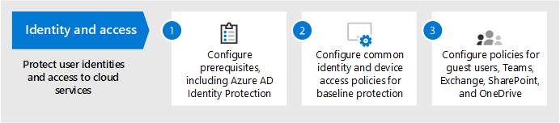
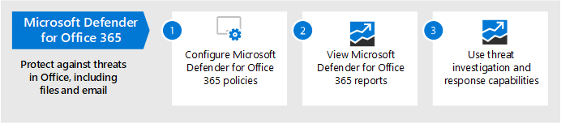

# Konfigurieren von Bedrohungsschutzfunktionen in Microsoft 365

Führen Sie die folgenden Schritte aus, um den Bedrohungsschutz in Microsoft 365 zu konfigurieren.

## Schritt 1: Einrichten von mehrstufiger Authentifizierung und Richtlinien für bedingten Zugriff

[Für die mehrstufige Authentifizierung (Multi-Factor Authentication,](/azure/active-directory/authentication/concept-mfa-howitworks) MFA) müssen Benutzer ihre Identität mit einem Telefonanruf oder einer Authentifizierungs-App überprüfen. [Richtlinien für bedingten](/azure/active-directory/conditional-access/overview) Zugriff definieren bestimmte Anforderungen, die erfüllt sein müssen, damit Benutzer auf Apps und Daten in Microsoft 365 zugreifen können. MFA- und Conditional Access-Richtlinien arbeiten zusammen, um Ihre Organisation zu schützen. Wenn beispielsweise jemand versucht, sich über ein für MFA nicht aktiviertes Konto von einem mobilen Gerät aus zu registrieren, und eine Richtlinie für bedingten Zugriff erfordert, dass MFA wirksam ist, kann sich dieser Benutzer nicht anmelden.  

Microsoft hat einen bestimmten Satz bedingten Zugriffs und zugehörige Richtlinien zum Schutz des Zugriffs auf alle Ihre SaaS-Anwendungen getestet und empfohlen, insbesondere Microsoft 365. Richtlinien werden für grundlegenden, vertraulichen und streng regulierten Schutz empfohlen. Implementieren Sie zunächst die Richtlinien für den Basisschutz. 

 
 [Siehe eine größere Version dieses Bilds](https://github.com/MicrosoftDocs/microsoft-365-docs/raw/public/microsoft-365/media/microsoft-365-policies-configurations/Identity_device_access_policies_byplan.png)

### So implementieren Sie grundlegenden Schutz für Microsoft 365

 

1. [Konfigurieren von Voraussetzungen, einschließlich Azure AD Identity Protection](../security/office-365-security/identity-access-prerequisites.md).
2. [Konfigurieren Sie allgemeine Identitäts- und Gerätezugriffsrichtlinien](../security/office-365-security/identity-access-policies.md) für den Basisschutz.
3. Konfigurieren von Richtlinien [für Gastbenutzer](../security/office-365-security/identity-access-policies-guest-access.md), [Microsoft Teams](../security/office-365-security/teams-access-policies.md), [Exchange Online](../security/office-365-security/secure-email-recommended-policies.md)und [SharePoint Online und OneDrive](../security/office-365-security/sharepoint-file-access-policies.md).

### Weitere Informationen zum Schützen von Identitäten

- [Konfigurationen für den Identitäts- und Gerätezugriff](../security/office-365-security/microsoft-365-policies-configurations.md)
- [Sicherheitsanleitung für Azure MFA](/azure/active-directory/authentication/multi-factor-authentication-security-best-practices)

## Schritt 2: Konfigurieren von Microsoft Defender for Identity

[Microsoft Defender for Identity](/defender-for-identity/what-is) ist eine cloudbasierte Sicherheitslösung, die mit Ihren lokalen Active Directory Domain Services (AD DS)-Signalen arbeitet, um erweiterte Bedrohungen, gefährdete Identitäten und böswillige Insideraktionen zu identifizieren, zu erkennen und zu untersuchen, die auf Ihre Organisation gerichtet sind.

Microsoft Defender for Identity ermöglicht SecOps(Security Operations) Analysten und Sicherheitsexperten, die fortgeschrittene Angriffe in Hybridumgebungen erkennen müssen, um:
- Überwachen Sie Benutzer, Entitätsverhalten und Aktivitäten mit lernbasierten Analysen.
- Schützt Benutzeridentitäten und Anmeldeinformationen, die in Active Directory gespeichert sind.
- Identifizieren und untersuchen Sie verdächtige Benutzeraktivitäten und fortgeschrittene Angriffe in der gesamten Abwehrkette.
- Bereitstellen klarer Vorfallinformationen auf einer einfachen Zeitachse für eine schnelle Sichtung.

### So richten Sie Microsoft Defender for Identity ein

 

1. [Richten Sie Microsoft Defender for Identity zum](/azure-advanced-threat-protection/install-atp-step1) Schutz Ihrer primären Umgebungen ein.
2. Schützen Sie alle [Domänencontroller und](/azure-advanced-threat-protection/atp-sensor-monitoring) [Gesamtstrukturen.](/azure-advanced-threat-protection/atp-multi-forest)
3. Integrieren [Sie Microsoft Defender for Identity-Warnungen](/azure-advanced-threat-protection/suspicious-activity-guide?tabs=external) in Ihren Security Operations (SecOps)-Workflow.

### Weitere Informationen zu Microsoft Defender for Identity

- [Was ist Microsoft Defender for Identity?](/azure-advanced-threat-protection/what-is-atp)
- [Video: Einführung in Microsoft Defender for Identity](https://www.youtube.com/watch?reload=9&v=EGY2m8yU_KE)
- [Bereitstellung von Microsoft Defender for Identity](/azure-advanced-threat-protection/what-is-atp#whats-next)

## Schritt 3: Aktivieren von Microsoft 365 Defender

[Microsoft 365 Defender](../security/defender/microsoft-365-defender.md) kombiniert Signale und orchestriert Funktionen in einer einzigen Lösung. Mit der integrierten Microsoft 365 Defender-Lösung können Sicherheitsexperten die Bedrohungssignale, die jedes dieser Produkte erhält, zusammenbringen und den vollständigen Umfang und die Auswirkungen der Bedrohung bestimmen. Wie sie in die Umgebung eintrat, welche Auswirkungen sie hat und wie sie sich derzeit auf die Organisation auswirken. Microsoft 365 Defender ergreift automatische Maßnahmen, um den Angriff zu verhindern oder zu beenden und betroffene Postfächer, Endpunkte und Benutzeridentitäten selbst zu beenden.

Microsoft 365 Defender vereint Warnungen, Vorfälle, automatisierte Untersuchung und Reaktion sowie erweiterte Suche über Arbeitslasten hinweg (Microsoft Defender for Identity, Microsoft Defender für Office 365, Microsoft Defender for Endpoint und Microsoft Cloud App Security) in einem einzigen Bereich mit glasbasierter Erfahrung. Neue Features werden ständig zu Microsoft 365 Defender hinzugefügt. Erwägen Sie, sich für den Erhalt von Vorschaufeatures zu entscheiden.

### So richten Sie Microsoft 365 Defender ein

 

1. [Überprüfen Sie die Voraussetzungen](../security/defender/prerequisites.md).
2. [Aktivieren Sie Microsoft 365 Defender](../security/defender/m365d-enable.md).
3. [Melden Sie sich für Vorschaufeatures an.](../security/defender/preview.md)

### Weitere Informationen zu Microsoft 365 Defender

- [Was ist Microsoft 365 Defender?](../security/defender/microsoft-365-defender.md)
- [Neuerungen in Microsoft 365 Defender](../security/defender/whats-new.md)

## Schritt 4: Konfigurieren von Microsoft Defender für Office 365

[Microsoft Defender for Office 365](../security/office-365-security/defender-for-office-365.md) schützt Ihre Organisation vor böswilligen Bedrohungen in E-Mail-Nachrichten (Anlagen und URLs), Office-Dokumenten und Tools für die Zusammenarbeit. In der folgenden Tabelle sind die Features und Funktionen von Microsoft Defender für Office 365 aufgeführt, die in Microsoft 365 E5 enthalten sind:

|Konfigurations-, Schutz- und Erkennungsfunktionen|Automatisierungs-, Untersuchungs-, Wartungs- und Bildungsfunktionen|
|---|---|
|[Sichere Anlagen](../security/office-365-security/safe-attachments.md) [Sichere Links](../security/office-365-security/safe-links.md) [Sichere Dokumente](../security/office-365-security/safe-docs.md) [ATP für SharePoint, OneDrive und Microsoft Teams](../security/office-365-security/mdo-for-spo-odb-and-teams.md) [Anti-Phishing in Defender für Office 365-Schutz](../security/office-365-security/set-up-anti-phishing-policies.md#Exclusive-settings-in-anti-phishing-policies-in Microsoft-Defender-for-Office-365)|[Bedrohungs-Tracker](../security/office-365-security/threat-trackers.md) [Sicherheitsrisiken-Explorer](../security/office-365-security/threat-explorer.md) [Automatische Untersuchung und Reaktion](../security/office-365-security/office-365-air.md) [Angriffssimulator](../security/office-365-security/attack-simulator.md)|
|

Mit Microsoft Defender für Office 365 können Personen in Ihrer Organisation sicherer kommunizieren und zusammenarbeiten, mit Bedrohungsschutz für ihre E-Mail-Inhalte und Office-Dokumente.

### So richten Sie Microsoft Defender für Office 365 ein

 

1. [Richten Sie Ihre Microsoft Defender for Office 365-Richtlinien ein](../security/office-365-security/protect-against-threats.md)und konfigurieren Sie sie.
2. [Anzeigen und Verwenden Ihrer Microsoft Defender for Office 365-Berichte](../security/office-365-security/view-reports-for-mdo.md).
3. [Verwenden sie Die Untersuchungs- und Reaktionsfunktionen für Bedrohungen.](../security/office-365-security/office-365-ti.md)

### Weitere Informationen zu Microsoft Defender für Office 365

- [Übersicht über Microsoft Defender for Office 365](../security/office-365-security/defender-for-office-365.md)
- [Neues in Microsoft Defender für Office 365](../security/office-365-security/whats-new-in-defender-for-office-365.md)

## Schritt 5: Konfigurieren von Microsoft Defender for Endpoint

[Microsoft Defender for Endpoint](/windows/security/threat-protection) schützt Geräte Ihrer Organisation (auch als Endpunkte bezeichnet) vor Cyberangriffen, erweiterten Angriffen und Datenschutzverletzungen. Sicherheitsteams können die Sicherheit ihrer Endpunkte effizienter verwalten. Robuste Tools unterstützen Organisationen dabei, mit nicht gepatchten Systemen mit der Erkennung von Sicherheitslücken mit [der Bedrohungs- und Sicherheitsrisikoverwaltung mithalten zu können.](/windows/security/threat-protection/microsoft-defender-atp/next-gen-threat-and-vuln-mgt) Automatisierte Erkennungs- und Behebungsfunktionen, z. B. Reduzierung der Angriffsfläche, Schutz der nächsten [Generation,](/windows/security/threat-protection/windows-defender-antivirus/windows-defender-antivirus-in-windows-10)Endpunkterkennung und [-reaktion](/windows/security/threat-protection/microsoft-defender-atp/overview-endpoint-detection-response)sowie automatisierte Untersuchung und Behebung, helfen Ihnen, Ihre Geräte vor Schadsoftware zu schützen.   Zusätzlich zu diesen Funktionen können Kunden proaktive Benachrichtigungen erhalten und microsoft Threat Experts bei Bedarf im Rahmen des opt-in Managed Hunting Service konsultieren. 

### Einrichten von Microsoft Defender for Endpoint

 

1. [Bereiten Sie Ihre Umgebung für die Bereitstellung von Microsoft Defender for Endpoint vor.](/windows/security/threat-protection/microsoft-defender-atp/deployment-phases)
2. [Richten Sie Ihre Microsoft Defender for Endpoint-Bereitstellung ein.](/windows/security/threat-protection/micros.oft-defender-atp/production-deployment)
3. [Onboarding für den Microsoft Defender for Endpoint-Dienst](/windows/security/threat-protection/microsoft-defender-atp/onboarding).
4. [Führen Sie Ihre obersten Sicherheitsverwaltungsaufgaben aus.](/windows/security/threat-protection/microsoft-defender-atp/tvm-security-recommendation)

### Weitere Informationen zu Microsoft Defender for Endpoint

- [Erfahren Sie mehr über Microsoft Defender for Endpoint](/windows/security/threat-protection).
- [Testen Sie das Microsoft Defender for Endpoint-Evaluierungslabor.](/windows/security/threat-protection/microsoft-defender-atp/evaluation-lab)

## Schritt 6: Konfigurieren von Microsoft Cloud App Security

[Microsoft Cloud App Security ist](/cloud-app-security) ein Cloud Access Security Broker, der Protokollsammlung, API-Connectors und Reverseproxy unterstützt. Microsoft Cloud App Security bietet umfassende Sichtbarkeit, Kontrolle über Datenreise und ausgefeilte Analysen, um Cyberangriffe in allen Clouddiensten zu identifizieren und zu bekämpfen. Mit Microsoft Cloud App Security können Ihre Sicherheitsvorgänge die vertraulichen Informationen Ihrer Organisation schützen, vor Cyberangriffen und Anomalien schützen, Apps ermitteln und überwachen, die auf die Daten Ihrer Organisation zugreifen, und sicherstellen, dass die Cloud-Apps Ihrer Organisation die Complianceanforderungen erfüllen.

### Einrichten von Microsoft Cloud App Security

 

1. [Richten Sie das Portal und andere grundlegende Anforderungen ein.](/cloud-app-security/general-setup)
2. [Einrichten der Clouderkennung und](/cloud-app-security/set-up-cloud-discovery) Verbinden [von Apps](/cloud-app-security/enable-instant-visibility-protection-and-governance-actions-for-your-apps).
3. [Bereitstellen der App-Steuerung für bedingten Zugriff für ausgewählte Apps](/cloud-app-security/proxy-deployment-aad).
4. [Verwenden Sie die Untersuchungstools und Dashboards](/cloud-app-security/investigate).

### Weitere Informationen zu Microsoft Cloud App Security

- [Überprüfen Sie neue Features und Funktionen.](/cloud-app-security/release-notes)
- [Erfahren Sie mehr über Microsoft Cloud App Security](/cloud-app-security/what-is-cloud-app-security).

## Schritt 7: Überwachen des Status und Ergreifen von Aktionen

Nachdem Sie Ihre Bedrohungsschutzdienste und -funktionen eingerichtet und bereitgestellt haben, besteht Der nächste Schritt in der Überwachung von Bedrohungserkennungen und dem Ergreifen geeigneter Maßnahmen. Der beste Ausgangspunkt ist das Microsoft 365 Security Center ( ), in dem Sie die Sicherheit über Ihre Microsoft-Identitäten, Daten, Geräte, Apps und Infrastruktur hinweg überwachen und [https://security.microsoft.com](https://security.microsoft.com) verwalten können. 

Das Microsoft 365 Security Center richtet sich an Sicherheitsadministratoren und Sicherheitsbetriebsteams. Im Microsoft 365 Security Center können Sie:
- Zeigen Sie den allgemeinen Sicherheitszustand Ihrer Organisation mit [Secure Score an.](https://docs.microsoft.com/microsoft-365/security/defender/microsoft-secure-score)
- [Überwachen und anzeigen Sie Berichte](https://docs.microsoft.com/microsoft-365/security/defender/monitoring-and-reporting) über den Status Ihrer Identitäten, Daten, Geräte, Apps und Infrastruktur.
- Verbinden Sie die Punkte bei Warnungen über [Vorfälle](https://docs.microsoft.com/microsoft-365/security/defender/incident-queue).
- Verwenden [Sie automatisierte Untersuchung und Korrektur, um](https://docs.microsoft.com/microsoft-365/security/defender/mtp-autoir) Bedrohungen zu begegnen.
- [Proaktive Suche nach Bedrohungen,](https://docs.microsoft.com/microsoft-365/security/defender/advanced-hunting-overview)z. B. Angriffsversuche oder Verletzungsaktivitäten, die Ihre E-Mails, Daten, Geräte und Identitäten betreffen.
- [Verstehen Sie die neuesten Angriffskampagnen und](https://docs.microsoft.com/microsoft-365/security/defender/latest-attack-campaigns) -techniken mit Bedrohungsanalysen.
- ... und mehr!

### Weitere Informationen zum Microsoft 365 Security Center

- [Erste Schritte mit dem Microsoft 365 Security Center](../security/defender/overview-security-center.md).
- [Überwachen und Anzeigen von Berichten](../security/defender/overview-security-center.md).
- [Weitere Informationen finden Sie in den Sicherheitsportalen in Microsoft 365](../security/defender/portals.md).

## Schritt 8: Schulen von Benutzern

Schulungsbenutzer können Ihren Benutzern und ihrem Sicherheitsteam viel Zeit und Frust sparen. Versierte Benutzer öffnen anlagen seltener anlagen oder klicken auf Links in fragwürdigen E-Mail-Nachrichten, und sie vermeiden eher verdächtige Websites. 

Das Handbuch zur [Cybersicherheitskampagne](https://go.microsoft.com/fwlink/?linkid=2015598&amp;clcid=0x409) der "Harvard Kennedy School" bietet hervorragende Anleitungen zum Aufbau einer starken Kultur des Sicherheitsbewusstseins in Ihrer Organisation, einschließlich schulungen von Benutzern zur Identifizierung von Phishingangriffen. 

Microsoft 365 stellt die folgenden Ressourcen zur Verfügung, um Benutzer in Ihrer Organisation zu informieren:

|Konzept  |Ressourcen  |
|---------|---------|
|Microsoft 365     |[Anpassbare Lernpfade](/office365/customlearning/) 
Diese Ressourcen können Ihnen helfen, Schulungen für Endbenutzer in Ihrer Organisation zusammen zu stellen.        |
|Microsoft 365 Security |[Lernmodul: Sichern Ihrer Organisation mit integrierter, intelligenter Sicherheit von Microsoft 365](/learn/modules/security-with-microsoft-365) 
In diesem Modul können Sie beschreiben, wie Microsoft 365-Sicherheitsfeatures zusammenarbeiten und die Vorteile dieser Sicherheitsfeatures erläutern. |
|Mehrstufige Authentifizierung     | [Zweistufige Überprüfung: Was ist die zusätzliche Überprüfungsseite?](/azure/active-directory/user-help/multi-factor-authentication-end-user-first-time) 
Dieser Artikel hilft Endbenutzern zu verstehen, was die mehrstufige Authentifizierung ist und warum sie in Ihrer Organisation verwendet wird.    |

Zusätzlich zu dieser Anleitung empfiehlt Microsoft, dass Ihre Benutzer die in diesem Artikel beschriebenen Aktionen ausführen: Schützen Sie Ihr Konto und Ihre Geräte [vor Hackern und Schadsoftware.](https://support.office.com/article/066d6216-a56b-4f90-9af3-b3a1e9a327d6.aspx) Diese setzen sich wie folgt zusammen:
- Verwenden von starken Kennwörtern
- Schützen von Geräten 
- Aktivieren von Sicherheitsfeatures auf Windows 10- und Mac-PCs (für nicht verwaltete Geräte)
    
Microsoft empfiehlt benutzern außerdem, ihre persönlichen E-Mail-Konten zu schützen, indem sie die in den folgenden Artikeln empfohlenen Aktionen ausführen:
- [Schützen Ihres Outlook.com E-Mail-Kontos](https://support.microsoft.com/office/help-protect-your-outlook-com-email-account-a4f20fc5-4307-4ece-8231-6d4d4bd8a9ba)
- [Schützen Ihres Gmail-Kontos mit 2-Schritt-Überprüfung](https://go.microsoft.com/fwlink/?linkid=2015688&amp;clcid=0x409)
