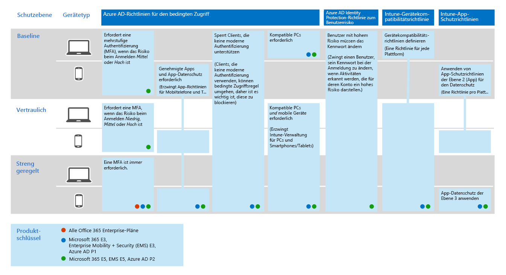

# Bereitstellen von Threat Protection-Funktionen in Microsoft 365

Schadsoftware und ausgefeilte Cyberangriffe, wie etwa Datei [unschädliche](https://docs.microsoft.com/windows/security/threat-protection/intelligence/understanding-malware) [Bedrohungen](https://docs.microsoft.com/windows/security/threat-protection/intelligence/fileless-threats), sind häufig vorkommen. Unternehmen müssen sich selbst und ihre Kunden schützen. Solche Angriffe können große Probleme für Ihre Organisation verursachen, angefangen beim Verlust von Vertrauen bis hin zu finanziellen Problemen, Unternehmens bedrohlichen Ausfallzeiten und vielem mehr. Der Schutz vor Bedrohungen ist wichtig, kann jedoch eine Herausforderung darstellen, um zu bestimmen, wo sich die Zeit, der Aufwand und die Ressourcen Ihrer Organisation konzentrieren müssen. 

Microsoft-Sicherheitslösungen sind in unsere Produkte und Dienste integriert. Automatisierung und maschinelle Lernfunktionen reduzieren die Auslastung Ihrer Sicherheitsteams, um sicherzustellen, dass die richtigen Elemente adressiert werden. Und die Stärke von Microsoft-Sicherheitslösungen baut auf Billionen von Signalen auf, die wir jeden Tag in unserem [intelligenten Sicherheits Diagramm](https://cloud-platform-assets.azurewebsites.net/intelligent-security-graph)verarbeiten. Microsoft 365-Sicherheitslösungen umfassen [Microsoft Threat Protection](https://docs.microsoft.com/microsoft-365/security/mtp/microsoft-threat-protection), eine Lösung, mit der Signale über Ihre e-Mails, Daten, Geräte und Identitäten zusammengeführt werden, um ein Bild der fortgeschrittenen Bedrohungen Ihrer Organisation zu zeichnen.

Sehen Sie sich dieses Video an, um einen Überblick über den Bereitstellungsprozess zu haben.

> [!VIDEO https://www.microsoft.com/videoplayer/embed/RE4vsI7]

Verwenden Sie diesen Artikel als Leitfaden für die Implementierung Ihrer Bedrohungsschutz Lösung.

## Bedrohungsschutz in Microsoft 365 E5

Mit [Microsoft 365 E5](https://www.microsoft.com/microsoft-365/enterprise-e5-business-software?activetab=pivot%3aoverviewtab) können Sie Ihre Organisation durch adaptive, integrierte Intelligenz schützen. Mit den Features zum Schutz vor Bedrohungen in Microsoft 365 E5 können Sie erweiterte Bedrohungen, kompromittierte Identitäten und böswillige Aktionen in Ihrer lokalen und Cloud-Umgebung erkennen und untersuchen.

In Microsoft 365 E5 sind die Funktionen zum Schutz von Bedrohungen standardmäßig integriert. Signale aus jeder Funktion stärken die Gesamt Fähigkeit zur Erkennung und Reaktion auf Bedrohungen. Die kombinierte Gruppe von Funktionen bietet den besten Schutz für Unternehmen, insbesondere für multinationale Organisationen, im Vergleich zu nicht von Microsoft ausgeführten Produkten. In der folgenden Abbildung sind die Bedrohungen für den Schutz von Diensten und Funktionen in Microsoft 365 E5 dargestellt, die in diesem Artikel beschrieben werden.

Sobald Sie eine der Advanced Threat Protection-Funktionen bereitstellen, können Sie Microsoft Threat Protection aktivieren, wodurch die Signale und Daten an einer Stelle zusammengeführt werden. 

In der folgenden Abbildung ist ein empfohlener Pfad für die bereitstellungdieser einzelnen Funktionen dargestellt. 

|Lösung/Funktionen  |Beschreibung  |
|---------|---------|
|Mehrstufige Authentifizierung und bedingter Zugriff     |Schutz vor kompromittierten Identitäten und Geräten. Beginnen Sie mit diesem Schutz, da er Grundlegendes ist. Die in diesem Leitfaden Empfohlene Konfiguration umfasst Azure AD Identitätsschutz als Voraussetzung.     |
|Azure Advanced Threat Protection     |  Eine Cloud-basierte Sicherheitslösung, die ihre lokalen Active Directory Signale nutzt, um erweiterte Bedrohungen, kompromittierte Identitäten und böswillige Insider Aktionen, die an Ihre Organisation gerichtet sind, zu identifizieren, zu erkennen und zu untersuchen. Konzentrieren Sie sich auf das nächste, da es Ihre on-Prem-und Cloud-Infrastruktur schützt, keine Abhängigkeiten oder Voraussetzungen hat und unmittelbare Vorteile bieten kann.       | 
|Office 365 Advanced Threat Protection     | Schützt Ihre Organisation vor böswilligen Bedrohungen durch e-Mail-Nachrichten, Links (URLs) und Tools für die Zusammenarbeit. Schutzmaßnahmen für Malware, Phishing, Spoofing und andere Angriffstypen. Dies wird als nächstes empfohlen, da das Bereitstellen von Änderungs Steuerelementen, Migrieren von Einstellungen aus dem etablierten System und anderen Überlegungen länger dauern kann.   Hinweis: Stellen Sie sicher, dass Sie auch die Threat Protection-Funktionen konfigurieren, die in allen Office 365 Abonnements (Exchange Online Protection) enthalten sind.       |
|Microsoft Defender Advanced Threat Protection    | Eine Endpunktschutz Plattform, die zum verhindern, erkennen, untersuchen und reagieren auf Erweiterte Bedrohungen beiträgt. Diese Bereitstellung dauert länger, kann aber parallel zu den anderen Funktionen ausgeführt werden, wenn andere Administratoren dafür verantwortlich sind.   |
|Microsoft Cloud App Security     |   Ein Cloud Access-Sicherheits Broker für Ermittlung, Untersuchung und Steuerung. Sie können diese frühzeitig aktivieren, um mit dem Sammeln von Daten und Einblicken zu beginnen. Die Implementierung von Informationen und anderer gezielter Schutz in ihren Saas-apps umfasst die Planung und kann mehr Zeit in Anspruch nehmen.       | 

> [!TIP]
> Organisationen mit mehreren Sicherheitsteams können diese Funktionen parallel implementieren.

## Bereitstellen Ihrer Bedrohungsschutz Lösung

Um sicherzustellen, dass Ihre Organisation den bestmöglichen Schutz bietet, richten Sie die Sicherheitslösung ein, und stellen Sie Sie bereit, um die folgenden Schritte einzufügen:

1. [Einrichten von Richtlinien für mehrstufige Authentifizierung und bedingten Zugriff](#step-1-set-up-multi-factor-authentication-and-conditional-access-policies)
2. [Konfigurieren von Azure Advanced Threat Protection](#step-2-configure-azure-advanced-threat-protection)
3. [Aktivieren von Microsoft Threat Protection](#step-3-turn-on-microsoft-threat-protection)
4. [Konfigurieren Office 365 Advanced Threat Protection](#step-4-configure-office-365-advanced-threat-protection)
5. [Konfigurieren von Microsoft Defender Advanced Threat Protection](#step-5-configure-microsoft-defender-advanced-threat-protection)
6. [Konfigurieren der Microsoft Cloud-App-Sicherheit](#step-6-configure-microsoft-cloud-app-security)
7. [Überwachen des Status und ergreifen von Aktionen](#step-7-monitor-status-and-take-actions)
8. [Schulen von Benutzern](#step-8-train-users)

Ihre Features zum Schutz vor Bedrohungen können parallel konfiguriert werden, wenn Sie also mehrere Sicherheitsteams für unterschiedliche Dienste zuständig sind, können Sie die Schutzfunktionen Ihrer Organisation gleichzeitig konfigurieren. Das folgende Diagramm veranschaulicht den allgemeinen Prozess für die Bereitstellung von Threat Protection-Funktionen. 

 

## Schritt 1: Einrichten von Richtlinien für mehrstufige Authentifizierung und bedingten Zugriff

[Mehrstufige Authentifizierung](https://docs.microsoft.com/azure/active-directory/authentication/concept-mfa-howitworks) (MFA) erfordert, dass Benutzer ihre Identität mit einem Telefonanruf oder einer Authentifikator-APP überprüfen. Mit [bedingten Zugriffsrichtlinien](https://docs.microsoft.com/azure/active-directory/conditional-access/overview) werden bestimmte Anforderungen definiert, die erfüllt sein müssen, damit Benutzer auf apps und Daten in Microsoft 365 zugreifen können. MFA-und Conditional Access-Richtlinien arbeiten zusammen, um Ihre Organisation zu schützen. Wenn beispielsweise ein Benutzer versucht, sich über ein Konto, das nicht für MFA aktiviert ist, über ein mobiles Gerät anzumelden, und für eine Richtlinie für bedingten Zugriff die Verwendung von MFA erforderlich ist, wird verhindert, dass der Benutzer sich anmeldet.  

Microsoft hat getestet und empfiehlt eine bestimmte Gruppe von bedingten Zugriffen und zugehörigen Richtlinien für den Schutz des Zugriffs auf alle Ihre SaaS-Anwendungen, insbesondere Microsoft 365. Richtlinien werden für den grundlegenden, vertraulichen und streng reglementierten Schutz empfohlen. Beginnen Sie mit der Implementierung der Richtlinien für den grundlegenden Schutz. 

[Siehe eine größere Version dieses Abbilds](https://github.com/MicrosoftDocs/microsoft-365-docs/raw/public/microsoft-365/media/Identity_device_access_policies_byplan.png)

### So implementieren Sie den Basisschutz für Microsoft 365

 

1. [Konfigurieren von Voraussetzungen, einschließlich Azure Identity Protection](../enterprise/identity-access-prerequisites.md).
2. [Konfigurieren allgemeiner Identitäts-und Gerätezugriffs Richtlinien](../enterprise/identity-access-policies.md) für den grundlegenden Schutz.
3. Konfigurieren von Richtlinien für [Gastbenutzer](../enterprise/identity-access-policies-guest-access.md), [Microsoft Teams](../enterprise/teams-access-policies.md), [Exchange Online](../enterprise/secure-email-recommended-policies.md)und [SharePoint Online und OneDrive](../enterprise/sharepoint-file-access-policies.md).

### Weitere Informationen zum Schützen von Identitäten

- [Konfigurationen für den Identitäts- und Gerätezugriff](../enterprise/microsoft-365-policies-configurations.md)
- [Sicherheitsleitfaden für Azure MFA](https://docs.microsoft.com/azure/active-directory/authentication/multi-factor-authentication-security-best-practices)

## Schritt 2: Konfigurieren von Azure Advanced Threat Protection

Azure [Advanced Threat Protection](https://docs.microsoft.com/azure-advanced-threat-protection/what-is-atp) (Azure ATP) ist eine Cloud-basierte Sicherheitslösung, die mit Ihren lokalen Azure- [Active Directory](https://docs.microsoft.com/azure/active-directory/fundamentals/active-directory-whatis) -Signalen zusammenarbeitet, um erweiterte Bedrohungen, kompromittierte Identitäten und böswillige Insider Aktionen zu identifizieren, zu erkennen und zu untersuchen, die an Ihre Organisation gerichtet sind.

Azure ATP aktiviert Sicherheitsfunktionen (Polizisten), Analysten und Sicherheitsexperten, die sich mit der Erkennung erweiterter Angriffe in Hybrid Umgebungen bemühen:
- Überwachen von Benutzern, Entitäts Verhalten und Aktivitäten mit Lern basierter Analyse.
- Schützt Benutzeridentitäten und Anmeldeinformationen, die in Active Directory gespeichert sind.
- Identifizieren und untersuchen Sie verdächtige Benutzeraktivitäten und fortgeschrittene Angriffe in der gesamten Abwehrkette.
- Bereitstellen klarer Vorfallinformationen auf einer einfachen Zeitachse für eine schnelle Sichtung.

### So richten Sie Azure ATP ein

 

1. [Einrichten von Azure ATP](https://docs.microsoft.com/azure-advanced-threat-protection/install-atp-step1) zum Schutz Ihrer primären Umgebungen.
2. Schützen Sie alle [Domänencontroller](https://docs.microsoft.com/azure-advanced-threat-protection/atp-sensor-monitoring) und [Gesamtstrukturen](https://docs.microsoft.com/azure-advanced-threat-protection/atp-multi-forest).
3. Integrieren Sie [Azure ATP-Warnungen](https://docs.microsoft.com/azure-advanced-threat-protection/suspicious-activity-guide?tabs=external) in ihren Security Operations (Polizisten)-Workflow.

### Weitere Informationen zu Azure ATP

- [Was ist Azure ATP?](https://docs.microsoft.com/azure-advanced-threat-protection/what-is-atp)
- [Video: Einführung in Azure ATP](https://www.youtube.com/watch?reload=9&v=EGY2m8yU_KE)
- [Azure ATP-Bereitstellung](https://docs.microsoft.com/azure-advanced-threat-protection/what-is-atp#whats-next)

## Schritt 3: Aktivieren von Microsoft Threat Protection

[Microsoft Threat Protection](https://docs.microsoft.com/microsoft-365/security/mtp/microsoft-threat-protection) kombiniert Signale und orchestriert Funktionen in einer einzigen Lösung. Mit der integrierten Microsoft Threat Protection-Lösung können Sicherheitsexperten die Bedrohungs Signale, die jedes dieser Produkte empfängt, zusammenfügen und den vollständigen Umfang und die Auswirkungen der Bedrohung bestimmen. wie Sie in die Umgebung eingingen, welche Auswirkungen Sie hat und wie Sie sich derzeit auf die Organisation auswirkt. Microsoft Threat Protection führt automatische Aktionen aus, um den Angriff zu verhindern oder zu beenden und die betroffenen Postfächer, Endpunkte und Benutzeridentitäten selbst zu heilen.

Microsoft Threat Protection vereinigt Warnungen, Vorfälle, automatisierte Untersuchungen und Antworten sowie erweitertes jagen über Arbeitslasten hinweg (Azure ATP, Office 365 ATP, Microsoft Defender ATP und Microsoft Cloud App Security) in einem einzigen Glas Erlebnis. Nachdem Sie einen oder mehrere ihrer Advanced Threat Protection-Dienste konfiguriert haben, aktivieren Sie Microsoft Threat Protection. Neue Features werden kontinuierlich zu Microsoft Threat Protection hinzugefügt. Sie können sich für das erhalten von Vorschau Features entscheiden.

### So richten Sie Microsoft Threat Protection ein

 

1. [Überprüfen Sie die Voraussetzungen](https://docs.microsoft.com/microsoft-365/security/mtp/prerequisites).
2. [Aktivieren Sie Microsoft Threat Protection](https://docs.microsoft.com/microsoft-365/security/mtp/mtp-enable).
3. [Aktivieren Sie die Vorschaufunktionen](https://docs.microsoft.com/microsoft-365/security/mtp/preview).

### Weitere Informationen zum Microsoft Threat Protection

- [Was ist Microsoft Threat Protection?](https://docs.microsoft.com/microsoft-365/security/mtp/microsoft-threat-protection)
- [Neues in Microsoft Threat Protection](https://docs.microsoft.com/microsoft-365/security/mtp/whats-new)

## Schritt 4: Konfigurieren Office 365 Advanced Threat Protection

[Office 365 Advanced Threat Protection](https://docs.microsoft.com/microsoft-365/security/office-365-security/office-365-atp) (Office 365 ATP) schützt Ihre Organisation vor böswilligen Bedrohungen in e-Mail-Nachrichten (Anlagen und URLs), Office-Dokumenten und Tools für die Zusammenarbeit. In der folgenden Tabelle sind Office 365 ATP-Features und-Funktionen aufgeführt, die in Microsoft 365 E5 enthalten sind:

|||
|---|---|
|Konfigurations-, Schutz-und Erkennungsfunktionen|Funktionen für Automatisierung, Untersuchung, Korrektur und Bildung|
|[Sichere Anlagen](https://docs.microsoft.com/microsoft-365/security/office-365-security/atp-safe-attachments) [Sichere Links](https://docs.microsoft.com/microsoft-365/security/office-365-security/atp-safe-links) [Sichere Dokumente](https://docs.microsoft.com/microsoft-365/security/office-365-security/safe-docs) [ATP für SharePoint, OneDrive und Microsoft Teams](https://docs.microsoft.com/microsoft-365/security/office-365-security/atp-for-spo-odb-and-teams) [ATP-Schutz gegen Phishing](https://docs.microsoft.com/microsoft-365/security/office-365-security/set-up-anti-phishing-policies#exclusive-settings-in-atp-anti-phishing-policies)|[Nachverfolgungslisten für Bedrohungen](https://docs.microsoft.com/microsoft-365/security/office-365-security/threat-trackers) [Sicherheitsrisiken-Explorer](https://docs.microsoft.com/microsoft-365/security/office-365-security/threat-explorer) [Automatische Untersuchung und Reaktion](https://docs.microsoft.com/microsoft-365/security/office-365-security/office-365-air) [Angriffssimulator](https://docs.microsoft.com/microsoft-365/security/office-365-security/attack-simulator)|
|

Mit Office 365 ATP können Personen in Ihrer Organisation sicher mit dem Bedrohungsschutz für Ihre e-Mail-Inhalte und Office-Dokumente kommunizieren und zusammenarbeiten.

### So richten Sie Office 365 ATP ein

 

1. [Richten Sie Ihre Office 365 ATP-Richtlinien ein und konfigurieren Sie](https://docs.microsoft.com/microsoft-365/security/office-365-security/protect-against-threats)Sie.
2. [Zeigen Sie Ihre Office 365 ATP-Berichte an, und verwenden](https://docs.microsoft.com/microsoft-365/security/office-365-security/view-reports-for-atp)Sie Sie.
3. [Verwenden Sie die Funktionen zur Ermittlung und Reaktion von Bedrohungen](https://docs.microsoft.com/microsoft-365/security/office-365-security/office-365-ti).

### Weitere Informationen zu Office 365 ATP

- [Übersicht über Office 365 ATP](https://docs.microsoft.com/microsoft-365/security/office-365-security/office-365-atp)
- [Neuerungen in Office 365 ATP](https://docs.microsoft.com/microsoft-365/security/office-365-security/whats-new-in-office-365-atp)

## Schritt 5: Konfigurieren von Microsoft Defender Advanced Threat Protection

[Microsoft Defender Advanced Threat Protection](https://docs.microsoft.com/windows/security/threat-protection) (Microsoft Defender ATP) schützt Ihre Organisations Geräte (auch als Endpunkte bezeichnet) vor Bedrohungen, erweiterten Angriffen und Datenschutzverletzungen. Sicherheitsteams können die Sicherheit Ihrer Endpunkte effizienter verwalten. Mithilfe von robusten Tools können Organisationen mit ungepatchten Systemen Schritt halten, indem Sie die Schwachstellenerkennung mit [Bedrohungs-und Sicherheitsrisikomanagement](https://docs.microsoft.com/windows/security/threat-protection/microsoft-defender-atp/next-gen-threat-and-vuln-mgt)verwenden. Automatisierte Erkennungs-und Korrekturfunktionen wie [Angriffs Oberflächenreduzierung](https://docs.microsoft.com/windows/security/threat-protection/microsoft-defender-atp/overview-attack-surface-reduction), [Schutz der nächsten Generation](https://docs.microsoft.com/windows/security/threat-protection/windows-defender-antivirus/windows-defender-antivirus-in-windows-10), [Endpunkterkennung und-Antwort](https://docs.microsoft.com/windows/security/threat-protection/microsoft-defender-atp/overview-endpoint-detection-response)sowie [Automatische Untersuchung und Behebung](https://docs.microsoft.com/windows/security/threat-protection/microsoft-defender-atp/automated-investigations) helfen Ihnen, Ihre Geräte vor Schadsoftware zu schützen. Zusätzlich zu diesen Funktionen können Kunden proaktive Benachrichtigungen erhalten und sich mit Microsoft Threat Experts bei Bedarf im Rahmen des Diensts zur Verwaltung von opt-ins beraten lassen. 

### Einrichten von Microsoft Defender ATP

 

1. [Bereiten Sie Ihre Microsoft Defender ATP-Bereitstellung](https://docs.microsoft.com/windows/security/threat-protection/microsoft-defender-atp/deployment-phases)vor.
2. [Einrichten der ATP-Bereitstellung von Microsoft Defender](https://docs.microsoft.com/windows/security/threat-protection/micros.oft-defender-atp/production-deployment)
3. [Onboard beim Microsoft Defender ATP-Dienst](https://docs.microsoft.com/windows/security/threat-protection/microsoft-defender-atp/onboarding).
4. [Führen Sie die wichtigsten administrativen Aufgaben für die Sicherheit](https://docs.microsoft.com/windows/security/threat-protection/microsoft-defender-atp/tvm-security-recommendation)aus.

### Weitere Informationen zu Microsoft Defender ATP

- [Erfahren Sie mehr über Microsoft Defender ATP](https://docs.microsoft.com/windows/security/threat-protection).
- [Testen Sie das Microsoft Defender ATP Evaluation Lab](https://docs.microsoft.com/windows/security/threat-protection/microsoft-defender-atp/evaluation-lab).

## Schritt 6: Konfigurieren der Microsoft Cloud-App-Sicherheit

[Microsoft Cloud App Security](https://docs.microsoft.com/cloud-app-security) ist ein Cloud Access-Sicherheits Broker, der Protokollsammlung, API-Konnektoren und Reverse-Proxy unterstützt. Microsoft Cloud App Security bietet umfangreiche Sichtbarkeit, Kontrolle über Daten Reisen und ausgefeilte Analysen zur Erkennung und Bekämpfung von Bedrohungen in allen Cloud-Diensten. Mit der Microsoft Cloud-App-Sicherheit können Ihre Sicherheitsvorgänge die vertraulichen Informationen Ihrer Organisation schützen, vor Bedrohungen und Anomalien schützen, apps, die auf die Daten Ihrer Organisation zugreifen, erkennen und überwachen und sicherstellen, dass die Cloud-Apps ihrer Organisation die Compliance-Anforderungen erfüllen.

### Einrichten von Microsoft Cloud App Security

 

1. [Richten Sie das Portal und andere grundlegende Anforderungen ein](https://docs.microsoft.com/cloud-app-security/general-setup).
2. [Einrichten der Cloud Discovery](https://docs.microsoft.com/cloud-app-security/set-up-cloud-discovery) und [Verbinden von apps](https://docs.microsoft.com/cloud-app-security/enable-instant-visibility-protection-and-governance-actions-for-your-apps).
3. [Stellen Sie das App-Steuerelement für bedingte Zugriffe für Featured apps bereit](https://docs.microsoft.com/cloud-app-security/proxy-deployment-aad).
4. [Verwenden Sie die Ermittlungs Tools und Dashboards](https://docs.microsoft.com/cloud-app-security/investigate).

### Weitere Informationen zu Microsoft Cloud App Security

- [Überprüfen Sie die neuen Features und Funktionen](https://docs.microsoft.com/cloud-app-security/release-notes).
- [Erfahren Sie mehr über Microsoft Cloud App Security](https://docs.microsoft.com/cloud-app-security/what-is-cloud-app-security).

## Schritt 7: Überwachen des Status und ergreifen von Aktionen

Nachdem Sie Ihre Threat Protection-Dienste und-Funktionen eingerichtet und bereitgestellt haben, besteht der nächste Schritt darin, Bedrohungserkennungen zu überwachen und entsprechende Aktionen durchführen. Ihr bester Ausgangspunkt ist das Microsoft 365 Security Center ([https://security.microsoft.com](https://security.microsoft.com)), in dem Sie die Sicherheit in Ihren Microsoft-Identitäten,-Daten,-Geräten,-Apps und-Infrastrukturen überwachen und verwalten können. 

:::image type="content" source="../media/solutions-architecture-center/m365-security-center.png" alt-text="Microsoft 365 Security Center":::

Das Microsoft 365-Sicherheitscenter ist speziell für Sicherheitsadministratoren und Sicherheits Betriebsteams vorgesehen. Im Microsoft 365 Security Center haben Sie folgende Möglichkeiten:
- Anzeigen des allgemeinen Sicherheitsstatus ihrer Organisation mit [sicherer Punktzahl](https://docs.microsoft.com/microsoft-365/security/mtp/microsoft-secure-score).
- [Überwachen und Anzeigen von Berichten](https://docs.microsoft.com/microsoft-365/security/mtp/monitoring-and-reporting) zum Status Ihrer Identitäten, Daten, Geräte, Apps und Infrastruktur.
- Verbinden Sie die Punkte auf Warnungen durch [Vorfälle](https://docs.microsoft.com/microsoft-365/security/mtp/incident-queue).
- Verwenden Sie [automatisierte Untersuchungen und Korrekturen](https://docs.microsoft.com/microsoft-365/security/mtp/mtp-autoir) , um Bedrohungen zu adressieren.
- [Proaktive Suche nach Bedrohungen](https://docs.microsoft.com/microsoft-365/security/mtp/advanced-hunting-overview)wie Intrusionsversuchen oder Verletzungs Aktivitäten, die sich auf Ihre e-Mails, Daten, Geräte und Identitäten auswirken.
- Grund [Legendes zu den neuesten Angriffs Kampagnen](https://docs.microsoft.com/microsoft-365/security/mtp/latest-attack-campaigns) und-Techniken mit Threat Analytics.
- ... und vieles mehr!

### Weitere Informationen zum Microsoft 365 Security Center

- [Erste Schritte mit dem Microsoft 365 Security Center](https://docs.microsoft.com/microsoft-365/security/mtp/overview-security-center).
- [Überwachen und Anzeigen von Berichten](https://docs.microsoft.com/microsoft-365/security/mtp/monitoring-and-reporting)
- [Weitere Informationen finden Sie in den Sicherheitsportalen in Microsoft 365](https://docs.microsoft.com/microsoft-365/security/mtp/portals).

## Schritt 8: Schulen von Benutzern

Schulung Benutzer können Ihre Benutzer und Sicherheits Betriebsteams viel Zeit und Frustration speichern. Versierte Benutzer sind weniger wahrscheinlich, Anlagen zu öffnen oder auf Links in fragwürdigen e-Mail-Nachrichten klicken, und Sie sind eher zu verdächtigen Websites zu vermeiden. 

Das Harvard Kennedy School [Cyber Campaign Handbook](https://go.microsoft.com/fwlink/?linkid=2015598&amp;clcid=0x409) bietet eine hervorragende Anleitung zum Einrichten einer starken Kultur des Sicherheitsbewusstseins in Ihrer Organisation, einschließlich der Schulung von Benutzern zur Identifizierung von Phishing-Angriffen. 

Microsoft 365 stellt die folgenden Ressourcen zur Verfügung, um Benutzer in Ihrer Organisation zu informieren:

|Konzept  |Ressourcen  |
|---------|---------|
|Microsoft 365     |[Anpassbare Lern Pfade](https://docs.microsoft.com/office365/customlearning/) 
Diese Ressourcen können Ihnen helfen, Schulungen für Endbenutzer in Ihrer Organisation zusammenzustellen.        |
|Microsoft 365 Security Center |[Lern Modul: Sichern Ihrer Organisation mit integrierter intelligenter Sicherheit von Microsoft 365](https://docs.microsoft.com/learn/modules/security-with-microsoft-365) 
In diesem Modul können Sie beschreiben, wie Microsoft 365-Sicherheitsfeatures zusammenarbeiten und die Vorteile dieser Sicherheitsfeatures artikulieren. |
|Mehrstufige Authentifizierung     | [Überprüfung in zwei Schritten: Was ist die zusätzliche Überprüfungsseite?](https://docs.microsoft.com/azure/active-directory/user-help/multi-factor-authentication-end-user-first-time) 
Dieser Artikel hilft Endbenutzern, die mehrstufige Authentifizierung zu verstehen, und warum Sie in Ihrer Organisation verwendet wird.    |

Zusätzlich zu diesen Anleitungen empfiehlt Microsoft, dass Ihre Benutzer die in diesem Artikel beschriebenen Aktionen ausführen: [schützen Sie Ihr Konto und Ihre Geräte vor Hackern und Schadsoftware](https://support.office.com/article/066d6216-a56b-4f90-9af3-b3a1e9a327d6.aspx). Diese setzen sich wie folgt zusammen:
- Verwenden sicherer Kennwörter
- Schützen von Geräten 
- Aktivieren von Sicherheitsfunktionen auf Windows 10-und Mac-PCs (für nicht verwaltete Geräte)
    
Microsoft empfiehlt auch, dass Benutzer Ihre persönlichen e-Mail-Konten schützen, indem Sie die in den folgenden Artikeln empfohlenen Aktionen ausführen:
- [Schützen Ihres Outlook.com-e-Mail-Kontos](https://support.office.com/article/a4f20fc5-4307-4ece-8231-6d4d4bd8a9ba.aspx)
- [Schützen Ihres gmail-Kontos mit zweistufiger Überprüfung](https://go.microsoft.com/fwlink/?linkid=2015688&amp;clcid=0x409)
