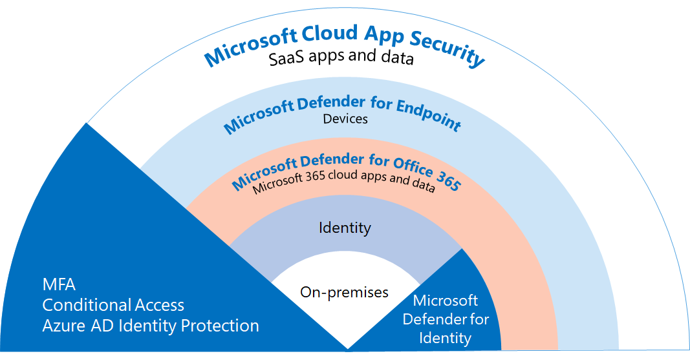

# Bereitstellen von Bedrohungsschutzfunktionen in Microsoft 365

[Schadsoftware](https://docs.microsoft.com/windows/security/threat-protection/intelligence/understanding-malware)und komplexe Cyberangriffe, z. B. [dateilose](https://docs.microsoft.com/windows/security/threat-protection/intelligence/fileless-threats)Bedrohungen, sind häufig vorkommen. Unternehmen müssen sich und ihre Kunden mit effektiven IT-Sicherheitsfunktionen schützen. Cyberangriffe können große Probleme für Ihre Organisation verursachen, von Vertrauensverlusten bis hin zu finanziellen Problemen, geschäftsbedrohlichen Ausfallzeiten und vielem mehr. Der Schutz vor Bedrohungen ist wichtig, es kann jedoch schwierig sein, zu bestimmen, wo die Zeit, der Aufwand und die Ressourcen Ihrer Organisation konzentriert werden sollen. 

Microsoft-Sicherheitslösungen sind in unsere Produkte und Dienste integrierte. Automatisierungs- und Maschinelles Lernen verringern die Last für Ihre Sicherheitsteams, um sicherzustellen, dass die richtigen Elemente adressiert werden. Und die Stärke von Microsoft-Sicherheitslösungen baut auf Billionen von Signalen auf, die wir täglich in unserem [Intelligenten Sicherheitsdiagramm verarbeiten.](https://cloud-platform-assets.azurewebsites.net/intelligent-security-graph) Microsoft 365-Sicherheitslösungen umfassen [Microsoft 365 Defender](https://docs.microsoft.com/microsoft-365/security/mtp/microsoft-threat-protection), eine Lösung, die Signale über Ihre E-Mails, Daten, Geräte und Identitäten hinweg zusammen bringt, um ein Bild von erweiterten Bedrohungen für Ihre Organisation zu zeichnen.

Schauen Sie sich dieses Video an, um einen Überblick über den Bereitstellungsprozess zu erhalten.
  
> [!VIDEO https://www.microsoft.com/videoplayer/embed/RE4vsI7]

>[!Note]
>In diesem Video werden die vorherigen Namen von Produkten und Features für den Bedrohungsschutz verwendet, die Konzepte sind jedoch identisch. Ein Update für dieses Video wird ausgeführt.
>

Verwenden Sie diesen Artikel als Leitfaden für die Implementierung Ihrer Lösung zum Schutz vor Bedrohungen.

## Bedrohungsschutz in Microsoft 365 E5

[Mit Microsoft 365 E5](https://www.microsoft.com/microsoft-365/enterprise-e5-business-software?activetab=pivot%3aoverviewtab) können Sie Ihre Organisation mit adaptiver, integrierter Intelligenz schützen. Mit den Bedrohungsschutzfeatures in Microsoft 365 E5 können Sie erweiterte Bedrohungen, gefährdete Identitäten und schädliche Aktionen in Ihrer lokalen und Cloudumgebung erkennen und untersuchen.

In Microsoft 365 E5 sind Bedrohungsschutzfunktionen standardmäßig integriert. Signale jeder Funktion erhöhen die Allgemeine Fähigkeit, Bedrohungen zu erkennen und darauf zu reagieren. Die kombinierten Funktionen bieten den besten Schutz für Organisationen, insbesondere für multinationale Organisationen, im Vergleich zum Ausführen von Nicht-Microsoft-Produkten. Die folgende Abbildung zeigt die In diesem Artikel beschriebenen Dienste und Funktionen zum Schutz vor Bedrohungen in Microsoft 365 E5.

Sobald Sie eine der Defender for Office 365-Funktionen bereitstellen, können Sie Microsoft 365 Defender aktivieren, wodurch die Signale und Daten an einem Ort zusammenkommen. 

Die folgende Abbildung zeigt einen empfohlenen Pfad für die Bereitstellung dieser einzelnen Funktionen. 

|Lösung/Funktionen  |Beschreibung  |
|---------|---------|
|Mehrstufige Authentifizierung und bedingter Zugriff     |Schutz vor gefährdeten Identitäten und Geräten. Beginnen Sie mit diesem Schutz, da er grundsindlich ist. Die in diesem Leitfaden empfohlene Konfiguration umfasst Azure AD Identity Protection als Voraussetzung.     |
|Microsoft Defender for Identity     |  Eine cloudbasierte Sicherheitslösung, die Ihre lokalen Active Directory Domain Services (AD DS)-Signale nutzt, um erweiterte Bedrohungen, gefährdete Identitäten und schädliche Insideraktionen zu identifizieren, zu erkennen und zu untersuchen, die an Ihre Organisation gerichtet sind. Konzentrieren Sie sich als Nächstes auf Microsoft Defender for Identity, da es Ihre lokale und Cloudinfrastruktur schützt, keine Abhängigkeiten oder Voraussetzungen hat und sofortige Sicherheitsvorteile bieten kann. | 
|Microsoft Defender für Office 365     | Schützt Ihre Organisation vor böswilligen Bedrohungen durch E-Mail-Nachrichten, Links (URLs) und Tools für die Zusammenarbeit. Schutz vor Schadsoftware, Phishing, Spoofing und anderen Angriffstypen. Als Nächstes wird die Konfiguration von Microsoft Defender für Office 365 empfohlen, da die Änderungssteuerung, das Migrieren von Einstellungen vom etablierten System und andere Überlegungen länger dauern können.   Hinweis: Stellen Sie sicher, dass Sie die Bedrohungsschutzfunktionen konfigurieren, die in allen Office 365-Abonnements enthalten sind (Exchange Online Protection).       |
|Microsoft Defender für Endpunkt    | Eine Endpunktschutzplattform, die hilft, erweiterte Bedrohungen zu verhindern, zu erkennen, zu untersuchen und auf sie zu reagieren.  Die Bereitstellung von Defender for Endpoint kann einige Zeit in Dauern dauern, die Konfiguration kann jedoch parallel zu anderen Funktionen ausgeführt werden.   |
|Microsoft Cloud App Security     |   Ein Cloudzugriffssicherheitsbroker für Ermittlung, Untersuchung und Governance. Sie können Microsoft Cloud App Security frühzeitig aktivieren, um mit dem Sammeln von Daten und Erkenntnissen zu beginnen. Die Implementierung von Informationen und anderen gezielten Schutz in Ihren SaaS-Apps umfasst die Planung und kann mehr Zeit in Sich nehmen.       | 

> [!TIP]
> Organisationen mit mehreren Sicherheitsteams können diese Funktionen parallel implementieren.

## Bereitstellen Ihrer Lösung zum Schutz vor Bedrohungen

Um sicherzustellen, dass Ihre Organisation über den bestmöglichen Schutz verfügt, richten Sie Ihre Sicherheitslösung ein, und stellen Sie sie so ein, dass sie die folgenden Schritte umfasst:

1. [Einrichten von mehrstufiger Authentifizierung und Richtlinien für bedingten Zugriff](deploy-threat-protection-configure.md#step-1-set-up-multi-factor-authentication-and-conditional-access-policies)
2. [Konfigurieren von Microsoft Defender for Identity](deploy-threat-protection-configure.md#step-2-configure-microsoft-defender-for-identity)
3. [Aktivieren von Microsoft 365 Defender](deploy-threat-protection-configure.md#step-3-turn-on-microsoft-365-defender)
4. [Konfigurieren von Defender für Office 365](deploy-threat-protection-configure.md#step-4-configure-microsoft-defender-for-office-365)
5. [Konfigurieren von Microsoft Defender for Endpoint](deploy-threat-protection-configure.md#step-5-configure-microsoft-defender-for-endpoint)
6. [Konfigurieren von Microsoft Cloud App Security](deploy-threat-protection-configure.md#step-6-configure-microsoft-cloud-app-security)
7. [Überwachen des Status und Ergreifen von Aktionen](deploy-threat-protection-configure.md#step-7-monitor-status-and-take-actions)
8. [Benutzer trainieren](deploy-threat-protection-configure.md#step-8-train-users)

Ihre Bedrohungsschutzfeatures können parallel konfiguriert werden. Wenn Sie also mehrere Netzwerksicherheitsteams für verschiedene Dienste verantwortlich sind, können sie die Schutzfeatures Ihrer Organisation gleichzeitig konfigurieren. Das folgende Diagramm veranschaulicht den prozess auf hoher Ebene für die Bereitstellung von Funktionen zum Schutz vor Bedrohungen. 

 
