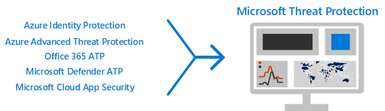

# Bereitstellen von Threat Protection-Funktionen in Microsoft 365Deploy threat protection capabilities across Microsoft 365

Schadsoftware und ausgefeilte Cyberangriffe, wie etwa Datei [unschädliche](https://docs.microsoft.com/windows/security/threat-protection/intelligence/understanding-malware) [Bedrohungen](https://docs.microsoft.com/windows/security/threat-protection/intelligence/fileless-threats), sind häufig vorkommen.[Malware](https://docs.microsoft.com/windows/security/threat-protection/intelligence/understanding-malware), and sophisticated cyberattacks, such as [fileless threats](https://docs.microsoft.com/windows/security/threat-protection/intelligence/fileless-threats), are a common occurrence. Unternehmen müssen sich selbst und ihre Kunden schützen.Businesses need to protect themselves and their customers. Solche Angriffe können große Probleme für Ihre Organisation verursachen, angefangen beim Verlust von Vertrauen bis hin zu finanziellen Problemen, Unternehmens bedrohlichen Ausfallzeiten und vielem mehr.Such attacks can cause major problems for your organization, ranging from a loss of trust to financial woes, business-threatening downtime, and more. Der Schutz vor Bedrohungen ist wichtig, kann jedoch eine Herausforderung darstellen, um zu bestimmen, wo sich die Zeit, der Aufwand und die Ressourcen Ihrer Organisation konzentrieren müssen.Protecting against threats is important, but it can be challenging to determine where to focus your organization's time, effort, and resources. 

Microsoft-Sicherheitslösungen sind in unsere Produkte und Dienste integriert.Microsoft security solutions are built into our products and services. Automatisierung und maschinelle Lernfunktionen reduzieren die Auslastung Ihrer Sicherheitsteams, um sicherzustellen, dass die richtigen Elemente adressiert werden.Automation and machine learning capabilities reduce the load on your security teams to make sure the right items are addressed. Und die Stärke von Microsoft-Sicherheitslösungen baut auf Billionen von Signalen auf, die wir jeden Tag in unserem [intelligenten Sicherheits Diagramm](https://cloud-platform-assets.azurewebsites.net/intelligent-security-graph)verarbeiten.And the strength of Microsoft security solutions is built on trillions of signals we process every day in our [Intelligent Security Graph](https://cloud-platform-assets.azurewebsites.net/intelligent-security-graph). Microsoft 365-Sicherheitslösungen umfassen [Microsoft Threat Protection](https://docs.microsoft.com/microsoft-365/security/mtp/microsoft-threat-protection), eine Lösung, mit der Signale über Ihre e-Mails, Daten, Geräte und Identitäten zusammengeführt werden, um ein Bild der fortgeschrittenen Bedrohungen Ihrer Organisation zu zeichnen.Microsoft 365 security solutions include [Microsoft Threat Protection](https://docs.microsoft.com/microsoft-365/security/mtp/microsoft-threat-protection), a solution that brings together signals across your email, data, devices, and identities to paint a picture of advanced threats against your organization.

Sehen Sie sich dieses Video an, um einen Überblick über den Bereitstellungsprozess zu haben.Watch this video for an overview of the deployment process.

> [!VIDEO https://www.microsoft.com/videoplayer/embed/RE4vsI7]

Verwenden Sie diesen Artikel als Leitfaden für die Implementierung Ihrer Bedrohungsschutz Lösung.Use this article as a guide for implementing your threat protection solution.

## Bedrohungsschutz in Microsoft 365 E5Threat protection in Microsoft 365 E5

Mit [Microsoft 365 E5](https://www.microsoft.com/microsoft-365/enterprise-e5-business-software?activetab=pivot%3aoverviewtab) können Sie Ihre Organisation durch adaptive, integrierte Intelligenz schützen.[Microsoft 365 E5](https://www.microsoft.com/microsoft-365/enterprise-e5-business-software?activetab=pivot%3aoverviewtab) enables you to protect your organization with adaptive, built-in intelligence. Mit den Features zum Schutz vor Bedrohungen in Microsoft 365 E5 können Sie erweiterte Bedrohungen, kompromittierte Identitäten und böswillige Aktionen in Ihrer lokalen und Cloud-Umgebung erkennen und untersuchen.With the threat protection features in Microsoft 365 E5, you can detect and investigate advanced threats, compromised identities, and malicious actions across your on-premises and cloud environments.

In Microsoft 365 E5 sind die Funktionen zum Schutz von Bedrohungen standardmäßig integriert.In Microsoft 365 E5, threat protection capabilities are integrated by default. Signale aus jeder Funktion stärken die Gesamt Fähigkeit zur Erkennung und Reaktion auf Bedrohungen.Signals from each capability add strength to the overall ability to detect and respond to threats. Die kombinierte Gruppe von Funktionen bietet den besten Schutz für Unternehmen, insbesondere für multinationale Organisationen, im Vergleich zu nicht von Microsoft ausgeführten Produkten.The combined set of capabilities offers the best protection for organizations, especially multi-national organizations, compared to running non-Microsoft products. In der folgenden Abbildung sind die Bedrohungen für den Schutz von Diensten und Funktionen in Microsoft 365 E5 dargestellt, die in diesem Artikel beschrieben werden.The following image depicts the threat protection services and capabilities in Microsoft 365 E5 that are described in this article.

Sobald Sie eine der Advanced Threat Protection-Funktionen bereitstellen, können Sie Microsoft Threat Protection aktivieren, wodurch die Signale und Daten an einer Stelle zusammengeführt werden.As soon as you deploy any of the advanced threat protection capabilities, you can turn on Microsoft Threat Protection, which brings the signals and data together into one place. 

In der folgenden Abbildung ist ein empfohlener Pfad für die bereitstellungdieser einzelnen Funktionen dargestellt.The following illustration depicts a recommended path for deploying these individual capabilities. 

|Lösung/FunktionenSolution/capabilities  |BeschreibungDescription  |
|---------|---------|
|Mehrstufige Authentifizierung und bedingter ZugriffMulti-factor authentication and conditional access     |Schutz vor kompromittierten Identitäten und Geräten.Protect against compromised identities and devices. Beginnen Sie mit diesem Schutz, da er Grundlegendes ist.Begin with this protection because it's foundational. Die in diesem Leitfaden Empfohlene Konfiguration umfasst Azure AD Identitätsschutz als Voraussetzung.The configuration recommended in this guidance includes Azure AD Identity Protection as a prerequisite.     |
|Azure Advanced Threat ProtectionAzure Advanced Threat Protection     |  Eine Cloud-basierte Sicherheitslösung, die ihre lokalen Active Directory Signale nutzt, um erweiterte Bedrohungen, kompromittierte Identitäten und böswillige Insider Aktionen, die an Ihre Organisation gerichtet sind, zu identifizieren, zu erkennen und zu untersuchen.A cloud-based security solution that leverages your on-premises Active Directory signals to identify, detect, and investigate advanced threats, compromised identities, and malicious insider actions directed at your organization. Konzentrieren Sie sich auf das nächste, da es Ihre on-Prem-und Cloud-Infrastruktur schützt, keine Abhängigkeiten oder Voraussetzungen hat und unmittelbare Vorteile bieten kann.Focus on this next because it protects your on-prem and your cloud infrastructure, has no dependencies or prerequisites, and can provide immediate benefit.       | 
|Office 365 Advanced Threat ProtectionOffice 365 Advanced Threat Protection     | Schützt Ihre Organisation vor böswilligen Bedrohungen durch e-Mail-Nachrichten, Links (URLs) und Tools für die Zusammenarbeit.Safeguards your organization against malicious threats posed by email messages, links (URLs), and collaboration tools. Schutzmaßnahmen für Malware, Phishing, Spoofing und andere Angriffstypen.Protections for malware, phishing, spoofing, and other attack types. Dies wird als nächstes empfohlen, da das Bereitstellen von Änderungs Steuerelementen, Migrieren von Einstellungen aus dem etablierten System und anderen Überlegungen länger dauern kann.This is recommended next because change control, migrating settings from incumbent system, and other considerations can take longer to deploy.   Hinweis: Stellen Sie sicher, dass Sie auch die Threat Protection-Funktionen konfigurieren, die in allen Office 365 Abonnements (Exchange Online Protection) enthalten sind.Note: Be sure you also configure the threat protection capabilities included in all Office 365 subscriptions (Exchange Online Protection).       |
|Microsoft Defender Advanced Threat ProtectionMicrosoft Defender Advanced Threat Protection    | Eine Endpunktschutz Plattform, die zum verhindern, erkennen, untersuchen und reagieren auf Erweiterte Bedrohungen beiträgt.An endpoint protection platform that helps prevent, detect, investigate, and respond to advanced threats. Diese Bereitstellung dauert länger, kann aber parallel zu den anderen Funktionen ausgeführt werden, wenn andere Administratoren dafür verantwortlich sind.This takes longer to deploy, but can be done in parallel with the other capabilities if other admins are responsible.   |
|Microsoft Cloud App SecurityMicrosoft Cloud App Security     |   Ein Cloud Access-Sicherheits Broker für Ermittlung, Untersuchung und Steuerung.A cloud access security broker for discovery, investigation, and governance. Sie können diese frühzeitig aktivieren, um mit dem Sammeln von Daten und Einblicken zu beginnen.You can enable this early to begin collecting data and insights. Die Implementierung von Informationen und anderer gezielter Schutz in ihren Saas-apps umfasst die Planung und kann mehr Zeit in Anspruch nehmen.Implementing information and other targeted protection across your SaaS apps involves planning and can take more time.       | 

> [!TIP]
> Organisationen mit mehreren Sicherheitsteams können diese Funktionen parallel implementieren.Organizations with multiple security teams can implement these capabilities in parallel.

## Bereitstellen Ihrer Bedrohungsschutz LösungDeploy your threat protection solution

Um sicherzustellen, dass Ihre Organisation den bestmöglichen Schutz bietet, richten Sie die Sicherheitslösung ein, und stellen Sie Sie bereit, um die folgenden Schritte einzufügen:To make sure your organization has the best protection possible, set up and deploy your security solution to include the following steps:

1. [Einrichten von Richtlinien für mehrstufige Authentifizierung und bedingten ZugriffSet up multi-factor authentication and conditional access policies](deploy-threat-protection-configure.md#step-1-set-up-multi-factor-authentication-and-conditional-access-policies)
2. [Konfigurieren von Azure Advanced Threat ProtectionConfigure Azure Advanced Threat Protection](deploy-threat-protection-configure.md#step-2-configure-azure-advanced-threat-protection)
3. [Aktivieren von Microsoft Threat ProtectionTurn on Microsoft Threat Protection](deploy-threat-protection-configure.md#step-3-turn-on-microsoft-threat-protection)
4. [Konfigurieren Office 365 Advanced Threat ProtectionConfigure Office 365 Advanced Threat Protection](deploy-threat-protection-configure.md#step-4-configure-office-365-advanced-threat-protection)
5. [Konfigurieren von Microsoft Defender Advanced Threat ProtectionConfigure Microsoft Defender Advanced Threat Protection](deploy-threat-protection-configure.md#step-5-configure-microsoft-defender-advanced-threat-protection)
6. [Konfigurieren der Microsoft Cloud-App-SicherheitConfigure Microsoft Cloud App Security](deploy-threat-protection-configure.md#step-6-configure-microsoft-cloud-app-security)
7. [Überwachen des Status und ergreifen von AktionenMonitor status and take actions](deploy-threat-protection-configure.md#step-7-monitor-status-and-take-actions)
8. [Schulen von BenutzernTrain users](deploy-threat-protection-configure.md#step-8-train-users)

Ihre Features zum Schutz vor Bedrohungen können parallel konfiguriert werden, wenn Sie also mehrere Sicherheitsteams für unterschiedliche Dienste zuständig sind, können Sie die Schutzfunktionen Ihrer Organisation gleichzeitig konfigurieren.Your threat protection features can be configured in parallel, so if you have multiple security teams responsible for different services, they can configure your organization’s protection features at the same time. Das folgende Diagramm veranschaulicht den allgemeinen Prozess für die Bereitstellung von Threat Protection-Funktionen.The following diagram illustrates the high-level process for deploying threat protection capabilities. 

 

