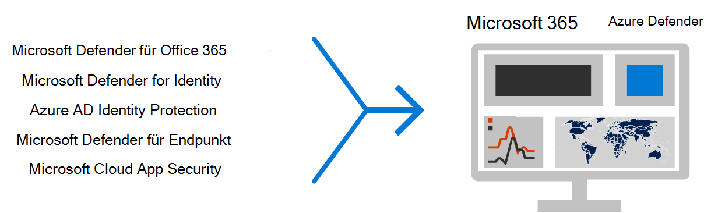
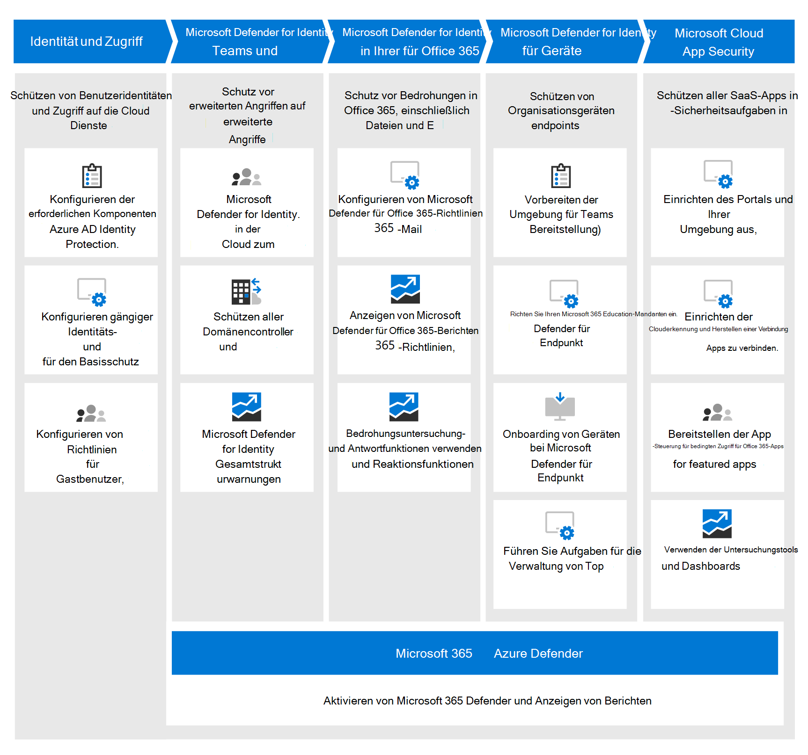

# Bereitstellen von Bedrohungsschutzfunktionen Microsoft 365 E5Deploy threat protection capabilities across Microsoft 365 E5

Diese Lösung beschreibt leistungsstarke Funktionen zum Schutz von Bedrohungen Microsoft 365 E5 und erläutert, warum Bedrohungsschutz wichtig ist.This solution describes powerful threat protection capabilities across Microsoft 365 E5 and explains why threat protection is important. Lesen Sie diesen Artikel, um einen Überblick über den Bedrohungsschutz in Microsoft 365 E5 zu erhalten und die Einrichtung und Konfiguration für Ihre Organisation zu verwenden.Read this article to get an overview of threat protection in Microsoft 365 E5 and how to approach setup and configuration for your organization.

## Warum Bedrohungsschutz wichtig istWhy threat protection is important 

[Schadsoftware](/windows/security/threat-protection/intelligence/understanding-malware)und komplexe Cyberangriffe, z. B. [dateilose](/windows/security/threat-protection/intelligence/fileless-threats)Bedrohungen, sind häufig vorkommen.[Malware](/windows/security/threat-protection/intelligence/understanding-malware), and sophisticated cyberattacks, such as [fileless threats](/windows/security/threat-protection/intelligence/fileless-threats), are a common occurrence. Unternehmen müssen sich und ihre Kunden mit effektiven IT-Sicherheitsfunktionen schützen.Businesses need to protect themselves and their customers with effective IT security capabilities. Cyberangriffe können große Probleme für Ihre Organisation verursachen, von Vertrauensverlusten bis hin zu finanziellen Problemen, geschäftsbedrohlichen Ausfallzeiten und vielem mehr.Cyberattacks can cause major problems for your organization, ranging from a loss of trust to financial woes, business-threatening downtime, and more. Der Schutz vor Bedrohungen ist wichtig, es kann jedoch schwierig sein, zu bestimmen, wo die Zeit, der Aufwand und die Ressourcen Ihrer Organisation konzentriert werden sollen.Protecting against threats is important, but it can be challenging to determine where to focus your organization's time, effort, and resources. Microsoft 365 E5 kann helfen.Microsoft 365 E5 can help. 

Microsoft-Sicherheitslösungen sind in unsere Produkte und Dienste integrierte.Microsoft security solutions are built into our products and services. Automatisierungs- und Maschinelles Lernen verringern die Last für Ihre Sicherheitsteams, um sicherzustellen, dass die richtigen Elemente adressiert werden.Automation and machine learning capabilities reduce the load on your security teams to make sure the right items are addressed. Und die Stärke von Microsoft-Sicherheitslösungen baut auf Billionen von Signalen auf, die wir täglich in unserem [Intelligenten Sicherheitsdienst Graph.](/graph/security-concept-overview)And the strength of Microsoft security solutions is built on trillions of signals we process every day in our [Intelligent Security Graph](/graph/security-concept-overview). Microsoft 365 Sicherheitslösungen umfassen [Microsoft 365 Defender](../security/defender/microsoft-365-defender.md), eine Lösung, die Signale über Ihre E-Mails, Daten, Geräte und Identitäten hinweg zusammen bringt, um ein Bild von erweiterten Bedrohungen für Ihre Organisation zu zeichnen.Microsoft 365 security solutions include [Microsoft 365 Defender](../security/defender/microsoft-365-defender.md), a solution that brings together signals across your email, data, devices, and identities to paint a picture of advanced threats against your organization.

Schauen Sie sich dieses Video an, um einen Überblick über den Bereitstellungsprozess zu erhalten.Watch this video for an overview of the deployment process.
  
> [!VIDEO https://www.microsoft.com/videoplayer/embed/RE4vsI7]

## Bedrohungsschutz in Microsoft 365 E5Threat protection in Microsoft 365 E5

[Microsoft 365 E5](https://www.microsoft.com/microsoft-365/enterprise-e5-business-software?activetab=pivot%3aoverviewtab) ermöglicht Es Ihnen, Ihre Organisation mit adaptiver, integrierter Intelligenz zu schützen.[Microsoft 365 E5](https://www.microsoft.com/microsoft-365/enterprise-e5-business-software?activetab=pivot%3aoverviewtab) enables you to protect your organization with adaptive, built-in intelligence. Mit den Bedrohungsschutzfeatures in Microsoft 365 E5 können Sie erweiterte Bedrohungen, gefährdete Identitäten und schädliche Aktionen in Ihrer lokalen und Cloudumgebung erkennen und untersuchen.With the threat protection features in Microsoft 365 E5, you can detect and investigate advanced threats, compromised identities, and malicious actions across your on-premises and cloud environment.

In Microsoft 365 E5 sind Bedrohungsschutzfunktionen standardmäßig integriert.In Microsoft 365 E5, threat protection capabilities are integrated by default. Signale jeder Funktion erhöhen die Allgemeine Fähigkeit, Bedrohungen zu erkennen und darauf zu reagieren.Signals from each capability add strength to the overall ability to detect and respond to threats. Die kombinierten Funktionen bieten den besten Schutz für Organisationen, insbesondere für multinationale Organisationen, im Vergleich zum Ausführen von Nicht-Microsoft-Produkten.The combined set of capabilities offers the best protection for organizations, especially multi-national organizations, compared to running non-Microsoft products. Die folgende Abbildung zeigt die Dienste und Funktionen zum Schutz von Bedrohungen in Microsoft 365 E5, die in diesem Artikel beschrieben werden.The following image depicts the threat protection services and capabilities in Microsoft 365 E5 that are described in this article.

Microsoft 365 Defender vereint die Signale und Daten in einem [einheitlichen Microsoft 365 Security Center](/microsoft-365/security/defender/overview-security-center).Microsoft 365 Defender brings the signals and data together into a [unified Microsoft 365 security center](/microsoft-365/security/defender/overview-security-center). 

> [!div class="mx-imgBorder"]
> 

Die folgende Abbildung zeigt einen empfohlenen Pfad für die Bereitstellung dieser einzelnen Funktionen.The following illustration depicts a recommended path for deploying these individual capabilities. 

> [!div class="mx-imgBorder"]
> 

|Lösung/FunktionenSolution/capabilities  |BeschreibungDescription  |
|---------|---------|
|Mehrstufige Authentifizierung und bedingter ZugriffMulti-factor authentication and Conditional Access     |Schutz vor gefährdeten Identitäten und Geräten.Protect against compromised identities and devices. Beginnen Sie mit diesem Schutz, da er grundsindlich ist.Begin with this protection because it's foundational. Die in diesem Leitfaden empfohlene Konfiguration umfasst Azure AD Identity Protection als Voraussetzung.The configuration recommended in this guidance includes Azure AD Identity Protection as a prerequisite.     |
|Microsoft Defender for IdentityMicrosoft Defender for Identity     |  Eine cloudbasierte Sicherheitslösung, die Ihre lokalen Active Directory Domain Services (AD DS)-Signale verwendet, um erweiterte Bedrohungen, gefährdete Identitäten und schädliche Insideraktionen zu identifizieren, zu erkennen und zu untersuchen, die an Ihre Organisation gerichtet sind.A cloud-based security solution that uses your on-premises Active Directory Domain Services (AD DS) signals to identify, detect, and investigate advanced threats, compromised identities, and malicious insider actions directed at your organization. Konzentrieren Sie sich als Nächstes auf Microsoft Defender for Identity, da es Ihre lokale und Cloudinfrastruktur schützt, keine Abhängigkeiten oder Voraussetzungen hat und sofortige Sicherheitsvorteile bieten kann.Focus on Microsoft Defender for Identity next because it protects your on-premises and cloud infrastructure, has no dependencies or prerequisites, and can provide immediate security benefits. | 
|Microsoft Defender für Office 365Microsoft Defender for Office 365     | Schützt Ihre Organisation vor böswilligen Bedrohungen durch E-Mail-Nachrichten, Links (URLs) und Tools für die Zusammenarbeit.Safeguards your organization against malicious threats posed by email messages, links (URLs), and collaboration tools. Schutz vor Schadsoftware, Phishing, Spoofing und anderen Angriffstypen.Protections for malware, phishing, spoofing, and other attack types. Das Konfigurieren von Microsoft Defender für Office 365 wird als Nächstes empfohlen, da die Änderungssteuerung, das Migrieren von Einstellungen aus dem etablierten System und andere Überlegungen länger dauern können.Configuring Microsoft Defender for Office 365 is recommended next because change control, migrating settings from incumbent system, and other considerations can take longer to deploy. 
**HINWEIS**: Stellen Sie sicher, dass Sie die Bedrohungsschutzfunktionen konfigurieren, die in allen Office 365 (Exchange Online Protection) enthalten sind.**NOTE**: Make sure to configure the threat protection capabilities that are included in all Office 365 subscriptions (Exchange Online Protection).       |
|Microsoft Defender für EndpunktMicrosoft Defender for Endpoint    | Eine Endpunktschutzplattform, die hilft, erweiterte Bedrohungen zu verhindern, zu erkennen, zu untersuchen und auf sie zu reagieren.An endpoint protection platform that helps prevent, detect, investigate, and respond to advanced threats.  Die Bereitstellung von Defender for Endpoint kann einige Zeit in Dauern dauern, die Konfiguration kann jedoch parallel zu anderen Funktionen ausgeführt werden.Defender for Endpoint can take some time to deploy, but configuration can be done in parallel with other capabilities.   |
|Microsoft Cloud App SecurityMicrosoft Cloud App Security     |   Ein Cloudzugriffssicherheitsbroker für Ermittlung, Untersuchung und Governance.A cloud access security broker for discovery, investigation, and governance. Sie können die Microsoft Cloud App Security, um mit dem Sammeln von Daten und Erkenntnissen zu beginnen.You can enable Microsoft Cloud App Security early to begin collecting data and insights. Die Implementierung von Informationen und anderen gezielten Schutz in Ihren SaaS-Apps umfasst die Planung und kann mehr Zeit in Sich nehmen.Implementing information and other targeted protection across your SaaS apps involves planning and can take more time.       | 

> [!TIP]
> Organisationen mit mehreren Sicherheitsteams können diese Funktionen parallel implementieren.Organizations who have multiple security teams can implement these capabilities in parallel. 

## Planen der Bereitstellung Ihrer BedrohungsschutzlösungPlan to deploy your threat protection solution

Das folgende Diagramm veranschaulicht den prozess auf hoher Ebene für die Bereitstellung von Funktionen zum Schutz vor Bedrohungen.The following diagram illustrates the high-level process for deploying threat protection capabilities. 

Um sicherzustellen, dass Ihre Organisation über den bestmöglichen Schutz verfügt, richten Sie Ihre Sicherheitslösung mit einem Prozess ein, der die folgenden Schritte umfasst:To make sure your organization has the best protection possible, set up and deploy your security solution with a process that includes the following steps:

1. [Einrichten von mehrstufiger Authentifizierung und Richtlinien für bedingten Zugriff](deploy-threat-protection-configure.md#step-1-set-up-multi-factor-authentication-and-conditional-access-policies).[Set up multi-factor authentication and Conditional Access policies](deploy-threat-protection-configure.md#step-1-set-up-multi-factor-authentication-and-conditional-access-policies).
2. [Konfigurieren von Microsoft Defender for Identity](deploy-threat-protection-configure.md#step-2-configure-microsoft-defender-for-identity).[Configure Microsoft Defender for Identity](deploy-threat-protection-configure.md#step-2-configure-microsoft-defender-for-identity).
3. [Aktivieren sie Microsoft 365 Defender](deploy-threat-protection-configure.md#step-3-turn-on-microsoft-365-defender).[Turn on Microsoft 365 Defender](deploy-threat-protection-configure.md#step-3-turn-on-microsoft-365-defender).
4. [Konfigurieren von Defender für Office 365](deploy-threat-protection-configure.md#step-4-configure-microsoft-defender-for-office-365).[Configure Defender for Office 365](deploy-threat-protection-configure.md#step-4-configure-microsoft-defender-for-office-365).
5. [Konfigurieren von Microsoft Defender für Endpoint](deploy-threat-protection-configure.md#step-5-configure-microsoft-defender-for-endpoint).[Configure Microsoft Defender for Endpoint](deploy-threat-protection-configure.md#step-5-configure-microsoft-defender-for-endpoint).
6. [Konfigurieren Microsoft Cloud App Security](deploy-threat-protection-configure.md#step-6-configure-microsoft-cloud-app-security).[Configure Microsoft Cloud App Security](deploy-threat-protection-configure.md#step-6-configure-microsoft-cloud-app-security).
7. [Überwachen Sie den Status, und ergreifen Sie Aktionen.](deploy-threat-protection-configure.md#step-7-monitor-status-and-take-actions)[Monitor status and take actions](deploy-threat-protection-configure.md#step-7-monitor-status-and-take-actions).
8. [Schulen von Benutzern](deploy-threat-protection-configure.md#step-8-train-users).[Train users](deploy-threat-protection-configure.md#step-8-train-users).

Ihre Bedrohungsschutzfeatures können parallel konfiguriert werden. Wenn Sie also mehrere Netzwerksicherheitsteams für verschiedene Dienste verantwortlich sind, können sie die Schutzfeatures Ihrer Organisation gleichzeitig konfigurieren.Your threat protection features can be configured in parallel, so if you have multiple network security teams responsible for different services, they can configure your organization’s protection features at the same time.

## Nächster SchrittNext step

Fahren Sie mit [Configure threat protection capabilities across Microsoft 365 fort.](deploy-threat-protection-configure.md)Continue to [Configure threat protection capabilities across Microsoft 365](deploy-threat-protection-configure.md).

