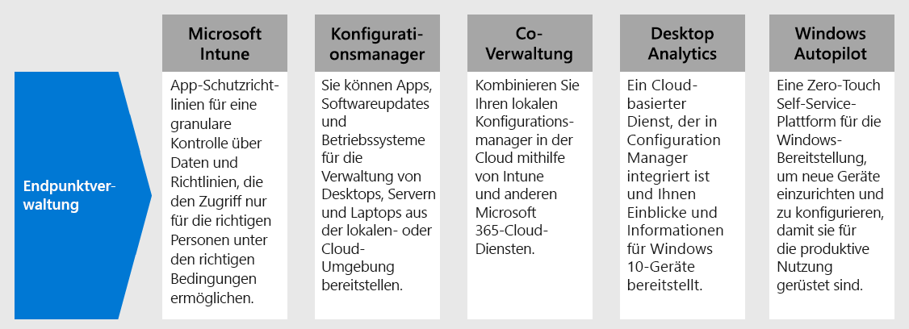

# SCHRITT 3:Step 3. Bereitstellen der Endpunktverwaltung für Ihre Geräte, PCs und andere EndpunkteDeploy endpoint management for your devices, PCs, and other endpoints

Bei Remotemitarbeitern müssen Sie eine wachsende Anzahl von persönlichen Geräten unterstützen.With remote workers, you need to support a growing number of personal devices. Die Endpunktverwaltung ist ein richtlinienbasierter Sicherheitsansatz, bei dem Geräte bestimmte Kriterien erfüllen müssen, bevor sie Zugriff auf Ressourcen erhalten.Endpoint management is a policy-based approach to security that requires devices to comply with specific criteria before they are granted access to resources. Microsoft Endpoint Manager bietet einen modernen Arbeitsplatz und moderne Verwaltungsfunktionen, um Ihre Daten in der Cloud und vor Ort sicher zu halten.Microsoft Endpoint Manager delivers a modern workplace and modern management capabilities to keep your data secure in the cloud and on-premises. 

Endpoint Manager bietet Dienste und Tools für die Verwaltung von mobilen Geräten, Desktop-Computern, virtuellen Maschinen, eingebetteten Geräten und Servern durch die Kombination der folgenden Dienste, die Sie möglicherweise bereits kennen und nutzen.Endpoint Manager provides services and tools for managing mobile devices, desktop computers, virtual machines, embedded devices, and servers by combining the following services you may already know and be using.

## Microsoft IntuneMicrosoft Intune

Intune soll Ihnen helfen, Daten zu schützen, wenn Sie die Geräte, die für den Zugriff auf Unternehmensdaten verwendet werden, nicht verwalten.Intune is designed to help you safeguard data when you don’t manage the devices used to access organization data. Intune App-Schutzrichtlinien in Kombination mit Azure AD Conditional Access bieten granulare Kontrolle über Daten auf mobilen Geräten.Intune app protection policies combined with Azure AD Conditional Access provide granular control over data on mobile devices. Intune ermöglicht es Ihnen auch, umfassende Richtlinien zu definieren, die nur den richtigen Personen unter den richtigen Bedingungen den Zugriff auf Ihre Unternehmensdaten ermöglichen und sicherstellen, dass die Daten geschützt bleiben, indem kontrolliert wird, wie sie innerhalb von Office, Outlook und anderen mobilen Anwendungen verwendet werden.Intune also enables you to define comprehensive policies that allow only the right people under the right conditions to access your company data and ensure the data stays protected by controlling how they use it within Office, Outlook and other mobile apps.

Weitere Informationen finden Sie in dieser [Übersicht über Microsoft Intune](https://docs.microsoft.com/intune/fundamentals/what-is-intune).For more information, see this [overview of Microsoft Intune](https://docs.microsoft.com/intune/fundamentals/what-is-intune).

## Configuration ManagerConfiguration Manager

Configuration Manager ist eine lokale Verwaltungslösung zur Verwaltung von Desktops, Servern und Laptops, die sich in Ihrem Netzwerk oder internetbasiert befinden.Configuration Manager is an on-premises management solution to manage desktops, servers, and laptops that are on your network or internet-based. Sie können es für die Integration mit Intune, Azure AD, Microsoft Defender ATP und anderen Cloud-Diensten in der Cloud aktivieren.You can cloud-enable it to integrate with Intune, Azure AD, Microsoft Defender ATP, and other cloud services. Verwenden Sie Configuration Manager zur Bereitstellung von Anwendungen, Software-Updates und Betriebssystemen.Use Configuration Manager to deploy apps, software updates, and operating systems. Sie können auch die Einhaltung von Vorschriften überwachen, Kunden in Echtzeit abfragen und auf sie einwirken und vieles mehr.You can also monitor compliance, query and act on clients in real time, and much more.

Weitere Informationen finden Sie in dieser [Übersicht über Configuration Manager](https://docs.microsoft.com/mem/configmgr/core/understand/introduction).For more information, see this [overview of Configuration Manager](https://docs.microsoft.com/mem/configmgr/core/understand/introduction).

## Co-ManagementCo-management

Co-Management kombiniert Ihre vorhandenen Investitionen in Configuration Manager vor Ort mit der Cloud unter Verwendung von Intune und anderen Microsoft 365 Cloud-Diensten.Co-management combines your existing on-premises Configuration Manager investment with the cloud using Intune and other Microsoft 365 cloud services. Sie wählen, ob Configuration Manager oder Intune die Verwaltungsautorität für die sieben verschiedenen Arbeitslastgruppen ist.You choose whether Configuration Manager or Intune is the management authority for the seven different workload groups.

Als Teil von Endpoint Manager nutzt das Co-Management Cloud-Funktionen, einschließlich bedingtem Zugriff.As part of Endpoint Manager, co-management uses cloud features, including Conditional Access. Sie behalten einige Aufgaben lokal, während Sie andere Aufgaben mit Intune in der Cloud ausführen.You keep some tasks on-premises, while running other tasks in the cloud with Intune.

Weitere Informationen finden Sie in dieser [Übersicht über Co-Management](https://docs.microsoft.com/mem/configmgr/comanage/overview).For more information, see this [overview of co-management](https://docs.microsoft.com/mem/configmgr/comanage/overview).

## Desktop AnalyticsDesktop Analytics

Desktop Analytics ist ein Cloud-basierter Dienst, der in Configuration Manager integriert ist und Ihnen Einblicke und Informationen liefert, damit Sie fundierte Entscheidungen über Ihre Windows-Clients treffen können.Desktop Analytics is a cloud-based service that integrates with Configuration Manager and provides you with insight and intelligence so you can make informed decisions about your Windows clients. Es kombiniert Daten aus Ihrem Unternehmen mit Daten, die aus Millionen von Geräten aggregiert wurden, die mit Microsoft Cloud Services verbunden sind.It combines data from your organization with data aggregated from millions of devices connected to Microsoft cloud services. Mit Desktop Analytics können Sie ein Inventar der in Ihrem Unternehmen ausgeführten Anwendungen erstellen, die Kompatibilität von Anwendungen mit den neuesten Windows 10-Feature-Updates bewerten, Kompatibilitätsprobleme identifizieren und auf der Grundlage von Einblicken in Cloud-fähige Daten Vorschläge zur Risikominderung erhalten, Pilotgruppen erstellen, welche die gesamte Anwendungs- und Treiberkombination auf einem minimalen Satz von Geräten repräsentieren, und Windows 10 auf pilot- und produktionsverwalteten Geräten bereitstellen.With Desktop Analytics, you can create an inventory of apps running in your organization, assess app compatibility with the latest Windows 10 feature updates, identify compatibility issues, and receive mitigation suggestions based on cloud-enabled data insights, create pilot groups that represent the entire application and driver estate across a minimal set of devices, and deploy Windows 10 to pilot and production-managed devices.

Weitere Informationen finden Sie in dieser [Übersicht über Desktop Analytics](https://docs.microsoft.com/mem/configmgr/desktop-analytics/overview).For more information, see this [overview of Desktop Analytics](https://docs.microsoft.com/mem/configmgr/desktop-analytics/overview)

## Windows AutopilotWindows Autopilot

Windows Autopilot ist eine Self-Service-Plattform für die Bereitstellung von Windows ohne manuelles Eingreifen.Windows Autopilot is a zero-touch, self-service Windows deployment platform. Es ist eine Sammlung von Technologien, mit denen neue Geräte eingerichtet und vorkonfiguriert werden, damit sie für die Nutzung in der Produktion bereit stehen.It includes a collection of technologies used to set up and pre-configure new devices, getting them ready for productive use. Sie können Windows Autopilot auch zum Zurücksetzen, Ändern des Zwecks und Wiederherstellen von Geräten verwenden.You can also use Windows Autopilot to reset, repurpose and recover devices. Diese Lösung versetzt eine IT-Abteilung in die Lage, das zuvor Genannte mithilfe einer geringen bis gar keiner zu verwaltenden Infrastruktur zu erzielen, und das über einen einfachen und schnellen Vorgang.This solution enables an IT department to achieve the above with little to no infrastructure to manage, with a process that's easy and simple. Aus der Sicht des Benutzers sind nur ein paar einfache Vorgänge nötig, um sein Gerät einsatzbereit zu machen.From the user's perspective, it only takes a few simple operations to make their device ready to use. Aus der Sicht der IT-Profis besteht die einzige Interaktion, die vom Endbenutzer verlangt wird, darin, sich mit einem Netzwerk zu verbinden und seine Anmeldeinformationen zu überprüfen.From the IT pro's perspective, the only interaction required from the end user is to connect to a network and to verify their credentials.

Weitere Informationen finden Sie in dieser [Übersicht über Windows Autopilot](https://docs.microsoft.com/windows/deployment/windows-autopilot/windows-autopilot).For more information, see this [overview of Windows Autopilot](https://docs.microsoft.com/windows/deployment/windows-autopilot/windows-autopilot).

## Verwaltung technischer Ressourcen für die EndpunktverwaltungAdmin technical resources for endpoint management

- [Registrieren Sie verwaltete Geräte für die Sicherheit, nutzen Sie Anwendungseinstellungen für nicht verwaltete Geräte und verwenden Sie Geräte- und AnwendungsrichtlinienEnroll managed devices for security, leverage app settings for unmanaged devices, and use device and app policies](https://docs.microsoft.com/microsoft-365/enterprise/mobility-infrastructure)
- [Registrieren verschiedener Gerätetypen für die mobile Geräteverwaltung (MDM)How to enroll different types of devices for mobile device management (MDM)](https://docs.microsoft.com/mem/intune/enrollment/device-enrollment)
- [Informieren Ihrer Endbenutzer über Microsoft IntuneHow to educate your end users about Microsoft Intune](https://docs.microsoft.com/mem/intune/fundamentals/end-user-educate)
 
## Ergebnisse von Schritt 3Results of Step 3

Sie verwenden die Suite der Funktionen und Möglichkeiten von Endpoint Manager, um mobile Geräte, Desktop-Computer, virtuelle Maschinen, eingebettete Geräte und Server zu verwalten.You are using the suite of Endpoint Manager features and capabilities to manage mobile devices, desktop computers, virtual machines, embedded devices, and servers.

## Nächster SchrittNext step

Fahren Sie mit [Schritt 4](empower-people-to-work-remotely-teams-productivity-apps.md) fort, um den Remotezugriff auf lokale Apps und Dienste bereitzustellen.Continue with [Step 4](empower-people-to-work-remotely-teams-productivity-apps.md) to provide remote access to on-premises apps and services.
