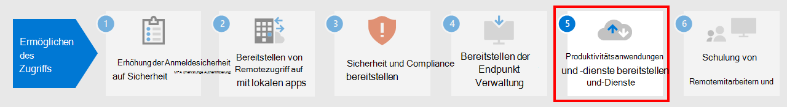

# Schritt 4. Bereitstellen der Endpunktverwaltung für Ihre Geräte, PCs und andere Endpunkte

Bei Remotemitarbeitern müssen Sie eine wachsende Anzahl von persönlichen Geräten unterstützen. Die Endpunktverwaltung ist ein richtlinienbasierter Sicherheitsansatz, bei dem Geräte bestimmte Kriterien erfüllen müssen, bevor sie Zugriff auf Ressourcen erhalten. Microsoft Endpoint Manager bietet moderne Verwaltungsfunktionen, um Ihre Daten in der Cloud und vor Ort sicher zu halten. 

Endpoint Manager bietet Dienste und Tools für die Verwaltung von mobilen Geräten, Desktop-Computern, virtuellen Maschinen, eingebetteten Geräten und Servern durch die Kombination der folgenden Dienste, die Sie möglicherweise bereits kennen und nutzen.

## Microsoft Intune

Microsoft Intune ist ein Cloud-basierter Dienst, der sich auf die Verwaltung mobiler Geräte (MDM) und die mobile Anwendungsverwaltung (MAM) bezieht und ein Bestandteil von Microsoft 365 ist. 

- **MDM:** Sie können über Geräte im Besitz der Organisation die vollständige Kontrolle ausüben, einschließlich der Einstellungen, Features und Sicherheit. Geräte werden in Intune "registriert", wo Sie Intune-Richtlinien mit Regeln und Einstellungen erhalten. Sie können z. b. die Anforderungen für Kennwort und PIN festlegen, eine VPN-Verbindung erstellen, den Bedrohungsschutz einrichten und vieles mehr.

- **MAM:** Remotemitarbeiter möchten möglicherweise nicht, dass Sie die vollständige Kontrolle über ihre persönlichen Geräte haben, auch bekannt als BYOD-Geräte (Bring-your-own Device). Sie können Ihren Remotemitarbeiter Optionen anbieten und Ihre Organisation trotzdem schützen. So können beispielsweise Remotemitarbeiter Ihre Geräte registrieren, wenn Sie Vollzugriff auf die Ressourcen Ihrer Organisation wünschen. Wenn diese Benutzer jedoch nur Zugriff auf E-Mail oder Microsoft Teams haben möchten, verwenden Sie die APP-Schutzrichtlinien, bei denen die mehrstufige Authentifizierung (MFA) erforderlich ist, um diese Apps zu verwenden.

Weitere Informationen finden Sie in dieser [Übersicht über Microsoft Intune](https://docs.microsoft.com/intune/fundamentals/what-is-intune).

## Configuration Manager

Configuration Manager ist eine lokale Verwaltungslösung zur Verwaltung von Desktops, Servern und Laptops, die sich in Ihrem Netzwerk oder internetbasiert befinden. Verwenden Sie Configuration Manager zur Bereitstellung von Anwendungen, Software-Updates und Betriebssystemen. Sie können auch die Einhaltung von Vorschriften überwachen, Kunden in Echtzeit abfragen und auf sie einwirken und vieles mehr. Sie können es für die Integration mit Intune, Azure AD, Microsoft Defender ATP und anderen Cloud-Diensten in der Cloud aktivieren. 

Weitere Informationen finden Sie in dieser [Übersicht über Configuration Manager](https://docs.microsoft.com/mem/configmgr/core/understand/introduction).

## Co-Management

Co-Management kombiniert Ihre vorhandenen Investitionen in Configuration Manager vor Ort mit der Cloud unter Verwendung von Intune und anderen Microsoft 365 Cloud-Diensten. Sie wählen, ob Configuration Manager oder Intune die Verwaltungsautorität für verschiedenen Arbeitslasten ist. 

Das Co-Management verwendet Intune-basierte Cloud-Funktionen, einschließlich bedingtem Zugriff und erzwingen der Gerätekompatibilität. Sie behalten einige Aufgaben lokal, während Sie andere Aufgaben in der Cloud ausführen.

Weitere Informationen finden Sie in dieser [Übersicht über Co-Management](https://docs.microsoft.com/mem/configmgr/comanage/overview).

## Desktop Analytics

Desktop Analytics ist ein Cloud-basierter Dienst, der in Configuration Manager integriert ist und Ihnen Einblicke und Informationen liefert, damit Sie fundierte Entscheidungen über Ihre Windows-Clients treffen können. Es kombiniert Daten aus Ihrem Unternehmen mit Daten, die aus Millionen von Geräten aggregiert wurden, die mit Microsoft Cloud Services verbunden sind. 

Mithilfe von Desktop Analytics können Sie:

- ein Inventar der in Ihrem Unternehmen ausgeführten Anwendungen erstellen.
- die Kompatibilität von Anwendungen mit den neuesten Windows 10-Feature-Updates bewerten.
- Kompatibilitätsprobleme identifizieren und auf der Grundlage von Einblicken in Cloud-fähige Daten Vorschläge zur Risikominderung erhalten.
- Pilotgruppen erstellen, welche die gesamte Anwendungs- und Treiberkombination auf einem minimalen Satz von Geräten repräsentieren.
- Windows 10 auf pilot- und produktionsverwalteten Geräten bereitstellen.

Weitere Informationen finden Sie in dieser [Übersicht über Desktop Analytics](https://docs.microsoft.com/mem/configmgr/desktop-analytics/overview).

## Windows Autopilot

Windows Autopilot ist eine Self-Service-Plattform für die Bereitstellung von Windows ohne manuelles Eingreifen. Es ist eine Sammlung von Technologien, mit denen neue Geräte eingerichtet und vorkonfiguriert werden, damit sie für die Nutzung in der Produktion bereit stehen. Sie können Windows Autopilot auch zum Zurücksetzen, Ändern des Zwecks und Wiederherstellen von Geräten verwenden. 

Windows Autopilot versetzt eine IT-Abteilung in die Lage, Geräte mithilfe einer geringen bis gar keiner zu verwaltenden Infrastruktur vorzukonfigurieren, und das über einen einfachen und schnellen Vorgang. 

- Aus der Sicht des Benutzers sind nur ein paar einfache Vorgänge nötig, um sein Gerät einsatzbereit zu machen. 
- Aus der Sicht der IT-Profis besteht die einzige Interaktion, die vom Endbenutzer verlangt wird, darin, sich mit einem Netzwerk zu verbinden und seine Anmeldeinformationen zu überprüfen.

Weitere Informationen finden Sie in dieser [Übersicht über Windows Autopilot](https://docs.microsoft.com/windows/deployment/windows-autopilot/windows-autopilot).

## Verwaltung technischer Ressourcen für die Endpunktverwaltung

- [Teil 3: Video über die Verwaltung von Windows 10-Geräten für Remotemitarbeiter](https://resources.techcommunity.microsoft.com/enabling-remote-work/#security)
- [Teil 5: Video über die Verwaltung von Benutzerdesktops und Browsern für Remotemitarbeiter](https://resources.techcommunity.microsoft.com/enabling-remote-work/#security)
- [Bereitstellen einer Mobilitätsinfrastruktur für Microsoft 365](https://docs.microsoft.com/microsoft-365/enterprise/mobility-infrastructure)
- [Registrieren verschiedener Gerätetypen für die mobile Geräteverwaltung](https://docs.microsoft.com/mem/intune/enrollment/device-enrollment)
- [Informieren Ihrer Endbenutzer über Microsoft Intune](https://docs.microsoft.com/mem/intune/fundamentals/end-user-educate)
 
## Ergebnisse von Schritt 3

Sie verwenden die Suite der Funktionen und Möglichkeiten von Endpoint Manager, um mobile Geräte, Desktop-Computer, virtuelle Maschinen, eingebettete Geräte und Server zu verwalten.

## Nächster Schritt

Fahren Sie mit [Schritt 5](empower-people-to-work-remotely-teams-productivity-apps.md) fort, um Ihre Remotemitarbeiter mit Microsoft 365 Produktivitäts-Apps wie Microsoft Teams auszustatten.
