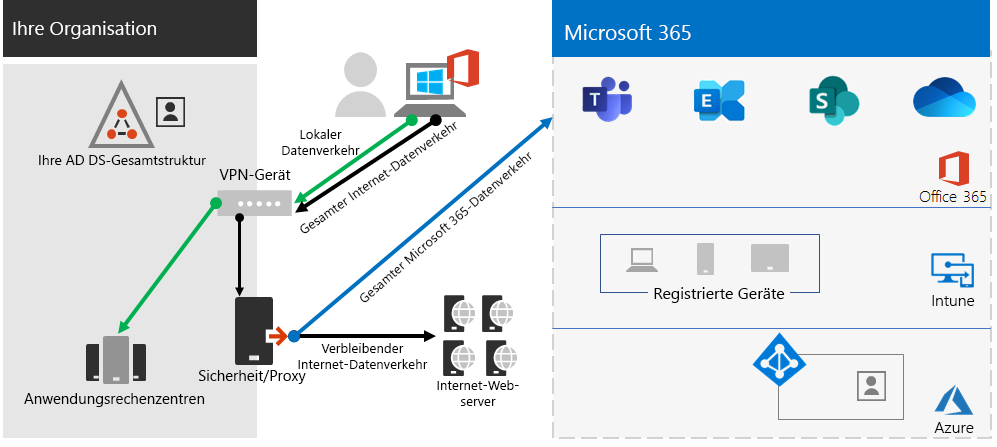
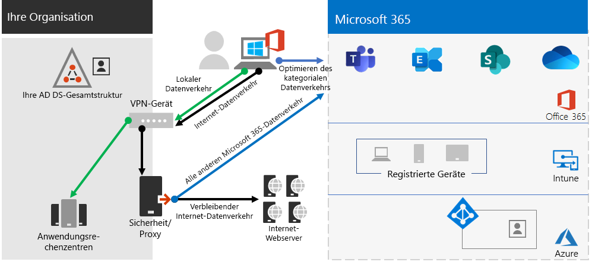
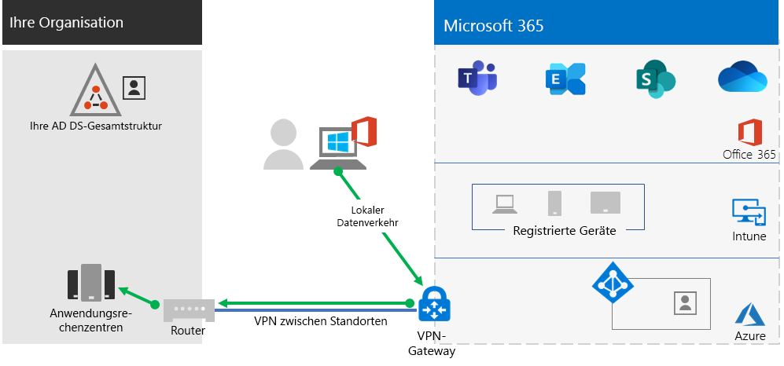
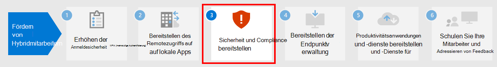

# Schritt 2: Bereitstellung des Remotezugriffs auf lokale Apps und Dienste

Wenn Ihre Organisation eine VPN-Lösung für den Remotezugriff verwendet, die in der Regel VPN-Servern am Rande des Netzwerks und VPN-Clients umfasst, die auf den Geräten Ihrer Benutzer installiert sind, können Ihre Benutzer VPN-Verbindungen für den Remotezugriff auf lokale Apps und Server verwenden. Möglicherweise müssen Sie jedoch den Datenverkehr zu den cloudbasierten Diensten von Microsoft 365 optimieren.

Wenn Ihre Benutzer keine VPN-Lösung verwenden, können Sie Azure Active Directory (Azure AD)-Anwendungs-Proxy und Azure-Punkt-zu-Standort-VPN (P2S) verwenden, um den Zugriff bereitzustellen, je nachdem, ob alle Ihre Apps webbasiert sind.

Das sind die primären Konfigurationen für den Remotezugriff:

- Sie verwenden bereits eine VPN-Lösung für den Remotezugriff.
- Sie verwenden keine RAS-VPN-Lösung und Sie möchten, dass Ihre Remotemitarbeiter Ihre eigenen Computer verwenden.
- Sie verwenden keine VPN-Lösung für den Remotezugriff, Sie verfügen über eine hybride Identität und Sie benötigen Remotezugriff nur für lokale webbasierte Apps.
- Sie verwenden keine VPN-Lösung für den Remotezugriff und Sie benötigen Zugriff auf lokale Apps, von denen einige nicht webbasiert sind.

In diesem Flussdiagramm sehen Sie die Konfigurationsoptionen des Remotezugriffs, die in diesem Artikel erläutert werden.

Bei Remotezugriffsverbindungen können Sie auch [Remotedesktop](https://support.microsoft.com/help/4028379/windows-10-how-to-use-remote-desktop) verwenden, um Ihre Benutzer mit einem lokalen PC zu verbinden. So können beispielsweise Remotemitarbeiter Remotedesktop verwenden, um eine Verbindung mit dem PC in ihrem Büro über ihre Windows-, IOS- oder Android-Gerät herzustellen. Sobald sie per Fernzugriff verbunden sind, können sie diese verwenden, als säßen sie davor.

## Optimieren der Leistung von VPN-Clients für den Remotezugriff auf Microsoft 365-Clouddienste

Wenn Ihre Remotemitarbeiter einen herkömmlichen VPN-Client für den Remotezugriff auf Ihr Organisationsnetzwerk verwenden, überprüfen Sie, ob der VPN-Client geteilte Tunnel unterstützt.

Ohne geteilte Tunnel wird der gesamte Datenverkehr im Rahmend er Remotearbeit über die VPN-Verbindung gesendet, wo er an die Geräte am Rande Ihrer Organisation weitergeleitet, verarbeitet und dann im Internet gesendet werden muss.

Der Microsoft 365-Datenverkehr muss eine indirekte Route durch Ihre Organisation nehmen, die zu einem Microsoft-Netzwerkeintrittspunkt weit entfernt vom physischen Standort des VPN-Clients weitergeleitet werden könnte. Dieser indirekte Pfad erhöht die Latenz des Netzwerkverkehrs und verringert die Gesamtleistung. 

Mit geteilten Tunneln können Sie Ihren VPN-Client so konfigurieren, dass bestimmte Typen von Datenverkehr von der Übertragung über die VPN-Verbindung zum Unternehmensnetzwerk ausgeschlossen werden.

Um den Zugriff auf Microsoft 365-Cloudressourcen zu optimieren, konfigurieren Sie die VPN-Clients für geteilte Tunneln so, dass der Datenverkehr an die Endpunkte der **Optimieren**-Kategorie von Microsoft 365 über die VPN-Verbindung ausgeschlossen ist. Weitere Informationen finden Sie unter [Office 365 Endpunkt-Kategorien](https://docs.microsoft.com/microsoft-365/enterprise/microsoft-365-network-connectivity-principles#new-office-365-endpoint-categories). Sehen Sie sich [diese Liste](https://docs.microsoft.com/microsoft-365/enterprise/urls-and-ip-address-ranges) der Endpunkte der Kategorie „Optimieren“ an.

Hier sehen Sie den resultierenden Datenverkehrsfluss, bei dem der größte Teil des Datenverkehrs an Microsoft 365-Cloud-Apps die VPN-Verbindung umgehen kann.

Auf diese Weise kann der VPN-Client wichtigen Datenverkehr innerhalb des Microsoft 365-Clouddienstes direkt über das Internet und zum nächstgelegenen Einstiegspunkt ins Microsoft-Netzwerk senden und empfangen.

Weitere Informationen und eine Anleitung finden Sie unter[Optimieren der Office 365-Konnektivität für Remotebenutzer mithilfe von geteilten VPN-Tunneln](https://docs.microsoft.com/microsoft-365/enterprise/microsoft-365-vpn-split-tunnel??).

## Remotezugriff bereitstellen, wenn alle Ihre Apps Web-Apps sind und Sie über eine hybride Identität verfügen

Wenn Ihre Remotemitarbeiter keinen herkömmlichen VPN-Client verwenden und ihre lokalen Benutzerkonten und -gruppen mit Azure AD synchronisiert werden, können Sie Azure AD-Anwendungsproxy verwenden, um einen sicheren Remotezugriff für webbasierte Anwendungen zu gewährleisten, die auf lokalen Servern gehostet werden. Webbasierte Anwendungen umfassen SharePoint Server-Websites, Outlook Web Access-Server oder beliebige andere webbasierte Branchenanwendungen. 

Hier sind die Komponenten des Azure AD-Anwendungsproxys.

Weitere Informationen finden Sie in dieser [Übersicht über den Azure AD-Anwendungsproxy](https://docs.microsoft.com/azure/active-directory/manage-apps/application-proxy).

>[!Note]
>Der Azure AD-Anwendungsproxy ist in einem Microsoft 365-Abonnement nicht enthalten. Sie müssen die Nutzung mit einem separaten Azure-Abonnement bezahlen.
>

## Remotezugriff bereitstellen, wenn nicht alle Ihre Apps Web-Apps sind

Wenn Ihre Remotemitarbeiter keinen herkömmlichen VPN-Client verwenden und Sie über Apps verfügen, die nicht webbasiert ist, können Sie ein Azure-Punkt-zu-Standort-VPN (P2S) verwenden.

Eine P2S-VPN-Verbindung erstellt eine sichere Verbindung vom Gerät eines Remotemitarbeiters zu Ihrem Organisationsnetzwerk über ein virtuelles Azure-Netzwerk. 

Weitere Informationen finden Sie in dieser [Übersicht über P2S-VPN](https://docs.microsoft.com/azure/vpn-gateway/point-to-site-about).

>[!Note]
>Der Azure P2S VPN ist in einem Microsoft 365-Abonnement nicht enthalten. Sie müssen die Nutzung mit einem separaten Azure-Abonnement bezahlen.
>

## Bereitstellen von Windows Virtual Desktop zur Gewährleistung des Remotezugriffs für Mitarbeiter auf persönlichen Geräten 

Nutzen Sie zur Unterstützung von Remotemitarbeitern, die nur Ihre persönlichen und nicht verwalteten Geräte verwenden können, Windows Virtual Desktop in Azure, um virtuelle Desktops für Ihre Benutzer zu erstellen und zuzuweisen, die sie von zu Hause aus nutzen können. Virtualisierte PCs können sich genauso wie PCs verhalten, die mit Ihrem Unternehmensnetzwerk verbunden sind.

Weitere Informationen finden Sie in dieser [Übersicht über Windows Virtual Desktop](https://docs.microsoft.com/azure/virtual-desktop/overview). 

>[!Note]
>Windows Virtual Desktop ist in einem Microsoft 365-Abonnement nicht enthalten. Sie müssen die Nutzung mit einem separaten Azure-Abonnement bezahlen.
>

## Schützen der Remotedesktopdienste-Verbindungen mit dem Remotedesktopdienste-Gateway

Wenn Sie Remotedesktopdienste (Remote Desktop Services, RDS) verwenden, um Mitarbeitern das Herstellen einer Verbindung mit Windows-basierten Computern in Ihrem lokalen Netzwerk zu ermöglichen, sollten Sie ein Microsoft Remotedesktopdienste-Gateway in Ihrem Microsoft Edge-Netzwerk verwenden. Das Gateway verwendet Secure Sockets Layer (SSL) zum Verschlüsseln der Kommunikation, und es wird verhindert, dass der lokale Computer, auf dem RDS gehostet wird, direkt über das Internet verfügbar gemacht wird.

Weitere Informationen finden Sie in [diesem](https://www.microsoft.com/security/blog/2020/04/16/security-guidance-remote-desktop-adoption/) Artikel.

## Verwaltung technischer Ressourcen für den Remotezugriff

- [Den Office 365-Datenverkehr für Remotemitarbeiter schnell optimieren & die Auslastung Ihrer Infrastruktur verringern](https://techcommunity.microsoft.com/t5/office-365-blog/how-to-quickly-optimize-office-365-traffic-for-remote-staff-amp/ba-p/1214571)
- [Optimieren der Office 365-Konnektivität für Remotebenutzer mithilfe eines geteilten VPN-Tunnels](https://docs.microsoft.com/microsoft-365/enterprise/microsoft-365-vpn-split-tunnel?)

## Ergebnisse von Schritt 2

Nach der Bereitstellung einer Remotezugriffslösung für Ihre Remotemitarbeiter:

| Konfiguration des Remotezugriffs | Ergebnisse |
|:-------|:-----|
| Eine VPN-Lösung für den Remotezugriff ist eingerichtet | Sie haben den VPN-Client für den Remotezugriff für geteilten Tunnel und für die Kategorie „Optimieren“ von Microsoft 365-Endpunkten konfiguriert. |
| Keine VPN-Lösung für den Remotezugriff und Sie benötigen Remotezugriff nur für lokale webbasierte Apps | Sie haben Azure-Anwendungsproxy konfiguriert. |
| Keine VPN-Lösung für den Remotezugriff und Sie benötigen Zugriff auf lokale Apps, von denen einige nicht webbasiert sind | Sie haben Azure P2S-VPN konfiguriert. |
| Remotemitarbeiter verwenden Ihre privaten Geräte von zu Hause aus | Sie haben Windows Virtual Desktop konfiguriert. |
| Remotemitarbeiter verwenden RDS-Verbindungen zu lokalen Systemen. | Sie haben in Ihrem Microsoft Edge-Netzwerk ein Remotedesktopdienste-Gateway bereitgestellt. |
|||

## Nächster Schritt

Fahren Sie mit [Schritt 3](empower-people-to-work-remotely-security-compliance.md) fort, um die Sicherheits- und Compliance-Dienste von Microsoft 365 zum Schutz Ihrer Apps, Daten und Geräte für Remotemitarbeiter bereitzustellen.

