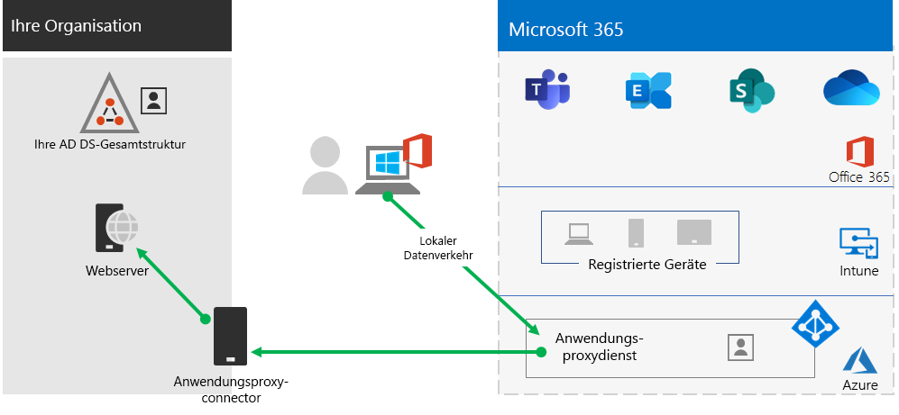

# Schritt 2: Bereitstellung des Remotezugriffs auf lokale Apps und DiensteStep 2. Provide remote access to on-premises apps and services

Wenn Ihre Organisation eine VPN-Lösung für den Remotezugriff verwendet, die in der Regel VPN-Server am Rande des Netzwerks und VPN-Clients umfasst, die auf den Geräten Ihrer Benutzer installiert sind, können Ihre Benutzer VPN-Verbindungen für den Remotezugriff auf lokale Apps und Server verwenden. Möglicherweise müssen Sie jedoch den Datenverkehr zu Microsoft 365 cloudbasierten Diensten optimieren.If your organization uses a remote access VPN solution, typically with VPN servers on the edge of your network and VPN clients installed on your users' devices, your users can use remote access VPN connections to access on-premises apps and servers. But you may need to optimize traffic to Microsoft 365 cloud-based services.

Wenn Ihre Benutzer keine VPN-Lösung verwenden, können Sie Azure Active Directory (Azure AD)-Anwendungs-Proxy und Azure-Punkt-zu-Standort-VPN (P2S) verwenden, um den Zugriff bereitzustellen, je nachdem, ob alle Ihre Apps webbasiert sind.If your users do not use a VPN solution, you can use Azure Active Directory (Azure AD) Application Proxy and Azure Point-to-Site (P2S) VPN to provide access, depending on whether all your apps are web-based.

Das sind die primären Konfigurationen für den Remotezugriff:Here are the primary configurations for remote access:

- Sie verwenden bereits eine VPN-Lösung für den Remotezugriff.You are already using a remote access VPN solution.
- Sie verwenden keine RAS-VPN-Lösung und Sie möchten, dass Ihre Remotemitarbeiter Ihre eigenen Computer verwenden.You are not using a remote access VPN solution and you want your remote workers to use their personal computers.
- Sie verwenden keine VPN-Lösung für den Remotezugriff, Sie verfügen über eine hybride Identität und Sie benötigen Remotezugriff nur für lokale webbasierte Apps.You are not using a remote access VPN solution, you have hybrid identity, and you need remote access only to on-premises web-based apps.
- Sie verwenden keine VPN-Lösung für den Remotezugriff und Sie benötigen Zugriff auf lokale Apps, von denen einige nicht webbasiert sind.You are not using a remote access VPN solution and you need access to on-premises apps, some of which are not web-based.

In diesem Flussdiagramm sehen Sie die Konfigurationsoptionen des Remotezugriffs, die in diesem Artikel erläutert werden.See this flowchart for the remote access configuration options discussed in this article.

Bei Remotezugriffsverbindungen können Sie auch [Remotedesktop](https://support.microsoft.com/help/4028379/windows-10-how-to-use-remote-desktop) verwenden, um Ihre Benutzer mit einem lokalen PC zu verbinden.With remote access connections, you can also use [Remote Desktop](https://support.microsoft.com/help/4028379/windows-10-how-to-use-remote-desktop) to connect your users to an on-premises PC. So können beispielsweise Remotemitarbeiter Remotedesktop verwenden, um eine Verbindung mit dem PC in ihrem Büro über ihre Windows-, IOS- oder Android-Gerät herzustellen.For example, a remote worker can use Remote Desktop to connect to the PC in their office from their Windows, iOS, or Android device. Sobald sie per Fernzugriff verbunden sind, können sie diese verwenden, als säßen sie davor.Once they are remotely connected, they can use it as if they were sitting in front of it.

## Optimieren der Leistung von VPN-Clients für den Remotezugriff auf Microsoft 365-ClouddiensteOptimize performance for remote access VPN clients to Microsoft 365 cloud services

Wenn Ihre Remotemitarbeiter einen herkömmlichen VPN-Client für den Remotezugriff auf Ihr Organisationsnetzwerk verwenden, überprüfen Sie, ob der VPN-Client geteilte Tunnel unterstützt.If your remote workers are using a traditional VPN client to obtain remote access to your organization network, verify that the VPN client has split tunneling support.

Ohne geteilte Tunnel wird der gesamte Datenverkehr im Rahmend er Remotearbeit über die VPN-Verbindung gesendet, wo er an die Geräte am Rande Ihrer Organisation weitergeleitet, verarbeitet und dann im Internet gesendet werden muss.Without split tunneling, all of your remote work traffic gets sent across the VPN connection, where it must be forwarded to your organization’s edge devices, get processed, and then sent on the Internet.

Microsoft 365-Datenverkehr muss eine indirekte Route durch Ihre Organisation nehmen, die an einen Microsoft-Netzwerkeinstiegspunkt weit vom physischen Standort des VPN-Clients weitergeleitet werden kann. Dieser indirekte Pfad erhöht die Latenz des Netzwerkdatenverkehrs und verringert die Gesamtleistung.Microsoft 365 traffic must take an indirect route through your organization, which could be forwarded to a Microsoft network entry point far away from the VPN client’s physical location. This indirect path adds latency to the network traffic and decreases overall performance.

Mit geteilten Tunneln können Sie Ihren VPN-Client so konfigurieren, dass bestimmte Typen von Datenverkehr von der Übertragung über die VPN-Verbindung zum Unternehmensnetzwerk ausgeschlossen werden.With split tunneling, you can configure your VPN client to exclude specific types of traffic from being sent over the VPN connection to the organization network.

Um den Zugriff auf Microsoft 365-Cloudressourcen zu optimieren, konfigurieren Sie die VPN-Clients für geteilte Tunneln so, dass der Datenverkehr an die Endpunkte der **Optimieren**-Kategorie von Microsoft 365 über die VPN-Verbindung ausgeschlossen ist.To optimize access to Microsoft 365 cloud resources, configure your split tunneling VPN clients to exclude traffic to the **Optimize** category Microsoft 365 endpoints over the VPN connection. Weitere Informationen finden Sie unter [Office 365 Endpunkt-Kategorien](../enterprise/microsoft-365-network-connectivity-principles.md#new-office-365-endpoint-categories).For more information, see [Office 365 endpoint categories](../enterprise/microsoft-365-network-connectivity-principles.md#new-office-365-endpoint-categories). Sehen Sie sich [diese Liste](../enterprise/urls-and-ip-address-ranges.md) der Endpunkte der Kategorie „Optimieren“ an.See [this list](../enterprise/urls-and-ip-address-ranges.md) of Optimize category endpoints.

Hier sehen Sie den resultierenden Datenverkehrsfluss, bei dem der größte Teil des Datenverkehrs an Microsoft 365-Cloud-Apps die VPN-Verbindung umgehen kann.Here is the resulting traffic flow, in which most of the traffic to Microsoft 365 cloud apps bypass the VPN connection.

Auf diese Weise kann der VPN-Client wichtigen Datenverkehr innerhalb des Microsoft 365-Clouddienstes direkt über das Internet und zum nächstgelegenen Einstiegspunkt ins Microsoft-Netzwerk senden und empfangen.This allows the VPN client to send and receive crucial Microsoft 365 cloud service traffic directly over the Internet and to the nearest entry point into the Microsoft network.

Weitere Informationen und eine Anleitung finden Sie unter[Optimieren der Office 365-Konnektivität für Remotebenutzer mithilfe von geteilten VPN-Tunneln](../enterprise/microsoft-365-vpn-split-tunnel.md).For more information and guidance, see [Optimize Office 365 connectivity for remote users using VPN split tunneling](../enterprise/microsoft-365-vpn-split-tunnel.md).

## Remotezugriff bereitstellen, wenn alle Ihre Apps Web-Apps sind und Sie über eine hybride Identität verfügenDeploy remote access when all your apps are web apps and you have hybrid identity

Wenn Ihre Remotemitarbeiter keinen herkömmlichen VPN-Client verwenden und Ihre lokalen Benutzerkonten und Gruppen mit Azure AD synchronisiert werden, können Sie Azure AD-Anwendungsproxy verwenden, um sicheren Remotezugriff für webbasierte Anwendungen bereitzustellen, die auf lokalen Servern gehostet werden. Zu webbasierten Anwendungen gehören SharePoint Server-Websites, Outlook Webzugriff-Server oder andere webbasierte Geschäftsanwendungen.If your remote workers are not using a traditional VPN client and your on-premises user accounts and groups are synchronized with Azure AD, you can use Azure AD Application Proxy to provide secure remote access for web-based applications hosted on on-premises servers. Web-based applications include SharePoint Server sites, Outlook Web Access servers, or any other web-based line of business applications.

Hier sind die Komponenten des Azure AD-Anwendungsproxys.Here are the components of Azure AD Application Proxy.

Weitere Informationen finden Sie in dieser [Übersicht über den Azure AD-Anwendungsproxy](/azure/active-directory/manage-apps/application-proxy).For more information, see this [overview of Azure AD Application Proxy](/azure/active-directory/manage-apps/application-proxy).

> [!NOTE]
> Der Azure AD-Anwendungsproxy ist in einem Microsoft 365-Abonnement nicht enthalten.Azure AD Application Proxy is not included with a Microsoft 365 subscription. Sie müssen die Nutzung mit einem separaten Azure-Abonnement bezahlen.You must pay for usage with a separate Azure subscription.

## Remotezugriff bereitstellen, wenn nicht alle Ihre Apps Web-Apps sindDeploy remote access when not all your apps are web apps

Wenn Ihre Remotemitarbeiter keinen herkömmlichen VPN-Client verwenden und Sie über Apps verfügen, die nicht webbasiert ist, können Sie ein Azure-Punkt-zu-Standort-VPN (P2S) verwenden.If your remote workers are not using a traditional VPN client and you have apps that are not web-based, you can use an Azure Point-to-Site (P2S) VPN.

Eine P2S-VPN-Verbindung erstellt eine sichere Verbindung vom Gerät eines Remotemitarbeiters zu Ihrem Organisationsnetzwerk über ein virtuelles Azure-Netzwerk.A P2S VPN connection creates a secure connection from a remote worker’s device to your organization network through an Azure virtual network.

Weitere Informationen finden Sie in dieser [Übersicht über P2S-VPN](/azure/vpn-gateway/point-to-site-about).For more information, see this [overview of P2S VPN](/azure/vpn-gateway/point-to-site-about).

> [!NOTE]
> Der Azure P2S VPN ist in einem Microsoft 365-Abonnement nicht enthalten.Azure P2S VPN is not included with a Microsoft 365 subscription. Sie müssen die Nutzung mit einem separaten Azure-Abonnement bezahlen.You must pay for usage with a separate Azure subscription.

## Bereitstellen von Windows Virtual Desktop zur Gewährleistung des Remotezugriffs für Mitarbeiter auf persönlichen GerätenDeploy Windows Virtual Desktop to provide remote access for remote workers using personal devices

Um Remotemitarbeiter zu unterstützen, die nur ihre persönlichen und nicht verwalteten Geräte verwenden können, verwenden Sie Windows Virtual Desktop in Azure, um virtuelle Desktops zu erstellen und zuzuordnen, die Ihre Benutzer von zu Hause aus verwenden können. Virtualisierte PCs können wie PCs fungieren, die mit Ihrem Organisationsnetzwerk verbunden sind.To support remote workers who can only use their personal and unmanaged devices, use Windows Virtual Desktop in Azure to create and allocate virtual desktops for your users to use from home. Virtualized PCs can act just like PCs connected to your organization network.

Weitere Informationen finden Sie in dieser [Übersicht über Windows Virtual Desktop](/azure/virtual-desktop/overview).For more information, see this [overview of Windows Virtual Desktop](/azure/virtual-desktop/overview).

> [!NOTE]
>Windows Virtual Desktop ist in einem Microsoft 365-Abonnement nicht enthalten.Windows Virtual Desktop is not included with a Microsoft 365 subscription. Sie müssen die Nutzung mit einem separaten Azure-Abonnement bezahlen.You must pay for usage with a separate Azure subscription.

## Schützen der Remotedesktopdienste-Verbindungen mit dem Remotedesktopdienste-GatewayProtect your Remote Desktop Services connections with the Remote Desktop Services Gateway

Wenn Sie Remotedesktopdienste (Remote Desktop Services, RDS) verwenden, um Mitarbeitern das Herstellen einer Verbindung mit Windows-basierten Computern in Ihrem lokalen Netzwerk zu ermöglichen, sollten Sie ein Microsoft Remotedesktopdienste-Gateway in Ihrem Microsoft Edge-Netzwerk verwenden.If you are using Remote Desktop Services (RDS) to allow employees to connect into Windows-based computers on your on-premises network, you should use a Microsoft Remote Desktop Services gateway in your edge network. Das Gateway verwendet Transport Layer Security (TLS) zum Verschlüsseln des Datenverkehrs, und es wird verhindert, dass der lokale Computer, auf dem RDS gehostet wird, direkt über das Internet verfügbar gemacht wird.The gateway uses Transport Layer Security (TLS) to encrypt traffic and prevents the on-premises computer hosting RDS from being directly exposed to the Internet.

Weitere Informationen finden Sie in [diesem](https://www.microsoft.com/security/blog/2020/04/16/security-guidance-remote-desktop-adoption/) Artikel.See [this article](https://www.microsoft.com/security/blog/2020/04/16/security-guidance-remote-desktop-adoption/) for more information.

## Verwaltung technischer Ressourcen für den RemotezugriffAdmin technical resources for remote access

- [Den Office 365-Datenverkehr für Remotemitarbeiter schnell optimieren & die Auslastung Ihrer Infrastruktur verringernHow to quickly optimize Office 365 traffic for remote staff & reduce the load on your infrastructure](https://techcommunity.microsoft.com/t5/office-365-blog/how-to-quickly-optimize-office-365-traffic-for-remote-staff-amp/ba-p/1214571)
- [Optimieren der Office 365-Konnektivität für Remotebenutzer mithilfe eines geteilten VPN-TunnelsOptimize Office 365 connectivity for remote users using VPN split tunneling](../enterprise/microsoft-365-vpn-split-tunnel.md)

## Ergebnisse von Schritt 2Results of Step 2

Nach der Bereitstellung einer Remotezugriffslösung für Ihre Remotemitarbeiter:After deployment of a remote access solution for your remote workers:

| Konfiguration des RemotezugriffsRemote access configuration | ErgebnisseResults |
|:-------|:-----|
| Eine VPN-Lösung für den Remotezugriff ist eingerichtetA remote access VPN solution is in place | Sie haben den VPN-Client für den Remotezugriff für geteilten Tunnel und für die Kategorie „Optimieren“ von Microsoft 365-Endpunkten konfiguriert.You have configured your remote access VPN client for split tunneling and for the Optimize category of Microsoft 365 endpoints. |
| Keine VPN-Lösung für den Remotezugriff und Sie benötigen Remotezugriff nur für lokale webbasierte AppsNo remote access VPN solution and you need remote access only to on-premises web-based apps | Sie haben Azure-Anwendungsproxy konfiguriert.You have configured Azure Application Proxy. |
| Keine VPN-Lösung für den Remotezugriff und Sie benötigen Zugriff auf lokale Apps, von denen einige nicht webbasiert sindNo remote access VPN solution and you need access to on-premises apps, some of which are not web-based | Sie haben Azure P2S-VPN konfiguriert.You have configured Azure P2S VPN. |
| Remotemitarbeiter verwenden Ihre privaten Geräte von zu Hause ausRemote workers are using their personal devices from home | Sie haben Windows Virtual Desktop konfiguriert.You have configured Windows Virtual Desktop. |
| Remotemitarbeiter verwenden RDS-Verbindungen zu lokalen Systemen.Remote workers are using RDS connections to on-premises systems | Sie haben in Ihrem Microsoft Edge-Netzwerk ein Remotedesktopdienste-Gateway bereitgestellt.You have deployed a Remote Desktop Services gateway in your edge network. |
|||

## Nächster SchrittNext step

Fahren Sie mit [Schritt 3](empower-people-to-work-remotely-security-compliance.md) fort, um die Sicherheits- und Compliance-Dienste von Microsoft 365 zum Schutz Ihrer Apps, Daten und Geräte für Remotemitarbeiter bereitzustellen.Continue with [Step 3](empower-people-to-work-remotely-security-compliance.md) to deploy Microsoft 365 security and compliance services to protect your apps, data, and devices.