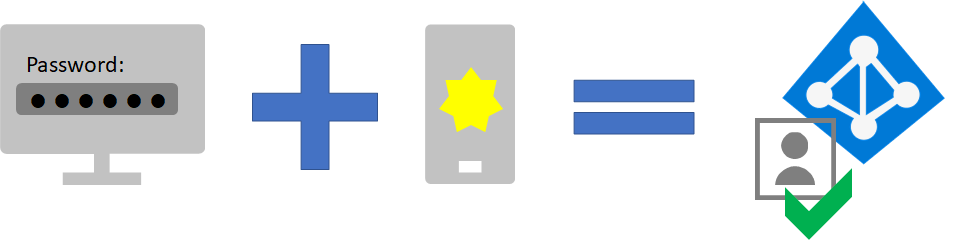

# Schritt 1.Step 1. Erhöhen Sie die Anmeldesicherheit für Remote-Mitarbeiter mit MFAIncrease sign-in security for remote workers with MFA

Verwenden Sie die Mehrstufige Authentifizierung (MFA), um die Sicherheit der Anmeldungen Ihrer Remote-Mitarbeiter zu erhöhen.To increase the security of sign-ins of your remote workers, use multi-factor authentication (MFA). MFA erfordert, dass Nutzeranmeldungen einer zusätzlichen Überprüfung unterzogen werden, die über das Kennwort des Nutzerkontos hinausgeht.MFA requires that user sign-ins be subject to an additional verification beyond the user account password. Selbst wenn ein böswilliger Nutzer ein Nutzerkontokennwort ermittelt, muss er in der Lage sein, auf eine zusätzliche Überprüfung zu antworten, z. B. eine Textnachricht, die an ein Smartphone gesendet wird, bevor der Zugriff gewährt wird.Even if a malicious user determines a user account password, they must also be able to respond to an additional verification, such as a text message sent to a smartphone before access is granted.

Für alle Nutzer, einschließlich Remote-Mitarbeiter und insbesondere Administratoren, empfiehlt Microsoft dringend MFA.For all users, including remote workers and especially admins, Microsoft strongly recommends MFA.

Es gibt drei Möglichkeiten, von Ihren Nutzern die Verwendung von MFA basierend auf Ihrem Microsoft 365-Plan zu verlangen.There are three ways to require your users to use MFA based on your Microsoft 365 plan.

|PlanPlan  |EmpfehlungRecommendation  |
|---------|---------|
|Alle Microsoft 365-Pläne (ohne Azure AD Premium P1- oder P2-Lizenzen)All Microsoft 365 plans (without Azure AD Premium P1 or P2 licenses)     |[Aktivieren Sie die Sicherheitsstandards in Azure AD](https://docs.microsoft.com/azure/active-directory/fundamentals/concept-fundamentals-security-defaults).[Enable Security defaults in Azure AD](https://docs.microsoft.com/azure/active-directory/fundamentals/concept-fundamentals-security-defaults). Zu den Sicherheitsstandards in Azure AD gehört MFA für Nutzer und Administratoren.Security defaults in Azure AD include MFA for users and administrators.   |
|Microsoft 365 E3 (einschließlich Azure AD Premium P1-Lizenzen)Microsoft 365 E3 (includes Azure AD Premium P1 licenses)     | Verwenden Sie [Allgemeine Richtlinien für den bedingten Zugriff](https://docs.microsoft.com/azure/active-directory/conditional-access/concept-conditional-access-policy-common), um die folgenden Richtlinien zu konfigurieren:Use [Common Conditional Access policies](https://docs.microsoft.com/azure/active-directory/conditional-access/concept-conditional-access-policy-common) to configure the following policies:  - [MFA für Administratoren erforderlich](https://docs.microsoft.com/azure/active-directory/conditional-access/howto-conditional-access-policy-admin-mfa)- [Require MFA for administrators](https://docs.microsoft.com/azure/active-directory/conditional-access/howto-conditional-access-policy-admin-mfa)  - [MFA für alle Nutzer erforderlich](https://docs.microsoft.com/azure/active-directory/conditional-access/howto-conditional-access-policy-all-users-mfa)- [Require MFA for all users](https://docs.microsoft.com/azure/active-directory/conditional-access/howto-conditional-access-policy-all-users-mfa)   - [Blockieren von Legacy-Authentifizierung](https://docs.microsoft.com/azure/active-directory/conditional-access/howto-conditional-access-policy-block-legacy)- [Block legacy authentication](https://docs.microsoft.com/azure/active-directory/conditional-access/howto-conditional-access-policy-block-legacy)       |
|Microsoft 365 E5 (einschließlich Azure AD Premium P2-Lizenzen)Microsoft 365 E5 (includes Azure AD Premium P2 licenses)     | Nutzen Sie den Azure AD-Identity Protection, beginnen Sie mit der Implementierung des von Microsoft [empfohlenen Satzes von bedingtem Zugriff und zugehörigen Richtlinien](../enterprise/identity-access-policies.md), indem Sie die folgenden 2 Richtlinien nutzen:Taking advantage of Azure AD Identity Protection, begin to implement Microsoft's [recommended set of conditional access and related policies](../enterprise/identity-access-policies.md) by creating these two policies:  - [MFA erforderlich, wenn das Anmelderisiko mittel oder hoch ist](../enterprise/identity-access-policies.md#require-mfa-based-on-sign-in-risk)- [Require MFA when sign-in risk is medium or high](../enterprise/identity-access-policies.md#require-mfa-based-on-sign-in-risk)  - [Blockieren von Clients, die die moderne Authentifizierung nicht unterstützen](../enterprise/identity-access-policies.md#block-clients-that-dont-support-modern-authentication)- [Block clients that don't support modern authentication](../enterprise/identity-access-policies.md#block-clients-that-dont-support-modern-authentication) - [Nutzer mit hohem Risiko müssen das Kennwort ändern](../enterprise/identity-access-policies.md#high-risk-users-must-change-password)- [High risk users must change password](../enterprise/identity-access-policies.md#high-risk-users-must-change-password)       |
| | |

## SicherheitsstandardsSecurity defaults

Die Sicherheitsstandards sind eine neue Funktion für kostenpflichtige Microsoft 365- und Office 365- oder Testabonnements, die nach dem 21. Oktober 2019 erstellt wurden.Security defaults is a new feature for Microsoft 365 and Office 365 paid or trial subscriptions created after October 21, 2019. Bei diesen Abonnements sind die Sicherheitsstandards aktiviert, sodass ***alle Nutzer MFA mit der Microsoft Authenticator-App verwenden müssen***.These subscriptions have security defaults turned on, which ***requires all of your users to use MFA with the Microsoft Authenticator app***.
 
Nutzer haben 14 Tage Zeit, sich mit ihrem Smartphone mit der Microsoft Authenticator-App für MFA zu registrieren. Dies beginnt mit der ersten Anmeldung, nachdem die Sicherheitsstandards aktiviert wurden.Users have 14 days to register for MFA with the Microsoft Authenticator app from their smart phones, which begins from the first time they sign in after security defaults has been enabled. Nach Ablauf von 14 Tagen kann sich der Nutzer erst nach Abschluss der MFA-Registrierung anmelden.After 14 days have passed, the user won't be able to sign in until MFA registration is completed.

Sicherheitsstandards stellen sicher, dass alle Organisationen über eine grundlegende Sicherheitsstufe für die Nutzeranmeldung verfügen, die standardmäßig aktiviert ist.Security defaults ensure that all organizations have a basic level of security for user sign-in that is enabled by default. Sie können Sicherheitsstandards für MFA mit Richtlinien für den bedingten Zugriff oder für einzelne Konten deaktivieren.You can disable security defaults in favor of MFA with Conditional Access policies or for individual accounts.

Weitere Informationen finden Sie in dieser [Übersicht der Sicherheitsstandards](https://docs.microsoft.com/azure/active-directory/fundamentals/concept-fundamentals-security-defaults).For more information, see this [overview of security defaults](https://docs.microsoft.com/azure/active-directory/fundamentals/concept-fundamentals-security-defaults).

## Richtlinien für bedingten ZugriffConditional Access policies

Richtlinien für den bedingten Zugriff sind eine Reihe von Regeln, die die Bedingungen angeben, unter denen Anmeldungen ausgewertet und zugelassen werden.Conditional Access policies are a set of rules that specify the conditions under which sign-ins are evaluated and allowed. Sie können beispielsweise eine Richtlinie für den bedingten Zugriff erstellen, in der Folgendes angegeben ist:For example, you can create a Conditional Access policy that states:

- Entspricht die Bezeichnung eines Benutzerkontos dem Namen eines Mitglieds einer Gruppe von Benutzern, denen Exchange, Benutzer, Kennwort sowie Sicherheits-, SharePoint- oder globale Administratorrollen zugewiesen sind, ist eine mehrstufige Authentifizierung (MFA) erforderlich, bevor der Zugriff genehmigt wird.If the user account name is a member of a group for users that are assigned the Exchange, user, password, security, SharePoint, or global administrator roles, require MFA before allowing access.

Diese Richtlinie ermöglicht es Ihnen, MFA basierend auf einer Gruppenmitgliedschaft zu verlangen, anstatt einzelne Benutzerkonten für MFA zu konfigurieren, wenn diesen Administratorrollen zugewiesen oder entzogen wurden.This policy allows you to require MFA based on group membership, rather than trying to configure individual user accounts for MFA when they are assigned or unassigned from these administrator roles.

Sie können die Richtlinien für den bedingten Zugriff auch für erweiterte Funktionen verwenden, z. B. wenn die Anmeldung von einem kompatiblen Gerät aus erfolgen muss, z. B. von Ihrem Laptop unter Windows 10.You can also use Conditional Access policies for more advanced capabilities, such as requiring that the sign-in is done from a compliant device, such as your laptop running Windows 10.

Für den bedingten Zugriff sind Azure AD Premium P1-Lizenzen erforderlich, die in Microsoft 365 E3 und E5 enthalten sind.Conditional Access requires Azure AD Premium P1 licenses, which are included with Microsoft 365 E3 and E5.

Weitere Informationen finden Sie in dieser [Übersicht über den bedingten Zugriff](https://docs.microsoft.com/azure/active-directory/conditional-access/overview).For more information, see this [overview of Conditional Access](https://docs.microsoft.com/azure/active-directory/conditional-access/overview).

## Support für Azure AD Identity ProtectionAzure AD Identity Protection support

Mit Azure AD Identity Protection können Sie eine zusätzliche Richtlinie für bedingten Zugriff erstellen, die festlegt:With Azure AD Identity Protection, you can create an additional Conditional Access policy that states:

- Wenn das Anmelderisiko als mittleres oder hohes Risiko eingestuft wird, ist MFA zu fordern.If the risk of the sign-in is determined to be medium or high, require MFA.

Für Azure AD Identity Protection sind Azure AD Premium P2-Lizenzen erforderlich, die in Microsoft 365 E5 enthalten sind.Azure AD Identity Protection requires Azure AD Premium P2 licenses, which are included with Microsoft 365 E5.

Weitere Informationen finden Sie unter [Risikoabhängiger bedingter Zugriff](https://docs.microsoft.com/azure/active-directory/conditional-access/howto-conditional-access-policy-risk#require-mfa-medium-or-high-sign-in-risk-users).For more information, see [Risk-based Conditional Access](https://docs.microsoft.com/azure/active-directory/conditional-access/howto-conditional-access-policy-risk#require-mfa-medium-or-high-sign-in-risk-users).

## Diese Methoden zusammen verwendenUsing these methods together

Denken Sie dabei an Folgendes:Keep the following in mind:

- Sie können die Sicherheitsstandards nicht aktivieren, wenn Sie Richtlinien für den bedingten Zugriff aktiviert haben.You cannot enable security defaults if you have any Conditional Access policies enabled.
- Sie können keine Richtlinien für den bedingten Zugriff aktivieren, wenn Sie die Sicherheitsstandards aktiviert haben.You cannot enable any Conditional Access policies if you have security defaults enabled.

Wenn die Sicherheitsstandards aktiviert sind, werden alle neuen Nutzer zur MFA-Registrierung und zur Verwendung der Microsoft Authenticator-App aufgefordert.If security defaults are enabled, all new users are prompted for MFA registration and the use of the Microsoft Authenticator app. 

Diese Tabelle zeigt die Ergebnisse der Aktivierung von MFA mit Sicherheitsstandards und Richtlinien für bedingten Zugriff.This table shows the results of enabling MFA with security defaults and Conditional Access policies.

|| AktiviertEnabled | DeaktiviertDisabled | Zusätzliche AuthentifizierungsmethodeAdditional authentication method |
|:-------|:-----|:-------|:-------|
| **Sicherheitsstandards****Security defaults**  | Richtlinien für bedingten Zugriff können nicht verwendet werdenCan’t use Conditional Access policies | Richtlinien für den bedingten Zugriff können verwendet werdenCan use Conditional Access policies | Microsoft Authenticator-AppMicrosoft Authenticator app |
| **Richtlinien für bedingten Zugriff****Conditional Access policies** | Wenn welche aktiviert sind, können Sie die Sicherheitsstandards nicht aktivierenIf any are enabled, you can’t enable security defaults | Wenn alle deaktiviert sind, können Sie die Sicherheitsstandards aktivierenIf all are disabled, you can enable security defaults  | Werden vom Benutzer während der MFA-Registrierung festgelegtUser specifies during MFA registration  |
||||

## Gestatten Sie Ihren Benutzern das Zurücksetzen des eigenen KennwortsLet your users reset their own passwords

Die Self-Service-Kennwortzurücksetzung (SSPR) ermöglicht Benutzern, ihre eigenen Kennwörter zurückzusetzen, ohne sich an die IT-Mitarbeiter wenden zu müssen.Self-Service Password Reset (SSPR) enables users to reset their own passwords without impacting IT staff. Benutzer können ihre Kennwörter jederzeit und von jedem Ort aus schnell zurücksetzen.Users can quickly reset their passwords at any time and from any place. Schauen Sie sich [dieses Video](https://go.microsoft.com/fwlink/?linkid=2128524) zum Einrichten von SSPR an.Watch [this video](https://go.microsoft.com/fwlink/?linkid=2128524) to set up SSPR.

## Melden Sie sich mit Azure AD bei SaaS-Apps anSign in to SaaS apps with Azure AD

Zusätzlich zur Bereitstellung von Cloud-Authentifizierung für Benutzer kann Azure AD auch Ihre zentrale Möglichkeit zum Sichern aller Ihrer Apps sein – ganz gleich, ob lokal, in der Microsoft-Cloud, oder in einer anderen Cloud.In addition to providing cloud authentication for users, Azure AD can also be your central way to secure all your apps, whether they’re on-premises, in Microsoft’s cloud, or in another cloud. Durch die [Integration Ihrer Anwendungen in Azure AD](https://docs.microsoft.com/azure/active-directory/manage-apps/plan-an-application-integration) können Sie es Remotemitarbeitern erleichtern, die benötigten Anwendungen zu finden, und sich sicher bei ihnen anzumelden.By [integrating your apps into Azure AD](https://docs.microsoft.com/azure/active-directory/manage-apps/plan-an-application-integration), you can make it easy for remote workers to discover the applications they need and sign into them securely.

## Technische Administratorressourcen für MFA und IdentitätAdmin technical resources for MFA and identity

- [MFA für Microsoft 365MFA for Microsoft 365](https://docs.microsoft.com/microsoft-365/admin/security-and-compliance/multi-factor-authentication-microsoft-365)
- [Die 5 wichtigsten Möglichkeiten, mit denen Azure AD die Remote-Arbeit aktivieren kannTop 5 ways your Azure AD can help you enable remote work](https://techcommunity.microsoft.com/t5/azure-active-directory-identity/top-5-ways-your-azure-ad-can-help-you-enable-remote-work/ba-p/1144691)
- [Planen und Bereitstellen Ihrer Microsoft 365-IdentitätsinfrastrukturPlan and deploy your Microsoft 365 identity infrastructure](https://docs.microsoft.com/microsoft-365/enterprise/identity-infrastructure?view=o365-worldwide#plan-and-deploy-your-microsoft-365-enterprise-identity-infrastructure)
- [Azure Academy Azure AD-SchulungsvideosAzure Academy Azure AD training videos](https://www.youtube.com/watch?v=pN8o0owHfI0&list=PL-V4YVm6AmwUFpC3rXr2i2piRQ708q_ia)
- [Konfigurieren Sie die Registrierungsrichtlinie für die Azure-Multi-Faktor-AuthentifizierungConfigure the Azure Multi-Factor Authentication registration policy](https://docs.microsoft.com/azure/active-directory/identity-protection/howto-identity-protection-configure-mfa-policy)
- [Planen einer Bereitstellung von Self-Service-Kennwortzurücksetzung in Azure ADPlan an Azure AD self-service password reset deployment](https://docs.microsoft.com/azure/active-directory/authentication/howto-sspr-deployment)

## Ergebnisse von Schritt 1Results of Step 1

Nach der Bereitstellung von MFA haben Ihre Nutzer:After deployment of MFA, your users:

- Die Verpflichtung MFA für Anmeldungen verwenden.Are required to use MFA for sign-ins.
- Den MFA-Registrierungsprozess abgeschlossen und verwenden MFA für alle Anmeldungen.Have completed the MFA registration process and are using MFA for all sign-ins.
- Die Möglichkeit, SSPR zum Zurücksetzen des eigenen Kennworts zu verwenden.Can use SSPR to reset their own passwords.

## Nächster SchrittNext step

Fahren Sie mit [Schritt 2](empower-people-to-work-remotely-remote-access.md) fort, um den Remotezugriff auf lokale Apps und Dienste bereitzustellen.Continue with [Step 2](empower-people-to-work-remotely-remote-access.md) to provide remote access to on-premises apps and services.
