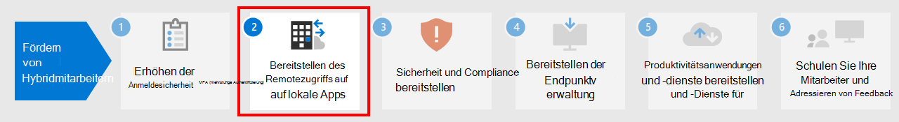

# Schritt 1. Erhöhen Sie die Anmeldesicherheit für Hybrid-Mitarbeiter mit MFA

Verwenden Sie die Mehrstufige Authentifizierung (MFA), um die Sicherheit der Anmeldungen Ihrer Hybrid-Mitarbeiter zu erhöhen. MFA erfordert, dass Nutzeranmeldungen einer zusätzlichen Überprüfung unterzogen werden, die über das Kennwort des Nutzerkontos hinausgeht. Selbst wenn ein böswilliger Nutzer ein Nutzerkontokennwort ermittelt, muss er in der Lage sein, auf eine zusätzliche Überprüfung zu antworten, z. B. eine Textnachricht, die an ein Smartphone gesendet wird, bevor der Zugriff gewährt wird.

Für alle Nutzer, einschließlich Hybrid-Mitarbeiter und insbesondere Administratoren, empfiehlt Microsoft dringend MFA.

Es gibt drei Möglichkeiten, von Ihren Nutzern die Verwendung von MFA basierend auf Ihrem Microsoft 365-Plan zu verlangen.

|Plan  |Empfehlung  |
|---------|---------|
|Alle Microsoft 365-Pläne (ohne Azure AD Premium P1- oder P2-Lizenzen)     |[Aktivieren Sie die Sicherheitsstandards in Azure AD](/azure/active-directory/fundamentals/concept-fundamentals-security-defaults). Zu den Sicherheitsstandards in Azure AD gehört MFA für Nutzer und Administratoren.   |
|Microsoft 365 E3 (einschließlich Azure AD Premium P1-Lizenzen)     | Verwenden Sie [Allgemeine Richtlinien für den bedingten Zugriff](/azure/active-directory/conditional-access/concept-conditional-access-policy-common), um die folgenden Richtlinien zu konfigurieren:  - [MFA für Administratoren erforderlich](/azure/active-directory/conditional-access/howto-conditional-access-policy-admin-mfa)  - [MFA für alle Nutzer erforderlich](/azure/active-directory/conditional-access/howto-conditional-access-policy-all-users-mfa)   - [Blockieren von Legacy-Authentifizierung](/azure/active-directory/conditional-access/howto-conditional-access-policy-block-legacy)       |
|Microsoft 365 E5 (einschließlich Azure AD Premium P2-Lizenzen)     | Nutzen Sie Azure AD-Identity Protection, beginnen Sie mit der Implementierung des von Microsoft [empfohlenen Satzes von bedingtem Zugriff und zugehörigen Richtlinien](../security/office-365-security/identity-access-policies.md), indem Sie diese Richtlinien erstellen:  - [MFA erforderlich, wenn das Anmelderisiko mittel oder hoch ist](../security/office-365-security/identity-access-policies.md#require-mfa-based-on-sign-in-risk)  - [Blockieren von Clients, die die moderne Authentifizierung nicht unterstützen](../security/office-365-security/identity-access-policies.md#block-clients-that-dont-support-multi-factor) - [Nutzer mit hohem Risiko müssen das Kennwort ändern](../security/office-365-security/identity-access-policies.md#high-risk-users-must-change-password)       |
| | |

## Sicherheitsstandards

Die Sicherheitsstandards sind eine neue Funktion für kostenpflichtige Microsoft 365- und Office 365- oder Testabonnements, die nach dem 21. Oktober 2019 erstellt wurden. Bei diesen Abonnements sind die Sicherheitsstandards aktiviert, sodass ***alle Nutzer MFA mit der Microsoft Authenticator-App verwenden müssen***.
 
Nutzer haben 14 Tage Zeit, sich mit ihrem Smartphone mit der Microsoft Authenticator-App für MFA zu registrieren. Dies beginnt mit der ersten Anmeldung, nachdem die Sicherheitsstandards aktiviert wurden. Nach Ablauf von 14 Tagen kann sich der Nutzer erst nach Abschluss der MFA-Registrierung anmelden.

Sicherheitsstandards stellen sicher, dass alle Organisationen über eine grundlegende Sicherheitsstufe für die Nutzeranmeldung verfügen, die standardmäßig aktiviert ist. Sie können Sicherheitsstandards für MFA mit Richtlinien für den bedingten Zugriff oder für einzelne Konten deaktivieren.

Weitere Informationen finden Sie in dieser [Übersicht der Sicherheitsstandards](/azure/active-directory/fundamentals/concept-fundamentals-security-defaults).

## Richtlinien für bedingten Zugriff

Richtlinien für den bedingten Zugriff sind eine Reihe von Regeln, die die Bedingungen angeben, unter denen Anmeldungen ausgewertet und zugelassen werden. Sie können beispielsweise eine Richtlinie für den bedingten Zugriff erstellen, in der Folgendes angegeben ist:

- Entspricht die Bezeichnung eines Benutzerkontos dem Namen eines Mitglieds einer Gruppe von Benutzern, denen Exchange, Benutzer, Kennwort sowie Sicherheits-, SharePoint- oder globale Administratorrollen zugewiesen sind, ist eine mehrstufige Authentifizierung (MFA) erforderlich, bevor der Zugriff genehmigt wird.

Diese Richtlinie ermöglicht es Ihnen, MFA basierend auf einer Gruppenmitgliedschaft zu verlangen, anstatt einzelne Benutzerkonten für MFA zu konfigurieren, wenn diesen Administratorrollen zugewiesen oder entzogen wurden.

Sie können die Richtlinien für den bedingten Zugriff auch für erweiterte Funktionen verwenden, z. B. wenn die Anmeldung von einem kompatiblen Gerät aus erfolgen muss, z. B. von Ihrem Laptop unter Windows 10.

Für den bedingten Zugriff sind Azure AD Premium P1-Lizenzen erforderlich, die in Microsoft 365 E3 und E5 enthalten sind.

Weitere Informationen finden Sie in dieser [Übersicht über den bedingten Zugriff](/azure/active-directory/conditional-access/overview).

## Support für Azure AD Identity Protection

Mit Azure AD Identity Protection können Sie eine zusätzliche Richtlinie für bedingten Zugriff erstellen, die festlegt:

- Wenn das Anmelderisiko als mittleres oder hohes Risiko eingestuft wird, ist MFA zu fordern.

Für Azure AD Identity Protection sind Azure AD Premium P2-Lizenzen erforderlich, die in Microsoft 365 E5 enthalten sind.

Weitere Informationen finden Sie unter [Risikoabhängiger bedingter Zugriff](/azure/active-directory/conditional-access/howto-conditional-access-policy-risk#require-mfa-medium-or-high-sign-in-risk-users).

Mit Azure AD Identity Protection können Sie auch eine Richtlinie erstellen, mit der sich Ihre Benutzer für MFA registrieren müssen. Weitere Informationen finden Sie unter [Konfigurieren der Registrierungsrichtlinie für Azure AD Multi-Factor Authentication](/azure/active-directory/identity-protection/howto-identity-protection-configure-mfa-policy)

## Diese Methoden zusammen verwenden

Denken Sie dabei an Folgendes:

- Sie können die Sicherheitsstandards nicht aktivieren, wenn Sie Richtlinien für den bedingten Zugriff aktiviert haben.
- Sie können keine Richtlinien für den bedingten Zugriff aktivieren, wenn Sie die Sicherheitsstandards aktiviert haben.

Wenn die Sicherheitsstandards aktiviert sind, werden alle neuen Nutzer zur MFA-Registrierung und zur Verwendung der Microsoft Authenticator-App aufgefordert. 

Diese Tabelle zeigt die Ergebnisse der Aktivierung von MFA mit Sicherheitsstandards und Richtlinien für bedingten Zugriff.

| Methode | Aktiviert | Deaktiviert | Zusätzliche Authentifizierungsmethode |
|:-------|:-----|:-------|:-------|
| **Sicherheitsstandards**  | Richtlinien für bedingten Zugriff können nicht verwendet werden | Richtlinien für den bedingten Zugriff können verwendet werden | Microsoft Authenticator-App |
| **Richtlinien für bedingten Zugriff** | Wenn welche aktiviert sind, können Sie die Sicherheitsstandards nicht aktivieren | Wenn alle deaktiviert sind, können Sie die Sicherheitsstandards aktivieren  | Werden vom Benutzer während der MFA-Registrierung festgelegt  |
||||

## Gestatten Sie Ihren Benutzern das Zurücksetzen des eigenen Kennworts

Die Self-Service-Kennwortzurücksetzung (SSPR) ermöglicht Benutzern, ihre eigenen Kennwörter zurückzusetzen, ohne sich an die IT-Mitarbeiter wenden zu müssen. Benutzer können ihre Kennwörter jederzeit und von jedem Ort aus schnell zurücksetzen. Weitere Informationen finden Sie unter [Planen einer Bereitstellung von Self-Service-Kennwortzurücksetzung in Azure AD](/azure/active-directory/authentication/howto-sspr-deployment).

## Melden Sie sich mit Azure AD bei SaaS-Apps an

Zusätzlich zur Bereitstellung von Cloud-Authentifizierung für Benutzer kann Azure AD auch Ihre zentrale Möglichkeit zum Sichern aller Ihrer Apps sein – ganz gleich, ob lokal, in der Microsoft-Cloud, oder in einer anderen Cloud. Durch die [Integration Ihrer Anwendungen in Azure AD](/azure/active-directory/manage-apps/plan-an-application-integration) können Sie es Hybrid-Mitarbeitern erleichtern, die benötigten Anwendungen zu finden, und sich sicher bei ihnen anzumelden.

## Technische Administratorressourcen für MFA und Identität

- [Die 5 wichtigsten Möglichkeiten, mit denen Azure AD die Remote-Arbeit aktivieren kann](https://techcommunity.microsoft.com/t5/azure-active-directory-identity/top-5-ways-your-azure-ad-can-help-you-enable-remote-work/ba-p/1144691)
- [Identitäts-Roadmap für Microsoft 365](../enterprise/identity-roadmap-microsoft-365.md)
- [Azure Academy Azure AD-Schulungsvideos](https://www.youtube.com/watch?v=pN8o0owHfI0&list=PL-V4YVm6AmwUFpC3rXr2i2piRQ708q_ia)

## Ergebnisse von Schritt 1

Nach der Bereitstellung von MFA haben Ihre Nutzer:

- Die Verpflichtung MFA für Anmeldungen verwenden.
- Den MFA-Registrierungsprozess abgeschlossen und verwenden MFA für alle Anmeldungen.
- Die Möglichkeit, SSPR zum Zurücksetzen des eigenen Kennworts zu verwenden.

## Nächster Schritt

Fahren Sie mit [Schritt 2](empower-people-to-work-remotely-remote-access.md) fort, um den Remotezugriff auf lokale Apps und Dienste bereitzustellen.