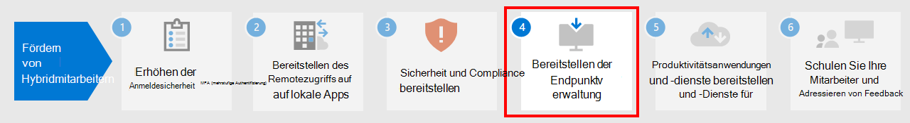

# Schritt 3: Bereitstellen von Sicherheit und Compliance für Hybrid-Mitarbeiter

Bei Hybrid-Mitarbeitern, von denen einige niemals oder selten ins Büro kommen, sind Sicherheit und Compliance ein wichtiger Bestandteil der Gesamtlösung. Die gesamte Kommunikation erfolgt über das Internet, anstatt sich auf ein Intranet der Organisation zu beschränken.

Es gibt Dinge, die Sie und Ihre Mitarbeiter unternehmen können, um produktiv zu bleiben während Sie die Internetsicherheit erhöhen und Ihre internen Richtlinien und Datenbestimmungen einhalten.

Remotearbeit benötigt diese Elemente der Sicherheit und Compliance:

- Kontrollierter Zugriff auf die Produktivitäts-Apps, die Hybrid-Mitarbeiter verwenden, z. B. Microsoft Teams
- Kontrollierter Zugriff auf und Schutz von Daten, die Hybrid-Mitarbeiter erstellen und verwenden, z. B. Chat-Unterhaltungen oder freigegebene Dateien
- Schutz von Windows 10-Geräten vor Schadsoftware und anderen Arten von Cyberattacken
- Schutz von E-Mails, Dateien und Websites mit einheitlicher Bezeichnung für Vertraulichkeitslevel und Schutz
- Prävention von Datenverlust
- Einhaltung regionaler Datenschutzbestimmungen

Nachfolgend sind die Microsoft 365-Features aufgeführt, die Sicherheits- und Compliance-Dienste für Hybrid-Mitarbeiter bieten.

## Sicherheit

Schützen Sie Ihre Apps und Daten mit diesen Sicherheitsfunktionen von Microsoft 365.

| Funktion oder Feature | Warum ich es brauche | Lizenzierung |
|:-------|:-----|:-------|
| Microsoft Defender für Office 365 | Schützen Sie Ihre Microsoft 365-Apps und-Daten vor Angriffen, beispielsweise E-Mails, Office-Dokumente und Tools für die Zusammenarbeit.    Microsoft Defender für Office 365 erfasst und analysiert Signale Ihrer Apps zur Erkennung, Untersuchung und Behebung von Sicherheitsrisiken und schützt Ihre Organisation vor böswilligen Bedrohungen durch E-Mails, Links (URLs) und Tools für die Zusammenarbeit. Es bietet außerdem eine automatisierte Bewertung der Mandantenkonfiguration sowie Konfigurationstools für Standard- und strengen Sicherheitsstatus. | Microsoft 365 E3 oder E5 |
| Schutz vor Schadsoftware | ‎Microsoft Defender Antivirus und Device Guard bieten gerätebasierten Schutz vor Schadsoftware.    SharePoint Online überprüft Dateiuploads automatisch auf bekannte Schadsoftware.   Exchange Online Protection (EOP) sichert Cloud-Postfächer. | Microsoft 365 E3 oder E5 |
| Microsoft Defender für Endpunkt | Schützen Sie die Geräte Ihrer Organisation vor Cyber-Bedrohungen und Datenschutzverletzungen, und erkennen, untersuchen und reagieren Sie auf komplexe Bedrohungen. | Microsoft 365 E5 |
| Cloud-App-Sicherheit | Schützen Sie Ihre cloudbasierten Dienste – sowohl Microsoft 365 als auch andere SaaS-Apps – vor Angriffen. | Microsoft 365 E5 oder Individual Cloud App Security-Lizenzen |
| Azure AD Identity Protection  | Automatisieren Sie die Erkennung und Behebung von identitätsbasierten Risiken.   Erstellen Sie risikobasierte bedingte Zugriffsrichtlinien, um die mehrstufige Authentifizierung (MFA) für riskante Anmeldungen zu erzwingen. | Microsoft 365 E5 oder E3 mit Azure AD Premium P2-Lizenzen |
||||

Im ersten Schritt sollten Sie sich über die [Microsoft-Sicherheitsbewertung](/microsoft-365/security/defender/microsoft-secure-score) informieren und diese verwenden.

Weitere Informationen finden Sie unter [Die wichtigsten 12 Aufgaben für Sicherheitsteams zur Unterstützung der Arbeit von zu Hause aus](../security/top-security-tasks-for-remote-work.md).

Informationen zur Sicherheit in Microsoft 365 finden Sie in der [Sicherheitsdokumentation zu Microsoft 365](/microsoft-365/security).

## Compliance

Einhaltung interner Richtlinien oder behördlicher Vorschriften mit diesen Compliance-Funktionen von Microsoft 365.

| Funktion oder Feature | Warum ich es brauche | Lizenzierung |
|:-------|:-----|:-------|
| Vertraulichkeitsbezeichnungen | Sie können die Daten Ihrer Organisation klassifizieren und schützen, ohne die Produktivität der Benutzer und ihre Fähigkeit zur Zusammenarbeit zu behindern, indem Sie Bezeichnungen mit unterschiedlichen Schutzgraden für E-Mails, Dateien oder Websites platzieren. | Microsoft 365 E3 oder E5 |
| Schutz vor Datenverlust (DLP) | Sie können eine riskante, unbeabsichtigte oder unangebrachte Freigabe erkennen, warnen und blockieren. Beispielsweise die Weitergabe von Daten, die persönliche Informationen enthalten, sowohl intern als auch extern. | Microsoft 365 E3 oder E5 |
| App-Steuerung für bedingten Zugriff | Verhindern, dass vertrauliche Daten auf die privaten Geräte der Benutzer heruntergeladen werden. | Microsoft 365 E3 oder E5 |
| Aufbewahrungsbezeichnungen und Bezeichnungsrichtlinien | Implementieren Sie Kontrollmechanismen für die Informationsgovernance, z. B. wie lange Daten aufbewahrt werden und die Anforderungen für die Speicherung von persönlichen Daten von Kunden, um die Richtlinien oder Datenvorschriften Ihrer Organisation einzuhalten. | Microsoft 365 E3 oder E5 |
| Office-Nachrichtenverschlüsselung (Office Message Encryption, OME) | Senden und empfangen von verschlüsselten E-Mails zwischen Personen innerhalb und außerhalb Ihrer Organisation, die geregelte Daten enthalten, z. B. persönliche Daten von Kunden. | Microsoft 365 E3 oder E5 |
| Compliance-Manager | Verwalten gesetzlicher Compliance-Aktivitäten im Zusammenhang mit Microsoft-Cloud-Diensten mit diesem workflowbasierten Tool für die Risikobewertung im Microsoft Service Trust Portal. | Microsoft 365 E3 oder E5 |
| Compliance-Manager | Sehen Sie sich eine Gesamtbewertung Ihrer aktuellen Compliance-Konfiguration sowie Empfehlungen zur Verbesserung im Microsoft 365 Compliance Center an. | Microsoft 365 E3 oder E5 |
| Kommunikationscompliance  | Erkennen, Erfassen und Ergreifen von Abhilfemaßnahmen für unangebrachte Nachrichten in Ihrer Organisation. | Microsoft 365 E5 oder Microsoft 365 E3 mit den Compliance- oder Insider-Risikomanagement-Add-Ons |
| Insider-Risikomanagement |  Erkennen und untersuchen Sie bösartige und unbeabsichtigte Risiken in Ihrer Organisation, und reagieren Sie darauf. Microsoft 365 kann diese Arten von Risiken sogar dann erkennen, wenn ein Mitarbeiter ein nicht verwaltetes Gerät verwendet. | Microsoft 365 E5 oder Microsoft 365 E3 mit den Compliance- oder Insider-Risikomanagement-Add-Ons |
||||

Weitere Informationen finden Sie unter [Schnelle Aufgaben für die ersten Schritte mit Microsoft 365 Compliance](../compliance/compliance-quick-tasks.md).

## Ergebnisse von Schritt 3

Für Ihre Hybrid-Mitarbeiter haben Sie Folgendes implementiert:

- Sicherheit
  - Kontrollierter Zugriff auf Apps und Daten, die Hybrid-Mitarbeiter für Kommunikation und Zusammenarbeit verwenden
  - Schutz vor Schadsoftware für Cloud-Dienst Daten, E-Mail und Windows 10-Geräte
- Compliance
  - Einheitliche Bezeichnung für Vertraulichkeitslevel und Schutz
  - Richtlinien zur Prävention von Datenverlust
  - Einhaltung regionaler Datenschutzbestimmungen

## Nächster Schritt

Fahren Sie fort mit [Schritt 4](empower-people-to-work-remotely-manage-endpoints.md), um Ihre Geräte, PCs und andere Endpunkte zu verwalten.
