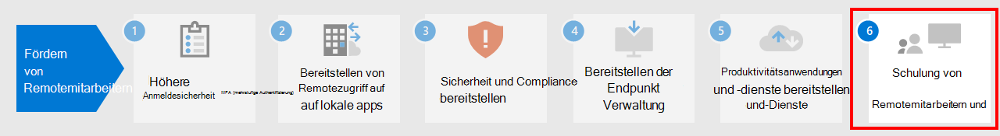

# Schritt 5:Step 5. Bereitstellen von Produktivitätsanwendungen und -diensten für RemotemitarbeiterDeploy remote worker productivity apps and services

Um produktiv zu sein, müssen die Mitarbeiter miteinander kommunizieren und zusammenarbeiten.To be productive, people need to communicate and collaborate with one another. Sie müssen sich treffen, per Sprach- und Textnachricht chatten, neue Inhalte erstellen und Informationen und Dateien gemeinsam nutzen, E-Mails austauschen und Kalender und Aufgaben verwalten.They need to meet, chat by voice and text, create new content and share information and files, exchange email, and manage calendars and tasks. Microsoft 365 bietet Cloud-basierte Dienste für alle diese wichtigen Funktionen:Microsoft 365 provides cloud-based services for all of these key functions:

- Verwenden Sie Microsoft Teams, das einen gemeinsamen Kommunikationsknotenpunkt für Besprechungen, Chats und die Speicherung von Dateien für die Organisation, für die Abteilungen und für kleine Teams und Einzelpersonen bietet, damit die Benutzer in Verbindung bleiben, obwohl sie getrennt arbeiten.To keep people connected while they work apart, use Microsoft Teams, which provides a common hub of communication for meetings, chats, and file storage for the organization, departments, and for small teams and individuals. 
- Verwenden Sie zum Austauschen von E-Mails und Verwalten von Kalendern, Kontakten und Aufgaben Exchange Online und den Outlook-Client.For exchanging email and managing calendars, contacts, and tasks, use Exchange Online and the Outlook client.
- Verwenden Sie zum Speichern und Zusammenarbeiten an Dateien SharePoint und OneDrive.For storing and collaborating on files, use SharePoint and OneDrive. Diese können Sie innerhalb eines Webbrowsers oder in Teams verwenden.You can use them within a web browser or within Teams.
- Für das Erstellen neuer Inhalte oder die Zusammenarbeit an vorhandenen Inhalten sind die Microsoft 365-Apps Versionen von Word, PowerPoint, Excel und Outlook, die auf Ihrem lokalen Computer installiert sind und die laufenden Feature- und Sicherheitsupdates erhalten.For creating new content or collaborating on existing content, Microsoft 365 Apps are versions of Word, PowerPoint, Excel, and Outlook that are installed on your local computer and receive ongoing feature and security updates.

## Menschen mit Microsoft Teams in Verbindung haltenKeep people connected with Microsoft Teams

Teams ermöglicht es Ihnen, an einem Ort zu chatten, sich zu treffen, anzurufen und zusammenzuarbeiten.Teams allows you to chat, meet, call, and collaborate all in one place. Jeden Tag erledigen Millionen von Menschen ihre Arbeit in Teams, weil es alles zusammenbringt, was Sie brauchen, um aus der Ferne in einem Hub für Teamarbeit zu arbeiten.Millions of people get their work done in Teams every day because it brings together everything you need to work remotely into a hub for teamwork. 

Eine detaillierte Anleitung finden Sie unter [Unterstützung von Remotemitarbeitern in Microsoft Teams](https://docs.microsoft.com/microsoftteams/support-remote-work-with-teams).For detailed guidance, see [Support remote workers using Microsoft Teams](https://docs.microsoft.com/microsoftteams/support-remote-work-with-teams). 

Sehen Sie sich [Ermöglichen der hybriden Arbeit mit Microsoft Teams-Webcasts](https://resources.techcommunity.microsoft.com/enabling-hybrid-work/) für eine Anleitung und Demos zur Verwendung von Teams für Remotearbeit an.Watch the [Enabling hybrid work with Microsoft Teams webcasts](https://resources.techcommunity.microsoft.com/enabling-hybrid-work/) for guidance and demos on using Teams for remote work.

### Chat und UnterhaltungenChat and conversations

Chat und Unterhaltungsfäden stehen im Mittelpunkt von Teams, das sowohl persönliche 1:1-Chats als auch Gruppenchats und Unterhaltungen unterstützt.Chat and threaded conversations are at the center of Teams with support for individual 1:1 chats and group chats and conversations. Remotemitarbeiter können mithilfe von GIFs, Aufklebern und Emojis in Gruppenchats oder persönliche Nachrichten Informationen, Meinungen und Erfahrungen teilen.Remote workers can share information, opinions, and personality by using gifs, stickers, and emojis in group chats or one-to-one messages.

### Besprechungen und KonferenzenMeetings and conferencing 

Teams kann sicher helfen, die Kommunikation und den Informationsaustausch mit Remotemitarbeitern aufrechtzuerhalten, insbesondere bei Besprechungen mit bis zu 250 Personen.Teams can certainly help maintain communications and information sharing with remote workers, especially with meetings that support up to 250 people. Teams-Besprechungen ermöglichen interaktive, gemeinsame Besprechungen mit Personen innerhalb und außerhalb Ihrer Organisation.Teams meetings enable interactive, collaborative meetings with people inside and outside your organization. Remotemitarbeiter können Teams-Besprechungen für tägliche Aktivitäten, einschließlich regelmäßiger Projektprüfpunkte, Besprechung mit Kollegen, Brainstorming-Sitzungen und Vereinfachung der Kommunikation mit Kunden verwenden.Remote workers can use Teams meetings for day-to-day activities including recurring project checkpoints, catching-up with colleagues, brainstorming sessions, and facilitating conversations with customers. 

### AnrufeCalling

Teams unterstützt den direkten VoIP-Anruf zwischen Benutzern und sogar anderen Organisationen, die Föderation verwenden.Teams supports direct VoIP calling between users and even other organizations using federation. Dafür werden dieselben Codecs wie für Besprechungen verwendet und es wird weltweit einen großartigen Ton ohne zusätzliche Gebühren angeboten.It uses the same codecs as meetings and provide great audio world-wide without additional PSTN charges. Einige Benutzer benötigen jedoch möglicherweise eine dedizierte Telefonnummer, um externe Anrufe im Rahmen einer Remotearbeit zu erledigen.However, some users may need a dedicated phone number to take external calls when working remotely. Teams kann diesen Benutzern schnell einen Cloud-Telefondienst zur Verfügung stellen, mit dem sie Telefonanrufe tätigen und empfangen können.Teams can quickly provide cloud phone service for these users to make and receive phone calls.

### Apps und WorkflowsApps and workflows

Teams bietet eine Plattform für Apps und Workflows, auf die über die Desktop-, Web- und mobilen Versionen von Teams zugegriffen werden kann.Teams provides a platform for apps and workflows that can be accessed from the desktop, web, and mobile versions of Teams. Teams bietet hunderte von Apps von Microsoft sowie von Drittanbietern, um Benutzer zu binden, die Produktivität zu steigern und häufig verwendete Businessdienste in Teams zu integrieren.Teams provides hundreds of apps published by Microsoft and by third parties to engage users, support productivity, and integrate commonly used business services into Teams. Benutzer und Administratoren können auch benutzerdefinierte Apps und automatisierte Workflows für Teams erstellen, indem Sie Entwicklertools mit wenig Code für Power Apps und Power Automation verwenden.Users and Admins can also create custom apps and automated workflows for Teams using the low-code Power Apps and Power Automate development tools.

Mithilfe von Apps und Workflows können Remotemitarbeiter in Teams produktiver arbeiten, wichtige Informationen sammeln und freigeben, sich wiederholende Aufgaben automatisieren und mit einem interaktiven Bot chatten.Apps and workflows let remote workers be more productive in Teams, by collecting and sharing critical information, automating repetitive tasks, and allowing them to chat with interactive bot. Das Anheften von Apps an einen Kanal oder die Teams-App-Leiste bietet Benutzern eine großartige Möglichkeit, diese Apps in einem relevanten Bereich leicht zugänglich zu machen, und Administratoren können Apps anheften, um die Aufmerksamkeit auf die Apps zu lenken, die von allen Benutzern verwendet werden sollten, und für ihre problemlose Einführung zu sorgen.Pinning apps to a channel or the Teams app bar is a great way for users to make these apps easily accessible in a relevant space, and admins can pin apps to drive awareness and adoption of the apps that everyone should be using.

## E-Mail-Austausch und Verwalten von Kalendern, Kontakten und Aufgaben mit Exchange Online und OutlookExchange email and manage calendars, contacts, and tasks with Exchange Online and Outlook

Mit Outlook können Remotemitarbeiter in Verbindung bleiben und mit E-Mails, Kalendern, Kontakten, Aufgaben und mehr zusammenarbeiten – an einem zentralen Ort.With Outlook, remote workers can stay connected and organized with email, calendars, contacts, tasks, and more—together in one place. Outlook hilft Ihnen dabei, den Überblick zu behalten und Prioritäten für Ihren Tag zu setzen, je nachdem, was für Sie relevant ist.Outlook helps you stay on track and prioritize your day based on what’s relevant to you. Outlook ermöglicht es Ihnen, Anlagen direkt von OneDrive aus freizugeben, Teambesprechungen zu planen und daran teilzunehmen, Kalender anzuzeigen und freizugeben und anderen Personen Stellvertretungsberechtigungen zu erteilen.Outlook enables you to share attachments right from OneDrive, plan and join Teams meetings, view and share calendars, and provide delegate permissions to others. Wenn sie wissen, was sowohl bei der Arbeit als auch bei persönlichen Verpflichtungen als Nächstes ansteht und was beachtet werden muss, können sich die Remotemitarbeiter auf das Wesentliche konzentrieren.Knowing what’s coming up next across both work and personal commitments and what needs attention can help remote workers focus on what matters. Outlook bietet hilfreiche Möglichkeiten für Remotemitarbeiter, Ihre Zeit zu verwalten und problemlos zu finden, was sie benötigen, einschließlich Dateien, Personen in der Organisation und vieles mehr.Outlook provides helpful ways for remote workers to manage their time and to find what they need easily, including files, people in the organization, and more. 

In [diesem Artikel](../security/office-365-security/secure-email-recommended-policies.md) finden Sie die empfohlenen Identitäts- und Gerätezugriffsrichtlinien zum Schutz von E-Mails und E-Mail-Clients Ihrer Organisation, die moderne Authentifizierung und bedingten Zugriff unterstützen.See [this article](../security/office-365-security/secure-email-recommended-policies.md) for the recommended identity and device access policies to protect organizational email and email clients that support modern authentication and Conditional Access.

## Mit SharePoint und OneDrive Dateien speichern und gemeinsam bearbeitenStore and collaborate on files with SharePoint and OneDrive

Bei der Zusammenarbeit an Inhalten können Remotemitarbeiter SharePoint- und OneDrive-Ordner als zentralen Ort in der Cloud nutzen, um Dateien zu speichern und freizugeben, diese gemeinsam zu verfassen, zu kommunizieren und zusammenzuarbeiten.For content collaboration, remote workers can use SharePoint and OneDrive folders as a central place in the cloud to store and share files, co-author, communicate, and collaborate. Remotemitarbeiter können von praktisch überall aus über einen Webbrowser, Teams und Office-Apps geschützt arbeiten.Remote workers can securely work from anywhere from a web browser, from Teams, and from Office apps.

Möglicherweise müssen Sie Ihre Dokumente in SharePoint oder OneDrive migrieren:You might have to migrate your documents to SharePoint or OneDrive from:

- [SharePoint Server-TeamwebsitesSharePoint Server Team Sites](https://docs.microsoft.com/sharepointmigration/sp-teams-sites-migration-guide)
- [MySitesMySites](https://docs.microsoft.com/sharepointmigration/mysites-to-onedrive-migration-guide)
- [DateifreigabenFile shares](https://docs.microsoft.com/sharepointmigration/fileshare-to-odsp-migration-guide)
- [BoxBox](https://docs.microsoft.com/sharepointmigration/box-to-onedrive-and-sharepoint-migration-guide)

In [diesem Artikel](../security/office-365-security/sharepoint-file-access-policies.md) finden Sie die empfohlenen Identitäts- und Gerätezugriffsrichtlinien zum Schutz von SharePoint and OneDrive.To protect SharePoint and OneDrive, see [this article](../security/office-365-security/sharepoint-file-access-policies.md) for the recommended identity and device access policies.

## Erstellen und Bearbeiten von Inhalten mit Microsoft 365 AppsCreate and collaborate on content with Microsoft 365 Apps

Microsoft 365 Apps ist die produktivste und sicherste Office-Oberfläche für Unternehmen, die es Benutzern ermöglicht, nahtlos von praktisch überall aus zu arbeiten.Microsoft 365 Apps is the most productive and secure Office experience for enterprises, allowing people to work together seamlessly from anywhere, anytime. Remotemitarbeiter können an einem Dokument mit mehreren Personen gleichzeitig zusammenarbeiten, Änderungen in Echtzeit anzeigen und mit anderen Personen auf jedem Laptop, PC oder mobilen Gerät zusammenarbeiten.Remote workers can collaborate on a document with multiple people simultaneously, see edits and changes in real time, and coauthor with others on any laptop, PC, or mobile device.

Weitere Informationen finden Sie im [Bereitstellungshandbuch für Microsoft 365 Apps](https://docs.microsoft.com/deployoffice/deployment-guide-microsoft-365-apps).For more information, see the [Deployment guide for Microsoft 365 Apps](https://docs.microsoft.com/deployoffice/deployment-guide-microsoft-365-apps).

## Technische Ressourcen für Produktivitäts-Apps und -Dienste verwaltenAdmin technical resources for productivity apps and services

- [Unterstützung von Remotemitarbeitern in Microsoft TeamsSupport remote workers using Microsoft Teams](https://docs.microsoft.com/microsoftteams/support-remote-work-with-teams)
- [Ermöglichen der hybriden Arbeit mit Microsoft Teams-WebcastsEnabling hybrid work with Microsoft Teams webcasts](https://resources.techcommunity.microsoft.com/enabling-hybrid-work/)
- [Teams Customer Success Kit – herunterladenTeams Customer Success Kit download](https://www.microsoft.com/download/details.aspx?id=54244)
- [Tools für die Einführung von TeamsTools for driving Teams adoption](https://docs.microsoft.com/microsoftteams/adopt-tools-and-downloads) 
- [Erstellen einer Change Management-Strategie für Microsoft TeamsCreate a change management strategy for Microsoft Teams](https://docs.microsoft.com/MicrosoftTeams/change-management-strategy)
- [Teams mit drei SchutzebenenTeams with three tiers of protection](configure-teams-three-tiers-protection.md)

## Benutzertrainingsressourcen für Produktivitäts-Apps und -DiensteUser training resources for productivity apps and services

- [Schulen Sie Ihre Benutzer in Office und Microsoft 365Train your users on Office and Microsoft 365](https://support.microsoft.com/office/train-your-users-on-office-and-microsoft-365-7cba3c97-7f19-46ed-a1c6-763971a26c27)
- [Office für das Web verwendenUse Office for the web](https://support.microsoft.com/office/get-started-with-office-for-the-web-in-microsoft-365-5622c7c9-721d-4b3d-8cb9-a7276c2470e5)

## Nächster SchrittNext step

Fahren Sie mit [Schritt 6](empower-people-to-work-remotely-train-monitor-usage.md) fort für Hinweise, wie Sie Ihre Benutzer schulen und ihren Erfolg überwachen.Continue with [Step 6](empower-people-to-work-remotely-train-monitor-usage.md) to train your users and monitor their success.
