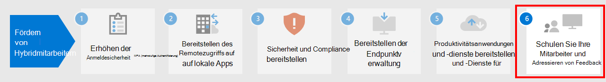

# Schritt 5: Bereitstellen von Produktivitätsanwendungen und -diensten für Remotemitarbeiter

Um produktiv zu sein, müssen die Mitarbeiter miteinander kommunizieren und zusammenarbeiten. Sie müssen sich treffen, per Sprach- und Textnachricht chatten, neue Inhalte erstellen und Informationen und Dateien gemeinsam nutzen, E-Mails austauschen und Kalender und Aufgaben verwalten. Microsoft 365 bietet Cloud-basierte Dienste für alle diese wichtigen Funktionen:

| IT-Funktion | Komponenten von Microsoft 365 | Beschreibung |
|:-------|:-----|:-------|
| E-Mail-Dienste | Exchange Online | E-Mail-Austausch und Verwalten von Kalendern, Kontakten und Aufgaben mit dem Outlook-Client. |
| Unternehmens-Chat, VoIP (Voice over IP) und teambasierte Zusammenarbeit | Microsoft Teams | Gemeinsamer Kommunikationsknotenpunkt für Besprechungen, Chats und die Speicherung von Dateien für die Organisation, für Abteilungen sowie für kleine Teams und Einzelpersonen, damit die Benutzer in Verbindung bleiben, obwohl sie getrennt arbeiten. |
| Intranetwebsites, Zusammenarbeit an Dokumenten | SharePoint und OneDrive | Speichern von und Zusammenarbeiten an Dateien in einem Webbrowser oder in Teams. |
| Office-Anwendungen für Desktop- und mobile Geräte | Microsoft 365 Apps | Erstellen neuer Inhalte oder Zusammenarbeit an vorhandenen Inhalten mit Versionen von Word, PowerPoint, Excel und Outlook, die auf Ihrem lokalen Computer installiert sind und die laufenden Feature- und Sicherheitsupdates erhalten. |
||||

## Menschen mit Microsoft Teams in Verbindung halten

Teams ermöglicht es Ihnen, an einem Ort zu chatten, sich zu treffen, anzurufen und zusammenzuarbeiten. Jeden Tag erledigen Millionen von Menschen ihre Arbeit in Teams, weil es alles zusammenbringt, was Sie brauchen, um aus der Ferne in einem Hub für Teamarbeit zu arbeiten. 

Eine detaillierte Anleitung finden Sie unter [Unterstützung von Remotemitarbeitern in Microsoft Teams](https://docs.microsoft.com/microsoftteams/support-remote-work-with-teams). 

Sehen Sie sich [Ermöglichen der hybriden Arbeit mit Microsoft Teams-Webcasts](https://resources.techcommunity.microsoft.com/enabling-hybrid-work/) für eine Anleitung und Demos zur Verwendung von Teams für Remotearbeit an.

### Chat und Unterhaltungen

Chat und Unterhaltungsfäden stehen im Mittelpunkt von Teams, das sowohl persönliche 1:1-Chats als auch Gruppenchats und Unterhaltungen unterstützt. Remotemitarbeiter können mithilfe von GIFs, Aufklebern und Emojis in Gruppenchats oder persönliche Nachrichten Informationen, Meinungen und Erfahrungen teilen.

### Besprechungen und Konferenzen 

Teams kann sicher helfen, die Kommunikation und den Informationsaustausch mit Remotemitarbeitern aufrechtzuerhalten, insbesondere bei Besprechungen mit bis zu 250 Personen. Teams-Besprechungen ermöglichen interaktive, gemeinsame Besprechungen mit Personen innerhalb und außerhalb Ihrer Organisation. Remotemitarbeiter können Teams-Besprechungen für tägliche Aktivitäten, einschließlich regelmäßiger Projektprüfpunkte, Besprechung mit Kollegen, Brainstorming-Sitzungen und Vereinfachung der Kommunikation mit Kunden verwenden. 

### Anrufe

Teams unterstützt den direkten VoIP-Anruf zwischen Benutzern und sogar anderen Organisationen, die Föderation verwenden. Dafür werden dieselben Codecs wie für Besprechungen verwendet und es wird weltweit einen großartigen Ton ohne zusätzliche Gebühren angeboten. Einige Benutzer benötigen jedoch möglicherweise eine dedizierte Telefonnummer, um externe Anrufe im Rahmen einer Remotearbeit zu erledigen. Teams kann diesen Benutzern schnell einen Cloud-Telefondienst zur Verfügung stellen, mit dem sie Telefonanrufe tätigen und empfangen können.

### Apps und Workflows

Teams bietet eine Plattform für Apps und Workflows, auf die über die Desktop-, Web- und mobilen Versionen von Teams zugegriffen werden kann. Teams bietet hunderte von Apps von Microsoft sowie von Drittanbietern, um Benutzer zu binden, die Produktivität zu steigern und häufig verwendete Businessdienste in Teams zu integrieren. Benutzer und Administratoren können auch benutzerdefinierte Apps und automatisierte Workflows für Teams erstellen, indem Sie Entwicklertools mit wenig Code für Power Apps und Power Automation verwenden.

Mithilfe von Apps und Workflows können Remotemitarbeiter in Teams produktiver arbeiten, wichtige Informationen sammeln und freigeben, sich wiederholende Aufgaben automatisieren und mit einem interaktiven Bot chatten. Das Anheften von Apps an einen Kanal oder die Teams-App-Leiste bietet Benutzern eine großartige Möglichkeit, diese Apps in einem relevanten Bereich leicht zugänglich zu machen, und Administratoren können Apps anheften, um die Aufmerksamkeit auf die Apps zu lenken, die von allen Benutzern verwendet werden sollten, und für ihre problemlose Einführung zu sorgen.

## E-Mail-Austausch und Verwalten von Kalendern, Kontakten und Aufgaben mit Exchange Online und Outlook

Mit Outlook können Remotemitarbeiter in Verbindung bleiben und mit E-Mails, Kalendern, Kontakten, Aufgaben und mehr zusammenarbeiten – an einem zentralen Ort. Outlook hilft Ihnen dabei, den Überblick zu behalten und Prioritäten für Ihren Tag zu setzen, je nachdem, was für Sie relevant ist. Outlook ermöglicht es Ihnen, Anlagen direkt von OneDrive aus freizugeben, Teambesprechungen zu planen und daran teilzunehmen, Kalender anzuzeigen und freizugeben und anderen Personen Stellvertretungsberechtigungen zu erteilen. Wenn sie wissen, was sowohl bei der Arbeit als auch bei persönlichen Verpflichtungen als Nächstes ansteht und was beachtet werden muss, können sich die Remotemitarbeiter auf das Wesentliche konzentrieren. Outlook bietet hilfreiche Möglichkeiten für Remotemitarbeiter, Ihre Zeit zu verwalten und problemlos zu finden, was sie benötigen, einschließlich Dateien, Personen in der Organisation und vieles mehr. 

In [diesem Artikel](../security/office-365-security/secure-email-recommended-policies.md) finden Sie die empfohlenen Identitäts- und Gerätezugriffsrichtlinien zum Schutz von E-Mails und E-Mail-Clients Ihrer Organisation, die moderne Authentifizierung und bedingten Zugriff unterstützen.

## Mit SharePoint und OneDrive Dateien speichern und gemeinsam bearbeiten

Bei der Zusammenarbeit an Inhalten können Remotemitarbeiter SharePoint- und OneDrive-Ordner als zentralen Ort in der Cloud nutzen, um Dateien zu speichern und freizugeben, diese gemeinsam zu verfassen, zu kommunizieren und zusammenzuarbeiten. Remotemitarbeiter können von praktisch überall aus über einen Webbrowser, Teams und Office-Apps geschützt arbeiten.

Möglicherweise müssen Sie Ihre Dokumente in SharePoint oder OneDrive migrieren:

- [SharePoint Server-Teamwebsites](https://docs.microsoft.com/sharepointmigration/sp-teams-sites-migration-guide)
- [MySites](https://docs.microsoft.com/sharepointmigration/mysites-to-onedrive-migration-guide)
- [Dateifreigaben](https://docs.microsoft.com/sharepointmigration/fileshare-to-odsp-migration-guide)
- [Box](https://docs.microsoft.com/sharepointmigration/box-to-onedrive-and-sharepoint-migration-guide)

In [diesem Artikel](../security/office-365-security/sharepoint-file-access-policies.md) finden Sie die empfohlenen Identitäts- und Gerätezugriffsrichtlinien zum Schutz von SharePoint and OneDrive.

## Erstellen und Bearbeiten von Inhalten mit Microsoft 365 Apps

Microsoft 365 Apps ist die produktivste und sicherste Office-Oberfläche für Unternehmen, die es Benutzern ermöglicht, nahtlos von praktisch überall aus zu arbeiten. Remotemitarbeiter können an einem Dokument mit mehreren Personen gleichzeitig zusammenarbeiten, Änderungen in Echtzeit anzeigen und mit anderen Personen auf jedem Laptop, PC oder mobilen Gerät zusammenarbeiten.

Weitere Informationen finden Sie im [Bereitstellungshandbuch für Microsoft 365 Apps](https://docs.microsoft.com/deployoffice/deployment-guide-microsoft-365-apps).

## Technische Ressourcen für Produktivitäts-Apps und -Dienste verwalten

- [Unterstützung von Remotemitarbeitern in Microsoft Teams](https://docs.microsoft.com/microsoftteams/support-remote-work-with-teams)
- [Ermöglichen der hybriden Arbeit mit Microsoft Teams-Webcasts](https://resources.techcommunity.microsoft.com/enabling-hybrid-work/)
- [Teams Customer Success Kit – herunterladen](https://www.microsoft.com/download/details.aspx?id=54244)
- [Tools für die Einführung von Teams](https://docs.microsoft.com/microsoftteams/adopt-tools-and-downloads) 
- [Erstellen einer Change Management-Strategie für Microsoft Teams](https://docs.microsoft.com/MicrosoftTeams/change-management-strategy)
- [Teams mit drei Schutzebenen](configure-teams-three-tiers-protection.md)

## Benutzertrainingsressourcen für Produktivitäts-Apps und -Dienste

- [Schulen Sie Ihre Benutzer in Office und Microsoft 365](https://support.microsoft.com/office/train-your-users-on-office-and-microsoft-365-7cba3c97-7f19-46ed-a1c6-763971a26c27)
- [Office für das Web verwenden](https://support.microsoft.com/office/get-started-with-office-for-the-web-in-microsoft-365-5622c7c9-721d-4b3d-8cb9-a7276c2470e5)

## Nächster Schritt

Fahren Sie mit [Schritt 6](empower-people-to-work-remotely-train-monitor-usage.md) fort für Hinweise, wie Sie Ihre Benutzer schulen und ihren Erfolg überwachen.
