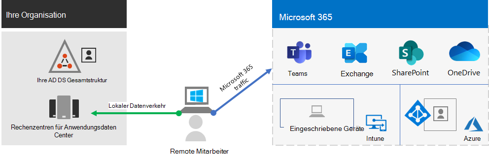
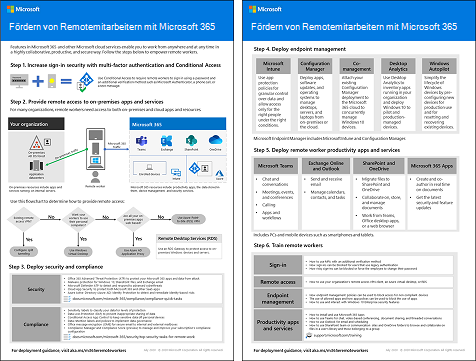
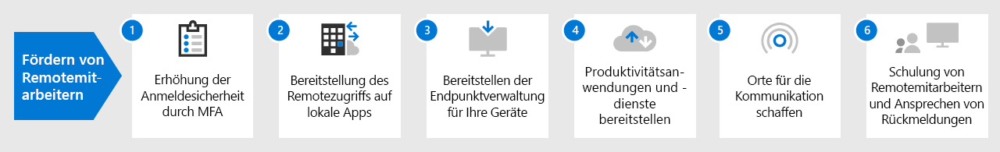

# Fördern von Remotemitarbeitern mit Microsoft 365

Ihr Unternehmen muss möglicherweise Ihren Arbeitnehmern von zu Hause aus einen sicheren Zugang zu den Informationen, Tools und Ressourcen Ihres Unternehmens vor Ort und in der Cloud ermöglichen. Es ist für viele Organisationen wichtig, den Mitarbeitern das Arbeiten außerhalb des Büros zu ermöglichen:

- Einsparen von Bürofläche.
- Einstellung und Bindung von Arbeitnehmern, die nicht bereit sind, umzuziehen.
- Verringern Sie das Pendeln von Arbeitnehmern, sodass ihnen mehr Zeit bleibt, produktiv zu sein und stressmindernde Tätigkeiten außerhalb der Arbeit zu verrichten.

Microsoft 365 bietet die Möglichkeit, Ihre Mitarbeiter zu befähigen, Remote zu arbeiten.

| Schlüsselfunktion | Beschreibung |
|:-------|:-----|
| Verbunden | Von überall auf der Welt und jederzeit können Remote-Mitarbeiter zugreifen: <ul><li>Cloud-basierte Dienste und Daten in Ihrem Microsoft 365-Abonnement. </li><li>Organisationsressourcen, wie sie z. B. in lokalen Anwendungsrechenzentren verfügbar sind.</li></ul> |
| Sicher | Die Anmeldungen werden durch die mehrstufige Authentifizierung (Multi-Factor Authentication, MFA) und die integrierten Sicherheitsfeatures von Microsoft 365 und Windows 10 geschützt und schützen vor Schadsoftware, bösartigen Angriffen und Datenverlust. |
| Verwaltet | Die Geräte Ihrer aus der Ferne arbeitenden Mitarbeiter können mit Sicherheitseinstellungen, zulässigen Apps und zur Einhaltung der Systemintegrität aus der Cloud verwaltet werden. |
| Kooperativ und produktiv | Ihre aus der Ferne arbeitenden Mitarbeiter können so produktiv wie die lokal arbeitenden sein – und das auf sehr kooperative Weise mit: <ul><li>Onlinebesprechungen und Chatsitzungen mit Teams. </li><li>Freigegebene Arbeitsbereiche für cloudbasierte Dateispeicherung mit globalem Zugriff und Zusammenarbeit in Echtzeit mit SharePoint und OneDrive. </li><li>Gemeinsame Aufgaben und Workflows, um die Arbeit aufzuteilen und Dinge zu erledigen. </li></ul> |
|||

Für einen flüssigen Anmeldevorgang sollten Ihre lokalen AD DS-Benutzerkonten (Active Directory Domain Services) mit Azure Active Directory (Azure AD) synchronisiert werden. Um Ihre Windows 10-Geräte zu schützen, sollten sie in Intune registriert werden. Hier ist eine allgemeine Übersicht über die Infrastruktur.

Verwenden Sie zur Erfüllung der Voraussetzungen für Remotemitarbeiter die folgenden Microsoft 365-Funktionen und -Features.

| Funktion oder Feature | Beschreibung | Lizenzierung |
|:-------|:-----|:-------|
| Mehrstufige Authentifizierung (MFA, Multi-Factor Authentication) mit Sicherheitsstandards erzwingen   | Schützen Sie sich vor kompromittierten Identitäten und Geräten, indem Sie eine zweite Authentifizierungsmethode für die Anmeldung vorsehen. Sicherheitsstandards schreiben MFA für alle Benutzerkonten vor.   | Microsoft 365 E3 oder E5 |
| Mehrstufige Authentifizierung (MFA, Multi-Factor Authentication) mit bedingtem Zugriff erzwingen| Erfordert MFA basierend auf den Anmeldungseigenschaften mit Richtlinien für bedingten Zugriff.    | Microsoft 365 E3 oder E5 | 
| Mehrstufige Authentifizierung (MFA, Multi-Factor Authentication) mit risikoabhängig bedingtem Zugriff erzwingen   | Erfordert MFA basierend auf dem Risiko der Benutzeranmeldung mit Azure Advanced Threat Protection. | Microsoft 365 E5 oder E3 mit Azure AD Premium P2-Lizenzen | 
| Zurücksetzen von Kennwörtern durch den Benutzer (Self-Service Password Reset, SSPR)    | Ermöglichen Sie Ihren Benutzern das Zurücksetzen oder Entsperren ihrer Kennwörter oder Konten.  | Microsoft 365 E3 oder E5 |
| Azure AD-Anwendungsproxy    | Sorgen Sie für sicheren Remotezugriff für webbasierte Anwendungen, die auf Intranet-Servern gehostet sind.   | Erfordert separates kostenpflichtiges Azure-Abonnement |
| Azure Punkt-zu-Site-VPN   | Erstellen Sie über ein virtuelles Azure-Netzwerk eine sichere Verbindung vom Gerät eines Remotemitarbeiters zu Ihrem Intranet.   | Erfordert separates kostenpflichtiges Azure-Abonnement |
| Windows Virtual Desktop   | Unterstützen Sie Mitarbeiter, die nur ihre persönlichen und nicht verwalteten Geräte verwenden können, mit virtuellen Desktops, die in Azure ausgeführt werden. | Erfordert separates kostenpflichtiges Azure-Abonnement |
| Remotedesktopdienste (RDS) | Ermöglichen Sie Mitarbeitern die Verbindung mit Windows-basierten Computern in Ihrem Intranet. | Microsoft 365 E3 oder E5 | 
| Remotedesktopdienste-Gateway   | Sorgen Sie für verschlüsselte Kommunikationen und verhindern Sie, dass RDS-Hosts direkt über das Internet erreichbar sind. | Erfordert separate Windows Server-Lizenzen |
| Microsoft Intune | Verwalten Sie Geräte und Anwendungen.   | Microsoft 365 E3 oder E5 | 
| Configuration Manager | Verwalten Sie Softwareinstallationen, Updates und Einstellungen auf Ihren Geräten. | Erfordert separate Configuration Manager-Lizenzen |
| Desktop Analytics | Ermitteln Sie die Update-Bereitschaft Ihrer Windows-Clients.   | Erfordert separate Configuration Manager-Lizenzen |
| Windows Autopilot | Richten Sie neue Windows 10-Geräte ein, und konfigurieren Sie sie für eine produktive Nutzung.   | Microsoft 365 E3 oder E5 |
| Microsoft Teams, Exchange Online, SharePoint Online und OneDrive, Microsoft 365 Apps, Microsoft Power Platform, Yammer, Power Apps | Planen, kommunizieren und zusammenarbeiten. | Microsoft 365 E3 oder E5 |
||||

Informationen zu den Sicherheits- und Compliance-Kriterien für Remotemitarbeiter finden Sie unter [Bereitstellen von Sicherheit und Compliance für Remotemitarbeiter](empower-people-to-work-remotely-security-compliance.md)

 Eine zweiseitige Zusammenfassung dieses Szenarios finden Sie auf dem [Poster "Fördern von Remotemitarbeitern"](../downloads/empower-remote-workers.pdf).

Sie können dieses Poster auch im [PDF](https://github.com/MicrosoftDocs/microsoft-365-docs/raw/public/microsoft-365/downloads/empower-remote-workers.pdf)- oder [PowerPoint](https://github.com/MicrosoftDocs/microsoft-365-docs/raw/public/microsoft-365/downloads/empower-remote-workers.pptx)-Format herunterladen und in den Formaten "Brief", "Legal" oder "Tabloid" (27,94 x 43,18 cm) ausdrucken.

Nutzen Sie diese Schritte, um den Zugriff auf die Server, Daten und Cloud-Dienste Ihres Unternehmens zu sichern und zu optimieren und eine maximale Mitarbeiterproduktivität zu ermöglichen.

1. [Erhöhung der Anmeldesicherheit durch MFA](empower-people-to-work-remotely-secure-sign-in.md)
2. [Bereitstellung des Remotezugriffs auf lokale Apps und Dienste](empower-people-to-work-remotely-remote-access.md)
3. [Sicherheit und Compliance bereitstellen](empower-people-to-work-remotely-security-compliance.md)
4. [Bereitstellen der Endpunktverwaltung für Ihre Geräte, PCs und andere Endpunkte](empower-people-to-work-remotely-manage-endpoints.md)
5. [Bereitstellen von Produktivitätsanwendungen und -diensten für Remotemitarbeiter](empower-people-to-work-remotely-teams-productivity-apps.md)
6. [Schulung von Remotemitarbeitern und Ansprechen von Nutzungsrückmeldungen](empower-people-to-work-remotely-train-monitor-usage.md)

Die neuesten Informationen von Microsoft zur Unterstützung von Remotemitarbeitern finden Sie auf der [Tech Community-Website über das Fördern von Remotearbeit](https://resources.techcommunity.microsoft.com/enabling-remote-work/).
