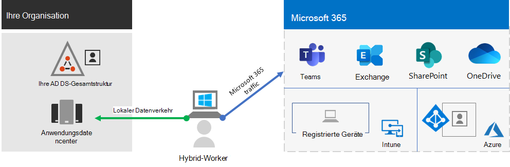

# Fördern von Remotemitarbeitern mit Microsoft 365Empower remote workers with Microsoft 365

Ihr Unternehmen muss möglicherweise Ihren Arbeitnehmern von zu Hause aus einen sicheren Zugang zu den Informationen, Tools und Ressourcen Ihres Unternehmens vor Ort und in der Cloud ermöglichen.Your business may need to enable your workers to have secure access to your organization's on-premises and cloud-based information, tools, and resources from their homes. Es ist für viele Organisationen wichtig, den Mitarbeitern das Arbeiten außerhalb des Büros zu ermöglichen:Allowing workers to work away from the office is important for many organizations to:

- Einsparen von Bürofläche.Save on office space.
- Einstellung und Bindung von Arbeitnehmern, die nicht bereit sind, umzuziehen.Hire and retain workers who are unwilling to relocate.
- Verringern Sie das Pendeln von Arbeitnehmern, sodass ihnen mehr Zeit bleibt, produktiv zu sein und stressmindernde Tätigkeiten außerhalb der Arbeit zu verrichten.Reduce worker commuting, leaving them with more time to be productive and for stress-reducing activities outside of work.

Microsoft 365 bietet die Möglichkeit, Ihre Mitarbeiter zu befähigen, Remote zu arbeiten.Microsoft 365 has the capabilities to empower your workers to work remotely.

| | |
|:-------|:-----|
| VerbundenConnected | Von überall auf der Welt und jederzeit können Remote-Mitarbeiter zugreifen:From anywhere in the world and at any time, remote workers are able to access: <ul><li>Cloud-basierte Dienste und Daten in Ihrem Microsoft 365-Abonnement.Cloud-based services and data in your Microsoft 365 subscription. </li><li>Organisationsressourcen, wie sie z. B. in lokalen Anwendungsrechenzentren verfügbar sind.Organization resources, such those offered by on-premises application datacenters.</li></ul> |
| SicherSecure | Die Anmeldungen werden durch die mehrstufige Authentifizierung (Multi-Factor Authentication, MFA) und die integrierten Sicherheitsfeatures von Microsoft 365 und Windows 10 geschützt und schützen vor Schadsoftware, bösartigen Angriffen und Datenverlust.Sign-ins are secured with multi-factor authentication (MFA) and built-in security features of Microsoft 365 and Windows 10 protect against malware, malicious attacks, and data loss. |
| VerwaltetManaged | Die Geräte Ihrer aus der Ferne arbeitenden Mitarbeiter können mit Sicherheitseinstellungen, zulässigen Apps und zur Einhaltung der Systemintegrität aus der Cloud verwaltet werden.Your remote worker's devices can be managed from the cloud with security settings, allowed apps, and to require compliance with system health. |
| Kooperativ und produktivCollaborative and productive | Ihre aus der Ferne arbeitenden Mitarbeiter können so produktiv wie die lokal arbeitenden sein – und das auf sehr kooperative Weise mit:Your remote workers can be as productive as on-premises in a highly collaborative way with: <ul><li>Onlinebesprechungen und Chatsitzungen mit Teams.Online meetings and chat sessions with Teams. </li><li>Freigegebene Arbeitsbereiche für cloudbasierte Dateispeicherung mit globalem Zugriff und Zusammenarbeit in Echtzeit mit SharePoint und OneDrive.Shared workspaces for cloud-based file storage with global accessibility and real-time collaboration with SharePoint and OneDrive. </li><li>Gemeinsame Aufgaben und Workflows, um die Arbeit aufzuteilen und Dinge zu erledigen.Shared tasks and workflows to divide up the work and get things done. </li></ul> |
|||

Für einen flüssigen Anmeldevorgang sollten Ihre lokalen AD DS-Benutzerkonten (Active Directory Domain Services) mit Azure Active Directory (Azure AD) synchronisiert werden.For a seamless sign-in experience, your on-premises Active Directory Domain Services (AD DS) user accounts should be synchronized with Azure Active Directory (Azure AD). Um Ihre Windows 10-Geräte zu schützen, sollten sie in Intune registriert werden.To protect your Windows 10 devices, they should be enrolled in Intune. Hier ist eine allgemeine Übersicht über die Infrastruktur.Here is a high-level view of the infrastructure.

Verwenden Sie zur Erfüllung der Voraussetzungen für Remotemitarbeiter die folgenden Microsoft 365-Funktionen und -Features.To meet the criteria for remote workers, use these Microsoft 365 capabilities and features.

| Funktion oder FeatureCapability or feature | BeschreibungDescription | LizenzierungLicensing |
|:-------|:-----|:-------|
| Mehrstufige Authentifizierung (MFA, Multi-Factor Authentication) mit Sicherheitsstandards erzwingenMFA enforced with security defaults   | Schützen Sie sich vor kompromittierten Identitäten und Geräten, indem Sie eine zweite Authentifizierungsmethode für die Anmeldung vorsehen. Sicherheitsstandards schreiben MFA für alle Benutzerkonten vor.Protect against compromised identities and devices by requiring a second form of authentication for sign-ins. Security defaults requires MFA for all user accounts.   | Microsoft 365 E3 und E5Microsoft 365 E3 and E5 |
| Mehrstufige Authentifizierung (MFA, Multi-Factor Authentication) mit bedingtem Zugriff erzwingenMFA enforced with Conditional Access| Erfordert MFA basierend auf den Anmeldungseigenschaften mit Richtlinien für bedingten Zugriff.Require MFA based on the properties of the sign-in with Conditional Access policies.    | Microsoft 365 E3 und E5Microsoft 365 E3 and E5 | 
| Mehrstufige Authentifizierung (MFA, Multi-Factor Authentication) mit risikoabhängig bedingtem Zugriff erzwingenMFA enforced with risk-based Conditional Access   | Erfordert MFA basierend auf dem Risiko der Benutzeranmeldung mit Azure Advanced Threat Protection.Require MFA based on the risk of the user sign-in with Azure Advanced Threat Protection. | Microsoft 365 E5 oder E3 mit Azure AD Premium P2-LizenzenMicrosoft 365 E5 or E3 with Azure AD Premium P2 licenses | 
| Zurücksetzen von Kennwörtern durch den Benutzer (Self-Service Password Reset, SSPR)Self-Service Password Reset (SSPR)    | Ermöglichen Sie Ihren Benutzern das Zurücksetzen oder Entsperren ihrer Kennwörter oder Konten.Allow your users to reset or unlock their passwords or accounts.  | Microsoft 365 E3 und E5Microsoft 365 E3 and E5 |
| Azure AD-AnwendungsproxyAzure AD Application Proxy    | Sorgen Sie für sicheren Remotezugriff für webbasierte Anwendungen, die auf Intranet-Servern gehostet sind.Provide secure remote access for web-based applications hosted on intranet servers.   | Erfordert separates kostenpflichtiges Azure-AbonnementRequires separate paid Azure subscription |
| Azure Punkt-zu-Site-VPNAzure Point-to-Site VPN   | Erstellen Sie über ein virtuelles Azure-Netzwerk eine sichere Verbindung vom Gerät eines Remotemitarbeiters zu Ihrem Intranet.Create a secure connection from a remote worker’s device to your intranet through an Azure virtual network.   | Erfordert separates kostenpflichtiges Azure-AbonnementRequires separate paid Azure subscription |
| Windows Virtual DesktopWindows Virtual Desktop   | Unterstützen Sie Mitarbeiter, die nur ihre persönlichen und nicht verwalteten Geräte verwenden können, mit virtuellen Desktops, die in Azure ausgeführt werden.Support remote workers who can only use their personal and unmanaged devices with virtual desktops running in Azure. | Erfordert separates kostenpflichtiges Azure-AbonnementRequires separate paid Azure subscription |
| Remotedesktopdienste (RDS)Remote Desktop Services (RDS) | Ermöglichen Sie Mitarbeitern die Verbindung mit Windows-basierten Computern in Ihrem Intranet.Allow employees to connect into Windows-based computers on your intranet. | Microsoft 365 E3 und E5Microsoft 365 E3 and E5 | 
| Remotedesktopdienste-GatewayRemote Desktop Services Gateway   | Sorgen Sie für verschlüsselte Kommunikationen und verhindern Sie, dass RDS-Hosts direkt über das Internet erreichbar sind.Encrypt communications and prevent the RDS hosts from being directly exposed to the Internet. | Erfordert separate Windows Server-LizenzenRequires separate Windows Server licenses |
| Microsoft IntuneMicrosoft Intune | Verwalten Sie Geräte und Anwendungen.Manage devices and applications.   | Microsoft 365 E3 und E5Microsoft 365 E3 and E5 | 
| Configuration ManagerConfiguration Manager | Verwalten Sie Softwareinstallationen, Updates und Einstellungen auf Ihren Geräten.Manage software installations, updates, and settings on your devices | Erfordert separate Configuration Manager-LizenzenRequires separate Configuration Manager licenses |
| Desktop AnalyticsDesktop Analytics | Ermitteln Sie die Update-Bereitschaft Ihrer Windows-Clients.Determine the update readiness of your Windows clients.   | Erfordert separate Configuration Manager-LizenzenRequires separate Configuration Manager licenses |
| Windows AutopilotWindows Autopilot | Richten Sie neue Windows 10-Geräte ein, und konfigurieren Sie sie für eine produktive Nutzung.Set up and pre-configure new Windows 10 devices for productive use.   | Microsoft 365 E3 und E5Microsoft 365 E3 and E5 |
| Microsoft Teams, Exchange Online, SharePoint Online und OneDrive, Microsoft 365 Apps, Microsoft Power Platform, Yammer, Power AppsMicrosoft Teams, Exchange Online, SharePoint Online and OneDrive, Microsoft 365 Apps, Microsoft Power Platform, Yammer, Power Apps | Planen, kommunizieren und zusammenarbeiten.Create, communicate, and collaborate. | Microsoft 365 E3 und E5Microsoft 365 E3 and E5 |
||||

Nutzen Sie diese Schritte, um den Zugriff auf die Server, Daten und Cloud-Dienste Ihres Unternehmens zu sichern und zu optimieren und eine maximale Mitarbeiterproduktivität zu ermöglichen.Use these steps to secure and optimize access to your organization's servers, data, and cloud services and enable maximum worker productivity.

1. [Erhöhung der Anmeldesicherheit durch MFAIncrease sign-in security with MFA](empower-people-to-work-remotely-secure-sign-in.md)
2. [Bereitstellung des Remotezugriffs auf lokale Apps und DiensteProvide remote access to on-premises apps and services](empower-people-to-work-remotely-remote-access.md)
3. [Bereitstellen der Endpunktverwaltung für Ihre Geräte, PCs und andere EndpunkteDeploy endpoint management for your devices, PCs, and other endpoints](empower-people-to-work-remotely-manage-endpoints.md)
4. [Bereitstellen von Produktivitätsanwendungen und -diensten für RemotemitarbeiterDeploy remote worker productivity apps and services](empower-people-to-work-remotely-teams-productivity-apps.md)
5. [Erstellen von KommunikationsveranstaltungsortenCreate communication venues](empower-people-to-work-remotely-communication-venues.md)
6. [Schulung von Remotemitarbeitern und Ansprechen von NutzungsrückmeldungenTrain remote workers and address usage feedback](empower-people-to-work-remotely-train-monitor-usage.md)

Die neuesten Informationen von Microsoft zur Unterstützung von Remotemitarbeitern finden Sie auf der [Tech Community-Website über das Fördern von Remotearbeit](https://resources.techcommunity.microsoft.com/enabling-remote-work/).For the latest information from Microsoft about supporting remote workers, see the [Enabling remote work Tech Community site](https://resources.techcommunity.microsoft.com/enabling-remote-work/).
