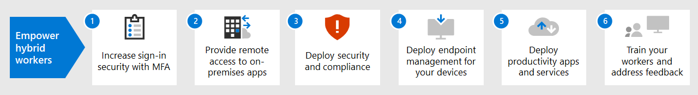

# Fördern von Remotemitarbeitern mit Microsoft 365Empower remote workers with Microsoft 365

Ihr Unternehmen muss möglicherweise Ihren Arbeitnehmern von zu Hause aus einen sicheren Zugang zu den Informationen, Tools und Ressourcen Ihres Unternehmens vor Ort und in der Cloud ermöglichen.Your business may need to enable your workers to have secure access to your organization's on-premises and cloud-based information, tools, and resources from their homes. Für viele Organisationen ist es wichtig, dass die Arbeitnehmer auch außerhalb des Büros nahtlos und sicher arbeiten können:Allowing workers to work away from the office seamlessly and securely is important for many organizations to:

- Einsparen von Bürofläche.Save on office space.
- Einstellung und Bindung von Arbeitnehmern, die nicht bereit sind, umzuziehen.Hire and retain workers who are unwilling to relocate.
- Verringern Sie das Pendeln von Arbeitnehmern, sodass ihnen mehr Zeit bleibt, produktiv zu sein und stressmindernde Tätigkeiten außerhalb der Arbeit zu verrichten.Reduce worker commuting, leaving them with more time to be productive and for stress-reducing activities outside of work.

Remotearbeit, auch als "Telearbeit" oder "Heimarbeit" bezeichnet, kann ein breites Spektrum umfassen:Remote working, also known as teleworking, can span a spectrum that includes:

- Arbeitnehmer, die sich gelegentlich für Konferenzen oder Kundenbesprechungen außerhalb des Büros befinden.workers that are occasionally away from the office for conferences or client meetings.
- Einige Arbeitnehmer, die Telearbeit in Vollzeit ausüben.Some workers that work remotely full-time.
- Eine Komplette Remoteorganisation, die kein eigenes Büro unterhält und deren Arbeitnehmer alle remote arbeiten.A fully remote organization in which there is no office and all workers are remote.

Zur Unterstützung Ihrer Remotemitarbeiter, beispielsweise als Reaktion auf die COVID-19-Krise, bietet Microsoft 365eine umfassende Kombination aus Features für die Zusammenarbeit, z. B.:To support remote workers, for example in response to the COVID-19 crisis, a combination of features in Microsoft 365 enables your remote workers in a highly collaborative way, such as:

- Onlinebesprechungen und Chatsitzungen.Online meetings and chat sessions.
- Freigegebene Arbeitsbereiche für cloudbasierte Dateispeicherung mit globalem Zugriff und Zusammenarbeit in Echtzeit.Shared workspaces for cloud-based file storage with global accessibility and real-time collaboration.
- Gemeinsame Aufgaben und Workflows, um die Arbeit aufzuteilen und Dinge zu erledigen.Shared tasks and workflows to divide up the work and get things done.

Für eine starke Sicherheit bietet Microsoft 365 Folgendes:For strong security, Microsoft 365 includes:

- Anforderungen für eine erzwungene Authentifizierung, Erkennen von und Reagieren auf Anmeldungen mit hohem Risiko und Blockieren ausgewählter Apps und nicht kompatibler Geräte.Enforced authentication requirements, detecting and responding to high-risk sign-ins, and blocking selected apps and non-compliant devices.
- Verschlüsselte Verbindungen und digitale Objekte in der Cloud.Encrypted connections and digital assets in the cloud.
- Berechtigungen, mit denen definiert werden kann, wer mit Dateien wie umgehen kann.Permissions to define who can do what with files.
- Umfassende Sicherheitsfeatures zum Schutz von Windows 10-Geräten.Comprehensive security features to protect Windows 10 devices.

Damit Remotemitarbeiter diese Kriterien erfüllen, verwenden Sie die folgenden Microsoft 365-Features:To meet these criteria for remote workers, use the following Microsoft 365 features:

- Benutzeridentität und AnmeldesicherheitUser identity and sign-in security
  - Azure Active Directory-Benutzerkonten (Azure AD) mit mehrstufiger Authentifizierung (MFA)Azure Active Directory (Azure AD) user accounts with multi-factor authentication (MFA)
  - Eine Richtlinien für den bedingten Zugriff, die MFA für riskante Anmeldungen erfordert (Microsoft 365 E5)A Conditional Access policy to require MFA for risky sign-ins (Microsoft 365 E5)
- Plattformen für die ZusammenarbeitCollaboration platforms
  - Microsoft Teams, SharePoint und OneDrive, mit denen Remotemitarbeiter videobasierte Onlinebesprechungen planen und daran teilnehmen sowie gemeinsam an den gleichen Dokumenten arbeiten könnenMicrosoft Teams, SharePoint, and OneDrive, with which remote workers can schedule and attend online video-based meetings and work on the same documents at the same time
- Absichern des Zugriffs auf RessourcenSecure access to resources
  - Mit Gruppen und Berechtigungen für Teams, SharePoint-Websites und OneDrive können Sie festlegen, dass nur authentifizierte und berechtigte Benutzer Zugriff haben.Groups and permissions for Teams, SharePoint sites, and OneDrive so that only authenticated and permitted users have access
- Schutz für offengelegte DateienProtection for leaked files
  - Vertraulichkeitsbezeichnungen für Verschlüsselung und Berechtigungen, die mit den Dateien verknüpft sindSensitivity labels for encryption and permissions that travel with files
- Geräteverwaltung mit und -sicherheit mit Microsoft IntuneDevice management and security with Microsoft Intune
  - Registrierung für verwaltete GeräteEnrollment for managed devices
  - App-Einstellungen für persönliche GeräteApp settings for personal devices
  - Geräte- und App-RichtlinienDevice and app policies
- Produktivitäts-Apps für GeräteProductivity apps for devices
  - Microsoft 365-Apps (Word, PowerPoint, Excel) für die Zusammenarbeit mit Microsoft Teams, SharePoint und OneDriveMicrosoft 365 Apps (Word, PowerPoint, Excel) for collaborative experiences with Teams, Exchange, SharePoint, and OneDrive 
- Windows 10 EnterpriseWindows 10 Enterprise
  - Integrierte Suite von Sicherheitsfeatures zum Schutz vor Cyberattacken und zum Verhindern von DatenverlustBuilt-in suite of security features to protect against cyberattacks and prevent data leakage
- Zugriff auf lokale Apps und ServerAccess to on-premises apps and servers
  - VPN-Verbindungen (virtuelles privates Netzwerk), Azure AD-Anwendungsproxy oder Azure-Punkt-zu-Standort-VPNVirtual private network (VPN) connections, Azure AD Application Proxy, or Azure Point-to-Site VPN

Nutzen Sie diese Schritte, um den Zugriff auf die Server, Daten und Cloud-Dienste Ihres Unternehmens zu sichern und zu optimieren und eine maximale Mitarbeiterproduktivität zu ermöglichen.Use these steps to secure and optimize access to your organization's servers, data, and cloud services and enable maximum worker productivity.

1. [Erhöhung der Anmeldesicherheit durch MFAIncrease sign-in security with MFA](empower-people-to-work-remotely-secure-sign-in.md)
2. [Bereitstellung des Remotezugriffs auf lokale Apps und DiensteProvide remote access to on-premises apps and services](empower-people-to-work-remotely-remote-access.md)
3. [Bereitstellen der Endpunktverwaltung für Ihre Geräte, PCs und andere EndpunkteDeploy endpoint management for your devices, PCs, and other endpoints](empower-people-to-work-remotely-manage-endpoints.md)
4. [Bereitstellen von Produktivitätsanwendungen und -diensten für RemotemitarbeiterDeploy remote worker productivity apps and services](empower-people-to-work-remotely-teams-productivity-apps.md)
5. [Erstellen von KommunikationsveranstaltungsortenCreate communication venues](empower-people-to-work-remotely-communication-venues.md)
6. [Schulung von Remotemitarbeitern und Ansprechen von NutzungsrückmeldungenTrain remote workers and address usage feedback](empower-people-to-work-remotely-train-monitor-usage.md)

Die neuesten Informationen von Microsoft zur Unterstützung von Remotemitarbeitern finden Sie auf der [Tech Community-Website über das Fördern von Remotearbeit](https://resources.techcommunity.microsoft.com/enabling-remote-work/).For the latest information from Microsoft about supporting remote workers, see the [Enabling remote work Tech Community site](https://resources.techcommunity.microsoft.com/enabling-remote-work/).
