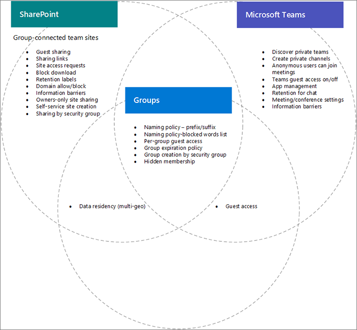

# Interaktion der Einstellungen zwischen Microsoft 365-Gruppen, Microsoft Teams und SharePoint

Einige Einstellungen für Microsoft 365 Gruppen, Microsoft Teams und SharePoint in Microsoft 365, insbesondere im Zusammenhang mit der Freigabe und gruppen-/team- und SharePoint-Websiteerstellung, überlappen sich miteinander. Dieser Artikel enthält Beschreibungen dieser Interaktionen und bewährte Methoden für die Verwendung dieser Einstellungen.

## Auswirkungen von SharePoint auf Gruppen und Teams

|SharePoint einstellung|Beschreibung|Auswirkungen auf Microsoft 365 gruppen und Teams|Empfehlung|
|:-----------------|:----------|:---------------------------------------|:-------------|
|Externe Freigabe für Organisation und Website|Bestimmt, ob Websites, Dateien und Ordner für Personen außerhalb der Organisation freigegeben werden können.|Wenn SharePoint, Gruppen und Teams einstellungen nicht übereinstimmen, können Gäste im Team am Zugriff auf die Website blockiert werden, oder es kann zu unerwartetem externen Zugriff kommen.|Wenn Sie Freigabeeinstellungen ändern, überprüfen Sie Gruppeneinstellungen, Teams Einstellungen und SharePoint Websiteeinstellungen für gruppenverkn nnte Teamwebsites.   Weitere [Informationen finden Sie unter Zusammenarbeit mit Gästen in einem Team](./collaborate-as-team.md)|
|Domänen zulassen/blockieren|Ermöglicht oder verhindert, dass Inhalte für angegebene Domänen freigegeben werden.|Gruppen und Teams erkennen keine SharePoint zulassen oder blockieren. Benutzer von Domänen, die in SharePoint nicht zulässig sind, könnten über ein Team Zugriff auf SharePoint Websites oder Inhalte erhalten.|Verwalten von Zulässig/Blockieren von Domänenlisten für Azure AD und SharePoint gemeinsam. Erstellen Sie einen organisationsweiten Steuerungsprozess zum Zulassen und Blockieren von Domänen.  Weitere [SharePoint und](/sharepoint/restricted-domains-sharing) Azure [AD-Domäneneinstellungen](/azure/active-directory/b2b/allow-deny-list)|
|Ausschließlich Benutzern in bestimmten Sicherheitsgruppen die externe Freigabe erlauben|Gibt Sicherheitsgruppen an, die SharePoint Websites, Ordnern und Dateien extern freigeben können.|Diese Einstellung verhindert nicht, dass Teambesitzer Teams extern freigeben. Teamgäste haben Zugriff auf die zugeordnete SharePoint Website.||
|SharePoint websitefreigabeeinstellungen|Bestimmt, wer die Website direkt außerhalb der Teammitgliedschaft freigeben kann. Dies wird vom Team- oder Websitebesitzer konfiguriert.|Diese Einstellung wirkt sich nicht direkt auf das Team aus, kann jedoch das Hinzufügen von Benutzern zu einer Website ermöglichen und keinen Zugriff auf das Team selbst oder andere Teams haben.|Erwägen Sie die Verwendung dieser Einstellung, um die Freigabe der Website direkt zu beschränken und den Websitezugriff über das Team zu verwalten.|
|Benutzern das Erstellen von Websites SharePoint startseite und OneDrive|Gibt an, ob Benutzer neue Websites SharePoint können.|Wenn diese Einstellung deaktiviert ist, können Benutzer weiterhin Gruppen-verbundene Teamwebsites erstellen, indem sie ein Team erstellen.||

## Auswirkungen von Gruppeneinstellungen auf Teams

|Microsoft 365 Gruppen|Beschreibung|Auswirkungen auf Teams|Empfehlung|
|:---------------------------|:----------|:--------------|:-------------|
|Benennungsrichtlinien|Gibt Präfixe und Suffixe für Gruppennamen und blockierte Wörter für die Gruppenerstellung an.|Richtlinien werden für Benutzer erzwungen, die Teams erstellen.||
|Gruppengastzugriff|Gibt an, ob Personen außerhalb der Organisation Gruppen hinzugefügt werden können.|Wenn die Gruppen oder Teams einstellungen für die Gastfreigabe deaktiviert sind, kann das Team nicht für Gäste freigegeben werden.|Überprüfen Sie beim Ändern der Einstellungen für die Gastfreigabe die Einstellungen für Teams, Gruppen und SharePoint, die dem Team zugeordnet sind.   Weitere [Informationen finden Sie unter Zusammenarbeit mit Gästen in einem Team](./collaborate-as-team.md)|
|Gruppenerstellung nach Sicherheitsgruppe|Gruppen können nur von Mitgliedern einer bestimmten Sicherheitsgruppe erstellt werden.|Benutzer, die nicht Mitglied der Sicherheitsgruppe sind, können kein Team erstellen.|Stellen Sie sicher, dass Ihr Prozess zum Anfordern einer Gruppe Anweisungen zum Anfordern eines Teams oder einer SharePoint enthält.|
|Gruppenablaufrichtlinie|Gibt einen Zeitraum an, nach dem nicht aktiv verwendete Gruppen automatisch gelöscht werden.|Wenn die Gruppe gelöscht wird, werden auch das Team und SharePoint website gelöscht. Durch Aufbewahrungsrichtlinien geschützte Inhalte werden beibehalten.|Verwenden Sie Ablaufrichtlinien, um nicht verwendete Teams, Gruppen und Websites zu vermeiden.|

## Verwandte Themen

[Schritt-für-Schritt-Planung für die Zusammenarbeitsgovernance](collaboration-governance-overview.md#collaboration-governance-planning-step-by-step)

[Erstellen eines Plans für die Zusammenarbeitsgovernance](collaboration-governance-first.md)

[Zusammenarbeit mit Personen außerhalb Ihrer Organisation](./collaborate-with-people-outside-your-organization.md)

[Verwalten der Websiteerstellung in SharePoint](/sharepoint/manage-site-creation)