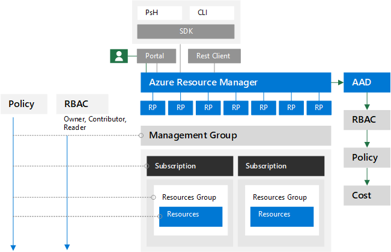

# Zur Identität und darüber hinaus – Die Identität eines Architekten

In diesem Artikel erläutert [Alex Shteynberg](https://www.linkedin.com/in/alex-shteynberg/), Principal Technical Architect bei Microsoft, die wichtigsten Entwurfsstrategien für Unternehmen, die Microsoft 365 und andere Microsoft-Clouddienste einführen.

## Über den Autor

Ich bin technischer Hauptarchitekt im New York [Microsoft Technology Center.](https://www.microsoft.com/mtc?rtc=1) Ich arbeite hauptsächlich mit großen Kunden und komplexen Anforderungen. Meine Einschätzungen und Ansichten basieren auf diesen Interaktionen und gelten möglicherweise nicht für jede Situation. Wenn wir kunden mit den komplexesten Herausforderungen jedoch helfen können, können wir meiner Erfahrung nach allen Kunden helfen.

In der Regel arbeite ich jedes Jahr mit mehr als 100 Kunden. Während jede Organisation einzigartige Merkmale aufweist, ist es interessant, Trends und Gemeinsamkeiten zu sehen. Ein Trend ist z. B. das branchenübergreifende Interesse vieler Kunden. Schließlich kann eine Bank branch auch ein Coffee shop und ein Community Center sein.

In meiner Rolle möchte ich mich darauf konzentrieren, Kunden dabei zu helfen, die beste technische Lösung zu finden, um ihre einzigartigen Geschäftsziele zu erreichen. Offiziell fokussiere ich mich auf Identität, Sicherheit, Datenschutz und Compliance. Ich finde es sehr, dass diese Alles, was wir tun, berühren. Dadurch habe ich die Möglichkeit, mich an den meisten Projekten zu beteiligen. Dadurch bin ich ziemlich beschäftigt und möchte diese Rolle übernehmen.

Ich leben in New York City (am besten!) und genoss die Vielfalt seiner Kultur, ihres Essens und seiner Menschen (nicht des Datenverkehrs). Ich bin gerne unterwegs, wenn ich die meisten Der welt in meinem Leben sehen kann und möchte. Ich recherchiere derzeit eine Reise nach Afrika, um mehr über dieses Thema zu erfahren.

## Leitprinzipien

- **Einfach ist oft besser:** Sie können (fast) alles mit Technologie tun, aber das bedeutet nicht, dass Sie dies tun sollten. Insbesondere im Sicherheitsbereich überernieren viele Kunden Lösungen. Ich mag [dieses Video](https://www.youtube.com/watch?v=SOQgABDSYZE) aus der Stripe-Konferenz von Google, um diesen Punkt zu unterstreichen.
- **Personen, Prozesse, Technologien:** [Entwerfen Sie für Personen,](https://en.wikipedia.org/wiki/Human-centered_design) um den Prozess zu verbessern, nicht zuerst techn. Es gibt keine "perfekten" Lösungen. Wir müssen verschiedene Risikofaktoren abwägen, und die Entscheidungen sind für jedes Unternehmen unterschiedlich. Zu viele Kunden entwerfen einen Ansatz, den ihre Benutzer später vermeiden.
- **Konzentrieren Sie sich auf "Warum" zuerst und "wie" später:** Seien Sie das lästig alte Kind mit einer Million Fragen. Wir können nicht zur richtigen Antwort kommen, wenn wir die richtigen Fragen nicht kennen. Viele Kunden gehen davon aus, wie die Dinge funktionieren müssen, anstatt das Geschäftsproblem zu definieren. Es gibt immer mehrere Pfade, die verwendet werden können.
- **Lange Zeit vor bewährten Methoden:** Erkennen Sie, dass sich bewährte Methoden mit Lichtgeschwindigkeit ändern. Wenn Sie Sich Azure AD vor mehr als drei Monaten angesehen haben, sind Sie wahrscheinlich veraltet. Alles hier kann nach der Veröffentlichung geändert werden. Die Option "Beste" ist heute möglicherweise nicht die gleiche option wie in sechs Monaten.

## Grundlegende Konzepte

Überspringen Sie diesen Abschnitt nicht. Ich finde oft, dass ich zu diesen Themen zurückkehren muss, auch für Kunden, die Clouddienste seit Jahren verwenden.
Leider ist Sprache kein genaues Tool. Wir verwenden häufig dasselbe Wort, um unterschiedliche Konzepte oder unterschiedliche Wörter zu verstehen, um dasselbe Konzept zu verstehen. Dieses nachstehende Diagramm verwende ich häufig, um grundlegende Terminologie und ein "Hierarchiemodell" zu erstellen.
  

 

Wenn Sie lernen, zu sich zu gehen, ist es besser, im Pool zu beginnen und nicht in der Mitte des Pazifiks. Ich versuche nicht, mit diesem Diagramm technisch genau zu sein. Es ist ein Modell, um einige grundlegende Konzepte zu besprechen.

Aus dem Diagramm geht Folgendes hervor:

- Mandant = eine Instanz von Azure AD. Sie befindet sich am "oberen" Rand einer Hierarchie oder ebene 1 im Diagramm. Wir können dies als die "[Grenze](/azure/active-directory/users-groups-roles/licensing-directory-independence)" betrachten, an der alles andere vorkommt ([Azure AD B2B](/azure/active-directory/b2b/what-is-b2b) abgesehen). Alle Microsoft Enterprise Cloud Services sind Teil eines dieser Mandanten. Verbraucherdienste sind getrennt. "Mandant" wird in der Dokumentation als Office 365 Mandant, Azure-Mandant, WVD-Mandant usw. angezeigt. Ich finde, dass diese Abweichungen für Kunden verwirrungen.
- Dienste/Abonnements, Ebene 2 im Diagramm, gehören nur einem Mandanten an. Die meisten SaaS-Dienste sind 1:1 und können nicht ohne Migration verschoben werden. Azure unterscheidet sich, Sie können die Abrechnung und/oder ein [Abonnement](/azure/active-directory/fundamentals/active-directory-how-subscriptions-associated-directory) auf einen anderen Mandanten [verschieben.](/azure/cost-management-billing/manage/billing-subscription-transfer) Es gibt viele Kunden, die Azure-Abonnements verschieben müssen. Dies hat verschiedene Auswirkungen. Objekte, die außerhalb des Abonnements vorhanden sind, werden nicht verschoben (z. B. rollenbasierte Zugriffssteuerung oder Azure RBAC und Azure AD-Objekte, einschließlich Gruppen, Apps, Richtlinien usw.). Außerdem einige Dienste (z. B. Azure Key Vault, Data Vaults usw.). Migrieren Sie dienste nicht ohne eine gute geschäftliche Notwendigkeit. Einige Skripts, die für die Migration hilfreich sein können, werden [in GitHub freigegeben.](https://github.com/lwajswaj/azure-tenant-migration)
- Ein bestimmter Dienst hat in der Regel eine Art "Unterebene"-Grenze oder Ebene 3 (L3). Dies ist hilfreich, um die Trennung von Sicherheit, Richtlinien, Governance usw. zu verstehen. Leider gibt es keinen einheitlichen Namen, von dem ich weiß. Einige Beispielnamen für L3 sind: Azure-Abonnement = [Ressource](/azure/azure-resource-manager/management/manage-resources-portal); Dynamics 365 CE = [Instanz](/dynamics365/admin/new-instance-management); Power BI = [Arbeitsbereich](/power-bi/service-create-the-new-workspaces); Power Apps = [Umgebung](/power-platform/admin/environments-overview); Und so weiter.
- Auf Ebene 4 befinden sich die tatsächlichen Daten. Diese "Datenebene" ist ein komplexes Thema. Einige Dienste verwenden Azure AD für RBAC, andere nicht. Ich werde etwas darüber sprechen, wenn wir zu Delegierungsthemen kommen.

Einige zusätzliche Konzepte, bei denen ich viele Kunden (und Microsoft-Mitarbeiter) finde, sind verwirrend oder haben Fragen dazu:

- Jeder kann kostenlos viele Mandanten [erstellen.](/azure/active-directory/fundamentals/active-directory-access-create-new-tenant) Sie benötigen keinen darin bereitgestellten Dienst. Ich habe Dutzende. Jeder Mandantenname ist im weltweiten Clouddienst von Microsoft eindeutig (d. h., es dürfen keine zwei Mandanten denselben Namen haben). Sie alle haben das Format TenantName.onmicrosoft.com. Es gibt auch Prozesse, die Mandanten automatisch erstellen ([nicht verwaltete Mandanten).](/azure/active-directory/users-groups-roles/directory-self-service-signup) Dies kann beispielsweise der Fall sein, wenn sich ein Benutzer für einen Unternehmensdienst mit einer E-Mail-Domäne anmeldet, die in keinem anderen Mandanten vorhanden ist.
- In einem verwalteten Mandanten können viele [DNS-Domänen](/azure/active-directory/fundamentals/add-custom-domain) darin registriert werden. Dadurch wird der ursprüngliche Mandantenname nicht geändert. Es gibt derzeit keine einfache Möglichkeit, einen Mandanten umzubenennen (außer der Migration). Obwohl der Mandantname heutzutage technisch nicht kritisch ist, ist dies für einige möglicherweise einschränkend.
- Sie sollten einen Mandantennamen für Ihre Organisation reservieren, auch wenn Sie noch keine Bereitstellung von Diensten planen. Andernfalls kann jemand es von Ihnen nehmen, und es gibt keinen einfachen Vorgang, um es zurückzunehmen (dasselbe Problem wie DNS-Namen). Ich höre dies zu oft von Kunden. Was Ihr Mandantname sein sollte, ist auch ein themenspezifisches Thema.
- Wenn Sie DNS-Namespaces besitzen, sollten Sie alle diese zu Ihren Mandanten hinzufügen. Andernfalls könnte ein [nicht verwalteter Mandant](/azure/active-directory/users-groups-roles/directory-self-service-signup) mit diesem Namen erstellt werden, der dann zu einer Unterbrechung führt, damit [er verwaltet wird.](/azure/active-directory/users-groups-roles/domains-admin-takeover)
- DNS-Namespace (z. B. contoso.com) kann nur zu einem Mandanten gehören. Dies hat Auswirkungen auf verschiedene Szenarien (z. B. die Freigabe einer E-Mail-Domäne während einer Fusion oder übernahme usw.). Es gibt eine Möglichkeit, ein DNS-Sub (z. B. div.contoso.com) in einem anderen Mandanten zu registrieren, dies sollte jedoch vermieden werden. Durch die Registrierung eines Domänennamens auf oberster Ebene wird davon ausgegangen, dass alle Unterdomänen zum gleichen Mandanten gehören. In Szenarien mit mehreren Mandanten (siehe unten) würde ich normalerweise empfehlen, einen anderen Domänennamen auf oberster Ebene (z. B. contoso.ch oder ch-contoso.com) zu verwenden.
- Wer sollte einen Mandanten "besitzen"? Ich sehe häufig Kunden, die nicht wissen, wer derzeit ihren Mandanten besitzt. Dies ist eine große rote Kennzeichnung. Rufen Sie den Microsoft-Support ASAP an. Ebenso problematisch ist es, wenn ein Dienstbesitzer (häufig ein Exchange Administrator) zum Verwalten eines Mandanten bestimmt ist. Der Mandant enthält alle Dienste, die Sie in Zukunft möglicherweise wünschen. Der Mandantenbesitzer sollte eine Gruppe sein, die entscheidungsfähig für die Aktivierung aller Clouddienste in einer Organisation sein kann. Ein weiteres Problem besteht darin, dass eine Mandantenbesitzergruppe aufgefordert wird, alle Dienste zu verwalten. Dies ist für große Organisationen nicht skaliert.
- Es gibt kein Konzept eines Unter-/Supermandanten. Aus irgendeinem Grund wiederholt sich dieser Vorgang immer wieder. Dies gilt auch für [Azure AD B2C-Mandanten.](/azure/active-directory-b2c/) Ich höre zu oft: "Meine B2C-Umgebung befindet sich in meinem XYZ-Mandanten" oder "Wie verschiebe ich meinen Azure-Mandanten in meinen Office 365 Mandanten?"
- Dieses Dokument konzentriert sich hauptsächlich auf die kommerzielle weltweite Cloud, da die meisten Kunden dies verwenden. Manchmal ist es hilfreich, sich über [unabhängige Clouds](/azure/active-directory/develop/authentication-national-cloud)zu informieren. Unabhängige Clouds haben zusätzliche Auswirkungen zu besprechen, die für diese Diskussion nicht in Frage kommen.

## Grundlegende Identitätsthemen

Es gibt viele Dokumentationen zur Identitätsplattform von Microsoft – Azure Active Directory (Azure AD). Für diejenigen, die gerade erst beginnen, ist es oft überwältigend. Auch wenn Sie mehr darüber erfahren haben, kann es schwierig sein, mit konstanten Innovationen und Veränderungen Schritt zu halten. In meinen Kundeninteraktionen bin ich oft als "Übersetzer" zwischen Geschäftszielen und "Guten, besseren, besten" Ansätzen für diese (und menschliche "Notizen" für diese Themen) tätig. Es gibt nur selten eine perfekte Antwort, und die "richtige" Entscheidung ist ein Gleichgewicht aus verschiedenen Risikofaktoren. Nachfolgend finden Sie einige der allgemeinen Fragen und Verwirrungsbereiche, die ich mit Kunden besprechen möchte.

### Bereitstellung

Azure AD kann nicht aufgrund fehlender Governance in Ihrer Identitätswelt gelöst werden! [Identitätsgovernance](/azure/active-directory/governance/identity-governance-overview) sollte unabhängig von Cloudentscheidungen ein wichtiges Element sein. Die Governanceanforderungen ändern sich im Laufe der Zeit, weshalb es sich um ein Programm und kein Tool handelt.

[Azure AD Verbinden](/azure/active-directory/hybrid/whatis-azure-ad-connect) im Vergleich [zu Microsoft Identity Manager](/microsoft-identity-manager/microsoft-identity-manager-2016) (MIM) im Vergleich zu etwas anderem (Drittanbieter oder benutzerdefiniert)? Sparen Sie sich jetzt und in Zukunft viel Mühe, und gehen Sie mit Azure AD Verbinden. Es gibt alle Arten von Smarts in diesem Tool, um auf unterschiedliche Kundenkonfigurationen und fortlaufende Innovationen zu setzen.

Einige Edgefälle, die zu einer komplexeren Architektur führen können:

- Ich habe mehrere AD-Gesamtstrukturen ohne Netzwerkkonnektivität zwischen diesen. Es gibt eine neue Option namens [Cloudbereitstellung.](/azure/active-directory/cloud-provisioning/what-is-cloud-provisioning)
- Ich habe weder Active Directory noch möchte ich es installieren. Azure AD-Verbinden können für die [Synchronisierung von LDAP](/azure/active-directory/hybrid/plan-hybrid-identity-design-considerations-tools-comparison) konfiguriert werden (Möglicherweise ist ein Partner erforderlich).
- Ich muss dieselben Objekte für mehrere Mandanten bereitstellen. Dies wird technisch nicht unterstützt, hängt jedoch von der Definition von "identisch" ab.

Soll ich standardsynchronisierungsregeln anpassen ([Filterobjekte,](/azure/active-directory/hybrid/how-to-connect-sync-configure-filtering) [Attribute ändern,](/azure/active-directory/hybrid/reference-connect-sync-attributes-synchronized) [alternative Anmelde-ID](/azure/active-directory/hybrid/plan-connect-userprincipalname)usw.)? Vermeiden Sie es! Eine Identitätsplattform ist nur so wertvoll wie die Dienste, die sie verwenden. Sie können zwar alle Arten von Kurzkonfigurationen ausführen, aber um diese Frage zu beantworten, müssen Sie sich die Auswirkungen auf Anwendungen ansehen. Wenn Sie E-Mail-aktivierte Objekte filtern, ist die GAL für Onlinedienste unvollständig. Wenn die Anwendung bestimmte Attribute verwendet, hat das Filtern dieser Attribute unvorhersehbare Auswirkungen. Und so weiter. Es handelt sich nicht um eine Identitätsteam-Entscheidung.

XYZ SaaS unterstützt Just-in-Time (JIT)-Bereitstellung. Warum muss ich synchronisiert werden? Siehe weiter oben. Viele Anwendungen benötigen "Profilinformationen" für die Funktionalität. Sie können keine GAL verwenden, wenn nicht alle E-Mail-aktivierten Objekte verfügbar sind. Gleiches gilt für die [Benutzerbereitstellung](/azure/active-directory/app-provisioning/user-provisioning) in Anwendungen, die in Azure AD integriert sind.

### Authentifizierung

[Kennworthashsynchronisierung](/azure/active-directory/hybrid/how-to-connect-password-hash-synchronization) (Password Hash Sync, PHS) im Vergleich zur [Pass-Through-Authentifizierung](/azure/active-directory/hybrid/how-to-connect-pta-how-it-works) (PTA) im Vergleich zum [Partnerverbund.](/azure/active-directory/hybrid/how-to-connect-fed-compatibility)

In der Regel gibt es eine große [Diskussion](/azure/active-directory/hybrid/choose-ad-authn) um den Partnerverbund. Einfacher ist in der Regel besser und verwendet daher PHS, es sei denn, Sie haben einen guten Grund, dies nicht zu versuchen. Es ist auch möglich, unterschiedliche Authentifizierungsmethoden für unterschiedliche DNS-Domänen im selben Mandanten zu konfigurieren.

Einige Kunden aktivieren Den Partnerverbund und PHS hauptsächlich für:

- Eine Option zum [Zurücksetzen](/azure/active-directory/hybrid/plan-migrate-adfs-password-hash-sync) auf (für die Notfallwiederherstellung), wenn der Verbunddienst nicht verfügbar ist.
- Zusätzliche Funktionen (z. B. [Azure AD DS)](/azure/active-directory-domain-services/tutorial-configure-password-hash-sync)und Sicherheitsdienste (z. B.: [offengelegte Anmeldeinformationen)](/azure/active-directory/reports-monitoring/concept-risk-events#leaked-credentials)
- Unterstützung für Dienste in Azure, die die Verbundauthentifizierung nicht verstehen (z. B. [Azure-Dateien).](/azure/storage/files/storage-files-active-directory-overview)

Ich gehe Kunden häufig durch den Clientauthentifizierungsfluss, um einige Missverständnisse zu verdeutlichen. Das Ergebnis sieht wie das bild unten aus, das nicht so gut ist wie der interaktive Prozess des Anstiegs.

Diese Art von Whiteboardzeichnung veranschaulicht, wo Sicherheitsrichtlinien innerhalb des Flusses einer Authentifizierungsanforderung angewendet werden. In diesem Beispiel werden Richtlinien, die über den Active Directory-Verbunddienst (AD FS) erzwungen werden, auf die erste Dienstanforderung, aber nicht auf nachfolgende Dienstanforderungen angewendet. Dies ist mindestens ein Grund, Sicherheitskontrollen so weit wie möglich in die Cloud zu verschieben.

Wir verfolgen den Wunsch nach [einmaligem Anmelden (Single Sign-On,](/azure/active-directory/manage-apps/what-is-single-sign-on) SSO), solange ich mich erinnern kann. Einige Kunden glauben, dass sie dies erreichen können, indem sie den Anbieter für den "richtigen" Partnerverbund (STS) auswählen. Azure AD kann erheblich dazu beitragen, [SSO-Funktionen](/azure/active-directory/manage-apps/plan-sso-deployment) zu aktivieren, aber kein STS ist einfach. Es gibt zu viele "Legacy"-Authentifizierungsmethoden, die weiterhin für kritische Anwendungen verwendet werden. Die Erweiterung von Azure AD mit [Partnerlösungen](/azure/active-directory/saas-apps/tutorial-list) kann viele dieser Szenarien abdecken. SSO ist eine Strategie und eine Reise. Sie können nicht dorthin gelangen, ohne auf [Standards für Anwendungen](/azure/active-directory/develop/v2-app-types)umzugehen. Im Zusammenhang mit diesem Thema geht es um eine Reise zur [kennwortlosen](/azure/active-directory/authentication/concept-authentication-passwordless) Authentifizierung, die auch keine eindeutige Antwort hat.

[Die mehrstufige Authentifizierung (Multi-Factor Authentication,](/azure/active-directory/authentication/concept-mfa-howitworks) MFA) ist heute unerlässlich[(hier](https://techcommunity.microsoft.com/t5/azure-active-directory-identity/your-pa-word-doesn-t-matter/ba-p/731984) für mehr). Fügen Sie die Analyse des [Benutzerverhaltens](/azure/active-directory/authentication/tutorial-risk-based-sspr-mfa) hinzu, und Sie haben eine Lösung, die die häufigsten Cyberangriffe verhindert. Sogar Verbraucherdienste werden so umgezogen, dass MFA erforderlich ist. Dennoch treffe ich mich mit vielen Kunden, die nicht auf [moderne Authentifizierungsansätze umsteigen](../enterprise/hybrid-modern-auth-overview.md) möchten. Das größte Argument, das ich höre, ist, dass es Sich auf Benutzer und ältere Anwendungen auswirkt. Manchmal kann ein guter Kick den Kunden helfen, mitzugehen – Exchange Online [angekündigte Änderungen.](https://techcommunity.microsoft.com/t5/exchange-team-blog/basic-auth-and-exchange-online-february-2020-update/ba-p/1191282) Viele Azure [AD-Berichte](/azure/active-directory/fundamentals/concept-fundamentals-block-legacy-authentication) stehen jetzt zur Verfügung, um Kunden bei diesem Übergang zu unterstützen.

### Authorization

Laut [Wikipedia](https://en.wikipedia.org/wiki/Authorization)dient "zur Autorisierung" zum Definieren einer Zugriffsrichtlinie. Viele Personen betrachten es als die Möglichkeit, Zugriffssteuerungen für ein Objekt (Datei, Dienst usw.) zu definieren. In der aktuellen Welt der Cyberbedrohungen entwickelt sich dieses Konzept schnell zu einer dynamischen Richtlinie, die auf verschiedene Bedrohungsvektoren reagieren und zugriffssteuerungen schnell darauf anpassen kann. Wenn ich beispielsweise von einem ungewöhnlichen Ort aus auf mein Bankkonto zugreift, erhalte ich zusätzliche Bestätigungsschritte. Um dies zu nähern, müssen wir nicht nur die Richtlinie selbst, sondern auch das Ökosystem der Methoden zur Bedrohungserkennung und Signalkorrelation berücksichtigen.

Das Richtlinienmodul von Azure AD wird mithilfe von [Richtlinien für bedingten Zugriff](/azure/active-directory/conditional-access/overview)implementiert. Dieses System hängt von Informationen aus einer Vielzahl anderer Systeme zur Bedrohungserkennung ab, um dynamische Entscheidungen zu treffen. Eine einfache Ansicht würde etwa wie die folgende Abbildung aussehen:

Die Kombination all dieser Signale ermöglicht dynamische Richtlinien wie diese:

- Wenn eine Bedrohung auf Ihrem Gerät erkannt wird, wird Ihr Zugriff auf Daten nur auf das Web reduziert, ohne dass sie heruntergeladen werden können.
- Wenn Sie eine ungewöhnlich große Datenmenge herunterladen, wird alles, was Sie herunterladen, verschlüsselt und eingeschränkt.
- Wenn Sie von einem nicht verwalteten Gerät aus auf einen Dienst zugreifen, werden Sie für streng vertrauliche Daten gesperrt, können aber auf nicht eingeschränkte Daten zugreifen, ohne dass Sie sie an einen anderen Speicherort kopieren können.

Wenn Sie dieser erweiterten Autorisierungsdefinition zustimmen, müssen Sie zusätzliche Lösungen implementieren. Welche Lösungen Sie implementieren, hängt davon ab, wie dynamisch die Richtlinie sein soll und welche Bedrohungen Sie priorisieren möchten. Beispiele für solche Systeme sind:

- [Azure AD Identity Protection](/azure/active-directory/identity-protection/)
- [Microsoft Defender for Identity](/azure-advanced-threat-protection/)
- [Microsoft Defender für Endpunkt](/windows/security/threat-protection/microsoft-defender-atp/microsoft-defender-advanced-threat-protection)
- [Microsoft Defender für Office 365](../security/office-365-security/defender-for-office-365.md)
- [Microsoft Cloud App Security](/cloud-app-security/) (MCAS)
- [Microsoft 365 Defender](../security/defender/microsoft-365-defender.md)
- [Microsoft Intune](/mem/intune/)
- [Microsoft Information Protection](../compliance/information-protection.md) (MIP)
- [Azure Sentinel](/azure/sentinel/)

Neben Azure AD verfügen natürlich auch verschiedene Dienste und Anwendungen über eigene spezifische Autorisierungsmodelle. Einige davon werden später im Abschnitt "Delegierung" erläutert.

### Überwachung

Azure AD verfügt über detaillierte [Überwachungs- und Berichtsfunktionen.](/azure/active-directory/reports-monitoring/) Dies ist jedoch in der Regel nicht die einzige Informationsquelle, die erforderlich ist, um Sicherheitsentscheidungen zu treffen. Weitere Informationen hierzu finden Sie im Abschnitt "Delegierung".

## Es gibt keine Exchange

Keine Panik! Dies bedeutet nicht Exchange veraltet ist (oder SharePoint usw.). Es ist immer noch ein Kerndienst. Was ich meine, ist, dass Technologieanbieter seit geraumer Zeit die Benutzererfahrung (User Experiences, UX) so umgestellt haben, dass sie Komponenten mehrerer Dienste umfassen. In Microsoft 365 ist ein einfaches Beispiel["moderne Anlagen",](https://support.office.com/article/Attach-files-or-insert-pictures-in-Outlook-email-messages-BDFAFEF5-792A-42B1-9A7B-84512D7DE7FC)bei denen Anlagen an E-Mails in SharePoint Online oder OneDrive for Business gespeichert werden.

Wenn Sie sich den Outlook-Client ansehen, sehen Sie viele Dienste, die im Rahmen dieser Erfahrung "verbunden" sind, nicht nur Exchange. Dazu gehören Azure AD, Microsoft Search, Apps, Profile, Compliance und Office 365-Gruppen.

Informieren Sie sich über [Microsoft Fluid Framework](https://techcommunity.microsoft.com/t5/microsoft-365-blog/microsoft-ignite-blog-microsoft-fluid-framework-preview/ba-p/978268) für die Vorschau bevorstehender Funktionen. In der Vorschau kann ich Teams Unterhaltungen direkt in Outlook lesen und beantworten. Tatsächlich ist der [Teams Client](https://products.office.com/microsoft-teams/download-app) eines der wichtigsten Beispiele für diese Strategie.

Insgesamt wird es schwieriger, eine klare Linie zwischen Office 365 und anderen Diensten in Microsoft-Clouds zu ziehen. Ich finde es ein großer Vorteil für Kunden, da sie von gesamter Innovation über alles, was wir tun, profitieren können, auch wenn sie eine Komponente verwenden. Ziemlich cool und hat für viele Kunden weit reichende Auswirkungen.

Heute finde ich, dass viele KUNDEN-IT-Gruppen um "Produkte" strukturiert sind. Es ist logisch für eine lokale Welt, da Sie einen Experten für jedes bestimmte Produkt benötigen. Ich bin jedoch total glücklich, dass ich nie wieder eine Active Directory- oder Exchange-Datenbank debuggen muss, da diese Dienste in die Cloud verschoben wurden. Automatisierung (welche Art von Cloud) entfernt bestimmte wiederholte manuelle Aufträge (sehen Sie, was mit Fabriken passiert ist). Diese werden jedoch durch komplexere Anforderungen ersetzt, um die diensteübergreifende Interaktion, auswirkungen, geschäftliche Anforderungen usw. zu verstehen. Wenn Sie bereit sind, zu [lernen,](/learn/)gibt es großartige Möglichkeiten, die durch die Cloudtransformation ermöglicht werden. Vor dem Einstieg in die Technologie spreche ich häufig mit Kunden über die Verwaltung von Änderungen an IT-Fähigkeiten und Teamstrukturen.

Für alle SharePoint Fan-Personen und Entwickler fragen Sie bitte nicht mehr: "Wie kann ich XYZ in SharePoint Online tun?" Verwenden Sie [Power Automate](/power-automate/) (oder Flow) für Workflows, es ist eine viel leistungsfähigere Plattform. Verwenden Sie [Azure Bot Framework,](/azure/bot-service/) um eine bessere UX für Ihre 500-K-Elementliste zu erstellen. Beginnen Sie mit der Verwendung von [Microsoft Graph](https://developer.microsoft.com/graph/) anstelle von CSOM. [Microsoft Teams](/MicrosoftTeams/Teams-overview) umfasst SharePoint, aber auch eine Welt mehr. Es gibt viele weitere Beispiele, die ich auflisten kann. Es gibt ein großes und großartiges Universe. Öffnen Sie die Eingangstür, und [beginnen Sie mit der Erkundung.]()

Die andere häufige Auswirkung liegt im Compliancebereich. Dieser dienstübergreifende Ansatz scheint viele Compliancerichtlinien völlig zu verwechseln. Ich sehe immer wieder Organisationen, die sagen: "Ich muss alle E-Mail-Kommunikationen in einem eDiscovery-System journalen." Was bedeutet das wirklich, wenn E-Mails nicht mehr nur E-Mails, sondern ein Fenster in andere Dienste sind? Office 365 hat einen umfassenden Ansatz für [Compliance,](../compliance/index.yml)aber das Ändern von Personen und Prozessen ist häufig viel schwieriger als die Technologie.

Es gibt viele andere Auswirkungen auf Personen und Prozesse. Meiner Meinung nach ist dies ein kritischer und nicht behandelter Bereich. Vielleicht mehr in einem anderen Artikel.

## Mandantenstrukturoptionen

### Einzelmandant im Vergleich zu mehreren Mandanten

Im Allgemeinen sollten die meisten Kunden nur einen Produktionsmandanten haben. Es gibt viele Gründe, warum mehrere Mandanten eine Herausforderung darstellen (geben Sie eine [Bing Suche)](https://www.bing.com/search?q=office%20365%20multiple%20tenants)oder lesen Sie dieses [Whitepaper.](https://aka.ms/multi-tenant-user) Gleichzeitig verfügen viele Unternehmenskunden, mit der ich arbeite, über einen anderen (kleinen) Mandanten für IT-Lern-, Test- und Experimentierzwecke. Der mandantenübergreifende Azure-Zugriff wird mit [Azure-Azure-Mandanten](https://azure.microsoft.com/services/azure-lighthouse/)vereinfacht. Office 365 und viele andere SaaS-Dienste gelten Grenzwerte für mandantenübergreifende Szenarien. In [Azure AD B2B-Szenarien](/azure/active-directory/b2b/what-is-b2b) ist viel zu berücksichtigen.

Viele Kunden enden mit mehreren Produktionsmandanten nach einer Fusion und Übernahme (M&A) und möchten konsolidieren. Dies ist heute nicht einfach und erfordert Microsoft Consulting Services (MCS) oder einen Partner sowie Software von Drittanbietern. Es gibt fortlaufende Technische Arbeit, um in Zukunft verschiedene Szenarien mit mehrinstanzenfähigen Kunden zu behandeln.

Einige Kunden entscheiden sich für mehr als einen Mandanten. Dies sollte eine sehr sorgfältige Entscheidung sein und fast immer geschäftsgrundgesteuert sein! Einige Beispiele sind:

- Eine Holding-Typ-Unternehmensstruktur, bei der eine einfache Zusammenarbeit zwischen verschiedenen Entitäten nicht erforderlich ist und starke administrative und andere Isolationsanforderungen bestehen.
- Nach dem Kauf wird eine Geschäftsentscheidung getroffen, um zwei Entitäten voneinander zu trennen.
- Simulation der Umgebung eines Kunden, die die Produktionsumgebung des Kunden nicht ändert.
- Entwicklung von Software für Kunden.

In diesen mehrinstanzenfähigen Szenarien möchten Kunden häufig einige Konfigurationen mandantenübergreifend gleich halten oder Konfigurationsänderungen und Abweichungen melden. Dies bedeutet häufig den Wechsel von manuellen Änderungen zur Konfiguration als Code. Der Support von Microsoft Doppelklick bietet einen Workshop für diese Arten von Anforderungen basierend auf dieser öffentlichen IP an: <https://Microsoft365dsc.com> .

### Multi-Geo

Zu [Multi-Geo](../enterprise/microsoft-365-multi-geo.md) oder nicht zu Multi-Geo, das ist die Frage. Mit Office 365 Multi-Geo können Sie ruhenden Daten an den geografischen Standorten bereitstellen und speichern, die Sie ausgewählt haben, um die Anforderungen an die [Datenaufbewahrung](../enterprise/o365-data-locations.md) zu erfüllen. Es gibt viele Missverständnisse über diese Funktion. Denken Sie dabei an Folgendes:

- Es bietet keine Leistungsvorteile. Die Leistung kann schlechter werden, wenn der [Netzwerkentwurf](https://aka.ms/office365networking) nicht korrekt ist. Rufen Sie Geräte "in der Nähe" des Microsoft-Netzwerks ab, nicht unbedingt an Ihre Daten.
- Es ist keine Lösung für die [DSGVO-Compliance.](https://www.microsoft.com/trust-center/privacy/gdpr-overview) Die DSGVO konzentriert sich nicht auf Datenhoheit oder Speicherorte. Dafür gibt es weitere Compliance-Frameworks.
- Sie löst nicht die Delegierung der Verwaltung (siehe unten) oder [Informationsbarrieren.](../compliance/information-barriers.md)
- Sie ist nicht identisch mit mehreren Mandanten und erfordert zusätzliche [Benutzerbereitstellungsworkflows.](https://github.com/MicrosoftDocs/azure-docs-pr/blob/master/articles/active-directory/hybrid/how-to-connect-sync-feature-preferreddatalocation.md)
- [Ihr Mandant](../enterprise/moving-data-to-new-datacenter-geos.md) (Azure AD) wird nicht in eine andere Geografie verschoben.

## Delegierung der Verwaltung

In den meisten großen Organisationen ist die Trennung von Aufgaben und rollenbasierter Zugriffssteuerung (RBAC) eine notwendige Realität. Ich werde mich im Voraus entzei nen. Dies ist nicht so einfach, wie es von einigen Kunden gewünscht wird. Kunden-, Rechts-, Compliance- und andere Anforderungen sind unterschiedlich und stehen manchmal weltweit in Konflikt. Einfachheit und Flexibilität stehen häufig gegenüber. Machen Sie mich nicht falsch, wir können hier einen besseren Job machen. Im Laufe der Zeit wurden (und werden) erhebliche Verbesserungen vorgenommen. Besuchen Sie Ihr lokales [Microsoft Technology Center,](https://www.microsoft.com/mtc) um das Modell zu entwickeln, das Ihren Geschäftsanforderungen entspricht, ohne 379230-Dokumente zu lesen! Hier werde ich mich auf das konzentrieren, was Sie denken sollten und nicht, warum dies der Fall ist. Nachfolgend finden Sie fünf verschiedene Bereiche, die sie planen müssen, sowie einige der allgemeinen Fragen, auf die ich gestoßen bin.

### Azure AD und Microsoft 365 Admin Center

Es gibt eine lange und wachsende Liste integrierter [Rollen.](/azure/active-directory/users-groups-roles/directory-assign-admin-roles) Jede Rolle besteht aus einer Liste von Rollenberechtigungen, die gruppiert sind, damit bestimmte Aktionen ausgeführt werden können. Sie können diese Berechtigungen auf der Registerkarte "Beschreibung" in jeder Rolle sehen. Alternativ können Sie eine lesbarere Version dieser Versionen im Microsoft 365 Admin Center sehen. Die Definitionen für integrierte Rollen können nicht geändert werden. Im Allgemeinen werden diese in drei Kategorien unterteilt:

- **Globaler Administrator:** Diese "alles leistungsfähige" Rolle sollte genau wie in anderen Systemen [hochgradig geschützt](../enterprise/protect-your-global-administrator-accounts.md) sein. Typische Empfehlungen sind: keine dauerhafte Zuweisung und Verwendung von Azure AD Privileged Identity Management (PIM); starke Authentifizierung; Und so weiter. Interessanterweise bietet Ihnen diese Rolle nicht standardmäßig Zugriff auf alles. In der Regel sehe ich Verwirrung hinsichtlich des Compliancezugriffs und des Azure-Zugriffs, der später erläutert wird. Diese Rolle kann jedoch immer Zugriff auf andere Dienste im Mandanten zuweisen.
- **Bestimmte Dienstadministratoren:** Einige Dienste (Exchange, SharePoint, Power BI usw.) nutzen allgemeine Verwaltungsrollen von Azure AD. Dies ist nicht in allen Diensten konsistent, und es werden später spezifischere Rollen behandelt.
- **Funktional:** Es gibt eine lange (und wachsende) Liste von Rollen, die sich auf bestimmte Vorgänge (Gasteinladende usw.) konzentrieren. In regelmäßigen Abständen werden mehr davon basierend auf den Kundenanforderungen hinzugefügt.

Es ist nicht möglich, alles zu delegieren (obwohl die Lücke abnimmt), was bedeutet, dass die Rolle des globalen Administrators manchmal verwendet werden muss. Konfiguration als Code und Automatisierung sollten anstelle der Mitgliedschaft von Personen in dieser Rolle berücksichtigt werden.

**Hinweis:** Die Microsoft 365 Admin Center verfügt über eine benutzerfreundlichere Benutzeroberfläche, verfügt aber über eine Teilmenge der Funktionen im Vergleich zur Azure AD-Administratorumgebung. Beide Portale verwenden die gleichen Azure AD-Rollen, sodass Änderungen an derselben Stelle vorgenommen werden. Tipp: Wenn Sie eine Auf Identitätsverwaltung ausgerichtete Administrator-UI ohne die gesamte Azure-Übersichtlichkeit wünschen, verwenden Sie <https://aad.portal.azure.com> .

Was ist im Namen? Gehen Sie nicht vom Namen der Rolle aus. Sprache ist kein sehr präzises Tool. Ziel sollte es sein, Vorgänge zu definieren, die delegiert werden müssen, bevor sie sich ansehen, welche Rollen erforderlich sind. Wenn sie jemanden zur Rolle "Sicherheitsleseberechtigter" hinzufügen, werden die Sicherheitseinstellungen nicht überall angezeigt.

Die Möglichkeit, [benutzerdefinierte Rollen](/azure/active-directory/users-groups-roles/roles-custom-overview) zu erstellen, ist eine häufige Frage. Dies ist in Azure AD heute begrenzt (siehe unten), wird jedoch im Laufe der Zeit an Den Funktionen wachsen. Ich betrachte diese als anwendbar für Funktionen in Azure AD und kann das Hierarchiemodell möglicherweise nicht "unten" umfassen (siehe oben). Wenn ich mit "benutzerdefiniert" zu tun habe, neige ich dazu, zu meinem Prinzipal "Einfach ist besser" zurückzukehren.

Eine weitere häufige Frage ist die Möglichkeit, Rollen auf eine Teilmenge eines Verzeichnisses zu beschränken. Ein Beispiel ist etwa "Helpdesk-Administrator für Benutzer nur in der EU". [Administrative Units](/azure/active-directory/users-groups-roles/directory-administrative-units) (AU) sind dafür vorgesehen, dies zu beheben. Wie oben wird davon abgemeldet, dass sie für Funktionen in Azure AD anwendbar sind und sich möglicherweise nicht "nach unten" erstrecken. Bestimmte Rollen sind für den Bereich natürlich nicht sinnvoll (globale Administratoren, Dienstadministratoren usw.).

Heute erfordern alle diese Rollen eine direkte Mitgliedschaft (oder dynamische Zuweisung, wenn Sie [Azure AD PIM](/azure/active-directory/privileged-identity-management/)verwenden). Dies bedeutet, dass Kunden diese direkt in Azure AD verwalten müssen und nicht auf einer Sicherheitsgruppenmitgliedschaft basieren können. Ich bin kein Fan von Skripts zum Verwalten dieser Skripts, da sie mit erhöhten Rechten ausgeführt werden müssen. Im Allgemeinen wird die API-Integration in Prozesssysteme wie ServiceNow oder die Verwendung von Partnergovernancetools wie Saviynt empfohlen. Dies wird im Laufe der Zeit mit technischen Arbeiten behoben.

Ich habe [Azure AD PIM](/azure/active-directory/privileged-identity-management/) einige Male erwähnt. Es gibt eine entsprechende Microsoft Identity Manager (MIM) [Privileged Access Management](/microsoft-identity-manager/pam/privileged-identity-management-for-active-directory-domain-services) (PAM)-Lösung für lokale Steuerelemente. Möglicherweise möchten Sie sich auch [Privileged Access Workstations](/windows-server/identity/securing-privileged-access/privileged-access-workstations) (PAWs) und [Azure AD Identity Governance](/azure/active-directory/governance/identity-governance-overview)ansehen. Es gibt auch verschiedene Drittanbietertools, die just-in-time, just-enough und dynamische Rollenerweiterungen ermöglichen können. Dies ist in der Regel Teil einer ausführlicheren Diskussion zum Sichern einer Umgebung.

Manchmal ist in Szenarien das Hinzufügen eines externen Benutzers zu einer Rolle erforderlich (siehe Abschnitt mit mehreren Mandanten oben). Dies funktioniert einwandfrei. [Azure AD B2B](/azure/active-directory/b2b/) ist ein weiteres großes und interessantes Thema, mit dem Kunden geführt werden können, vielleicht in einem anderen Artikel.

### Security and Compliance Center (SCC)

[Berechtigungen im Office 365 Security & Compliance Center](../security/office-365-security/permissions-in-the-security-and-compliance-center.md) sind eine Sammlung von "Rollengruppen", die getrennt und von Azure AD-Rollen getrennt sind. Dies kann verwirrend sein, da einige dieser Rollengruppen denselben Namen wie Azure AD-Rollen haben (z. B. "Security Reader"), aber sie können unterschiedliche Mitgliedschaften haben. Ich bevorzuge die Verwendung von Azure AD-Rollen. Jede Rollengruppe besteht aus einer oder mehreren "Rollen" (was bedeute ich beim Wiederverwenden desselben Worts?) und verfügt über Mitglieder aus Azure AD, bei denen es sich um E-Mail-aktivierte Objekte handelt. Sie können auch eine Rollengruppe mit demselben Namen wie eine Rolle erstellen, die diese Rolle enthalten kann oder nicht (vermeiden Sie diese Verwirrung).

In gewissem Sinne handelt es sich hierbei um eine Weiterentwicklung des Modells Exchange Rollengruppen. Exchange Online verfügt jedoch über eine eigene Schnittstelle für [die Rollengruppenverwaltung.](/exchange/permissions-exo) Einige Rollengruppen in Exchange Online werden von Azure AD oder dem Security & Compliance Center gesperrt und verwaltet, andere haben möglicherweise denselben oder einen ähnlichen Namen und werden in Exchange Online verwaltet (was zur Verwirrung beifügt). Es wird empfohlen, die Verwendung der Exchange Online Benutzeroberfläche zu vermeiden, es sei denn, Sie benötigen Bereiche für Exchange Verwaltung.

Sie können keine benutzerdefinierten Rollen erstellen. Rollen werden durch von Microsoft erstellte Dienste definiert und werden mit der Einführung neuer Dienste wachsen. Dies ähnelt im Konzept den Rollen, die von Anwendungen in Azure AD [definiert werden.](/azure/active-directory/develop/howto-add-app-roles-in-azure-ad-apps) Wenn neue Dienste aktiviert sind, müssen häufig neue Rollengruppen erstellt werden, um diesen Zugriff zu gewähren oder zu delegieren (z. B. [Insider-Risikomanagement).](../compliance/insider-risk-management-configure.md)

Diese Rollengruppen erfordern auch eine direkte Mitgliedschaft und dürfen keine Azure AD-Gruppen enthalten. Leider werden diese Rollengruppen heute von Azure AD PIM nicht unterstützt. Wie Azure AD-Rollen tendiere ich dazu, die Verwaltung dieser Rollen über APIs oder ein Partnergovernance-Produkt wie Saviynt oder andere zu empfehlen.

Die Rollen von Security & Compliance Center umfassen Microsoft 365, und Sie können diese Rollengruppen nicht auf eine Teilmenge der Umgebung beschränken (wie bei administrativen Einheiten in Azure AD). Viele Kunden fragen, wie sie sich unterschreiben können. Beispiel: "Erstellen Sie eine DLP-Richtlinie nur für BENUTZER in der EU." Wenn Sie heute Rechte für eine bestimmte Funktion im Security & Compliance Center haben, haben Sie Rechte für alle Funktionen, die von dieser Funktion im Mandanten abgedeckt werden. Viele Richtlinien verfügen jedoch über Funktionen für eine Teilmenge der Umgebung (z. B. "stellen Sie diese [Bezeichnungen](../compliance/create-sensitivity-labels.md#publish-sensitivity-labels-by-creating-a-label-policy) nur für diese Benutzer zur Verfügung"). Eine ordnungsgemäße Governance und Kommunikation sind eine wichtige Komponente, um Konflikte zu vermeiden. Einige Kunden entscheiden sich dafür, einen Ansatz "Konfiguration als Code" zu implementieren, um die Untergeordneten Delegation im Security & Compliance Center zu adressieren. Einige spezifische Dienste unterstützen die Untergeordnete Teilung (siehe unten).

Beachten Sie, dass derzeit über das Security & Compliance Center (protection.office.com) verwaltete Steuerelemente zu zwei separaten Verwaltungsportalen migriert werden: security.microsoft.com und compliance.microsoft.com. Änderung ist die einzige Konstante!

### Dienstspezifisch

Wie bereits erwähnt, möchten viele Kunden ein detailliertes Delegierungsmodell erreichen. Ein gängiges Beispiel: "Manage XYZ service only for Division X users and locations" (oder eine andere Dimension). Die Möglichkeit, dies zu tun, hängt von jedem Dienst ab und ist für alle Dienste und Funktionen nicht konsistent. Darüber hinaus kann jeder Dienst über ein separates und eindeutiges RBAC-Modell verfügen. Anstatt all dies zu besprechen (es wird für immer dauern), füiere ich relevante Links für jeden Dienst hinzu. Dies ist keine vollständige Liste, aber sie wird Ihnen den Einstieg erleichtern.

- **Exchange Online** - (/exchange/permissions-exo/permissions-exo)
- **SharePoint Online** – (/sharepoint/manage-site-collection-administrators)
- **Microsoft Teams** – (/microsoftteams/itadmin-readiness)
- **eDiscovery** – (.. /compliance/index.yml)
  - **Berechtigungsfilterung** – (.. /compliance/index.yml)
  - **Compliance-Begrenzungen** – (.. /compliance/set-up-compliance-boundaries.md)
  - **Advanced eDiscovery** - (.. /compliance/overview-ediscovery-20.md)
- **Yammer** - (/yammer/manage-yammer-users/manage-yammer-admins)
- **Multi-Geo** - (.. /enterprise/add-a-sharepoint-geo-admin.md)
- **Dynamics 365** – (/dynamics365/)

  Hinweis: Dieser Link befindet sich im Stammverzeichnis der Dokumentation. Es gibt mehrere Arten von Diensten mit Variationen im Administrator-/Delegierungsmodell.

- **Power Platform** – (/power-platform/admin/admin-documentation)
  - **Power Apps** – (/power-platform/admin/wp-security)

    Hinweis: Es gibt mehrere Typen mit Variationen in den Administrator-/Delegierungsmodellen.

  - **Power Automate** – (/power-automate/environments-overview-admin)
  - **Power BI** - (/power-bi/service-admin-governance)

    Hinweis: Sicherheit und Delegierung der Datenplattform (die Power BI eine Komponente ist) sind ein komplexer Bereich.

- **MEM/Intune** – (/mem/intune/fundamentals/role-based-access-control)
- **Microsoft Defender für Endpunkt** – (/windows/security/threat-protection/microsoft-defender-atp/user-roles)
- **Microsoft 365 Defender** - (.. /security/defender/m365d-permissions.md)
- **Microsoft Cloud App Security** – (/cloud-app-security/manage-admins)
- **Stream** – (/stream/assign-administrator-user-role)
- **Informationsbarrieren** – (.. /compliance/information-barriers.md)

### Aktivitätsprotokolle

Office 365 über ein [einheitliches Überwachungsprotokoll verfügt.](../compliance/search-the-audit-log-in-security-and-compliance.md) Es ist ein sehr [detailliertes Protokoll,](/office/office-365-management-api/office-365-management-activity-api-schema)aber lesen Sie nicht zu viel in den Namen. Es enthält möglicherweise nicht alles, was Sie für Ihre Sicherheits- und Complianceanforderungen benötigen oder möchten. Außerdem sind einige Kunden wirklich an [der erweiterten Überwachung](../compliance/advanced-audit.md)interessiert.

Beispiele für Microsoft 365 Protokolle, auf die über andere APIs zugegriffen wird, sind:

- [Azure AD](/azure/azure-monitor/platform/diagnostic-settings) (Aktivitäten, die sich nicht auf Office 365 beziehen)
- [Exchange Nachrichtenverfolgung](/powershell/module/exchange/get-messagetrace)
- Oben erläuterte Bedrohungs-/UEBA-Systeme (z. B. Azure AD Identity Protection, Microsoft Cloud App Security, Microsoft Defender für Endpunkt usw.)
- [Microsoft Information Protection](../compliance/data-classification-activity-explorer.md)
- [Microsoft Defender für Endpunkt](/windows/security/threat-protection/microsoft-defender-atp/api-power-bi)
- [Microsoft Graph](https://graph.microsoft.com)

Es ist wichtig, zunächst alle Protokollquellen zu identifizieren, die für ein Sicherheits- und Complianceprogramm erforderlich sind. Beachten Sie außerdem, dass unterschiedliche Protokolle unterschiedliche Grenzwerte für die Onlineaufbewahrung aufweisen.

Aus Sicht der Administratordelegierung verfügen die meisten Microsoft 365 Aktivitätsprotokolle nicht über ein integriertes RBAC-Modell. Wenn Sie über die Berechtigung zum Anzeigen eines Protokolls verfügen, können Sie alles darin sehen. Ein gängiges Beispiel für eine Kundenanforderung ist: "Ich möchte Aktivität nur für BENUTZER in der EU abfragen können" (oder eine andere Dimension). Um diese Anforderung zu erfüllen, müssen wir Protokolle an einen anderen Dienst übertragen. In der Microsoft-Cloud empfehlen wir die Übertragung auf [Azure Sentinel](/azure/sentinel/overview) oder [Log Analytics.](/azure/azure-monitor/learn/quick-create-workspace)

Allgemeines Diagramm:

Das obige Diagramm stellt integrierte Funktionen zum Senden von Protokollen an Event Hub und/oder Azure Storage und/oder Azure Log Analytics dar. Nicht alle Systeme enthalten diese sofort einsatzbereite. Es gibt jedoch andere Ansätze, um diese Protokolle an dasselbe Repository zu senden. Siehe z. [B. "Schützen Ihrer Teams mit Azure Sentinel".](https://techcommunity.microsoft.com/t5/azure-sentinel/protecting-your-teams-with-azure-sentinel/ba-p/1265761)

Das Kombinieren aller Protokolle in einem Speicherort umfasst zusätzliche Vorteile, z. B. Kreuzkorrelationen, benutzerdefinierte Aufbewahrungszeiten, Die Erweiterung mit Daten, die zur Unterstützung des RBAC-Modells erforderlich sind usw. Sobald sich Daten in diesem Speichersystem befinden, können Sie ein Power BI Dashboard (oder eine andere Art der Visualisierung) mit einem entsprechenden RBAC-Modell erstellen.

Protokolle müssen nicht nur an einen Ort weitergeleitet werden. Es kann auch von Vorteil sein, [Office 365 Protokolle in Microsoft Cloud App Security](/cloud-app-security/connect-office-365-to-microsoft-cloud-app-security) oder ein benutzerdefiniertes RBAC-Modell in [Power BI](../admin/usage-analytics/usage-analytics.md)zu integrieren. Unterschiedliche Repositorys haben unterschiedliche Vorteile und Zielgruppen.

Es ist zu erwähnen, dass es ein sehr umfangreiches integriertes Analysesystem für Sicherheit, Bedrohungen, Sicherheitsrisiken usw. in einem Dienst namens [Microsoft 365 Defender](../security/defender/microsoft-365-defender.md)gibt.

Viele große Kunden möchten diese Protokolldaten an ein Drittanbietersystem (z. B. SIEM) übertragen. Hierfür gibt es unterschiedliche Ansätze, aber im Allgemeinen sind [Azure Event Hub](/azure/azure-monitor/platform/stream-monitoring-data-event-hubs) und [Graph](/graph/security-integration) gute Ausgangspunkte.

### Azure

Ich werde häufig gefragt, ob es eine Möglichkeit gibt, Rollen mit hohen Rechten zwischen Azure AD, Azure und SaaS zu trennen (z. B. globaler Administrator für Office 365, aber nicht Azure).  Nicht wirklich.  Eine mehrinstanzenfähige Architektur ist erforderlich, wenn eine vollständige administrative Trennung erforderlich ist, die jedoch eine erhebliche [Komplexität](https://aka.ms/multi-tenant-user) mit sich bringt (siehe oben). Alle diese Dienste sind Teil der gleichen Sicherheits-/Identitätsgrenze (sehen Sie sich das hierarchiebasierte Modell oben an).

Es ist wichtig, die Beziehungen zwischen verschiedenen Diensten im selben Mandanten zu verstehen. Ich arbeite mit vielen Kunden zusammen, die Geschäftslösungen entwickeln, die Azure, Office 365 und Power Platform (und häufig auch lokale und Clouddienste von Drittanbietern) umfassen. Ein häufiges Beispiel:

1. Ich möchte an einer Reihe von Dokumenten/Bildern/etc. zusammenarbeiten (Office 365)
2. Senden Sie jeden von ihnen über einen Genehmigungsprozess (Power Platform).
3. Nachdem alle Komponenten genehmigt wurden, fügen Sie diese zu einem einheitlichen Lieferumfang (Azure) [zusammen, microsoft Graph API](/azure/active-directory/develop/microsoft-graph-intro) ihr bestes Freund dafür ist.  Nicht unmöglich, aber wesentlich komplexer, um eine Lösung zu entwerfen, die [mehrere Mandanten](/azure/active-directory/develop/single-and-multi-tenant-apps)umfasst.

Azure Role-Based Access Control (RBAC) ermöglicht eine differenzierte Zugriffsverwaltung für Azure. Mithilfe von RBAC können Sie den Zugriff auf Ressourcen verwalten, indem Sie Benutzern die wenigsten Berechtigungen gewähren, die zum Ausführen ihrer Aufgaben erforderlich sind. Details liegen außerhalb des Gültigkeitsbereichs dieses Dokuments. Weitere Informationen zu RBAC finden Sie unter [Was ist die rollenbasierte Zugriffssteuerung (RBAC) in Azure?](/azure/role-based-access-control/overview) RBAC ist wichtig, aber nur ein Teil der Governance-Überlegungen für Azure. [Das Cloud Adoption Framework](/azure/cloud-adoption-framework/govern/) ist ein guter Ausgangspunkt, um mehr zu erfahren. Ich mag, wie mein Freund Andres Sinusinet Kunden schrittweise durch verschiedene Komponenten führt, um den Ansatz zu entscheiden. Allgemeine Ansicht für verschiedene Elemente (nicht so gut wie der Prozess, um zum tatsächlichen Kundenmodell zu gelangen) ist etwa wie folgt:

Wie Sie oben sehen können, sollten viele andere Dienste als Teil des Designs betrachtet werden (z. B. [Azure-Richtlinien,](/azure/governance/policy/overview) [Azure-Blueprints,](/azure/governance/blueprints/overview) [Verwaltungsgruppen](/azure/governance/management-groups/)usw.).

## Schlussbemerkung

Als kurze Zusammenfassung gestartet, die länger endete als erwartet.  Ich hoffen, dass Sie jetzt bereit sind, sich mit der Erstellung des Delegierungsmodells für Ihre Organisation zu befassen.  Diese Unterhaltung ist sehr häufig bei Kunden. Es gibt kein Modell, das für jeden geeignet ist. Warten Sie auf einige geplante Verbesserungen von Microsoft Engineering, bevor Sie allgemeine Muster dokumentieren, die wir für alle Kunden sehen. In der Zwischenzeit können Sie mit Ihrem Microsoft-Kontoteam zusammenarbeiten, um einen Besuch im nächstgelegenen [Microsoft Technology Center](https://www.microsoft.com/mtc)zu organisieren.  Wir sehen uns dort!
