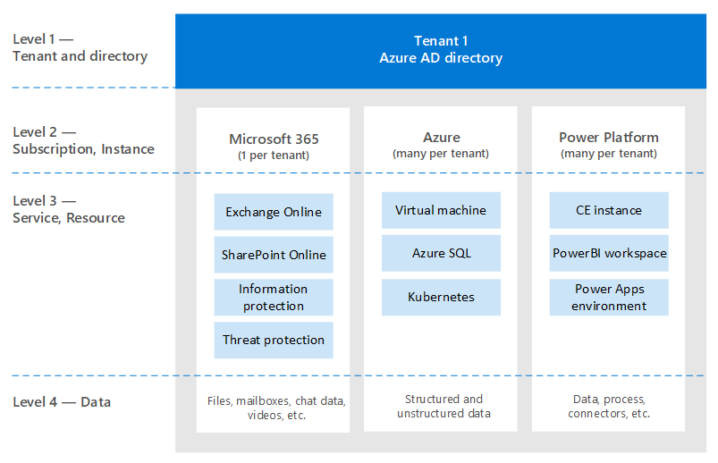

# Zur Identität und darüber hinaus – Die Identität eines ArchitektenTo identity and beyond—One architect's viewpoint

In diesem Artikel erläutert [Alex Shteynberg](https://www.linkedin.com/in/alex-shteynberg/), Principal Technical Architect bei Microsoft, die wichtigsten Entwurfsstrategien für Unternehmen, die Microsoft 365 und andere Microsoft-Clouddienste einführen.In this article, [Alex Shteynberg](https://www.linkedin.com/in/alex-shteynberg/), Principal Technical Architect at Microsoft, discusses top design strategies for enterprise organizations adopting Microsoft 365 and other Microsoft cloud services.

## Über den AutorAbout the author

Ich bin technischer Hauptarchitekt im New York [Microsoft Technology Center.](https://www.microsoft.com/mtc?rtc=1)I'm a Principal Technical Architect at the New York [Microsoft Technology Center](https://www.microsoft.com/mtc?rtc=1). Ich arbeite hauptsächlich mit großen Kunden und komplexen Anforderungen.I mostly work with large customers and complex requirements. Meine Einschätzungen und Ansichten basieren auf diesen Interaktionen und gelten möglicherweise nicht für jede Situation.My viewpoint and opinions are based on these interactions and may not apply to every situation. Wenn wir kunden mit den komplexesten Herausforderungen jedoch helfen können, können wir meiner Erfahrung nach allen Kunden helfen.However, in my experience, if we can help customers with the most complex challenges, we can help all customers.

In der Regel arbeite ich jedes Jahr mit mehr als 100 Kunden.I typically work with 100+ customers each year. Während jede Organisation einzigartige Merkmale aufweist, ist es interessant, Trends und Gemeinsamkeiten zu sehen.While every organization has unique characteristics, it's interesting to see trends and commonalities. Ein Trend ist z. B. das branchenübergreifende Interesse vieler Kunden.For example, one trend is cross-industry interest for many customers. Schließlich kann eine Bank branch auch ein Coffee shop und ein Community Center sein.After all, a bank branch can also be a coffee shop and a community center.

In meiner Rolle möchte ich mich darauf konzentrieren, Kunden dabei zu helfen, die beste technische Lösung zu finden, um ihre einzigartigen Geschäftsziele zu erreichen.In my role, I focus on helping customers arrive at the best technical solution to address their unique set of business goals. Offiziell fokussiere ich mich auf Identität, Sicherheit, Datenschutz und Compliance.Officially, I focus on Identity, Security, Privacy, and Compliance. Ich finde es sehr, dass diese Alles, was wir tun, berühren.I love the fact that these touch everything we do. Dadurch habe ich die Möglichkeit, an den meisten Projekten beteiligt zu sein.It gives me an opportunity to be involved with most projects. Dadurch bin ich ziemlich beschäftigt und möchte diese Rolle übernehmen.This keeps me quite busy and enjoying this role.

Ich leben in New York City (am besten!) und genoss die Vielfalt seiner Kultur, ihres Essens und seiner Menschen (nicht des Datenverkehrs).I live in New York City (the best!) and really enjoy the diversity of its culture, food, and people (not traffic). Ich bin gerne unterwegs, wenn ich die meisten Der welt in meinem Leben sehen kann und möchte.I love to travel when I can and hope to see most of the world in my lifetime. Ich recherchiere derzeit eine Reise nach Afrika, um mehr über dieses Thema zu erfahren.I'm currently researching a trip to Africa to learn about wildlife.

## LeitprinzipienGuiding principles

- **Einfach ist oft besser:** Sie können (fast) alles mit Technologie tun, aber das bedeutet nicht, dass Sie dies tun sollten.**Simple is often better**: You can do (almost) anything with technology, but it doesn't mean you should. Insbesondere im Sicherheitsbereich überernieren viele Kunden Lösungen.Especially in the security space, many customers overengineer solutions. Ich mag [dieses Video](https://www.youtube.com/watch?v=SOQgABDSYZE) aus der Stripe-Konferenz von Google, um diesen Punkt zu unterstreichen.I like [this video](https://www.youtube.com/watch?v=SOQgABDSYZE) from Google’s Stripe conference to underscore this point.
- **Personen, Prozesse, Technologien:** [Entwerfen Sie für Personen,](https://en.wikipedia.org/wiki/Human-centered_design) um den Prozess zu verbessern, und nicht zuerst techn.**People, process, technology**: [Design for people](https://en.wikipedia.org/wiki/Human-centered_design) to enhance process, not tech first. Es gibt keine "perfekten" Lösungen.There are no "perfect" solutions. Wir müssen verschiedene Risikofaktoren abwägen, und die Entscheidungen sind für jedes Unternehmen unterschiedlich.We need to balance various risk factors and decisions will be different for each business. Zu viele Kunden entwerfen einen Ansatz, den ihre Benutzer später vermeiden.Too many customers design an approach that their users later avoid.
- **Konzentrieren Sie sich auf "Warum" zuerst und "wie" später:** Seien Sie das lästig alte Kind mit einer Million Fragen.**Focus on 'why' first and 'how' later**: Be the annoying 7-yr old kid with a million questions. Wir können nicht zur richtigen Antwort kommen, wenn wir die richtigen Fragen nicht kennen.We can't arrive at the right answer if we don't know the right questions to ask. Viele Kunden gehen davon aus, wie die Dinge funktionieren müssen, anstatt das Geschäftsproblem zu definieren.Lots of customers make assumptions on how things need to work instead of defining the business problem. Es gibt immer mehrere Pfade, die verwendet werden können.There are always multiple paths that can be taken.
- **Lange Zeit vor bewährten Methoden:** Erkennen Sie, dass sich bewährte Methoden mit Lichtgeschwindigkeit ändern.**Long tail of past best practices**: Recognize that best practices are changing at light speed. Wenn Sie Sich Azure AD vor mehr als drei Monaten angesehen haben, sind Sie wahrscheinlich veraltet.If you've looked at Azure AD more than three month ago, you are likely out of date. Alles hier kann nach der Veröffentlichung geändert werden.Everything here is subject to change after publication. Die Option "Beste" ist heute möglicherweise nicht die gleiche wie in sechs Monaten.“Best” option today may not be the same six months from now.

## Grundlegende KonzepteBaseline concepts

Überspringen Sie diesen Abschnitt nicht.Don't skip this section. Ich finde oft, dass ich zu diesen Themen zurückkehren muss, auch für Kunden, die Clouddienste seit Jahren verwenden.I often find that I must step-back to these topics, even for customers who have been using cloud services for years.
Leider ist Sprache kein genaues Tool.Alas, language isn't a precise tool. Wir verwenden häufig dasselbe Wort, um unterschiedliche Konzepte oder unterschiedliche Wörter zu verstehen, um dasselbe Konzept zu verstehen.We quite often use the same word to mean different concepts or different words to mean the same concept. Dieses nachstehende Diagramm verwende ich häufig, um grundlegende Terminologie und ein "Hierarchiemodell" zu erstellen.I often use this diagram below to establish some baseline terminology and "hierarchy model."
  

 

Wenn Sie lernen, zu sich zu gehen, ist es besser, im Pool zu beginnen und nicht in der Mitte des Pazifiks.When you learn to swim it's better to start in the pool and not in the middle of the ocean. Ich versuche nicht, mit diesem Diagramm technisch genau zu sein.I'm not trying to be technically accurate with this diagram. Es ist ein Modell, um einige grundlegende Konzepte zu besprechen.It's a model to discuss some basic concepts.

Aus dem Diagramm geht Folgendes hervor:In the diagram:

- Mandant = eine Instanz von Azure AD.Tenant = an instance of Azure AD. Sie befindet sich am "oberen" Rand einer Hierarchie oder ebene 1 im Diagramm.It is at the "top" of a hierarchy, or Level 1 in the diagram. Wir können dies als die "[Grenze](/azure/active-directory/users-groups-roles/licensing-directory-independence)" betrachten, an der alles andere vorkommt ([Azure AD B2B](/azure/active-directory/b2b/what-is-b2b) abgesehen).We can consider this to be the "[boundary](/azure/active-directory/users-groups-roles/licensing-directory-independence)" where everything else occurs ([Azure AD B2B](/azure/active-directory/b2b/what-is-b2b) aside). Alle Microsoft Enterprise Cloud Services sind Teil eines dieser Mandanten.All Microsoft enterprise cloud services are part of one of these tenants. Verbraucherdienste sind getrennt.Consumer services are separate. "Mandant" wird in der Dokumentation als Office 365 Mandant, Azure-Mandant, WVD-Mandant usw. angezeigt."Tenant" appears in documentation as Office 365 tenant, Azure tenant, WVD tenant, and so on. Ich finde, dass diese Abweichungen für Kunden verwirrungen.I often find these variations cause confusion for customers.
- Dienste/Abonnements, Ebene 2 im Diagramm, gehören nur einem Mandanten an.Services/subscriptions, Level 2 in the diagram, belong to one and only one tenant. Die meisten SaaS-Dienste sind 1:1 und können nicht ohne Migration verschoben werden.Most SaaS services are 1:1 and can't move without migration. Azure unterscheidet sich, Sie können die Abrechnung und/oder ein [Abonnement](/azure/active-directory/fundamentals/active-directory-how-subscriptions-associated-directory) auf einen anderen Mandanten [verschieben.](/azure/cost-management-billing/manage/billing-subscription-transfer)Azure is different, you can [move billing](/azure/cost-management-billing/manage/billing-subscription-transfer) and/or a [subscription](/azure/active-directory/fundamentals/active-directory-how-subscriptions-associated-directory) to another tenant. Es gibt viele Kunden, die Azure-Abonnements verschieben müssen.There are many customers that need to move Azure subscriptions. Dies hat verschiedene Auswirkungen.This has various implications. Objekte, die außerhalb des Abonnements vorhanden sind, werden nicht verschoben (z. B. rollenbasierte Zugriffssteuerung oder Azure RBAC und Azure AD-Objekte, einschließlich Gruppen, Apps, Richtlinien usw.).Objects that exist outside of the subscription do not move (for example, role-based access control, or Azure RBAC, and Azure AD objects including groups, apps, policies, and so on). Außerdem einige Dienste (z. B. Azure Key Vault, Data Vaults usw.).Also, some services  (such as Azure Key Vault, Data Bricks, and so on). Migrieren Sie dienste nicht ohne eine gute geschäftliche Notwendigkeit.Don't migrate services without a good business need. Einige Skripts, die für die Migration hilfreich sein können, werden [in GitHub freigegeben.](https://github.com/lwajswaj/azure-tenant-migration)Some scripts that can be helpful for migration are [shared on GitHub](https://github.com/lwajswaj/azure-tenant-migration).
- Ein bestimmter Dienst hat in der Regel eine Art "Unterebene"-Grenze oder Ebene 3 (L3).A given service usually has some sort of "sublevel" boundary, or Level 3 (L3). Dies ist hilfreich, um die Trennung von Sicherheit, Richtlinien, Governance usw. zu verstehen.This is useful to understand for segregation of security, policies, governance, and so on. Leider gibt es keinen einheitlichen Namen, von dem ich weiß.Unfortunately, there is no uniform name that I know of. Einige Beispielnamen für L3 sind: Azure-Abonnement = [Ressource](/azure/azure-resource-manager/management/manage-resources-portal); Dynamics 365 CE = [Instanz](/dynamics365/admin/new-instance-management); Power BI = [Arbeitsbereich](/power-bi/service-create-the-new-workspaces); Power Apps = [Umgebung](/power-platform/admin/environments-overview); Und so weiter.Some examples names for L3 are: Azure Subscription = [resource](/azure/azure-resource-manager/management/manage-resources-portal); Dynamics 365 CE = [instance](/dynamics365/admin/new-instance-management); Power BI = [workspace](/power-bi/service-create-the-new-workspaces); Power Apps = [environment](/power-platform/admin/environments-overview); and so on.
- Auf Ebene 4 befinden sich die tatsächlichen Daten.Level 4 is where the actual data lives. Diese "Datenebene" ist ein komplexes Thema.This 'data plane' is a complex topic. Einige Dienste verwenden Azure AD für RBAC, andere nicht.Some services are using Azure AD for RBAC, others are not. Ich werde etwas darüber sprechen, wenn wir zu Delegierungsthemen kommen.I'll discuss it a bit when we get to delegation topics.

Einige zusätzliche Konzepte, zu denen ich viele Kunden (und Microsoft-Mitarbeiter) finde, sind verwirrend oder haben Fragen dazu:Some additional concepts that I find many customers (and Microsoft employees) are confused about or have questions about include the following:

- Jeder kann kostenlos viele Mandanten [erstellen.](/azure/active-directory/fundamentals/active-directory-access-create-new-tenant)Anyone can [create](/azure/active-directory/fundamentals/active-directory-access-create-new-tenant) many tenants at [no cost](https://azure.microsoft.com/pricing/details/active-directory/). Sie benötigen keinen darin bereitgestellten Dienst.You do not need a service provisioned within it. Ich habe Dutzende.I have dozens. Jeder Mandantenname ist im weltweiten Clouddienst von Microsoft eindeutig (d. h., es können keine zwei Mandanten denselben Namen haben).Each Tenant name is unique in Microsoft's worldwide cloud service (in other words, no two tenants can have the same name). Sie alle haben das Format TenantName.onmicrosoft.com.They all are in the format of TenantName.onmicrosoft.com. Es gibt auch Prozesse, die Mandanten automatisch erstellen ([nicht verwaltete Mandanten).](/azure/active-directory/users-groups-roles/directory-self-service-signup)There are also processes that create Tenants automatically ([unmanaged tenants](/azure/active-directory/users-groups-roles/directory-self-service-signup)). Dies kann beispielsweise der Fall sein, wenn sich ein Benutzer für einen Unternehmensdienst mit einer E-Mail-Domäne anmeldet, die in keinem anderen Mandanten vorhanden ist.For example, this can occur when a user signs up for an enterprise service with an email domain that does not exist in any other tenant.
- In einem verwalteten Mandanten können viele [DNS-Domänen](/azure/active-directory/fundamentals/add-custom-domain) darin registriert werden.In a managed tenant, many [DNS domains](/azure/active-directory/fundamentals/add-custom-domain) can be registered in it. Dadurch wird der ursprüngliche Mandantenname nicht geändert.This doesn't change the original tenant name. Es gibt derzeit keine einfache Möglichkeit, einen Mandanten umzubenennen (außer der Migration).There is currently no easy way to rename a tenant (other than migration). Obwohl der Mandantname heutzutage technisch nicht kritisch ist, ist dies für einige möglicherweise einschränkend.Although the tenant name is technically not critical these days, some may find this to be limiting.
- Sie sollten einen Mandantennamen für Ihre Organisation reservieren, auch wenn Sie noch keine Bereitstellung von Diensten planen.You should reserve a tenant name for your organization even if you are not yet planning to deploy any services. Andernfalls kann jemand es von Ihnen nehmen, und es gibt keinen einfachen Vorgang, um es zurückzunehmen (dasselbe Problem wie DNS-Namen).Otherwise somebody can take it from you and there is no simple process to take it back (same problem as DNS names). Ich höre dies zu oft von Kunden.I hear this way too often from customers. Was Ihr Mandantname sein sollte, ist auch ein themenspezifisches Thema.What your tenant name should be is a debate topic as well.
- Wenn Sie DNS-Namespaces besitzen, sollten Sie alle diese zu Ihren Mandanten hinzufügen.If you own DNS namespace(s), you should add all of these to your tenant(s). Andernfalls könnte ein [nicht verwalteter Mandant](/azure/active-directory/users-groups-roles/directory-self-service-signup) mit diesem Namen erstellt werden, der dann zu einer Unterbrechung führt, damit [er verwaltet wird.](/azure/active-directory/users-groups-roles/domains-admin-takeover)Otherwise one could create an [unmanaged tenant](/azure/active-directory/users-groups-roles/directory-self-service-signup) with this name, which then causes disruption to [make it managed](/azure/active-directory/users-groups-roles/domains-admin-takeover).
- DNS-Namespace (z. B. contoso.com) kann nur zu einem Mandanten gehören.DNS namespace (such as contoso.com) can belong to one and only one Tenant. Dies hat Auswirkungen auf verschiedene Szenarien (z. B. die Freigabe einer E-Mail-Domäne während einer Fusion oder übernahme usw.).This has implications for various scenarios (for example, sharing an email domain during a merger or acquisition, and so on). Es gibt eine Möglichkeit, ein DNS-Sub (z. B. div.contoso.com) in einem anderen Mandanten zu registrieren, dies sollte jedoch vermieden werden.There is a way to register a DNS sub (such as div.contoso.com) in a different tenant, but that should be avoided. Durch die Registrierung eines Domänennamens auf oberster Ebene wird davon ausgegangen, dass alle Unterdomänen zum gleichen Mandanten gehören.By registering a top-level domain name, all subdomains are assumed to belong to the same tenant. In Szenarien mit mehreren Mandanten (siehe unten) würde ich normalerweise empfehlen, einen anderen Domänennamen auf oberster Ebene (z. B. contoso.ch oder ch-contoso.com) zu verwenden.In multi-tenant scenarios (see below) I would normally recommend using another top-level domain name (such as contoso.ch or ch-contoso.com).
- Wer sollten einen Mandanten "besitzen"?Who should "own" a tenant? Ich sehe häufig Kunden, die nicht wissen, wer derzeit ihren Mandanten besitzt.I often see customers that do not know who currently owns their tenant. Dies ist eine große rote Kennzeichnung.This is a big red flag. Rufen Sie den Microsoft-Support ASAP an.Call Microsoft support ASAP. Ebenso problematisch ist es, wenn ein Dienstbesitzer (häufig ein Exchange Administrator) zum Verwalten eines Mandanten bestimmt ist.Just as problematic is when a service owner (often an Exchange administrator) is designated to manage a tenant. Der Mandant enthält alle Dienste, die Sie in Zukunft möglicherweise wünschen.The tenant will contain all services that you may want in the future. Der Mandantenbesitzer sollte eine Gruppe sein, die entscheidungsfähig für die Aktivierung aller Clouddienste in einer Organisation sein kann.The tenant owner should be a group that can make decision for enablement of all cloud services in an organization. Ein weiteres Problem besteht darin, dass eine Mandantenbesitzergruppe aufgefordert wird, alle Dienste zu verwalten.Another problem is when a tenant owner group is asked to manage all services. Dies ist für große Organisationen nicht skaliert.This doesn't scale for large organizations.
- Es gibt kein Konzept eines Unter-/Supermandanten.There is no concept of a sub/super tenant. Aus irgendeinem Grund wiederholt sich dieser Vorgang immer wieder.For some reason, this myth keeps repeating itself. Dies gilt auch für [Azure AD B2C-Mandanten.](/azure/active-directory-b2c/)This applies to [Azure AD B2C](/azure/active-directory-b2c/) tenants as well. Ich höre zu oft: "Meine B2C-Umgebung befindet sich in meinem XYZ-Mandanten" oder "Wie verschiebe ich meinen Azure-Mandanten in meinen Office 365 Mandanten?"I hear too many times, "My B2C environment is in my XYZ Tenant," or "How do I move my Azure tenant into my Office 365 tenant?"
- Dieses Dokument konzentriert sich hauptsächlich auf die kommerzielle weltweite Cloud, da die meisten Kunden dies verwenden.This document mostly focuses on the commercial worldwide cloud as this is what most customers are using. Manchmal ist es hilfreich, sich über [unabhängige Clouds](/azure/active-directory/develop/authentication-national-cloud)zu informieren.It sometimes useful to know about [sovereign clouds](/azure/active-directory/develop/authentication-national-cloud). Unabhängige Clouds haben zusätzliche Auswirkungen zu besprechen, die für diese Diskussion nicht in Frage kommen.Sovereign clouds have additional implications to discuss which are out of scope for this discussion.

## Grundlegende IdentitätsthemenBaseline identity topics

Es gibt viele Dokumentationen zur Identitätsplattform von Microsoft – Azure Active Directory (Azure AD).There is much documentation about Microsoft's identity platform – Azure Active Directory (Azure AD). Für diejenigen, die gerade erst beginnen, ist es oft überwältigend.For those who are just starting, it often feels overwhelming. Auch wenn Sie mehr darüber erfahren haben, kann es schwierig sein, mit konstanten Innovationen und Veränderungen Schritt zu halten.Even after you learn about it, keeping up with constant innovation and change can be challenging. In meinen Kundeninteraktionen bin ich oft als "Übersetzer" zwischen Geschäftszielen und "Guten, besseren, besten" Ansätzen für diese (und menschliche "Notizen" für diese Themen) tätig.In my customer interactions I often find myself serving as "translator" between business goals and "Good, Better, Best" approaches to address these (and human "cliff notes" for these topics). Es gibt nur selten eine perfekte Antwort, und die "richtige" Entscheidung ist ein Gleichgewicht aus verschiedenen Risikofaktoren.There's rarely a perfect answer and the "right" decision is a balance of various risk factors. Nachfolgend finden Sie einige der allgemeinen Fragen und Verwirrungsbereiche, die ich mit Kunden besprechen möchte.Below are some of the common questions and confusion areas I tend to discuss with customers.

### BereitstellungProvisioning

Azure AD kann nicht aufgrund fehlender Governance in Ihrer Identitätswelt gelöst werden!Azure AD does not solve for lack of governance in your identity world! [Identitätsgovernance](/azure/active-directory/governance/identity-governance-overview) sollte unabhängig von Cloudentscheidungen ein wichtiges Element sein.[Identity governance](/azure/active-directory/governance/identity-governance-overview) should be a critical element independent of any cloud decisions. Die Governanceanforderungen ändern sich im Laufe der Zeit, weshalb es sich um ein Programm und kein Tool handelt.Governance requirements change over time, which is why it is a program and not a tool.

[Azure AD Verbinden](/azure/active-directory/hybrid/whatis-azure-ad-connect) im Vergleich [zu Microsoft Identity Manager](/microsoft-identity-manager/microsoft-identity-manager-2016) (MIM) im Vergleich zu etwas anderem (Drittanbieter oder benutzerdefiniert)?[Azure AD Connect](/azure/active-directory/hybrid/whatis-azure-ad-connect) vs. [Microsoft Identity Manager](/microsoft-identity-manager/microsoft-identity-manager-2016) (MIM) vs. something else (third party or custom)? Sparen Sie sich jetzt und in Zukunft viel Mühe, und gehen Sie mit Azure AD Verbinden.Save yourself a lot of headache now and in the future and go with Azure AD Connect. Es gibt alle Arten von Smarts in diesem Tool, um auf unterschiedliche Kundenkonfigurationen und fortlaufende Innovationen zu setzen.There are all kinds of smarts in this tool to address peculiar customer configurations and ongoing innovations.

Einige Edgefälle, die zu einer komplexeren Architektur führen können:Some edge cases that may drive towards a more complex architecture:

- Ich habe mehrere AD-Gesamtstrukturen ohne Netzwerkkonnektivität zwischen diesen.I have multiple AD forests without network connectivity between these. Es gibt eine neue Option namens [Cloudbereitstellung.](/azure/active-directory/cloud-provisioning/what-is-cloud-provisioning)There is a new option called [Cloud Provisioning](/azure/active-directory/cloud-provisioning/what-is-cloud-provisioning).
- Ich habe weder Active Directory noch möchte ich es installieren.I don't have Active Directory, nor do I want to install it. Azure AD-Verbinden können für die [Synchronisierung von LDAP](/azure/active-directory/hybrid/plan-hybrid-identity-design-considerations-tools-comparison) konfiguriert werden (Möglicherweise ist ein Partner erforderlich).Azure AD Connect can be configures to [sync from LDAP](/azure/active-directory/hybrid/plan-hybrid-identity-design-considerations-tools-comparison) (partner may be required).
- Ich muss dieselben Objekte für mehrere Mandanten bereitstellen.I need to provision the same objects to multiple tenants. Dies wird technisch nicht unterstützt, hängt jedoch von der Definition von "identisch" ab.This isn't technically supported but depends on definition of "same."

Soll ich standardsynchronisierungsregeln anpassen ([Filterobjekte,](/azure/active-directory/hybrid/how-to-connect-sync-configure-filtering) [Attribute ändern,](/azure/active-directory/hybrid/reference-connect-sync-attributes-synchronized) [alternative Anmelde-ID](/azure/active-directory/hybrid/plan-connect-userprincipalname)usw.)?Should I customize default synchronization rules ([filter objects](/azure/active-directory/hybrid/how-to-connect-sync-configure-filtering), [change attributes](/azure/active-directory/hybrid/reference-connect-sync-attributes-synchronized), [alternate login ID](/azure/active-directory/hybrid/plan-connect-userprincipalname), and so on)? Vermeiden Sie es!Avoid it! Eine Identitätsplattform ist nur so wertvoll wie die Dienste, die sie verwenden.An identity platform is only as valuable as the services that use it. Sie können zwar alle Arten von Kurzkonfigurationen ausführen, aber um diese Frage zu beantworten, müssen Sie sich die Auswirkungen auf Anwendungen ansehen.While you can do all kinds of nutty configurations, to answer this question you need to look at the impact on applications. Wenn Sie E-Mail-aktivierte Objekte filtern, ist die GAL für Onlinedienste unvollständig. Wenn die Anwendung bestimmte Attribute verwendet, hat das Filtern dieser Attribute unvorhersehbare Auswirkungen. Und so weiter.If you filter mail-enabled objects, then the GAL for online services will be incomplete; if the application relies on specific attributes, filtering these will have unpredictable impact; and so on. Es handelt sich nicht um eine Identitätsteam-Entscheidung.It's not an identity team decision.

XYZ SaaS unterstützt Just-in-Time (JIT)-Bereitstellung. Warum muss ich synchronisiert werden?XYZ SaaS supports Just-in-Time (JIT) provisioning, why are you requiring me to synchronize? Siehe weiter oben.See above. Viele Anwendungen benötigen "Profilinformationen" für die Funktionalität.Many applications need "profile" information for functionality. Sie können keine GAL verwenden, wenn nicht alle E-Mail-aktivierten Objekte verfügbar sind.You can't have a GAL if all mail-enabled objects aren't available. Gleiches gilt für die [Benutzerbereitstellung](/azure/active-directory/app-provisioning/user-provisioning) in Anwendungen, die in Azure AD integriert sind.Same applies to [user provisioning](/azure/active-directory/app-provisioning/user-provisioning) in applications integrated with Azure AD.

### AuthentifizierungAuthentication

[Kennworthashsynchronisierung](/azure/active-directory/hybrid/how-to-connect-password-hash-synchronization) (Password Hash Sync, PHS) im Vergleich zur [Pass-Through-Authentifizierung](/azure/active-directory/hybrid/how-to-connect-pta-how-it-works) (PTA) im Vergleich zum [Partnerverbund.](/azure/active-directory/hybrid/how-to-connect-fed-compatibility)[Password hash sync](/azure/active-directory/hybrid/how-to-connect-password-hash-synchronization) (PHS) vs. [pass-through authentication](/azure/active-directory/hybrid/how-to-connect-pta-how-it-works) (PTA) vs. [federation](/azure/active-directory/hybrid/how-to-connect-fed-compatibility).

In der Regel gibt es eine große [Diskussion](/azure/active-directory/hybrid/choose-ad-authn) um den Partnerverbund.Usually there is a passionate [debate](/azure/active-directory/hybrid/choose-ad-authn) around federation. Einfacher ist in der Regel besser und verwendet daher PHS, es sei denn, Sie haben einen guten Grund, dies nicht zu versuchen.Simpler is usually better and therefore use PHS unless you have a good reason not to. Es ist auch möglich, unterschiedliche Authentifizierungsmethoden für unterschiedliche DNS-Domänen im selben Mandanten zu konfigurieren.It is also possible to configure different authentication methods for different DNS domains in the same tenant.

Einige Kunden aktivieren Den Partnerverbund und PHS hauptsächlich für:Some customers enable federation + PHS mainly for:

- Eine Option zum [Zurücksetzen](/azure/active-directory/hybrid/plan-migrate-adfs-password-hash-sync) auf (für die Notfallwiederherstellung), wenn der Verbunddienst nicht verfügbar ist.An option to [fall back](/azure/active-directory/hybrid/plan-migrate-adfs-password-hash-sync) to (for disaster recovery) if the federation service isn't available.
- Zusätzliche Funktionen (z. B. [Azure AD DS)](/azure/active-directory-domain-services/tutorial-configure-password-hash-sync)und Sicherheitsdienste (z. B.: [offengelegte Anmeldeinformationen)](/azure/active-directory/reports-monitoring/concept-risk-events#leaked-credentials)Additional capabilities (ex.: [Azure AD DS](/azure/active-directory-domain-services/tutorial-configure-password-hash-sync)) and security services (ex.: [leaked credentials](/azure/active-directory/reports-monitoring/concept-risk-events#leaked-credentials))
- Unterstützung für Dienste in Azure, die die Verbundauthentifizierung nicht verstehen (z. B. [Azure-Dateien).](/azure/storage/files/storage-files-active-directory-overview)Support for services in Azure that do not understand federated authentication (for example, [Azure Files](/azure/storage/files/storage-files-active-directory-overview)).

Ich gehe Kunden häufig durch den Clientauthentifizierungsfluss, um einige Missverständnisse zu verdeutlichen.I often walk customers through client authentication flow to clarify some misconceptions. Das Ergebnis sieht wie das bild unten aus, das nicht so gut ist wie der interaktive Prozess des Anstiegs.The result looks like the picture below, which isn't as good as the interactive process of getting there.

Diese Art von Whiteboardzeichnung veranschaulicht, wo Sicherheitsrichtlinien innerhalb des Flusses einer Authentifizierungsanforderung angewendet werden.This type of whiteboard drawing illustrates where security policies are applied within the flow of an authentication request. In diesem Beispiel werden Richtlinien, die über den Active Directory-Verbunddienst (AD FS) erzwungen werden, auf die erste Dienstanforderung, aber nicht auf nachfolgende Dienstanforderungen angewendet.In this example, policies enforced through Active Directory Federation Service (AD FS) are applied to the first service request, but not subsequent service requests. Dies ist mindestens ein Grund, Sicherheitskontrollen so weit wie möglich in die Cloud zu verschieben.This is at least one reason to move security controls to the cloud as much as possible.

Wir verfolgen den Wunsch nach [einmaligem Anmelden (Single Sign-On,](/azure/active-directory/manage-apps/what-is-single-sign-on) SSO), solange ich mich erinnern kann.We've been chasing the dream of [single sign-on](/azure/active-directory/manage-apps/what-is-single-sign-on) (SSO) for as long as I can remember. Einige Kunden glauben, dass sie dies erreichen können, indem sie den Anbieter für den "richtigen" Partnerverbund (STS) auswählen.Some customers believe they can achieve this by choosing the "right" federation (STS) provider. Azure AD kann erheblich dazu beitragen, [SSO-Funktionen](/azure/active-directory/manage-apps/plan-sso-deployment) zu aktivieren, aber kein STS ist einfach.Azure AD can help significantly to [enable SSO](/azure/active-directory/manage-apps/plan-sso-deployment) capabilities, but no STS is magical. Es gibt zu viele "Legacy"-Authentifizierungsmethoden, die weiterhin für kritische Anwendungen verwendet werden.There are too many "legacy" authentication methods that are still used for critical applications. Die Erweiterung von Azure AD mit [Partnerlösungen](/azure/active-directory/saas-apps/tutorial-list) kann viele dieser Szenarien abdecken.Extending Azure AD with [partner solutions](/azure/active-directory/saas-apps/tutorial-list) can address many of these scenarios. SSO ist eine Strategie und eine Reise.SSO is a strategy and a journey. Sie können nicht dorthin gelangen, ohne auf [Standards für Anwendungen](/azure/active-directory/develop/v2-app-types)umzugehen.You can't get there without moving towards [standards for applications](/azure/active-directory/develop/v2-app-types). Im Zusammenhang mit diesem Thema geht es um eine Reise zur [kennwortlosen](/azure/active-directory/authentication/concept-authentication-passwordless) Authentifizierung, die auch keine eindeutige Antwort hat.Related to this topic is a journey to [passwordless](/azure/active-directory/authentication/concept-authentication-passwordless) authentication, which also doesn't have a magical answer.

[Die mehrstufige Authentifizierung (Multi-Factor Authentication,](/azure/active-directory/authentication/concept-mfa-howitworks) MFA) ist heute unerlässlich[(hier](https://techcommunity.microsoft.com/t5/azure-active-directory-identity/your-pa-word-doesn-t-matter/ba-p/731984) für mehr).[Multi-factor authentication](/azure/active-directory/authentication/concept-mfa-howitworks) (MFA) is essential today ([here](https://techcommunity.microsoft.com/t5/azure-active-directory-identity/your-pa-word-doesn-t-matter/ba-p/731984) for more). Fügen Sie die Analyse des [Benutzerverhaltens](/azure/active-directory/authentication/tutorial-risk-based-sspr-mfa) hinzu, und Sie haben eine Lösung, die die häufigsten Cyberangriffe verhindert.Add to it [user behavior analytics](/azure/active-directory/authentication/tutorial-risk-based-sspr-mfa) and you have a solution that prevents most common cyber-attacks. Sogar Verbraucherdienste werden so umgezogen, dass MFA erforderlich ist.Even consumer services are moving to require MFA. Dennoch treffe ich mich mit vielen Kunden, die nicht auf [moderne Authentifizierungsansätze umsteigen](../enterprise/hybrid-modern-auth-overview.md) möchten.Yet, I still meet with many customers who don't want to move to [modern authentication](../enterprise/hybrid-modern-auth-overview.md) approaches. Das größte Argument, das ich höre, ist, dass es Sich auf Benutzer und ältere Anwendungen auswirkt.The biggest argument I hear is that it will impact users and legacy applications. Manchmal kann ein guter Kick den Kunden helfen, mitzugehen – Exchange Online [angekündigte Änderungen.](https://techcommunity.microsoft.com/t5/exchange-team-blog/basic-auth-and-exchange-online-february-2020-update/ba-p/1191282)Sometimes a good kick might help customers move along - Exchange Online [announced changes](https://techcommunity.microsoft.com/t5/exchange-team-blog/basic-auth-and-exchange-online-february-2020-update/ba-p/1191282). Viele Azure [AD-Berichte](/azure/active-directory/fundamentals/concept-fundamentals-block-legacy-authentication) stehen jetzt zur Verfügung, um Kunden bei diesem Übergang zu unterstützen.Lots of Azure AD [reports](/azure/active-directory/fundamentals/concept-fundamentals-block-legacy-authentication) are now available to help customers with this transition.

### AuthorizationAuthorization

Laut [Wikipedia](https://en.wikipedia.org/wiki/Authorization)dient "zur Autorisierung" zum Definieren einer Zugriffsrichtlinie.Per [Wikipedia](https://en.wikipedia.org/wiki/Authorization), "to authorize" is to define an access policy. Viele Personen betrachten es als die Möglichkeit, Zugriffssteuerungen für ein Objekt (Datei, Dienst usw.) zu definieren.Many people look at it as the ability to define access controls to an object (file, service, and so on). In der aktuellen Welt der Cyberbedrohungen entwickelt sich dieses Konzept schnell zu einer dynamischen Richtlinie, die auf verschiedene Bedrohungsvektoren reagieren und zugriffssteuerungen schnell darauf anpassen kann.In the current world of cyber threats, this concept is rapidly evolving to a dynamic policy that can react to various threat vectors and quickly adjust access controls in response to these. Wenn ich beispielsweise von einem ungewöhnlichen Ort aus auf mein Bankkonto zugreift, erhalte ich zusätzliche Bestätigungsschritte.For example, if I access my bank account from an unusual location, I get additional confirmation steps. Um dies zu nähern, müssen wir nicht nur die Richtlinie selbst, sondern auch das Ökosystem der Methoden zur Bedrohungserkennung und Signalkorrelation berücksichtigen.To approach this, we need to consider not just the policy itself but the ecosystem of threat detection and signal correlation methodologies.

Das Richtlinienmodul von Azure AD wird mithilfe von [Richtlinien für bedingten Zugriff](/azure/active-directory/conditional-access/overview)implementiert.The policy engine of Azure AD is implemented using [Conditional Access policies](/azure/active-directory/conditional-access/overview). Dieses System hängt von Informationen aus einer Vielzahl anderer Systeme zur Bedrohungserkennung ab, um dynamische Entscheidungen zu treffen.This system depends on information from a variety of other threat detection systems to make dynamic decisions. Eine einfache Ansicht würde etwa wie die folgende Abbildung aussehen:A simple view would be something like the following illustration:

Die Kombination all dieser Signale ermöglicht dynamische Richtlinien wie diese:Combining all these signals together allows for dynamic policies like these:

- Wenn eine Bedrohung auf Ihrem Gerät erkannt wird, wird Ihr Zugriff auf Daten nur auf das Web reduziert, ohne dass sie heruntergeladen werden können.If a threat is detected on your device, your access to data will be reduced to web only without the ability to download.
- Wenn Sie eine ungewöhnlich große Datenmenge herunterladen, wird alles, was Sie herunterladen, verschlüsselt und eingeschränkt.If you are downloading an unusually high volume of data, anything you download will be encrypted and restricted.
- Wenn Sie von einem nicht verwalteten Gerät aus auf einen Dienst zugreifen, werden Sie für streng vertrauliche Daten gesperrt, können aber auf nicht eingeschränkte Daten zugreifen, ohne dass Sie sie an einen anderen Speicherort kopieren können.If you access a service from an unmanaged device, you'll be blocked from highly sensitive data but allowed to access non-restricted data without the ability to copy it to another location.

Wenn Sie dieser erweiterten Autorisierungsdefinition zustimmen, müssen Sie zusätzliche Lösungen implementieren.If you agree with this expanded definition of authorization, then you need to implement additional solutions. Welche Lösungen Sie implementieren, hängt davon ab, wie dynamisch die Richtlinie sein soll und welche Bedrohungen Sie priorisieren möchten.Which solutions you implement will depend on how dynamic you want the policy to be and which threats you want to prioritize. Beispiele für solche Systeme sind:Some examples of such systems are:

- [Azure AD Identity ProtectionAzure AD Identity Protection](/azure/active-directory/identity-protection/)
- [Microsoft Defender for IdentityMicrosoft Defender for Identity](/azure-advanced-threat-protection/)
- [Microsoft Defender für EndpunktMicrosoft Defender for Endpoint](/windows/security/threat-protection/microsoft-defender-atp/microsoft-defender-advanced-threat-protection)
- [Microsoft Defender für Office 365Microsoft Defender for Office 365](../security/office-365-security/defender-for-office-365.md)
- [Microsoft Cloud App Security](/cloud-app-security/) (MCAS)[Microsoft Cloud App Security](/cloud-app-security/) (MCAS)
- [Microsoft 365 DefenderMicrosoft 365 Defender](../security/defender/microsoft-365-defender.md)
- [Microsoft IntuneMicrosoft Intune](/mem/intune/)
- [Microsoft Information Protection](../compliance/information-protection.md) (MIP)[Microsoft Information Protection](../compliance/information-protection.md) (MIP)
- [Azure SentinelAzure Sentinel](/azure/sentinel/)

Neben Azure AD verfügen natürlich auch verschiedene Dienste und Anwendungen über eigene spezifische Autorisierungsmodelle.Of course, in addition to Azure AD, various services and applications have their own specific authorization models. Einige davon werden später im Abschnitt "Delegierung" erläutert.Some of these are discussed later in the delegation section.

### ÜberwachungAudit

Azure AD verfügt über detaillierte [Überwachungs- und Berichtsfunktionen.](/azure/active-directory/reports-monitoring/)Azure AD has detailed [audit and reporting](/azure/active-directory/reports-monitoring/) capabilities. Dies ist jedoch in der Regel nicht die einzige Informationsquelle, die erforderlich ist, um Sicherheitsentscheidungen zu treffen.However, this is usually not the only source of information needed to make security decisions. Weitere Informationen hierzu finden Sie im Abschnitt "Delegierung".See more discussion on this in the delegation section.

## Es gibt keine ExchangeThere's no Exchange

Keine Panik!Don't Panic! Dies bedeutet nicht Exchange veraltet ist (oder SharePoint usw.).This does not mean Exchange is being deprecated (or SharePoint, and so on). Es ist immer noch ein Kerndienst.It is still a core service. Was ich meine, ist, dass Technologieanbieter seit geraumer Zeit die Benutzererfahrung (User Experiences, UX) so umgestellt haben, dass sie Komponenten mehrerer Dienste umfassen.What I mean is, for quite some time now, technology providers have been transitioning user experiences (UX) to encompass components of multiple services. In Microsoft 365 ist ein einfaches Beispiel["moderne Anlagen",](https://support.office.com/article/Attach-files-or-insert-pictures-in-Outlook-email-messages-BDFAFEF5-792A-42B1-9A7B-84512D7DE7FC)bei denen Anlagen an E-Mails in SharePoint Online oder OneDrive for Business gespeichert werden.In Microsoft 365, a simple example is "[modern attachments](https://support.office.com/article/Attach-files-or-insert-pictures-in-Outlook-email-messages-BDFAFEF5-792A-42B1-9A7B-84512D7DE7FC)" where attachments to email are stored in SharePoint Online or OneDrive for Business.

Wenn Sie sich den Outlook-Client ansehen, können Sie viele Dienste sehen, die im Rahmen dieser Erfahrung "verbunden" sind, nicht nur Exchange.Looking at the Outlook client you can see many services that are "connected" as part of this experience, not just Exchange. Dazu gehören Azure AD-, Microsoft Search-, Apps-, Profil-, Compliance- und Office 365-Gruppen.This includes Azure AD, Microsoft Search, Apps, Profile, compliance, and Office 365 groups.

Informieren Sie sich über [Microsoft Fluid Framework](https://techcommunity.microsoft.com/t5/microsoft-365-blog/microsoft-ignite-blog-microsoft-fluid-framework-preview/ba-p/978268) für die Vorschau bevorstehender Funktionen.Read about [Microsoft Fluid Framework](https://techcommunity.microsoft.com/t5/microsoft-365-blog/microsoft-ignite-blog-microsoft-fluid-framework-preview/ba-p/978268) for preview of upcoming capabilities. In der Vorschau kann ich Teams Unterhaltungen direkt in Outlook lesen und beantworten.In preview now, I can read and reply to Teams conversations directly in Outlook. Tatsächlich ist der [Teams-Client](https://products.office.com/microsoft-teams/download-app) eines der wichtigsten Beispiele für diese Strategie.In fact, the [Teams client](https://products.office.com/microsoft-teams/download-app) is one of the more prominent examples of this strategy.

Insgesamt wird es schwieriger, eine klare Linie zwischen Office 365 und anderen Diensten in Microsoft-Clouds zu ziehen.Overall, it's becoming harder to draw a clear line between Office 365 and other services in Microsoft clouds. Ich finde es ein großer Vorteil für Kunden, da sie von gesamter Innovation über alles, was wir tun, profitieren können, auch wenn sie eine Komponente verwenden.I view it as a great benefit to customers since they can benefit from total innovation across everything we do even if they use one component. Ziemlich cool und hat für viele Kunden weit reichende Auswirkungen.Pretty cool and has far reaching implications for many customers.

Heute finde ich, dass viele KUNDEN-IT-Gruppen um "Produkte" strukturiert sind.Today, I find many customer IT groups are structured around "products." Es ist logisch für eine lokale Welt, da Sie einen Experten für jedes bestimmte Produkt benötigen.It's logical for an on-premises world since you need an expert for each specific product. Ich bin jedoch total glücklich, dass ich nie wieder ein Active Directory oder Exchange Datenbank debuggen muss, da diese Dienste in die Cloud verschoben wurden.However, I am totally happy that I don't have to debug an Active Directory or Exchange database ever again as these services have moved to the cloud. Automatisierung (welche Art von Cloud) entfernt bestimmte wiederholte manuelle Aufträge (sehen Sie, was mit Fabriken passiert ist).Automation (which cloud kind of is) removes certain repetitive manual jobs (look what happened to factories). Diese werden jedoch durch komplexere Anforderungen ersetzt, um die diensteübergreifende Interaktion, auswirkungen, geschäftliche Anforderungen usw. zu verstehen.However, these are replaced with more complex requirements to understand cross-services interaction, impact, business needs, and so on. Wenn Sie bereit sind, zu [lernen,](/learn/)gibt es großartige Möglichkeiten, die durch die Cloudtransformation ermöglicht werden.If you are willing to [learn](/learn/), there are great opportunities enabled by cloud transformation. Vor dem Einstieg in die Technologie spreche ich häufig mit Kunden über die Verwaltung von Änderungen an IT-Fähigkeiten und Teamstrukturen.Before jumping into technology, I often talk to customers about managing change in IT skills and team structures.

Für alle SharePoint Fan-Personen und Entwickler fragen Sie nicht mehr: "Wie kann ich XYZ in SharePoint Online tun?"To all SharePoint fan-people and developers, please stop asking "How can I do XYZ in SharePoint online?" Verwenden Sie [Power Automate](/power-automate/) (oder Flow) für Workflows, es ist eine viel leistungsfähigere Plattform.Use [Power Automate](/power-automate/) (or Flow) for workflow, it is a much more powerful platform. Verwenden Sie [Azure Bot Framework,](/azure/bot-service/) um eine bessere UX für Ihre 500-K-Elementliste zu erstellen.Use [Azure Bot Framework](/azure/bot-service/) to create a better UX for your 500-K item list. Beginnen Sie mit der Verwendung von [Microsoft Graph](https://developer.microsoft.com/graph/) anstelle von CSOM.Start using [Microsoft Graph](https://developer.microsoft.com/graph/) instead of CSOM. [Microsoft Teams](/MicrosoftTeams/Teams-overview) umfasst SharePoint, aber auch eine Welt mehr.[Microsoft Teams](/MicrosoftTeams/Teams-overview) includes SharePoint but also a world more. Es gibt viele weitere Beispiele, die ich auflisten kann.There are many other examples I can list. Es gibt ein großes und großartiges Universe.There's a vast and wonderful universe out there. Öffnen Sie die Eingangstür, und [beginnen Sie mit der Erkundung.]()Open the door and [start exploring]().

Die andere häufige Auswirkung liegt im Compliancebereich.The other common impact is in the compliance area. Dieser dienstübergreifende Ansatz scheint viele Compliancerichtlinien völlig zu verwechseln.This cross-services approach seems to completely confuse many compliance policies. Ich sehe immer wieder Organisationen, die sagen: "Ich muss alle E-Mail-Kommunikationen in einem eDiscovery-System journalen."I keep seeing organizations that state, "I need to journal all email communications to an eDiscovery system." Was bedeutet das wirklich, wenn E-Mails nicht mehr nur E-Mails, sondern ein Fenster in andere Dienste sind?What does this really mean when email is no longer just email but a window into other services? Office 365 hat einen umfassenden Ansatz für [Compliance,](../compliance/index.yml)aber das Ändern von Personen und Prozessen ist häufig viel schwieriger als die Technologie.Office 365 has a comprehensive approach for [compliance](../compliance/index.yml), but changing people and processes are often much more difficult than technology.

Es gibt viele andere Auswirkungen auf Personen und Prozesse.There are many other people and process implications. Meiner Meinung nach ist dies ein kritischer und nicht behandelter Bereich.In my opinion, this is a critical and under-discussed area. Vielleicht mehr in einem anderen Artikel.Perhaps more in another article.

## MandantenstrukturoptionenTenant structure options

### Einzelmandant im Vergleich zu mehreren MandantenSingle tenant vs. multi-tenant

Im Allgemeinen sollten die meisten Kunden nur einen Produktionsmandanten haben.In general, most customers should have only one production tenant. Es gibt viele Gründe, warum mehrere Mandanten eine Herausforderung darstellen (geben Sie eine [Bing Suche)](https://www.bing.com/search?q=office%20365%20multiple%20tenants)oder lesen Sie dieses [Whitepaper.](https://aka.ms/multi-tenant-user)There are many reasons why multiple tenants are challenging (give it a [Bing search](https://www.bing.com/search?q=office%20365%20multiple%20tenants)) or read this [whitepaper](https://aka.ms/multi-tenant-user). Gleichzeitig verfügen viele Unternehmenskunden, mit der ich arbeite, über einen anderen (kleinen) Mandanten für IT-Lern-, Test- und Experimentierzwecke.At the same time, many enterprise customers I work with have another (small) tenant for IT learning, testing, and experimentation. Der mandantenübergreifende Azure-Zugriff wird mit [Azure-Azure-Mandanten](https://azure.microsoft.com/services/azure-lighthouse/)vereinfacht.Cross-tenant Azure access is made easier with [Azure Lighthouse](https://azure.microsoft.com/services/azure-lighthouse/). Office 365 und viele andere SaaS-Dienste gelten Grenzwerte für mandantenübergreifende Szenarien.Office 365 and many other SaaS services have limits for cross-tenant scenarios. In [Azure AD B2B-Szenarien](/azure/active-directory/b2b/what-is-b2b) ist viel zu berücksichtigen.There's a lot to consider in [Azure AD B2B](/azure/active-directory/b2b/what-is-b2b) scenarios.

Viele Kunden enden mit mehreren Produktionsmandanten nach einer Fusion und Übernahme (M&A) und möchten konsolidieren.Many customers end-up with multiple production tenants after a merger and acquisition (M&A) and want to consolidate. Dies ist heute nicht einfach und erfordert Microsoft Consulting Services (MCS) oder einen Partner sowie Software von Drittanbietern.Today that's not simple and would require Microsoft Consulting Services (MCS) or a partner plus third-party software. Es gibt fortlaufende Technische Arbeit, um in Zukunft verschiedene Szenarien mit mehrinstanzenfähigen Kunden zu behandeln.There's ongoing engineering work to address various scenarios with multi-tenant customers in the future.

Einige Kunden entscheiden sich für mehr als einen Mandanten.Some customers choose to go with more than one tenant. Dies sollte eine sehr sorgfältige Entscheidung sein und fast immer geschäftsgrundgesteuert sein!This should be a very careful decision and almost always business reason driven! Einige Beispiele sind:Some examples include the following:

- Eine Holding-Typ-Unternehmensstruktur, bei der eine einfache Zusammenarbeit zwischen verschiedenen Entitäten nicht erforderlich ist und starke administrative und andere Isolationsanforderungen bestehen.A holding type company structure where easy collaboration between different entities is not required and there is strong administrative and other isolation needs.
- Nach dem Kauf wird eine Geschäftsentscheidung getroffen, um zwei Entitäten voneinander zu trennen.After an acquisition, a business decision is made to keep two entities separate.
- Simulation der Umgebung eines Kunden, die die Produktionsumgebung des Kunden nicht ändert.Simulation of a customer's environment that does not change the customer's production environment.
- Entwicklung von Software für Kunden.Development of software for customers.

In diesen mehrinstanzenfähigen Szenarien möchten Kunden häufig einige Konfigurationen mandantenübergreifend gleich halten oder Konfigurationsänderungen und Abweichungen melden.In these multi-tenant scenarios, customers often want to keep some configuration the same across tenants, or report on configuration changes and drifts. Dies bedeutet häufig den Wechsel von manuellen Änderungen zur Konfiguration als Code.This often means moving from manual changes to configuration as code. Der Support von Microsoft Doppelklick bietet einen Workshop für diese Arten von Anforderungen basierend auf dieser öffentlichen IP an: <https://Microsoft365dsc.com> .Microsoft Premiere support offers a workshop for these types of requirements based on this public IP: <https://Microsoft365dsc.com>.

### Multi-GeoMulti-Geo

Zu [Multi-Geo](../enterprise/microsoft-365-multi-geo.md) oder nicht zu Multi-Geo, das ist die Frage.To [Multi-Geo](../enterprise/microsoft-365-multi-geo.md) or not to Multi-Geo, that is the question. Mit Office 365 Multi-Geo können Sie ruhenden Daten an den geografischen Standorten bereitstellen und speichern, die Sie ausgewählt haben, um die [Datenaufbewahrungsanforderungen](../enterprise/o365-data-locations.md) zu erfüllen.With Office 365 Multi-Geo, you can provision and store data at rest in the geo locations that you've chosen to meet [data residency](../enterprise/o365-data-locations.md) requirements. Es gibt viele Missverständnisse über diese Funktion.There are many misconceptions about this capability. Denken Sie dabei an Folgendes:Keep the following in mind:

- Es bietet keine Leistungsvorteile.It does not to provide performance benefits. Die Leistung kann schlechter werden, wenn der [Netzwerkentwurf](https://aka.ms/office365networking) nicht korrekt ist.It could make performance worse if the [network design](https://aka.ms/office365networking) is not correct. Rufen Sie Geräte "in der Nähe" des Microsoft-Netzwerks ab, nicht unbedingt an Ihre Daten.Get devices "close" to the Microsoft network, not necessarily to your data.
- Es ist keine Lösung für die [DSGVO-Compliance.](https://www.microsoft.com/trust-center/privacy/gdpr-overview)It is not a solution for [GDPR compliance](https://www.microsoft.com/trust-center/privacy/gdpr-overview). Die DSGVO konzentriert sich nicht auf Datenhoheit oder Speicherorte.GDPR does not focus on data sovereignty or storage locations. Dafür gibt es weitere Compliance-Frameworks.There are other compliance frameworks for that.
- Sie löst nicht die Delegierung der Verwaltung (siehe unten) oder [Informationsbarrieren.](../compliance/information-barriers.md)It does not solve delegation of administration (see below) or [information barriers](../compliance/information-barriers.md).
- Sie ist nicht identisch mit mehreren Mandanten und erfordert zusätzliche [Benutzerbereitstellungsworkflows.](https://github.com/MicrosoftDocs/azure-docs-pr/blob/master/articles/active-directory/hybrid/how-to-connect-sync-feature-preferreddatalocation.md)It is not the same as multi-tenant and requires additional [user provisioning](https://github.com/MicrosoftDocs/azure-docs-pr/blob/master/articles/active-directory/hybrid/how-to-connect-sync-feature-preferreddatalocation.md) workflows.
- [Ihr Mandant](../enterprise/moving-data-to-new-datacenter-geos.md) (Azure AD) wird nicht in eine andere Geografie verschoben.It does not [move your tenant](../enterprise/moving-data-to-new-datacenter-geos.md) (your Azure AD) to another geography.

## Delegierung der VerwaltungDelegation of administration

In den meisten großen Organisationen ist die Trennung von Aufgaben und rollenbasierter Zugriffssteuerung (RBAC) eine notwendige Realität.In most large organizations, separation of duties and role-based access control (RBAC) is a necessary reality. Ich werde mich im Voraus entzei nen.I am going to apologize ahead of time. Dies ist nicht so einfach, wie es von einigen Kunden gewünscht wird.This is not as simple as some customers want it to be. Kunden-, Rechts-, Compliance- und andere Anforderungen sind unterschiedlich und stehen manchmal auf der ganzen Welt in Konflikt.Customer, legal, compliance, and other requirements are different and sometimes conflicting around the world. Einfachheit und Flexibilität stehen häufig gegenüber.Simplicity and flexibility are often on opposite sides of each other. Machen Sie mich nicht falsch, wir können hier einen besseren Job machen.Don't get me wrong, we can do a better job at this. Im Laufe der Zeit wurden (und werden) erhebliche Verbesserungen vorgenommen.There have been (and will be) significant improvements over time. Besuchen Sie Ihr lokales [Microsoft Technology Center,](https://www.microsoft.com/mtc) um das Modell zu entwickeln, das Ihren Geschäftsanforderungen entspricht, ohne 379230-Dokumente zu lesen!Visit your local [Microsoft Technology Center](https://www.microsoft.com/mtc) to work out the model that fits your business requirements without reading 379230 docs! Hier werde ich mich auf das konzentrieren, was Sie denken sollten und nicht, warum dies der Fall ist.Here, I'll focus on what you should think about and not why it is this way. Nachfolgend finden Sie fünf verschiedene Bereiche, die sie planen müssen, sowie einige der allgemeinen Fragen, auf die ich gestoßen bin.Below are five different areas to plan for and some of the common questions I've encountered.

### Azure AD und Microsoft 365 Admin CenterAzure AD and Microsoft 365 admin centers

Es gibt eine lange und wachsende Liste integrierter [Rollen.](/azure/active-directory/users-groups-roles/directory-assign-admin-roles)There's a long and growing list of [built-in roles](/azure/active-directory/users-groups-roles/directory-assign-admin-roles). Jede Rolle besteht aus einer Liste von Rollenberechtigungen, die gruppiert sind, damit bestimmte Aktionen ausgeführt werden können.Each role consists of a list of role permissions grouped together to allow specific actions to be performed. Sie können diese Berechtigungen auf der Registerkarte "Beschreibung" in jeder Rolle sehen.You can see these permissions in the "Description" tab inside each role. Alternativ können Sie eine lesbarere Version dieser Versionen im Microsoft 365 Admin Center sehen.Alternatively you can see a more human readable version of these in the Microsoft 365 Admin Center. Die Definitionen für integrierte Rollen können nicht geändert werden.The definitions for built-in roles cannot be modified. Im Allgemeinen werden diese in drei Kategorien unterteilt:I generally, group these into three categories:

- **Globaler Administrator:** Diese "alles leistungsfähige" Rolle sollte genau wie in anderen Systemen [hochgradig geschützt](../enterprise/protect-your-global-administrator-accounts.md) sein.**Global administrator**: This "all powerful" role should be [highly protected](../enterprise/protect-your-global-administrator-accounts.md) just like you would in other systems. Typische Empfehlungen sind: keine dauerhafte Zuweisung und Verwendung von Azure AD Privileged Identity Management (PIM); starke Authentifizierung; Und so weiter.Typical recommendations include: no permanent assignment and use Azure AD Privileged Identity Management (PIM); strong authentication; and so on. Interessanterweise bietet Ihnen diese Rolle nicht standardmäßig Zugriff auf alles.Interestingly, this role doesn't give you access to everything by default. In der Regel sehe ich Verwirrung hinsichtlich des Compliancezugriffs und des Azure-Zugriffs, der später erläutert wird.Typically, I see confusion about compliance access and Azure access, discussed later. Diese Rolle kann jedoch immer Zugriff auf andere Dienste im Mandanten zuweisen.However, this role can always assign access to other services in the tenant.
- **Bestimmte Dienstadministratoren:** Einige Dienste (Exchange, SharePoint, Power BI usw.) verwenden allgemeine Verwaltungsrollen von Azure AD.**Specific service admins**: Some services (Exchange, SharePoint, Power BI, and so on) consume high-level administration roles from Azure AD. Dies ist nicht in allen Diensten konsistent, und es werden später spezifischere Rollen behandelt.This isn't consistent across all services and there are more service-specific roles discussed later.
- **Funktional:** Es gibt eine lange (und wachsende) Liste von Rollen, die sich auf bestimmte Vorgänge (Gasteinladende usw.) konzentrieren.**Functional**: There is a long (and growing) list of roles focused on specific operations (guest inviter, and so on). In regelmäßigen Abständen werden mehr davon basierend auf den Kundenanforderungen hinzugefügt.Periodically, more of these are added based on customer needs.

Es ist nicht möglich, alles zu delegieren (obwohl die Lücke abnimmt), was bedeutet, dass die Rolle des globalen Administrators manchmal verwendet werden muss.It is not possible to delegate everything (although the gap is decreasing), which means the Global admin role would need to be used sometimes. Konfiguration als Code und Automatisierung sollten anstelle der Mitgliedschaft von Personen in dieser Rolle berücksichtigt werden.Configuration-as-code and automation should be considered instead of people membership of this role.

**Hinweis:** Die Microsoft 365 Admin Center verfügt über eine benutzerfreundlichere Benutzeroberfläche, verfügt aber über eine Teilmenge der Funktionen im Vergleich zur Azure AD-Administratorumgebung.**Note**: The Microsoft 365 admin center has a more user-friendly interface but has subset of capabilities compared to the Azure AD admin experience. Beide Portale verwenden die gleichen Azure AD-Rollen, sodass Änderungen an derselben Stelle vorgenommen werden.Both portals use the same Azure AD roles, so changes are occurring in the same place. Tipp: Wenn Sie eine Auf Identitätsverwaltung ausgerichtete Administrator-UI ohne die gesamte Azure-Übersichtlichkeit wünschen, verwenden Sie <https://aad.portal.azure.com> .Tip: if you want an identity-management focused admin UI without all the Azure clutter, use <https://aad.portal.azure.com>.

Was ist im Namen?What's in the name? Gehen Sie nicht vom Namen der Rolle aus.Don't make assumptions from the name of the role. Sprache ist kein sehr präzises Tool.Language is not a very precise tool. Ziel sollte es sein, Vorgänge zu definieren, die delegiert werden müssen, bevor sie sich ansehen, welche Rollen erforderlich sind.The goal should be to define operations that need to be delegated before looking at what roles are needed. Wenn sie jemanden zur Rolle "Sicherheitsleseberechtigter" hinzufügen, werden die Sicherheitseinstellungen nicht überall angezeigt.Adding somebody to the "Security Reader" role does not make them see security settings across everything.

Die Möglichkeit, [benutzerdefinierte Rollen](/azure/active-directory/users-groups-roles/roles-custom-overview) zu erstellen, ist eine häufige Frage.The ability to create [custom roles](/azure/active-directory/users-groups-roles/roles-custom-overview) is a common question. Dies ist in Azure AD heute begrenzt (siehe unten), wird jedoch im Laufe der Zeit an Den Funktionen wachsen.This is limited in Azure AD today (see below) but will grow in capabilities over time. Ich betrachte diese als anwendbar für Funktionen in Azure AD und kann das Hierarchiemodell möglicherweise nicht "unten" umfassen (siehe oben).I think of these as applicable to functions in Azure AD and may not span "down" the hierarchy model (discussed above). Wenn ich mit "benutzerdefiniert" zu tun habe, neige ich dazu, zu meinem Prinzipal "Einfach ist besser" zurückzukehren.Whenever I deal with "custom," I tend to go back to my principal of "simple is better."

Eine weitere häufige Frage ist die Möglichkeit, Rollen auf eine Teilmenge eines Verzeichnisses zu beschränken.Another common question is ability to scope roles to a subset of a directory. Ein Beispiel ist etwa "Helpdesk-Administrator für Benutzer nur in der EU".One example is something like "Helpdesk Administrator for users in EU only." [Administrative Units](/azure/active-directory/users-groups-roles/directory-administrative-units) (AU) sind dafür vorgesehen, dies zu beheben.[Administrative Units](/azure/active-directory/users-groups-roles/directory-administrative-units) (AU) are intended to address this. Wie oben wird davon abgemeldet, dass sie für Funktionen in Azure AD anwendbar sind und sich möglicherweise nicht "nach unten" erstrecken.Like above, I think of these as applicable to functions in Azure AD and may not span "down." Bestimmte Rollen sind für den Bereich natürlich nicht sinnvoll (globale Administratoren, Dienstadministratoren usw.).Of course, certain roles don't make sense to scope (global admins, service admins, and so on).

Heute erfordern alle diese Rollen eine direkte Mitgliedschaft (oder dynamische Zuweisung, wenn Sie [Azure AD PIM](/azure/active-directory/privileged-identity-management/)verwenden).Today, all these roles require direct membership (or dynamic assignment if you use [Azure AD PIM](/azure/active-directory/privileged-identity-management/)). Dies bedeutet, dass Kunden diese direkt in Azure AD verwalten müssen und nicht auf einer Sicherheitsgruppenmitgliedschaft basieren können.This means customers must manage these directly in Azure AD and these cannot be based on a security group membership. Ich bin kein Fan von Skripts zum Verwalten dieser Skripts, da sie mit erhöhten Rechten ausgeführt werden müssen.I'm not a fan of creating scripts to manage these as it would need to run with elevated rights. Im Allgemeinen wird die API-Integration in Prozesssysteme wie ServiceNow oder die Verwendung von Partnergovernancetools wie Saviynt empfohlen.I generally recommend API integration with process systems like ServiceNow or using partner governance tools like Saviynt. Dies wird im Laufe der Zeit mit technischen Arbeiten behoben.There's engineering work going on to address this over time.

Ich habe [Azure AD PIM](/azure/active-directory/privileged-identity-management/) einige Male erwähnt.I mentioned [Azure AD PIM](/azure/active-directory/privileged-identity-management/) a few times. Es gibt eine entsprechende Microsoft Identity Manager (MIM) [Privileged Access Management](/microsoft-identity-manager/pam/privileged-identity-management-for-active-directory-domain-services) (PAM)-Lösung für lokale Steuerelemente.There is a corresponding Microsoft Identity Manager (MIM) [Privileged Access Management](/microsoft-identity-manager/pam/privileged-identity-management-for-active-directory-domain-services) (PAM) solution for on-premises controls. Sie sollten sich auch [Privileged Access Workstations](/windows-server/identity/securing-privileged-access/privileged-access-workstations) (PAWs) und [Azure AD Identity Governance](/azure/active-directory/governance/identity-governance-overview)ansehen.You might also want to look at [Privileged Access Workstations](/windows-server/identity/securing-privileged-access/privileged-access-workstations) (PAWs) and [Azure AD Identity Governance](/azure/active-directory/governance/identity-governance-overview). Es gibt auch verschiedene Drittanbietertools, die just-in-time, just-enough und dynamische Rollenerweiterungen ermöglichen können.There are various third-party tools as well, which can enable just-in-time, just-enough, and dynamic role elevation. Dies ist in der Regel Teil einer ausführlicheren Diskussion zum Sichern einer Umgebung.This is usually part of a larger discussion for securing an environment.

Manchmal ist in Szenarien das Hinzufügen eines externen Benutzers zu einer Rolle erforderlich (siehe Abschnitt mit mehreren Mandanten oben).Sometimes scenarios call for adding an external user to a role (see the multi-tenant section, above). Dies funktioniert einwandfrei.This works just fine. [Azure AD B2B](/azure/active-directory/b2b/) ist ein weiteres großes und interessantes Thema, mit dem Kunden geführt werden können, vielleicht in einem anderen Artikel.[Azure AD B2B](/azure/active-directory/b2b/) is another large and fun topic to walk customers through, perhaps in another article.

### Security and Compliance Center (SCC)Security and Compliance Center (SCC)

[Berechtigungen im Office 365 Security & Compliance Center](../security/office-365-security/permissions-in-the-security-and-compliance-center.md) sind eine Sammlung von "Rollengruppen", die von Azure AD-Rollen getrennt sind.[Permissions in the Office 365 Security & Compliance Center](../security/office-365-security/permissions-in-the-security-and-compliance-center.md) are a collection of "role groups", which are separate and distinct from Azure AD roles. Dies kann verwirrend sein, da einige dieser Rollengruppen denselben Namen wie Azure AD-Rollen haben (z. B. "Security Reader"), aber sie können unterschiedliche Mitgliedschaften haben.This can be confusing because some of these role groups have the same name as Azure AD roles (for example, Security Reader), yet they can have different membership. Ich bevorzuge die Verwendung von Azure AD-Rollen.I prefer the use of Azure AD roles. Jede Rollengruppe besteht aus einer oder mehreren "Rollen" (was bedeute ich beim Wiederverwenden desselben Worts?) und verfügt über Mitglieder aus Azure AD, bei denen es sich um E-Mail-aktivierte Objekte handelt.Each role group consists of one or more "roles" (see what I mean about reusing the same word?) and have members from Azure AD, which are email enabled objects. Sie können auch eine Rollengruppe mit demselben Namen wie eine Rolle erstellen, die diese Rolle enthalten kann oder nicht (vermeiden Sie diese Verwirrung).Also, you can create a role group with the same name as a role, which may or may not contain that role (avoid this confusion).

In gewissem Sinne handelt es sich hierbei um eine Weiterentwicklung des Modells Exchange Rollengruppen.In a sense, these are an evolution of the Exchange role groups model. Exchange Online verfügt jedoch über eine eigene Schnittstelle für [die Rollengruppenverwaltung.](/exchange/permissions-exo)However, Exchange Online has its own [role group management](/exchange/permissions-exo) interface. Einige Rollengruppen in Exchange Online werden von Azure AD oder dem Security & Compliance Center gesperrt und verwaltet, andere haben möglicherweise denselben oder einen ähnlichen Namen und werden in Exchange Online verwaltet (was zur Verwirrung beifügt).Some role groups in Exchange Online are locked and managed from Azure AD or the Security & Compliance Center, but others might have the same or similar names and are managed in Exchange Online (adding to the confusion). Es wird empfohlen, die Verwendung der Exchange Online Benutzeroberfläche zu vermeiden, es sei denn, Sie benötigen Bereiche für Exchange Verwaltung.I recommend you avoid using the Exchange Online user interface unless you need scopes for Exchange management.

Sie können keine benutzerdefinierten Rollen erstellen.You can't create custom roles. Rollen werden durch von Microsoft erstellte Dienste definiert und werden mit der Einführung neuer Dienste wachsen.Roles are defined by services created by Microsoft and will grow as new services are introduced. Dies ähnelt im Konzept den Rollen, die von Anwendungen in Azure AD [definiert werden.](/azure/active-directory/develop/howto-add-app-roles-in-azure-ad-apps)This is similar in concept to [roles defined by applications](/azure/active-directory/develop/howto-add-app-roles-in-azure-ad-apps) in Azure AD. Wenn neue Dienste aktiviert sind, müssen häufig neue Rollengruppen erstellt werden, um diesen Zugriff zu gewähren oder zu delegieren (z. B. [Insider-Risikomanagement).](../compliance/insider-risk-management-configure.md)When new services are enabled, often new role groups need to be created in order to grant or delegate access to these (for example, [insider risk management](../compliance/insider-risk-management-configure.md)).

Diese Rollengruppen erfordern auch eine direkte Mitgliedschaft und dürfen keine Azure AD-Gruppen enthalten.These role groups also require direct membership and cannot contain Azure AD groups. Leider werden diese Rollengruppen heute von Azure AD PIM nicht unterstützt.Unfortunately, today these role groups are not supported by Azure AD PIM. Wie Azure AD-Rollen tendiere ich dazu, die Verwaltung dieser Rollen über APIs oder ein Partnergovernance-Produkt wie Saviynt oder andere zu empfehlen.Like Azure AD roles, I tend to recommend management of these through APIs or a partner governance product like Saviynt, or others.

Die Rollen im Security & Compliance Center umfassen Microsoft 365, und Sie können diese Rollengruppen nicht auf eine Teilmenge der Umgebung beschränken (wie bei administrativen Einheiten in Azure AD).Security & Compliance Center roles span Microsoft 365 and you can't scope these role groups to a subset of the environment (like you can with administrative units in Azure AD). Viele Kunden fragen, wie sie sich unterschreiben können.Many customers ask how they can subdelegate. Beispiel: "Erstellen Sie eine DLP-Richtlinie nur für BENUTZER in der EU."For example, "create a DLP policy only for EU users." Wenn Sie heute über Rechte für eine bestimmte Funktion im Security & Compliance Center verfügen, haben Sie Rechte für alle Funktionen, die von dieser Funktion im Mandanten abgedeckt werden.Today, if you have rights to a specific function in the Security & Compliance Center, you have rights to everything covered by this function in the tenant. Viele Richtlinien verfügen jedoch über Funktionen für eine Teilmenge der Umgebung (z. B. "stellen Sie diese [Bezeichnungen](../compliance/create-sensitivity-labels.md#publish-sensitivity-labels-by-creating-a-label-policy) nur für diese Benutzer zur Verfügung").However, many policies have capabilities to target a subset of the environment (for example, "make these [labels](../compliance/create-sensitivity-labels.md#publish-sensitivity-labels-by-creating-a-label-policy) available only to these users"). Eine ordnungsgemäße Governance und Kommunikation sind eine wichtige Komponente, um Konflikte zu vermeiden.Proper governance and communication are a key component to avoid conflicts. Einige Kunden entscheiden sich für die Implementierung eines Ansatzes "Konfiguration als Code", um die Untergeordneten Delegation im Security & Compliance Center zu adressieren.Some customers choose to implement a "configuration as code" approach to address subdelegation in the Security & Compliance Center. Einige spezifische Dienste unterstützen die Untergeordnete Teilung (siehe unten).Some specific services support subdelegation (see below).

Beachten Sie, dass derzeit über das Security & Compliance Center (protection.office.com) verwaltete Steuerelemente zu zwei separaten Verwaltungsportalen migriert werden: security.microsoft.com und compliance.microsoft.com.It's worth noting that controls currently managed through the Security & Compliance Center (protection.office.com) are in the process of being migrated to two separate admin portals: security.microsoft.com and compliance.microsoft.com. Änderung ist die einzige Konstante!Change is the only constant!

### DienstspezifischService Specific

Wie bereits erwähnt, möchten viele Kunden ein detailliertes Delegierungsmodell erreichen.As stated earlier, many customers are looking to achieve a more granular delegation model. Ein gängiges Beispiel: "Manage XYZ service only for Division X users and locations" (oder eine andere Dimension).A common example: “Manage XYZ service only for Division X users and locations” (or some other dimension). Die Möglichkeit, dies zu tun, hängt von jedem Dienst ab und ist für alle Dienste und Funktionen nicht konsistent.The ability to do this depends on each service and is not consistent across services and capabilities. Darüber hinaus kann jeder Dienst über ein separates und eindeutiges RBAC-Modell verfügen.In-addition, each service may have a separate and unique RBAC model. Anstatt all dies zu besprechen (es wird für immer dauern), füiere ich relevante Links für jeden Dienst hinzu.Instead of discussing all of these (it will take forever), I am adding relevant links for each service. Dies ist keine vollständige Liste, aber sie wird Ihnen den Einstieg erleichtern.This is not a complete list, but it will get you started.

- **Exchange Online** - (/exchange/permissions-exo/permissions-exo)**Exchange Online** - (/exchange/permissions-exo/permissions-exo)
- **SharePoint Online** – (/sharepoint/manage-site-collection-administrators)**SharePoint Online** - (/sharepoint/manage-site-collection-administrators)
- **Microsoft Teams** – (/microsoftteams/itadmin-readiness)**Microsoft Teams** - (/microsoftteams/itadmin-readiness)
- **eDiscovery** – (.. /compliance/index.yml)**eDiscovery** - (../compliance/index.yml)
  - **Berechtigungsfilterung** – (.. /compliance/index.yml)**Permission Filtering** - (../compliance/index.yml)
  - **Compliance-Begrenzungen** – (.. /compliance/set-up-compliance-boundaries.md)**Compliance Boundaries** - (../compliance/set-up-compliance-boundaries.md)
  - **Advanced eDiscovery** - (.. /compliance/overview-ediscovery-20.md)**Advanced eDiscovery** - (../compliance/overview-ediscovery-20.md)
- **Yammer** - (/yammer/manage-yammer-users/manage-yammer-admins)**Yammer** - (/yammer/manage-yammer-users/manage-yammer-admins)
- **Multi-Geo** - (.. /enterprise/add-a-sharepoint-geo-admin.md)**Multi-geo** - (../enterprise/add-a-sharepoint-geo-admin.md)
- **Dynamics 365** – (/dynamics365/)**Dynamics 365** – (/dynamics365/)

  Hinweis: Dieser Link befindet sich im Stammverzeichnis der Dokumentation.Note: this link is to the root of documentation. Es gibt mehrere Arten von Diensten mit Variationen im Administrator-/Delegierungsmodell.There are multiple types of services with variations in the admin/delegation model.

- **Power Platform** – (/power-platform/admin/admin-documentation)**Power Platform** - (/power-platform/admin/admin-documentation)
  - **Power Apps** – (/power-platform/admin/wp-security)**Power Apps** - (/power-platform/admin/wp-security)

    Hinweis: Es gibt mehrere Typen mit Variationen in den Administrator-/Delegierungsmodellen.Note: there are multiple types with variations in the admin/delegation models.

  - **Power Automate** – (/power-automate/environments-overview-admin)**Power Automate** - (/power-automate/environments-overview-admin)
  - **Power BI** - (/power-bi/service-admin-governance)**Power BI** - (/power-bi/service-admin-governance)

    Hinweis: Sicherheit und Delegierung der Datenplattform (die Power BI eine Komponente ist) sind ein komplexer Bereich.Note: data platform security and delegation (which Power BI is a component) is a complex area.

- **MEM/Intune** – (/mem/intune/fundamentals/role-based-access-control)**MEM/Intune** - (/mem/intune/fundamentals/role-based-access-control)
- **Microsoft Defender für Endpunkt** – (/windows/security/threat-protection/microsoft-defender-atp/user-roles)**Microsoft Defender for Endpoint** - (/windows/security/threat-protection/microsoft-defender-atp/user-roles)
- **Microsoft 365 Defender** - (.. /security/defender/m365d-permissions.md)**Microsoft 365 Defender** - (../security/defender/m365d-permissions.md)
- **Microsoft Cloud App Security** – (/cloud-app-security/manage-admins)**Microsoft Cloud App Security** - (/cloud-app-security/manage-admins)
- **Stream** – (/stream/assign-administrator-user-role)**Stream** - (/stream/assign-administrator-user-role)
- **Informationsbarrieren** – (.. /compliance/information-barriers.md)**Information barriers** - (../compliance/information-barriers.md)

Für den Rest war die Suche in Dokumenten in letzter Zeit wirklich gut – <https://docs.microsoft.com/> .For the rest, search in Docs has been really good lately - <https://docs.microsoft.com/>.

### AktivitätsprotokolleActivity Logs

Office 365 über ein [einheitliches Überwachungsprotokoll verfügt.](../compliance/search-the-audit-log-in-security-and-compliance.md)Office 365 has a [unified audit log](../compliance/search-the-audit-log-in-security-and-compliance.md). Es ist ein sehr [detailliertes Protokoll,](/office/office-365-management-api/office-365-management-activity-api-schema)aber lesen Sie nicht zu viel in den Namen.It’s a very [detailed log](/office/office-365-management-api/office-365-management-activity-api-schema), but don’t read too much into the name. Es enthält möglicherweise nicht alles, was Sie für Ihre Sicherheits- und Complianceanforderungen benötigen oder möchten.It may not contain everything you want or need for your security and compliance needs. Außerdem sind einige Kunden wirklich an [der erweiterten Überwachung](../compliance/advanced-audit.md)interessiert.Also, some customers are really interested in [Advanced Audit](../compliance/advanced-audit.md).

Beispiele für Microsoft 365 Protokolle, auf die über andere APIs zugegriffen wird, sind die folgenden:Examples of Microsoft 365 logs that are accessed through other APIs include the following:

- [Azure AD](/azure/azure-monitor/platform/diagnostic-settings) (Aktivitäten, die sich nicht auf Office 365 beziehen)[Azure AD](/azure/azure-monitor/platform/diagnostic-settings) (activities not related to Office 365)
- [Exchange NachrichtenverfolgungExchange Message Tracking](/powershell/module/exchange/get-messagetrace)
- Oben erläuterte Bedrohungs-/UEBA-Systeme (z. B. Azure AD Identity Protection, Microsoft Cloud App Security, Microsoft Defender für Endpunkt usw.)Threat/UEBA Systems discussed above (for example, Azure AD Identity Protection, Microsoft Cloud App Security, Microsoft Defender for Endpoint, and so on)
- [Microsoft Information ProtectionMicrosoft information protection](../compliance/data-classification-activity-explorer.md)
- [Microsoft Defender für EndpunktMicrosoft Defender for Endpoint](/windows/security/threat-protection/microsoft-defender-atp/api-power-bi)
- [Microsoft GraphMicrosoft Graph](https://graph.microsoft.com)

Es ist wichtig, zunächst alle Protokollquellen zu identifizieren, die für ein Sicherheits- und Complianceprogramm erforderlich sind.It is important to first identify all log sources needed for a security and compliance program. Beachten Sie außerdem, dass unterschiedliche Protokolle unterschiedliche Grenzwerte für die Onlineaufbewahrung aufweisen.Also note that different logs have different on-line retention limits.

Aus Sicht der Administratordelegierung verfügen die meisten Microsoft 365 Aktivitätsprotokolle nicht über ein integriertes RBAC-Modell.From the admin delegation perspective, most Microsoft 365 activity logs do not have a built-in RBAC model. Wenn Sie über die Berechtigung zum Anzeigen eines Protokolls verfügen, können Sie alles darin sehen.If you have permission to see a log, then you can see everything in it. Ein gängiges Beispiel für eine Kundenanforderung ist: "Ich möchte Aktivität nur für BENUTZER in der EU abfragen können" (oder eine andere Dimension).A common example of a customer requirement is: “I want to be able to query activity only for EU users” (or some other dimension). Um diese Anforderung zu erfüllen, müssen wir Protokolle an einen anderen Dienst übertragen.To achieve this requirement, we need to transfer logs to another service. In der Microsoft-Cloud empfehlen wir die Übertragung auf [Azure Sentinel](/azure/sentinel/overview) oder [Log Analytics.](/azure/azure-monitor/learn/quick-create-workspace)In the Microsoft cloud, we recommend transferring it to either [Azure Sentinel](/azure/sentinel/overview) or [Log Analytics](/azure/azure-monitor/learn/quick-create-workspace).

Allgemeines Diagramm:High level diagram:

Das obige Diagramm stellt integrierte Funktionen zum Senden von Protokollen an Event Hub und/oder Azure Storage und/oder Azure Log Analytics dar.The diagram above represents built-in capabilities to send logs to Event Hub and/or Azure Storage and/or Azure Log Analytics. Nicht alle Systeme enthalten diese sofort einsatzbereite.Not all systems include this out-of-the-box yet. Es gibt jedoch andere Ansätze, um diese Protokolle an dasselbe Repository zu senden.But there are other approaches to send these logs to the same repository. Weitere Informationen finden Sie beispielsweise unter ["Schützen Ihrer Teams mit Azure Sentinel".](https://techcommunity.microsoft.com/t5/azure-sentinel/protecting-your-teams-with-azure-sentinel/ba-p/1265761)For example, see [Protecting your Teams with Azure Sentinel](https://techcommunity.microsoft.com/t5/azure-sentinel/protecting-your-teams-with-azure-sentinel/ba-p/1265761).

Das Kombinieren aller Protokolle in einem Speicherort umfasst zusätzliche Vorteile, z. B. Kreuzkorrelationen, benutzerdefinierte Aufbewahrungszeiten, Die Erweiterung mit Daten, die zur Unterstützung des RBAC-Modells erforderlich sind usw.Combining all the logs into one storage location includes added benefit, such as cross-correlations, custom retention times, augmenting with data needed to support RBAC model, and so on. Sobald sich Daten in diesem Speichersystem befinden, können Sie ein Power BI Dashboard (oder eine andere Art der Visualisierung) mit einem entsprechenden RBAC-Modell erstellen.Once data is in this storage system, you can create a Power BI dashboard (or another type of visualization) with an appropriate RBAC model.

Protokolle müssen nicht nur an einen Ort weitergeleitet werden.Logs do not have to be directed to one place only. Es kann auch von Vorteil sein, [Office 365 Protokolle in Microsoft Cloud App Security](/cloud-app-security/connect-office-365-to-microsoft-cloud-app-security) oder ein benutzerdefiniertes RBAC-Modell in [Power BI](../admin/usage-analytics/usage-analytics.md)zu integrieren.It might also be beneficial to integrate [Office 365 Logs with Microsoft Cloud App Security](/cloud-app-security/connect-office-365-to-microsoft-cloud-app-security) or a custom RBAC model in [Power BI](../admin/usage-analytics/usage-analytics.md). Unterschiedliche Repositorys haben unterschiedliche Vorteile und Zielgruppen.Different repositories have different benefits and audiences.

Es ist zu erwähnen, dass es ein sehr umfangreiches integriertes Analysesystem für Sicherheit, Bedrohungen, Sicherheitsrisiken usw. in einem Dienst namens [Microsoft 365 Defender](../security/defender/microsoft-365-defender.md)gibt.It's worth mentioning that there is a very rich built-in analytics system for security, threats, vulnerabilities, and so on in a service called [Microsoft 365 Defender](../security/defender/microsoft-365-defender.md).

Viele große Kunden möchten diese Protokolldaten an ein Drittanbietersystem (z. B. SIEM) übertragen.Many large customers want to transfer this log data to a third-party system (for example, SIEM). Hierfür gibt es unterschiedliche Ansätze, aber im Allgemeinen sind [Azure Event Hub](/azure/azure-monitor/platform/stream-monitoring-data-event-hubs) und [Graph](/graph/security-integration) gute Ausgangspunkte.There are different approaches for this, but in-general [Azure Event Hub](/azure/azure-monitor/platform/stream-monitoring-data-event-hubs) and [Graph](/graph/security-integration) are good starting points.

### AzureAzure

Ich werde häufig gefragt, ob es eine Möglichkeit gibt, Rollen mit hohen Rechten zwischen Azure AD, Azure und SaaS zu trennen (z. B. globaler Administrator für Office 365, aber nicht Azure).I am often asked if there is a way to separate high-privilege roles between Azure AD, Azure, and SaaS (ex.: Global Administrator for Office 365 but not Azure).  Nicht wirklich.Not really.  Eine mehrinstanzenfähige Architektur ist erforderlich, wenn eine vollständige administrative Trennung erforderlich ist, die jedoch eine erhebliche [Komplexität](https://aka.ms/multi-tenant-user) mit sich bringt (siehe oben).Multi-tenant architecture is needed if complete administrative separation is required, but that adds significant [complexity](https://aka.ms/multi-tenant-user) (see above). Alle diese Dienste sind Teil der gleichen Sicherheits-/Identitätsgrenze (sehen Sie sich das hierarchiebasierte Modell oben an).All these services are part of the same security/identity boundary (look at the hierarchy model above).

Es ist wichtig, die Beziehungen zwischen verschiedenen Diensten im selben Mandanten zu verstehen.It is important to understand relationships between various services in the same tenant. Ich arbeite mit vielen Kunden zusammen, die Geschäftslösungen erstellen, die Azure, Office 365 und Power Platform (und häufig auch lokale und Clouddienste von Drittanbietern) umfassen.I am working with many customers that are building business solutions that span Azure, Office 365, and Power Platform (and often also on-premises and third-party cloud services). Ein häufiges Beispiel:One common example:

1. Ich möchte an einer Reihe von Dokumenten/Bildern/usw. zusammenarbeiten (Office 365)I want to collaborate on a set of documents/images/etc (Office 365)
2. Senden Sie jeden von ihnen über einen Genehmigungsprozess (Power Platform).Send each one of them through an approval process (Power Platform)
3. Nachdem alle Komponenten genehmigt wurden, fügen Sie diese zu einem einheitlichen Lieferumfang (Azure) [zusammen, microsoft Graph API](/azure/active-directory/develop/microsoft-graph-intro) ist Ihr bestes Freund dafür.After all components are approved, assemble these into a unified deliverable(s) (Azure) [Microsoft Graph API](/azure/active-directory/develop/microsoft-graph-intro) is your best friend for these.  Nicht unmöglich, aber wesentlich komplexer, um eine Lösung zu entwerfen, die [mehrere Mandanten](/azure/active-directory/develop/single-and-multi-tenant-apps)umfasst.Not impossible, but significantly more complex to design a solution spanning [multiple tenants](/azure/active-directory/develop/single-and-multi-tenant-apps).

Azure Role-Based Access Control (RBAC) ermöglicht eine differenzierte Zugriffsverwaltung für Azure.Azure Role-Based Access Control (RBAC) enables fine-grained access management for Azure. Mithilfe von RBAC können Sie den Zugriff auf Ressourcen verwalten, indem Sie Benutzern die wenigsten Berechtigungen gewähren, die zum Ausführen ihrer Aufgaben erforderlich sind.Using RBAC, you can manage access to resources by granting users the fewest permissions needed to perform their jobs. Details liegen außerhalb des Gültigkeitsbereichs dieses Dokuments. Weitere Informationen zu RBAC finden Sie unter [Was ist die rollenbasierte Zugriffssteuerung (RBAC) in Azure?](/azure/role-based-access-control/overview)Details are out of scope for this document, but for more information on RBAC, see [What is role-based access control (RBAC) in Azure?](/azure/role-based-access-control/overview) RBAC ist wichtig, aber nur ein Teil der Governance-Überlegungen für Azure.RBAC is important but only part of the governance considerations for Azure. [Das Cloud Adoption Framework](/azure/cloud-adoption-framework/govern/) ist ein guter Ausgangspunkt, um mehr zu erfahren.[Cloud Adoption Framework](/azure/cloud-adoption-framework/govern/) is a great starting point to learn more. Ich mag, wie mein Freund Andres Sinusinet Kunden schrittweise durch verschiedene Komponenten führt, um den Ansatz zu entscheiden.I like how my friend, Andres Ravinet walks customers step by step though various components to decide on the approach. Allgemeine Ansicht für verschiedene Elemente (nicht so gut wie der Prozess, um zum tatsächlichen Kundenmodell zu gelangen) ist etwa wie folgt:High-level view for various elements (not as good as the process to get to actual customer model) is something like this:

Wie Sie oben sehen können, sollten viele andere Dienste als Teil des Designs betrachtet werden (z. B. [Azure-Richtlinien,](/azure/governance/policy/overview) [Azure-Blueprints,](/azure/governance/blueprints/overview) [Verwaltungsgruppen](/azure/governance/management-groups/)usw.).As you can see from above picture, many other services should be considered as part of the design (ex.: [Azure Policies](/azure/governance/policy/overview), [Azure Blueprints](/azure/governance/blueprints/overview), [Management Groups](/azure/governance/management-groups/), and so on).

## SchlussbemerkungConclusion

Als kurze Zusammenfassung gestartet, die länger endete als erwartet.Started as a short summary, ended-up longer than I expected.  Ich hoffen, dass Sie jetzt bereit sind, sich mit der Erstellung des Delegierungsmodells für Ihre Organisation zu befassen.I hope you are now ready to venture into a deep see of creating delegation model for your organization.  Diese Unterhaltung ist sehr häufig bei Kunden.This conversation is very common with customers. Es gibt kein Modell, das für jeden geeignet ist.There is no one model that works for everyone. Warten Sie auf einige geplante Verbesserungen von Microsoft Engineering, bevor Sie allgemeine Muster dokumentieren, die wir für alle Kunden sehen.Waiting for a few planned improvements from Microsoft engineering before documenting common patterns we see across customers. In der Zwischenzeit können Sie mit Ihrem Microsoft-Kontoteam zusammenarbeiten, um einen Besuch im nächstgelegenen [Microsoft Technology Center](https://www.microsoft.com/mtc)zu organisieren.In the meantime, you can work with your Microsoft account team to arrange a visit to the nearest [Microsoft Technology Center](https://www.microsoft.com/mtc).  Wir sehen uns dort!See you there!
