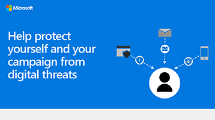

# Microsoft 365 für Ihre Benutzer

Diese Infografiken stellen bewährte Methoden für die Arbeit und Zusammenarbeit in Microsoft 365. Teilen Sie sie mit Ihren Benutzern, um sicherzustellen, dass sie die Vorteile der sicheren Speicherung und Freigabe für Dateien nutzen, gemeinsame Besprechungen halten und vieles mehr.

Weitere [herunterladbare Office finden Sie](https://support.microsoft.com/office/great-ways-to-work-with-office-6fe70269-b9a4-4ef0-a96e-7a5858b3bd5a) auf der [Microsoft 365 Schulungswebsite.](https://support.microsoft.com/training)

## Sicherheitstipps

Laden Sie diese Infografik mit Sicherheitstipps für die Mitglieder Ihres Teams herunter – unabhängig davon, ob Es sich bei Ihrem Team um eine geschäftliche oder gemeinnützige Organisation handelt, z. B. eine politische Kampagne:

| Element | Beschreibung |
|:-----|:-----|
|   [Als PDF herunterladen](../campaigns/downloads/M365CampaignsWhatCanUsersDoToSecure.pdf)  \  [Herunterladen als PowerPoint](../campaigns/downloads/M365CampaignsWhatCanUsersDoToSecure.pptx)| Teilen Sie diese bewährten Methoden, um die Informationen Ihrer Organisation zu schützen. Diese Infografik wurde erstellt, um die Mitarbeiter von politischen Kampagnen zu unterstützen, da diese auf anspruchsvolle Hacker ausgerichtet sind. Sie können die PowerPoint verwenden, um diese Infografik für Ihre eigene Organisation anzupassen. Zugehöriger Artikel: [Wie sich die Sicherheitsempfehlungen für Microsoft 365 auf Ihre Benutzer auswirken](../campaigns/m365-campaigns-users.md)|

## Freigeben Ihrer Geschäftsdateien

Laden Sie eine Infografik herunter, um einen schnellen Überblick über die Möglichkeiten zum Freigeben Ihrer Geschäftsdateien zu erhalten:
  
| Element | Beschreibung |
|:-----|:-----|
|   [Als PDF herunterladen](https://go.microsoft.com/fwlink/?linkid=2079435)  \  [Herunterladen als PowerPoint](https://go.microsoft.com/fwlink/?linkid=2079438) | Verwenden Sie diese bewährten Methoden, wenn Sie Geschäftsdateien freigeben und zusammenarbeiten, damit Sie Ihre Informationen schützen und schützen können. Zugehöriger Artikel: [Übersicht über die Freigabe von Geschäftsdateien](../business-video/overview-file-sharing.md)|

## Hosten von Onlinebesprechungen

Laden Sie eine Infografik herunter, um einen schnellen Überblick darüber zu erhalten, wie Sie an einer Online-Besprechung teilnehmen oder diese mit Microsoft Teams:

| Element | Beschreibung |
|:-----|:-----|
|   [Als PDF herunterladen](https://go.microsoft.com/fwlink/?linkid=2078712)  \  [Herunterladen als PowerPoint](https://go.microsoft.com/fwlink/?linkid=2079515) | Eine kurze Einführung in das Hosten oder Teilnehmen an einer Online-Besprechung mit Microsoft Teams. Zugehöriger Artikel: [Hosten von Onlinebesprechungen für Ihr Unternehmen](../business-video/overview-online-meetings.md)|

## Von überall aus arbeiten

Laden Sie eine Infografik herunter, um Tipps zum Arbeiten von überall zu erhalten:

| Element | Beschreibung |
|:-----|:-----|
|   [Als PDF herunterladen](https://go.microsoft.com/fwlink/?linkid=2079451)  \  [Herunterladen als PowerPoint](https://go.microsoft.com/fwlink/?linkid=2079455) | Hier finden Sie Tipps zum Einrichten Ihrer mobilen Geräte, damit Sie von überall aus arbeiten können. Zugehöriger Artikel: [Arbeiten von überall](../business-video/work-from-anywhere.md)|

## Kunden mit Formularen umfragen

Laden Sie eine Infografik herunter, um herauszufinden, wie Sie Kunden (intern oder extern) mit Microsoft Forms umfragen:

| Element | Beschreibung |
|:-----|:-----|
|   [Als PDF herunterladen](https://go.microsoft.com/fwlink/?linkid=2079526)  \  [Herunterladen als PowerPoint](https://go.microsoft.com/fwlink/?linkid=2079446) | Verwenden Sie Microsoft Forms, um herauszufinden, was Ihre Kunden denken. Zugehöriger Artikel: [Sammeln von Informationen mit Microsoft Forms](https://support.microsoft.com/topic/collect-information-with-microsoft-forms-a55d6e0d-04f6-45b8-b05f-b141b8ecb4d5)|
