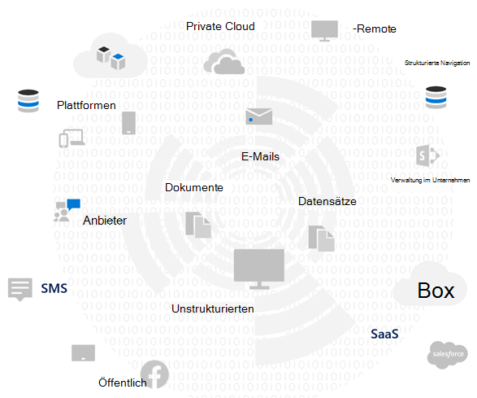
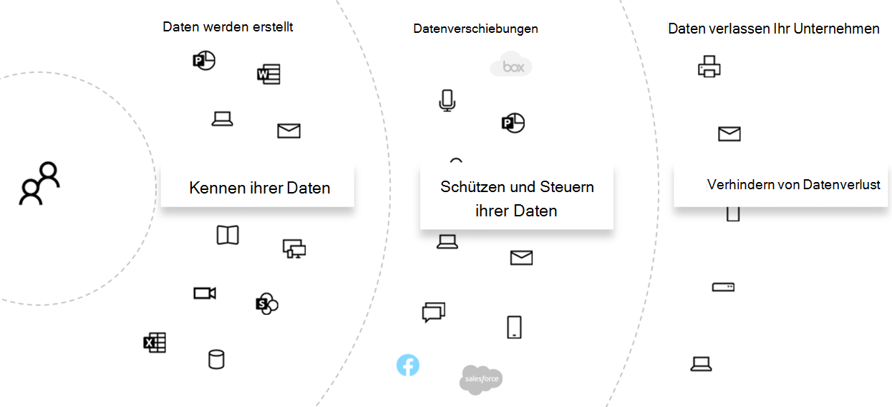

# Bewerten von Datenschutzrisiken und identifizieren vertraulicher Elemente mit Microsoft 365

Die Bewertung der Datenschutzbestimmungen und Risiken, denen Ihre Organisation unterliegt, ist ein wichtiger erster Schritt vor der Implementierung von zugehörigen Verbesserungs Aktionen, einschließlich der mit den Microsoft 365-Features und-Diensten erzielbaren Funktionen. 

## Möglicherweise anwendbare Datenschutzbestimmungen

Eine gute Referenz zu den weiteren rechtlichen Rahmenbedingungen für Datenschutzbestimmungen finden Sie im [Microsoft Services Trust Portal](https://servicetrust.microsoft.com/) und in der [Artikelreihe zur allgemeinen Datenschutzverordnung (dsgvo)-Verordnung](../compliance/gdpr.md)sowie in anderen Materialien zu den Vorschriften, denen Sie möglicherweise in ihrer Branche oder Region unterliegen.

### DSGVO

Die dsgvo, die bekanntesten und zitierten Datenschutzbestimmungen, regelt die Sammlung, Speicherung, Verarbeitung und Weitergabe von personenbezogenen Daten, die sich auf eine identifizierte oder identifizierbare natürliche Person beziehen, die in der Europäischen Union (EU) ansässig ist. 

Gemäß dsgvo Artikel 4: 

- "personenbezogene Daten": alle Informationen, die sich auf eine identifizierte oder identifizierbare natürliche Person beziehen ("betroffene Person"); eine identifizierbare natürliche Person ist eine, die direkt oder indirekt identifiziert werden kann, insbesondere durch Bezugnahme auf einen Bezeichner wie einen Namen, eine Identifikationsnummer, Standortdaten, eine Online-ID oder auf einen oder mehrere Faktoren, die spezifisch für die physische, physiologische, genetische, psychische, wirtschaftliche, kulturelle oder soziale Identität dieser natürlichen Person sind.

### ISO 27001

Die Einhaltung anderer Standards wie ISO 27001 wurde auch von mehreren europäischen Aufsichtsbehörden als gültiger Proxy für die Absicht im gesamten Personen-, Prozess-und Technologiespektrum anerkannt. Die Standards, die Sie überlappen und die Einhaltung von ISO-27001-basierten Schutzmechanismen festgelegt sind, können als Proxy angesehen werden, der einige Datenschutzverpflichtungen unter bestimmten Umständen erfüllt.

### Andere Datenschutzbestimmungen

Andere prominente Datenschutzbestimmungen geben auch Anforderungen für die Verarbeitung personenbezogener Daten an.

In den Vereinigten Staaten gehören dazu das California Consumer Protection Act ([CCPA](../compliance/ccpa-faq.md)), das HIPAA-HITECH (United States Health Care Privacy Act) und das Graham Leach Bliley Act (GLBA). Zusätzliche Zustandsspezifische Regelungen sind auch in-Place oder in der Entwicklung. 

Auf der ganzen Welt finden Sie weitere Beispiele: das nationale dsgvo-Implementierungs Gesetz (BDSG), das Brasilien-Datenschutzgesetz (LGPD) und viele andere.

## Regel Zuordnung zu technischen Steuerungskategorien für Microsoft 365

Viele der datenschutzrechtlichen Bestimmungen weisen überlappende Anforderungen auf, daher sollten Sie sich mit den Vorschriften vertraut machen, denen Sie vor der Entwicklung eines technischen Kontrollschemas unterliegen. 

Für eine spätere Bezugnahme in den Artikeln dieser Gesamtlösung enthält diese Tabelle Auszüge aus einer Stichprobe der Datenschutzbestimmungen. 

| Verordnung | Artikel/Abschnitt | Auszug | Zutreffende Kategorien für technische Steuerelemente |
|:-------|:-----|:-------|:-------|
| DSGVO | Artikel 5 Absatz 1 Buchstabe f | Personenbezogene Daten werden in einer Weise verarbeitet, die eine angemessene Sicherheit der personenbezogenen Daten, einschließlich des Schutzes vor unbefugter oder unrechtmäßiger Verarbeitung und gegen versehentlichen Verlust, Zerstörung oder Beschädigung, durch geeignete technische oder organisatorische Maßnahmen ("Integrität und Vertraulichkeit") gewährleistet.  |  Alle   Identität   Gerät   Bedrohungsschutz   Schützen von Informationen   Informationen steuern   Entdecken und Reagieren |
|  | Artikel (32) (1) (a) | Unter Berücksichtigung des Stands der Technik, der Kosten für die Durchführung und der Art, des Umfangs, des Kontexts und der Zwecke der Verarbeitung sowie des Risikos unterschiedlicher Wahrscheinlichkeit und schwere für die Rechte und Freiheiten natürlicher Personen müssen der Controller und der Verarbeiter geeignete technische und organisatorische Maßnahmen ergreifen, um ein dem Risiko entsprechendes Maß an Sicherheit zu gewährleisten. , einschließlich gegebenenfalls: (a) die Pseudonymisierung und Verschlüsselung personenbezogener Daten. | Schützen von Informationen |
|  | Artikel (13) (2) (a) | "... der Steuerpflichtige muss zum Zeitpunkt der Erlangung personenbezogener Daten der betroffenen Person die folgenden weiteren Informationen zur Verfügung stellen, die erforderlich sind, um eine faire und transparente Verarbeitung sicherzustellen: (a) den Zeitraum, für den die personenbezogenen Daten gespeichert werden oder falls dies nicht möglich ist, die Kriterien, mit denen dieser Zeitraum ermittelt wird. | Informationen steuern |
|  | Artikel (15) (1) (e) | Die betroffene Person hat das Recht, von der Controller-Bestätigung zu erfahren, ob personenbezogene Daten, die sich auf Sie beziehen, verarbeitet werden, und wenn dies der Fall ist, der Zugriff auf die personenbezogenen Daten und die folgenden Informationen: (e) das Recht, von der Steuerung eine Berichtigung oder Löschung personenbezogener Daten oder eine Einschränkung der Verarbeitung personenbezogener Daten in Bezug auf die betroffene Person anzufordern oder gegen diese Verarbeitung zu verstoßen | Entdecken und Reagieren |
| LGPD | Artikel 46 | Verarbeitungs Agenten müssen Sicherheits-, technische und administrative Maßnahmen ergreifen, die personenbezogene Daten vor unbefugtem Zugriff und zufälligen oder unrechtmäßigen Situationen der Zerstörung, des Verlusts, der Änderung, der Kommunikation oder jeglicher Art von unsachgemäßer oder ungesetzlicher Verarbeitung schützen können. | Schützen von Informationen   Informationen steuern   Entdecken und Reagieren|
|  | Artikel 48 | Der Prüfer muss der nationalen Behörde und den betroffenen Personen mitteilen, wenn ein Sicherheitsereignis eintritt, durch das Risiken oder relevante Schäden für die betroffenen Personen entstehen können. | Entdecken und Reagieren |
| HIPPA-HITECH | 45 CFR 164.312(e)(1) | Implementieren von technischen Sicherheitsmaßnahmen, um geschützte elektronische Gesundheitsdaten, die über ein elektronisches Kommunikationsnetzwerk übertragen werden, gegen nicht autorisierte Zugriffe zu schützen. | Schützen von Informationen |
|  | 45 C.F.R. 164.312(e)(2)(ii) | Implementieren eines Mechanismus zum Verschlüsseln und Entschlüsseln geschützter elektronischer Gesundheitsdaten, wann immer dies als angemessen erachtet wird. | Schützen von Informationen |
|  | 45 CFR 164.312(c)(2) | Implementieren elektronischer Mechanismen zur Bestätigung, dass geschützte elektronische Gesundheitsdaten nicht auf unbefugte Weise verändert oder vernichtet wurden. | Informationen steuern |
|  | 45 CFR 164.316(b)(1)(i) | Wenn ein Vorgang, eine Aktivität oder eine Bewertung erforderlich ist, um diesen Abschnitt zu dokumentieren, halten Sie eine schriftliche (möglicherweise elektronische) Aufzeichnung der Aktion, Aktivität oder Bewertung | Informationen steuern |
|  | 45 CFR 164.316(b)(1)(ii) | Die gemäß Paragraf (b)(1) dieses Abschnitts vorgeschriebene Dokumentation ist für einen Zeitraum von sechs Jahren ab dem Datum ihrer Erstellung oder ab dem Datum, zu welchem diese zuletzt in Kraft war, je nachdem, welcher Zeitpunkt später eintritt, aufzubewahren. | Informationen steuern |
|  | 45 C.F.R. 164.308(a)(1)(ii)(D) | Implementieren von Verfahren zum regelmäßigen überprüfen von Datensätzen von Informationssystem Aktivitäten wie Überwachungsprotokollen, Zugriffs Berichten und Überwachungsberichten für Sicherheitsvorfälle | Entdecken und Reagieren |
|  | 45 C.F.R. 164.308(a)(6)(ii) | Identifikation und Reaktion auf mutmaßliche oder bekannte Sicherheitsvorfälle; Minimieren von schädlichen Auswirkungen von Sicherheitsvorfällen, die der betroffenen Entität oder betroffenen Geschäftspartnern bekannt sind, im größtmöglichen Ausmaß; Dokumentieren von Sicherheitsvorfällen und deren Ergebnissen. | Entdecken und Reagieren |
|  | 45 C.F.R. 164.312(b) | Implementieren von Hardware-, Software-und Verfahrensmechanismen zur Aufzeichnung und Untersuchung von Aktivitäten in Informationssystemen, die elektronisch geschützte Integritätsinformationen enthalten oder verwenden. | Entdecken und Reagieren |
| CCPA | 1798.105(c) | Ein Unternehmen, das eine überprüfbare Anforderung eines Verbrauchers erhält, die personenbezogenen Informationen des Verbrauchers gemäß Unterteilung (a) dieses Abschnitts zu löschen, löscht die persönlichen Informationen des Verbrauchers aus seinen Aufzeichnungen und leitet alle Diensteanbieter an, die persönlichen Informationen des Verbrauchers aus Ihren Datensätzen zu löschen. | Entdecken und Reagieren |
|  | 1798.105(d) | (Ausnahmen für 1798.105 (c)   Ein Unternehmen oder ein Diensteanbieter muss die Aufforderung eines Verbrauchers, die persönlichen Informationen des Verbrauchers zu löschen, nicht einhalten, wenn es dem Unternehmen oder Dienstanbieter erforderlich ist, die persönlichen Informationen des Verbrauchers beizubehalten, um: (Weitere Informationen finden Sie in der aktuellen Verordnung). | Entdecken und Reagieren |
|||||

>[!Important]
>Dies ist nicht als erschöpfende Liste gedacht. Weitere Informationen zur Anwendbarkeit der zitierten Abschnitte auf die aufgeführten technischen Steuerungskategorien finden Sie unter [Compliance Manager](../compliance/compliance-manager-overview.md) oder Ihr rechts-oder Compliance Berater.
>

## Kennen ihrer Daten

Unabhängig von den Vorschriften, denen Sie unterliegen, wobei verschiedene Benutzerdatentypen innerhalb und außerhalb Ihrer Organisation mit ihren Systemen interagieren, sind alle wichtigen Faktoren, die sich auf Ihre gesamte Strategie für den Schutz personenbezogener Daten auswirken können, vorbehaltlich der Branchen-und Regierungsvorschriften, die für Ihre Organisation gelten. Dazu gehört, wo personenbezogene Daten gespeichert werden, welcher Typ es ist und wie viel davon vorhanden ist und unter welchen Umständen es gesammelt wurde.
 

### Datenportabilität 

Daten werden auch im Laufe der Zeit verschoben, wenn Sie verarbeitet, verfeinert und andere Versionen daraus abgeleitet werden. Ein anfänglicher Snapshot reicht nie aus. Es muss ein fortlaufender Prozess für die Kenntnis Ihrer Daten geben. Dies stellt eine der größten Herausforderungen für große Organisationen dar, die erhebliche Mengen personenbezogener Daten verarbeiten. Organisationen, die sich nicht mit dem Problem "Wissen Ihrer Daten" befassen, könnten möglicherweise ein sehr hohes Risiko und mögliche Bußgelder von Regulierungsbehörden aufweisen.

 
### Wo die personenbezogenen Daten

Um die Datenschutzbestimmungen zu erfüllen, können Sie sich nicht auf allgemeine Vorstellungen verlassen, in denen Sie denken, dass persönliche Daten jetzt oder in Zukunft vorhanden sein könnten. Die Datenschutzbestimmungen erfordern, dass Organisationen nachweisen, dass Sie wissen, wo sich personenbezogene Daten fortlaufend befinden. Auf diese Weise ist es wichtig, dass Sie einen Anfangssnapshot aller Datenquellen für die mögliche Speicherung persönlicher Informationen, einschließlich Ihrer Microsoft 365-Umgebung, und Mechanismen für die laufende Überwachung und Erkennung erstellen.

Wenn Sie die allgemeine Bereitschaft und das Risiko, das mit den Datenschutzbestimmungen verbunden ist, noch nicht bewertet haben, verwenden Sie das folgende 3-Schritte-Framework für die ersten Schritte. 

>[!Note]
>Dieser Artikel und sein Inhalt sind nicht für juristische Beratungsdienste gedacht. Es bietet lediglich einige grundlegende Anleitungen und Links zu Tools, die in den frühen Phasen der Bewertung hilfreich sein können.
>
 
## Schritt 1: Entwickeln eines grundlegenden Verständnisses der Szenarien für personenbezogene Daten in Ihrem Unternehmen 

Sie müssen die Exposition gegenüber dem Datenschutzrisiko auf der Grundlage der Art der personenbezogenen Daten, die derzeit verwaltet werden, wo Sie gespeichert ist, welche Schutz Kontrollen darauf abgelegt werden, wie Ihr Lebenszyklus verwaltet wird und wer darauf zugreifen kann, einschätzen. 

Als Ausgangspunkt ist es wichtig zu inventarisieren, welche Arten von personenbezogenen Daten in Ihrer Microsoft 365-Umgebung vorhanden sind. Verwenden Sie die folgenden Kategorien:

- Erforderliche Mitarbeiterdaten zur Ausführung von alltäglichen Geschäftsfunktionen
- Daten, die die Organisation über Geschäftskunden, Partner und andere Beziehungen im Business-to-Business (B2B)-Szenario verfügt
- Daten der Organisation zu Verbrauchern, die Informationen für Onlinedienste bereitstellen, die die Organisation im Szenario "Business-to-Customer" (B2C) verwaltet

Nachfolgend finden Sie ein Beispiel für die unterschiedlichen Datentypen für typische Abteilungen einer Organisation.

Ein Großteil der personenbezogenen Daten, die Datenschutzbestimmungen unterliegen, wird normalerweise außerhalb von Microsoft 365 gesammelt und gespeichert. Personenbezogene Daten von Consumer-basierten Webanwendungen oder mobilen Anwendungen müssen aus solchen Anwendungen an Microsoft 365 exportiert worden sein, um die Datenschutzprüfung in Microsoft 365 zu unterliegen. 

Die Datenschutz Anfälligkeit in Microsoft 365 ist möglicherweise im Verhältnis zu Ihren Webanwendungen und CRM-Systemen, die von dieser Lösung nicht behandelt werden, geringer.

Bei der Bewertung ihres Risikoprofils sollten Sie auch die folgenden allgemeinen Herausforderungen bei der Einhaltung von Datenschutzanforderungen berücksichtigen:

 - **Verteilung personenbezogener Daten.** Wie zerstreut sind Informationen zu einem bestimmten Thema? Ist es gut genug, um die Regulierungsbehörden davon zu überzeugen, dass richtige Kontrollen vorhanden sind? Kann es bei Bedarf untersucht und behoben werden?
- **Schutz vor Ausscheidung.** Wie schützen Sie personenbezogene Daten eines bestimmten Typs oder einer bestimmten Quelle vor Beeinträchtigungen und wie Sie darauf reagieren können?
- **Schutz vs. Risk.** Welche Mechanismen zum Schutz des Informationsschutzes sind hinsichtlich des Risikos angemessen, und wie Sie die Geschäftskontinuität und Produktivität aufrecht erhalten und die Auswirkungen auf die Endbenutzer minimieren können, wenn ein Endbenutzer Eingriff erforderlich ist? Sollte beispielsweise die manuelle Klassifizierung oder Verschlüsselung verwendet werden?
- **Aufbewahrung personenbezogener Daten.** Wie lange müssen Informationen, die personenbezogene Daten enthalten, aus gültigen geschäftlichen Gründen aufbewahrt werden und wie Sie frühere Keep-it-Forever-Methoden vermeiden, die mit dem aufbewahrungsbedarf für die Business Continuity ausgeglichen sind?
- **Behandeln von Anforderungen für betroffene.** Welche Mechanismen sind erforderlich, um Anforderungen an die Datensubjekte (DSRs) und etwaige Korrekturmaßnahmen wie Anonymisierung, Korrektur und Löschung zu bearbeiten?
- **Laufende Überwachung und Berichterstellung.** Welche Art von alltäglichen Überwachungs-, Ermittlungs-und Bericht Erstellungstechniken stehen für die verschiedenen Datentypen und-Quellen zur Verfügung?
- **Einschränkungen für die Datenverarbeitung.** Gibt es Einschränkungen bei der Verwendung von Daten für Informationen, die über diese Methoden erfasst oder gespeichert werden, die die Organisation in den Datenschutzkontrollen reflektieren muss? Beispielsweise können Zusagen, dass personenbezogene Daten nicht von Vertriebsmitarbeitern verwendet werden, erforderlich sein, dass Ihre Organisation Mechanismen einsetzt, um die Übertragung oder Speicherung dieser Informationen in Systemen zu verhindern, die der Vertriebsorganisation zugeordnet sind.

### Erforderliche Mitarbeiterdaten zur Ausführung von alltäglichen Geschäftsfunktionen

Organisationen von Natur aus müssen Daten über Mitarbeiter für elektronische Identitäts-und Personal Zwecke sammeln, vorbehaltlich dessen, was Sie in ihren Mitarbeiter Vereinbarungen vereinbaren. Solange eine Person für ein Unternehmen arbeitet, ist dies in der Regel kein Problem. Die Organisation möchte möglicherweise Mechanismen einsetzen, um zu verhindern, dass böswillige Akteure exfiltrating oder personenbezogene Mitarbeiterdaten undicht finden. 

Wenn eine Person ein Unternehmen verlässt, verfügen Organisationen in der Regel über Prozesse, Verfahren und Aufbewahrungs-und Lösch Zeitpläne zum Entfernen von Benutzerkonten, Stilllegung von Postfächern und persönlichen Laufwerken sowie zum Ändern des Status von Mitarbeitern in Sachen wie Personalwesen Systeme. Für Fälle, in denen ein Rechtsstreit beteiligt ist, kann ein Mitarbeiter oder ein anderer Beteiligter einer juristischen Untersuchung berechtigte Gründe für das Abrufen von Informationen über die in den Systemen der Organisation gespeicherten personenbezogenen Daten haben. Bei einigen Gelegenheiten kann diese Partei verlangen, dass diese Daten entfernt oder anonymisiert werden. 

Um diese Anforderungen zu erfüllen, sollten Organisationen über Prozesse und Verfahren verfügen, die vorbeugende, detektivische und sanierungsbedürftige Anforderungen erfüllen, um diese Anforderungen zu erleichtern, wobei darauf hingewiesen wird, dass einige Informationen zu einem Mitarbeiter für die Business Continuity vernünftigerweise als entscheidend betrachtet werden können. Beispielsweise Informationen, mit denen eine einzelne Person eine Datei erstellt oder eine Funktion ausgeführt hat. 

>[!Note]
>Informationen zu Ermittlungs-und Korrekturverfahren für personenbezogene Daten in Microsoft 365 finden Sie im [Artikel Monitor and Respond](information-protection-deploy-monitor-respond.md). Möglicherweise möchten Sie auch automatisierte Klassifizierungs-und Schutzschemas einsetzen, um sicherzustellen, dass personenbezogene Daten innerhalb der Organisation gesteuert werden, und Sie verhindern, dass Sie die Organisation in Situationen mit böswilligen Darstellern verlassen. Weitere Informationen finden Sie im [Artikel Protect Information](information-protection-deploy-protect-information.md) .
>
 
### Daten, die die Organisation über Ihre Geschäftskunden im B2B-Szenario hat

Eine Sammlung von B2B-Informationen ist auch eine Herausforderung, da Ihre Organisation möglicherweise Datensätze von Kundennamen und-Transaktionen in ihren verschiedenen Systemen für Geschäfts Kontinuitäten speichern muss, um diese Informationen vor versehentlicher oder böswilliger Ausnutzung zu schützen. Wie Mitarbeiterdaten müssen Organisationen Richtlinien, Verfahren und technische Steuerungen haben, um diese Daten zu schützen und Sie gemäß definierten Aufbewahrungs-und Löschungs Zeitplänen zu veraltern. 

In der Regel haben Verträge mit externen Kunden, Partnern und den anderen Entitäten, mit denen die Organisation Geschäfte abschließt, eine Sprache, die sich mit der Verarbeitung solcher Daten befasst, einschließlich Schutz, Aufbewahrung und Löschung sowohl während als auch nach der Beziehung zwischen der Entität und der Organisation. 

### Daten der Organisation zu Verbrauchern, die Informationen für Onlinedienste bereitstellen, die die Organisation im B2C-Szenario verwaltet

Bei diesen Kategorien handelt es sich um die meisten Personen, die aufgrund von vielen öffentlichen Instanzen von Kundendaten Verlusten nachdenken, um Datenschutz zu finden. Dies kann beabsichtigt sein, beispielsweise ein Drittanbieter unter Vertrag an den Anbieter oder unbeabsichtigte, wie extrahiert von einem böswilligen Akteur. Der Schutz von Daten für Verbraucher ist einer der Hauptgründe, warum die EU und andere diese Verordnungen umgesetzt haben. Die Datenschutzbestimmungen wie dsgvo und CCPA erfordern eine Planung für Folgendes:

- Prüflisten für [Aktionspläne](../compliance/gdpr-action-plan.md) und [Verantwortlichkeits Bereitschaft](../compliance/gdpr-arc-office365.md)
- [Datenschutz-Folgenabschätzung](../compliance/gdpr-data-protection-impact-assessments.md)
- [Verstöße gegen Benachrichtigungen](../compliance/gdpr-breach-office365.md)
- [Anfragen von Datensubjekten](../compliance/gdpr-dsr-office365.md)

Wenn in Ihrer Organisation nicht viele direkt von Consumer-Datenerfassung durchführen, kann diese Kategorie weniger ein Problem sein. Möglicherweise müssen Sie jedoch die in diesen Artikeln beschriebenen Prozesse durchlaufen, um die Compliance zu erreichen.

### Schritt 1 Zusammenfassung

Das Verständnis Ihrer Gefährdung und Datenschutzbestimmungen ist ein wichtiger erster Schritt, der auf einem grundlegenden Verständnis der Szenarien für personenbezogene Daten in Ihrem Unternehmen basiert.

Wenn Sie keine personenbezogenen Daten von Verbrauchern in Ihrer Microsoft 365-Umgebung haben oder sich auf bestimmte Teile der Umgebung beschränken und die Notwendigkeit einer technischen Steuerung darauf basiert, dass die Daten von consumertypen verwendet werden, muss diese technische Steuerung möglicherweise nur in Bereichen mit hohem Risiko eingesetzt werden, nicht überall.

Während eine externe Organisation oder ein Standardmäßiges Steuerelement mit einer Empfehlung, beispielsweise aus dem Kompatibilitäts Faktor in Microsoft 365, ihre Steuerungsstrategie informieren kann, sollte die Auswahl der Implementierung durch das Data Inventory Awareness zur Quantifizierung der tatsächlichen Risikoanfälligkeit gesteuert werden.

In den meisten Organisationen wird eine der oben genannten Szenarien ausgesetzt. Es ist wichtig, einen ganzheitlichen Ansatz für die Bewertung zu erstellen.

## Schritt 2: Bewerten der Bereitschaft zur Einhaltung der Datenschutzbestimmungen

Obgleich spezifisch für dsgvo, bieten die im kostenlosen [Microsoft dsgvo Assessment-Tool](https://www.microsoft.com/cyberassessment/en/gdpr/uso365) gestellten Fragen einen guten Einstieg in das Verständnis ihrer allgemeinen Datenschutz Bereitschaft. 

Organisationen, die anderen Datenschutzbestimmungen unterliegen, wie CCPA in den Vereinigten Staaten oder Brasiliens LGPD, können auch von dem Verzeichnis der Bereitschaft des Tools profitieren, das sich überlappende Bestimmungen mit der dsgvo.

Die dsgvo-Bewertung umfasst die folgenden Abschnitte:

| | |
|:-------|:-----|
| Governance | <ol><li>Wird in ihrer Datenschutzrichtlinie explizit angegeben, welche Daten Informationen verarbeitet werden? </li><li>Führen Sie regelmäßig datenschutzfolgenabschätzungen (PIAs) aus? </li><li> Verwenden Sie ein Tool zum Verwalten von persönlichen Informationen (PI)? </li><li> Haben Sie die Befugnis, Geschäfte mit Pi-Daten auf einem bestimmten Individuum durchzuführen? Verfolgen Sie die Einwilligung für Daten? </li><li> Verfolgen, implementieren und verwalten Sie Überwachungssteuerelemente? Überwachen Sie Datenlecks? </li></ol>|
| Löschen & Benachrichtigung | <ol><li>Geben Sie explizit Anweisungen dazu, wie auf die Daten von Benutzern zugegriffen werden kann? </li><li> Haben Sie dokumentierte Prozesse zur Bearbeitung der Zustimmung zur Ablehnung? </li><li>   Haben Sie einen automatisierten Löschvorgang für Daten? </li><li>   Haben Sie einen Prozess zum Überprüfen der Identität, wenn Sie sich mit einem Kunden beschäftigen? </li></ol>|
| Risikominderung und Informationssicherheit | <ol><li>Verwenden Sie Tools zum Durchsuchen unstrukturierter Daten? </li><li>Sind alle Server auf dem neuesten Stand, und nutzen Sie Firewalls, um Sie zu schützen? </li><li>Führen Sie regelmäßige Sicherungen Ihrer Server aus? </li><li>Überwachen Sie aktiv Datenlecks? </li><li>Verschlüsseln Sie Ihre Daten im Ruhezustand und in der Übertragung? </li></ol>|
| Richtlinienverwaltung | <ol><li>Wie verwalten Sie Ihre Bindungs Unternehmensregeln (BCR)? </li><li>Verfolgen Sie die Einwilligung für Daten? </li><li> Decken ihre Verträge auf einer Skala von 1 bis 5, 5 vollständig abgedeckt, die Datenklassifizierungen und-Anforderungen ab? </li><li>Haben Sie einen Vorfall Antwort Plan regelmäßig getestet? </li><li>Welche Richtlinie verwenden Sie zum Verwalten des Zugriffs? </li></ol>|
|||
 
## Schritt 3: identifizieren Sie vertrauliche Informationstypen, die in Ihrer Microsoft 365-Umgebung auftreten. 

In diesem Schritt werden bestimmte vertrauliche Informationstypen identifiziert, die bestimmten behördlichen Kontrollen unterliegen, sowie deren Auftreten in Ihrer Microsoft 365-Umgebung. 

Die Suche nach Inhalten in Ihrer Umgebung, die persönliche Inhalte enthalten, kann eine gewaltige Aufgabe sein, die zuvor eine Kombination aus der Verwendung der Compliance-Suche, eDiscovery, Advanced eDiscovery DLP und Überwachung umfasste. 

Mit der neuen **Daten Klassifizierungs** Lösung im Microsoft Compliance Admin Center ist dies mit der Funktion [Content Explorer](../compliance/data-classification-content-explorer.md) viel einfacher geworden, die entweder mit integrierten oder benutzerdefinierten vertraulichen Informationstypen, einschließlich der personenbezogenen Daten, funktioniert.
 
### Typen vertraulicher Informationen

Das Microsoft Compliance Admin Center verfügt über mehr als 100 vertrauliche Informationstypen, die zum größten Teil im Zusammenhang mit der Identifizierung und Lokalisierung personenbezogener Daten stehen. Mithilfe dieser integrierten Typen für vertrauliche Informationen können Sie Kreditkartennummern, Bank Kontonummern, Passport-Nummern und mehr basierend auf Mustern identifizieren und schützen, die durch einen regulären Ausdruck (Regex) oder eine Funktion definiert sind. Weitere Informationen finden Sie unter [Wonach die Typen vertraulicher Informationen suchen](../compliance/what-the-sensitive-information-types-look-for.md).

Wenn Sie eine organisationsspezifische oder regionale Art vertraulicher Elemente wie ein benutzerdefiniertes Format für Mitarbeiter-IDs oder andere persönliche Informationen, die noch nicht durch einen integrierten vertraulichen Informationstyp abgedeckt sind, identifizieren und schützen müssen, können Sie mit den folgenden Methoden einen benutzerdefinierten Typ vertraulicher Informationen erstellen: 

- PowerShell
- Benutzerdefinierte Regeln mit exakter Datenübereinstimmung (EDM)
- Über die Benutzeroberfläche des Compliance Center-Administrators, wie im [Artikel use Compliance Score and Compliance Manager](information-protection-deploy-compliance.md) hervorgehoben

Sie können auch einen vorhandenen, integrierten Typ vertraulicher Informationen anpassen.

Weitere Informationen finden Sie in den folgenden Artikeln:

- [Anpassen eines benutzerdefinierten vertraulichen Informationstyps](../compliance/customize-a-built-in-sensitive-information-type.md)
- [Benutzerdefinierte vertrauliche Informationstypen](../compliance/custom-sensitive-info-types.md)
- [Erstellen eines benutzerdefinierten vertraulichen Informationstyps im Security & Compliance Center](../compliance/create-a-custom-sensitive-information-type.md)
- [Erstellen eines benutzerdefinierten Typs für vertrauliche Informationen in Security & Compliance Center PowerShell](../compliance/create-a-custom-sensitive-information-type-in-scc-powershell.md)
- [Erstellen benutzerdefinierter vertraulicher Informationstypen mit exakter Daten Übereinstimmungs basierter Klassifizierung](../compliance/create-custom-sensitive-information-types-with-exact-data-match-based-classification.md)

### Inhalts-Explorer

Ein wichtiges Tool zum Ermitteln des Auftretens von vertraulichen Elementen in Ihrer Umgebung ist der neue [Inhalts-Explorer](../compliance/data-classification-content-explorer.md) im Microsoft 365 Compliance Admin Center. Es handelt sich um ein automatisches Tool für das anfängliche und laufende Überprüfen des gesamten Microsoft 365-Abonnements für das Auftreten vertraulicher Informationstypen und die Anzeige der Ergebnisse.
 
Mit dem neuen Inhalts-Explorer-Tool können Sie die Speicherorte von vertraulichen Elementen in Ihrer Umgebung schnell identifizieren, indem Sie entweder integrierte vertrauliche Informationstypen oder benutzerdefinierte verwenden. Dies kann dazu führen, dass ein Prozess eingerichtet und die Verantwortung für die regelmäßige Untersuchung der Anwesenheit und des Standorts vertraulicher Elemente festgelegt wird

Zusammen mit den anderen in diesem Artikel hervorgehobenen Schritten ist dies ein Ausgangspunkt für die Ermittlung ihrer allgemeinen Risikoexposition, Bereitschaft und Position von vertraulichen Elementen, die durch die geplante Konfiguration und Überwachung von Microsoft 365 geschützt werden sollen. 

### Andere Methoden zum Identifizieren personenbezogener Daten in Ihrer Umgebung

Neben dem Inhalts-Explorer haben Organisationen Zugriff auf die Inhalts Suchfunktion, um benutzerdefinierte Suchvorgänge zum Auffinden personenbezogener Daten in Ihrer Umgebung zu erstellen, wobei erweiterte Suchkriterien und benutzerdefinierte Filter verwendet werden.

Ausführliche Anleitungen zur Verwendung der Inhaltssuche für die Ermittlung personenbezogener Daten finden Sie in [diesem Artikel](../compliance/search-for-and-find-personal-data.md). Die Inhaltssuche und andere Ermittlungstechniken werden auch in [DSRs für dsgvo und CCPA](../compliance/gdpr-dsr-office365.md#introduction-to-dsrs)untersucht.

Weitere Einblicke in Ermittlungs-und Korrektur Techniken für personenbezogene Daten in Microsoft 365 finden Sie im [Artikel Monitor and Respond](information-protection-deploy-monitor-respond.md).
