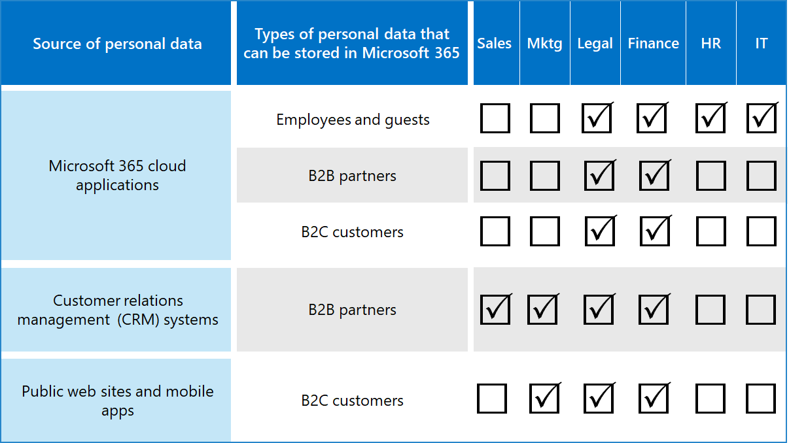

# Bewerten von Datenschutzrisiken und Identifizieren vertraulicher Elemente mit Microsoft 365

Die Bewertung der Datenschutzbestimmungen und Risiken, denen Ihre Organisation unterliegt, ist ein wichtiger erster Schritt vor der Implementierung verwandter Verbesserungsmaßnahmen, einschließlich derjenigen, die mit Microsoft 365-Features und -Diensten erreicht werden können. 

## Potenziell anwendbare Datenschutzbestimmungen

Eine gute Referenz zum umfassenderen regulatorischen Rahmen für Datenschutzbestimmungen finden Sie im [Microsoft Services Trust Portal](https://servicetrust.microsoft.com/) und in der Reihe der Artikel zur DSGVO-Verordnung [(DSGVO)](../compliance/gdpr.md)sowie zu anderen Materialien zu den Bestimmungen, die Ihnen in Ihrer Branche oder Region unterliegen können.

### DSGVO

Die DSGVO, die bekannteste und häufigste der Datenschutzbestimmungen, regelt die Erfassung, Speicherung, Verarbeitung und Freigabe von personenbezogenen Daten, die sich auf eine identifizierte oder identifizierbare natürliche Person beziehen, die in der Europäischen Union (EU) ansässig ist. 

Gemäß Artikel 4 der DSGVO: 

- "personenbezogene Daten" bezeichnet alle Informationen, die sich auf eine identifizierte oder identifizierbare natürliche Person ("betroffene Person") bezogen haben; Eine identifizierbare natürliche Person ist eine Person, die direkt oder indirekt identifiziert werden kann, insbesondere durch Verweis auf einen Bezeichner wie einen Namen, eine Identifikationsnummer, Standortdaten, eine Online-ID oder einen oder mehrere Faktoren, die für die physische, genetische, genetische, mentale, wirtschaftliche, kulturelle oder soziale Identität dieser natürlichen Person spezifisch sind.

### ISO 27001

Die Einhaltung anderer Standards wie ISO 27001 wurde auch von mehreren europäischen Aufsichtsbehörden als gültiger Absichtsproxy im gesamten Personen-, Prozess- und Technologiespektrum anerkannt. Die standards it specifies overlap and compliance to ISO-27001-driven protection mechanisms may be considered a proxy fulfilling some privacy obligations in certain circumstances.

### Andere Datenschutzbestimmungen

Andere wichtige Datenschutzbestimmungen legen auch Anforderungen für die Verarbeitung personenbezogener Daten fest.

In den VEREINIGTEn Staaten sind dies der California Consumer Protection Act ([CCPA),](../compliance/ccpa-faq.md)HIPAA-HITECH (United States Health Care Privacy Act) und der California Leach Bliley Act (GLBA). Zusätzliche statusspezifische Vorschriften sind auch in Der-Place oder in der Entwicklung. 

Weitere Beispiele weltweit sind das nationale DSGVO-Implementierungsgesetz (DSGVO), das Brazil Data Protection Act (LGPD) und viele andere.

## Zuordnung von Vorschriften zu technischen Steuerelementkategorien von Microsoft 365

Viele der datenschutzbezogenen Vorschriften haben überlappende Anforderungen, daher sollten Sie wissen, welche Bestimmungen sie unterliegen, bevor Sie ein technisches Kontrollschema entwickeln. 

Zur späteren Referenz in den Artikeln dieser Gesamtlösung enthält diese Tabelle Auszüge aus einer Stichprobe von Datenschutzbestimmungen. 

| Verordnung | Artikel/Abschnitt | Auszug | Anwendbare kategorien für technische Kontrollen |
|:-------|:-----|:-------|:-------|
| DSGVO | Artikel 5 Absatz 1(f) | Personenbezogene Daten werden auf eine Weise verarbeitet, die eine angemessene Sicherheit der personenbezogenen Daten gewährleistet, einschließlich Schutz vor unbefugter oder unrechtmäßiger Verarbeitung und vor versehentlichem Verlust, Zerstörung oder Schaden, unter Verwendung geeigneter technischer oder organisatorischer Maßnahmen ("Integrität und Vertraulichkeit").  |  (Alle)   Identity   Gerät   Bedrohungsschutz   Schützen von Informationen   Informationen steuern   Entdecken und Reagieren |
|  | Artikel (32) (1) (a) | Unter Berücksichtigung des Standes der Technik, der Implementierungskosten und der Art, des Umfangs, des Kontexts und der Zwecke der Verarbeitung sowie des Risikos unterschiedlicher Wahrscheinlichkeit und Schwere für die Rechte und Freiheiten natürlicher Personen setzen der Verantwortliche und der Auftragsverarbeiter geeignete technische und organisatorische Maßnahmen um, um ein Sicherheitsniveau zu gewährleisten, das dem Risiko angemessen ist. , einschließlich inter-inter-in: (a) die Pseudonymisierung und Verschlüsselung von personenbezogenen Daten. | Schützen von Informationen |
|  | Artikel (13) (2) (a) | "... Der Verantwortliche stellt der personenbezogenen Daten zu dem Zeitpunkt, zu dem personenbezogene Daten eingeholt werden, die folgenden weiteren erforderlichen Informationen zur Verfügung, um eine gerechte und transparente Verarbeitung sicherzustellen: (a) den Zeitraum, für den die personenbezogenen Daten gespeichert werden, oder, wenn dies nicht möglich ist, die Kriterien, anhand derer dieser Zeitraum bestimmt wird. | Informationen steuern |
|  | Artikel (15) (1) (e) | Die verantwortliche Person hat das Recht, vom Verantwortlichen eine Bestätigung dazu zu verlangen, ob personenbezogene Daten, die sich auf sie beziehen, verarbeitet werden, und, falls dies der Fall ist, Zugriff auf die personenbezogenen Daten und die folgenden Informationen: (e) das Vorhandensein des Rechts auf Berichtigung oder Löschung personenbezogener Daten durch den Verantwortlichen oder einschränkung der Verarbeitung personenbezogener Daten bezüglich der datensubjektorientierten Person oder das Recht auf Einbehaltung gegen diese Verarbeitung | Entdecken und Reagieren |
| LGPD | Artikel 46 | Verarbeitungsagenten treffen Sicherheits-, technische und administrative Maßnahmen, die personenbezogene Daten vor unbefugtem Zugriff und unbeabsichtigten oder unrechtmäßigen Situationen von Zerstörung, Verlust, Änderung, Kommunikation oder jeder Art von unsachgemäßer oder unrechtmäßiger Verarbeitung schützen können. | Schützen von Informationen   Informationen steuern   Entdecken und Reagieren|
|  | Artikel 48 | Der Prüfer muss der nationalen Behörde und den betroffenen Personen mitteilen, wenn ein Sicherheitsereignis eintritt, durch das Risiken oder relevante Schäden für die betroffenen Personen entstehen können. | Entdecken und Reagieren |
| HIPPA-HITECH | 45 CFR 164.312(e)(1) | Implementieren von technischen Sicherheitsmaßnahmen, um geschützte elektronische Gesundheitsdaten, die über ein elektronisches Kommunikationsnetzwerk übertragen werden, gegen nicht autorisierte Zugriffe zu schützen. | Schützen von Informationen |
|  | 45 C.F.R. 164.312(e)(2)(ii) | Implementieren eines Mechanismus zum Verschlüsseln und Entschlüsseln geschützter elektronischer Gesundheitsdaten, wann immer dies als angemessen erachtet wird. | Schützen von Informationen |
|  | 45 CFR 164.312(c)(2) | Implementieren elektronischer Mechanismen zur Bestätigung, dass geschützte elektronische Gesundheitsdaten nicht auf unbefugte Weise verändert oder vernichtet wurden. | Informationen steuern |
|  | 45 CFR 164.316(b)(1)(i) | Wenn eine Aktion, Aktivität oder Bewertung von diesem Unterpart dokumentiert werden muss, bewahren Sie ein schriftliches (möglicherweise elektronisches) Aufzeichnung der Aktion, Aktivität oder Bewertung auf. | Informationen steuern |
|  | 45 CFR 164.316(b)(1)(ii) | Die gemäß Paragraf (b)(1) dieses Abschnitts vorgeschriebene Dokumentation ist für einen Zeitraum von sechs Jahren ab dem Datum ihrer Erstellung oder ab dem Datum, zu welchem diese zuletzt in Kraft war, je nachdem, welcher Zeitpunkt später eintritt, aufzubewahren. | Informationen steuern |
|  | 45 C.F.R. 164.308(a)(1)(ii)(D) | Implementieren von Verfahren zur regelmäßigen Überprüfung von Aufzeichnungen der Aktivitäten des Informationssystems, z. B. Überwachungsprotokolle, Zugriffsberichte und Berichte zur Nachverfolgung von Sicherheitsvorfällen | Entdecken und Reagieren |
|  | 45 C.F.R. 164.308(a)(6)(ii) | Identifikation und Reaktion auf mutmaßliche oder bekannte Sicherheitsvorfälle; Minimieren von schädlichen Auswirkungen von Sicherheitsvorfällen, die der betroffenen Entität oder betroffenen Geschäftspartnern bekannt sind, im größtmöglichen Ausmaß; Dokumentieren von Sicherheitsvorfällen und deren Ergebnissen. | Entdecken und Reagieren |
|  | 45 C.F.R. 164.312(b) | Implementieren Sie Hardware-, Software- und Verfahrensmechanismen, die Aktivitäten in Informationssystemen aufzeichnen und untersuchen, die geschützte elektronische Gesundheitsdaten enthalten oder verwenden. | Entdecken und Reagieren |
| CCPA | 1798.105(c) | Ein Unternehmen, das einen überprüfbaren Antrag von einem Verbraucher erhält, die personenbezogenen Informationen des Verbrauchers gemäß Unterabschnitt (a) dieses Abschnitts zu löschen, löscht die persönlichen Informationen des Verbrauchers aus seinen Aufzeichnungen und leitet alle Dienstanbieter an, die persönlichen Informationen des Verbrauchers aus ihren Aufzeichnungen zu löschen. | Entdecken und Reagieren |
|  | 1798.105(d) | (Ausnahmen von 1798.105(c)   Ein Unternehmen oder Dienstanbieter ist nicht verpflichtet, dem Antrag eines Verbrauchers zur Löschung der persönlichen Informationen des Verbrauchers nach zu entsprechen, wenn es für das Unternehmen oder den Dienstanbieter erforderlich ist, die persönlichen Informationen des Verbrauchers zu verwalten, um: (zusätzliche Informationen finden Sie in der aktuellen Verordnung). | Entdecken und Reagieren |
|||||

>[!Important]
>Dies ist nicht als vollständige Liste gedacht. Weitere Informationen zur Anwendbarkeit der genannten Abschnitte zu den aufgeführten technischen Kontrollkategorien finden Sie im [Compliance Manager](../compliance/compliance-manager.md) oder ihrem Rechts- oder Complianceratgeber.
>

## Ihre Daten kennen

Unabhängig von den Vorschriften, denen Sie unterliegen, sind unterschiedliche Benutzerdatentypen innerhalb und außerhalb Ihrer Organisation mit Ihren Systemen alle wichtigen Faktoren, die sich auf Ihre gesamte Strategie zum Schutz personenbezogener Daten auswirken können, abhängig von den Branchen- und Behördenbestimmungen, die für Ihre Organisation gelten. Dazu gehört, wo personenbezogene Daten gespeichert werden, um welchen Typ es sich handelt und wie viel davon es gibt und unter welchen Umständen sie erfasst wurden.
 

### Datenportabilität 

Daten werden auch im Laufe der Zeit bewegt, während sie verarbeitet, verfeinert und andere Versionen daraus abgeleitet werden. Eine anfängliche Momentaufnahme reicht nie aus. Es muss ein fortlaufender Prozess zum Wissen Ihrer Daten sein. Dies stellt eine der größten Herausforderungen für große Organisationen dar, die große Mengen personenbezogener Daten verarbeiten. Organisationen, die das Problem "Ihre Daten kennen" nicht beheben, können mit einem sehr hohen Risiko und möglichen Bußgeldern von Aufsichtsbehörden enden.

 
### Wo sich die personenbezogenen Daten befindet

Um Datenschutzbestimmungen zu erfüllen, können Sie sich nicht auf allgemeine Vorstellungen verlassen, wo ihrer Meinung nach personenbezogene Daten vorhanden sein könnten, entweder jetzt oder in der Zukunft. Datenschutzbestimmungen erfordern, dass Organisationen nachweisen, dass sie ständig wissen, wo personenbezogene Daten gespeichert sind. Dies macht es wichtig, eine erste Momentaufnahme aller Datenquellen für die mögliche Speicherung personenbezogener Informationen, einschließlich Ihrer Microsoft 365-Umgebung, zu erstellen und Mechanismen für die fortlaufende Überwachung und Erkennung zu erstellen.

Wenn Sie Ihre allgemeine Bereitschaft und das Risiko im Zusammenhang mit Datenschutzbestimmungen noch nicht bewertet haben, verwenden Sie das folgende 3-Schritte-Framework, um zu beginnen. 

>[!Note]
>Dieser Artikel und sein Inhalt sollen nicht an die Stelle von Rechtsempfehlungen stehen. Es enthält lediglich einige grundlegende Anleitungen und Links zu Tools, die in den frühen Phasen Ihrer Bewertung von Unterstützung sein können.
>
 
## Schritt 1: Entwickeln eines grundlegenden Verständnisses der Szenarien für personenbezogene Daten in Ihrer Organisation 

Sie müssen die Gefährdung des Datenschutzrisikos basierend auf der Art der aktuell verwalteten personenbezogenen Daten, dem Ort, an dem sie gespeichert werden, den Schutzkontrollen, der Verwaltung des Lebenszyklus und dem Zugriff darauf abschätzen. 

Als Ausgangspunkt ist es wichtig, inventar zu machen, welche Arten von personenbezogenen Daten in Ihrer Microsoft 365-Umgebung vorhanden sind. Verwenden Sie die folgenden Kategorien:

- Mitarbeiterdaten, die für die Durchführung von täglichen Geschäftsfunktionen erforderlich sind
- Daten, die die Organisation zu ihren Geschäftskunden, Partnern und anderen Beziehungen im Business-to-Business (B2B)-Szenario hat
- Daten, die die Organisation über Verbraucher verfügt, die Informationen für Onlinedienste bereitstellen, die die Organisation im Business-to-Customer (B2C)-Szenario verwaltet

Hier ist ein Beispiel für die verschiedenen Datentypen für typische Abteilungen einer Organisation.

Ein Teil der personenbezogenen Daten, die der Datenschutzbestimmungen unterliegen, werden in der Regel außerhalb von Microsoft 365 gesammelt und gespeichert. Alle personenbezogenen Daten aus web- oder mobilen Anwendungen, die dem Verbraucher gegenüber stehen, müssten aus diesen Anwendungen nach Microsoft 365 exportiert worden sein, um in Microsoft 365 einer Datenschutzprüfung unterzogen zu werden. 

Ihre Datenschutzrisiken in Microsoft 365 sind möglicherweise im Verhältnis zu Ihren Webanwendungen und CRM-Systemen eingeschränkt, die diese Lösung nicht adressiert.

Es ist auch wichtig, bei der Bewertung Ihres Risikoprofils die folgenden allgemeinen Herausforderungen bei der Einhaltung von Datenschutzbestimmungen zu prüfen:

 - **Verteilung personenbezogener Daten.** Wie verteilt sind Informationen zu einem bestimmten Thema? Ist es bekannt genug, die Behörden zu überzeugen, dass geeignete Kontrollen zur Anwendung kommen? Kann sie untersucht und bei Bedarf behoben werden?
- **Schutz vor Exfiltration.** Wie schützen Sie personenbezogene Daten eines bestimmten Typs oder einer bestimmten Quelle vor einer Verletzung und wie reagieren Sie, wenn dies der Art war?
- **Schutz im Vergleich zu Risiken.** Welche Mechanismen zum Schutz von Informationen sind im Verhältnis zum Risiko geeignet, und wie kann die Geschäftskontinuität und Produktivität erhalten und die Auswirkungen auf die Endbenutzer minimiert werden, wenn ein Eingreifen des Endbenutzers erforderlich ist? Sollte beispielsweise die manuelle Klassifizierung oder Verschlüsselung verwendet werden?
- **Aufbewahrung personenbezogener Daten.** Wie lange müssen Informationen, die personenbezogene Daten enthalten, aus gültigen geschäftlichen Gründen aufbewahrt werden, und wie sollten sie bisherige, mit den Aufbewahrungsanforderungen für Geschäftskontinuität abgewogene Praktiken vermeiden?
- **Behandeln von Anfragen von Datensubjekten.** Welche Mechanismen sind erforderlich, um Anträge von Datensubjekten (Data Subject Requests, DSRs) und Abhilfemaßnahmen wie Anonymisierung, Redaktion und Löschung zu behandeln?
- **Fortlaufende Überwachung und Berichterstellung.** Welche Art von Täglichen Überwachungs-, Untersuchungs- und Berichtstechniken sind für die verschiedenen Datentypen und Quellen verfügbar?
- **Einschränkungen bei der Datenverarbeitung.** Gibt es Einschränkungen bei der Verwendung von Daten für Informationen, die über diese Methoden gesammelt oder gespeichert werden, die die Organisation in den Datenschutzkontrollen widerspiegeln muss? Beispielsweise können Verpflichtungen, dass personenbezogene Daten nicht von Vertriebsmitarbeitern verwendet werden, Ihre Organisation dazu verpflichtet sein, Mechanismen zur Verhinderung der Übertragung oder Speicherung dieser Informationen in Systemen zu setzen, die der Vertriebsorganisation zugeordnet sind.

### Mitarbeiterdaten, die für die Durchführung von täglichen Geschäftsfunktionen erforderlich sind

Organisationen müssen daten über Mitarbeiter zu elektronischen Identitäts- und Personalzwecken sammeln, vorbehaltlich der Vereinbarungen, denen sie in ihren Mitarbeitervereinbarungen zustimmen. Solange eine Person für ein Unternehmen arbeitet, ist dies in der Regel kein Problem. Die Organisation möchte möglicherweise Mechanismen schaffen, um zu verhindern, dass böswillige Akteure personenbezogene Daten von Mitarbeitern exfiltrations- oder lecksieren. 

Wenn eine Person ein Unternehmen verlässt, verfügen Organisationen in der Regel über Prozesse, Verfahren sowie Aufbewahrungs- und Löschzeitpläne zum Entfernen von Benutzerkonten, zum Außerbetriebsetzen von Postfächern und persönlichen Laufwerken und zum Ändern des Mitarbeiterstatus in z. B. Personalsystemen. In Situationen, in denen rechtsstreitigkeiten beteiligt sind, kann ein Mitarbeiter oder ein anderer Beteiligter einer rechtlichen Untersuchung berechtigte Gründe für das Abrufen von Informationen zu personenbezogenen Daten haben, die in den Systemen der Organisation gespeichert sind. In einigen Fällen kann diese Partei anfordern, dass diese Daten entfernt oder anonymisiert werden. 

Um solche Anforderungen zu erfüllen, sollten Organisationen über Prozesse und Verfahren verfügen, die vorbeugende, erkennende und Abhilfemaßnahmen erfüllen, um solche Anforderungen zu erleichtern, und beachten Sie, dass einige Informationen über einen Mitarbeiter möglicherweise als wichtig für die Geschäftskontinuität betrachtet werden. Beispielsweise Informationen, die eine Einzelperson erstellt oder eine Funktion ausgeführt hat. 

>[!Note]
>Untersuchungs- und Korrekturtechniken für personenbezogene Daten in Microsoft 365 finden Sie im Überwachungs- [und Antwortartikel.](information-protection-deploy-monitor-respond.md) Sie können auch automatisierte Klassifizierungs- und Schutzschemas verwenden, um sicherzustellen, dass personenbezogene Daten innerhalb der Organisation gesteuert werden, und sie daran hindern, die Organisation in Situationen mit böswilligen Akteuren zu verlassen. Weitere Informationen [finden Sie im](information-protection-deploy-protect-information.md) Artikel zum Schützen von Informationen.
>
 
### Daten, die die Organisation über ihre Geschäftskunden im B2B-Szenario hat

Die Sammlung von B2B-Informationen stellt auch eine Herausforderung dar, da Ihre Organisation möglicherweise Aufzeichnungen von Kundennamen und Transaktionen in den verschiedenen Systemen für Geschäftskontinuitätszwecke vorhalten muss, diese Informationen jedoch vor versehentlicher oder böswilliger Exfiltration schützen muss. Wie Mitarbeiterdaten müssen Organisationen über Richtlinien, Verfahren und technische Kontrollen verfügen, um diese Daten zu schützen und gemäß den definierten Aufbewahrungs- und Löschzeitplänen zu altern. 

In der Regel verfügen Verträge mit externen Kunden, Partnern und den anderen Entitäten, mit denen die Organisation Geschäfte macht, über eine Sprache für die Verarbeitung dieser Daten, einschließlich Schutz, Aufbewahrung und Löschung, während und nachdem die Entität eine Beziehung mit der Organisation hat. 

### Daten, die die Organisation über Verbraucher verfügt, die Informationen für Onlinedienste bereitstellen, die die Organisation im B2C-Szenario verwaltet

Diese Kategorie ist die Kategorie, die aufgrund vieler öffentlicher Fälle von Kundendatenlecks am häufigsten für den Datenschutz gedacht ist. Dies kann beabsichtigt sein, z. B. ein Drittanbieter, der dem Anbieter unter Vertrag steht, oder unbeabsichtigt, z. B. Exfiltration durch einen böswilligen Akteur. Der Schutz von Verbraucherdaten ist einer der Hauptgründe, warum die EU und andere diese Bestimmungen umgesetzt haben. Datenschutzbestimmungen wie DSGVO und CCPA erfordern, dass Sie die Planung für:

- [Prüflisten zu](../compliance/gdpr-action-plan.md) [Aktionsplänen und Verantwortlichkeiten](../compliance/gdpr-arc-office365.md)
- [Datenschutz-Folgenabschätzungen](../compliance/gdpr-data-protection-impact-assessments.md)
- [Benachrichtigungen über Sicherheitsverletzungen](../compliance/gdpr-breach-office365.md)
- [Anfragen von Datensubjekten](../compliance/gdpr-dsr-office365.md)

Wenn Ihre Organisation nicht viele direkte Von-Verbraucher-Datensammlungen macht, ist diese Kategorie möglicherweise weniger ein Problem. Es kann jedoch sein, dass Sie die in diesen Artikeln beschriebenen Prozesse durchgehen müssen, um Compliance zu erreichen.

### Schritt 1- Zusammenfassung

Das Verständnis Ihres Risikorisikos und der Datenschutzbestimmungen ist ein wichtiger erster Schritt, der auf einem grundlegenden Verständnis der Szenarien für personenbezogene Daten In Ihrer Organisation basiert.

Wenn Sie nicht über personenbezogene Daten von Verbrauchern in Ihrer Microsoft 365-Umgebung verfügen oder sie auf bestimmte Teile der Umgebung beschränkt sind und die Notwendigkeit einer technischen Kontrolle darauf abgestellt ist, dass Daten vom Verbrauchertyp ausgesetzt sind, muss diese technische Kontrolle möglicherweise nur in Risikoteilen der Umgebung eingesetzt werden, nicht überall.

Während eine externe Organisation oder eine Standardmäßige Empfehlung für Steuerungssets, z. B. vom Compliance Manager in Microsoft 365, Ihre Steuerungsstrategie informieren kann, sollte Ihre Wahl der Implementierung durch das Dateninventarbewusstsein gesteuert werden, um Ihr tatsächliches Risikorisiko zu quantifizieren.

Die meisten Organisationen haben ein gewisses Risiko für eines der oben genannten Szenarien. Ein ganzheitlicher Ansatz für die Bewertung ist wichtig.

## Schritt 2: Bewerten Ihrer Bereitschaft zur Einhaltung von Datenschutzbestimmungen

Obwohl sie spezifisch für die DSGVO sind, bieten die Fragen, die im kostenlosen Microsoft-DSGVO-Bewertungstool gestellt werden, einen guten Einstieg in das Verständnis Ihrer allgemeinen Datenschutzbereitschaft.  

Organisationen, die anderen Datenschutzbestimmungen unterliegen, z. B. CCPA in den USA oder Brasilien, können auch von der Bestandsaufnahme der Bereitschaft dieses Tools profitieren, da sich die Bestimmungen mit der DSGVO überschneiden.

Die Bewertung der DSGVO besteht aus den folgenden Abschnitten:

| Abschnitt | Beschreibung |
|:-------|:-----|
| Governance | <ol><li>Gibt Ihre Datenschutzrichtlinie explizit an, welche Dateninformationen verarbeitet werden? </li><li>Führen Sie regelmäßig Datenschutzfolgenabschätzungen (PiAs) aus? </li><li> Verwenden Sie ein Tool, um persönliche Informationen (PI) zu verwalten? </li><li> Verfügen Sie über eine rechtliche Autorität, um Geschäftsprozesse mit PI-Daten für eine bestimmte Person zu führen? Verfolgen Sie die Zustimmung für Daten? </li><li> Verfolgen, implementieren und verwalten Sie Überwachungssteuerelemente? Überwachen Sie Datenlecks? </li></ol>|
| Löschen und Benachrichtigung | <ol><li>Geben Sie explizite Anweisungen dazu, wie auf Benutzerdaten zugegriffen werden kann? </li><li> Verfügen Sie über dokumentierte Prozesse für die Verarbeitung der Zustimmung zum Abmelden? </li><li> Verfügen Sie über einen automatisierten Löschvorgang für Daten? </li><li>   Verfügen Sie über einen Prozess zum Überprüfen der Identität, wenn Sie sich mit einem Kunden ins 1000-100-100-100-100- </li></ol>|
| Risikominderung und Informationssicherheit | <ol><li>Verwenden Sie Tools, um unstrukturierte Daten zu überprüfen? </li><li>Sind alle Server auf dem neuesten Stand und verwenden Sie Firewalls, um sie zu schützen? </li><li>Führen Sie regelmäßige Sicherungen ihrer Server aus? </li><li>Überwachen Sie aktiv auf Datenlecks? </li><li>Verschlüsseln Sie Ihre Daten im Ruhespeicher und in der Übertragung? </li></ol>|
| Richtlinienverwaltung | <ol><li>Wie verwalten Sie Ihre verbindlichen Unternehmensregeln (Binding Corporate Rules, BCRs)? </li><li>Verfolgen Sie die Zustimmung für Daten? </li><li> Umfassen Ihre Verträge in einer Skala von 1 bis 5, die vollständig abgedeckt ist, Datenklassifizierungen und Handhabungsanforderungen? </li><li>Haben Sie einen Plan zur Reaktion auf Vorfälle und testen Sie regelmäßig einen Plan für die Reaktion auf Vorfälle? </li><li>Welche Richtlinie verwenden Sie zum Verwalten des Zugriffs? </li></ol>|
|||
 
## Schritt 3: Identifizieren Sie typen vertraulicher Informationen, die in Ihrer Microsoft 365-Umgebung auftreten. 

Dieser Schritt umfasst die Identifizierung bestimmter vertraulicher Informationstypen, die bestimmten behördlichen Kontrollen unterliegen, sowie deren Auftreten in Ihrer Microsoft 365-Umgebung. 

Die Suche nach Inhalten in Ihrer Umgebung, die persönliche Inhalte enthalten, kann eine hervorragende Aufgabe sein, die früher eine Kombination aus Compliancesuche, eDiscovery, Advanced eDiscovery, DLP und Überwachung war. 

Mit der  neuen Datenklassifizierungslösung im Microsoft Compliance Admin Center ist dies mit der [Inhalts-Explorer-Funktion,](../compliance/data-classification-content-explorer.md) die entweder mit integrierten oder benutzerdefinierten vertraulichen Informationstypen funktioniert, einschließlich derjenigen im Zusammenhang mit personenbezogenen Daten, wesentlich einfacher geworden.
 
### Typen vertraulicher Informationen

Das Microsoft Compliance Admin Center wird vorab mit über 100 typen vertraulicher Informationen geladen, die meisten davon im Zusammenhang mit der Identifizierung und Suche nach personenbezogenen Daten. Diese integrierten Typen vertraulicher Informationen können dazu beitragen, Kreditkartennummern, Bankkontonummern, Reisepassnummern und vieles mehr basierend auf Mustern zu identifizieren und zu schützen, die durch einen regulären Ausdruck (regex) oder eine Funktion definiert sind. Weitere Informationen finden Sie unter [Wonach die Typen vertraulicher Informationen suchen](../compliance/what-the-sensitive-information-types-look-for.md).

Wenn Sie einen organisationsspezifischen oder regionalen Typ vertraulicher Elemente identifizieren und schützen müssen, z. B. ein benutzerdefiniertes Format für Mitarbeiter-IDs oder andere persönliche Informationen, die noch nicht von einem integrierten vertraulichen Informationstyp abgedeckt sind, können Sie einen benutzerdefinierten vertraulichen Informationstyp mit den folgenden Methoden erstellen: 

- PowerShell
- Benutzerdefinierte Regeln mit exakter Daten übereinstimmung (EDM)
- Über die Compliance Center-Verwaltungsbenutzeroberfläche, wie im Artikel ["Compliance-Bewertung und Compliance-Manager verwenden" hervorgehoben](information-protection-deploy-compliance.md)

Sie können auch einen vorhandenen, integrierten vertraulichen Informationstyp anpassen.

Weitere Informationen finden Sie in den folgenden Artikeln:

- [Anpassen eines benutzerdefinierten vertraulichen Informationstyps](../compliance/customize-a-built-in-sensitive-information-type.md)
- [Informationen zu Typen vertraulicher Informationen](../compliance/sensitive-information-type-learn-about.md)
- [Erstellen eines benutzerdefinierten vertraulichen Informationstyps im Security & Compliance Center](../compliance/create-a-custom-sensitive-information-type.md)
- [Erstellen eines benutzerdefinierten Typs für vertrauliche Informationen in Security & Compliance Center PowerShell](../compliance/create-a-custom-sensitive-information-type-in-scc-powershell.md)
- [Erstellen von benutzerdefinierten vertraulichen Informationstypen mit genauer Datenübereinstimmungsklassifizierung](../compliance/create-custom-sensitive-information-types-with-exact-data-match-based-classification.md)

### Inhalts-Explorer

Ein wichtiges Tool zum Ermitteln des Vorkommens vertraulicher Elemente in Ihrer Umgebung ist der neue [Inhalts-Explorer](../compliance/data-classification-content-explorer.md) im Microsoft 365 Compliance Admin Center. Es ist ein automatisiertes Tool für die anfängliche und fortlaufende Überprüfung Ihres gesamten Microsoft 365-Abonnements auf das Auftreten vertraulicher Informationstypen und die Anzeige der Ergebnisse.
 
Mit dem neuen Inhalts-Explorer-Tool können Sie die Speicherorte vertraulicher Elemente in Ihrer Umgebung mithilfe integrierter typen vertraulicher Informationen oder benutzerdefinierter Typen schnell identifizieren. Dies kann die Einrichtung eines Prozesses und die zugewiesene Verantwortung für die regelmäßige Untersuchung des Vorhandenseins und Speicherorts vertraulicher Elemente umfassen.

Zusammen mit den anderen schritten, die in diesem Artikel hervorgehoben sind, bietet dies einen Ausgangspunkt für die Ermittlung der Gesamtrisiken, Bereitschaft und des Speicherorts vertraulicher Elemente, die durch die geplante Microsoft 365-Konfiguration und -Überwachung geschützt werden sollen. 

### Andere Methoden zum Identifizieren personenbezogener Daten in Ihrer Umgebung

Zusätzlich zum Inhalts-Explorer haben Organisationen Zugriff auf die Inhaltssuchfunktion, um benutzerdefinierte Suchen zu erstellen, um personenbezogene Daten in ihrer Umgebung mithilfe erweiterter Suchkriterien und benutzerdefinierter Filter zu finden.

Ausführliche Anleitungen zur Verwendung der Inhaltssuche für die Suche nach personenbezogenen Daten finden Sie in [diesem Artikel.](../compliance/search-for-and-find-personal-data.md) Die Inhaltssuche und andere Ermittlungstechniken werden auch in DSRs für die [DSGVO und das CCPA untersucht.](../compliance/gdpr-dsr-office365.md#introduction-to-dsrs)

Weitere Einblicke in Untersuchungs- und Korrekturtechniken für personenbezogene Daten in Microsoft 365 finden Sie im Überwachungs- und [Antwortartikel.](information-protection-deploy-monitor-respond.md)

> [!NOTE]
> Informationen zu vertraulichen Informationen in lokalen Dateien finden Sie unter [Azure Information Protection](https://docs.microsoft.com/azure/information-protection/quickstart-findsensitiveinfo).

