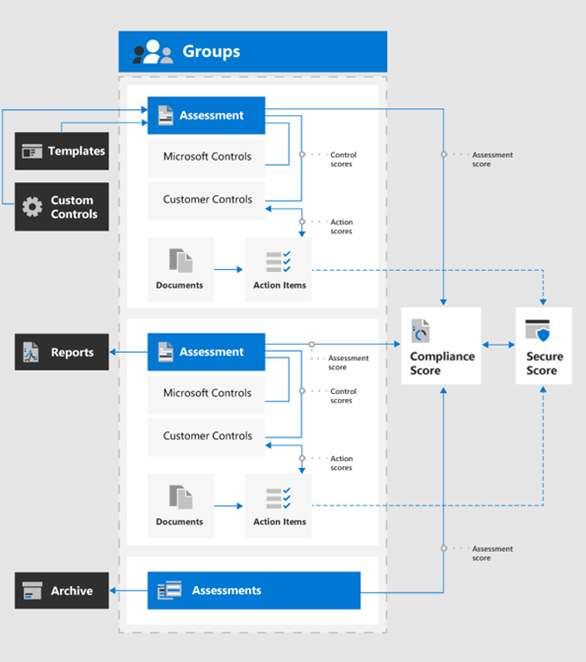
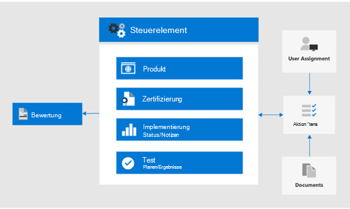

# Verwenden von Kompatibilitätsbewertung und Compliance-Manager zum Verwalten von Verbesserungs Aktionen

Microsoft Compliance Score and Compliance Manager kann zusammen verwendet werden, um Verbesserungen im Zusammenhang mit Datenschutzbestimmungen wie der [allgemeinen Datenschutzverordnung (dsgvo)](../compliance/gdpr.md), [California Consumer Protection Act CCPA)](../compliance/ccpa-faq.md), dem HIPAA-HITECH (US Health Care Privacy Act) und dem Brazil Data Protection Act (LGPD) zu verwalten. 

Dieser Artikel enthält Anleitungen für die Verwendung dieser Tools für Datenschutzzwecke.

>[!Note]
>Die im Compliance-Manager bereitgestellten Kundenaktionen sind Empfehlungen. Es liegt an Ihnen, die Wirksamkeit dieser Empfehlungen in ihren regulatorischen Umgebungen vor der Implementierung zu bewerten. Compliance-Manager-Empfehlungen sollten nicht als Garantie für die Compliance interpretiert werden.
>

## Geplante Updates für die Kompatibilitätsbewertung und den Compliance-Manager

[Compliance Score](../compliance/compliance-score.md) (currently in Preview) erfordert das Hinzufügen Ihrer Ziel Bewertungen für eine Verordnung (wie dsgvo) vom [Compliance-Manager](../compliance/compliance-manager-overview.md). In einer zukünftigen Version wird ein Großteil der Funktionen im Compliance-Manager in einem vereinheitlichten Konformitätsbewertungssystem zusammengeführt, wodurch die Notwendigkeit für mehrere Tools reduziert wird.

Hier sind die Tools für Ihr Abonnement, für die Sie sich anmelden müssen:

- [Kompatibilitätsbewertung im Microsoft Compliance Admin Center](https://compliance.microsoft.com/compliancescore)
- [Compliance-Manager im Microsoft Services Trust-Portal](https://servicetrust.microsoft.com/ComplianceManager/V3)

## Erste Schritte mit Compliance-Manager 

[Compliance-Manager](../compliance/working-with-compliance-manager.md) (derzeit in der Vorschau) ist ein kostenloses Workflow basiertes Risiko Bewertungstool im Microsoft Service Trust-Portal zum Verwalten von behördlichen Compliance-Aktivitäten im Zusammenhang mit Microsoft Cloud Services. Im Rahmen Ihres Microsoft 365-oder Azure Active Directory (Azure AD)-Abonnements unterstützt Sie Compliance-Manager beim Verwalten der behördlichen Compliance im Rahmen des Modells für die gemeinsame Verantwortung für Microsoft Cloud Services.

Während Sie Ihr allgemeines Konformitäts Ergebnis anzeigen und eine Reihe anderer Funktionen auf der Seite Compliance **Score** des Compliance Centers ausführen können, müssen Sie den Compliance-Manager über das Dienst Vertrauensstellungs Portal verwenden, um zunächst Assessments für ihre Datenschutzbestimmungen zu konfigurieren. Die Daten aus diesen Bewertungen werden in der Kompatibilitätsbewertung für die weitere Anzeige und Filterung angezeigt. 

Mithilfe der Compliance-Manager-Schnittstelle können Sie eine oder mehrere datenschutzbezogene Regulierungsvorlagen auswählen und diese gruppieren, um erforderliche Verbesserungs Aktionen in der Gruppe zu bewerten und nachzuverfolgen. Sie können auch Informationen zu den Steuerelementen anzeigen, die jede einzelne Verordnung für den Zieldienst aufruft, getrennt durch Microsoft vs. vom Kunden verwaltete Steuerelemente.

Die hier ausgewählten Bewertungen und Verbesserungen werden auch im Compliance Score im Microsoft Compliance Center angezeigt, wodurch die Wichtigkeit Ihrer anfänglichen Einrichtung im Compliance-Manager hervorgehoben wird. Diese Beziehungen werden in dieser Abbildung dargestellt.
 

Hier finden Sie die wichtigsten Schritte, die Sie beim Einstieg unterstützen.

### 1. Bewertungs Vorlagen

Im Compliance-Manager besteht der erste Schritt im Hinzufügen von Bewertungen, die speziell für die Datenschutzbestimmungen von Interesse sind, und Sie in eine definierte Gruppe "Datenschutzbestimmungen" einzubeziehen.

[Gruppen](../compliance/working-with-compliance-manager.md#groups) sind Container, die es Ihnen ermöglichen, Bewertungen zu organisieren und allgemeine Informations-und Workflowaufgaben Zwischenbewertungen mit denselben oder Verwandten, vom Kunden verwalteten Steuerelementen freizugeben. Wenn zwei unterschiedliche Bewertungen in derselben Gruppe das vom Kunden verwaltete Steuerelement gemeinsam nutzen, wird der Abschluss der Implementierungsdetails, des Tests und des Status für das Steuerelement in allen anderen Bewertungen in der Gruppe automatisch mit dem gleichen Steuerelement synchronisiert. Dadurch werden die zugewiesenen Aktionselemente für jedes Steuerelement in der gesamten Gruppe vereinheitlicht und Arbeits Duplikate reduziert. 

Sie können auch festlegen, dass Gruppen zum Organisieren verwendet werden. Assessments nach Jahr, Bereich, Konformitäts Standard oder anderen Gruppierungen, die Ihnen bei der Organisation Ihrer Compliance-arbeiten helfen.

### 2. Aktionselemente

Nachdem die Bewertungen hinzugefügt wurden, können Sie spezifische Aktionspunkte für jede Gruppe oder einzelne Regulierung anzeigen:

- **Liste der Verbesserungs Aktionen.** Navigieren Sie zur Liste Aktionselemente, und zeigen Sie die Verbesserungs Aktionen an, die für die in der Gruppe enthaltenen Regelungen zugeordnet sind. Viele Aktionen umfassen Regelungen, sodass ein einzelnes Listenelement mehrere Regeln darstellen kann. 
 
- **Filter für Verbesserungs Aktionen.** Für viele Datenschutzbestimmungen und Gruppen von Vorschriften kann die Liste der Verbesserungs Aktionen recht umfangreich sein, daher sollten Sie die Liste mithilfe der Dropdownliste Filter filtern. Wenn Sie beispielsweise "technische Steuerelemente" auswählen, wird die Liste auf nur diejenigen reduziert, die eine technische Implementierung in der Organisation haben, da viele der Aktionen mit administrativen Vorgängen in verschiedenen Aspekten des Unternehmens in Zusammenhangstehen, die auch im Compliance-Manager dokumentiert sind. In diesem Artikel werden wir uns auf technische Steuerelemente konzentrieren, daher wird dieser Filter Ansatz empfohlen.
 
- **Weitere Informationen und Überprüfung.** Für jede Aktion können Sie auf den Link klicken, um **Weitere**Informationen zu erhalten, in dem Sie mehr über die empfohlene Aktivität oder **Überprüfung**erfahren, mit der ein Formular geöffnet wird, in dem Sie Folgendes ausführen können:
 
   - Zuweisen der Aktion zu einem Benutzer in Ihrer Organisation zur Verwaltung
   - Verwalten von Dokumenten im Zusammenhang mit der Adressierung der Aktion
   - Angeben des Status für das Element
   - Angeben von Implementierungs-und Test Terminen
   - Aufzeichnen zusätzlicher Informationen, Implementierungs Notizen und Test Plan Notizen für die Betreff-Aktion
  
- **Nicht anwendbare Elemente als außerhalb des Bereichs.** Einige Verbesserungs Aktionen, die in der Liste Aktionselemente enthalten sind, gelten möglicherweise nicht für Ihre geplante Implementierung. Sie können angeben, dass Sie sich im Compliance-Manager außerhalb des Gültigkeitsbereichs befinden, und die Aktion und deren Beweise aus der Berechnung des Konformitäts Bewertungs Werts entfernen. 

Wenn Ihre Organisation beispielsweise für die Verwendung von Microsoft Managed Key gewählt wurde, kann die Empfehlung zur Verwendung des Kunden Schlüssels nicht auf Ihre Bereitstellung angewendet werden. In diesem Fall würde Ihre Organisation Sie als **nicht in den Geltungsbereich** der **Steuerungsaktionen** für die entsprechende regulatorische Vorlage markieren.
 
### 3. Steuerelemente-Info

Zeigen Sie für eine Bewertungs spezifische Ansicht die [Steuerelemente-Info](../compliance/compliance-manager-overview.md#controls) für jede Bewertungsgruppe an. Dadurch wird eine Bewertungs spezifische Ansicht bereitgestellt, bei der es sich um einen Unterschied zur Liste der Aktionselemente handelt, die eine technische steuerelementspezifische Ansicht bietet.
 

Navigieren Sie zur Liste **Steuerelemente** , und zeigen Sie die Liste der in-Scope-Dienste für die betreffende Verordnung an. 
 
Regelspezifische Steuerelement Gruppierungen listet die Aktionen auf, die vom Steuerelementbereich für jeden Dienstbereich bereitgestellt werden. Für jede Reihe von Aktionen bietet der Compliance-Manager weitere Informationen zur Aktion und schlägt möglicherweise Optionen zur Unterstützung der Organisation bei der Auswahl eines Kontroll Ansatzes vor oder stellt Ihnen Überprüfungsoptionen zur Verfügung.
 
Beachten Sie, dass diese Schnittstelle die Möglichkeit bietet, Details zur technischen Aktion sowie den Status der Aktionen im Zusammenhang mit dem Steuerelement sowie den zusätzlichen Kontext zu den Regeln anzuzeigen, mit denen die Aktion verknüpft ist.

### 4. Vorlagen Download

Für diejenigen, die mit der tabellenbasierten regulatorischen Analyse vertraut sind, besteht ein anderer Ansatz darin, die Vorlage für jede entsprechende Bewertung mithilfe der Auflistung Vorlagen herunterzuladen. Die heruntergeladenen Vorlagen Listen sowohl die regulatorischen als auch die technischen Kontrollinformationen für jede Vorlage auf und sind für bestimmte Rollen möglicherweise einfacher zu navigieren/Filtern und geschäftsspezifische Ansichten zu generieren.
 
Sie können auch eine neue, für Ihre Organisation angepasste Vorlage basierend auf einer vorhandenen Vorlage mithilfe der **Vorlage hinzufügen**hinzufügen. Dies erfordert, dass Sie eine Vorlage der Wahl (wie HIPAA/HITECH) herunterladen), dann für Ihre Zwecke ändern und wieder in das Compliance-Manager-Tool hochladen, wo es jetzt Bewertungen und Scoring ähnlich wie bei anderen Vorlagen und Bewertungen als Teil des allgemeinen Compliance-Managers und des Compliance Score-Toolsets vorantreibt.
 
>[!Tip]
>Wenn Sie sich mit einer großen Anzahl von Verordnungen oder überlappenden Verbesserungs Aktionen beschäftigen, sollten Sie die jeweiligen Vorlagen herunterladen und die Datensätze kombinieren, Verbesserungs Aktionen oder Steuerelementtypen entfernen, die für Ihre Organisation nicht gelten, und erneutes hochladen. Dies ist möglicherweise einfacher als das Navigieren in jedem Abschnitt mit Steuerelementinformationen und das Markieren der einzelnen Bereiche als außerhalb des Bereichs.
>

## Compliancebewertung

Nachdem die Bewertungen und Überprüfungs Spezifikationen im Compliance-Manager ausgeführt wurden, können Sie nun zum [Kompatibilitäts Bewertungs](../compliance/working-with-compliance-score.md) Tool wechseln und das Ergebnis und das Slice überprüfen und die Daten weiter würfeln, einschließlich nach Kontrollbereich.

Das Kompatibilitäts Bewertungstool im Microsoft 365 Compliance Admin Center bietet verschiedene Ansätze zum Überprüfen und Filtern von Kompatibilitätsdaten, die vom Compliance-Manager und verschiedenen Microsoft 365-Diensten abgerufen wurden. Dieses Tool wird automatisch aktualisiert, wenn verschiedene Konfigurationseinstellungen implementiert werden, und teilt Signale mit der Microsoft Secure Score, sodass viele Verbesserungs Aktionen in beiden Partituren angezeigt werden. 
 
Das Kompatibilitäts Ergebnis bietet Folgendes:

- Eine gesammelte Partitur, aufgeschlüsselt nach Microsoft und von Kunden verwalteten Steuerelementen
- Ein Rollup von Verbesserungs Aktionen und Abschlussstatus
- Eine Liste von Microsoft 365-Lösungen, die Ihre Punktzahl beeinflussen

### Berechnen der Konformitätsbewertung

Kurz gesagt, das Ergebnis wird basierend auf einer Kombination aus Microsoft-und Kunden verwalteten Steuerelement Implementierungen berechnet, wie im [Microsoft Compliance Score-Berechnungs Artikel](../compliance/compliance-score-methodology.md)ausführlicher erläutert.

Steuerelementen wird ein Bewertungs Wert zugewiesen, je nachdem, ob Sie obligatorisch oder diskretionäre sind und ob Sie vorbeugend, detektivisch oder Korrektiv sind. Diese stellen gemeinsam das Risiko dar, es nicht im Verhältnis zu anderen Steuerelementen zu implementieren.

Wie im Microsoft Compliance Score-Berechnungs Artikel dargestellt, erhalten vorbeugende Steuerelemente eine höhere Punktzahl als Detektive und Korrekturhilfen, und obligatorische Steuerelemente erhalten eine höhere Punktzahl als Ermessens Werte.
 
Beachten Sie, dass die Administrator-Benutzeroberfläche der Kompatibilitätsbewertung diese Parameter weder auflistet noch die Möglichkeit bietet, nach diesen Parametern zu filtern. Wenn Sie die zugeordnete Vorlage jedoch aus dem Compliance-Manager-Tool herunterladen, werden diese Parameter in dem resultierenden Dataset für die meisten Richtlinien aufgelistet.

Bei technischen Steuerelementen aktualisiert Compliance Score automatisch das Ergebnis der Verbesserungs Aktion, sobald das zugehörige Feature aktiviert ist. Andere, nicht technische Steuerungsaktionen &mdash; wie die betriebsbereiten oder in Bezug auf die Dokumentation &mdash; müssen manuell im Compliance-Manager-Tool im Trust-Portal für Dienste aufgezeichnet werden. 

Sie implementieren auch viele Verbesserungs Aktionen für andere Zwecke &mdash; , beispielsweise die Verwendung von Aufbewahrungs Bezeichnungen aus anderen Gründen als die Einhaltung von Datenschutzbestimmungen &mdash; , sodass Sie eine Gutschrift für die Verwendung einer solchen Funktion erhalten, auch wenn Sie für andere Zwecke verwendet wird und nicht Teil einer vorsätzlichen Compliance-Aktion ist.

Ihre Konformitätsbewertung sollte als relative Maßnahme betrachtet werden, um die Verbesserung im großen Maßstab zu verfolgen. Sie sollten keine perfekte Punktzahl verfolgen. 

### Zusätzliche Anleitung

Hier sind einige wichtige Tipps für die Verwendung von Compliance-Score und Compliance-Manager, damit Sie die Einhaltung von Datenschutzbestimmungen erreichen:

- Jede Datenschutzverordnung verfügt über eine Kombination aus technischen Kontrollen, Dokumentations Spezifikationen sowie Betriebs-, Prozess-und Berichtsanforderungen. Alle diese werden in den Verbesserungs Aktionen angezeigt. 

- Dieser Artikel konzentriert sich auf eine Teilmenge der technischen Steuerelemente, die für den Datenschutz im Compliance-Manager und das Kompatibilitäts Ergebnis angegeben sind. Weitere Informationen zu nicht technischen administrativen Steuerelementen finden Sie im Compliance-Manager-Tool und in der [Dokumentation](../compliance/working-with-compliance-score.md) .

- Wenn Sie die Ansicht von Verbesserungs Aktionen auf Ihren Interessenbereich konzentrieren möchten, können Sie auf der Registerkarte **Lösungen** im Administrator der Kompatibilitätsbewertung nach Aktionstyp filtern.

- Die relative Wichtigkeit und Priorität von Verbesserungs Aktionen, die in Compliance Score identifiziert werden, sollten als Teil einer umfassenderen Risikoprüfung zusammen mit dem Datenschutzrisiko betrachtet werden, das Sie in Ihrer Organisation für die Verwaltung bestimmt haben. 

- Wenn Sie eine globale Organisation sind und dem Compliance-Manager mehrere Datenschutz-Regulierungsvorlagen als Bewertungen hinzugefügt werden, kombiniert Compliance Score jedes zutreffende in einer Feldauflistung für jede Verbesserungs Aktion.
 
- Selbst bei der Aggregation von Verbesserungs Aktionen über mehrere regulatorische Anforderungen hinweg werden, wenn die Regel Bewertungs Vorlagen für dsgvo, LGPD, CCPA und HIPAA-HITECH ausgewählt werden, beispielsweise fast 400 Verbesserungs Aktionen in der Kompatibilitätsbewertung aufgeführt. Um diese lange Liste besser in Angriff zu nehmen, verwenden Sie den Filter zur Verbesserung der Aktion, um die Ergebnismenge auf eine besser verwaltbare Liste zu reduzieren.

- Der categories-Filter bietet eine Möglichkeit zum Filtern von Verbesserungs Aktionen durch logische Gruppierung, die die nachverfolgen, verhindern, schützen, beibehalten und untersuchen von Artikeln in dieser Gesamtlösung an ausrichten. 

- Einige der Steuerelemente, die in den Verbesserungs Aktionen aufgeführt sind, sind möglicherweise direkter an einen bestimmten Regelungs Artikel gebunden, während andere Steuerelemente indirekt mit dem Geist einer Regulierung in Verbindung gebracht werden und oft nur Dinge sind, die Sie trotzdem in Betracht nehmen sollten.

