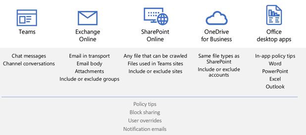
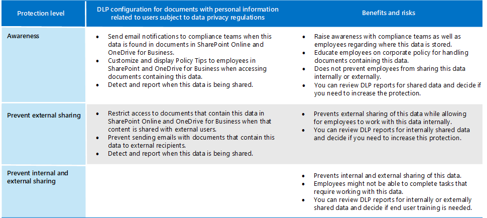

# Datenschutzbestimmungen unterliegende Informationen schützenProtect information subject to data privacy regulation

In Ihrem Abonnement können eine Reihe von Informationsschutzsteuerelementen verwendet werden, um die Anforderungen und Vorschriften zur Einhaltung der Datenschutzbestimmungen zu erfüllen.A number of information protection controls can be employed in your subscription to help address data privacy compliance needs and regulations. Dazu gehören die Allgemeine Datenschutzverordnung (DSGVO), HIPAA-HITECH (us Health Care Privacy Act), California Consumer Protection Act (CCPA) und das Brazil Data Protection Act (LGPD).These include General Data Protection Regulation (GDPR), HIPAA-HITECH (the United States health care privacy act), California Consumer Protection Act (CCPA), and the Brazil Data Protection Act (LGPD).

Diese Steuerelemente befinden sich in den folgenden Lösungsbereichen:These controls are within following solution areas:

- VertraulichkeitsbezeichnungenSensitivity labels
- Verhinderung von Datenverlusten (Data Loss Prevention, DLP)Data loss prevention (DLP)
- Office-Nachrichtenverschlüsselung (Office Message Encryption, OME)Office message encryption (OME)
- Teams- und WebsitezugriffssteuerelementeTeams and sites access controls

>[!Note]
>Diese Lösung beschreibt Sicherheits- und Compliancefeatures zum Schutz von Informationen, die den Datenschutzbestimmungen unterliegen.This solution describes security and compliance features to protect information subject to data privacy regulations. Eine vollständige Liste der Sicherheitsfeatures in Microsoft 365 finden Sie [in Microsoft 365 Sicherheitsdokumentation](../security/index.yml).For a complete list of security features in Microsoft 365, see [Microsoft 365 security documentation](../security/index.yml). Eine vollständige Liste der Compliancefeatures in Microsoft 365 finden Sie [in Microsoft 365 Compliancedokumentation](../compliance/index.yml).For a complete list of compliance features in Microsoft 365, see [Microsoft 365 compliance documentation](../compliance/index.yml).
>

## Datenschutzbestimmungen, die Auswirkungen auf Die Kontrollen zum Schutz von Informationen habenData privacy regulations that impact information protection controls

Im Folgenden finden Sie eine Beispielliste der Datenschutzbestimmungen, die sich auf Steuerelemente zum Schutz von Informationen beziehen können:Here is a sample list of data privacy regulations that may relate to information protection controls:

- Artikel 5(1)(f)) der DSGVOGDPR Article 5(1)(f))
- Artikel zur DSGVO (32)(1)(a)GDPR Article (32)(1)(a)
- LGPD Artikel 46LGPD Article 46
- HIPAA-HITECH (45 CFR 164.312(e)(1))HIPAA-HITECH (45 CFR 164.312(e)(1))
- HIPAA-HITECH (45 C.F.R.HIPAA-HITECH (45 C.F.R. 164.312(e)(2)(ii))164.312(e)(2)(ii))

Weitere Informationen [zu den](information-protection-deploy-assess.md) oben genannten Themen finden Sie im Artikel zum Bewerten von Datenschutzrisiken und Identifizieren vertraulicher Elemente.See the [assess data privacy risks and identify sensitive items article](information-protection-deploy-assess.md) for more information on each of the above.

Datenschutzbestimmungen für den Informationsschutz empfehlen:Data privacy regulations for information protection recommend:

- Schutz vor Verlust oder unbefugtem Zugriff, Nutzung und/oder Übertragung.Protection against loss or unauthorized access, usage and/or transmission.
- Risikobasierte Anwendung von Schutzmechanismen.Risk-based application of protective mechanisms.
- Verwendung der Verschlüsselung, sofern erforderlich.Use of encryption where appropriate.

Ihre Organisation möchte die Inhalte Microsoft 365 anderen Zwecken schützen, z. B. aus anderen Complianceanforderungen oder aus geschäftlichen Gründen.Your organization may also want to protect Microsoft 365 content for other purposes, such as other compliance needs or for business reasons. Die Einrichtung Ihres Informationsschutzschemas für den Datenschutz sollte im Rahmen der allgemeinen Planung, Implementierung und Verwaltung des Informationsschutzes durchgeführt werden.Establishing your information protection scheme for data privacy should be done as part of overall information protection planning, implementation, and management.

Damit Sie mit einem Informationsschutzschema in Microsoft 365 beginnen können, enthält der folgende Abschnitt eine kurze Liste der zugehörigen Funktionen und Verbesserungsmaßnahmen für Microsoft 365.To help you get started with an information protection scheme in Microsoft 365, the following section includes a short list of related capabilities and improvement actions for Microsoft 365. Die Liste enthält Funktionen und Verbesserungsmaßnahmen, die für Datenschutzbestimmungen gelten.The list includes capabilities and improvement actions that are applicable to data privacy regulations. Die Liste enthält jedoch keine älteren Technologien, wenn es eine neuere Funktion gibt, die die ältere weitgehend ersetzt.However, the list doesn't include older technologies if there's a newer capability that largely supersedes the older one. Beispielsweise ist die Verwaltung von Informationsrechten (Information Rights Management, IRM) für SharePoint und OneDrive nicht in der Liste enthalten, aber Vertraulichkeitsbezeichnungen sind enthalten.For example, Information Rights Management (IRM) for SharePoint and OneDrive is not included in the list but sensitivity labels are included.

## Verwalten des Informationsschutzes in Microsoft 365Managing information protection in Microsoft 365

Microsoft [Information Protection-Lösungen](../compliance/information-protection.md) umfassen eine Reihe von integrierten Funktionen Microsoft 365, Microsoft Azure und Microsoft Windows.Microsoft [information protection solutions](../compliance/information-protection.md) include a number of integrated capabilities across Microsoft 365, Microsoft Azure, and Microsoft Windows. Zu Microsoft 365 Informationsschutzlösungen gehören:In Microsoft 365, information protection solutions include:

- [Dienstverschlüsselung mit KundenschlüsselService encryption with Customer Key](../compliance/customer-key-overview.md)
- [Typen vertraulicher Informationen](../compliance/sensitive-information-type-entity-definitions.md) (beschrieben im Artikel "Bewerten von Datenschutzrisiken und Identifizieren [vertraulicher Elemente")](information-protection-deploy-assess.md)[Sensitive information types](../compliance/sensitive-information-type-entity-definitions.md) (described in the [assess data privacy risks and identify sensitive items article](information-protection-deploy-assess.md))
- [VertraulichkeitsbezeichnungenSensitivity labels](../compliance/sensitivity-labels.md) 
  - Dienst-/ContainerebeneService/container-level
  - Clientseitige/InhaltsebeneClient-side/content-level
  - Automatisch für ruhende Daten in SharePoint und OneDriveAutomated for data-at-rest in SharePoint and OneDrive
- Verhinderung von Datenverlust (Data Loss Prevention, DLP)Data Loss Prevention (DLP)
- [Microsoft 365 Verhinderung von EndpunktdatenverlustenMicrosoft 365 Endpoint data loss prevention](../compliance/endpoint-dlp-learn-about.md)
- [Office 365-Nachrichtenverschlüsselung neue Funktionen (OME)](../compliance/ome.md) und OME [Advanced Message Encryption](../compliance/ome-advanced-message-encryption.md)[Office 365 Message Encryption new capabilities (OME)](../compliance/ome.md) and OME [Advanced Message Encryption](../compliance/ome-advanced-message-encryption.md)

Darüber hinaus sind Der Schutz auf Website- und Bibliotheksebene wichtige Mechanismen, die in ein beliebiges Schutzschema mit ein-/ausggg.In addition, site and library level protection are important mechanisms to include in any protection scheme.

Weitere Informationen zu anderen Informationsschutzfunktionen außerhalb Microsoft 365 finden Sie unter:For information on other information protection capabilities outside of Microsoft 365, see:

- [Microsoft Cloud Application Security (MCAS)Microsoft Cloud Application Security (MCAS)](/cloud-app-security/)
- [Azure Information ProtectionAzure Information Protection](/azure/information-protection/what-is-information-protection)
- [Microsoft Endpoint ManagerMicrosoft Endpoint Manager](https://www.microsoft.com/microsoft-365/microsoft-endpoint-manager)
- [Windows Information ProtectionWindows Information Protection](/windows/security/information-protection/windows-information-protection/protect-enterprise-data-using-wip)

## VertraulichkeitsbezeichnungenSensitivity labels

Mit Vertraulichkeitsbezeichnungen aus dem Microsoft Information Protection-Framework können Sie die Daten Ihrer Organisation klassifizieren und schützen, ohne die Produktivität der Benutzer und deren Zusammenarbeit zu beeinträchtigen.Sensitivity labels from the Microsoft Information Protection framework let you classify and protect your organization's data without hindering the productivity of users and their ability to collaborate.

> [!div class="mx-imgBorder"]
> 

### Voraussetzungen für VertraulichkeitsbezeichnungenPrerequisites for sensitivity labels

Führen Sie diese Aktivitäten aus, bevor Sie eine der unten hervorgehobenen Funktionen für Vertraulichkeitsbezeichnungen implementieren:Complete these activities prior to implementing any of the sensitivity label-based capabilities highlighted below:

1. Verstehen Sie Folgendes:Understand the following:
   - **Geschäftsanforderungen.****Business requirements.** Legen Sie die geschäftlichen Gründe für die Anwendung von Vertraulichkeitsbezeichnungen in Ihrem Unternehmen fest.Establish the business reasons for applying sensitivity labels in your enterprise. Beispielsweise ihre Datenschutzanforderungen für den Informationsschutz.For example, your data privacy requirements for information protection.
   - **Vertraulichkeitsbezeichnungsfunktionen.****Sensitivity label capabilities.** Die Vertraulichkeitsbezeichnung kann komplex werden. Lesen Sie daher unbedingt die Dokumentation zu [Vertraulichkeitsbezeichnungen,](../compliance/sensitivity-labels.md) bevor Sie beginnen.Sensitivity labeling can get complex, so make sure to read the [sensitivity labels documentation](../compliance/sensitivity-labels.md) before getting started.
   - **Wichtige Dinge, die Sie sich merken sollten** Vertraulichkeitsbezeichnungen werden im Microsoft Compliance Admin Center verwaltet, die Ziel- und Anwendungsoptionen variieren jedoch erheblich.**Key things to remember** Sensitivity labels are managed in the Microsoft Compliance admin center but the targeting and application options vary significantly.
      - Es gibt Vertraulichkeitsbezeichnungen für Websites, Gruppen und Teams containerebene (die Einstellungen gelten nicht für Inhalte innerhalb des Containers).There are sensitivity labels for sites, groups, and Teams at the container level (the settings do not apply to content inside the container). Diese werden für Benutzer und Gruppen veröffentlicht, die sie anwenden, wenn eine Website, eine Gruppe oder ein Team bereitgestellt wird.These are published to users and groups who apply them when a site, group or Team is provisioned.
      - Es gibt Vertraulichkeitsbezeichnungen für aktive Inhalte.There are sensitivity labels for active content. Diese werden auch für Benutzer oder Gruppen veröffentlicht, die sie entweder manuell anwenden, oder sie werden automatisch angewendet, wenn:These are also published to user or groups, who either manually apply them, or they get applied automatically when:
        - Die Datei wird geöffnet/bearbeitet/gespeichert, entweder auf dem Desktop des Benutzers oder auf SharePoint Website.The file is opened/edited/saved, either to the user’s desktop or a SharePoint site.
        - Eine E-Mail wird verfasst und gesendet.An email is drafted and sent.
      - Es gibt Vertraulichkeitsbezeichnungen für die automatische Anwendung auf dateien in SharePoint und OneDrive zusätzlich zu E-Mails, die über die Exchange.There are sensitivity labels for automatic application to files at rest in SharePoint and OneDrive in addition to emails in transit through Exchange. Diese gelten entweder für alle Websites oder für bestimmte Websites und gelten automatisch für die dateien, die in diesen Umgebungen im Ruhe sind.These are targeted to either all sites or specific ones and automatically apply to the files at rest in these environments.

2. Rationalisieren der aktuellen Vertraulichkeitsbezeichnung mit früheren oder alternativen MethodenRationalize current sensitivity labeling with past or alternative methods

   - Azure Information ProtectionAzure Information Protection

      Das aktuelle Vertraulichkeitsbezeichnungsschema muss möglicherweise mit jeder vorhandenen Azure Information Protection-Bezeichnungsimplementierungsimplementierung abgestimmt werden. The current sensitivity labeling scheme may need to be reconciled with any existing [Azure Information Protection](../compliance/sensitivity-labels.md#sensitivity-labels-and-azure-information-protection) labeling implementation.
   - OMEOME

      Wenn Sie planen, moderne Vertraulichkeitsbezeichnungen für den E-Mail-Schutz zu verwenden, und vorhandene E-Mail-Verschlüsselungsmethoden wie OME vorhanden sind, können sie koexistent sein, Aber Sie sollten die Szenarien verstehen, in denen beides angewendet werden sollte.If you are planning to use modern sensitivity labeling for email protection and existing email encryption methods like OME are in place, they can co-exist, but you should understand the scenarios in which either should be applied. Siehe [Office 365-Nachrichtenverschlüsselung neue Funktionen (OME),](#office-365-message-encryption-ome-new-capabilities)die eine Tabelle enthält, in der der moderne Schutz von Vertraulichkeitsbezeichnungen mit OME-basiertem Schutz verglichen wird.See [Office 365 Message Encryption new capabilities (OME)](#office-365-message-encryption-ome-new-capabilities), which includes a table comparing modern sensitivity label-type protection with OME-based protection.

3. Planen der Integration in ein umfassenderes Informationsschutzsystem.Plan for integration into a broader information protection scheme. Neben der Koexistenz mit OME können Vertraulichkeitsbezeichnungen neben funktionen wie Microsoft 365 Verhinderung von Datenverlust (Data Loss Prevention, DLP) und Microsoft Cloud App Security.On top of coexistence with OME, sensitivity labels can be used along-side capabilities like Microsoft 365 data loss prevention (DLP) and Microsoft Cloud App Security. Weitere [Informationen finden Sie unter Microsoft Information Protection in Microsoft 365,](../compliance/information-protection.md) um Ihre Datenschutzziele zu erreichen.See [Microsoft Information Protection in Microsoft 365](../compliance/information-protection.md) to achieve your data privacy-related information protection goals.

4. Entwickeln sie ein Klassifizierungs- und Steuerungsschema für Vertraulichkeitsbezeichnungen.Develop a sensitivity label classification and control scheme. Weitere [Informationen finden Sie unter Taxonomie von Datenklassifizierung und Vertraulichkeitsbezeichnungen.](https://aka.ms/dataclassificationwhitepaper)See [Data Classification and Sensitivity Label Taxonomy](https://aka.ms/dataclassificationwhitepaper).

### Allgemeine HinweiseGeneral guidance

1. **Schemadefinition.****Schema definition.** Bevor Sie technische Funktionen zum Anwenden von Bezeichnungen und Schutz verwenden, arbeiten Sie in Ihrer Organisation an der Definition eines Klassifizierungsschemas.Before using technical capabilities to apply labels and protection, work across your organization to define a classification schema. Möglicherweise verfügen Sie bereits über ein Klassifizierungsschema, das das Hinzufügen personenbezogener Daten erleichtert.You might already have a classification schema, which makes it easier to add personal data. 
2. **Erste Schritte.****Getting started.** Entscheiden Sie zunächst über die Anzahl und namen der zu implementierende Bezeichnungen.Begin by deciding on the number and names of labels to implement. Machen Sie diese Aktivität, ohne sich Gedanken darüber zu machen, welche Technologie verwendet werden soll und wie Bezeichnungen angewendet werden.Do this activity without worrying about which technology to use and how labels will be applied. Wenden Sie dieses Schema universell in Ihrer gesamten Organisation an, einschließlich Daten, die sich lokal und in anderen Clouddiensten befinden.Apply this schema universally throughout your organization, including data that resides on premises and in other cloud services.
3. **Zusätzliche Empfehlungen** Berücksichtigen Sie beim Entwerfen und Implementieren von Richtlinien, Bezeichnungen und Bedingungen die folgenden Empfehlungen:**Additional recommendations** When designing and implementing policies, labels, and conditions, consider following these recommendations:

   - **Verwenden Sie vorhandenes Klassifikationsschema (sofern vorhanden).****Use existing classification schema (if any).** Viele Organisationen verwenden die Datenklassifizierung bereits in einer bestimmten Form.Many organizations already are using data classification in some form. Werten Sie das vorhandene Bezeichnungsschema sorgfältig aus, und verwenden Sie es nach Möglichkeit wie folgt.Carefully evaluate the existing label schema and if possible, use it as is. Die Verwendung vertrauter Bezeichnungen, die für Ihre Endbenutzer erkennbar sind, wird die Akzeptanz an sich nen.Using familiar labels that are recognizable to your end-users will drive adoption.
   - **Starten Sie klein.****Start small.** Die Anzahl der Bezeichnungen, die Sie erstellen können, ist praktisch nicht begrenzt.There is virtually no limit to the number of labels that you can create. Eine große Anzahl von Bezeichnungen und Unterbezeichnungen kann jedoch die Einführung verlangsamen.However, large numbers of labels and sub-labels can slow adoption.
   - **Verwenden Sie Szenarien und Anwendungsfälle.****Use scenarios and use cases.** Identifizieren Sie häufige Anwendungsfälle in Ihrer Organisation, und verwenden Sie Szenarien, die aus den Datenschutzbestimmungen abgeleitet sind, denen Sie unterliegen.Identify common use cases within your organization and use scenarios derived from the data privacy regulations to which you are subject. Überprüfen Sie, ob die envisionierte Bezeichnungs- und Klassifizierungskonfiguration in der Praxis funktioniert.Verify if the envisioned label and classification configuration will work in practice.
   - **Stellen Sie jede Anforderung für eine neue Bezeichnung in Frage.****Question every request for a new label.** Benötigt jedes Szenario oder jeden Fall wirklich eine neue Bezeichnung, oder können Sie die bereits vorhandenen Bezeichnungen verwenden?Does every scenario or use case really need a new label or can you use what you already have? Die Anzahl der Bezeichnungen auf ein Minimum zu beschränken, verbessert die Akzeptanz.Keeping the number of labels to a minimum improves adoption.
   - **Verwenden Sie Unterbezeichnungen für wichtige Abteilungen.****Use sub-labels for key departments.** Einige Abteilungen haben spezielle Anforderungen, die bestimmte Bezeichnungen erfordern.Some departments will have specific needs that require specific labels. Definieren Sie diese Bezeichnungen als Unterbezeichnungen für eine vorhandene Bezeichnung, und erwägen Sie die Verwendung bereichsbenutzerdefinierter Richtlinien, die Benutzergruppen anstelle von global zugewiesen sind.Define these labels as sub-labels to an existing label and consider using scoped policies that are assigned to user groups instead of globally.
   - **Berücksichtigen Sie Bereichsrichtlinien.****Consider scoped policies.** Richtlinien, die auf Teilmengen von Benutzern ausgerichtet sind, verhindern eine Bezeichnungsüberladung.Policies targeted at subsets of users will prevent label overload. Eine bereichsspezifische Richtlinie ermöglicht das Zuweisen von rollen- oder abteilungsspezifischen Bezeichnungen oder Unterbezeichnungen nur mitarbeitern, die für diese bestimmte Abteilung arbeiten.A scoped policy enables assigning role or department specific labels or sub-labels to just employees that work for that specific department. 
   - **Verwenden Sie aussagekräftige Bezeichnungsnamen.****Use meaningful label names.** Versuchen Sie nicht, Jargon, Standards oder Akronyme als Bezeichnungsnamen zu verwenden.Try not to use jargon, standards, or acronyms as label names. Versuchen Sie, Namen zu verwenden, die mit dem Endbenutzer schwingen, um die Akzeptanz zu verbessern.Try to use names that resonate with the end user to improve adoption. Anstatt Bezeichnungen wie PII, PCI, HIPAA, LBI, MBI und HBI zu verwenden, sollten Sie Namen wie Non-Business, Public, General, Confidential und Highly Confidential berücksichtigen.Instead of using labels like PII, PCI, HIPAA, LBI, MBI and HBI, consider names like Non-Business, Public, General, Confidential and Highly Confidential.

### Erstellen und Bereitstellen von Vertraulichkeitsbezeichnungen für Websites, Gruppen und TeamsCreate and deploy sensitivity labels for sites, groups, and teams

Wenn Sie [Vertraulichkeitsbezeichnungen](../compliance/sensitivity-labels-teams-groups-sites.md) im Microsoft 365 erstellen, können Sie sie jetzt auf die folgenden Container anwenden:When you create [sensitivity labels](../compliance/sensitivity-labels-teams-groups-sites.md) in the Microsoft 365 compliance center, you can now apply them to these containers:

- Microsoft Teams WebsitesMicrosoft Teams sites
- Microsoft 365 (früher Office 365 Gruppen)Microsoft 365 groups (formerly Office 365 groups)
- SharePoint-WebsitesSharePoint sites

Verwenden Sie die folgenden Bezeichnungseinstellungen zum Schutz von Inhalt in diesen Containern:Use the following label settings to help protect the content in those containers:

- Datenschutz (öffentlich oder privat) von Microsoft 365 gruppengebundenen websites TeamsPrivacy (public or private) of Microsoft 365 group-connected Teams sites
- Zugriff externer BenutzerExternal user access
- Zugriff von nicht verwalteten Geräten ausAccess from unmanaged devices

Um die externe Freigabe für Container zu verhindern, die zum Speichern von Inhalten mit vertraulichen personenbezogenen Daten verwendet werden, markieren Sie die Dateien, die die Daten enthalten, als privat und erfordern verwaltete Geräte.For data privacy, to prevent external sharing for containers that will be used for storing content with sensitive personal data, mark the files containing the data as private, and require managed devices.

### Erstellen und Bereitstellen von Vertraulichkeitsbezeichnungen für InhalteCreate and deploy sensitivity labels for content

Mit Vertraulichkeitsbezeichnungen, die auf Dateien angewendet werden, können Sie ihre Inhalte verschlüsseln, den Inhalt mit wasserzeichen versehen und andere Steuerelemente für Office-Anwendungsinhalte definieren, einschließlich Outlook und Office im Web.Sensitivity labels applied to files allow you to encrypt their content, watermark the content, and define other controls for Office applications content, including Outlook and Office on the web.

Wenn Sie mit dem Schutz der Daten Ihrer Organisation mit Vertraulichkeitsbezeichnungen beginnen möchten:When you're ready to start protecting your organization's data with sensitivity labels:

1. **Erstellen Sie die Bezeichnungen.****Create the labels.** Erstellen und benennen Sie Ihre Vertraulichkeitsbezeichnungen gemäß der Klassifizierungstaxonomie Ihrer Organisation für unterschiedliche Vertraulichkeitsstufen von Inhalten.Create and name your sensitivity labels according to your organization's classification taxonomy for different sensitivity levels of content. Weitere Informationen zum Entwickeln einer Klassifikationstaxonomie finden Sie im Whitepaper zur Datenklassifizierung und [Vertraulichkeitsbezeichnungstaxonomie](https://aka.ms/dataclassificationwhitepaper).For more information on developing a classification taxonomy, see the [Data Classification and Sensitivity Label Taxonomy white paper](https://aka.ms/dataclassificationwhitepaper).
2. **Legen Sie fest, wozu jede einzelne Bezeichnung dient.****Define what each label can do.** Konfigurieren Sie die Schutzeinstellungen, die mit den einzelnen Bezeichnungen verknüpft werden sollen.Configure the protection settings you want associated with each label. Beispielsweise möchten Sie, dass inhalte mit niedriger Vertraulichkeit (z. B. eine Bezeichnung "Allgemein") nur eine Kopf- oder Fußzeile angewendet werden, während inhalte mit höherer Vertraulichkeit (z. B. eine Bezeichnung "Vertraulich") ein Wasserzeichen haben und die Verschlüsselung aktiviert sein sollten.For example, you might want lower sensitivity content (such as a "General" label) to have just a header or footer applied, while higher sensitivity content (such as a "Confidential" label) should have a watermark and have encryption enabled.
3. **Veröffentlichen Sie die Bezeichnungen.****Publish the labels.** Nachdem Sie die Vertraulichkeitsbezeichnungen konfiguriert haben, können Sie sie mithilfe einer Bezeichnungsrichtlinie veröffentlichen.After your sensitivity labels are configured, publish them by using a label policy. Legen Sie fest, welche Benutzer und Gruppen die Bezeichnungen haben sollen und welche Richtlinieneinstellungen verwendet werden.Decide which users and groups should have the labels and what policy settings to use. Eine einzelne Bezeichnung kann wiederverwendbar werden.A single label is reusable. Sie definieren ihn einmal und können ihn dann in mehrere Bezeichnungsrichtlinien für verschiedene Benutzer einbe fügen.You define it once and then you can include it in several label policies assigned to different users.

Nachdem Sie Vertraulichkeitsbezeichnungen aus dem Microsoft 365 Compliance Center veröffentlicht haben, werden sie in [Office-Apps](../compliance/sensitivity-labels-office-apps.md) angezeigt, damit Benutzer Inhalte beim Erstellen oder Bearbeiten klassifizieren und schützen können.Once you publish sensitivity labels from the Microsoft 365 compliance center, they start to appear in [Office apps](../compliance/sensitivity-labels-office-apps.md) for users to classify and protect content as it's created or edited.

Für den Datenschutz wenden Sie manuell eine Vertraulichkeitsbezeichnung mit Verschlüsselung und anderen Regeln auf E-Mails oder Inhalte an, die vertrauliche persönliche Informationen enthalten.For data privacy, you manually apply a sensitivity label with encryption and other rules to email or content containing sensitive personal information.

>[!Note]
>Vertraulichkeitsbezeichnungen mit aktivierter Verschlüsselung, die auf E-Mails angewendet werden, haben überlappende Funktionen mit OME.Sensitivity labels with encryption enabled applied to email have some overlapping functionality with OME. Weitere [Informationen finden Sie unter Vergleich sicherer E-Mail-Szenarien mit OME und Vertraulichkeitsbezeichnungen.](#secure-email-scenarios-comparison-with-ome-and-sensitivity-labels)See [Secure email scenarios comparison with OME and sensitivity labels](#secure-email-scenarios-comparison-with-ome-and-sensitivity-labels).

### Clientseitige automatische Bezeichnung, wenn Benutzer Dokumente bearbeiten oder E-Mails verfassenClient-side auto-labeling when users edit documents or compose emails

Wenn Sie eine Vertraulichkeitsbezeichnung  erstellen, können Sie diese Bezeichnung automatisch Inhalten einschließlich E-Mails zuweisen, wenn sie den von Ihnen angegebenen Bedingungen entspricht.When you create a sensitivity label, you can [automatically assign that label](../compliance/apply-sensitivity-label-automatically.md) to content including email when it matches conditions that you specify.

Die Möglichkeit, Vertraulichkeitsbezeichnungen automatisch auf Inhalte anzuwenden, ist aus den folgenden Gründen wichtig:The ability to apply sensitivity labels to content automatically is important because:

- Sie müssen die Benutzer nicht schulen, damit sie alle Ihre Klassifizierungen kennen.You don't need to train your users when to use each of your classifications.
- Sie müssen sich nicht darauf verlassen, dass die Benutzer alle Inhalte richtig klassifizieren.You don't need to rely on users to classify all content correctly.
- Benutzer müssen nicht mehr über Ihre Richtlinien Bescheid wissen, sondern können sich stattdessen auf ihre Arbeit konzentrieren.Users no longer need to know about your policies—they can instead focus on their work.

Die automatische Bezeichnung unterstützt das Empfehlen einer Bezeichnung für Benutzer sowie das automatische Anwenden einer Bezeichnung.Auto-labeling supports recommending a label to users, as well as automatically applying a label. In beiden Fällen entscheidet der Benutzer aber, ob die Bezeichnung angenommen oder abgelehnt werden soll, um die richtige Bezeichnung von Inhalten zu gewährleisten.But in both cases, the user decides whether to accept or reject the label, to help ensure the correct labeling of content.

Diese clientseitige Beschriftung hat nur minimale Verzögerungen für Dokumente, da die Bezeichnung noch vor dem Speichern des Dokuments angewendet werden kann.This client-side labeling has minimal delay for documents because the label can be applied even before the document is saved. Allerdings unterstützen nicht alle Client-Apps die automatische Bezeichnung.However, not all client apps support auto-labeling. Diese Funktion wird vom Azure Information Protection Unified Labeling Client und einigen Versionen von [Office unterstützt.](../compliance/sensitivity-labels-office-apps.md#support-for-sensitivity-label-capabilities-in-apps)This capability is supported by the Azure Information Protection unified labeling client, and [some versions of Office apps](../compliance/sensitivity-labels-office-apps.md#support-for-sensitivity-label-capabilities-in-apps).

Konfigurationsanweisungen finden Sie unter Konfigurieren der automatischen Bezeichnung [für Office Apps.](../compliance/sensitivity-labels-office-apps.md#support-for-sensitivity-label-capabilities-in-apps)For configuration instructions, see [How to configure auto-labeling for Office apps](../compliance/sensitivity-labels-office-apps.md#support-for-sensitivity-label-capabilities-in-apps).

Für den Datenschutz wenden Sie Vertraulichkeitsbezeichnungen automatisch auf Inhalte an, die vertrauliche persönliche Informationen enthalten.For data privacy, you auto-apply sensitivity labels for content containing sensitive personal information.

### Dienstseitige automatische Bezeichnung, wenn Inhalte bereits gespeichert werdenService-side auto-labeling when content is already saved

Diese Methode wird Autoklassifizierung mit Vertraulichkeitsbezeichnungen genannt.This method is referred to as auto classification with sensitivity labels. Sie können auch hören, dass es als automatische Bezeichnung für ruheende Daten (für Dokumente in SharePoint und OneDrive) und Daten während der Übertragung (für E-Mails, die von Exchange gesendet oder empfangen werden) bezeichnet wird.You might also hear it referred to as auto-labeling for data at rest (for documents in SharePoint and OneDrive) and data in transit (for email that is sent or received by Exchange). Für Exchange enthält es keine E-Mails in postfächern im Ruhe.For Exchange, it doesn't include emails in mailboxes at rest.
 
Da diese Bezeichnung vom Dienst selbst und nicht von der Benutzeranwendung angewendet wird, müssen Sie sich keine Gedanken darüber machen, welche Apps Benutzer haben und welche Version.Because this labeling is applied by the service itself rather than by user application, you don't need to worry about what apps users have and what version. Dies hat zur Folge, dass diese Funktion sofort in ihrer gesamten Organisation zur Verfügung steht, und sie eignet sich für Bezeichnungen jeder Größe.As a result, this capability is immediately available throughout your organization and suitable for labeling at scale. Richtlinien zum automatischen Bezeichnen unterstützen die empfohlene Bezeichnung nicht, da der Benutzer nicht mit dem Bezeichnungsprozess interagiert.Auto-labeling policies don't support recommended labeling because the user doesn't interact with the labeling process. Stattdessen führt der Administrator die Richtlinien im Simulationsmodus aus, um sicherzustellen, dass der Inhalt korrekt bezeichnet wird, bevor die Bezeichnung tatsächlich angewendet wird.Instead, the administrator runs the policies in simulation mode to help ensure the correct labeling of content before actually applying the label.

Konfigurationsanweisungen finden Sie unter [Konfigurieren automatischer Bezeichnungsrichtlinien](../compliance/apply-sensitivity-label-automatically.md#how-to-configure-auto-labeling-policies-for-sharepoint-onedrive-and-exchange)für SharePoint, OneDrive und Exchange .For configuration instructions, see [How to configure auto-labeling policies for SharePoint, OneDrive, and Exchange](../compliance/apply-sensitivity-label-automatically.md#how-to-configure-auto-labeling-policies-for-sharepoint-onedrive-and-exchange).

Push-Vertraulichkeitsbezeichnungen für die automatische Verschlüsselung von Inhalten mit vertraulichen personenbezogenen Informationen für den Datenschutz auf Websites, die betroffen sind.For data privacy within sites of concern, push sensitivity labels for automatic encryption of content containing sensitive personal information.

## Verhinderung von DatenverlustData loss prevention 

Sie können die Verhinderung von Datenverlust [(Data Loss Prevention, DLP)](../compliance/dlp-learn-about-dlp.md) in Microsoft 365 verwenden, um riskante, unbeabsichtigte oder unangemessene Freigaben zu erkennen, zu warnen und zu blockieren, z. B. die freigabe von Daten, die persönliche Informationen enthalten, sowohl intern als auch extern.You can use [data loss prevention (DLP)](../compliance/dlp-learn-about-dlp.md) in Microsoft 365 to detect, warn, and block risky, inadvertent, or inappropriate sharing, such as sharing of data containing personal information, both internally and externally.

Mit DLP können Sie:DLP allows you to:

- Identifizieren und Überwachen riskanter Freigabeaktivitäten.Identify and monitor risky sharing activities.
- Schulen Sie Benutzer mit kontextbezogenen Anleitungen, um die richtigen Entscheidungen zu treffen.Educate users with in-context guidance to make the right decisions.
- Erzwingen von Datennutzungsrichtlinien für Inhalte, ohne die Produktivität zu beeinträchtigen.Enforce data use policies upon content without inhibiting productivity.
- Integration in Klassifizierung und Bezeichnung, um Daten zu erkennen und zu schützen, wenn sie freigegeben werden.Integrate with classification and labeling to detect and protect data when it is shared.

### Unterstützte Workloads für DLPSupported workloads for DLP

Mit einer DLP-Richtlinie im Microsoft 365 Compliance Center können Sie vertrauliche Elemente an vielen Orten in Microsoft 365 identifizieren, überwachen und automatisch schützen, z. B. Exchange Online, SharePoint, OneDrive und Microsoft Teams.With a DLP policy in the Microsoft 365 compliance center, you can identify, monitor, and automatically protect sensitive items across many locations in Microsoft 365, such as Exchange Online, SharePoint, OneDrive, and Microsoft Teams.

Sie können beispielsweise jedes Dokument identifizieren, das eine Kreditkartennummer enthält, die auf einer beliebigen OneDrive-Website gespeichert ist, oder Sie können nur die OneDrive von bestimmten Personen überwachen.For example, you can identify any document containing a credit card number that's stored in any OneDrive site, or you can monitor just the OneDrive sites of specific people.

Sie können vertrauliche Elemente auch in den lokal installierten Versionen von Excel, PowerPoint und Word überwachen und schützen. Dazu gehören die Möglichkeit, vertrauliche Elemente zu identifizieren und DLP-Richtlinien anzuwenden.You can also monitor and protect sensitive items in the locally-installed versions of Excel, PowerPoint, and Word, which include the ability to identify sensitive items and apply DLP policies. DLP bietet eine kontinuierliche Überwachung, wenn Personen Inhalte aus diesen apps Office teilen.DLP provides continuous monitoring when people share content from these Office apps.

> [!div class="mx-imgBorder"]
> 

Diese Abbildung zeigt ein Beispiel für den Schutz personenbezogener Daten durch DLP.This figure shows an example of DLP protecting personal data.

> [!div class="mx-imgBorder"]
> 

DLP wird verwendet, um ein Dokument oder eine E-Mail mit einem Integritätsdatensatz zu identifizieren und dann automatisch den Zugriff auf dieses Dokument zu sperren oder das Senden der E-Mail zu sperren.DLP is used to identify a document or email containing a health record and then automatically blocks access to that document or blocks the email from being sent. DLP benachrichtigt den Empfänger dann mit einem Richtlinientipp und sendet eine Warnung an den Endbenutzer und Administrator.DLP then notifies the recipient with a policy tip and sends an alert to the end-user and admin.

### Planen von DLPPlanning for DLP

Planen Sie Ihre DLP-Richtlinien für:Plan your DLP policies for: 

- Ihre Geschäftlichen Anforderungen.Your business requirements.

- Eine risikobasierte Bewertung der Organisation, wie im Artikel "Bewerten von Datenschutzrisiken und Identifizieren [vertraulicher Elemente" beschrieben.](information-protection-deploy-assess.md)A risk-based assessment of the organization as described in the [assess data privacy risks and identify sensitive items article](information-protection-deploy-assess.md).

- Andere Mechanismen zum Schutz und zur Steuerung von Informationen, die in der Planung des Datenschutzes verwendet werden.Other information protection and governance mechanisms in place or in planning for data privacy.

- Die vertraulichen Informationstypen, die Sie basierend auf Ihrer Bewertungsarbeit für personenbezogene Daten identifiziert haben, wie im Artikel "Bewerten von Datenschutzrisiken und Identifizieren [vertraulicher Elemente" beschrieben.](information-protection-deploy-assess.md)The sensitive information types that you’ve identified for personal data based on your assessment work as described in the [assess data privacy risks and identify sensitive items article](information-protection-deploy-assess.md). DLP-Richtlinienbedingungen können auf vertraulichen Informationstypen und Aufbewahrungsbezeichnungen basieren.DLP policy conditions can be based on both sensitive information types and retention labels.

- Die Aufbewahrungsbezeichnungen, die Sie zum Angeben von DLP-Bedingungen benötigen.The retention labels you'll need to specify DLP conditions. Weitere Informationen finden Sie unter Regeln von Informationen, die der Datenschutzverordnung [unterliegen, in](information-protection-deploy-govern.md) Ihrem Organisationsartikel.See the [govern information subject to data privacy regulation in your organization](information-protection-deploy-govern.md) article for more information.

- Fortlaufende Verwaltung von DLP-Richtlinien, bei der eine Person in der Organisation Richtlinien für Änderungen an typen vertraulichen Informationen, Aufbewahrungsbezeichnungen, Vorschriften und Compliancerichtlinien verwenden und optimieren muss.Ongoing DLP policy management, which requires someone in the organization to operate and tune policies for changes in sensitive information types, retention labels, regulations, and compliance policies.

Vertraulichkeitsbezeichnungen können zwar nicht in DLP-Richtlinienbedingungen verwendet werden, aber bestimmte Schutzszenarien, um den Zugriff zu verhindern, sind möglicherweise nur mit Vertraulichkeitsbezeichnungen möglich, die basierend auf vertraulichen Informationstypen automatisch angewendet werden können.Although sensitivity labels can’t be used in DLP policy conditions, certain protection scenarios to prevent access may be achievable with just sensitivity labels that can be auto-applied based on sensitive information types. Wenn eine robuste Vertraulichkeitsbezeichnung verwendet wird, überlegen Sie, ob DLP zum Erweitern des Schutzes verwendet werden soll, da:If robust sensitivity labeling is in place, consider whether DLP should be used to augment protection because:

  - DLP kann die Freigabe von Dateien verhindern.DLP can prevent sharing of files. Vertraulichkeitsbezeichnungen können den Zugriff einfach verhindern.Sensitivity labels can just prevent access.

  - DLP verfügt über detailliertere Steuerungsebenen in Bezug auf Regeln, Bedingungen und Aktionen.DLP has more granular levels of control in terms of rules, conditions, and actions.

  - DLP-Richtlinien können auf chat- Teams Kanalnachrichten angewendet werden.DLP policies can be applied to Teams chat and channel messages. Vertraulichkeitsbezeichnungen können nur auf Dokumente und E-Mails angewendet werden.Sensitivity labels can only be applied to documents and email.

### DLP-RichtlinienDLP policies

DLP-Richtlinien werden im Microsoft Compliance Admin Center konfiguriert und geben die Schutzebene, den vertraulichen Informationstyp, nach dem die Richtlinie sucht, und die Zielarbeitslasten an.DLP policies are configured in the Microsoft Compliance admin center and specify the level of protection, the sensitive information type the policy is looking for, and the target workloads. Ihre grundlegenden Komponenten bestehen darin, den Schutz und die Arten von Daten zu identifizieren.Their basic components consist of identifying the protection and the types of data.

> [!div class="mx-imgBorder"]
> 

Im Folgenden finden Sie ein Beispiel für eine DLP-Richtlinie für das Bewusstsein der DSGVO.Here is an example DLP policy for awareness of GDPR.

Weitere [Informationen zum](../compliance/create-test-tune-dlp-policy.md) Erstellen und Anwenden von DLP-Richtlinien finden Sie in diesem Artikel.See [this article](../compliance/create-test-tune-dlp-policy.md) for more information about creating and applying DLP policies.

### Schutzebenen für den DatenschutzProtection levels for data privacy

In der folgenden Tabelle sind drei Konfigurationen aufgeführt, mit deren Hilfe der Schutz mithilfe von DLP erhöht werden kann.The following table lists three configurations of increasing protection using DLP.

Die erste Konfiguration, Awareness, kann als Ausgangspunkt und Mindestschutzniveau verwendet werden, um Complianceanforderungen für Datenschutzbestimmungen zu erfüllen.The first configuration, Awareness, can be used as a starting point and minimum level of protection to address compliance needs for data privacy regulations.

>[!Note]
>Mit dem Anstieg des Schutzniveaus nimmt die Fähigkeit der Benutzer zum Teilen und Zugreifen auf Informationen in einigen Fällen ab und kann sich potenziell auf ihre Produktivität oder die Fähigkeit auswirken, tägliche Aufgaben auszuführen.As the levels of protection increase, the ability of users to share and access information will decrease in some cases and could potentially impact their productivity or ability to complete daily tasks.

Damit Ihre Mitarbeiter bei der Erhöhung der Schutzstufen weiterhin produktiv in einer sichereren Umgebung arbeiten können, nehmen Sie sich die Zeit, um sie in neuen Sicherheitsrichtlinien und -verfahren zu schulen und zu schulen.To help your employees continue to be productive in a more secure environment when increasing protection levels, take the time to train and educate them on new security policies and procedures.

### Beispiel für die Verwendung von Vertraulichkeitsbezeichnungen mit DLPExample of using sensitivity labels with DLP

Vertraulichkeitsbezeichnungen können mit DLP zusammenarbeiten, um Datenschutz in einer streng regulierten Umgebung zu gewährleisten.Sensitivity labels can work together with DLP to provide data privacy in a highly regulated environment. Hier sind die wichtigsten Schritte der integrierten Bereitstellung:Here are the key steps of the integrated deployment:

1. Gesetzliche und anderweitig geschäftliche Anforderungen für den Datenschutz sind dokumentiert.Regulatory and otherwise business requirements for data privacy are documented.
2. Zieldatenquellen, -typen und -besitz sind im Verhältnis zu Datenschutzbedenken gekennzeichnet.Target data sources, types, and ownership are characterized relative to data privacy concerns.
3. Es wird eine allgemeine Strategie zum Erfüllen von Anforderungen und zum Schutz und Zurregieren von Datenschutz-Hotspots eingerichtet.An overall strategy to address requirements and protect and govern data privacy hotspots is established.
4. Es wird ein phasenweiser Aktionsplan für die Datenschutzkontrolle entwickelt.A phased action plan to address the data privacy control strategy is put into place.

Nachdem diese Elemente ermittelt wurden, können Sie vertrauliche Informationstypen, Die Taxonomie für Vertraulichkeitsbezeichnungen und DLP-Richtlinien zusammen verwenden.Once these elements are determined, you can use sensitive information types, your sensitivity labeling taxonomy, and DLP policies together. Diese Abbildung zeigt ein Beispiel.This figure shows an example.

> [!div class="mx-imgBorder"]
> 

[Eine größere Version dieses Bilds sehenSee a larger version of this image](https://github.com/MicrosoftDocs/microsoft-365-docs/raw/public/microsoft-365/media/information-protection-deploy-protect-information/information-protection-deploy-protect-information-sensitivity-lables-dlp.png)

Im Folgenden finden Sie einige Datenschutzszenarien, in denen DLP und Vertraulichkeitsbezeichnungen verwendet werden, wie in der Abbildung dargestellt.Here are some data protection scenarios using DLP and sensitivity labels together as shown in the figure.

| SzenarioScenario | ProzessProcess |
|:-------|:-----|
| AA | <ol><li>Vertraulichkeitsbezeichnungen für Inhalte werden von einem Administrator für Benutzer und Gruppen zur manuellen oder automatischen Anwendung auf Inhalte und E-Mails veröffentlicht.Sensitivity labels for content are published by an administrator to users and groups for manual or automatic application to content and email. </li><li>Benutzer A wendet die Bezeichnungen manuell oder automatisch bei der Interaktion mit Inhalten, mit Verschlüsselung oder anderen Einstellungen an.User A applies the labels manually or automatically when interacting with content, with encryption or other settings applied. </li><li>Benutzer A sendet eine geschützte E-Mail oder Datei an Benutzer B, einen Gastbenutzer.User A sends a protected email or file to User B, a guest user. </li></ol> |
| BB | Die von einem Administrator für Benutzer A veröffentlichte DLP-Richtlinie verhindert, dass Benutzer A die E-Mail und/oder Datei an Benutzer B sendet.DLP policy published by an administrator to User A blocks User A from sending the email and/or file to User B. |
| CC |  Vertraulichkeitsbezeichnung mit der Einstellung "Der Besitzer kann keine Gäste einladen" wird für Benutzer A veröffentlicht, der ein Teams oder eine SharePoint zur Verfügung steht.Sensitivity label with “owner can’t invite guests” setting is published to User A, who provisions a Teams team or SharePoint site. Ein anderer Benutzer der Website versucht selektiv, eine Datei mit Benutzer B zu teilen, DLP blockiert sie jedoch.Another user of the site selectively tries sharing a file with User B, but DLP blocks it. |
| DD | Vertraulichkeitsbezeichnungen für die automatische Anwendung auf Websiteinhalte werden auf einer oder mehreren Websites veröffentlicht und bieten eine weitere Schutzebene, was zu einer geschützten Website führt.Sensitivity label for auto-application to site content is published to one or more sites, providing another layer of protection, resulting in a protected site. |
|||

## Office 365-Nachrichtenverschlüsselung (OME) neue FunktionenOffice 365 Message Encryption (OME) new capabilities

Personen verwenden E-Mails häufig zum Austauschen vertraulicher Elemente, z. B. Patientendaten oder Kunden- und Mitarbeiterinformationen.People often use email to exchange sensitive items, such as patient health information or customer and employee information. Die E-Mail-Nachrichtenverschlüsselung sorgt dafür, dass nur vorgesehene Empfänger verschlüsselte Nachrichten ansehen können.Email message encryption helps ensure that only intended recipients can view message content.

Mit [OME](../compliance/ome.md)können Sie verschlüsselte Nachrichten zwischen Personen innerhalb und außerhalb Ihrer Organisation senden und empfangen.With [OME](../compliance/ome.md), you can send and receive encrypted messages between people inside and outside your organization. OME funktioniert mit Outlook.com, Yahoo!, Gmail und anderen E-Mail-Diensten.OME works with Outlook.com, Yahoo!, Gmail, and other email services. OME hilft sicherzustellen, dass nur beabsichtigte Empfänger Nachrichteninhalte anzeigen können.OME helps ensure that only intended recipients can view message content.

Für den Datenschutz verwenden Sie OME, um interne Nachrichten zu schützen, die vertrauliche Elemente enthalten.For data privacy, you use OME to protect internal messages containing sensitive items. Office 365-Nachrichtenverschlüsselung ist ein Onlinedienst, der auf Microsoft Azure Rights Management (Azure RMS) baut, die Teil von Azure Information Protection ist.Office 365 Message Encryption is an online service that's built on Microsoft Azure Rights Management (Azure RMS) which is part of Azure Information Protection. Dies umfasst Verschlüsselungs-, Identitäts- und Autorisierungsrichtlinien, um Ihre E-Mails zu schützen.This includes encryption, identity, and authorization policies to help secure your email. Sie können Nachrichten mithilfe von Vorlagen für die Rechteverwaltung, der Option Nicht weiterleiten und der Option nur verschlüsseln.You can encrypt messages by using rights management templates, the Do Not Forward option, and the encrypt-only option.

Sie können auch Nachrichtenflussregeln definieren, um diesen Schutz anzuwenden.You can also define mail flow rules to apply this protection. Sie können beispielsweise eine Regel erstellen, die die Verschlüsselung aller nachrichten erfordert, die an einen bestimmten Empfänger adressiert sind, oder die bestimmte Schlüsselwörter in der Betreffzeile enthält, und außerdem angeben, dass Empfänger den Inhalt der Nachricht nicht kopieren oder drucken können.For example, you can create a rule that requires the encryption of all messages addressed to a specific recipient, or that contains specific keywords words in the subject line, and also specify that recipients can't copy or print the contents of the message.

Darüber hinaus hilft Ihnen die OME [Advanced Message Encryption,](../compliance/ome-advanced-message-encryption.md) Complianceverpflichtungen zu erfüllen, die flexiblere Kontrollen über externe Empfänger und deren Zugriff auf verschlüsselte E-Mails erfordern.In addition, OME [Advanced Message Encryption](../compliance/ome-advanced-message-encryption.md) helps you meet compliance obligations that require more flexible controls over external recipients and their access to encrypted emails. Mit OME Advanced Message Encryption in Microsoft 365 können Sie vertrauliche E-Mails steuern, die außerhalb der Organisation freigegeben werden, mit automatischen Richtlinien, die typen von vertraulichen Informationen erkennen.With OME Advanced Message Encryption in Microsoft 365, you can control sensitive emails shared outside the organization with automatic policies that detect sensitive information types. 

Wenn Sie E-Mails für eine externe Partei freigeben müssen, können Sie für den Datenschutz ein Ablaufdatum angeben und Nachrichten widerrufen.For data privacy, if you need to share email with an external party, you can specify an expiration date and revoke messages. Sie können nur ein Ablaufdatum für Nachrichten widerrufen und festlegen, die an externe Empfänger gesendet werden.You can only revoke and set an expiration date for messages sent to external recipients.

### Sicherer Vergleich von E-Mail-Szenarien mit OME und VertraulichkeitsbezeichnungenSecure email scenarios comparison with OME and sensitivity labels

OME- und Vertraulichkeitsbezeichnungen, die auf E-Mails mit Verschlüsselung angewendet werden, haben überlappende Überschneidungen, daher ist es wichtig zu verstehen, für welche Szenarien eine der beiden Szenarien gelten kann, wie in dieser Tabelle dargestellt.OME and sensitivity labels applied to email with encryption have some overlap, so it’s important to understand which scenarios that either might apply to, as shown in this table.

| SzenarioScenario | VertraulichkeitsbezeichnungenSensitivity Labels | OMEOME |
|:-------|:-----|:-------|
| Intern + PartnerInternal + partners   Sichere Kommunikation und Zusammenarbeit zwischen internen Benutzern und vertrauenswürdigen PartnernSecurely communicate and collaborate between internal users and trusted partners | Empfehlen – Bezeichnungen mit vollständig angepasster Klassifizierung und SchutzRecommend – labels with fully customized classification and protection | Ja – Nur verschlüsseln oder Schutz ohne Klassifizierung nicht weiterleitenYes – Encrypt only or Do Not Forward protection with no classification |
| Externe ParteienExternal parties   Sichere Kommunikation und Zusammenarbeit mit externen/VerbraucherbenutzernSecurely communicate and collaborate with any external/consumer users | Ja – vordefinierte Empfänger in BezeichnungYes – predefine recipients in label | Empfehlen – Just-in-Time-Schutz basierend auf EmpfängernRecommend – just-in-time protection based on recipients |
| Intern + Partner mit Ablauf/WiderrufInternal + partners, with expiration/revocation   Steuern des Zugriffs auf E-Mails und Inhalte mit internen Benutzern und vertrauenswürdigen Partnern mit Ablauf und WiderrufControl access of mail and content with internal users and trusted partners with expiration and revocation | Empfehlen – vollständig angepasster Schutz mit Zugriffsdauer, Benutzer können Dateien manuell nachverfolgen und widerrufenRecommend - fully customized protection with access duration, user can manually track and revoke files | Nein – kein Widerruf oder Ablauf für interne E-MailsNo – no revocation or expiration for internal mail |
| Externe Parteien mit Ablauf/WiderrufExternal parties with expiration/revocation   Steuern des Zugriffs auf E-Mails und Inhalte mit externen/Verbraucherbenutzern mit Ablauf und WiderrufControl access of mail and content with external/consumer users with expiration and revocation | Ja – Benutzer kann Dateien manuell nachverfolgenYes – user can manually track files | Empfehlen (E5) – Administrator kann E-Mails aus dem Security & Compliance Center widerrufenRecommend (E5) – admin can revoke mail from Security & Compliance Center |
| Automatisches BezeichnenAuto-labeling   Organisation möchte E-Mails/Anlagen automatisch mit bestimmten vertraulichen Inhalten und/oder bestimmten Empfängern schützenOrganization wants to automatically protect mail/attachments with specific sensitive content and/or specific recipients | Recommend (E5) – Automatische Bezeichnung in Exchange und Outlook Clients, erweitert Nachrichtenflussregeln und DLP-RichtlinieRecommend (E5) - Auto-labeling in Exchange and Outlook clients, augments mail flow rules and DLP policy | Ja – Nachrichtenflussregeln und DLP-Richtlinie mit Nur Verschlüsseln oder Nicht weiterleitenYes - mail flow rules and DLP policy with Encrypt only or Do Not Forward protection |
||||

Es gibt auch Unterschiede bei den Endbenutzer- und Administratorerfahrungen zwischen diesen beiden Methoden.There will also be differences in end-user and admin experiences between these two methods.

## Teams schutz für hochsensible DatenTeams with protection for highly sensitive data

Organisationen, die planen, personenbezogene Daten zu speichern, die den Datenschutzbestimmungen in Teams unterliegen, finden Sie unter [Konfigurieren](secure-teams-security-isolation.md)eines Teams mit Sicherheitsisolation , das detaillierte Anleitungen und Konfigurationsschritte für folgende Themen enthält:For organizations that plan to store personal data subject to data privacy regulations in Teams, see [Configure a team with security isolation](secure-teams-security-isolation.md), which provides detailed guidance and configuration steps for:

- Identitäts- und GerätezugriffIdentity and device access
- Erstellen eines privaten TeamsCreation of a private team
- Sperren der zugrunde liegenden TeamwebsiteberechtigungenLockdown of underlying team site permissions
- Eine gruppenbasierte Vertraulichkeitsbezeichnung mit VerschlüsselungA group-based sensitivity label with encryption