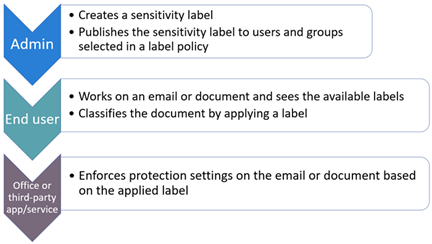

# Datenschutzbestimmungen unterliegende Informationen schützen

In Ihrem Abonnement können eine Reihe von Informationsschutzsteuerelementen verwendet werden, um die Anforderungen und Vorschriften zur Einhaltung der Datenschutzbestimmungen zu erfüllen. Dazu gehören die Allgemeine Datenschutzverordnung (DSGVO), HIPAA-HITECH (us Health Care Privacy Act), California Consumer Protection Act (CCPA) und das Brazil Data Protection Act (LGPD).

Diese Steuerelemente befinden sich in den folgenden Lösungsbereichen:

- Vertraulichkeitsbezeichnungen
- Verhinderung von Datenverlusten (Data Loss Prevention, DLP)
- Office-Nachrichtenverschlüsselung (Office Message Encryption, OME)
- Zugriffssteuerungen für Teams und Websites

>[!Note]
>Diese Lösung beschreibt Sicherheits- und Compliancefeatures zum Schutz von Informationen, die den Datenschutzbestimmungen unterliegen. Eine vollständige Liste der Sicherheitsfeatures in Microsoft 365 finden Sie in [der Microsoft 365-Sicherheitsdokumentation](https://docs.microsoft.com/microsoft-365/security/). Eine vollständige Liste der Compliancefeatures in Microsoft 365 finden Sie in [der Microsoft 365-Compliancedokumentation](https://docs.microsoft.com/microsoft-365/compliance/).
>

## Datenschutzbestimmungen, die Auswirkungen auf Die Kontrollen zum Schutz von Informationen haben

Im Folgenden finden Sie eine Beispielliste der Datenschutzbestimmungen, die sich auf Steuerelemente zum Schutz von Informationen beziehen können:

- Artikel 5(1)(f)) der DSGVO
- Artikel zur DSGVO (32)(1)(a)
- LGPD Artikel 46
- HIPAA-HITECH (45 CFR 164.312(e)(1))
- HIPAA-HITECH (45 C.F.R. 164.312(e)(2)(ii))

Weitere Informationen [zu den](information-protection-deploy-assess.md) oben genannten Themen finden Sie im Artikel zum Bewerten von Datenschutzrisiken und Identifizieren vertraulicher Elemente.

Datenschutzbestimmungen für den Informationsschutz empfehlen:

- Schutz vor Verlust oder unbefugtem Zugriff, Nutzung und/oder Übertragung.
- Risikobasierte Anwendung von Schutzmechanismen.
- Verwendung der Verschlüsselung, sofern erforderlich.

Ihre Organisation möchte Microsoft 365-Inhalte möglicherweise auch für andere Zwecke schützen, z. B. für andere Complianceanforderungen oder aus geschäftlichen Gründen. Die Einrichtung Ihres Informationsschutzschemas für den Datenschutz sollte im Rahmen der allgemeinen Planung, Implementierung und Verwaltung des Informationsschutzes durchgeführt werden.

Damit Sie mit einem Informationsschutzschema in Microsoft 365 beginnen können, enthält der folgende Abschnitt eine kurze Liste der zugehörigen Funktionen und Verbesserungsmaßnahmen für Microsoft 365. Die Liste enthält Funktionen und Verbesserungsmaßnahmen, die für Datenschutzbestimmungen gelten. Die Liste enthält jedoch keine älteren Technologien, wenn es eine neuere Funktion gibt, die die ältere weitgehend ersetzt. Beispielsweise ist die Verwaltung von Informationsrechten (Information Rights Management, IRM) für SharePoint und OneDrive nicht in der Liste enthalten, aber Vertraulichkeitsbezeichnungen sind enthalten.

## Verwalten des Informationsschutzes in Microsoft 365

Microsoft [Information Protection-Lösungen](../compliance/information-protection.md) umfassen eine Reihe von integrierten Funktionen in Microsoft 365, Microsoft Azure und Microsoft Windows. In Microsoft 365 umfassen Informationsschutzlösungen Folgendes:

- [Dienstverschlüsselung mit Kundenschlüssel](../compliance/customer-key-overview.md)
- [Typen vertraulicher Informationen](../compliance/what-the-sensitive-information-types-look-for.md) (beschrieben im Artikel "Bewerten von Datenschutzrisiken und Identifizieren [vertraulicher Elemente")](information-protection-deploy-assess.md)
- [Vertraulichkeitsbezeichnungen](../compliance/sensitivity-labels.md) 
  - Dienst-/Containerebene
  - Clientseitige/Inhaltsebene
  - Automatisiert für Ruhedaten in SharePoint und OneDrive
- Verhinderung von Datenverlust (Data Loss Prevention, DLP)
- [Verhinderung von Datenverlust in Microsoft 365 Endpoint](../compliance/endpoint-dlp-learn-about.md)
- [Office 365 Message Encryption New Capabilities (OME)](../compliance/ome.md) und OME [Advanced Message Encryption](../compliance/ome-advanced-message-encryption.md)

Darüber hinaus sind Der Schutz auf Website- und Bibliotheksebene wichtige Mechanismen, die in ein beliebiges Schutzschema mit ein-/ausggg.

Weitere Informationen zu anderen Informationsschutzfunktionen außerhalb von Microsoft 365 finden Sie unter:

- [Microsoft Cloud Application Security (MCAS)](https://docs.microsoft.com/cloud-app-security/)
- [Azure Information Protection](https://docs.microsoft.com/azure/information-protection/what-is-information-protection)
- [Microsoft Endpoint Manager](https://www.microsoft.com/microsoft-365/microsoft-endpoint-manager)
- [Windows Information Protection](https://docs.microsoft.com/windows/security/information-protection/windows-information-protection/protect-enterprise-data-using-wip)

## Vertraulichkeitsbezeichnungen

Mit Vertraulichkeitsbezeichnungen aus dem Microsoft Information Protection-Framework können Sie die Daten Ihrer Organisation klassifizieren und schützen, ohne die Produktivität der Benutzer und deren Zusammenarbeit zu beeinträchtigen.

### Voraussetzungen für Vertraulichkeitsbezeichnungen

Führen Sie diese Aktivitäten aus, bevor Sie eine der unten hervorgehobenen Funktionen für Vertraulichkeitsbezeichnungen implementieren:

1. Verstehen Sie Folgendes:
   - **Geschäftsanforderungen.** Legen Sie die geschäftlichen Gründe für die Anwendung von Vertraulichkeitsbezeichnungen in Ihrem Unternehmen fest. Beispielsweise ihre Datenschutzanforderungen für den Informationsschutz.
   - **Vertraulichkeitsbezeichnungsfunktionen.** Die Vertraulichkeitsbezeichnung kann komplex werden. Lesen Sie daher unbedingt die Dokumentation zu [Vertraulichkeitsbezeichnungen,](../compliance/sensitivity-labels.md) bevor Sie beginnen.
   - **Wichtige Dinge, die Sie sich merken sollten** Vertraulichkeitsbezeichnungen werden im Microsoft Compliance Admin Center verwaltet, die Ziel- und Anwendungsoptionen variieren jedoch erheblich.
      - Es gibt Vertraulichkeitsbezeichnungen für Websites, Gruppen und Teams auf Containerebene (die Einstellungen gelten nicht für Inhalte innerhalb des Containers). Diese werden für Benutzer und Gruppen veröffentlicht, die sie anwenden, wenn eine Website, eine Gruppe oder ein Team bereitgestellt wird.
      - Es gibt Vertraulichkeitsbezeichnungen für aktive Inhalte. Diese werden auch für Benutzer oder Gruppen veröffentlicht, die sie entweder manuell anwenden, oder sie werden automatisch angewendet, wenn:
        - Die Datei wird entweder auf dem Desktop des Benutzers oder auf einer SharePoint-Website geöffnet/bearbeitet/gespeichert.
        - Eine E-Mail wird verfasst und gesendet.
      - Es gibt Vertraulichkeitsbezeichnungen für die automatische Anwendung auf dateien in Ruhe in SharePoint und OneDrive sowie E-Mails, die über Exchange übertragen werden. Diese gelten entweder für alle Websites oder für bestimmte Websites und gelten automatisch für die dateien, die in diesen Umgebungen im Ruhe sind.

2. Rationalisieren der aktuellen Vertraulichkeitsbezeichnung mit früheren oder alternativen Methoden

   - Azure Information Protection

      Das aktuelle Vertraulichkeitsbezeichnungsschema muss möglicherweise mit jeder vorhandenen Azure Information Protection-Bezeichnungsimplementierungsimplementierung abgestimmt werden. 
   - OME

      Wenn Sie planen, moderne Vertraulichkeitsbezeichnungen für den E-Mail-Schutz zu verwenden, und vorhandene E-Mail-Verschlüsselungsmethoden wie OME vorhanden sind, können sie koexistent sein, Aber Sie sollten die Szenarien verstehen, in denen beides angewendet werden sollte. Weitere Informationen finden Sie unter [Office 365 Message Encryption New Capabilities (OME),](#office-365-message-encryption-ome-new-capabilities)die eine Tabelle enthält, in der der Moderne Schutz von Vertraulichkeitsbezeichnungen mit OME-basiertem Schutz verglichen wird.

3. Planen der Integration in ein umfassenderes Informationsschutzsystem. Neben der Koexistenz mit OME können aktuelle Vertraulichkeitsbezeichnungen zusammen mit Funktionen wie Microsoft 365 Data Loss Prevention (DLP) und Microsoft Cloud App Security verwendet werden. Informationen zum Erreichen Ihrer Datenschutzziele finden Sie unter Vertraulichkeitsbezeichnungen und [Microsoft Cloud App Security.](../compliance/sensitivity-labels.md#sensitivity-labels-and-microsoft-cloud-app-security)

4. Entwickeln sie ein Klassifizierungs- und Steuerungsschema für Vertraulichkeitsbezeichnungen. Weitere [Informationen finden Sie unter Taxonomie von Datenklassifizierung und Vertraulichkeitsbezeichnungen.](https://aka.ms/dataclassificationwhitepaper)

### Allgemeine Hinweise

1. **Schemadefinition.** Bevor Sie technische Funktionen zum Anwenden von Bezeichnungen und Schutz verwenden, arbeiten Sie in Ihrer Organisation an der Definition eines Klassifizierungsschemas. Möglicherweise verfügen Sie bereits über ein Klassifizierungsschema, das das Hinzufügen personenbezogener Daten erleichtert. 
2. **Erste Schritte.** Entscheiden Sie zunächst über die Anzahl und namen der zu implementierende Bezeichnungen. Machen Sie diese Aktivität, ohne sich Gedanken darüber zu machen, welche Technologie verwendet werden soll und wie Bezeichnungen angewendet werden. Wenden Sie dieses Schema universell in Ihrer gesamten Organisation an, einschließlich Daten, die sich lokal und in anderen Clouddiensten befinden.
3. **Zusätzliche Empfehlungen** Berücksichtigen Sie beim Entwerfen und Implementieren von Richtlinien, Bezeichnungen und Bedingungen die folgenden Empfehlungen:

   - **Verwenden Sie vorhandenes Klassifikationsschema (sofern vorhanden).** Viele Organisationen verwenden die Datenklassifizierung bereits in einer bestimmten Form. Werten Sie das vorhandene Bezeichnungsschema sorgfältig aus, und verwenden Sie es nach Möglichkeit wie folgt. Die Verwendung vertrauter Bezeichnungen, die für Ihre Endbenutzer erkennbar sind, wird die Akzeptanz an sich nen.
   - **Starten Sie klein.** Die Anzahl der Bezeichnungen, die Sie erstellen können, ist praktisch nicht begrenzt. Eine große Anzahl von Bezeichnungen und Unterbezeichnungen kann jedoch die Einführung verlangsamen.
   - **Verwenden Sie Szenarien und Anwendungsfälle.** Identifizieren Sie häufige Anwendungsfälle in Ihrer Organisation, und verwenden Sie Szenarien, die aus den Datenschutzbestimmungen abgeleitet sind, denen Sie unterliegen. Überprüfen Sie, ob die envisionierte Bezeichnungs- und Klassifizierungskonfiguration in der Praxis funktioniert.
   - **Stellen Sie jede Anforderung für eine neue Bezeichnung in Frage.** Benötigt jedes Szenario oder jeden Fall wirklich eine neue Bezeichnung, oder können Sie die bereits vorhandenen Bezeichnungen verwenden? Die Anzahl der Bezeichnungen auf ein Minimum zu beschränken, verbessert die Akzeptanz.
   - **Verwenden Sie Unterbezeichnungen für wichtige Abteilungen.** Einige Abteilungen haben spezielle Anforderungen, die bestimmte Bezeichnungen erfordern. Definieren Sie diese Bezeichnungen als Unterbezeichnungen für eine vorhandene Bezeichnung, und erwägen Sie die Verwendung bereichsbenutzerdefinierter Richtlinien, die Benutzergruppen anstelle von global zugewiesen sind.
   - **Berücksichtigen Sie Bereichsrichtlinien.** Richtlinien, die auf Teilmengen von Benutzern ausgerichtet sind, verhindern eine Bezeichnungsüberladung. Eine bereichsspezifische Richtlinie ermöglicht das Zuweisen von rollen- oder abteilungsspezifischen Bezeichnungen oder Unterbezeichnungen nur mitarbeitern, die für diese bestimmte Abteilung arbeiten. 
   - **Verwenden Sie aussagekräftige Bezeichnungsnamen.** Versuchen Sie nicht, Jargon, Standards oder Akronyme als Bezeichnungsnamen zu verwenden. Versuchen Sie, Namen zu verwenden, die mit dem Endbenutzer schwingen, um die Akzeptanz zu verbessern. Anstatt Bezeichnungen wie PII, PCI, HIPAA, LBI, MBI und HBI zu verwenden, sollten Sie Namen wie Non-Business, Public, General, Confidential und Highly Confidential berücksichtigen.

### Erstellen und Bereitstellen von Vertraulichkeitsbezeichnungen für Websites, Gruppen und Teams

Wenn Sie [Vertraulichkeitsbezeichnungen](../compliance/sensitivity-labels-teams-groups-sites.md) im Microsoft 365 Compliance Center erstellen, können Sie sie jetzt auf die folgenden Container anwenden:

- Microsoft Teams-Websites
- Microsoft 365-Gruppen (früher Office 365-Gruppen)
- Microsoft Office SharePoint Online-Websites

Verwenden Sie die folgenden Bezeichnungseinstellungen zum Schutz von Inhalt in diesen Containern:

- Datenschutz (öffentlich oder privat) von Microsoft 365-Gruppen-verbundenen Teams-Websites
- Zugriff externer Benutzer
- Zugriff von nicht verwalteten Geräten aus

Um die externe Freigabe für Container zu verhindern, die zum Speichern von Inhalten mit vertraulichen personenbezogenen Daten verwendet werden, markieren Sie die Dateien, die die Daten enthalten, als privat und erfordern verwaltete Geräte.

### Erstellen und Bereitstellen von Vertraulichkeitsbezeichnungen für Inhalte

Vertraulichkeitsbezeichnungen, die auf Dateien angewendet werden, ermöglichen es Ihnen, ihre Inhalte zu verschlüsseln, den Inhalt mit Wasserzeichen zu versehen und andere Steuerelemente für Inhalte von Office-Anwendungen zu definieren, einschließlich Outlook und Office im Web.

Wenn Sie mit dem Schutz der Daten Ihrer Organisation mit Vertraulichkeitsbezeichnungen beginnen möchten:

1. **Erstellen Sie die Bezeichnungen.** Erstellen und benennen Sie Ihre Vertraulichkeitsbezeichnungen gemäß der Klassifizierungstaxonomie Ihrer Organisation für unterschiedliche Vertraulichkeitsstufen von Inhalten. Weitere Informationen zum Entwickeln einer Klassifikationstaxonomie finden Sie im Whitepaper zur Datenklassifizierung und [Vertraulichkeitsbezeichnungstaxonomie](https://aka.ms/dataclassificationwhitepaper).
2. **Legen Sie fest, wozu jede einzelne Bezeichnung dient.** Konfigurieren Sie die Schutzeinstellungen, die mit den einzelnen Bezeichnungen verknüpft werden sollen. Beispielsweise möchten Sie, dass inhalte mit niedriger Vertraulichkeit (z. B. eine Bezeichnung "Allgemein") nur eine Kopf- oder Fußzeile angewendet werden, während inhalte mit höherer Vertraulichkeit (z. B. eine Bezeichnung "Vertraulich") ein Wasserzeichen haben und die Verschlüsselung aktiviert sein sollten.
3. **Veröffentlichen Sie die Bezeichnungen.** Nachdem Sie die Vertraulichkeitsbezeichnungen konfiguriert haben, können Sie sie mithilfe einer Bezeichnungsrichtlinie veröffentlichen. Legen Sie fest, welche Benutzer und Gruppen die Bezeichnungen haben sollen und welche Richtlinieneinstellungen verwendet werden. Eine einzelne Bezeichnung kann wiederverwendbar werden. Sie definieren ihn einmal und können ihn dann in mehrere Bezeichnungsrichtlinien für verschiedene Benutzer einbe fügen.

Nachdem Sie Vertraulichkeitsbezeichnungen aus dem Microsoft 365 Compliance Center veröffentlicht haben, werden sie in [Office-Apps](../compliance/sensitivity-labels-office-apps.md) angezeigt, damit Benutzer Inhalte beim Erstellen oder Bearbeiten klassifizieren und schützen können.

Für den Datenschutz wenden Sie manuell eine Vertraulichkeitsbezeichnung mit Verschlüsselung und anderen Regeln auf E-Mails oder Inhalte an, die vertrauliche persönliche Informationen enthalten.

>[!Note]
>Vertraulichkeitsbezeichnungen mit aktivierter Verschlüsselung, die auf E-Mails angewendet werden, haben überlappende Funktionen mit OME. Weitere [Informationen finden Sie unter Vergleich sicherer E-Mail-Szenarien mit OME und Vertraulichkeitsbezeichnungen.](#secure-email-scenarios-comparison-with-ome-and-sensitivity-labels)

### Clientseitige automatische Bezeichnung, wenn Benutzer Dokumente bearbeiten oder E-Mails verfassen

Wenn Sie eine Vertraulichkeitsbezeichnung  erstellen, können Sie diese Bezeichnung automatisch Inhalten einschließlich E-Mails zuweisen, wenn sie den von Ihnen angegebenen Bedingungen entspricht.

Die Möglichkeit, Vertraulichkeitsbezeichnungen automatisch auf Inhalte anzuwenden, ist aus den folgenden Gründen wichtig:

- Sie müssen die Benutzer nicht schulen, damit sie alle Ihre Klassifizierungen kennen.
- Sie müssen sich nicht darauf verlassen, dass die Benutzer alle Inhalte richtig klassifizieren.
- Benutzer müssen nicht mehr über Ihre Richtlinien Bescheid wissen, sondern können sich stattdessen auf ihre Arbeit konzentrieren.

Die automatische Bezeichnung unterstützt das Empfehlen einer Bezeichnung für Benutzer sowie das automatische Anwenden einer Bezeichnung. In beiden Fällen entscheidet der Benutzer aber, ob die Bezeichnung angenommen oder abgelehnt werden soll, um die richtige Bezeichnung von Inhalten zu gewährleisten.

Diese clientseitige Beschriftung hat nur minimale Verzögerungen für Dokumente, da die Bezeichnung noch vor dem Speichern des Dokuments angewendet werden kann. Allerdings unterstützen nicht alle Client-Apps die automatische Bezeichnung. Diese Funktion wird vom Azure Information Protection Unified Labeling Client und einigen [Versionen von Office-Apps unterstützt.](../compliance/sensitivity-labels-office-apps.md#support-for-sensitivity-label-capabilities-in-apps)

Konfigurationsanweisungen finden Sie unter [Konfigurieren der automatischen Bezeichnung für Office-Apps](../compliance/sensitivity-labels-office-apps.md#support-for-sensitivity-label-capabilities-in-apps).

Für den Datenschutz wenden Sie Vertraulichkeitsbezeichnungen automatisch auf Inhalte an, die vertrauliche persönliche Informationen enthalten.

### Dienstseitige automatische Bezeichnung, wenn Inhalte bereits gespeichert werden

Diese Methode wird Autoklassifizierung mit Vertraulichkeitsbezeichnungen genannt. Sie können auch hören, dass es als automatische Bezeichnung für Ruhedaten (für Dokumente in SharePoint und OneDrive) und Daten während der Übertragung (für E-Mails, die von Exchange gesendet oder empfangen werden) bezeichnet wird. Für Exchange enthält es keine E-Mails in postfächern in ruhen.
 
Da diese Bezeichnung vom Dienst selbst und nicht von der Benutzeranwendung angewendet wird, müssen Sie sich keine Gedanken darüber machen, welche Apps Benutzer haben und welche Version. Dies hat zur Folge, dass diese Funktion sofort in ihrer gesamten Organisation zur Verfügung steht, und sie eignet sich für Bezeichnungen jeder Größe. Richtlinien zum automatischen Bezeichnen unterstützen die empfohlene Bezeichnung nicht, da der Benutzer nicht mit dem Bezeichnungsprozess interagiert. Stattdessen führt der Administrator die Richtlinien im Simulationsmodus aus, um sicherzustellen, dass der Inhalt korrekt bezeichnet wird, bevor die Bezeichnung tatsächlich angewendet wird.

Konfigurationsanweisungen finden Sie unter [Konfigurieren automatischer Bezeichnungsrichtlinien für SharePoint, OneDrive und Exchange](../compliance/apply-sensitivity-label-automatically.md#how-to-configure-auto-labeling-policies-for-sharepoint-onedrive-and-exchange).

Push-Vertraulichkeitsbezeichnungen für die automatische Verschlüsselung von Inhalten mit vertraulichen personenbezogenen Informationen für den Datenschutz auf Websites, die betroffen sind.

## Verhinderung von Datenverlust 

Sie können die Verhinderung von Datenverlust [(Data Loss Prevention, DLP)](../compliance/data-loss-prevention-policies.md) in Microsoft 365 verwenden, um riskante, unbeabsichtigte oder unangemessene Freigaben zu erkennen, zu warnen und zu blockieren, z. B. die freigabe von Daten, die persönliche Informationen enthalten, sowohl intern als auch extern.

Mit DLP können Sie:

- Identifizieren und Überwachen riskanter Freigabeaktivitäten.
- Schulen Sie Benutzer mit kontextbezogenen Anleitungen, um die richtigen Entscheidungen zu treffen.
- Erzwingen von Datennutzungsrichtlinien für Inhalte, ohne die Produktivität zu beeinträchtigen.
- Integration in Klassifizierung und Bezeichnung, um Daten zu erkennen und zu schützen, wenn sie freigegeben werden.

### Unterstützte Workloads für DLP

Mit einer #A0 im Microsoft 365 Compliance Center können Sie vertrauliche Elemente an vielen Orten in Microsoft 365 identifizieren, überwachen und automatisch schützen, z. B. Exchange Online, SharePoint, OneDrive und Microsoft Teams.

Sie können beispielsweise jedes Dokument identifizieren, das eine Kreditkartennummer enthält, die auf einer beliebigen #A0 gespeichert ist, oder Sie können nur die #A1 bestimmter Personen überwachen.

Sie können auch vertrauliche Elemente in den lokal installierten Versionen von Excel, PowerPoint und Word überwachen und schützen. Dazu gehören die Möglichkeit, vertrauliche Elemente zu identifizieren und DLP-Richtlinien anzuwenden. DLP bietet eine kontinuierliche Überwachung, wenn Personen Inhalte aus diesen Office-Apps freigeben.

Diese Abbildung zeigt ein Beispiel für den Schutz personenbezogener Daten durch DLP.

DLP wird verwendet, um ein Dokument oder eine E-Mail mit einem Integritätsdatensatz zu identifizieren und dann automatisch den Zugriff auf dieses Dokument zu sperren oder das Senden der E-Mail zu sperren. DLP benachrichtigt den Empfänger dann mit einem Richtlinientipp und sendet eine Warnung an den Endbenutzer und Administrator.

### Planen von DLP

Planen Sie Ihre DLP-Richtlinien für: 

- Ihre Geschäftlichen Anforderungen.

- Eine risikobasierte Bewertung der Organisation, wie im Artikel "Bewerten von Datenschutzrisiken und Identifizieren [vertraulicher Elemente" beschrieben.](information-protection-deploy-assess.md)

- Andere Mechanismen zum Schutz und zur Steuerung von Informationen, die in der Planung des Datenschutzes verwendet werden.

- Die vertraulichen Informationstypen, die Sie basierend auf Ihrer Bewertungsarbeit für personenbezogene Daten identifiziert haben, wie im Artikel "Bewerten von Datenschutzrisiken und Identifizieren [vertraulicher Elemente" beschrieben.](information-protection-deploy-assess.md) DLP-Richtlinienbedingungen können auf vertraulichen Informationstypen und Aufbewahrungsbezeichnungen basieren.

- Die Aufbewahrungsbezeichnungen, die Sie zum Angeben von DLP-Bedingungen benötigen. Weitere Informationen finden Sie unter Regeln von Informationen, die der Datenschutzverordnung [unterliegen, in](information-protection-deploy-govern.md) Ihrem Organisationsartikel.

- Fortlaufende Verwaltung von DLP-Richtlinien, bei der eine Person in der Organisation Richtlinien für Änderungen an typen vertraulichen Informationen, Aufbewahrungsbezeichnungen, Vorschriften und Compliancerichtlinien verwenden und optimieren muss.

Vertraulichkeitsbezeichnungen können zwar nicht in DLP-Richtlinienbedingungen verwendet werden, aber bestimmte Schutzszenarien, um den Zugriff zu verhindern, sind möglicherweise nur mit Vertraulichkeitsbezeichnungen möglich, die basierend auf vertraulichen Informationstypen automatisch angewendet werden können. Wenn eine robuste Vertraulichkeitsbezeichnung verwendet wird, überlegen Sie, ob DLP zum Erweitern des Schutzes verwendet werden soll, da:

  - DLP kann die Freigabe von Dateien verhindern. Vertraulichkeitsbezeichnungen können den Zugriff einfach verhindern.

  - DLP verfügt über detailliertere Steuerungsebenen in Bezug auf Regeln, Bedingungen und Aktionen.

  - DLP-Richtlinien können auf Chat- und Kanalnachrichten von Teams angewendet werden. Vertraulichkeitsbezeichnungen können nur auf Dokumente und E-Mails angewendet werden.

### DLP-Richtlinien

DLP-Richtlinien werden im Microsoft Compliance Admin Center konfiguriert und geben die Schutzebene, den vertraulichen Informationstyp, nach dem die Richtlinie sucht, und die Zielarbeitslasten an. Ihre grundlegenden Komponenten bestehen darin, den Schutz und die Arten von Daten zu identifizieren.

Im Folgenden finden Sie ein Beispiel für eine DLP-Richtlinie für das Bewusstsein der DSGVO.

Weitere [Informationen zum](../compliance/create-test-tune-dlp-policy.md) Erstellen und Anwenden von DLP-Richtlinien finden Sie in diesem Artikel.

### Schutzebenen für den Datenschutz

In der folgenden Tabelle sind drei Konfigurationen aufgeführt, mit deren Hilfe der Schutz mithilfe von DLP erhöht werden kann.

Die erste Konfiguration, Awareness, kann als Ausgangspunkt und Mindestschutzniveau verwendet werden, um Complianceanforderungen für Datenschutzbestimmungen zu erfüllen.

>[!Note]
>Mit dem Anstieg des Schutzniveaus nimmt die Fähigkeit der Benutzer zum Teilen und Zugreifen auf Informationen in einigen Fällen ab und kann sich potenziell auf ihre Produktivität oder die Fähigkeit auswirken, tägliche Aufgaben auszuführen.
>

Damit Ihre Mitarbeiter bei der Erhöhung der Schutzstufen weiterhin produktiv in einer sichereren Umgebung arbeiten können, nehmen Sie sich die Zeit, um sie in neuen Sicherheitsrichtlinien und -verfahren zu schulen und zu schulen.

### Beispiel für die Verwendung von Vertraulichkeitsbezeichnungen mit DLP

Vertraulichkeitsbezeichnungen können mit DLP zusammenarbeiten, um Datenschutz in einer streng regulierten Umgebung zu gewährleisten. Hier sind die wichtigsten Schritte der integrierten Bereitstellung:

1. Gesetzliche und anderweitig geschäftliche Anforderungen für den Datenschutz sind dokumentiert.
2. Zieldatenquellen, -typen und -besitz sind im Verhältnis zu Datenschutzbedenken gekennzeichnet.
3. Es wird eine allgemeine Strategie zum Erfüllen von Anforderungen und zum Schutz und Zurregieren von Datenschutz-Hotspots eingerichtet.
4. Es wird ein phasenweiser Aktionsplan für die Datenschutzkontrolle entwickelt.

Nachdem diese Elemente ermittelt wurden, können Sie vertrauliche Informationstypen, Die Taxonomie für Vertraulichkeitsbezeichnungen und DLP-Richtlinien zusammen verwenden. Diese Abbildung zeigt ein Beispiel.

[Eine größere Version dieses Bilds sehen](https://github.com/MicrosoftDocs/microsoft-365-docs/raw/public/microsoft-365/media/information-protection-deploy-protect-information/information-protection-deploy-protect-information-sensitivity-lables-dlp.png)

Im Folgenden finden Sie einige Datenschutzszenarien, in denen DLP und Vertraulichkeitsbezeichnungen verwendet werden, wie in der Abbildung dargestellt.

| Szenario | Prozess |
|:-------|:-----|
| A | <ol><li>Vertraulichkeitsbezeichnungen für Inhalte werden von einem Administrator für Benutzer und Gruppen zur manuellen oder automatischen Anwendung auf Inhalte und E-Mails veröffentlicht. </li><li>Benutzer A wendet die Bezeichnungen manuell oder automatisch bei der Interaktion mit Inhalten, mit Verschlüsselung oder anderen Einstellungen an. </li><li>Benutzer A sendet eine geschützte E-Mail oder Datei an Benutzer B, einen Gastbenutzer. </li></ol> |
| B | Die von einem Administrator für Benutzer A veröffentlichte DLP-Richtlinie verhindert, dass Benutzer A die E-Mail und/oder Datei an Benutzer B sendet. |
| C |  Vertraulichkeitsbezeichnung mit der Einstellung "Besitzer kann keine Gäste einladen" wird an Benutzer A veröffentlicht, der ein Teams-Team oder eine SharePoint-Website zur Verfügung steht. Ein anderer Benutzer der Website versucht selektiv, eine Datei mit Benutzer B zu teilen, DLP blockiert sie jedoch. |
| D | Vertraulichkeitsbezeichnungen für die automatische Anwendung auf Websiteinhalte werden auf einer oder mehreren Websites veröffentlicht und bieten eine weitere Schutzebene, was zu einer geschützten Website führt. |
|||

## Office 365 Message Encryption (OME) neue Funktionen

Personen verwenden E-Mails häufig zum Austauschen vertraulicher Elemente, z. B. Patientendaten oder Kunden- und Mitarbeiterinformationen. Die E-Mail-Nachrichtenverschlüsselung sorgt dafür, dass nur vorgesehene Empfänger verschlüsselte Nachrichten ansehen können.

Mit [OME](../compliance/ome.md)können Sie verschlüsselte Nachrichten zwischen Personen innerhalb und außerhalb Ihrer Organisation senden und empfangen. OME funktioniert mit Outlook.com, Yahoo!, Gmail und anderen E-Mail-Diensten. OME hilft sicherzustellen, dass nur beabsichtigte Empfänger Nachrichteninhalte anzeigen können.

Für den Datenschutz verwenden Sie OME, um interne Nachrichten zu schützen, die vertrauliche Elemente enthalten. Die Office 365-Nachrichtenverschlüsselung ist ein Onlinedienst, der auf Microsoft Azure Rights Management (Azure RMS) baut, das Teil von Azure Information Protection ist. Dies umfasst Verschlüsselungs-, Identitäts- und Autorisierungsrichtlinien, um Ihre E-Mails zu schützen. Sie können Nachrichten mithilfe von Vorlagen für die Rechteverwaltung, der Option Nicht weiterleiten und der Option nur verschlüsseln.

Sie können auch Nachrichtenflussregeln definieren, um diesen Schutz anzuwenden. Sie können beispielsweise eine Regel erstellen, die die Verschlüsselung aller nachrichten erfordert, die an einen bestimmten Empfänger adressiert sind, oder die bestimmte Schlüsselwörter in der Betreffzeile enthält, und außerdem angeben, dass Empfänger den Inhalt der Nachricht nicht kopieren oder drucken können.

Darüber hinaus hilft Ihnen die OME [Advanced Message Encryption,](../compliance/ome-advanced-message-encryption.md) Complianceverpflichtungen zu erfüllen, die flexiblere Kontrollen über externe Empfänger und deren Zugriff auf verschlüsselte E-Mails erfordern. Mit der erweiterten OME-Nachrichtenverschlüsselung in Microsoft 365 können Sie vertrauliche E-Mails steuern, die außerhalb der Organisation freigegeben wurden, mit automatischen Richtlinien, die typen von vertraulichen Informationen erkennen. 

Wenn Sie E-Mails für eine externe Partei freigeben müssen, können Sie für den Datenschutz ein Ablaufdatum angeben und Nachrichten widerrufen. Sie können nur ein Ablaufdatum für Nachrichten widerrufen und festlegen, die an externe Empfänger gesendet werden.

### Sicherer Vergleich von E-Mail-Szenarien mit OME und Vertraulichkeitsbezeichnungen

OME- und Vertraulichkeitsbezeichnungen, die auf E-Mails mit Verschlüsselung angewendet werden, haben überlappende Überschneidungen, daher ist es wichtig zu verstehen, für welche Szenarien eine der beiden Szenarien gelten kann, wie in dieser Tabelle dargestellt.

| Szenario | Vertraulichkeitsbezeichnungen | OME |
|:-------|:-----|:-------|
| Intern + Partner   Sichere Kommunikation und Zusammenarbeit zwischen internen Benutzern und vertrauenswürdigen Partnern | Empfehlen – Bezeichnungen mit vollständig angepasster Klassifizierung und Schutz | Ja – Nur verschlüsseln oder Schutz ohne Klassifizierung nicht weiterleiten |
| Externe Parteien   Sichere Kommunikation und Zusammenarbeit mit externen/Verbraucherbenutzern | Ja – vordefinierte Empfänger in Bezeichnung | Empfehlen – Just-in-Time-Schutz basierend auf Empfängern |
| Intern + Partner mit Ablauf/Widerruf   Steuern des Zugriffs auf E-Mails und Inhalte mit internen Benutzern und vertrauenswürdigen Partnern mit Ablauf und Widerruf | Empfehlen – vollständig angepasster Schutz mit Zugriffsdauer, Benutzer können Dateien manuell nachverfolgen und widerrufen | Nein – kein Widerruf oder Ablauf für interne E-Mails |
| Externe Parteien mit Ablauf/Widerruf   Steuern des Zugriffs auf E-Mails und Inhalte mit externen/Verbraucherbenutzern mit Ablauf und Widerruf | Ja – Benutzer kann Dateien manuell nachverfolgen | Empfehlen (E5) – Administrator kann E-Mails aus dem Security & Compliance Center widerrufen |
| Automatisches Bezeichnen   Organisation möchte E-Mails/Anlagen automatisch mit bestimmten vertraulichen Inhalten und/oder bestimmten Empfängern schützen | Recommend (E5) – Automatische Bezeichnung in Exchange- und Outlook-Clients, Erweiterte Nachrichtenflussregeln und DLP-Richtlinie | Ja – Nachrichtenflussregeln und DLP-Richtlinie mit Nur Verschlüsseln oder Nicht weiterleiten |
||||

Es gibt auch Unterschiede bei den Endbenutzer- und Administratorerfahrungen zwischen diesen beiden Methoden.

## Teams mit Schutz für hochsensible Daten

Organisationen, die planen, personenbezogene Daten zu speichern, die den Datenschutzbestimmungen in Teams unterliegen, finden Sie unter [Konfigurieren](secure-teams-security-isolation.md)eines Teams mit Sicherheitsisolation , das ausführliche Anleitungen und Konfigurationsschritte für folgende Themen enthält:

- Identitäts- und Gerätezugriff
- Erstellen eines privaten Teams
- Sperren der zugrunde liegenden Teamwebsiteberechtigungen
- Eine gruppenbasierte Vertraulichkeitsbezeichnung mit Verschlüsselung
