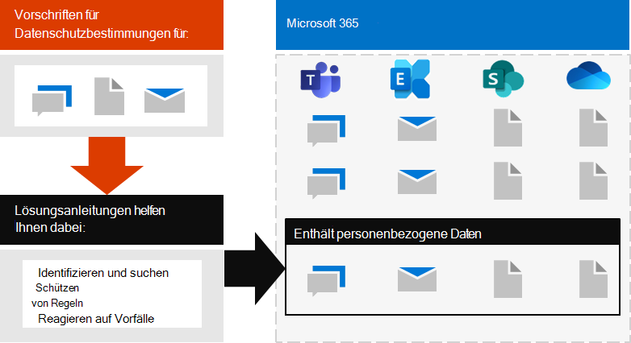

# Bereitstellen des Informationsschutzes für Datenschutzbestimmungen mit Microsoft 365Deploy information protection for data privacy regulations with Microsoft 365

Ihre Organisation unterliegt möglicherweise regionalen Datenschutzbestimmungen, die Sie zum Schutz, zur Verwaltung und zur Bereitstellung von Rechten und zur Steuerung persönlicher Informationen benötigen, die in Ihrer IT-Infrastruktur gespeichert sind, sowohl lokal als auch in der Cloud.Your organization may be subject to regional data privacy regulations that require you to protect, manage, and provide rights and control over personal information stored in your IT infrastructure, including both on-premises and in the cloud. Das beste Beispiel für eine Datenschutzverordnung ist die allgemeine Datenschutzverordnung (dsgvo) der Europäischen Union.The best example of a data privacy regulation is the European Union's General Data Protection Regulation (GDPR). Die Nichteinhaltung von Datenschutzbestimmungen kann zu erheblichen Geldbußen führen.Failure to comply with data privacy regulations can result in substantial fines.

Beispiele für die Datentypen in Microsoft 365 sind Chatsitzungen in Microsoft Teams, e-Mails in Exchange und Dateien in SharePoint und OneDrive.Examples of the types of data in Microsoft 365 include chat sessions in Microsoft Teams, emails in Exchange, and files in SharePoint and OneDrive. Diese Lösung bietet Anleitungen zum identifizieren, Auffinden, schützen, Steuern und reagieren auf Datenschutz Vorfälle für personenbezogene Daten, die in Microsoft 365-Diensten gespeichert sind und Datenschutzbestimmungen unterliegen.This solution provides guidance on how to identify, locate, protect, govern, and respond to data privacy incidents for personal data stored in Microsoft 365 services that is subject to data privacy regulations.

Weitere Informationen finden Sie auch unter Verwendung von Microsoft 365-Steuerelementen für Identitäts-, Geräte-und Bedrohungsschutz für die Datenschutzanforderungen.Additional information is also provided on the use of Microsoft 365 identity, device, and threat protection controls for your data privacy needs. 

Verwenden Sie die folgenden Microsoft 365-Funktionen und-Features, um die Kriterien zum Schutz von Informationen zur Einhaltung der Datenschutzbestimmungen zu erfüllen.To meet the criteria for protecting information for compliance with data privacy regulations, use these Microsoft 365 capabilities and features.

| Funktion oder FeatureCapability or feature | BeschreibungDescription | LizenzierungLicensing |
|:-------|:-----|:-------|
| Compliance-ManagerCompliance Manager | Verwalten von behördlichen Compliance-Aktivitäten im Zusammenhang mit Microsoft Cloud Services mit diesem workflowbasierten Risiko Bewertungstool im Microsoft Service Trust-Portal.Manage regulatory compliance activities related to Microsoft cloud services with this workflow-based risk assessment tool in the Microsoft Service Trust Portal. | Microsoft 365 E3 und E5Microsoft 365 E3 and E5 |
| Compliancebewertung (Vorschau)Compliance Score (preview) | Sehen Sie sich eine Gesamtpunktzahl Ihrer aktuellen Konformitäts Konfiguration sowie Empfehlungen zur Verbesserung des IT-Standards im Microsoft 365 Compliance Center an.See an overall score of your current compliance configuration and recommendations for improving it in the Microsoft 365 Compliance Center. | Microsoft 365 E3 und E5Microsoft 365 E3 and E5 |
| Erweiterter Office-Bedrohungsschutz (ATP)Office Advanced Threat Protection (ATP) | Schützen Sie Ihre Microsoft 365-apps und-Daten wie e-Mail-Nachrichten, Office-Dokumente und Tools für die Zusammenarbeit vor Angriffen.Protect your Microsoft 365 apps and data—such as email messages, Office documents, and collaboration tools—from attack. | Microsoft 365 E3 und E5Microsoft 365 E3 and E5 | 
| VertraulichkeitsbezeichnungenSensitivity labels | Klassifizieren und schützen Sie die Daten Ihrer Organisation, ohne die Produktivität der Benutzer und ihre Fähigkeit zur Zusammenarbeit zu beeinträchtigen, indem Sie Beschriftungen mit verschiedenen Schutzebenen in e-Mails, Dateien oder Websites platzieren.Classify and protect your organization's data without hindering the productivity of users and their ability to collaborate by placing labels with various levels of protection on email, files, or sites. | Microsoft 365 E3 und E5Microsoft 365 E3 and E5 |
| Datenverlust Schutz (DLP)Data Loss Protection (DLP) | Erkennen, warnen und Blockieren von riskanten, unbeabsichtigten oder unangemessenen Freigaben, wie beispielsweise die Freigabe von Daten, die persönliche Informationen enthalten, sowohl intern als auch extern.Detect, warn, and block risky, inadvertent, or inappropriate sharing, such as sharing of data containing personal information, both internally and externally. | Microsoft 365 E3 und E5Microsoft 365 E3 and E5 | 
| Daten Aufbewahrungs Bezeichnungen und-RichtlinienData retention labels and policies | Implementieren von Steuerelementen für die Informationssteuerung, beispielsweise, wie lange Daten und Anforderungen für die Speicherung personenbezogener Daten auf Kunden gespeichert werden, um die Richtlinien oder Daten Vorschriften Ihrer Organisation einzuhalten.Implement information governance controls, such as how long to keep data and requirements on the storage of personal data on customers, to comply with your organization's policies or data regulations. | Microsoft 365 E3 und E5Microsoft 365 E3 and E5 |
| E-Mail-VerschlüsselungEmail encryption | Senden und empfangen von verschlüsselten e-Mail-Nachrichten zwischen Personen innerhalb und außerhalb Ihrer Organisation, die regulierte Daten enthalten, beispielsweise personenbezogene Daten von Kunden.Send and receive encrypted email messages between people inside and outside your organization that contains regulated data, such as personal data on customers. | Microsoft 365 E3 und E5Microsoft 365 E3 and E5 |
||||

## Organisation der Anleitungen in dieser LösungOrganization of the guidance in this solution

Damit Sie sich mit den Microsoft 365-Tools vertraut machen können, die zum identifizieren, verwalten, Steuern und Überwachen von personenbezogenen Daten unter einer oder mehreren datenschutzbezogenen Bestimmungen verfügbar sind, sind diese Anleitungen in Abschnitten gegliedert.To help you understand the Microsoft 365 tools available to identify, manage, control, and monitor personal data subject to one or more privacy-related regulations, this guidance is organized into sections.
 

Jeder dieser Abschnitte entspricht einem separaten Artikel in dieser Lösung.Each of these sections correspond to a separate article in this solution.

>[!Note]
>Wenn Sie bereits mit ihren Datenschutzverpflichtungen vertraut sind und gegen einen vorhandenen Plan ausgeführt werden, können Sie sich auf die Anleitungen zum verhindern, schützen, beibehalten und untersuchen konzentrieren.If you are already familiar with your data privacy obligations and are executing against an existing plan, you may want to focus on the Prevent, Protect, Retain, and Investigate guidance.

>[!Important]
>Wenn Sie diese Anleitung befolgen, müssen Sie nicht unbedingt mit den Datenschutzbestimmungen konform sein, insbesondere im Hinblick auf die Anzahl der erforderlichen Schritte, die außerhalb des Kontexts der Features liegen.Following this guidance will not necessarily make you compliant with any data privacy regulation, especially considering the number of steps required that are outside the context of the features. Sie sind dafür verantwortlich, dass Sie Ihre Einhaltung sicherstellen und ihre Rechts-und Compliance-Teams konsultieren oder sich von Drittanbietern beraten lassen, die sich auf die Einhaltung von Richtlinien spezialisieren.You are responsible for ensuring your compliance and to consult your legal and compliance teams or to seek guidance and advice from third parties that specialize in compliance.
>

## Plan: Bewerten der Datenschutzrisiken und identifizieren vertraulicher ElementePlan: Assess data privacy risks and identify sensitive items 

Die Bewertung der Datenschutzbestimmungen und der Risiken, denen Ihre Organisation unterliegt, ist ein wichtiger erster Schritt, bevor Sie mit der Implementierung von Verbesserungen beginnen, einschließlich der durch die Konfiguration von Microsoft 365 erreichbaren.Assessing data privacy regulations and risks that your organization is subject to is a key first step to take before starting to implement improvements, including those achievable through Microsoft 365 configuration. Dies kann eine allgemeine Eignungsbewertung oder die Identifizierung bestimmter vertraulicher Informationstypen sein, die den von Ihrer Organisation einzuhaltenden behördlichen Kontrollen unterliegen, sowie deren Auftreten in Ihrer Microsoft 365-Umgebung.This may include an overall readiness assessment or identification of particular sensitive information types that are subject to regulatory controls your organization needs to comply with, as well as the occurrence of them in your Microsoft 365 environment.

Weitere Informationen finden Sie unter [bewerten von Datenschutzrisiken und identifizieren vertraulicher Elemente](information-protection-deploy-assess.md).For more information, see [Assess data privacy risks and identify sensitive items](information-protection-deploy-assess.md).

## Track: Use Compliance Score and Compliance ManagerTrack: Use Compliance Score and Compliance Manager 

Compliance-Score und Compliance-Manager bieten eine integrierte Reihe von Tools, die im Microsoft 365 Compliance Admin Center und in Services Trust Portal zur Verfügung stehen.Compliance Score and Compliance Manager provide an integrated set of tools available in the Microsoft 365 Compliance admin center and Services Trust Portal. Gemeinsam bieten Ihnen diese Tools eine integrierte Möglichkeit zum Nachverfolgen und Verwalten von Verbesserungs Aktionen insgesamt sowie in Bezug auf mehrere Datenschutzbestimmungen, denen Sie unterliegen.Together, these tools provide you with a built-in ability to track and manage improvement actions overall as well as those related to multiple data privacy regulations to which you are subjected.

Mit den Tools können Sie auch integrierte Bewertungs Vorlagen verwenden, die für jede Verordnung spezifisch sind, wobei Sie Aktionselemente für jede ausgewählte Bewertungs Vorlage nachverfolgen sowie bestimmte regulatorische Steuerelemente anzeigen und diese mit bestimmten Aktionen verknüpfen können.The tools also allow you to leverage built in assessment templates specific to each regulation, where you can track action items for each assessment template selected, as well as view specific regulatory controls, and relate them to specific actions.

Weitere Informationen finden Sie unter [use Compliance Score and Compliance Manager zur Verwaltung von Verbesserungs Aktionen](information-protection-deploy-compliance.md).For more information, see [Use Compliance Score and Compliance Manager to manage improvement actions](information-protection-deploy-compliance.md).

## Verhindern: Verwenden von Identitäts-, Geräte-und Bedrohungsschutz für die DatenschutzverordnungPrevent: Use identity, device, and threat protection for data privacy regulation

Microsoft 365 bietet eine Reihe von Identitäts-, Geräte-und Bedrohungsschutz Funktionen, mit denen Sie die Einhaltung von Datenschutzbestimmungen in Einklang bringen können.Microsoft 365 provides a number of identity, device, and threat protection capabilities that you can use to help comply with data privacy regulatory compliance. 

Weitere Informationen finden Sie unter [Verwenden von Identität, Gerät und Bedrohungsschutz für die Datenschutzverordnung](information-protection-deploy-identity-device-threat.md).For more information, see [Use identity, device, and threat protection for data privacy regulation](information-protection-deploy-identity-device-threat.md).

In diesem Artikel wird kurz beschrieben, was die Datenschutzbestimmungen in diesen Bereichen allgemein betreffen, und enthält eine Liste der zugehörigen Microsoft 365-Lösungen mit Links zu weiteren Informationen, die Sie bei der Erfüllung von Implementierungsanforderungen unterstützen.This article briefly describes what the data privacy regulations generally call for in these areas and provides a listing of related Microsoft 365 solutions, with links to more information to help you address any implementation requirements. 

## Schützen von Informationen unterliegen der DatenschutzverordnungProtect information subject to data privacy regulation

Die Datenschutzbestimmungen diktieren eine Reihe von Steuerelementen für den Schutz personenbezogener Daten, die in Ihrer Umgebung eingesetzt werden können, einschließlich mehr als 40 Schutz von Informations Steuerelementen in den vier Datenschutzbestimmungen in unserem Beispielsatz von dsgvo, California Consumer Protection Act (CCPA), HIPAA-HITECH (United States Health Care Privacy Act) und dem Brazil Data Protection Act (LGPD).Data privacy regulations dictate a number of personal information protection controls that can be employed in your environment, including more than forty Protect Information controls across just the four data privacy regulations in our sample set of GDPR, California Consumer Protection Act (CCPA), HIPAA-HITECH (United States health care privacy act), and the Brazil Data Protection Act (LGPD).

Weitere Informationen finden Sie unter [Schützen von Informationen unterliegender Datenschutzbestimmungen in Ihrer Organisation](information-protection-deploy-protect-information.md).For more information, see [Protect information subject to data privacy regulation in your organization](information-protection-deploy-protect-information.md).

In diesem Artikel werden die wichtigsten steuerungsschemas erläutert, die für die Adressierung von Informationsschutz Anforderungen für den Datenschutz in Ihrer Organisation verwendet werden können.This article lays out the main control schemes that can be used for addressing information protection needs for data privacy in your organization.

## Beibehalten: Informationen zur Datenschutzrichtlinie unterliegen RegelnRetain: Govern information subject to data privacy regulation

Datenschutzbestimmungen rufen Sie die Steuerelemente für die Steuerung personenbezogener Informationen, die in Ihrer Umgebung eingesetzt werden können, einschließlich mehr als vierundzwanzig Steuerelemente in den vier Datenschutzbestimmungen in unserem Beispielsatz von dsgvo, CCPA, HIPAA-HITECH und LGPD auf.Data privacy regulations call for personal information governance controls that can be employed in your environment, including more than twenty-four controls across the four data privacy regulations in our sample set of GDPR, CCPA, HIPAA-HITECH, and LGPD.

Weitere Informationen finden Sie unter [Steuern von Informationen unterliegen der Datenschutzbestimmungen in Ihrer Organisation](information-protection-deploy-govern.md).For more information, see [Govern information subject to data privacy regulation in your organization](information-protection-deploy-govern.md).

Während die Datenschutzbestimmungen vage hinsichtlich der Informationssteuerung sein können &mdash; , wie zum Beispiel gezielte Aufbewahrung, Löschung und Archivierung, werden &mdash; in diesem Artikel die primären steuerungsschemas erläutert, die Sie für den Datenschutz in Ihrer Organisation mit den Anforderungen an die Informationssteuerung verwenden können.While the data privacy regulations can be vague regarding information governance&mdash;such as purposeful retention, deletion and archiving&mdash;this article lays out the primary control schemes that you can use address information governance needs for data privacy in your organization.

## Untersuchen: überwachen und reagieren unterliegender DatenschutzverordnungInvestigate: Monitor and respond subject to data privacy regulation

Es stehen Microsoft 365-Features zur Verfügung, die Sie bei der Überprüfung, Untersuchung und Reaktion auf Datenschutz Vorfälle in Ihrer Organisation unterstützen, wenn Sie verwandte Funktionen nutzen.There are Microsoft 365 features available to help you monitor, investigate, and respond to data privacy incidents in your organization as you operationalize related capabilities. 

Es kann wichtig sein, Prozesse, Verfahren und andere Dokumentationen für diese zu untersuchen, um die Einhaltung von Regulierungsstellen zu demonstrieren.Having processes, procedures, and other documentation for each of these can be important to demonstrate compliance to regulatory bodies.

Weitere Informationen finden Sie unter [überwachen und reagieren auf Datenschutz Vorfälle in Ihrer Organisation](information-protection-deploy-monitor-respond.md).For more information, see [Monitor and respond to data privacy incidents in your organization](information-protection-deploy-monitor-respond.md).
