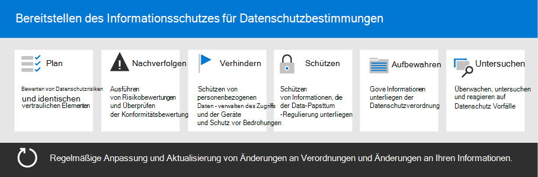

# Bereitstellen des Informationsschutzes für Datenschutzbestimmungen mit Microsoft 365

Ihre Organisation unterliegt möglicherweise regionalen Datenschutzbestimmungen, die Sie zum Schutz, zur Verwaltung und zur Bereitstellung von Rechten und zur Steuerung persönlicher Informationen benötigen, die in Ihrer IT-Infrastruktur gespeichert sind, sowohl lokal als auch in der Cloud. Das beste Beispiel für eine Datenschutzverordnung ist die allgemeine Datenschutzverordnung (dsgvo) der Europäischen Union. Die Nichteinhaltung von Datenschutzbestimmungen kann zu erheblichen Geldbußen führen.

Beispiele für die Datentypen in Microsoft 365 sind Chatsitzungen in Microsoft Teams, e-Mails in Exchange und Dateien in SharePoint und OneDrive. Diese Lösung bietet Anleitungen zum Bewerten von Risiken und zur Identifikation von Informationen, zum Schutz, zur Steuerung und zur Reaktion auf Datenschutz Vorfälle für personenbezogene Daten, die in Microsoft 365-Diensten gespeichert sind und Datenschutzbestimmungen unterliegen.

Weitere Informationen finden Sie auch unter Verwendung von Microsoft 365-Steuerelementen für Identitäts-, Geräte-und Bedrohungsschutz für die Datenschutzanforderungen. 

Verwenden Sie die folgenden Microsoft 365-Funktionen und-Features, um die Kriterien zum Schutz von Informationen zur Einhaltung der Datenschutzbestimmungen zu erfüllen.

| Funktion oder Feature | Beschreibung | Lizenzierung |
|:-------|:-----|:-------|
| Compliance-Manager | Verwalten Sie behördliche Compliance-Aktivitäten, erhalten Sie eine Gesamtpunktzahl Ihrer aktuellen Konformitäts Konfiguration und finden Sie Empfehlungen für Verbesserungen in diesem workflowbasierten Risiko Bewertungstool im Microsoft 365 Compliance Center. | Microsoft 365 E3 und E5 |
| Erweiterter Office-Bedrohungsschutz (ATP) | Schützen Sie Ihre Microsoft 365-Apps und-Daten vor Angriffen, beispielsweise E-Mails, Office-Dokumente und Tools für die Zusammenarbeit. | Microsoft 365 E3 und E5 | 
| Vertraulichkeitsbezeichnungen | Sie können die Daten Ihrer Organisation klassifizieren und schützen, ohne die Produktivität der Benutzer und ihre Fähigkeit zur Zusammenarbeit zu behindern, indem Sie Bezeichnungen mit unterschiedlichen Schutzgraden für E-Mails, Dateien oder Websites platzieren. | Microsoft 365 E3 und E5 |
| Schutz vor Datenverlust (DLP) | Sie können eine riskante, unbeabsichtigte oder unangebrachte Freigabe erkennen, warnen und blockieren. Beispielsweise die Weitergabe von Daten, die persönliche Informationen enthalten, sowohl intern als auch extern. | Microsoft 365 E3 und E5 | 
| Aufbewahrungsbezeichnungen und Bezeichnungsrichtlinien | Implementieren Sie Kontrollmechanismen für die Informationsgovernance, z. B. wie lange Daten aufbewahrt werden und die Anforderungen für die Speicherung von persönlichen Daten von Kunden, um die Richtlinien oder Datenvorschriften Ihrer Organisation einzuhalten. | Microsoft 365 E3 und E5 |
| E-Mail-Verschlüsselung | Senden und empfangen von verschlüsselten E-Mails zwischen Personen innerhalb und außerhalb Ihrer Organisation, die geregelte Daten enthalten, z. B. persönliche Daten von Kunden. | Microsoft 365 E3 und E5 |
||||

## Organisation der Anleitungen in dieser Lösung

Damit Sie sich mit den Microsoft 365-Tools vertraut machen können, die zum identifizieren, verwalten, Steuern und Überwachen von personenbezogenen Daten unter einer oder mehreren datenschutzbezogenen Bestimmungen verfügbar sind, sind diese Anleitungen in Abschnitten gegliedert.
 

Jeder dieser Abschnitte entspricht einem separaten Artikel in dieser Lösung.

>[!Note]
>Wenn Sie bereits mit ihren Datenschutzverpflichtungen vertraut sind und gegen einen vorhandenen Plan ausgeführt werden, können Sie sich auf die Anleitungen zum verhindern, schützen, beibehalten und untersuchen konzentrieren.

>[!Important]
>Wenn Sie diese Anleitung befolgen, müssen Sie nicht unbedingt mit den Datenschutzbestimmungen konform sein, insbesondere im Hinblick auf die Anzahl der erforderlichen Schritte, die außerhalb des Kontexts der Features liegen. Sie sind dafür verantwortlich, dass Sie Ihre Einhaltung sicherstellen und ihre Rechts-und Compliance-Teams konsultieren oder sich von Drittanbietern beraten lassen, die sich auf die Einhaltung von Richtlinien spezialisieren.
>

## Plan: Bewerten der Datenschutzrisiken und identifizieren vertraulicher Elemente

Die Bewertung der Datenschutzbestimmungen und der Risiken, denen Ihre Organisation unterliegt, ist ein wichtiger erster Schritt, bevor Sie mit der Implementierung von Verbesserungen beginnen, einschließlich der durch die Konfiguration von Microsoft 365 erreichbaren. Dies kann eine allgemeine Eignungsbewertung oder die Identifizierung bestimmter vertraulicher Informationstypen sein, die den von Ihrer Organisation einzuhaltenden behördlichen Kontrollen unterliegen, sowie deren Auftreten in Ihrer Microsoft 365-Umgebung.

Weitere Informationen finden Sie unter [bewerten von Datenschutzrisiken und identifizieren vertraulicher Elemente](information-protection-deploy-assess.md).

## Track: Ausführen von Risikobewertungen und Überprüfen der Konformitätsbewertung

Compliance-Manager, verfügbar im Microsoft 365 Compliance Center, bietet Ihnen eine integrierte Möglichkeit zum Nachverfolgen und Verwalten von Verbesserungs Aktionen insgesamt sowie in Bezug auf mehrere Datenschutzbestimmungen, die für Sie gelten.

Nutzen Sie die in den einzelnen Verordnungen spezifischen Bewertungs Vorlagen, in denen Sie Aktionselemente für jede ausgewählte Bewertungs Vorlage nachverfolgen sowie bestimmte regulatorische Steuerelemente anzeigen und mit bestimmten Aktionen verknüpfen können.

Weitere Informationen finden Sie unter [Verwenden des Compliance-Managers zum Verwalten von Verbesserungs Aktionen](information-protection-deploy-compliance.md).

## Verhindern: Schützen von personenbezogenen Daten

Microsoft 365 bietet eine Reihe von Identitäts-, Geräte-und Bedrohungsschutz Funktionen, mit denen Sie die Einhaltung von Datenschutzbestimmungen in Einklang bringen können. 

Weitere Informationen finden Sie unter [Verwenden von Identität, Gerät und Bedrohungsschutz für die Datenschutzverordnung](information-protection-deploy-identity-device-threat.md).

In diesem Artikel wird kurz beschrieben, was die Datenschutzbestimmungen in diesen Bereichen allgemein betreffen, und enthält eine Liste der zugehörigen Microsoft 365-Lösungen mit Links zu weiteren Informationen, die Sie bei der Erfüllung von Implementierungsanforderungen unterstützen. 

## Schützen von Informationen unterliegen der Datenschutzverordnung

Die Datenschutzbestimmungen diktieren eine Reihe von Steuerelementen für den Schutz personenbezogener Daten, die in Ihrer Umgebung eingesetzt werden können, einschließlich mehr als 40 Schutz von Informations Steuerelementen in den vier Datenschutzbestimmungen in unserem Beispielsatz von dsgvo, California Consumer Protection Act (CCPA), HIPAA-HITECH (United States Health Care Privacy Act) und dem Brazil Data Protection Act (LGPD).

Weitere Informationen finden Sie unter [Schützen von Informationen unterliegender Datenschutzbestimmungen in Ihrer Organisation](information-protection-deploy-protect-information.md).

In diesem Artikel werden die wichtigsten steuerungsschemas erläutert, die für die Adressierung von Informationsschutz Anforderungen für den Datenschutz in Ihrer Organisation verwendet werden können.

## Beibehalten: Informationen zur Datenschutzrichtlinie unterliegen Regeln

Datenschutzbestimmungen rufen Sie die Steuerelemente für die Steuerung personenbezogener Informationen, die in Ihrer Umgebung eingesetzt werden können, einschließlich mehr als vierundzwanzig Steuerelemente in den vier Datenschutzbestimmungen in unserem Beispielsatz von dsgvo, CCPA, HIPAA-HITECH und LGPD auf.

Weitere Informationen finden Sie unter [Steuern von Informationen unterliegen der Datenschutzbestimmungen in Ihrer Organisation](information-protection-deploy-govern.md).

Während die Datenschutzbestimmungen vage hinsichtlich der Informationssteuerung sein können &mdash; , wie zum Beispiel gezielte Aufbewahrung, Löschung und Archivierung, werden &mdash; in diesem Artikel die primären steuerungsschemas erläutert, die Sie für den Datenschutz in Ihrer Organisation mit den Anforderungen an die Informationssteuerung verwenden können.

## Untersuchen: überwachen, untersuchen und reagieren auf Datenschutz Vorfälle

Es stehen Microsoft 365-Features zur Verfügung, die Sie bei der Überprüfung, Untersuchung und Reaktion auf Datenschutz Vorfälle in Ihrer Organisation unterstützen, wenn Sie verwandte Funktionen nutzen. 

Es kann wichtig sein, Prozesse, Verfahren und andere Dokumentationen für diese zu untersuchen, um die Einhaltung von Regulierungsstellen zu demonstrieren.

Weitere Informationen finden Sie unter [überwachen und reagieren auf Datenschutz Vorfälle in Ihrer Organisation](information-protection-deploy-monitor-respond.md).
